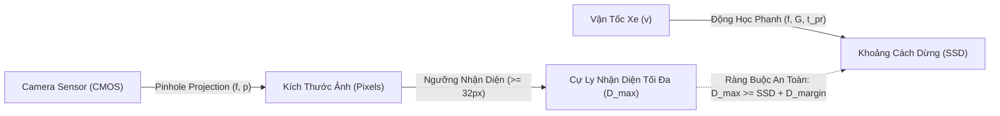

# Product Requirements Document (PRD) — ADAS Traffic Sign Recognition (TSR) Baseline

> **Thứ tự đọc:** 0 — Bản đặc tả yêu cầu sản phẩm và cơ sở lý thuyết toán học ban đầu. Đọc trước Narrative trong `research/1.narrative/01.prototype_to_production.md`.
>
> **Mục tiêu file này:** Xác lập khung yêu cầu kỹ thuật định lượng (PRD), giải thích toàn bộ thuật ngữ chuyên ngành, xây dựng mô hình toán học quang học - động học xe, phân tích bài toán khoảng cách dừng phanh (SSD) tại Việt Nam theo **QCVN 41:2019/BGTVT**, và cung cấp ma trận truy xuất nguồn gốc (Traceability Matrix).
>
> **Phạm vi ngoài lề:** Thiết kế chi tiết từng layer mạng nơ-ron hoặc cấu hình tham số CLI được trình bày chuyên sâu tại `research/3.implementation/`.

---

## 1. Bảng Thuật Ngữ & Định Nghĩa Kỹ Thuật (Terminology & Definitions)

Nhằm đảm bảo tính chính xác kỹ thuật và tránh ngộ nhận khái niệm, các thuật ngữ cốt lõi trong hệ thống TSR được định nghĩa chuẩn hóa như sau:

| Thuật ngữ | Tên tiếng Anh đầy đủ | Định nghĩa chuẩn kỹ thuật | Ý nghĩa trong hệ thống TSR |
|:---|:---|:---|:---|
| **TSR** | Traffic Sign Recognition | Hệ thống thị giác máy tính tự động phát hiện, định vị và phân loại biển báo giao thông từ luồng video phía trước xe. | Cung cấp thông tin tốc độ giới hạn và biển cảnh báo cho bộ điều khiển ADAS và người lái. |
| **ADAS** | Advanced Driver Assistance Systems | Các hệ thống điện tử hỗ trợ người lái phương tiện, nâng cao an toàn và tiện nghi vận hành. | TSR là tính năng nhận thức thuộc ADAS Cấp độ 1–2 (SAE L1–L2) hoặc làm đầu vào cho L3+. |
| **ISA / SLIF** | Intelligent Speed Assistance / Speed Limit Information Function | Hệ thống thông tin giới hạn tốc độ và cảnh báo/can thiệp giới hạn tốc độ chủ động trên phương tiện theo quy định **UNECE R89 / Euro NCAP**. | TSR là nguồn cung cấp dữ liệu biển báo tốc độ thời gian thực kết hợp với bản đồ số (HD Map). |
| **ODD** | Operational Design Domain | Miền điều kiện vận hành thiết kế (thời tiết, ánh sáng, loại đường, dải vận tốc) mà tại đó hệ thống cam kết hoạt động an toàn theo **ISO 21448 (SOTIF)**. | Xác định giới hạn cam kết của TSR: ví dụ chỉ hoạt động tin cậy khi tầm nhìn $\ge 50\text{ m}$, không mưa bão mù mịt. |
| **EROI** | Effective Region of Interest | Vùng không gian ảnh chứa xác suất xuất hiện biển báo cao nhất (thường là 1/3 phía trên và lề phải đường theo luật giao thông đi bên phải). | Giúp giảm chi phí tính toán cho các giải thuật tiền xử lý, kiểm tra chất lượng ảnh (IQA) và nhánh heuristic CV. |
| **SSD** | Stopping Sight Distance | Khoảng cách tầm nhìn dừng xe an toàn tối thiểu tính từ lúc người lái nhận biết chướng ngại vật đến khi xe dừng hẳn. | Là căn cứ vật lý bắt buộc để tính toán cự ly nhận diện biển tối thiểu ($D_{min}$) của camera TSR. |
| **Latency Budget** | End-to-End Latency Budget | Tổng thời gian trễ cho phép từ khi photon đập vào cảm biến CMOS cho đến khi icon biển báo xuất hiện trên màn hình taplo (HMI) hoặc phát tiếng chuông báo. | Nếu độ trễ vượt ngân sách, cảnh báo sẽ phát ra sau khi xe đã vượt qua biển báo, làm mất hoàn toàn giá trị an toàn. |
| **Degraded Mode** | Graceful Degradation State | Trạng thái hệ thống chủ động cắt giảm chức năng phụ hoặc hạ độ phân giải khi gặp điều kiện biên bất lợi (nhiệt độ cao, thiếu sáng, CPU quá tải) để duy trì an toàn. | Chuyển từ hiển thị cảnh báo tin cậy sang báo trạng thái suy giảm (DEGRADED) cho người lái, tránh phát cảnh báo sai lệch. |
| **mAP@0.5** | Mean Average Precision at IoU 0.5 | Độ chính xác trung bình của bộ phát hiện vật thể khi ngưỡng giao cắt trên hợp (Intersection-over-Union) đạt từ 50% trở lên. | Chỉ số đánh giá năng lực phát hiện vị trí bounding box của mô hình YOLO baseline. |
| **QCVN 41** | QCVN 41:2019/BGTVT | Quy chuẩn kỹ thuật quốc gia về báo hiệu đường bộ của Bộ Giao thông Vận tải Việt Nam. | Quy định kích thước vật lý, màu sắc, ký hiệu, font chữ và quy cách cắm biển trên lãnh thổ Việt Nam. |

---

## 2. Mô Hình Toán Học Quang Học & Động Lực Học Xe Cho TSR

Hệ thống TSR không chỉ là một mô hình AI chạy trong chân không, mà bị ràng buộc chặt chẽ bởi **động lực học chuyển động của ô tô** và **quang học hình học của camera**.

### 2.1. Công thức Động lực học phanh: Khoảng cách tầm nhìn dừng xe (SSD)

Theo tiêu chuẩn thiết kế đường cao tốc Việt Nam (**TCVN 5729:2012**) và cẩm nang thiết kế đường bộ quốc tế (**AASHTO Green Book**), khoảng cách tầm nhìn dừng xe an toàn ($SSD$) bao gồm quãng đường xe chạy trong thời gian nhận thức - phản xạ của người lái ($d_{react}$) và quãng đường phanh thực tế ($d_{brake}$):

$$SSD = d_{react} + d_{brake} = v \cdot t_{pr} + \frac{v^2}{2 \cdot g \cdot (f \pm G)}$$

Trong đó:

- $v$: Vận tốc chuyển động của phương tiện ($\text{m/s}$). Quy đổi từ $\text{km/h}$ sang $\text{m/s}$: $v(\text{m/s}) = \frac{v(\text{km/h})}{3.6}$.
- $t_{pr}$: Thời gian nhận thức - phản ứng của người lái (Perception-Reaction Time). Theo tiêu chuẩn AASHTO và TCVN, giá trị thiết kế an toàn chuẩn là $t_{pr} = 2.0\text{ s}$ đến $2.5\text{ s}$.
- $g$: Gia tốc trọng trường chuẩn ($g \approx 9.81\text{ m/s}^2$).
- $f$: Hệ số ma sát dọc giữa lốp xe và mặt đường (Coefficient of Longitudinal Friction):
  - Mặt đường bê tông/nhựa đường khô ráo: $f \approx 0.70 - 0.80$.
  - Mặt đường ẩm ướt do mưa nhiệt đới: $f \approx 0.35 - 0.40$.
  - Mặt đường trơn trượt có bùn/dầu: $f \approx 0.15 - 0.20$.
- $G$: Độ dốc dọc của mặt đường (độ dốc lên $+G$, độ dốc xuống $-G$, đường bằng phẳng $G = 0$).

### 2.2. Công thức Quang học hình học Camera Pinhole: Kích thước vật thể trên cảm biến

Theo mô hình camera lỗ kim (Pinhole Camera Model), mối quan hệ giữa chiều cao thực tế của biển báo ($H_{sign}$), khoảng cách từ camera tới biển báo ($D$), tiêu cự ống kính ($f$), và kích thước vật lý của pixel trên cảm biến ($p_{pixel}$) được biểu diễn qua công thức tam giác đồng dạng:

$$P_{sign} = \frac{H_{sign} \cdot f}{D \cdot p_{pixel}}$$

Trong đó:

- $P_{sign}$: Số lượng điểm ảnh (pixels) chiều cao/đường kính của biển báo trên ma trận cảm biến hình ảnh.
- $H_{sign}$: Chiều cao hoặc đường kính thực tế của biển báo giao thông tính bằng mét ($\text{m}$). Theo **QCVN 41:2019/BGTVT**:
  - Đường đô thị: Biển tròn có đường kính $D_{circle} = 0.50\text{ m} = 500\text{ mm}$.
  - Đường thông thường ngoài đô thị (Quốc lộ, Tỉnh lộ): $D_{circle} = 0.70\text{ m} = 700\text{ mm}$.
  - Đường cao tốc (Expressway): $D_{circle} = 0.875\text{ m} = 875\text{ mm}$ đến $1.26\text{ m}$ với biển chữ nhật.
- $f$: Tiêu cự hiệu dụng của hệ thấu kính quang học (focal length) tính bằng mét ($\text{m}$).
- $D$: Khoảng cách từ mặt phẳng cảm biến camera đến biển báo tính bằng mét ($\text{m}$).
- $p_{pixel}$: Kích thước vật lý của một pixel trên bề mặt cảm biến (Pixel Pitch), thường nằm trong khoảng $2.1\,\mu\text{m} - 3.0\,\mu\text{m}$ ($3.0 \times 10^{-6}\text{ m}$) đối với các cảm biến ô tô chuyên dụng như Sony IMX390 hay OnSemi AR0820.

### 2.3. Ngưỡng phân giải tối thiểu cho Deep Learning & Thuật toán truyền thống

Để mô hình thị giác máy tính nhận diện chính xác, kích thước điểm ảnh $P_{sign}$ trên ảnh đầu vào phải thỏa mãn các tiêu chí:

1. **Ngưỡng Phát Hiện (Detection Threshold)**: $P_{sign} \ge 24\text{ pixels}$. Tại ngưỡng này, mạng YOLO có thể phát hiện sự hiện diện của một vật thể dạng hình tròn hoặc tam giác.
2. **Ngưỡng Phân Loại & Đọc Số (Classification & OCR Threshold)**: $P_{sign} \ge 48\text{ pixels}$. Để phân biệt chính xác biển giới hạn tốc độ $60\text{ km/h}$ với $80\text{ km/h}$ hoặc $50\text{ km/h}$, các nét chữ số bên trong cần tối thiểu $12 - 16\text{ pixels}$ độ cao.

### 2.4. Ngân sách Độ trễ Tối đa (End-to-End Latency Budget)

Gọi $D_{detect}$ là khoảng cách xa nhất mà camera ghi nhận được biển báo với chất lượng đủ phân loại ($P_{sign} \ge 48\text{ px}$). Khi xe di chuyển với vận tốc $v$, thời gian khả dụng để hệ thống tính toán và hiển thị cảnh báo cho tài xế trước khi đạt đến khoảng cách phanh an toàn $SSD$ là:

$$T_{budget} = \frac{D_{detect} - SSD}{v}$$

---

## 3. Hai Ví Dụ Tính Toán Số Học Cụ Thể (Concrete Numerical Calculations)

### Ví dụ 1: Xe chạy trên Cao tốc Bắc - Nam (CT.01) — $120\text{ km/h}$ trong điều kiện mưa ướt

**Giả thiết bài toán:**

- Vận tốc xe: $v = 120\text{ km/h} = \frac{120}{3.6} = 33.33\text{ m/s}$.
- Điều kiện mặt đường: Mưa ẩm ướt nhiệt đới, hệ số ma sát giảm xuống $f = 0.40$. Đường bằng phẳng ($G = 0$).
- Thời gian phản xạ của tài xế: $t_{pr} = 2.0\text{ s}$.
- Camera đơn tiêu cự thông dụng: $f = 6.0\text{ mm} = 0.006\text{ m}$, kích thước pixel cảm biến $p_{pixel} = 3.0\,\mu\text{m} = 3.0 \times 10^{-6}\text{ m}$.
- Loại biển: Biển tốc độ tối đa cho phép $120\text{ km/h}$ (Biển số P.127 theo QCVN 41:2019 cắm trên cao tốc), đường kính chuẩn cao tốc $H_{sign} = 0.875\text{ m}$.

**Bước 1: Tính khoảng cách dừng xe an toàn ($SSD$)**

$$d_{react} = 33.33 \times 2.0 = 66.67\text{ m}$$

$$d_{brake} = \frac{33.33^2}{2 \times 9.81 \times 0.40} = \frac{1110.89}{7.848} \approx 141.55\text{ m}$$

$$SSD = 66.67 + 141.55 = 208.22\text{ m}$$

**Bước 2: Tính kích thước biển trên ảnh tại khoảng cách $SSD$ ($208.22\text{ m}$)**

$$P_{sign} = \frac{0.875 \times 0.006}{208.22 \times (3.0 \times 10^{-6})} = \frac{0.00525}{0.00062466} \approx 8.4\text{ pixels}$$

**Đánh giá & Kết luận kỹ thuật sâu sắc:**

- Tại khoảng cách an toàn $208.22\text{ m}$, biển báo chỉ chiếm vỏn vẹn **$8.4\text{ pixels}$** trên cảm biến! Ở độ phân giải này, biển báo chỉ là một chấm đỏ mờ, hoàn toàn **không thể nhận diện chữ số 120** bằng bất kỳ thuật toán Deep Learning hay OCR nào.
- Để đạt ngưỡng phân loại tin cậy $P_{sign} = 48\text{ pixels}$, khoảng cách phát hiện tối đa của camera $6\text{ mm}$ là: $D_{classify\_max} = \frac{0.875 \times 0.006}{48 \times (3.0 \times 10^{-6})} \approx 36.46\text{ m}$.
- Khi xe đến cách biển $36.46\text{ m}$, thời gian xe lướt qua biển chỉ còn: $t = \frac{36.46}{33.33} \approx 1.09\text{ giây}$.

- **Phát hiện quan trọng đối với kiến trúc ADAS thương mại:**
  Nếu chỉ trang bị một camera góc rộng ($f = 6\text{ mm}$, FoV $\approx 60^\circ - 70^\circ$), hệ thống TSR trên cao tốc sẽ không bao giờ cung cấp đủ thời gian phanh khẩn cấp cho tài xế trước khi tới biển.
  $\Rightarrow$ **Giải pháp bắt buộc của xe thương mại**: Cần sử dụng cụm camera đa tiêu cự (**Tri-focal Camera** giống Mobileye EyeQ hoặc Tesla Autopilot) tích hợp ống kính Telephoto ($f \ge 12\text{ mm}$, FoV $\approx 28^\circ - 30^\circ$) hoặc cảm biến độ phân giải cao $8\text{ MP}$ (4K) để đẩy cự ly nhận diện lên trên $150\text{ m} - 200\text{ m}$.

---

### Ví dụ 2: Xe chạy trong đô thị (Nội thành Hà Nội / TP.HCM) — $50\text{ km/h}$

**Giả thiết bài toán:**

- Vận tốc xe: $v = 50\text{ km/h} = \frac{50}{3.6} = 13.89\text{ m/s}$.
- Mặt đường nhựa đô thị khô ráo: $f = 0.70$. Đường bằng phẳng ($G = 0$).
- Thời gian phản xạ: $t_{pr} = 1.5\text{ s}$.
- Camera trước xe: $f = 6.0\text{ mm}$, $p_{pixel} = 3.0\,\mu\text{m}$.
- Biển báo tròn đô thị theo QCVN 41:2019: Đường kính $H_{sign} = 0.50\text{ m}$.

**Bước 1: Tính khoảng cách dừng xe ($SSD$)**

$$d_{react} = 13.89 \times 1.5 = 20.83\text{ m}$$

$$d_{brake} = \frac{13.89^2}{2 \times 9.81 \times 0.70} = \frac{192.93}{13.734} \approx 14.05\text{ m}$$

$$SSD = 20.83 + 14.05 = 34.88\text{ m}$$

**Bước 2: Xác định cự ly đọc được biển với ngưỡng $48\text{ px}$**

$$D_{detect} = \frac{0.50 \times 0.006}{48 \times (3.0 \times 10^{-6})} = \frac{0.003}{0.000144} \approx 20.83\text{ m}$$

Nếu chấp nhận phát hiện ở mức $P_{sign} = 28\text{ px}$ (đủ cho mô hình YOLO11s nhận diện vùng tròn đỏ và phân loại sơ bộ):

$$D_{detect\_28px} = \frac{0.50 \times 0.006}{28 \times (3.0 \times 10^{-6})} \approx 35.71\text{ m}$$

**Bước 3: Tính ngân sách độ trễ tối đa ($T_{budget}$)**

Tại cự ly $D = 40\text{ m}$ (khi xe còn cách điểm dừng an toàn $SSD \approx 35\text{ m}$ một đoạn $\Delta D = 5\text{ m}$):

$$T_{budget} = \frac{40 - 34.88}{13.89} = \frac{5.12}{13.89} \approx 0.368\text{ s} = 368\text{ ms}$$

**Kết luận kỹ thuật:**

- Trong đô thị, tổng độ trễ từ capture, inference, tracking, lọc trạng thái đến phát tín hiệu cảnh báo không được phép vượt quá **$368\text{ ms}$** (tương đương tối đa 11 frame ở tốc độ 30 FPS).
- Nếu pipeline mất $500\text{ ms}$ (như khi bị nghẽn queue hoặc CPU quá tải), người lái sẽ không kịp đạp phanh trước điểm dừng an toàn.

---

## 4. Bảng Tra Cứu Quy Chuẩn Biển Báo Giao Thông Việt Nam (QCVN 41:2019/BGTVT)

Dữ liệu huấn luyện và nhận diện của hệ thống TSR trong dự án được ánh xạ trực tiếp theo Quy chuẩn Kỹ thuật Quốc gia **QCVN 41:2019/BGTVT**:

| Mã Biển (QCVN 41) | Tên Gọi Kỹ Thuật | Đặc Điểm Hình Học & Màu Sắc | Kích Thước Đường Kính/Cạnh | Hình Ảnh Trích Dẫn Minh Họa | Nhãn Lớp Model (`best.pt`) |
|:---|:---|:---|:---|:---:|:---|
| **P.127** | Biển hạn chế tốc độ tối đa | Vòng tròn viền đỏ, nền trắng, chữ số đen ghi vận tốc (50, 60, 80, 100, 120). | $50\text{ cm}$ (đô thị) $70\text{ cm}$ (ngoài đô thị) $87.5\text{ cm}$ (cao tốc) |  | `P.127-50`, `P.127-60`, `P.127-80`, v.v. |
| **P.102** | Cấm đi ngược chiều | Vòng tròn nền đỏ tươi, vạch ngang màu trắng ở giữa. | $50\text{ cm}$ (đô thị) $70\text{ cm}$ (ngoài đô thị) |  | `P.102` |
| **P.130** | Cấm dừng xe và đỗ xe | Vòng tròn viền đỏ, nền xanh dương, 2 vạch chéo đỏ gạch chéo. | $50\text{ cm}$ (đô thị) $70\text{ cm}$ (ngoài đô thị) |  | `P.130` |
| **W.205** | Đường giao nhau nguy hiểm | Hình tam giác đều, viền đỏ, nền vàng phản quang, dấu chữ thập đen ở giữa. | Cạnh $70\text{ cm}$ (đô thị) Cạnh $126\text{ cm}$ (cao tốc) |  | `W.205a`, `W.205b` |
| **W.227** | Công trường đang thi công | Hình tam giác đều viền đỏ, nền vàng, hình người cầm xẻng xúc đất màu đen. | Cạnh $70\text{ cm}$ |  | `W.227` |
| **R.301** | Hướng đi phải theo | Vòng tròn nền xanh lam đậm, mũi tên màu trắng chỉ hướng bắt buộc. | $50\text{ cm}$ (đô thị) $70\text{ cm}$ (ngoài đô thị) |  | `R.301a`, `R.301b` |

> *Ghi chú bản quyền*: Hình ảnh minh họa trích dẫn từ kho tư liệu mở Wikimedia Commons theo quy chuẩn đồ họa vector chuẩn của hệ thống báo hiệu đường bộ Việt Nam.

---

## 5. Bảng Yêu Cầu PRD Định Lượng (Target Specifications)

Hệ thống được thiết kế theo 5 nhóm chỉ số cốt lõi:

| Nhóm yêu cầu | Chỉ số KPI định lượng | Phương pháp đo kiểm | Ý nghĩa an toàn ô tô |
|:---|:---|:---|:---|
| **Thông lượng (Throughput)** | $\ge 15\text{ FPS}$ (tối thiểu trên CPU nhúng), mục tiêu $\ge 30\text{ FPS}$ trên NPU/GPU. | Đo thời gian chạy vòng lặp xử lý frame liên tục trong 10 phút video. | Đảm bảo độ tươi (freshness) của dữ liệu. Nếu tốc độ rớt dưới 15 FPS, hệ thống kích hoạt Degraded Mode. |
| **Độ trễ xử lý (Latency)** | $T_{end\_to\_end} \le 100\text{ ms}$ (p95 latency) trên hardware mục tiêu. | Đánh dấu timestamp từ lúc `cv2.VideoCapture.read()` đến khi cập nhật buffer HMI. | Tránh hiện tượng cảnh báo trễ sau khi xe đã đi qua biển báo theo công thức $T_{budget}$. |
| **Độ chính xác (Accuracy)** | $\text{mAP@0.5} \ge 85\%$ trên tập kiểm thử biển Việt Nam; Tỷ lệ bỏ sót (FN) biển tốc độ $< 2\%$. | Đánh giá trên tập test chuẩn gồm 1,500 frame đường phố và quốc lộ Việt Nam. | Bỏ sót biển báo tốc độ là rủi ro an toàn loại 1 dẫn đến vi phạm luật hoặc tai nạn. |
| **Chất lượng ảnh (Image Quality Gate)** | Kiểm tra độ tương phản $CTA \ge 0.35$, độ sắc nét $Sharpness \ge 50.0$, bão hòa $Sat < 0.35$. | Module `IEEE2020CTAMonitorV2` đo kiểm tự động theo từng frame. | Ngăn chặn hiện tượng nhận diện rác khi camera bị lóa đèn pha hoặc đọng nước mưa lớn. |
| **Khả năng hiển thị HMI** | Chống chớp giật (Anti-flicker), độ trễ xác nhận $3\text{ frame}$, duy trì $Hold = 3\text{ frame}$. | State Manager FSM quản lý vòng đời biển báo. | Loại bỏ hiện tượng icon biển báo nhấp nháy liên tục gây mất tập trung cho người lái. |

---

## 6. Ma Trận Truy Xuất Nguồn Gốc Yêu Cầu (Traceability Matrix)

Ma trận sau đây kết nối từ yêu cầu bài toán đến các tiêu chuẩn kỹ thuật quốc tế và module hiện thực hóa:

| Yêu cầu PRD | Tiêu chuẩn tham chiếu | Module hiện thực hóa trong Repo | Tài liệu thiết kế chi tiết |
|:---|:---|:---|:---|
| Nhận diện biển báo Việt Nam 82 lớp | QCVN 41:2019/BGTVT | `models/best.pt` (Ultralytics YOLO11s) | [3.01. Hybrid Pipeline](3.implementation/01.hybrid_pipeline_architecture.md) |
| Kiểm soát an toàn chức năng | ISO 26262:2018 (Part 3 HARA, Part 5 HW) | `code/tsr_demo.py` (Graceful Degradation) | [2.01. Automotive Standards](2.knowledge_base/01.automotive_standards.md) |
| Kiểm soát rủi ro do môi trường mù mờ | ISO 21448:2022 (SOTIF Clause 7, 8) | `code/cta_monitor.py` (CTA, CSNR, CDP) | [2.02. Camera Hardware](2.knowledge_base/02.camera_hardware_ieee2020.md) |
| Phân tích lỗi cụm camera & ECU | ISO 26262 Part 9 (Safety Analysis HAZOP/FTA) | Cấu trúc xử lý ngoại lệ và Watchdog timeout | [2.03. Safety Analysis](2.knowledge_base/03.safety_analysis_hazop_fta.md) |
| Giao diện người lái & Chống chớp nháy | Euro NCAP SAS Protocol v10.2 | `StateManager` trong `code/tsr_demo.py` | [3.02. State Manager & HMI](3.implementation/02.state_manager_and_hmi.md) |
| Tối ưu hóa vi xử lý biên | Embedded Vision Real-Time Guidelines | `--skip`, `--imgsz`, `--max-width` CLI flags | [3.03. Edge Deployment](3.implementation/03.edge_deployment_and_benchmarks.md) |

---

## 7. Tài Liệu Viện Dẫn Chuẩn Mực (Normative References)

1. **Bộ Giao thông Vận tải Việt Nam (2019)**. *Quy chuẩn kỹ thuật quốc gia về báo hiệu đường bộ (QCVN 41:2019/BGTVT)*. Hà Nội, Việt Nam.
2. **Bộ Khoa học và Công nghệ (2012)**. *Tiêu chuẩn quốc gia TCVN 5729:2012 — Đường ô tô cao tốc: Yêu cầu thiết kế*.
3. **ISO 26262:2018**. *Road vehicles — Functional safety (Parts 1 to 12)*. International Organization for Standardization.
4. **ISO 21448:2022**. *Road vehicles — Safety of the intended functionality (SOTIF)*. International Organization for Standardization.
5. **IEEE Std 2020-2024**. *IEEE Standard for Automotive System Image Quality*. IEEE Computer Society.
6. **Euro NCAP (2023)**. *Assessment Protocol — Safety Assist: Speed Assist Systems v10.2*. European New Car Assessment Programme.
7. **AASHTO (2018)**. *A Policy on Geometric Design of Highways and Streets (7th Edition)*. American Association of State Highway and Transportation Officials.
