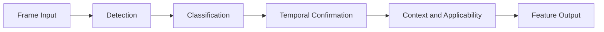
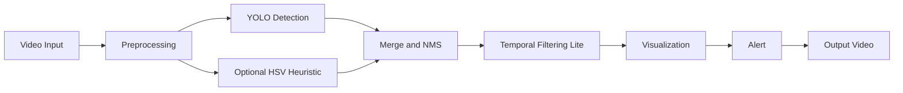
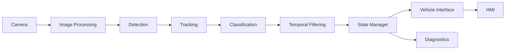

# Traffic Sign Recognition (TSR) for ADAS — Prototype to Production Narrative

> **Vai trò file này:** narrative chính của bộ tài liệu TSR.  
> **Đối tượng đọc:** Embedded Engineer, Automotive Software Engineer, Junior ADAS Engineer.  
> **Cách đọc:** đọc liên tục từ đầu đến cuối. Khi cần chiều sâu, mở các bài trong `../2.knowledge_base/`. Khi cần bằng chứng gắn repo, mở `../3.implementation/`.  
> **Nguồn phạm vi:** [0.requirements.md](../0.requirements.md)

---

## 1. Problem

Traffic Sign Recognition là bài toán biến hình ảnh giao thông thành thông tin mà hệ thống hỗ trợ lái có thể dùng được. Ở mức đơn giản nhất, hệ thống cần trả lời hai câu hỏi:

- Trong frame hiện tại có biển báo nào không?
- Nếu có, đó là biển báo gì?

Nhưng với hệ thống trên xe, hai câu hỏi đó chưa đủ. Một feature TSR thực tế còn phải trả lời:

- Biển báo đó có áp dụng cho xe ego hay không?
- Có nên hiển thị ngay cho người lái hay chờ thêm bằng chứng theo thời gian?
- Nếu ảnh xấu, runtime chậm hoặc môi trường vượt ODD thì feature phản ứng ra sao?

Đó là lý do tài liệu này không dừng ở mức detector hoặc demo overlay.

---

## 2. Background

## 2.1 TSR trong ADAS

TSR là một feature perception dựa trên camera trước. Nó thường cung cấp thông tin cho:

- `HMI`: hiển thị biển báo lên cluster hoặc HUD.
- `ISA`: dùng speed limit đã được chuẩn hóa để hỗ trợ tốc độ.
- `Logging / diagnostics`: lưu lại trạng thái feature để debug và regression.

Nếu chỉ nhìn ở mức model, TSR trông giống một bài object detection. Nếu nhìn ở mức vehicle feature, TSR là một chuỗi logic nhiều tầng từ cảm biến tới hành vi hệ thống.

## 2.2 Detector không phải feature

Detector output thường chỉ là:

- bounding box,
- class,
- confidence,
- trên từng frame độc lập.

Feature output phải đi xa hơn:

- ổn định theo thời gian,
- có policy hiển thị,
- có trạng thái availability/degraded,
- có khả năng giải thích vì sao publish hoặc suppress một sign.

Đây là khoảng cách chính giữa prototype giữa kỳ và production TSR.

## 2.3 Năm lớp xử lý cốt lõi

| Lớp | Câu hỏi cần trả lời |
|---|---|
| Detection | Có vùng nào giống biển báo không? |
| Classification | Biển đó là loại gì? |
| Temporal confirmation | Có đủ bằng chứng qua nhiều frame chưa? |
| Context and applicability | Biển đó có áp dụng cho ego vehicle không? |
| Feature output | Có nên hiển thị/cảnh báo và lưu trạng thái gì? |

Prototype hiện tại chủ yếu cover mạnh hai lớp đầu và một phần rất mỏng của lớp thứ ba.

Tham khảo sâu hơn:

- [TSR Feature Architecture](../2.knowledge_base/01.tsr_feature_architecture.md)
- [State Manager and Sign Lifecycle](../2.knowledge_base/02.state_manager_and_sign_lifecycle.md)

---

## 3. Project Requirement

Đề tài giữa kỳ yêu cầu nhóm xây dựng một hệ TSR cơ bản với các đầu ra nhìn thấy được và có thể demo trên video thực tế.

## 3.1 Input

- Video thực tế do nhóm tự thu.
- Tối thiểu 2–3 video có chứa biển báo.

## 3.2 Output

- Phát hiện biển báo trong frame.
- Nhận diện loại biển báo.
- Vẽ bounding box và tên biển báo.
- Phát cảnh báo cho một số biển quan trọng.
- Lưu video đầu ra có lớp phủ.

## 3.3 Kỹ thuật được phép dùng

Đề bài gợi ý cả hai hướng:

- Classical CV: `HSV`, `Histogram Equalization`, `Gaussian`, `Morphology`, `Contour`, `Template Matching`.
- Deep learning: `YOLO`, `Faster R-CNN`, classifier như `MobileNet`.

## 3.4 Ý nghĩa của requirement

Điểm quan trọng nhất là:

- `Prototype` là sản phẩm chính của đề tài.
- `Production mindset` là lớp tham chiếu để giúp giải thích giới hạn và hướng phát triển.

Nói cách khác, nhóm không cần giả vờ đã có production TSR, nhưng phải hiểu prototype của mình đang đứng ở đâu nếu so với production TSR.

---

## 4. Prototype Architecture

Prototype hiện tại trong repo `adas-tsr` là một baseline inference pipeline xoay quanh `code/tsr_demo.py` và model `models/best.pt`.

## 4.1 Vai trò của prototype

Prototype này dùng để:

- chạy inference trên video hoặc webcam,
- quan sát hành vi detector trên dữ liệu địa phương,
- lưu video output để demo,
- tạo nền cho phân tích gap lên production.

## 4.2 Sơ đồ tổng quát

## 4.3 Đặc điểm chính của prototype hiện tại

- Nhánh chính là `YOLO baseline`.
- Có nhánh `HSV + contour` tùy chọn để đối chiếu hoặc heuristic.
- Có `hold` để làm output video bớt chớp.
- Output chính vẫn là `overlay video`, chưa phải machine-readable feature output.

Implementation evidence:

- [Baseline Repo Analysis](../3.implementation/01.baseline_repo_analysis.md)
- Bài đọc sâu hơn: [Baseline Repo Analysis Full](../3.implementation/04.baseline_repo_analysis_full.md)

---

## 5. Prototype Pipeline

Luồng end-to-end của prototype hiện tại có thể tóm tắt như sau:

1. Đọc frame từ video hoặc webcam.
2. Resize frame theo `max_width`.
3. Chạy YOLO detector trên frame đã preprocess.
4. Tùy chọn chạy thêm nhánh heuristic dựa trên `HSV + contour`.
5. Hợp nhất detection và áp dụng NMS đơn giản.
6. Nếu frame hiện tại rỗng, dùng `hold` để giữ detection cũ trong vài frame.
7. Vẽ bbox, label và ghi video output.

Điểm kỹ thuật quan trọng:

- `hold` giúp video trông ổn định hơn.
- Nhưng `hold` không tạo `track_id`, không tạo lifecycle sign, và không nên bị hiểu nhầm là tracking thật.

---

## 6. Prototype Modules

Section này giải thích từng module theo cùng một contract:

- `Prototype`
- `Production`
- `Current Gap`
- `Impact`
- `Roadmap`

## 6.1 Input / Frame Acquisition

`Prototype`

Prototype đọc video file hoặc webcam thông qua `tsr_demo.py`. Đơn vị xử lý chính là frame ảnh độc lập.

`Production`

Production TSR nhận dữ liệu từ camera module với timestamp, trạng thái health và timing contract rõ ràng.

`Current Gap`

Prototype chưa có sensor health, chưa có metadata về timestamp hoặc stale input.

`Impact`

Khó phân biệt lỗi perception với lỗi nguồn dữ liệu; khó mở rộng sang diagnostics hoặc replay chuẩn.

`Roadmap`

Thêm frame metadata tối thiểu như `frame_id`, `timestamp_ms`, `source_status`.

## 6.2 Preprocessing

`Prototype`

Prototype hiện có resize cơ bản; nhánh classical CV có thể dùng `HSV`, `Morphology`, `Contour`. Đề bài cũng cho phép `Histogram Equalization` và `Gaussian Filter` nếu nhóm muốn tăng ổn định.

`Production`

Production thường giả định một chuỗi image conditioning rõ ràng hơn: camera ISP behavior, exposure assumption, blur/glare quality scoring và degraded policy.

`Current Gap`

Prototype chưa có quality gate chính thức cho blur, glare hoặc exposure xấu.

`Impact`

Detector vẫn chạy trên frame chất lượng thấp, gây false negative hoặc class jitter mà không có reason code giải thích.

`Roadmap`

Thêm `frame_quality_score` và các reason code như `blur_high`, `backlight`, `dark_frame`.

Tham khảo sâu hơn:

- [ODD for TSR](../2.knowledge_base/03.odd_for_tsr.md)
- [Experiment and Benchmark Guide](../3.implementation/03.experiment_benchmark_guide.md)

## 6.3 Detection

`Prototype`

Repo hiện dùng `YOLO baseline` làm nhánh chính để phát hiện biển báo. Có thể bật thêm nhánh `HSV + contour` để đối chiếu hoặc tạo candidate heuristic.

`Production`

Production detection không dừng ở bbox trên từng frame. Detector phải có confidence policy, quality-aware behavior, nguồn gốc detection rõ ràng và đầu ra sẵn sàng cho tracking/temporal logic.

`Current Gap`

Prototype chưa có calibration, chưa có per-class threshold policy, chưa có source provenance đủ rõ giữa YOLO và heuristic branch.

`Impact`

Output có thể đúng ở mức frame nhưng chưa đáng tin ở mức feature; khó giải thích khi false positive hoặc miss sign nhỏ.

`Roadmap`

- Tách rõ detection nguồn `yolo` và `heuristic`.
- Bổ sung machine-readable detection log.
- Chuẩn hóa benchmark detector trước khi bàn tới architecture mới.

Tham khảo sâu hơn:

- [Detector Architecture Overview](../2.knowledge_base/07.detector_architecture_overview.md)
- Bài đọc sâu hơn: [Detector Architecture Deep Reference](../2.knowledge_base/13.detector_architecture_deep_reference.md)

## 6.4 Classification / Recognition

`Prototype`

Trong prototype hiện tại, class sign chủ yếu đi kèm detector baseline. Với hướng classical CV, recognition có thể đi qua `Template Matching`, classifier nhẹ như `MobileNet`, hoặc OCR/digit logic cho biển tốc độ.

`Production`

Production cần class-family policy, confidence management, canonicalization cho speed sign và đôi khi OCR/digit strategy nếu taxonomy yêu cầu.

`Current Gap`

Prototype chưa có policy rõ cho speed family, chưa có tách biệt giữa raw class và feature-level sign semantics.

`Impact`

Khó quản lý các trường hợp cùng họ biển nhưng confidence dao động, đặc biệt với biển tốc độ hoặc class long-tail.

`Roadmap`

- Chuẩn hóa sign family cho speed / stop / no entry.
- Nếu mở rộng scope, thêm OCR/digit fallback cho biển tốc độ.

Tham khảo sâu hơn:

- [Dataset and Benchmark Guide](../2.knowledge_base/08.dataset_and_benchmark_guide.md)
- Bài đọc sâu hơn về detector/OCR: [Detector Architecture Deep Reference](../2.knowledge_base/13.detector_architecture_deep_reference.md)

## 6.5 Temporal Filtering Lite

`Prototype`

Prototype hiện dùng `hold` và logic hiển thị đơn giản để tránh mất bbox ngay khi detector miss một frame.

`Production`

Production cần tracking, temporal confirmation và lifecycle sign rõ ràng. Sign phải đi qua các trạng thái như `candidate`, `confirmed`, `active`, `expired`, hoặc `suppressed`.

`Current Gap`

`hold` không phải tracking. Prototype chưa có `track_id`, `hit_count`, `miss_count`, `TTL`, hoặc state transition đúng nghĩa.

`Impact`

Video có thể trông mượt hơn, nhưng feature behavior vẫn không kiểm soát được: sign cũ có thể bị giữ quá lâu hoặc sign mới chưa được confirm.

`Roadmap`

- P0: thêm `hit/miss confirmation`.
- P1: thêm `track_id` và temporal association đơn giản.
- P2: thêm lifecycle sign chuẩn hóa.

Tham khảo sâu hơn:

- [State Manager and Sign Lifecycle](../2.knowledge_base/02.state_manager_and_sign_lifecycle.md)

## 6.6 Visualization

`Prototype`

Visualization của prototype là video overlay gồm bbox, label và một số text debug.

`Production`

Production không publish raw overlay. HMI output phải theo policy về priority, hysteresis, suppression và timing cập nhật.

`Current Gap`

Prototype chưa tách `overlay` khỏi `feature output`.

`Impact`

Người xem dễ hiểu nhầm rằng thứ đang thấy trên video cũng chính là hành vi HMI production.

`Roadmap`

- Tách khái niệm `overlay for demo` khỏi `feature output for consumer`.
- Chỉ hiển thị sign đã qua logic confirm nếu muốn mô phỏng HMI-lite.

Tham khảo sâu hơn:

- [HMI, Diagnostics, and Vehicle Interface](../2.knowledge_base/06.hmi_diagnostics_and_vehicle_interface.md)

## 6.7 Alert

`Prototype`

Prototype có thể phát cảnh báo đơn giản cho các biển quan trọng như `Stop` hoặc `Speed Limit`.

`Production`

Production alert phải dựa trên sign đã confirm, policy ưu tiên, trạng thái feature và ngữ cảnh áp dụng cho ego vehicle.

`Current Gap`

Prototype chưa có arbitration rõ giữa nhiều sign, chưa có context/lane logic và chưa có state-driven warning policy.

`Impact`

Cảnh báo có thể đúng về mặt detection nhưng sai về mặt feature applicability.

`Roadmap`

- Thêm warning level lite.
- Thêm state-driven publish rule.
- Về sau mới mở rộng sang context/lane/map policy.

## 6.8 Output / Logging

`Prototype`

Output chính hiện tại là video annotated.

`Production`

Production cần machine-readable feature output, diagnostics fields, reason codes và log phục vụ replay/RCA/regression.

`Current Gap`

Prototype chưa có `JSONL` hoặc schema output cho frame event, detection event và feature state.

`Impact`

Khó benchmark giữa các version, khó trace nguyên nhân lỗi và khó xây dựng regression discipline.

`Roadmap`

- P0: thêm `JSONL`.
- P1: thêm `reason_codes`, `feature_state`, `quality_state`.
- P2: thêm KPI pipeline và diagnostics-lite.

Implementation evidence:

- [Baseline Repo Analysis](../3.implementation/01.baseline_repo_analysis.md)
- [Colab Production-Lite Demo](../3.implementation/02.colab_production_lite_demo.md)

---

## 7. Production Mapping

Nếu nhìn lại toàn bộ prototype, điều quan trọng nhất không phải là “nên đổi YOLO sang model nào” mà là phải hiểu prototype còn thiếu những lớp logic nào để trở thành feature.

| Module | Production counterpart | Current gap summary |
|---|---|---|
| Input | Camera module + health + time contract | Chưa có sensor/status semantics |
| Preprocessing | Image quality and ISP-aware conditioning | Chưa có quality gate |
| Detection | Calibrated detector + provenance | Chưa có calibration/provenance đầy đủ |
| Classification | Confidence-managed sign semantics | Chưa có family/state policy |
| Temporal | Tracking + lifecycle | `hold` chưa phải tracking |
| Visualization | HMI policy | Overlay chưa phải HMI |
| Alert | Vehicle-facing warning logic | Chưa có arbitration/context |
| Output | Feature log + diagnostics | Chưa có machine-readable artifacts |

Đây là cầu nối giúp người đọc thấy rõ:

- prototype là phần perception demo,
- production là feature có state và contract,
- gap nằm ở hành vi hệ thống, không chỉ ở accuracy model.

---

## 8. Production Feature Architecture

Production TSR có thể tóm tắt ở mức feature bằng pipeline sau:

## 8.1 Vai trò từng block

| Block | Vai trò |
|---|---|
| Camera | Cung cấp ảnh đầu vào và timing base |
| Image Processing | Chuẩn hóa ảnh và quality-aware conditioning |
| Detection | Tìm candidate sign |
| Tracking | Nối cùng một sign qua nhiều frame |
| Classification | Xác định loại sign và semantics |
| Temporal Filtering | Yêu cầu đủ bằng chứng theo thời gian |
| State Manager | Quản lý lifecycle sign và feature state |
| Vehicle Interface | Publish signal cho HMI/consumer khác |
| HMI | Hiển thị/cảnh báo cho người lái |
| Diagnostics | Ghi nhận health, fault, degraded behavior |

## 8.2 Prototype nằm ở đâu trong kiến trúc này?

Prototype hiện tại chủ yếu nằm ở các khối:

- `Image Processing` mức rất tối giản,
- `Detection`,
- `Classification`,
- `Temporal Filtering Lite`,
- `Visualization`,
- `Alert` mức demo.

Các khối gần như chưa có hoặc mới là ý tưởng:

- `Tracking`,
- `State Manager`,
- `Vehicle Interface`,
- `Diagnostics`,
- `Context / lane / map / ISA`.

Tham khảo sâu hơn:

- [TSR Feature Architecture](../2.knowledge_base/01.tsr_feature_architecture.md)

---

## 9. Production Topics That Prototype Does Not Yet Implement

## 9.1 State Manager

State Manager là khối biến detection rời rạc thành sign lifecycle có kiểm soát. Các trạng thái điển hình:

- `Candidate`
- `Confirmed`
- `Active`
- `Expired`
- `Suppressed`

Prototype hiện thay khối này bằng:

- `hold` để giữ overlay,
- một số rule đơn giản trong demo/Colab,
- nhưng chưa có lifecycle chính thức.

Tham khảo: [State Manager and Sign Lifecycle](../2.knowledge_base/02.state_manager_and_sign_lifecycle.md)

## 9.2 ODD

ODD trả lời câu hỏi: feature được kỳ vọng hoạt động trong môi trường nào. Với TSR, các chiều cơ bản gồm:

- weather,
- lighting,
- road type,
- vehicle speed,
- camera condition,
- traffic density.

Prototype hiện phù hợp nhất với `ODD hẹp`: video nhìn rõ, biển tĩnh, ánh sáng không quá cực đoan, không có yêu cầu integration thật.

Tham khảo: [ODD for TSR](../2.knowledge_base/03.odd_for_tsr.md)

## 9.3 SOTIF

SOTIF tập trung vào các rủi ro do giới hạn nhận thức, không nhất thiết do lỗi phần cứng hay crash phần mềm. Những tình huống quan trọng cho TSR gồm:

- false positive,
- false negative,
- unknown sign,
- occlusion,
- blur,
- night,
- backlight,
- construction zone.

Prototype hiện có residual risk cao nhất ở:

- blur / glare,
- small sign,
- stale sign do `hold`,
- sign applicability chưa được kiểm soát.

Tham khảo: [SOTIF for TSR](../2.knowledge_base/04.sotif_for_tsr.md)

## 9.4 Verification and Validation

Một feature production thường đi qua các mức kiểm thử:

- Unit Test
- Integration Test
- MIL
- SIL
- HIL
- VIL
- Road Test
- Regression Test

Prototype hiện mới mạnh ở:

- manual replay,
- visual inspection,
- benchmark runtime thô,
- một số analysis gắn repo.

Tham khảo: [Verification, Validation, and Release](../2.knowledge_base/05.verification_validation_and_release.md)

---

## 10. Current Gap

Khoảng cách hiện tại giữa prototype và production có thể tóm tắt như sau:

| Hạng mục | Prototype hiện có | Production cần có | Impact nếu chưa có |
|---|---|---|---|
| Tracking | `hold` | track association + lifecycle | flicker, stale sign |
| State Manager | chưa có thật | confirmed/active/expired/suppressed | feature behavior không rõ |
| Quality/ODD handling | rất mỏng | quality gate + ODD state | khó giải thích degraded behavior |
| Logging | video overlay | JSONL + reason code + diagnostics | khó replay và RCA |
| HMI policy | overlay demo | publish policy cho driver | dễ nhầm demo với feature |
| Context applicability | chưa có | lane/context/map policy | false advisory |
| Performance evidence | benchmark local | edge parity + release gate | không biết target feasibility |
| Verification assets | benchmark rời rạc | scenario/KPI/regression discipline | khó so sánh qua các phiên bản |

Implementation evidence chi tiết:

- [Baseline Repo Analysis](../3.implementation/01.baseline_repo_analysis.md)
- [Experiment and Benchmark Guide](../3.implementation/03.experiment_benchmark_guide.md)

---

## 11. Future Work

Lộ trình hợp lý cho repo không phải là thêm thật nhiều block cùng lúc. Trình tự đúng là:

1. `Khóa source of truth`
   Thêm machine-readable output như `JSONL`.

2. `Khóa temporal behavior`
   Thêm temporal confirmation lite, `track_id`, `hit/miss`, expiry.

3. `Khóa health và explainability`
   Thêm quality score, reason code, diagnostics-lite.

4. `Chuẩn bị các stub production`
   Context stub, lane/map stub, warning policy lite, speed sign canonicalization.

5. `Mở rộng performance và validation`
   Export benchmark, scenario tags, KPI script, regression protocol.

Nguyên tắc xuyên suốt:

- đo được trước,
- rồi mới thêm authority.

---

## 12. Conclusion

Prototype TSR của đề tài đã có giá trị rõ ràng:

- đáp ứng yêu cầu giữa kỳ,
- chạy được trên video thực tế,
- cho phép nhóm hiểu hành vi detector trên dữ liệu địa phương.

Nhưng giá trị lớn hơn của bộ tài liệu này là giúp người đọc thấy rằng:

- prototype chỉ là một phần nhỏ của feature TSR production,
- production TSR đòi hỏi thêm state, ODD, diagnostics, HMI và validation,
- và khoảng cách đó có thể được mô tả có kỷ luật thay vì nói chung chung.

Tài liệu nên được đọc theo hướng:

1. file này để hiểu toàn bộ câu chuyện,
2. `../2.knowledge_base/` để đào sâu từng chủ đề production,
3. `../3.implementation/` để xem bằng chứng gắn repo và notebook.
