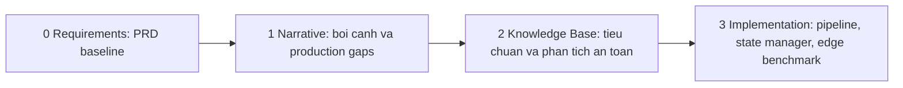
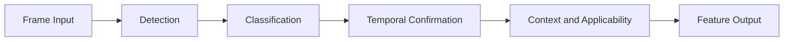
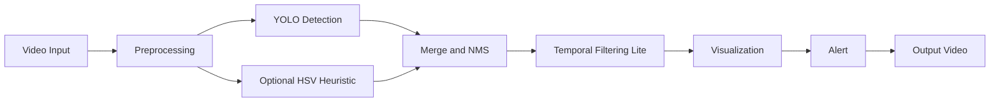
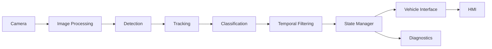

# Prototype to Production Narrative - ADAS TSR

> **Vai trò file này:** điểm xuất phát của luồng tài liệu tuyến tính.
>
> **Phạm vi:** kể câu chuyện chuyển từ demo nghiên cứu sang hệ thống TSR có thể chạy trên xe máy Việt Nam, chỉ nêu lỗ hổng sản xuất ở mức bối cảnh. Phân tích tiêu chuẩn chi tiết nằm trong `../2.knowledge_base/`; tham số CLI và mã nguồn nằm trong `../3.implementation/`.
>
> **Bản đầy đủ trước refactor:** [Legacy Prototype to Production Full Reference](01.prototype_to_production.md).

## 1. Bài Toán

Traffic Sign Recognition (TSR) biến hình ảnh từ camera trước thành thông tin biển báo có ích cho người lái hoặc các chức năng ADAS. Ở mức prototype, hệ thống chỉ cần đọc video, phát hiện biển báo, gán nhãn và vẽ kết quả. Ở môi trường xe thật, bài toán rộng hơn: kết quả phải ổn định, có ngữ cảnh, có trạng thái suy giảm và không khiến người lái hiểu nhầm khi camera hoặc phần cứng không còn đủ tin cậy.

Repo `adas-tsr` bắt đầu từ mục tiêu thực tế của bài giữa kỳ: có một pipeline chạy được trên video đường Việt Nam. Từ nền tảng đó, tài liệu nghiên cứu phát triển thành câu hỏi lớn hơn: cần thêm những gì để một demo nhận diện biển báo tiến gần hơn tới một feature automotive có kỷ luật?

## 2. Prototype Ban Đầu

Giai đoạn prototype bắt đầu từ cách tiếp cận quen thuộc của computer vision hiện đại: huấn luyện hoặc fine-tune một detector YOLOv8/Ultralytics trên máy chủ GPU hoặc môi trường Colab, đạt mAP cao trên tập validation sạch, sau đó đưa weights vào repo để chạy inference.

Prototype hiện tại dựa trên một baseline inference đơn giản:

- input là video file hoặc webcam;
- frame được tiền xử lý nhẹ;
- YOLO/Ultralytics phát hiện và phân loại biển báo;
- có thể bật nhánh CV truyền thống để đối chiếu candidate;
- kết quả được vẽ lên video output.

Mục tiêu của prototype là tạo bằng chứng trực quan: hệ thống có thể nhìn thấy biển báo trong footage thực tế, hiển thị nhãn và tạo video demo để trình bày. Đây là đúng phạm vi của một dự án nghiên cứu/giữa kỳ, nhưng chưa phải là feature TSR sản xuất.

## 3. Reality Shock Khi Đưa Lên Xe Máy Thực Tế

Khi chuyển từ notebook sang xe máy tại Việt Nam, hệ thống gặp một "reality shock": accuracy trong lab không còn đủ để đảm bảo hành vi ổn định ngoài đường.

Xe máy tại Việt Nam tạo ra nhiều điều kiện khó hơn so với notebook hoặc video mẫu:

- mưa lớn làm kính/camera mờ và che khuất biển báo;
- sương mù hoặc hơi nước làm biển báo bị chìm vào nền;
- nước mưa chảy loang làm ảnh mất nét theo từng vùng;
- mặt trời thấp, đèn pha xe ngược chiều ban đêm hoặc biển phản quang gây lóa và cháy sáng pixel;
- rung động từ động cơ và mặt đường làm bbox dao động;
- màn hình HMI có thể chớp tắt hoặc mất cảnh báo khi detector miss vài frame ngắn hạn;
- phần cứng biên có thể yếu, nóng, quá tải bộ nhớ và giảm xung nhịp xử lý;
- người lái có thể tin quá mức vào HMI nếu hệ thống không báo trạng thái suy giảm.

Các vấn đề này không chỉ làm giảm accuracy. Chúng làm thay đổi hành vi hệ thống: biển có thể lúc hiện lúc mất, cảnh báo đến muộn, hoặc hệ thống tiếp tục hiển thị thông tin cũ trong khi ảnh hiện tại không còn đủ chất lượng.

## 4. Production Gaps

Khoảng cách từ prototype tới production không nằm ở một model duy nhất. Nó nằm ở các lớp hành vi bị thiếu giữa detector và HMI.

| Khoảng trống | Biểu hiện trong prototype | Rủi ro khi chạy thực tế |
|---|---|---|
| Chất lượng ảnh | Camera mưa mờ/lóa vẫn được đưa vào detector như frame bình thường. | False negative hoặc false positive không có reason code. |
| Ổn định theo thời gian | Overlay được làm mượt nhẹ, nhưng chưa có lifecycle biển báo đầy đủ. | HMI chớp tắt hoặc giữ biển cũ quá lâu. |
| Phần cứng biên | Video độ phân giải cao có thể làm CPU/ECU quá tải. | Cảnh báo trễ sau khi xe đã đi qua biển báo. |
| Ngữ cảnh vận hành | Chưa có ODD và trạng thái out-of-ODD rõ ràng. | Người lái không biết khi nào feature không còn đáng tin. |
| Giao diện hệ thống | Output chính là video overlay. | Overlay demo dễ bị hiểu nhầm là HMI production. |

Những gap này là đầu vào cho Knowledge Base. Tại đó, chúng được chuyển hóa thành yêu cầu theo ISO 26262-12, ISO 21448 (SOTIF), IEEE 2020-2024 và Euro NCAP Speed Assistance.

## 5. Luồng Tuyến Tính Của Tài Liệu

Từ narrative này, người đọc nên đi một chiều:

```mermaid
flowchart LR
    A[0 Requirements: PRD baseline] --> B[1 Narrative: boi canh va production gaps]
    B --> C[2 Knowledge Base: tieu chuan va phan tich an toan]
    C --> D[3 Implementation: pipeline, state manager, edge benchmark]
```

Ý nghĩa từng tầng:

| Tầng | Câu hỏi chính | Không nên chứa |
|---|---|---|
| Narrative | Vì sao prototype chưa đủ cho xe thật? | Code, tham số CLI, bảng tiêu chuẩn chi tiết. |
| Knowledge Base | Tiêu chuẩn và đặc tả an toàn yêu cầu gì? | Mã nguồn cụ thể hoặc hướng dẫn chạy lệnh. |
| Implementation | Repo hiện thực hóa yêu cầu đó như thế nào? | Lý thuyết tiêu chuẩn dài hoặc câu chuyện mở bài. |

## 6. Kết Luận Narrative

Prototype đã đạt vai trò nền tảng: chạy được pipeline nhận diện biển báo và tạo video minh họa. Các production gaps không thể giải quyết chỉ bằng cách huấn luyện thêm dữ liệu; chúng cần thiết kế an toàn hệ thống và tối ưu mã nguồn nhúng: kiểm soát chất lượng ảnh, quản lý trạng thái biển báo, giảm tải phần cứng, báo degraded/unavailable rõ ràng và tạo evidence có thể kiểm thử.

Đọc tiếp theo:

- [2.01. Automotive Standards](../2.knowledge_base/01.automotive_standards.md)
- [2.02. Camera Sensor and IEEE 2020](../2.knowledge_base/02.camera_hardware_ieee2020.md)
- [2.03. Safety Analysis HAZOP and FTA](../2.knowledge_base/03.safety_analysis_hazop_fta.md)

---

<!-- consolidated-from: research/1.narrative/legacy_prototype_to_production_full_reference.md -->

## Phụ Lục Hợp Nhất Từ `research/1.narrative/legacy_prototype_to_production_full_reference.md`

> Phần này được gộp từ `research/1.narrative/legacy_prototype_to_production_full_reference.md` để giữ lại nội dung và traceability sau khi rút gọn cấu trúc Markdown.

## Traffic Sign Recognition (TSR) for ADAS — Prototype to Production Narrative

> **Vai trò file này:** narrative chính của bộ tài liệu TSR.
>
> **Đối tượng đọc:** Embedded Engineer, Automotive Software Engineer, Junior ADAS Engineer.
>
> **Cách đọc:** đọc liên tục từ đầu đến cuối. Khi cần chiều sâu, mở các bài trong `../2.knowledge_base/`. Khi cần bằng chứng gắn repo, mở `../3.implementation/`.
>
> **Nguồn phạm vi:** [0. Requirements](../0.requirements.md) — Lấy: brief gốc, yêu cầu pipeline và mục tiêu học tập. Dùng ở: giới hạn narrative vào TSR prototype, dataset, detector/classifier và production discussion.

---

### 1. Problem

Traffic Sign Recognition là bài toán biến hình ảnh giao thông thành thông tin mà hệ thống hỗ trợ lái có thể dùng được. Ở mức đơn giản nhất, hệ thống cần trả lời hai câu hỏi:

- Trong frame hiện tại có biển báo nào không?
- Nếu có, đó là biển báo gì?

Nhưng với hệ thống trên xe, hai câu hỏi đó chưa đủ. Một feature TSR thực tế còn phải trả lời:

- Biển báo đó có áp dụng cho xe ego hay không?
- Có nên hiển thị ngay cho người lái hay chờ thêm bằng chứng theo thời gian?
- Nếu ảnh xấu, runtime chậm hoặc môi trường vượt ODD thì feature phản ứng ra sao?

Đó là lý do tài liệu này không dừng ở mức detector hoặc demo overlay.

---

### 2. Background

### 2.1 TSR trong ADAS

TSR là một feature perception dựa trên camera trước. Nó thường cung cấp thông tin cho:

- `HMI`: hiển thị biển báo lên cluster hoặc HUD.
- `ISA`: dùng speed limit đã được chuẩn hóa để hỗ trợ tốc độ.
- `Logging / diagnostics`: lưu lại trạng thái feature để debug và regression.

Nếu chỉ nhìn ở mức model, TSR trông giống một bài object detection. Nếu nhìn ở mức vehicle feature, TSR là một chuỗi logic nhiều tầng từ cảm biến tới hành vi hệ thống.

### 2.2 Detector không phải feature

Detector output thường chỉ là:

- bounding box,
- class,
- confidence,
- trên từng frame độc lập.

Feature output phải đi xa hơn:

- ổn định theo thời gian,
- có policy hiển thị,
- có trạng thái availability/degraded,
- có khả năng giải thích vì sao publish hoặc suppress một sign.

Đây là khoảng cách chính giữa prototype giữa kỳ và production TSR.

### 2.3 Năm lớp xử lý cốt lõi

```mermaid
flowchart LR
    A[Frame Input] --> B[Detection]
    B --> C[Classification]
    C --> D[Temporal Confirmation]
    D --> E[Context and Applicability]
    E --> F[Feature Output]
```

| Lớp | Câu hỏi cần trả lời |
|---|---|
| Detection | Có vùng nào giống biển báo không? |
| Classification | Biển đó là loại gì? |
| Temporal confirmation | Có đủ bằng chứng qua nhiều frame chưa? |
| Context and applicability | Biển đó có áp dụng cho ego vehicle không? |
| Feature output | Có nên hiển thị/cảnh báo và lưu trạng thái gì? |

Prototype hiện tại chủ yếu cover mạnh hai lớp đầu và một phần rất mỏng của lớp thứ ba.

Tham khảo sâu hơn:

- [2.04. Unified Production Reference](../2.knowledge_base/01.automotive_standards.md)

---

### 3. Project Requirement

Đề tài giữa kỳ yêu cầu nhóm xây dựng một hệ TSR cơ bản với các đầu ra nhìn thấy được và có thể demo trên video thực tế.

### 3.1 Input

- Video thực tế do nhóm tự thu.
- Tối thiểu 2–3 video có chứa biển báo.

### 3.2 Output

- Phát hiện biển báo trong frame.
- Nhận diện loại biển báo.
- Vẽ bounding box và tên biển báo.
- Phát cảnh báo cho một số biển quan trọng.
- Lưu video đầu ra có lớp phủ.

### 3.3 Kỹ thuật được phép dùng

Đề bài gợi ý cả hai hướng:

- Classical CV: `HSV`, `Histogram Equalization`, `Gaussian`, `Morphology`, `Contour`, `Template Matching`.
- Deep learning: `YOLO`, `Faster R-CNN`, classifier như `MobileNet`.

### 3.4 Ý nghĩa của requirement

Điểm quan trọng nhất là:

- `Prototype` là sản phẩm chính của đề tài.
- `Production mindset` là lớp tham chiếu để giúp giải thích giới hạn và hướng phát triển.

Nói cách khác, nhóm không cần giả vờ đã có production TSR, nhưng phải hiểu prototype của mình đang đứng ở đâu nếu so với production TSR.

---

### 4. Prototype Architecture

Prototype hiện tại trong repo `adas-tsr` là một baseline inference pipeline xoay quanh `code/tsr_demo.py` và checkpoint `models/best.pt`.

Checkpoint này cần được mô tả thật chính xác trong toàn bộ repo:

- đây là một weights `Ultralytics YOLO11s`,
- được fine-tune từ `yolo11s.pt`,
- train trên dataset `Traffic-sign-detection-VietNam`,
- và bao phủ `82` lớp biển báo Việt Nam.

### 4.1 Vai trò của prototype

Prototype này dùng để:

- chạy inference trên video hoặc webcam,
- quan sát hành vi detector trên dữ liệu địa phương,
- lưu video output để demo,
- tạo nền cho phân tích gap lên production.

### 4.2 Sơ đồ tổng quát

```mermaid
flowchart LR
    A[Video Input] --> B[Preprocessing]
    B --> C[YOLO Detection]
    B --> D[Optional HSV Heuristic]
    C --> E[Merge and NMS]
    D --> E
    E --> F[Temporal Filtering Lite]
    F --> G[Visualization]
    G --> H[Alert]
    H --> I[Output Video]
```

### 4.3 Đặc điểm chính của prototype hiện tại

- Nhánh chính là detector `Ultralytics YOLO11s` dùng weights `best.pt`.
- Có nhánh `HSV + contour` tùy chọn để đối chiếu hoặc heuristic.
- Có `hold` để làm output video bớt chớp.
- Output chính vẫn là `overlay video`, chưa phải machine-readable feature output.

### 4.4 Hai implementation artifact cần tách bạch

Từ thời điểm repo có thêm notebook [3.05. Colab Production-Lite Demo](../3.implementation/03.edge_deployment_and_benchmarks.md), cần tách rõ hai artifact khác nhau:

- `Baseline runtime` trong `code/tsr_demo.py`: đây vẫn là prototype giữa kỳ bám video overlay, `hold`, và chưa có quality gate / tracking / JSONL trong code path chính.
- `Production-lite notebook` trong `research/3.implementation/notebooks/01.tsr_colab_production_lite_demo.ipynb`: đây là sidecar artifact để mô phỏng `quality gate`, `ODD gate`, `IoU tracking`, `track lifecycle`, `warning level`, `events.jsonl`, KPI proxy và optional GT evaluation trên Colab.

Điểm quan trọng:

- không được lấy capability của notebook rồi gán ngược cho `tsr_demo.py`;
- nhưng cũng không được nói repo “hoàn toàn chưa có” stateful replay hay machine-readable output, vì notebook sidecar đã có các block đó ở mức demo.

Implementation evidence:

- [3.09. Baseline Repo Analysis](../3.implementation/01.hybrid_pipeline_architecture.md)
- Bài đọc sâu hơn: [3.12. Baseline Repo Analysis Full](../3.implementation/01.hybrid_pipeline_architecture.md)

---

### 5. Prototype Pipeline

Luồng end-to-end của prototype hiện tại có thể tóm tắt như sau:

1. Đọc frame từ video hoặc webcam.
2. Resize frame theo `max_width`.
3. Chạy YOLO detector trên frame đã preprocess.
4. Tùy chọn chạy thêm nhánh heuristic dựa trên `HSV + contour`.
5. Hợp nhất detection và áp dụng NMS đơn giản.
6. Nếu frame hiện tại rỗng, dùng `hold` để giữ detection cũ trong vài frame.
7. Vẽ bbox, label và ghi video output.

Điểm kỹ thuật quan trọng:

- `hold` giúp video trông ổn định hơn.
- Nhưng `hold` không tạo `track_id`, không tạo lifecycle sign, và không nên bị hiểu nhầm là tracking thật.

---

### 6. Prototype Modules

Section này giải thích từng module theo cùng một contract:

- `Prototype`
- `Production`
- `Current Gap`
- `Impact`
- `Roadmap`

### 6.1 Input / Frame Acquisition

`Prototype`

Prototype đọc video file hoặc webcam thông qua `tsr_demo.py`. Đơn vị xử lý chính là frame ảnh độc lập.

`Production`

Production TSR nhận dữ liệu từ camera module với timestamp, trạng thái health và timing contract rõ ràng.

`Current Gap`

Prototype chưa có sensor health, chưa có metadata về timestamp hoặc stale input.

`Impact`

Khó phân biệt lỗi perception với lỗi nguồn dữ liệu; khó mở rộng sang diagnostics hoặc replay chuẩn.

`Roadmap`

Thêm frame metadata tối thiểu như `frame_id`, `timestamp_ms`, `source_status`.

### 6.2 Preprocessing

`Prototype`

Prototype hiện có resize cơ bản; nhánh classical CV có thể dùng `HSV`, `Morphology`, `Contour`. Đề bài cũng cho phép `Histogram Equalization` và `Gaussian Filter` nếu nhóm muốn tăng ổn định.

`Production`

Production thường giả định một chuỗi image conditioning rõ ràng hơn: camera ISP behavior, exposure assumption, blur/glare quality scoring và degraded policy. Chi tiết pipeline `CMOS -> RAW Bayer -> ISP -> RGB/YUV -> YOLO/TSR` nằm ở [2.13. ISP Image Pipeline for TSR](../2.knowledge_base/02.camera_hardware_ieee2020.md).

`Current Gap`

Runtime chính của prototype chưa có quality gate chính thức cho blur, glare hoặc exposure xấu. Notebook sidecar đã demo quality gate heuristic, nhưng chưa nằm trong code path chính.

`Impact`

Detector vẫn chạy trên frame chất lượng thấp, gây false negative hoặc class jitter mà không có reason code giải thích.

`Roadmap`

Port `frame_quality_score` và các reason code như `blur_high`, `backlight`, `dark_frame` từ notebook về runtime chính.

Tham khảo sâu hơn:

- [2.04. Unified Production Reference](../2.knowledge_base/01.automotive_standards.md)
- [3.08. Experiment and Benchmark Guide](../3.implementation/03.edge_deployment_and_benchmarks.md)

### 6.3 Detection

`Prototype`

Repo hiện dùng checkpoint `Ultralytics YOLO11s` trong `models/best.pt` làm nhánh chính để phát hiện biển báo. Có thể bật thêm nhánh `HSV + contour` để đối chiếu hoặc tạo candidate heuristic.

`Production`

Production detection không dừng ở bbox trên từng frame. Detector phải có confidence policy, quality-aware behavior, nguồn gốc detection rõ ràng và đầu ra sẵn sàng cho tracking/temporal logic.

`Current Gap`

Prototype chưa có calibration, chưa có per-class threshold policy, và chưa publish machine-readable provenance đủ rõ giữa detection đến từ `YOLO11s best.pt` hay từ heuristic branch.

`Impact`

Output có thể đúng ở mức frame nhưng chưa đáng tin ở mức feature; khó giải thích khi false positive hoặc miss sign nhỏ.

`Roadmap`

- Tách rõ detection nguồn `yolo` và `heuristic`.
- Bổ sung machine-readable detection log.
- Chuẩn hóa benchmark detector trước khi bàn tới architecture mới.

Tham khảo sâu hơn:

- [3.10. Detector Architecture Deep Reference](../3.implementation/01.hybrid_pipeline_architecture.md)

### 6.4 Classification / Recognition

`Prototype`

Trong prototype hiện tại, recognition không đi qua một classifier runtime riêng. Nhãn biển báo đi trực tiếp cùng output của detector `Ultralytics YOLO11s best.pt`, tức mỗi detection đã mang theo `bbox + class + confidence` trên taxonomy `82` lớp biển báo Việt Nam.

Các hướng như `Template Matching`, classifier nhẹ như `MobileNet`, hoặc OCR/digit logic cho biển tốc độ hiện chỉ nên được trình bày như hướng mở rộng nghiên cứu, không phải main runtime path của repo.

`Production`

Production cần class-family policy, confidence management, canonicalization cho speed sign và đôi khi OCR/digit strategy nếu taxonomy yêu cầu.

`Current Gap`

Prototype chưa có policy rõ cho speed family, chưa có tách biệt giữa raw class và feature-level sign semantics.

`Impact`

Khó quản lý các trường hợp cùng họ biển nhưng confidence dao động, đặc biệt với biển tốc độ hoặc class long-tail.

`Roadmap`

- Chuẩn hóa sign family cho speed / stop / no entry.
- Nếu mở rộng scope, thêm OCR/digit fallback cho biển tốc độ.

Tham khảo sâu hơn:

- [3.10. Detector Architecture Deep Reference](../3.implementation/01.hybrid_pipeline_architecture.md)

### 6.5 Temporal Filtering Lite

`Prototype`

Prototype hiện dùng `hold` và logic hiển thị đơn giản để tránh mất bbox ngay khi detector miss một frame.

`Production`

Production cần tracking, temporal confirmation và lifecycle sign rõ ràng. Sign phải đi qua các trạng thái như `candidate`, `confirmed`, `active`, `expired`, hoặc `suppressed`.

`Current Gap`

`hold` không phải tracking. Prototype chưa có `track_id`, `hit_count`, `miss_count`, `TTL`, hoặc state transition đúng nghĩa.

`Impact`

Video có thể trông mượt hơn, nhưng feature behavior vẫn không kiểm soát được: sign cũ có thể bị giữ quá lâu hoặc sign mới chưa được confirm.

`Roadmap`

- P0: hợp nhất `hit/miss confirmation` từ notebook sidecar về runtime chính.
- P1: thêm `track_id` và temporal association đơn giản trong code path chính.
- P2: thêm lifecycle sign chuẩn hóa.

Tham khảo sâu hơn:

- [2.04. Unified Production Reference](../2.knowledge_base/01.automotive_standards.md)

### 6.6 Visualization

`Prototype`

Visualization của prototype là video overlay gồm bbox, label và một số text debug.

`Production`

Production không publish raw overlay. HMI output phải theo policy về priority, hysteresis, suppression và timing cập nhật.

`Current Gap`

Prototype chưa tách `overlay` khỏi `feature output`.

`Impact`

Người xem dễ hiểu nhầm rằng thứ đang thấy trên video cũng chính là hành vi HMI production.

`Roadmap`

- Tách khái niệm `overlay for demo` khỏi `feature output for consumer`.
- Chỉ hiển thị sign đã qua logic confirm nếu muốn mô phỏng HMI-lite.

Tham khảo sâu hơn:

- [2.04. Unified Production Reference](../2.knowledge_base/01.automotive_standards.md)

### 6.7 Alert

`Prototype`

Prototype có thể phát cảnh báo đơn giản cho các biển quan trọng như `Stop` hoặc `Speed Limit`.

`Production`

Production alert phải dựa trên sign đã confirm, policy ưu tiên, trạng thái feature và ngữ cảnh áp dụng cho ego vehicle.

`Current Gap`

Prototype chưa có arbitration rõ giữa nhiều sign, chưa có context/lane logic và chưa có state-driven warning policy.

`Impact`

Cảnh báo có thể đúng về mặt detection nhưng sai về mặt feature applicability.

`Roadmap`

- Đưa warning level lite từ notebook về runtime chính.
- Thêm state-driven publish rule dùng chung giữa notebook và runtime chính.
- Về sau mới mở rộng sang context/lane/map policy.

### 6.8 Output / Logging

`Prototype`

Output chính hiện tại là video annotated.

`Production`

Production cần machine-readable feature output, diagnostics fields, reason codes và log phục vụ replay/RCA/regression.

`Current Gap`

Runtime chính của prototype chưa có `JSONL` hoặc schema output cho frame event, detection event và feature state. Tuy nhiên notebook production-lite sidecar đã có `events.jsonl`, `feature_state`, `warning_level` và KPI replay ở mức demo.

`Impact`

Khó benchmark giữa các version, khó trace nguyên nhân lỗi và khó xây dựng regression discipline.

`Roadmap`

- P0: thống nhất schema `events.jsonl` giữa notebook và runtime chính.
- P1: đưa `reason_codes`, `feature_state`, `quality_state` vào code path chính.
- P2: thêm KPI pipeline và diagnostics-lite.

Implementation evidence:

- [3.09. Baseline Repo Analysis](../3.implementation/01.hybrid_pipeline_architecture.md)
- [3.05. Colab Production-Lite Demo](../3.implementation/03.edge_deployment_and_benchmarks.md)

---

### 7. Production Mapping

Nếu nhìn lại toàn bộ prototype, điều quan trọng nhất không phải là “nên đổi YOLO sang model nào” mà là phải hiểu prototype còn thiếu những lớp logic nào để trở thành feature.

| Module | Production counterpart | Current gap summary |
|---|---|---|
| Input | Camera module + health + time contract | Chưa có sensor/status semantics |
| Preprocessing | Image quality and ISP-aware conditioning; xem [2.13. ISP Image Pipeline for TSR](../2.knowledge_base/02.camera_hardware_ieee2020.md) | Runtime chính chưa có quality gate; notebook sidecar đã có blur/dark/glare gate |
| Detection | Calibrated detector + provenance | Chưa có calibration/provenance đầy đủ |
| Classification | Confidence-managed sign semantics | Chưa có family/state policy |
| Temporal | Tracking + lifecycle | Runtime chính vẫn là `hold`; notebook sidecar đã có IoU association + hit/miss |
| Visualization | HMI policy | Overlay chưa phải HMI |
| Alert | Vehicle-facing warning logic | Chưa có arbitration/context |
| Output | Feature log + diagnostics | Runtime chính chưa có machine-readable artifacts; notebook sidecar đã có `events.jsonl` demo |

Đây là cầu nối giúp người đọc thấy rõ:

- prototype là phần perception demo,
- production là feature có state và contract,
- gap nằm ở hành vi hệ thống, không chỉ ở accuracy model.

---

### 8. Production Feature Architecture

Production TSR có thể tóm tắt ở mức feature bằng pipeline sau:

```mermaid
flowchart LR
    A[Camera] --> B[Image Processing]
    B --> C[Detection]
    C --> D[Tracking]
    D --> E[Classification]
    E --> F[Temporal Filtering]
    F --> G[State Manager]
    G --> H[Vehicle Interface]
    H --> I[HMI]
    G --> J[Diagnostics]
```

### 8.1 Vai trò từng block

| Block | Vai trò |
|---|---|
| Camera | Cung cấp ảnh đầu vào và timing base |
| Image Processing | Chuẩn hóa ảnh và quality-aware conditioning |
| Detection | Tìm candidate sign |
| Tracking | Nối cùng một sign qua nhiều frame |
| Classification | Xác định loại sign và semantics |
| Temporal Filtering | Yêu cầu đủ bằng chứng theo thời gian |
| State Manager | Quản lý lifecycle sign và feature state |
| Vehicle Interface | Publish signal cho HMI/consumer khác |
| HMI | Hiển thị/cảnh báo cho người lái |
| Diagnostics | Ghi nhận health, fault, degraded behavior |

### 8.2 Prototype nằm ở đâu trong kiến trúc này?

Prototype hiện tại chủ yếu nằm ở các khối:

- `Image Processing` mức rất tối giản,
- `Detection`,
- `Classification`,
- `Temporal Filtering Lite`,
- `Visualization`,
- `Alert` mức demo.

Các khối gần như chưa có hoặc mới là ý tưởng:

- `Tracking`,
- `State Manager`,
- `Vehicle Interface`,
- `Diagnostics`,
- `Context / lane / map / ISA`.

Nếu tính cả notebook production-lite như một artifact triển khai song song, repo đã có phiên bản `lite` cho:

- `Tracking` và `Temporal Confirmation`,
- `State / Lifecycle`,
- `Feature-state logging`,
- `warning level` và policy chọn `primary_track`,
- KPI replay và optional GT evaluation.

Nhưng các block đó vẫn chưa được hợp nhất về runtime chính `tsr_demo.py`.

Tham khảo sâu hơn:

- [2.04. Unified Production Reference](../2.knowledge_base/01.automotive_standards.md)

---

### 9. Production Topics That Prototype Does Not Yet Implement

### 9.1 State Manager

State Manager là khối biến detection rời rạc thành sign lifecycle có kiểm soát. Các trạng thái điển hình:

- `Candidate`
- `Confirmed`
- `Active`
- `Expired`
- `Suppressed`

Prototype hiện thay khối này bằng:

- `hold` để giữ overlay,
- một số rule đơn giản trong demo/Colab,
- và notebook sidecar đã có lifecycle lite,
- nhưng runtime chính vẫn chưa có lifecycle chính thức.

Tham khảo: [2.04. Unified Production Reference](../2.knowledge_base/01.automotive_standards.md)

### 9.2 ODD

ODD trả lời câu hỏi: feature được kỳ vọng hoạt động trong môi trường nào. Với TSR, các chiều cơ bản gồm:

- weather,
- lighting,
- road type,
- vehicle speed,
- camera condition,
- traffic density.

Prototype hiện phù hợp nhất với `ODD hẹp`: video nhìn rõ, biển tĩnh, ánh sáng không quá cực đoan, không có yêu cầu integration thật.

Tham khảo: [2.04. Unified Production Reference](../2.knowledge_base/01.automotive_standards.md)

### 9.3 SOTIF

SOTIF tập trung vào các rủi ro do giới hạn nhận thức, không nhất thiết do lỗi phần cứng hay crash phần mềm. Những tình huống quan trọng cho TSR gồm:

- false positive,
- false negative,
- unknown sign,
- occlusion,
- blur,
- night,
- backlight,
- construction zone.

Prototype hiện có residual risk cao nhất ở:

- blur / glare,
- small sign,
- stale sign do `hold`,
- sign applicability chưa được kiểm soát.

Tham khảo: [2.04. Unified Production Reference](../2.knowledge_base/01.automotive_standards.md)

### 9.4 Verification and Validation

Một feature production thường đi qua các mức kiểm thử:

- Unit Test
- Integration Test
- MIL
- SIL
- HIL
- VIL
- Road Test
- Regression Test

Prototype hiện mới mạnh ở:

- manual replay,
- visual inspection,
- benchmark runtime thô,
- một số analysis gắn repo.

Tham khảo: [2.04. Unified Production Reference](../2.knowledge_base/01.automotive_standards.md)

---

### 10. Current Gap

Khoảng cách hiện tại giữa prototype và production có thể tóm tắt như sau:

| Hạng mục | Prototype hiện có | Production cần có | Impact nếu chưa có |
|---|---|---|---|
| Tracking | `hold` | track association + lifecycle | flicker, stale sign |
| State Manager | chưa có thật | confirmed/active/expired/suppressed | feature behavior không rõ |
| Quality/ODD handling | rất mỏng | quality gate + ODD state | khó giải thích degraded behavior |
| Logging | video overlay | JSONL + reason code + diagnostics | khó replay và RCA |
| HMI policy | overlay demo | publish policy cho driver | dễ nhầm demo với feature |
| Context applicability | chưa có | lane/context/map policy | false advisory |
| Performance evidence | benchmark local | edge parity + release gate | không biết target feasibility |
| Verification assets | benchmark rời rạc | scenario/KPI/regression discipline | khó so sánh qua các phiên bản |

Implementation evidence chi tiết:

- [3.09. Baseline Repo Analysis](../3.implementation/01.hybrid_pipeline_architecture.md)
- [3.08. Experiment and Benchmark Guide](../3.implementation/03.edge_deployment_and_benchmarks.md)

---

### 11. Future Work

Lộ trình hợp lý cho repo không phải là thêm thật nhiều block cùng lúc. Trình tự đúng là:

1. `Khóa source of truth`
   Dùng notebook production-lite làm schema tham chiếu cho machine-readable output như `JSONL`.

2. `Khóa temporal behavior`
   Port temporal confirmation lite, `track_id`, `hit/miss`, expiry từ notebook về runtime chính.

3. `Khóa health và explainability`
   Port quality score, reason code và `feature_state` từ notebook về runtime chính.

4. `Chuẩn bị các stub production`
   Context stub, lane/map stub, warning policy lite, speed sign canonicalization.

5. `Mở rộng performance và validation`
   Export benchmark, scenario tags, KPI script, regression protocol.

Nguyên tắc xuyên suốt:

- đo được trước,
- rồi mới thêm authority.

---

### 12. Conclusion

Prototype TSR của đề tài đã có giá trị rõ ràng:

- đáp ứng yêu cầu giữa kỳ,
- chạy được trên video thực tế,
- cho phép nhóm hiểu hành vi detector trên dữ liệu địa phương.

Nhưng giá trị lớn hơn của bộ tài liệu này là giúp người đọc thấy rằng:

- prototype chỉ là một phần nhỏ của feature TSR production,
- production TSR đòi hỏi thêm state, ODD, diagnostics, HMI và validation,
- và khoảng cách đó có thể được mô tả có kỷ luật thay vì nói chung chung.

Tài liệu nên được đọc theo hướng:

1. file này để hiểu toàn bộ câu chuyện,
2. `../2.knowledge_base/` để đào sâu từng chủ đề production,
3. `../3.implementation/` để xem bằng chứng gắn repo và notebook.
