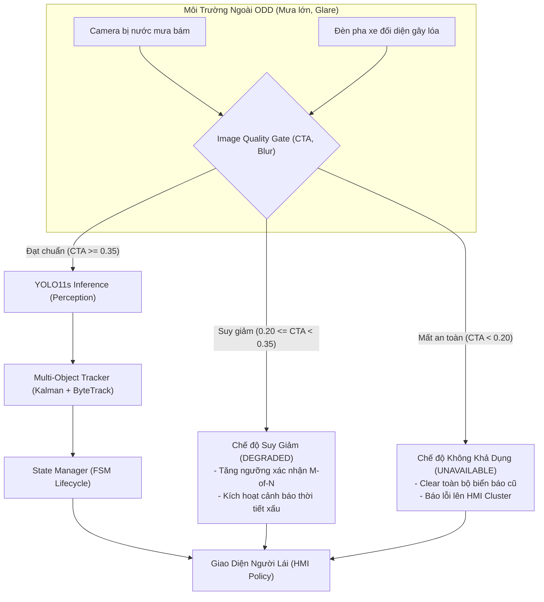
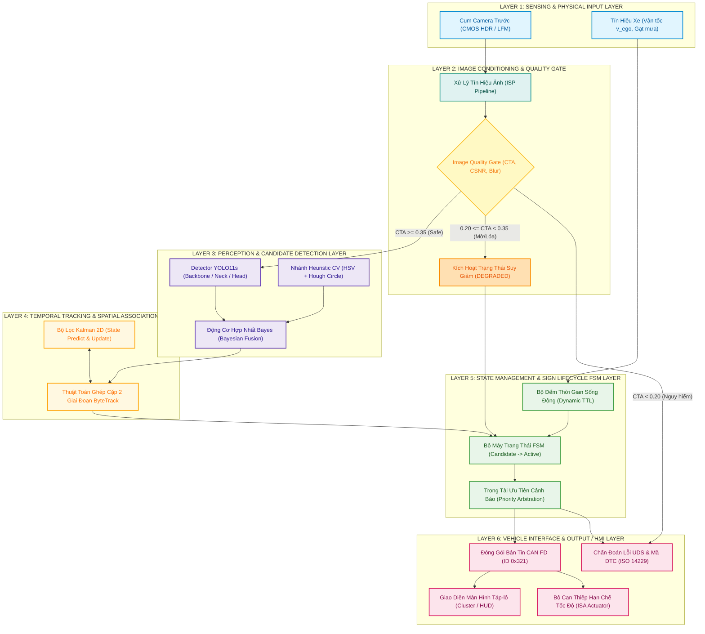
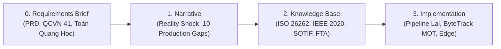

# Prototype to Production Narrative - ADAS TSR

> **Vai trò file này:** điểm xuất phát của luồng tài liệu tuyến tính.
>
> **Phạm vi:** kể câu chuyện chuyển từ demo nghiên cứu sang hệ thống TSR có thể chạy trên xe 4 bánh trong bối cảnh đường Việt Nam, chỉ nêu lỗ hổng sản xuất ở mức bối cảnh. Phân tích tiêu chuẩn chi tiết nằm trong `../2.knowledge_base/`; tham số CLI và mã nguồn nằm trong `../3.implementation/`.

## 1. Bài Toán

Traffic Sign Recognition (TSR) biến hình ảnh từ camera trước thành thông tin biển báo có ích cho người lái hoặc các chức năng ADAS. Ở mức prototype, hệ thống chỉ cần đọc video, phát hiện biển báo, gán nhãn và vẽ kết quả. Ở môi trường xe thật, bài toán rộng hơn: kết quả phải ổn định, có ngữ cảnh, có trạng thái suy giảm và không khiến người lái hiểu nhầm khi camera hoặc phần cứng không còn đủ tin cậy.

Repo `adas-tsr` bắt đầu từ mục tiêu thực tế của bài giữa kỳ: có một pipeline chạy được trên video đường Việt Nam. Từ nền tảng đó, tài liệu nghiên cứu phát triển thành câu hỏi lớn hơn: cần thêm những gì để một demo nhận diện biển báo tiến gần hơn tới một feature automotive có kỷ luật?

## 2. Prototype Ban Đầu

Giai đoạn prototype bắt đầu từ cách tiếp cận quen thuộc của computer vision hiện đại: huấn luyện hoặc fine-tune một detector YOLOv8/Ultralytics trên máy chủ GPU hoặc môi trường Colab, đạt mAP cao trên tập validation sạch, sau đó đưa weights vào repo để chạy inference.

Prototype hiện tại dựa trên một baseline inference đơn giản:

- Input là video file hoặc webcam; đây là nguồn dữ liệu nhanh nhất để kiểm tra detector trên footage thực tế.
- Frame được tiền xử lý nhẹ; bước này chủ yếu resize/chuẩn hóa chứ chưa có quality gate đầy đủ.
- YOLO/Ultralytics phát hiện và phân loại biển báo;
- Có thể bật nhánh CV truyền thống để đối chiếu candidate; nhánh này hữu ích để debug nhưng không nên publish trực tiếp.
- Kết quả được vẽ lên video output; overlay chỉ phục vụ demo và review, không phải HMI production.

Mục tiêu của prototype là tạo bằng chứng trực quan: hệ thống có thể nhìn thấy biển báo trong footage thực tế, hiển thị nhãn và tạo video demo để trình bày. Đây là đúng phạm vi của một dự án nghiên cứu/giữa kỳ, nhưng chưa phải là feature TSR sản xuất.

## 3. Reality Shock Khi Đưa Lên Xe 4 Bánh Thực Tế

Khi chuyển từ notebook (Jupyter/Colab với tập ảnh validation tĩnh sạch sẽ) sang xe 4 bánh lăn bánh thực tế trên đường sá Việt Nam, nhóm kỹ sư sẽ đối mặt với một cú sốc thực tế (**"Reality Shock"**): chỉ số mAP cao trong phòng thí nghiệm hoàn toàn không bảo chứng cho việc hệ thống vận hành an toàn và tin cậy ngoài hiện trường.

Xe 4 bánh tại Việt Nam tạo ra các thách thức vật lý và quang học cực kỳ khắc nghiệt:

### 3.1. Các Mô Hình Vật Lý & Quang Học Gây Suy Giảm Nhận Thức

#### A. Định luật suy giảm ánh sáng khí quyển Beer-Lambert (Mưa nhiệt đới & Sương mù)
Trong điều kiện mưa rào mùa hạ hoặc sương mù dày đặc vùng núi phía Bắc (Quốc lộ 6, đèo Ô Quy Hồ), quang thông ánh sáng từ biển báo đến ống kính camera bị tán xạ và hấp thụ mạnh theo định luật Beer-Lambert:

$$I(d) = I_0 \cdot \exp(-\gamma_{ext} \cdot d)$$

Trong đó:

- $I_0$: Cường độ phản xạ ánh sáng gốc tại bề mặt biển báo ($\text{cd/m}^2$).
- $I(d)$: Cường độ ánh sáng thực tế thu được tại thấu kính camera ở khoảng cách $d$ (mét).
- $\gamma_{ext}$: Hệ số dập tắt quang học (Optical Extinction Coefficient):
  - Khí quyển trong lành (Clear air): $\gamma_{ext} \approx 0.001 - 0.005\text{ m}^{-1}$.
  - Sương mù nhẹ / Mưa phùn: $\gamma_{ext} \approx 0.02 - 0.05\text{ m}^{-1}$.
  - Mưa rào nhiệt đới cực đoan ($> 50\text{ mm/h}$): $\gamma_{ext} \ge 0.10\text{ m}^{-1}$.
- **Hệ quả thực tế**: Ở khoảng cách $40\text{ m}$ dưới mưa lớn nhiệt đới, cường độ tín hiệu chỉ còn $I(40) = I_0 \cdot \exp(-0.10 \times 40) = I_0 \cdot e^{-4} \approx 0.018 \cdot I_0$ (mất tới **98.2%** độ tương phản!). Hậu quả là viền tròn đỏ và chữ số bị chìm hoàn toàn vào màn mưa, dẫn đến chuỗi False Negative liên tiếp.

#### B. Hiện tượng mờ do chuyển động (Motion Blur) dưới điều kiện thiếu sáng
Khi xe chạy nhanh vào ban đêm hoặc trời chập tối, thuật toán Phơi sáng tự động (Auto Exposure - AE) của camera có xu hướng kéo dài thời gian mở màn trập ($t_{exp}$) để thu đủ photon. Độ dài vệt mờ chuyển động trên ma trận điểm ảnh được tính bằng:

$$B_{motion} = \frac{v \cdot t_{exp} \cdot f}{D \cdot p_{pixel}}$$

Trong đó:

- $v$: Vận tốc xe ($33.33\text{ m/s}$ tương đương $120\text{ km/h}$).
- $t_{exp}$: Thời gian phơi sáng. Nếu $t_{exp} = 1/30\text{ s} \approx 0.0333\text{ s}$.
- $f = 6.0\text{ mm}$, $p_{pixel} = 3.0\,\mu\text{m}$, khoảng cách $D = 40\text{ m}$.
- **Tính toán thực nghiệm**: $B_{motion} = \frac{33.33 \times 0.0333 \times 0.006}{40 \times (3.0 \times 10^{-6})} = \frac{0.00666}{0.00012} = 55.5\text{ pixels!}$
- **Hệ quả**: Chi tiết biển bị kéo dệt thành một vệt mờ dài hơn 55 pixel, phá hủy hoàn toàn cấu trúc hình học của ký tự số, khiến mô hình deep learning gán nhãn sai hoặc không tìm thấy cạnh viền.

#### C. Phổ dao động gá camera do mấp mô mặt đường (Quarter-Car Vibration)
Đường sá gồ ghề tạo ra dao động cơ học truyền từ lốp xe qua hệ thống treo lên khung kính chắn gió. Dao động góc dập dềnh (Pitch angle $\theta$) của xe thường tập trung ở hai dải tần số chính:

1. **Tần số dập dềnh thân xe (Chassis bounce)**: $1.0 - 2.5\text{ Hz}$, biên độ góc dao động tới $\pm 3^\circ$.
2. **Tần số rung lắc bánh xe & khung đỡ (Wheel hop & Bracket resonance)**: $10.0 - 16.0\text{ Hz}$.

Với vận tốc góc nhấp nhô $\dot{\theta} \approx 5^\circ/\text{s}$, tâm của bounding box biển báo trên khung hình có thể dịch chuyển tức thời $20 - 40\text{ pixels}$ giữa hai frame liên tiếp. Nếu chỉ dùng thuật toán giữ vị trí đơn giản không có lọc Kalman bù trừ chuyển động, hệ thống sẽ phán đoán nhầm là một biển báo hoàn toàn mới!

---

### 3.2. Hai Kịch Bản Vận Hành Thực Tế Tại Việt Nam

#### Kịch bản 1: Mưa dông xối xả trên Cao tốc Hà Nội — Hải Phòng (CT.04) ở tốc độ 120 km/h
- **Bối cảnh**: Xe di chuyển ở làn ngoài cùng tốc độ $120\text{ km/h}$ lúc hoàng hôn. Một cơn mưa dông nhiệt đới ập đến, gạt mưa phải hoạt động ở tốc độ tối đa (High Speed, chu kỳ gạt $T_{wiper} \approx 0.55\text{ s}$).
- **Hiện tượng lỗi**:
  1. Mỗi khi cần gạt mưa quét ngang qua vùng trước camera (mất khoảng $100\text{ ms}$), toàn bộ vùng nhìn bị che khuất một phần.
  2. Bụi nước mịn (Spray) cuộn lên từ đuôi xe container 18 bánh chạy phía trước tạo thành màn sương nhân tạo che mờ biển báo P.127 ($100\text{ km/h}$).
  3. Ánh đèn pha của xe đi ngược chiều phản chiếu trên mặt đường đọng nước tạo ra các quầng sáng lóa (Glare) cực mạnh.
- **Hành vi thất bại nếu dùng Prototype**: Mô hình YOLO bỏ sót biển trong 4 frame liên tiếp do cần gạt quét qua và lóa đèn. Lệnh `--hold 3` bị cạn kiệt, icon tốc độ trên taplo lập tức biến mất trong 0.2s rồi lại hiện lên mờ nhạt, tạo hiện tượng chớp tắt (flicker) dữ dội khiến tài xế hoang mang.
- **Hành vi chuẩn mực của Production**: Module `IEEE2020CTAMonitor` ghi nhận độ tương phản $CTA$ giảm dưới $0.35$ do mưa và lóa, lập tức kích hoạt cờ `DEGRADED_VISIBILITY`. `StateManager` chuyển trạng thái sang `SUPPRESSED_HELD`, duy trì biển tốc độ gần nhất trên màn hình trong thời gian đệm $3\text{ giây}$, đồng thời hiển thị biểu tượng "Camera thời tiết xấu - Cảnh báo hạn chế" để tài xế chủ động quan sát bằng mắt.

#### Kịch bản 2: Ùn tắc giao thông hỗn hợp tại Vòng xoay Dân Chủ (Quận 3, TP.HCM)
- **Bối cảnh**: Xe di chuyển chậm $15\text{ km/h}$ giữa dòng phương tiện hỗn hợp gồm hàng trăm xe máy, xe buýt cỡ lớn và xe tải nhỏ.
- **Hiện tượng lỗi**:
  1. Biển cấm rẽ P.123 bị thùng xe buýt che khuất một nửa (Occlusion $50\%$).
  2. Ven đường có biển quảng cáo hình tròn màu đỏ của các cửa hàng bán lẻ (dễ nhầm với biển P.102 cấm đi ngược chiều).
  3. Xe máy tạt đầu liên tục cắt ngang tầm nhìn của camera trước.
- **Hành vi thất bại nếu dùng Prototype**: Nhánh Traditional CV (HSV + Contour) bắt nhầm vòng tròn màu đỏ trên biển hiệu quảng cáo và phát chuông báo "Cấm đi ngược chiều" inh ỏi trong cabin. Trong khi đó, biển cấm rẽ thật sự bị xe buýt che khuất thì YOLO không đủ confidence để kích hoạt.
- **Hành vi chuẩn mực của Production**: Hệ thống áp dụng bộ lọc ngữ cảnh (Context & Semantic Gating) và lọc hình học (Epipolar / Homography): Biển báo hợp lệ bắt buộc phải có độ cao lắp đặt tối thiểu $1.8\text{ m}$ so với mặt đường và nằm ở dải lề đường hợp quy theo **QCVN 41:2019/BGTVT**. Biển quảng cáo ven nhà dân lập tức bị loại bỏ do vi phạm quy tắc hình học không gian 3D.

---

## 4. Production Gaps — Khoảng Cách Giữa Prototype & Hệ Thống Xe Thật

Bảng đối chiếu toàn diện 10 chiều cốt lõi giữa hệ thống nghiên cứu thử nghiệm (Academic Prototype) và hệ thống nhúng trên xe ô tô sản xuất hàng loạt (Automotive Production Feature):

| Tiêu chí so sánh | Academic Prototype (`adas-tsr` baseline) | Automotive Production TSR (ASIL-B Ready) | Khoảng cách kỹ thuật (Technical Gap) | Rủi ro nếu bỏ qua trên xe thật |
|:---|:---|:---|:---|:---|
| **1. Trọng tâm xử lý** | Tối ưu hóa mAP trên ảnh tĩnh / video file lưu sẵn. | Ổn định chuỗi thời gian (Temporal Consistency) và phản xạ thời gian thực. | Thiếu module Multi-Object Tracking và Quản lý trạng thái FSM. | Icon biển báo nhấp nháy liên tục; cảnh báo phát ra trễ khi xe đã đi qua biển. |
| **2. Chất lượng ảnh (IQA)** | Coi mọi frame đọc được từ `cv2.VideoCapture` đều hợp lệ. | Đánh giá chất lượng online theo chuẩn **IEEE 2020** (CTA, CSNR, CDP, Blur, Glare). | Chưa có Image Quality Gate trước khi đưa frame vào inference mạng nơ-ron. | Bị lừa bởi nhiễu ảnh, lóa đèn hoặc nước mưa bám ống kính (False Positives/Negatives). |
| **3. Cơ chế suy giảm an toàn** | Crash phần mềm hoặc đóng băng khung hình khi gặp lỗi. | Phân cấp trạng thái rõ ràng: `NORMAL` $\rightarrow$ `DEGRADED` $\rightarrow$ `UNAVAILABLE` $\rightarrow$ `FAIL-SAFE`. | Chưa có watchdog, cơ chế giảm tải xung nhịp CPU và bẫy lỗi phần cứng. | ECU treo máy khiến các chức năng ADAS an toàn khác trên cùng mạng bị gián đoạn. |
| **4. Ranh giới vận hành (ODD)** | Không giới hạn hoặc phụ thuộc ngẫu nhiên vào dữ liệu test. | Định nghĩa nghiêm ngặt theo **ISO 21448 (SOTIF)**: thời tiết, độ sáng, vận tốc, loại đường. | Thiếu bộ cảm biến phát hiện Out-of-ODD (cảm biến gạt mưa, cảm biến ánh sáng). | Người lái tin tưởng mù quáng vào hệ thống trong điều kiện bão tuyết hoặc sương mù dày. |
| **5. Liên kết vật lý & CAN bus** | Chạy mô phỏng trên PC/Colab, xuất file `output.mp4`. | Kết nối mạng nội bộ xe qua **CAN FD / Automotive Ethernet**, gửi tín hiệu UDS Diagnostic. | Chưa có lớp đóng gói thông điệp CAN (CAN Matrix dbc) và mã chẩn đoán lỗi DTC (**ISO 14229**). | Không thể giao tiếp với màn hình cụm đồng hồ táp-lô (Cluster) hoặc chip phanh chủ động (ESP). |
| **6. Quản lý vòng đời biển** | Chỉ giữ detection tạm bợ bằng biến đếm `--hold 3`. | Bộ máy trạng thái hoàn chỉnh: `Candidate` $\rightarrow$ `Confirmed` $\rightarrow$ `Active` $\rightarrow$ `Expired`. | Thuật toán `hold` không có bộ nhớ nhận dạng (Track ID) và không đo khoảng cách trôi. | Biển giới hạn tốc độ bị lưu vĩnh viễn trên màn hình dù xe đã rẽ sang đường nhánh khác. |
| **7. Quản lý nhiệt & Điện năng** | Chạy hết công suất CPU/GPU mà không quan tâm nhiệt độ. | Giám sát nhiệt độ chip liên tục, tự động hạ frame rate khi nhiệt độ chạm $85^\circ\text{C}$. | Thiếu module Dynamic Thermal Throttling và đo dòng tiêu thụ. | Cháy chip hoặc tự ngắt nguồn khẩn cấp khi xe đỗ dưới nắng nhiệt đới $45^\circ\text{C}$. |
| **8. Tiêu chuẩn an toàn chức năng** | Không áp dụng tiêu chuẩn an toàn. | Tuân thủ nghiêm ngặt **ISO 26262** (ASIL B) và kiểm soát rủi ro **SOTIF (ISO 21448)**. | Thiếu toàn bộ hồ sơ an toàn (Safety Case, HARA, HAZOP, FTA, FMEA). | Không thể đăng kiểm hoặc thương mại hóa phương tiện trên thị trường quốc tế. |
| **9. Đánh giá chất lượng** | Đo đạc bằng mắt thường hoặc xem video demo. | Thử nghiệm mô phỏng **MIL / SIL / HIL**, thử nghiệm xe thật theo giao thức **Euro NCAP SAS**. | Thiếu kịch bản kiểm thử tự động hóa có thể lặp lại (Automated Regression Test Suite). | Lỗi cũ tái xuất hiện (Regression Bug) khi cập nhật phiên bản phần mềm mới. |
| **10. Định dạng dữ liệu đầu ra** | Vẽ khung chữ nhật đè lên ảnh (Video Overlay). | Cấu trúc dữ liệu có cấu trúc **JSONL / Protobuf**, phân tách rạch ròi giữa Perception và HMI. | Trộn lẫn logic vẽ hiển thị (Rendering) vào lõi tính toán thuật toán. | Không thể tái sử dụng cho xe tự hành cấp độ cao hơn hoặc lưu log điều tra tai nạn. |

```mermaid
flowchart TD
    subgraph "Môi Trường Ngoài ODD (Mưa lớn, Glare)"
        E1["Camera bị nước mưa bám"] --> QG{"Image Quality Gate (CTA, Blur)"}
        E2["Đèn pha xe đối diện gây lóa"] --> QG
    end

    QG -- "Đạt chuẩn (CTA >= 0.35)" --> P1["YOLO11s Inference (Perception)"]
    QG -- "Suy giảm (0.20 <= CTA < 0.35)" --> DEG["Chế độ Suy Giảm (DEGRADED)<br/>- Tăng ngưỡng xác nhận M-of-N<br/>- Kích hoạt cảnh báo thời tiết xấu"]
    QG -- "Mất an toàn (CTA < 0.20)" --> UNAV["Chế độ Không Khả Dụng (UNAVAILABLE)<br/>- Clear toàn bộ biển báo cũ<br/>- Báo lỗi lên HMI Cluster"]

    P1 --> TRK["Multi-Object Tracker (Kalman + ByteTrack)"]
    TRK --> FSM["State Manager (FSM Lifecycle)"]
    FSM --> HMI["Giao Diện Người Lái (HMI Policy)"]
    DEG --> HMI
    UNAV --> HMI
```

---

## 5. Phân Tích Chuyên Sâu 8 Module Cốt Lõi (In-Depth Analysis of 8 Core Modules)

Nhằm chuyển đổi thành công từ một mã nguồn trình diễn thuật toán (**Prototype**) sang một tính năng an toàn xe hơi thương mại (**Automotive Production Feature**), toàn bộ pipeline của hệ sinh thái TSR được mổ xẻ qua **8 module thành phần cốt lõi**. Mỗi module được ánh xạ trực tiếp vào **6 Tầng Kiến Trúc Hệ Thống (6 Architectural Layers)** đã chuẩn hóa ở [Mục 6](#6-kien-truc-he-thong-san-xuat-a-tang-layered-production-architecture).

---

### 5.0. Bảng Đối Chiếu Toàn Diện 8 Module: Prototype vs. Automotive Production (Master Comparison Matrix)

Bảng tổng hợp dưới đây cung cấp cái nhìn toàn cảnh về hiện trạng mã nguồn của repository, yêu cầu tiêu chuẩn công nghiệp ô tô (Tier-1/OEM), các khoảng trống kỹ thuật và lộ trình ưu tiên nâng cấp:

| STT | Module Thành Phần | Tầng Kiến Trúc (Architectural Layer) | Hiện Trạng Prototype (Mã Nguồn Repo) | Chuẩn Automotive Production (Tier-1 / OEM) | Lỗ Hổng & Rủi Ro An Toàn (Gap & Safety Risk) | Lộ Trình Ưu Tiên (Priority Roadmap) |
|:---:|:---|:---|:---|:---|:---|:---|
| **6.1** | **Input / Frame Acquisition** | **Layer 1: Sensing** (`#E1F5FE`) | Đọc file video/webcam qua `cv2.VideoCapture`; frame độc lập, không timestamp. | Camera automotive GMSL2/FPD-Link III, 60 fps đồng bộ phần cứng (PTP IEEE 802.1AS), metadata đầy đủ. | Jitter thời gian gây sai lệch lọc Kalman; không phát hiện được lỗi treo camera (Frozen Frame Hazard). | **P0:** Thêm metadata (`frame_id`, `timestamp_ns`). **P1:** Ring buffer zero-copy (DMABUF). **P2:** Watchdog phát hiện camera freeze $\le 50\text{ ms}$. |
| **6.2** | **Preprocessing & Quality Gate** | **Layer 2: Quality Gate** (`#E0F2F1`) | Resize 640x640; nhánh classical CV (HSV, Morphology); không có quality check ở runtime chính. | Chuỗi ISP 10 bước (HDR, LFM); Quality Gate giám sát chuẩn **IEEE 2020** (CTA, CSNR, Blur, Glare). | Suy giảm SOTIF: Model chạy mù quáng khi ảnh mờ nhòe/lóa chói, gây ảo giác và phân loại sai mà không báo lỗi. | **P0:** Đưa `IEEE2020CTAMonitorV2` vào code path chính. **P1:** Tự động bù sáng cục bộ (CLAHE). **P2:** Phát hiện gạt nước & che khuất ống kính. |
| **6.3** | **Detection** | **Layer 3: Perception** (`#EDE7F6`) | Ultralytics YOLO11s (`models/best.pt`) suy luận frame-by-frame; ngưỡng cố định 0.25. | TensorRT INT8 tối ưu hóa đa luồng; ngưỡng động theo họ biển; ước lượng độ bất định (Box Uncertainty). | Ngưỡng tĩnh gây False Positives vật thể tròn đô thị hoặc bỏ sót biển xa ($>50\text{ m}$); thiếu truy xuất nguồn gốc. | **P0:** Bổ sung trường `provenance` vào output. **P1:** Bảng ngưỡng động `ClassFamilyThresholdMap`. **P2:** Bayesian Confidence Fusion & Soft-NMS. |
| **6.4** | **Classification / Recognition** | **Layer 3: Perception** (`#EDE7F6`) | Nhãn 82 class đi kèm detector YOLO11s; không có classifier riêng hay OCR nhận diện số tốc độ. | Phân tầng 2 giai đoạn: Phát hiện nhóm biển + OCR số tốc độ chuyên biệt; gom cụm ngữ nghĩa (Canonicalization). | Dễ nhầm lẫn con số tốc độ (50 vs 80 km/h) khi ảnh mờ; phân phối đuôi dài (long-tail classes) dao động mạnh. | **P0:** Xây dựng enum `SignFamilyEnum` chuẩn. **P1:** Module OCR nhận dạng số tốc độ siêu nhẹ. **P2:** Kiểm chứng hình học QCVN 41 (độ tròn $\mathcal{C}$). |
| **6.5** | **Temporal Filtering & Tracking** | **Layer 4: Tracking** (`#FFF8E1`) | Cơ chế `hold` đơn giản (giữ lại frame rỗng bằng bbox trước đó); không có `track_id` hay lifecycle. | Multi-Object Tracking (MOT): Lọc Kalman 2D + ByteTrack 2 giai đoạn; FSM quản lý vòng đời biển báo chuẩn. | "Hộp ảo" (ghost boxes) trôi vô căn cứ khi xe di chuyển; mất dấu khi bị che khuất tạm thời; không đo được cự ly. | **P0:** Tracking IoU + bộ đếm hit/miss. **P1:** Lọc Kalman 2D bù chuyển động xe (Ego-motion). **P2:** Dynamic TTL: $TTL(v) = \max(T_{min}, D_{valid}/v)$. |
| **6.6** | **Visualization & HMI** | **Layer 6: Output / HMI** (`#FCE4EC`) | Vẽ trực tiếp hộp chữ nhật OpenCV `cv2.rectangle` và text đè lên video camera. | Tách biệt logic và render; xuất icon vector (SVG) lên màn hình Taplo/HUD theo chuẩn **ISO 15008**. | Overlay chớp giật liên tục gây quá tải thị giác, phân tâm tài xế (Driver Distraction); không dùng được trên xe thật. | **P0:** Tách riêng stream Debug Overlay và event HMI. **P1:** Bộ đệm Hysteresis chống chớp giật ($\ge 3.0\text{ s}$). **P2:** Tích hợp giao diện nhúng Qt/QML qua IPC. |
| **6.7** | **Alert & Vehicle Actuation** | **Layer 6: Output / HMI** (`#FCE4EC`) | In text cảnh báo tĩnh màu đỏ trên màn hình hoặc print console khi phát hiện biển cấm. | Tính năng ISA (Intelligent Speed Assistance) theo **Euro NCAP SAS v10.2**: Cảnh báo đa giác quan + liên kết ACC/EMS. | Cảnh báo sai ngữ cảnh (biển đường gom, biển làn xe tải), gây phản cảm ("cry-wolf effect"); nguy cơ can thiệp nhầm. | **P0:** FSM cảnh báo 3 cấp (`INFO`, `WARNING`, `CRITICAL`). **P1:** Bộ lọc áp dụng làn đường (Lane applicability). **P2:** Gửi bản tin điều khiển ISA Target Speed qua CAN FD. |
| **6.8** | **Output, Diagnostics & Logging** | **Layer 6: Vehicle Interface** (`#FCE4EC`) | Lưu file video annotated `.mp4`/`.avi` để xem lại bằng mắt. | Đóng gói bản tin mạng CAN FD / SOME/IP; quản lý mã lỗi UDS DTC (**ISO 14229**); Telemetry JSONL/MCAP chuẩn. | Không hỗ trợ kiểm thử hồi quy tự động (Regression Testing); không thể chẩn đoán lỗi khi có sự cố trên thực địa. | **P0:** Thống nhất schema `events.jsonl` chuẩn máy đọc. **P1:** Thiết kế DBC CAN FD (chu kỳ 50ms). **P2:** Cấu hình mã lỗi UDS DTC (`U0100`, `B1001`). |

---

### 5.1. Module Input / Frame Acquisition (Thu Nhận Khung Hình) — [Layer 1: Sensing]

Module Input chịu trách nhiệm đưa dữ liệu hình ảnh quang học từ thế giới thực vào không gian tính toán của hệ thống ADAS.

#### Bảng Đối Chiếu Kỹ Thuật

| Tiêu Chí | Nguyên Mẫu Hiện Tại (Prototype) | Chuẩn Công Nghiệp Ô Tô (Production) |
|:---|:---|:---|
| **Cơ Chế Giao Tiếp** | `cv2.VideoCapture` qua giao thức V4L2 USB webcam hoặc đọc file video `.mp4` / `.avi` offline. | Giao diện công nghiệp tuần tự hóa tốc độ cao **GMSL2** (Gigabit Multimedia Serial Link) hoặc **FPD-Link III** kết nối trực tiếp bộ giải mã SerDes vào bộ xử lý SoC. |
| **Cảm Biến Ảnh** | Cảm biến thương mại tiêu dùng (Rolling Shutter, Dynamic Range thông thường $\le 70\text{ dB}$). | Cảm biến chuyên dụng ô tô (Automotive Grade CMOS Sensor như Sony IMX728, OnSemi AR0820) với dải động cực cao ($\text{HDR} \ge 120\text{ dB}$) và bộ giảm nhấp nháy đèn LED (**LFM**). |
| **Cơ Chế Đồng Bộ** | Không đồng bộ, tốc độ khung hình dao động tự do (Free-running, biến thiên 20 - 30 fps), không có nhãn thời gian thực. | Khóa cứng tần số 60 fps đồng bộ phần cứng qua xung **PPS** (Pulse Per Second) và giao thức đồng bộ thời gian mạng **PTP IEEE 802.1AS**, gắn liền với IMU và CAN bus. |
| **Cấu Trúc Metadata** | Nhận mảng dữ liệu điểm ảnh thô `numpy.ndarray` dạng rỗng, không chứa dữ liệu bổ trợ. | Cấu trúc bản ghi `FrameMetadata` hoàn chỉnh: `frame_id`, 64-bit UTC/Monotonic nanosecond timestamp, thời gian phơi sáng `exposure_us`, độ lợi `analog_gain`, cờ trạng thái cảm biến `health_flags`, và mã kiểm tra tính toàn vẹn `CRC32`. |

> [!WARNING] Lỗ Hổng Kỹ Thuật & Tác Động An Toàn (Gap & Safety Impact)
> - **Nguy cơ lỗi tiềm ẩn (Frozen Frame Hazard):** Nếu luồng video bị đơ hoặc ngắt quãng, prototype không phát hiện được sự gián đoạn dữ liệu và tiếp tục xử lý khung hình cũ, vi phạm yêu cầu khoảng thời gian chịu lỗi tối đa (**FTTI** $\le 100\text{ ms}$) theo tiêu chuẩn **ISO 26262 ASIL B**.
> - **Sai số động học:** Việc thiếu nhãn thời gian chính xác ($\mu\text{s}$) khiến các thuật toán ước tính vận tốc và gia tốc trong Bộ lọc Kalman bị sai số lớn, dẫn đến việc tính toán khoảng cách an toàn phanh xe bị sai lệch.

> [!TIP] Lộ Trình Nâng Cấp Kỹ Thuật (Engineering Roadmap)
> - **P0 (Ngay lập tức):** Thiết kế dataclass `FrameMetadata` bọc lấy frame ảnh (`frame_id`, `timestamp_ns`, `sensor_status`, `capture_fps`).
> - **P1 (Mục tiêu trung hạn):** Tích hợp hàng đợi vòng không khóa (Lock-free circular buffer) với kỹ thuật zero-copy memory qua Linux V4L2 DMABUF nhằm giảm độ trễ thu nhận hình ảnh xuống $< 2\text{ ms}$.
> - **P2 (Chuẩn ASIL B):** Cài đặt Hardware Watchdog giám sát tín hiệu nhịp tim (Heartbeat monitor) của camera; kích hoạt cơ chế an toàn trong vòng $50\text{ ms}$ nếu mất tín hiệu.

- Tài liệu tham khảo chuyên sâu: [2.02. Camera Hardware & IEEE 2020](../2.knowledge_base/02.camera_hardware_ieee2020.md).

---

### 5.2. Module Preprocessing & Quality Gate (Tiền Xử Lý & Cổng Chất Lượng) — [Layer 2: Quality Gate]

Module Preprocessing chuẩn bị hình ảnh đầu vào tối ưu cho mạng nơ-ron nhận thức và đóng vai trò như một bộ lọc chất lượng an toàn (**SOTIF Quality Gate**).

#### Bảng Đối Chiếu Kỹ Thuật

| Tiêu Chí | Nguyên Mẫu Hiện Tại (Prototype) | Chuẩn Công Nghiệp Ô Tô (Production) |
|:---|:---|:---|
| **Chuỗi Tiền Xử Lý** | Phép co giãn hình ảnh cơ bản `cv2.resize` về kích thước $640\times 640$ (Letterbox padding); tùy chọn classical CV với phép biến đổi không gian màu HSV và hình thái học (`cv2.morphologyEx`). | Chuỗi đường ống xử lý tín hiệu hình ảnh phần cứng (**Hardware ISP Pipeline**) 10 bước chuyên nghiệp: BLC, DPC, Demosaicing, AWB, HDR Synthesis, Tone Mapping, và LFM. |
| **Kiểm Soát Chất Lượng** | Không có cổng kiểm tra điều kiện đầu vào ở runtime chính. Detector chạy mù quáng ngay cả khi ảnh bị tối đen, lóa mắt, hoặc phủ đầy giọt nước. | Module giám sát chất lượng trực tuyến theo chuẩn **IEEE Std 2020-2024**: tính toán độ suy giảm tương phản ($\text{CTA}$), tỷ số tín hiệu trên nhiễu ($\text{CSNR}$), chỉ số mờ nhòe toán tử Laplace ($\text{Var}(\text{Laplacian})$), và tỷ lệ bão hòa điểm ảnh lóa ($\rho_{glare} = \frac{N_{sat}}{N_{total}}$). |
| **Chính Sách Suy Giảm (Degraded Policy)** | Hoàn toàn không có; hệ thống tiếp tục chạy ngầm với độ tin cậy thấp mà không có cảnh báo. | Kích hoạt máy trạng thái suy giảm an toàn (**Graceful Degradation**): Nếu phát hiện ống kính bị che khuất hoặc thời tiết cực đoan, hệ thống phát mã lỗi chẩn đoán `REASON_SENSOR_BLINDED` và chuyển sang chế độ dự phòng an toàn. |

> [!WARNING] Lỗ Hổng Kỹ Thuật & Tác Động An Toàn (Gap & Safety Impact)
> - **Suy giảm chức năng an toàn SOTIF (ISO 21448):** Khi xe di chuyển trong bão lớn hoặc ngược sáng mặt trời chiếu thẳng vào ống kính (chói lóa cực đoan), detector YOLO11s dễ sinh ra hiện tượng ảo giác (hallucination) hoặc bỏ sót toàn bộ biển báo nguy hiểm. Nếu thiếu Quality Gate, hệ thống hoàn toàn không biết mình đang bị "mù", dẫn đến tai nạn thảm khốc mà không có cảnh báo trước cho người lái.

> [!TIP] Lộ Trình Nâng Cấp Kỹ Thuật (Engineering Roadmap)
> - **P0 (Ngay lập tức):** Đồng bộ hóa module kiểm tra chất lượng `IEEE2020CTAMonitorV2` từ Jupyter Notebook vào runtime chính; trả về cờ `is_degraded` cùng danh sách mã lỗi lý do (`BLUR_HIGH`, `GLARE_SATURATION`, `EXPOSURE_UNDER`).
> - **P1 (Mục tiêu trung hạn):** Ứng dụng thuật toán cân bằng biểu đồ tần suất thích ứng cục bộ (**CLAHE**) trên kênh độ sáng $Y$ và thuật toán bù phơi sáng động để phục hồi chi tiết biển báo trong bóng râm.
> - **P2 (Chuẩn ASIL B):** Tích hợp mạng nơ-ron chuyên biệt siêu nhẹ (Edge AI Classifier) phân tích độ che phủ của nước mưa và phát hiện góc quét của cần gạt nước nhằm loại trừ các khung hình bị nhiễu cơ học.

- Tài liệu tham khảo chuyên sâu: [2.02. Camera Hardware & IEEE 2020](../2.knowledge_base/02.camera_hardware_ieee2020.md) | [3.01. Hybrid Pipeline Architecture](../3.implementation/01.hybrid_pipeline_architecture.md).

---

### 5.3. Module Detection (Phát Hiện Ứng Viên Biển Báo) — [Layer 3: Perception]

Module Detection thực hiện nhiệm vụ định vị tọa độ không gian (Bounding Box) của các biển báo giao thông xuất hiện trong khung hình quan sát.

#### Bảng Đối Chiếu Kỹ Thuật

| Tiêu Chí | Nguyên Mẫu Hiện Tại (Prototype) | Chuẩn Công Nghiệp Ô Tô (Production) |
|:---|:---|:---|
| **Mô Hình Nhận Thức** | Checkpoint `Ultralytics YOLO11s` (`models/best.pt`) suy luận độc lập trên từng frame ảnh tĩnh; tùy chọn kết hợp nhánh heuristic Classical CV. | Công cụ suy luận hiệu năng cao được lượng tử hóa **INT8** trên phần cứng chuyên dụng (TensorRT trên Nvidia Orin hoặc Vitis AI trên AMD Kria), bảo đảm thời gian đáp ứng thời gian thực nghiêm ngặt ($\text{Latency} \le 20\text{ ms}$). |
| **Chính Sách Ngưỡng (Thresholding)** | Ngưỡng tin cậy tĩnh đồng nhất (ví dụ cố định $Conf \ge 0.25$) áp dụng cho toàn bộ 82 lớp biển báo trong tập dữ liệu. | Bảng ngưỡng động theo từng nhóm họ biển báo (**Class-Family Dynamic Thresholds**) kết hợp thuật toán **Soft-NMS** và kỹ thuật cân chỉnh xác suất thống kê (**Temperature Scaling**). |
| **Truy Xuất Nguồn Gốc (Provenance)** | Đầu ra chỉ trả về tọa độ và độ tin cậy thô, không phân biệt rõ ứng viên do mạng YOLO11s tìm thấy hay do nhánh lọc màu HSV trích xuất. | Bản ghi phát hiện `DetectionCandidate` lưu vết nguồn gốc xuất xứ cụ thể (`SRC_NEURAL_NET`, `SRC_CLASSICAL_CV`, `SRC_SENSOR_FUSION`), gắn kèm ma trận hiệp phương sai độ bất định tọa độ $(\sigma_x, \sigma_y, \sigma_w, \sigma_h)$. |

> [!WARNING] Lỗ Hổng Kỹ Thuật & Tác Động An Toàn (Gap & Safety Impact)
> - **Cân bằng giữa Bỏ sót và Báo động giả:** Ngưỡng cố định $0.25$ khiến hệ thống liên tục báo động giả đối với các vật thể hình tròn trong đô thị (nắp cống, bánh xe tải treo sau xe) ở các lớp dễ nhầm lẫn, trong khi lại dễ dàng bỏ sót các biển báo nhỏ ở cự ly xa ($>50\text{ m}$, kích thước $<32\times 32\text{ px}$) do độ tin cậy của mạng giảm theo độ phân giải.
> - **Khó khăn trong phân tích sự cố (RCA):** Việc thiếu trường truy xuất nguồn gốc (provenance) khiến các kỹ sư không thể xác định nguyên nhân lỗi xuất phát từ mô hình học sâu hay do thuật toán heuristic khi xử lý các trường hợp góc (edge cases).

> [!TIP] Lộ Trình Nâng Cấp Kỹ Thuật (Engineering Roadmap)
> - **P0 (Ngay lập tức):** Bổ sung trường `provenance` và định dạng bản ghi phát hiện chuẩn hóa dạng máy đọc (`Machine-readable JSON schema`).
> - **P1 (Mục tiêu trung hạn):** Xây dựng bảng tra cứu ngưỡng tin cậy theo họ biển báo `ClassFamilyThresholdMap`: Nhóm Biển Cấm ($0.45$), Nhóm Nguy Hiểm ($0.40$), Nhóm Chỉ Dẫn ($0.35$).
> - **P2 (Chuẩn ASIL B):** Triển khai kỹ thuật **Bayesian Confidence Fusion** và lượng tử hóa mô hình sang INT8 với thuật toán cân chỉnh phân kỳ KL-Divergence để triển khai trên chip nhúng biên.

- Tài liệu tham khảo chuyên sâu: [3.01. Hybrid Pipeline Architecture](../3.implementation/01.hybrid_pipeline_architecture.md).

---

### 5.4. Module Classification / Recognition (Phân Loại & Nhận Dạng Ngữ Nghĩa) — [Layer 3: Perception]

Module Classification chịu trách nhiệm giải mã ý nghĩa cụ thể của biển báo (loại biển, con số giới hạn tốc độ, đối tượng áp dụng).

#### Bảng Đối Chiếu Kỹ Thuật

| Tiêu Chí | Nguyên Mẫu Hiện Tại (Prototype) | Chuẩn Công Nghiệp Ô Tô (Production) |
|:---|:---|:---|
| **Kiến Trúc Phân Loại** | Kiến trúc 1 giai đoạn trực tiếp: Nhãn phân loại được suy ra trực tiếp từ đầu ra của mạng YOLO11s (phân biệt giữa 82 lớp nhãn của tập dữ liệu biển báo Việt Nam). | Kiến trúc phân tầng 2 giai đoạn (**Hierarchical 2-Stage Recognition**): Giai đoạn 1 nhận diện họ biển báo (Cấm, Cảnh báo, Hiệu lệnh); Giai đoạn 2 sử dụng mạng con chuyên biệt hoặc bộ nhận dạng ký tự quang học (**OCR Engine**) để bóc tách con số giới hạn tốc độ. |
| **Quản Lý Họ Biển (Family Management)** | Coi 82 lớp biển báo là các đại lượng rời rạc độc lập, không có cơ chế liên kết ngữ nghĩa giữa các biển cùng họ. | Bộ chuẩn hóa ngữ nghĩa (**Semantic Canonicalization**): Gom cụm họ biển tốc độ (P.127, DP.135), quản lý các lớp hiếm gặp (Long-tail classes) và tích hợp cơ chế kiểm chứng hình học QCVN 41. |
| **Xử Lý Biển Giới Hạn Tốc Độ** | Dự đoán trực tiếp nhãn ví dụ `P.127_50`, `P.127_60`, `P.127_80`. Không có cơ chế bóc tách riêng con số hiển thị. | Nhận diện độc lập: Phát hiện vùng ROI biển tròn viền đỏ $\rightarrow$ Trích xuất ký tự số bằng mạng OCR gọn nhẹ (MobileNetV4-digit / SVTR-lite) $\rightarrow$ Khớp giá trị với danh mục tốc độ hợp lệ theo luật giao thông Việt Nam ($[20, 30, 40, 50, 60, 70, 80, 90, 100, 120]\text{ km/h}$). |

> [!WARNING] Lỗ Hổng Kỹ Thuật & Tác Động An Toàn (Gap & Safety Impact)
> - **Hiểm họa nhầm lẫn con số tốc độ:** Trong điều kiện trời mưa mờ hoặc biển bị bám bẩn nhẹ, mạng 1 giai đoạn rất dễ nhầm lẫn giữa con số `50` và `80`, hoặc `60` và `80`. Đối với tính năng Hỗ trợ Tốc độ Thông minh (ISA), việc nhận diện nhầm `50 km/h` thành `80 km/h` sẽ cho phép phương tiện chạy quá tốc độ cực kỳ nguy hiểm, vi phạm nghiêm trọng tiêu chuẩn an toàn **Euro NCAP SAS**.

> [!TIP] Lộ Trình Nâng Cấp Kỹ Thuật (Engineering Roadmap)
> - **P0 (Ngay lập tức):** Thiết lập cấu trúc dữ liệu `SignFamilyEnum` và chuẩn hóa cơ chế phân loại các nhóm biển tốc độ.
> - **P1 (Mục tiêu trung hạn):** Tích hợp mạng OCR nhận dạng chữ số tốc độ chuyên biệt trên phần ảnh cắt (ROI crop) của biển báo tròn viền đỏ.
> - **P2 (Chuẩn ASIL B):** Bổ sung bước kiểm chứng hình học theo quy chuẩn **QCVN 41:2019/BGTVT**: Kiểm tra độ tròn toán học $\mathcal{C} = \frac{4\pi A}{P^2} \approx 1.0$ và tỷ lệ khung hình $w/h \in [0.9, 1.1]$ nhằm bác bỏ hoàn toàn các nhận diện sai lệch.

- Tài liệu tham khảo chuyên sâu: [0. Requirements & System Specifications](../0.requirements.md) | [3.01. Hybrid Pipeline Architecture](../3.implementation/01.hybrid_pipeline_architecture.md).

---

### 5.5. Module Temporal Filtering & Tracking (Theo Dõi Thời Gian & Quản Lý Vết) — [Layer 4: Tracking]

Module Tracking liên kết các phát hiện rời rạc qua từng khung hình thành một chuỗi quan sát liên tục trong thời gian và không gian.

#### Bảng Đối Chiếu Kỹ Thuật

| Tiêu Chí | Nguyên Mẫu Hiện Tại (Prototype) | Chuẩn Công Nghiệp Ô Tô (Production) |
|:---|:---|:---|
| **Cơ Chế Duy Trì Vết** | Biến cờ `hold` đơn giản: Nếu khung hình hiện tại không phát hiện được biển báo, hệ thống tái sử dụng tọa độ bounding box của khung hình trước đó trong tối đa $N$ frame. | Thuật toán theo dõi đa đối tượng chuẩn công nghiệp (**Multi-Object Tracking - MOT**): Kết hợp **Bộ lọc Kalman 2D** (Kalman Filter) và thuật toán liên kết dữ liệu 2 giai đoạn **ByteTrack** dựa trên ma trận khoảng cách IoU và đặc trưng hình ảnh. |
| **Định Danh Đối Tượng** | Không có khái niệm định danh (`track_id`). Mỗi khung hình là một tập hợp các hộp tọa độ vô danh. | Cấp phát định danh duy nhất (`track_id`), duy trì vector trạng thái chuyển động không gian $[\mathbf{x}_t = (u, v, s, r, \dot{u}, \dot{v}, \dot{s})^T]$ và ước tính cự ly biển báo so với đầu xe. |
| **Quản Lý Vòng Đời (Lifecycle)** | Không có máy trạng thái vòng đời. Biển báo xuất hiện và biến mất đột ngột theo từng frame hình ảnh. | Bộ máy trạng thái hữu hạn (**FSM Lifecycle**): `CANDIDATE` (Ứng viên) $\rightarrow$ `CONFIRMED` (Xác nhận sau $N_{hit} \ge 3$) $\rightarrow$ `ACTIVE` (Hiển thị) $\rightarrow$ `EXPIRED` (Hết hiệu lực theo vận tốc xe $TTL(v)$). |

> [!WARNING] Lỗ Hổng Kỹ Thuật & Tác Động An Toàn (Gap & Safety Impact)
> - **Hộp ảo trôi dạt (Ghost Bounding Boxes):** Cơ chế `hold` tạo ảo giác hệ thống chạy mượt trên video, nhưng thực chất tạo ra các bounding box "ma" đứng yên tại tọa độ điểm ảnh cũ trong khi xe thực tế đang lao về phía trước với tốc độ $80\text{ km/h}$. Khi một biển báo đã trôi qua khỏi tầm mắt của xe, `hold` vẫn tiếp tục giữ nó thêm vài frame, khiến hệ thống hiểu sai vị trí thực tế của biển báo.
> - **Mất dấu khi bị che khuất tạm thời:** Prototype không có khả năng dự đoán vị trí biển báo khi bị xe tải vượt qua che khuất trong $1-2$ khung hình, dẫn đến việc reset lại toàn bộ nhận thức từ đầu.

> [!TIP] Lộ Trình Nâng Cấp Kỹ Thuật (Engineering Roadmap)
> - **P0 (Ngay lập tức):** Chuyển từ cơ chế `hold` sang thuật toán theo dõi liên tục IoU Association với bộ đếm xác nhận `hit_count \ge 3` và bộ đếm loại bỏ `miss_count \ge 5`.
> - **P1 (Mục tiêu trung hạn):** Triển khai Bộ lọc Kalman 2D tích hợp cơ chế bù trừ chuyển động của xe chủ (**Ego-motion Compensation**) dựa trên góc đánh lái và vận tốc xe từ CAN bus.
> - **P2 (Chuẩn ASIL B):** Cài đặt công thức thời gian tồn tại động (**Dynamic TTL**): $TTL(v) = \max\left(T_{min}, \frac{D_{valid}}{v_{ego}}\right)$ giúp biển báo tự động hết hiệu lực chính xác khi xe vượt qua cự ly hiệu lực của biển.

- Tài liệu tham khảo chuyên sâu: [3.02. State Manager and HMI](../3.implementation/02.state_manager_and_hmi.md).

---

### 5.6. Module Visualization & HMI Interface (Giao Diện Người Dùng & Hiển Thị) — [Layer 6: Output / HMI]

Module Visualization chịu trách nhiệm truyền tải thông tin biển báo nhận diện được đến tài xế một cách rõ ràng, trực quan, không gây xao nhãng.

#### Bảng Đối Chiếu Kỹ Thuật

| Tiêu Chí | Nguyên Mẫu Hiện Tại (Prototype) | Chuẩn Công Nghiệp Ô Tô (Production) |
|:---|:---|:---|
| **Phương Thức Hiển Thị** | Vẽ trực tiếp hộp chữ nhật và văn bản đè lên luồng video camera bằng các hàm đồ họa cơ bản của OpenCV (`cv2.rectangle`, `cv2.putText`). | Tách biệt hoàn toàn tầng nhận thức khỏi tầng hiển thị; xuất thông tin biển báo sang cụm màn hình hiển thị táp-lô (**Cluster Instrument Panel**) hoặc màn hình hắt kính lái (**Head-Up Display - HUD**). |
| **Quy Chuẩn Công Thái Học** | Không có tiêu chuẩn hiển thị; khung chữ nhật nhấp nháy liên tục theo từng khung hình máy tính xử lý. | Tuân thủ nghiêm ngặt tiêu chuẩn công thái học lái xe **ISO 15008** và hướng dẫn HMI của **Euro NCAP**: Sử dụng đồ họa vector sắc nét (SVG/PNG chuẩn), định dạng màu sắc tương phản cao, và không che khuất tầm nhìn phía trước của tài xế. |
| **Chống Nhấp Nháy (Anti-Flicker)** | Không có; bounding box xuất hiện và biến mất liên tục gây ức chế thị giác. | Cơ chế trễ hiển thị (**Display Hysteresis Buffer**): Giữ biểu tượng biển báo ổn định trên màn hình táp-lô trong khoảng thời gian tối thiểu ($T_{hys} \ge 3.0\text{ s}$) sau khi biển báo đã được xác nhận, loại bỏ hoàn toàn hiện tượng chớp tắt. |

> [!WARNING] Lỗ Hổng Kỹ Thuật & Tác Động An Toàn (Gap & Safety Impact)
> - **Gây phân tâm tài xế (Driver Distraction):** Luồng video vẽ hộp nhảy múa liên tục trên màn hình là điều cấm kỵ tuyệt đối trên xe thương mại. Trong các tình huống giao thông phức tạp, việc tài xế phải dán mắt vào các khung hình chớp giật để đọc thông tin biển báo sẽ làm gia tăng thời gian phản ứng trước các chướng ngại vật khẩn cấp, vi phạm các yêu cầu về an toàn giao diện người - máy.

> [!TIP] Lộ Trình Nâng Cấp Kỹ Thuật (Engineering Roadmap)
> - **P0 (Ngay lập tức):** Tách bạch rõ ràng giữa Luồng video kiểm thử kỹ thuật nội bộ (`TSR_Debug_Video`) và Luồng sự kiện giao diện hiển thị (`TSR_HMI_Event`).
> - **P1 (Mục tiêu trung hạn):** Xây dựng bộ đệm trễ hiển thị Hysteresis Buffer (giữ icon tối thiểu $3.0\text{ s}$) và bộ phân xử quyền ưu tiên hiển thị (**Priority Arbitration**): Biển Dừng/Cấm đi ngược chiều luôn chiếm quyền hiển thị cao nhất.
> - **P2 (Chuẩn ASIL B):** Tích hợp giao diện đồ họa xe hơi chuyên nghiệp (sử dụng Qt/QML Automotive hoặc Altia) giao tiếp qua cơ chế IPC nội bộ với độ trễ đồ họa $\le 16.6\text{ ms}$ (chuẩn 60 fps UI).

- Tài liệu tham khảo chuyên sâu: [3.02. State Manager and HMI](../3.implementation/02.state_manager_and_hmi.md).

---

### 5.7. Module Alert & Vehicle Actuation (Cảnh Báo & Can Thiệp Điều Khiển) — [Layer 6: Output / HMI]

Module Alert chuyển đổi thông tin nhận thức thành các hành động an toàn cụ thể: cảnh báo tài xế hoặc can thiệp vào hệ thống lái của phương tiện.

#### Bảng Đối Chiếu Kỹ Thuật

| Tiêu Chí | Nguyên Mẫu Hiện Tại (Prototype) | Chuẩn Công Nghiệp Ô Tô (Production) |
|:---|:---|:---|
| **Cơ Chế Cảnh Báo** | In chuỗi ký tự cảnh báo màu đỏ trực tiếp lên khung hình video hoặc in thông báo ra màn hình dòng lệnh console khi phát hiện biển cấm/biển dừng. | Hệ thống Hỗ trợ Giới hạn Tốc độ Thông minh (**ISA - Intelligent Speed Assistance**) đa cấp độ theo chuẩn **Euro NCAP SAS v10.2**: Cảnh báo đa phương thức đồng bộ (Biểu tượng thị giác chớp nháy $\rightarrow$ Âm thanh cảnh báo Acoustic Chime $\rightarrow$ Phản hồi lực xúc giác Haptic lên bàn đạp ga). |
| **Phân Tích Ngữ Cảnh** | Cảnh báo vô điều kiện, không quan tâm đến vận tốc thực tế của xe, làn đường phương tiện đang di chuyển, hay thời gian trong ngày. | Bộ lọc ngữ cảnh phương tiện nâng cao (**Contextual & Lane Filtering**): So sánh tốc độ xe chủ $v_{ego}$ với giá trị biển báo $v_{limit}$, lọc bỏ biển báo không áp dụng cho làn đường hiện tại (ví dụ: biển dành riêng cho làn xe buýt hoặc nhánh rẽ thoát cao tốc). |
| **Tác Động Lên Xe (Actuation)** | Hoàn toàn thụ động, không có bất kỳ kết nối vật lý nào tới hệ thống điều khiển vận hành của xe. | Gửi bản tin yêu cầu điều khiển giới hạn tốc độ tới Hệ thống Kiểm soát Hành trình Thích ứng (**ACC - Adaptive Cruise Control**) hoặc Hộp điều khiển Động cơ/Xe điện (**EMS / VCU**) để can thiệp giảm tốc độ mượt mà. |

> [!WARNING] Lỗ Hổng Kỹ Thuật & Tác Động An Toàn (Gap & Safety Impact)
> - **Hiện tượng "Báo Động Sói" (Cry-Wolf Effect):** Việc cảnh báo bừa bãi khi xe chưa hề vượt quá tốc độ, hoặc cảnh báo biển tốc độ của đường gom song hành khi xe đang chạy trên cao tốc sẽ khiến tài xế cảm thấy cực kỳ phiền toái và chủ động tắt tính năng an toàn này, làm mất hoàn toàn giá trị bảo vệ tính mạng của hệ thống ADAS.
> - **Rủi ro phanh đột ngột ngoài ý muốn:** Nếu hệ thống gửi lệnh can thiệp phanh xe dựa trên một nhận thức sai (False Positive) từ mô hình mà không có lớp lọc xác minh, phương tiện có thể bị phanh gấp giữa dòng xe tốc độ cao, dẫn đến nguy cơ bị đâm va từ phía sau.

> [!TIP] Lộ Trình Nâng Cấp Kỹ Thuật (Engineering Roadmap)
> - **P0 (Ngay lập tức):** Xây dựng máy trạng thái cảnh báo 3 cấp độ: `INFO` (Hiển thị tĩnh khi $v_{ego} \le v_{limit}$), `WARNING` (Nhắc nhở nhẹ khi $v_{ego} \in (v_{limit}, v_{limit} + 5]$), và `CRITICAL` (Cảnh báo gắt gao khi $v_{ego} > v_{limit} + 5\text{ km/h}$).
> - **P1 (Mục tiêu trung hạn):** Tích hợp thông tin làn đường từ camera nhận diện vạch kẻ đường (Lane Detection) để loại bỏ các biển báo cắm ở nhánh rẽ phụ không liên quan đến hành trình của xe chủ.
> - **P2 (Chuẩn ASIL B):** Kết nối tín hiệu an toàn CAN FD gửi giá trị `ISA_Speed_Limit_Request` sang bộ điều khiển ACC/VCU kèm theo thông điệp an toàn chuẩn hóa (**E2E Protection - Profile 1/2**).

- Tài liệu tham khảo chuyên sâu: [2.01. Automotive Standards](../2.knowledge_base/01.automotive_standards.md) | [2.03. Safety Analysis HAZOP & FTA](../2.knowledge_base/03.safety_analysis_hazop_fta.md).

---

### 5.8. Module Output, Diagnostics & Logging (Dữ Liệu Đầu Ra & Chẩn Đoán Lỗi) — [Layer 6: Vehicle Interface & Quality]

Module Output đảm bảo tính minh bạch, khả năng chẩn đoán lỗi, và cung cấp dữ liệu phục vụ bảo trì, kiểm thử hồi quy cho toàn bộ vòng đời sản phẩm.

#### Bảng Đối Chiếu Kỹ Thuật

| Tiêu Chí | Nguyên Mẫu Hiện Tại (Prototype) | Chuẩn Công Nghiệp Ô Tô (Production) |
|:---|:---|:---|
| **Định Dạng Đầu Ra** | Ghi luồng hình ảnh đã vẽ sẵn hộp chữ nhật ra tệp video nén định dạng `.mp4` hoặc `.avi`. | Đóng gói bản tin mạng truyền thông xe hơi chuyên dụng (**CAN FD / SOME/IP**) theo tập tin định nghĩa ma trận tín hiệu **DBC/ARXML**; đồng thời xuất luồng dữ liệu đo lường từ xa (**Telemetry Stream**) dạng máy đọc `events.jsonl` hoặc `MCAP`. |
| **Chẩn Đoán Lỗi Hệ Thống** | Không có hệ thống chẩn đoán. Khi xảy ra lỗi hoặc ngoại lệ (Exception), chương trình chỉ in thông báo lỗi dòng lệnh (Stack trace) hoặc tự động thoát đột ngột (Crash). | Tích hợp dịch vụ chẩn đoán lỗi tiêu chuẩn toàn cầu **ISO 14229-1 (UDS - Unified Diagnostic Services)**: Quản lý bảng mã lỗi chẩn đoán (**DTC - Diagnostic Trouble Codes**), lưu trữ dữ liệu đóng băng hiện trường (**Freeze Frame Data**), và hỗ trợ cập nhật phần mềm qua mạng (**FOTA**). |
| **Phục Vụ Kiểm Thử Hồi Quy** | Dữ liệu đầu ra là video đã render, không thể bóc tách ngược lại tọa độ, độ tin cậy, hay trạng thái nội tại để phục vụ tự động hóa kiểm thử. | Dữ liệu log mang tính chất bản ghi có cấu trúc (Structured Records), cho phép tái hiện hoàn hảo 100% kịch bản kiểm thử (Deterministic Replay) và đo lường tự động các chỉ số KPI mà không cần mở giao diện đồ họa. |

> [!WARNING] Lỗ Hổng Kỹ Thuật & Tác Động An Toàn (Gap & Safety Impact)
> - **Mất dấu vết nguyên nhân gốc rễ (Lack of Root Cause Analysis - RCA):** Nếu xe gặp tai nạn khi đang vận hành tính năng TSR, một file video MP4 thông thường không thể chứng minh trước cơ quan pháp lý liệu cảm biến có gửi đúng dữ liệu hay không, thuật toán xử lý ở frame đó có độ tin cậy bao nhiêu, và hệ thống HMI đã nhận được tín hiệu cảnh báo hay chưa.
> - **Vi phạm yêu cầu kiểm toán an toàn:** Tiêu chuẩn **ISO 26262** bắt buộc mọi hệ thống ADAS phải có khả năng tự chẩn đoán lỗi phần cứng/phần mềm trong thời gian thực và ghi nhận vào bộ nhớ bất biến (Non-volatile memory) để phục vụ công tác điều tra sự cố.

> [!TIP] Lộ Trình Nâng Cấp Kỹ Thuật (Engineering Roadmap)
> - **P0 (Ngay lập tức):** Chuẩn hóa schema nhật ký sự kiện dạng máy đọc `events.jsonl` ghi nhận đồng bộ: `frame_id`, `timestamp_ms`, `feature_state`, `quality_score`, `detected_signs`, và `warning_level`.
> - **P1 (Mục tiêu trung hạn):** Xây dựng ma trận tín hiệu CAN FD DBC (tần số $20\text{ Hz}$, chu kỳ $50\text{ ms}$) xuất bản tin trạng thái `TSR_Status`, `TSR_Active_Speed_Limit`, và `TSR_Confidence_Level`.
> - **P2 (Chuẩn ASIL B):** Cấu hình các dịch vụ UDS: Service `0x19` (Đọc thông tin mã lỗi DTC) và Service `0x14` (Xóa thông tin chẩn đoán) với các mã lỗi tiêu chuẩn: `U0100` (Mất kết nối camera), `B1001` (Ống kính camera bị tắc nghẽn/suy giảm chất lượng hình ảnh).

- Tài liệu tham khảo và bằng chứng triển khai thực nghiệm:
  - [3.01. Hybrid Pipeline Architecture Baseline](../3.implementation/01.hybrid_pipeline_architecture.md)
  - [3.03. Edge Deployment & Benchmarks](../3.implementation/03.edge_deployment_and_benchmarks.md)
  - Triển khai thực nghiệm Colab Sidecar Demo: `research/3.implementation/03.edge_deployment_and_benchmarks.md`

---

### 7. Production Mapping

Nếu nhìn lại toàn bộ prototype, điều quan trọng nhất không phải là “nên đổi YOLO sang model nào” mà là phải hiểu prototype còn thiếu những lớp logic nào để trở thành feature.

| Module | Production counterpart | Current gap summary |
|---|---|---|
| Input | Camera module + health + time contract | Chưa có sensor/status semantics |
| Preprocessing | Image quality and ISP-aware conditioning; xem [2.13. ISP Image Pipeline for TSR](../2.knowledge_base/02.camera_hardware_ieee2020.md) | Runtime chính chưa có quality gate; notebook sidecar đã có blur/dark/glare gate |
| Detection | Calibrated detector + provenance | Chưa có calibration/provenance đầy đủ |
| Classification | Confidence-managed sign semantics | Chưa có family/state policy |
| Temporal | Tracking + lifecycle | Runtime chính vẫn là `hold`; notebook sidecar đã có IoU association + hit/miss |
| Visualization | HMI policy | Overlay chưa phải HMI |
| Alert | Vehicle-facing warning logic | Chưa có arbitration/context |
| Output | Feature log + diagnostics | Runtime chính chưa có machine-readable artifacts; notebook sidecar đã có `events.jsonl` demo |

Đây là cầu nối giúp người đọc thấy rõ:

- Prototype là phần perception demo; nó chứng minh detector chạy được nhưng chưa có đầy đủ feature contract.
- Production là feature có state và contract; output phải có lifecycle, availability và policy publish rõ.
- Gap nằm ở hành vi hệ thống, không chỉ ở accuracy model; cải thiện mAP không tự giải quyết HMI, ODD hoặc diagnostics.

---

## 6. Kiến Trúc Hệ Thống Sản Xuất Đa Tầng (Layered Production Architecture)

Nhằm tăng tính trực quan, chuẩn hóa theo chuẩn kiến trúc hệ thống ô tô (**AUTOSAR / ISO 26262**), toàn bộ pipeline của hệ thống TSR được phân chia thành **6 tầng chức năng (6 Architectural Layers)** với quy định mã màu chuẩn hóa trong các sơ đồ Mermaid:

#### Bảng Quy Chuẩn 6 Tầng Kiến Trúc & Bảng Màu Mermaid (Layering Convention & Color Palette)

| Layer ID | Tên Tầng Kiến Trúc | Chức Năng Chính & Các Khối Đại Diện | Mã Màu HEX (`fill`) | Viền Bắt Buộc (`stroke`) | Tên Class Mermaid |
|:---:|:---|:---|:---:|:---:|:---:|
| **Layer 1** | **Sensing & Input Layer** (Cảm biến quang học & Tín hiệu xe) | Cụm camera CMOS, RAW Bayer, Frame Grabber, Tốc độ xe $v_{ego}$, Cảm biến gạt mưa. | `#E1F5FE` (Xanh biển nhạt) | `#0288D1` (2px) | `layerSensing` |
| **Layer 2** | **Image Conditioning & Quality Gate** (Tiền xử lý & Kiểm soát chất lượng SOTIF) | BLC, DPC, AWB, HDR Synthesis, Module đo `IEEE2020CTAMonitorV2` (CTA, CSNR, Blur, Glare). | `#E0F2F1` (Xanh mòng két) | `#00897B` (2px) | `layerQuality` |
| **Layer 3** | **Perception & Candidate Detection** (Nhận thức & Phát hiện ứng viên) | Mạng Ultralytics YOLO11s, Classical CV (HSV Mask, Hough Circle), Bayesian Fusion, Soft-NMS. | `#EDE7F6` (Tím oải hương nhạt) | `#5E35B1` (2px) | `layerPerception` |
| **Layer 4** | **Tracking & Temporal Association** (Theo dõi thời gian & Chuỗi vết) | Lọc Kalman 2D (Predict & Update), Thuật toán ByteTrack 2 giai đoạn, Quản lý Tracklet ID. | `#FFF8E1` (Vàng hổ phách nhạt) | `#FFA000` (2px) | `layerTracking` |
| **Layer 5** | **State Management & Feature Decision** (Quản lý trạng thái & Quyết định tính năng) | Bộ máy trạng thái FSM (`Candidate` $\rightarrow$ `Confirmed` $\rightarrow$ `Active` $\rightarrow$ `Expired`), Dynamic TTL, Priority Arbitration. | `#E8F5E9` (Xanh lục ngọc nhạt) | `#43A047` (2px) | `layerState` |
| **Layer 6** | **Vehicle Interface & Output / HMI** (Giao tiếp xe & Xuất hiển thị) | Đóng gói CAN FD / DBC matrix, Mã lỗi UDS DTC (**ISO 14229**), Taplo Cluster / HUD, Bộ điều khiển tốc độ ISA. | `#FCE4EC` (Hồng phấn nhạt) | `#D81B60` (2px) | `layerOutput` |
| **Gate / Decision** | **Cổng Kiểm Tra Điều Kiện (Decision Node)** | Nút kiểm tra điều kiện rẽ nhánh (hình thoi `{"..."}`): Kiểm tra chất lượng ảnh, Ngưỡng tin cậy. | `#FFF9C4` (Vàng kim nhạt) | `#FBC02D` (2px) | `nodeDecision` |
| **Degraded / Safe** | **Trạng Thái Suy Giảm / Báo Động (Degraded / Safe State)** | Trạng thái suy giảm (`DEGRADED`), Ngừng dịch vụ (`UNAVAILABLE`), Chuyển cấu hình CPU-safer. | `#FFE0B2` (Cam san hô) | `#FB8C00` (2px) | `nodeDegraded` |

---

### 6.1. Sơ Đồ Kiến Trúc Sản Xuất Đa Tầng Phân Màu (Layered Production Architecture Diagram)

```mermaid
flowchart TD
    classDef layerSensing fill:#E1F5FE,stroke:#0288D1,stroke-width:2px,color:#01579B
    classDef layerQuality fill:#E0F2F1,stroke:#00897B,stroke-width:2px,color:#004D40
    classDef layerPerception fill:#EDE7F6,stroke:#5E35B1,stroke-width:2px,color:#311B92
    classDef layerTracking fill:#FFF8E1,stroke:#FFA000,stroke-width:2px,color:#FF6F00
    classDef layerState fill:#E8F5E9,stroke:#43A047,stroke-width:2px,color:#1B5E20
    classDef layerOutput fill:#FCE4EC,stroke:#D81B60,stroke-width:2px,color:#880E4F
    classDef nodeDecision fill:#FFF9C4,stroke:#FBC02D,stroke-width:2px,color:#F57F17
    classDef nodeDegraded fill:#FFE0B2,stroke:#FB8C00,stroke-width:2px,color:#E65100

    subgraph L1 ["LAYER 1: SENSING & PHYSICAL INPUT LAYER"]
        CAM["Cụm Camera Trước (CMOS HDR / LFM)"]:::layerSensing
        VEGO["Tín Hiệu Xe (Vận tốc v_ego, Gạt mưa)"]:::layerSensing
    end

    subgraph L2 ["LAYER 2: IMAGE CONDITIONING & QUALITY GATE"]
        ISP["Xử Lý Tín Hiệu Ảnh (ISP Pipeline)"]:::layerQuality
        IQA{"Image Quality Gate (CTA, CSNR, Blur)"}:::nodeDecision
        DEG_SIG["Kích Hoạt Trạng Thái Suy Giảm (DEGRADED)"]:::nodeDegraded
    end

    subgraph L3 ["LAYER 3: PERCEPTION & CANDIDATE DETECTION LAYER"]
        YOLO["Detector YOLO11s (Backbone / Neck / Head)"]:::layerPerception
        CV["Nhánh Heuristic CV (HSV + Hough Circle)"]:::layerPerception
        FUSION["Động Cơ Hợp Nhất Bayes (Bayesian Fusion)"]:::layerPerception
    end

    subgraph L4 ["LAYER 4: TEMPORAL TRACKING & SPATIAL ASSOCIATION LAYER"]
        KF["Bộ Lọc Kalman 2D (State Predict & Update)"]:::layerTracking
        BT["Thuật Toán Ghép Cặp 2 Giai Đoạn ByteTrack"]:::layerTracking
    end

    subgraph L5 ["LAYER 5: STATE MANAGEMENT & SIGN LIFECYCLE FSM LAYER"]
        FSM["Bộ Máy Trạng Thái FSM (Candidate -> Active)"]:::layerState
        TTL["Bộ Đếm Thời Gian Sống Động (Dynamic TTL)"]:::layerState
        ARB["Trọng Tài Ưu Tiên Cảnh Báo (Priority Arbitration)"]:::layerState
    end

    subgraph L6 ["LAYER 6: VEHICLE INTERFACE & OUTPUT / HMI LAYER"]
        CAN["Đóng Gói Bản Tin CAN FD (ID 0x321)"]:::layerOutput
        DIAG["Chẩn Đoán Lỗi UDS & Mã DTC (ISO 14229)"]:::layerOutput
        HMI["Giao Diện Màn Hình Táp-lô (Cluster / HUD)"]:::layerOutput
        ISA["Bộ Can Thiệp Hạn Chế Tốc Độ (ISA Actuator)"]:::layerOutput
    end

    CAM --> ISP
    ISP --> IQA
    IQA -- "CTA >= 0.35 (Safe)" --> YOLO
    IQA -- "0.20 <= CTA < 0.35 (Mờ/Lóa)" --> DEG_SIG
    DEG_SIG --> FSM
    IQA -- "CTA < 0.20 (Nguy hiểm)" --> DIAG

    YOLO --> FUSION
    CV --> FUSION
    FUSION --> BT
    KF <--> BT
    BT --> FSM
    VEGO --> TTL
    TTL --> FSM
    FSM --> ARB
    ARB --> CAN
    ARB --> DIAG
    CAN --> HMI
    CAN --> ISA
```

---

### 6.2. Vai Trò Từng Block Trong Kiến Trúc Phân Tầng

| Tầng | Khối | Vai trò kỹ thuật chi tiết |
|:---:|---|---|
| **Layer 1** | Camera & Vehicle Signals | Thu nhận photon thô từ môi trường, đồng bộ timestamp thời gian thực và đo đạc trạng thái xe ($v_{ego}$, gạt mưa). |
| **Layer 2** | ISP & Quality Gate | Tinh chỉnh độ phơi sáng AE vùng 1/3 trên, khử nhiễu, tính toán chỉ số CTA/CSNR online để lọc các frame mưa mù mịt hoặc lóa đèn. |
| **Layer 3** | YOLO11s & Classical CV | Phát hiện bounding box ứng viên; hợp nhất xác suất Bayes giữa mạng nơ-ron và hình học cổ điển để cứu các biển bị mờ. |
| **Layer 4** | Kalman & ByteTrack | Dự đoán quỹ đạo chuyển động 2D của biển báo, liên kết các detection qua thời gian, duy trì vết khi cần gạt mưa che khuất. |
| **Layer 5** | State Manager & FSM | Khử hiện tượng chớp nháy bằng cửa sổ xác nhận $M$-of-$N$, tính thời hạn hết hiệu lực biển $TTL(v)$ theo tốc độ xe và sắp xếp ưu tiên cảnh báo. |
| **Layer 6** | Vehicle Interface & HMI | Đóng gói dữ liệu ra bus CAN của xe, sinh mã chẩn đoán DTC khi lỗi phần cứng và phát tín hiệu cảnh báo thị giác/âm thanh cho tài xế. |

### 6.3. Vị Trí Của Prototype Trong Kiến Trúc Phân Tầng

Prototype hiện tại chủ yếu nằm ở các khối:

- `Image Processing` mức rất tối giản,
- `Detection`,
- `Classification`,
- `Temporal Filtering Lite`,
- `Visualization`,
- `Alert` mức demo.

Các khối gần như chưa có hoặc mới là ý tưởng:

- `Tracking`,
- `State Manager`,
- `Vehicle Interface`,
- `Diagnostics`,
- `Context / lane / map / ISA`.

Nếu tính cả notebook production-lite như một artifact triển khai song song, repo đã có phiên bản `lite` cho:

- `Tracking` và `Temporal Confirmation`,
- `State / Lifecycle`,
- `Feature-state logging`,
- `warning level` và policy chọn `primary_track`,
- KPI replay và optional GT evaluation.

Nhưng các block đó vẫn chưa được hợp nhất về runtime chính `tsr_demo.py`.

Tham khảo sâu hơn:

- [TSR Production Reference](../2.knowledge_base/01.automotive_standards.md)

---

## 7. Luồng Tuyến Tính Của Bộ Tài Liệu & Lộ Trình Phát Triển

Từ câu chuyện chuyển dịch này, toàn bộ tài liệu nghiên cứu của repository được tổ chức theo một luồng thông tin một chiều (Linear Pipeline Flow):

```mermaid
flowchart LR
    A["0. Requirements Brief<br/>(PRD, QCVN 41, Toán Quang Học)"] --> B["1. Narrative<br/>(Reality Shock, 10 Production Gaps)"]
    B --> C["2. Knowledge Base<br/>(ISO 26262, IEEE 2020, SOTIF, FTA)"]
    C --> D["3. Implementation<br/>(Pipeline Lai, ByteTrack MOT, Edge)"]
```

### 7.1. Định Hướng Đọc Tài Liệu Chi Tiết

| Tầng Tài Liệu | Mục Tiêu Giải Quyết | Nội Dung Chi Tiết Cần Khảo Sát |
|---|---|---|
| **0. Requirements Brief** | Các thông số đầu vào và bài toán dừng xe an toàn $SSD$. | [0. Requirements](../0.requirements.md): Toán học cự ly nhận diện $D_{detect}$, vận tốc $120\text{ km/h}$, quy chuẩn QCVN 41:2019/BGTVT. |
| **1. Narrative (Bài này)** | Bối cảnh hiện thực và 10 khoảng cách kỹ thuật. | [1.01. Narrative](01.prototype_to_production.md): Reality shock đường sá Việt Nam, phân tích 8 module thành phần. |
| **2. Knowledge Base** | Các tiêu chuẩn công nghiệp và an toàn hệ thống. | [2.01. Automotive Standards](../2.knowledge_base/01.automotive_standards.md): ISO 26262 ASIL B, ISO 21448 SOTIF, Euro NCAP ISA. [2.02. Camera Hardware & IEEE 2020](../2.knowledge_base/02.camera_hardware_ieee2020.md): ISP 10 bước, LFM, Dynamic Range $\ge 120\text{ dB}$. [2.03. Safety Analysis HAZOP & FTA](../2.knowledge_base/03.safety_analysis_hazop_fta.md): Ma trận HAZOP cụm camera, cây lỗi FTA. |
| **3. Implementation** | Hiện thực hóa mã nguồn và đo kiểm thực tế. | [3.01. Hybrid Pipeline Architecture](../3.implementation/01.hybrid_pipeline_architecture.md): YOLO11s + Classical CV Bayesian Fusion, Producer-Consumer. [3.02. State Manager & HMI](../3.implementation/02.state_manager_and_hmi.md): Lọc Kalman 8D, thuật toán ByteTrack 2 tầng, FSM Lifecycle. [3.03. Edge Deployment & Benchmarks](../3.implementation/03.edge_deployment_and_benchmarks.md): TensorRT, ONNX, ngân sách độ trễ, Colab Replay. |

---

## 8. Danh Mục Nguồn Tham Chiếu Chuẩn (Verifiable References)

1. **QCVN 41:2019/BGTVT:** [*Quy chuẩn kỹ thuật quốc gia về báo hiệu đường bộ*](https://thuvienphapluat.vn/van-ban/Giao-thong-Van-tai/Thong-tu-54-2019-TT-BGTVT-Quy-chuan-ky-thuat-quoc-gia-ve-bao-hieu-duong-bo-433431.aspx). Bộ Giao thông Vận tải Việt Nam.
2. **ISO 26262:2018:** [*Road vehicles — Functional safety* (Parts 1-12)](https://www.iso.org/standard/68383.html). International Organization for Standardization.
3. **ISO 21448:2022:** [*Road vehicles — Safety of the intended functionality (SOTIF)*](https://www.iso.org/standard/77490.html). ISO.
4. **IEEE Std 2020-2024:** [*IEEE Standard for Automotive System Image Quality*](https://standards.ieee.org/ieee/2020/7195/). IEEE Computer Society.
5. **Euro NCAP Assessment Protocol:** [*Safe Driving — Speed Assist Systems (SAS)*, Version 10.2, 2023](https://www.euroncap.com/en/for-engineers/protocols/safe-driving/).
6. **Zhang, Y. et al. (2022):** [*ByteTrack: Multi-Object Tracking by Associating Every Detection Box*](https://arxiv.org/abs/2110.06864). In ECCV 2022.
7. **Redmon, J. et al. (2016):** [*You Only Look Once: Unified, Real-Time Object Detection*](https://arxiv.org/abs/1506.02640). In CVPR 2016.
