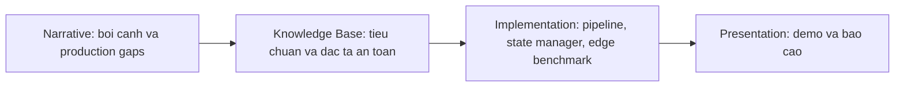

# Prototype to Production Narrative - ADAS TSR

> **Vai trò file này:** điểm xuất phát của luồng tài liệu tuyến tính.
>
> **Phạm vi:** kể câu chuyện chuyển từ demo nghiên cứu sang hệ thống TSR có thể chạy trên xe máy Việt Nam, chỉ nêu lỗ hổng sản xuất ở mức bối cảnh. Phân tích tiêu chuẩn chi tiết nằm trong `../2.knowledge_base/`; tham số CLI và mã nguồn nằm trong `../3.implementation/`.
>
> **Bản đầy đủ trước refactor:** [Legacy Prototype to Production Full Reference](legacy_prototype_to_production_full_reference.md).

## 1. Bài Toán

Traffic Sign Recognition (TSR) biến hình ảnh từ camera trước thành thông tin biển báo có ích cho người lái hoặc các chức năng ADAS. Ở mức prototype, hệ thống chỉ cần đọc video, phát hiện biển báo, gán nhãn và vẽ kết quả. Ở môi trường xe thật, bài toán rộng hơn: kết quả phải ổn định, có ngữ cảnh, có trạng thái suy giảm và không khiến người lái hiểu nhầm khi camera hoặc phần cứng không còn đủ tin cậy.

Repo `adas-tsr` bắt đầu từ mục tiêu thực tế của bài giữa kỳ: có một pipeline chạy được trên video đường Việt Nam. Từ nền tảng đó, tài liệu nghiên cứu phát triển thành câu hỏi lớn hơn: cần thêm những gì để một demo nhận diện biển báo tiến gần hơn tới một feature automotive có kỷ luật?

## 2. Prototype Ban Đầu

Prototype hiện tại dựa trên một baseline inference đơn giản:

- input là video file hoặc webcam;
- frame được tiền xử lý nhẹ;
- YOLO/Ultralytics phát hiện và phân loại biển báo;
- có thể bật nhánh CV truyền thống để đối chiếu candidate;
- kết quả được vẽ lên video output.

Mục tiêu của prototype là tạo bằng chứng trực quan: hệ thống có thể nhìn thấy biển báo trong footage thực tế, hiển thị nhãn và tạo video demo để trình bày. Đây là đúng phạm vi của một dự án nghiên cứu/giữa kỳ, nhưng chưa phải là feature TSR sản xuất.

## 3. Khi Đưa Lên Xe Máy Thực Tế

Xe máy tại Việt Nam tạo ra nhiều điều kiện khó hơn so với notebook hoặc video mẫu:

- mưa lớn làm kính/camera mờ và che khuất biển báo;
- nước mưa chảy loang làm ảnh mất nét theo từng vùng;
- mặt trời thấp, đèn pha ban đêm hoặc biển phản quang gây lóa;
- rung động từ động cơ và mặt đường làm bbox dao động;
- phần cứng biên có thể yếu, nóng và giảm tốc độ xử lý;
- người lái có thể tin quá mức vào HMI nếu hệ thống không báo trạng thái suy giảm.

Các vấn đề này không chỉ làm giảm accuracy. Chúng làm thay đổi hành vi hệ thống: biển có thể lúc hiện lúc mất, cảnh báo đến muộn, hoặc hệ thống tiếp tục hiển thị thông tin cũ trong khi ảnh hiện tại không còn đủ chất lượng.

## 4. Production Gaps

Khoảng cách từ prototype tới production không nằm ở một model duy nhất. Nó nằm ở các lớp hành vi bị thiếu giữa detector và HMI.

| Khoảng trống | Biểu hiện trong prototype | Rủi ro khi chạy thực tế |
|---|---|---|
| Chất lượng ảnh | Camera mưa mờ/lóa vẫn được đưa vào detector như frame bình thường. | False negative hoặc false positive không có reason code. |
| Ổn định theo thời gian | Overlay được làm mượt nhẹ, nhưng chưa có lifecycle biển báo đầy đủ. | HMI chớp tắt hoặc giữ biển cũ quá lâu. |
| Phần cứng biên | Video độ phân giải cao có thể làm CPU/ECU quá tải. | Cảnh báo trễ sau khi xe đã đi qua biển báo. |
| Ngữ cảnh vận hành | Chưa có ODD và trạng thái out-of-ODD rõ ràng. | Người lái không biết khi nào feature không còn đáng tin. |
| Giao diện hệ thống | Output chính là video overlay. | Overlay demo dễ bị hiểu nhầm là HMI production. |

Những gap này là đầu vào cho Knowledge Base. Tại đó, chúng được chuyển hóa thành yêu cầu theo ISO 26262-12, ISO 21448 (SOTIF), IEEE 2020-2024 và Euro NCAP Speed Assistance.

## 5. Luồng Tuyến Tính Của Tài Liệu

Từ narrative này, người đọc nên đi một chiều:

```mermaid
flowchart LR
    A[Narrative: boi canh va production gaps] --> B[Knowledge Base: tieu chuan va dac ta an toan]
    B --> C[Implementation: pipeline, state manager, edge benchmark]
    C --> D[Presentation: demo va bao cao]
```

Ý nghĩa từng tầng:

| Tầng | Câu hỏi chính | Không nên chứa |
|---|---|---|
| Narrative | Vì sao prototype chưa đủ cho xe thật? | Code, tham số CLI, bảng tiêu chuẩn chi tiết. |
| Knowledge Base | Tiêu chuẩn và đặc tả an toàn yêu cầu gì? | Mã nguồn cụ thể hoặc hướng dẫn chạy lệnh. |
| Implementation | Repo hiện thực hóa yêu cầu đó như thế nào? | Lý thuyết tiêu chuẩn dài hoặc câu chuyện mở bài. |
| Presentation | Cần kể gì trong báo cáo/demo? | Nội dung gốc thay thế cho ba tầng trên. |

## 6. Kết Luận Narrative

Prototype đã đạt vai trò nền tảng: chạy được pipeline nhận diện biển báo và tạo video minh họa. Bước tiếp theo không phải chỉ là đổi model, mà là đưa thêm kỷ luật hệ thống: kiểm soát chất lượng ảnh, quản lý trạng thái biển báo, giảm tải phần cứng, báo degraded/unavailable rõ ràng và tạo evidence có thể kiểm thử.

Đọc tiếp theo:

- [2.01. Automotive Standards](../2.knowledge_base/01.automotive_standards.md)
- [2.02. Camera Sensor and IEEE 2020](../2.knowledge_base/02.camera_sensor_ieee2020.md)
- [2.03. Safety Analysis HAZOP and FTA](../2.knowledge_base/03.safety_analysis_hazop_fta.md)
