# (1) Traffic Sign Recognition (TSR) cho ADAS Ô Tô — Tài Liệu Thống Nhất 3 Phần

> **Thứ tự đọc:** 1 — entrypoint chính của thư mục `research/`.  
> **Đối tượng đọc:** Tech lead thiết kế triển khai TSR trên embedded automotive.  
> **Ngày cập nhật:** 2026-06-20 | **Phạm vi repo:** `adas-tsr`

---

## 0. Metadata và hướng dẫn đọc

| Thuộc tính | Giá trị |
|---|---|
| Script baseline | [`code/tsr_demo.py`](../code/tsr_demo.py) |
| Model | `models/best.pt` (82 class biển báo VN) |
| Tài liệu chuyên đề | [2.research_tsr_baseline_analysis.md](2.research_tsr_baseline_analysis.md) (gắn `tsr_demo.py`), [3.research_tsr_detection_architecture_research.md](3.research_tsr_detection_architecture_research.md) (kiến trúc detector) |
| Sơ đồ HTML Phần II | [assets/diagrams/tsr_production_ecu_architecture.html](assets/diagrams/tsr_production_ecu_architecture.html) |
| Nguồn tham khảo | [sources.md](sources.md) |

### 0.1 Thứ tự đọc tài liệu trong `research/`

| # | File | Nội dung |
|---|---|---|
| **1** | `1.research_tsr_three_part_unified.md` | Báo cáo hệ thống + production + demo (file này) |
| **2** | `2.research_tsr_baseline_analysis.md` | `tsr_demo.py`, `best.pt`, dataset, gap → điểm yếu |
| **3** | `3.research_tsr_detection_architecture_research.md` | Kiến trúc detector (anchor, neck, NMS, RT-DETR) |
| — | `sources.md` | Trích dẫn và provenance |

### 0.2 Cách đọc theo vai trò

| Vai trò | Đọc |
|---|---|
| Người mới TSR | **1** (Phần I → II → III) → **2** → **3** |
| Tech lead embedded | **1** Phần II (§II.1–II.19) + HTML diagram → **2** → **3** khi đổi model |
| Chỉ làm code/demo | **1** Phần III → **2** |
| System architect / perception lead | **1** Phần II đầy đủ → **2**/**3** khi cần trace implementation hoặc detector architecture |

### 0.3 Legend màu Mermaid

> Legend này áp dụng cho các sơ đồ Mermaid đã được tô màu trong tài liệu. Không phải sơ đồ nào cũng dùng đủ mọi màu.

| Màu | Vai trò | Ý nghĩa |
|---|---|---|
| <span style="display:inline-block;width:14px;height:14px;border:1px solid #C78600;background:#FFF5DD;"></span> | `baseline` | Thành phần baseline hiện tại, demo hiện có, hoặc điểm khởi đầu của repo |
| <span style="display:inline-block;width:14px;height:14px;border:1px solid #2F66D0;background:#EDF3FF;"></span> | `feature` | Khối xử lý chính, perception logic, hoặc feature pipeline cốt lõi |
| <span style="display:inline-block;width:14px;height:14px;border:1px solid #7C3AED;background:#F4ECFF;"></span> | `temporal` | Tracking, state, lifecycle, temporal confirmation, hoặc logic theo thời gian |
| <span style="display:inline-block;width:14px;height:14px;border:1px solid #14866D;background:#EAF7F2;"></span> | `source` | Input, sensor, data source, hoặc đầu vào ban đầu của pipeline |
| <span style="display:inline-block;width:14px;height:14px;border:1px solid #1E8E5A;background:#E8F7EE;"></span> | `integration` | Output, publish path, HMI, diagnostics, hoặc tích hợp hệ thống xe |
| <span style="display:inline-block;width:14px;height:14px;border:1px solid #C2410C;background:#FDECEC;"></span> | `risk` | Gap, lỗi, blocking issue, unavailable path, hoặc điểm cần giảm rủi ro |
| <span style="display:inline-block;width:14px;height:14px;border:1px solid #D97706;background:#FFF1E0;"></span> | `decision` | Gate, nhánh quyết định, arbitration, hoặc logic pass/fail |
| <span style="display:inline-block;width:14px;height:14px;border:1px solid #DB2777;background:#FCEFF5;"></span> | `support` | Monitoring, utility block, logging, watchdog, hoặc khối hỗ trợ phụ trợ |

---

## Tóm tắt điều hành

TSR trông đơn giản ở mức demo CV, nhưng trên xe thật là **feature hệ thống liên ngành**: camera, ECU, bus, HMI, diagnostics, safety, SOTIF, cybersecurity, OTA, validation, vận hành hiện trường. Thiết kế TSR không thể dừng ở "model nào tốt nhất" mà phải trả lời đồng thời:

- Tính năng hoạt động trong ODD nào?
- Camera và ECU nào đảm nhận?
- Output nào đi tới cluster/HUD, với policy nào?
- Khi sensor hoặc runtime lỗi, xe phản ứng ra sao?
- Làm sao update model sau SOP mà vẫn kiểm soát rủi ro?

Repo `adas-tsr` cung cấp baseline inference (`tsr_demo.py`) phù hợp nghiên cứu/prototype. Production TSR phải biến perception thành **vehicle feature có nghĩa** — không release dựa trên mAP và video đẹp, mà chỉ khi state behavior, diagnostics behavior, và HMI behavior đã khóa như automotive feature thật.

Theo `ISO 26262`, dự án phải theo safety lifecycle với traceability từ item definition tới verification. Theo `ISO 21448`, TSR camera-based còn phải xử lý **functional insufficiency** và **reasonably foreseeable misuse** — các ca không có fault cổ điển nhưng vẫn nguy hiểm do giới hạn cảm biến/ODD/đặc tả.

**Câu hỏi review Tier-1/OEM:** *"Detector chạy được trên video có nghĩa là feature sẵn sàng production chưa?"* — **Chưa**, nếu thiếu tracking/lifecycle, lane association, context filter, fusion, ISA abstraction, KPI theo event, SOTIF catalog, edge parity và release gate.

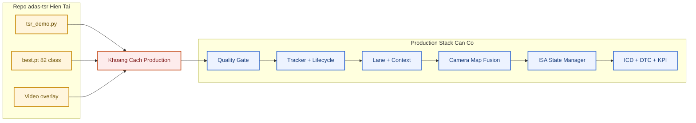

| Mức trưởng thành | Repo hiện tại | Evidence cần có để lên mức tiếp |
|---|---|---|
| L0 Offline demo | **Đang ở đây** — overlay video, ~7–8 FPS CPU | Script chạy ổn định, benchmark protocol |
| L1 Advisory prototype | Thiếu JSONL, per-class eval | `--jsonl-output`, KPI script |
| L2 Confirmed HMI | Thiếu tracker thật (`hold` ≠ tracking) | Track ID, lifecycle, flicker KPI |
| L3 ISA-ready | Thiếu map/ego speed/ISA model | Fusion arbiter, speed canonicalization |
| L4+ AD context | Thiếu lane/map/planning interface | Full stack integration + safety case |

---

# Phần I. Nghiên Cứu và Thiết Kế Hệ Thống

> Mục tiêu: xây tư duy đúng về TSR như automotive feature, không phải notebook object detection.

---

## I.1 TSR là gì và không phải là gì

Traffic Sign Recognition (TSR) dùng camera trước để phát hiện và phân loại biển báo, chuyển kết quả thành thông tin cho người lái hoặc feature cao hơn (ISA).

**TSR không phải:**
- Chỉ object detection;
- Chỉ video overlay;
- Chỉ chọn model mAP cao nhất.

**TSR thực tế liên quan:** camera, ECU/runtime, HMI, diagnostics, watchdog, ODD, safety, SOTIF, map context, OTA, post-SOP governance.

**Ví dụ — detector vs feature**

| Mức | Hành vi |
|---|---|
| Detector | Nhìn thấy hình tròn đỏ, gán `Speed limit 50 km/h` |
| Feature trưởng thành | Xác nhận 3 frame liên tiếp → kiểm tra ODD → đối chiếu HMI policy → mới phát icon/chime |

Khoảng cách giữa hai hàng trên là khoảng cách từ **CV demo** tới **automotive feature**.

---

## I.2 Bài toán kỹ thuật đúng: năm lớp xử lý

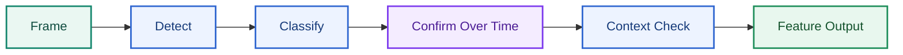

| Lớp | Nội dung | Bỏ qua hậu quả |
|---|---|---|
| 1. Nhìn thấy | Phát hiện đúng vùng biển trong frame, đủ kích thước và chất lượng để các bước sau còn ý nghĩa | Miss sign hoàn toàn; các bước sau không còn gì để cứu |
| 2. Gán class | Phân loại đúng loại biển, giá trị biển và confidence đủ tin cậy/có calibrate | False advisory; áp sai giới hạn tốc độ hoặc sai loại cấm/cảnh báo |
| 3. Xác nhận thời gian | Ổn định qua nhiều frame bằng tracking hoặc temporal confirmation, tránh quyết định từ one-frame glitch | Flicker HMI; sign lúc hiện lúc mất; giữ sign cũ quá lâu hoặc clear quá sớm |
| 4. Ngữ cảnh ego | Xác định biển có thực sự áp dụng cho xe ego: đúng làn, đúng hướng đi, đúng đoạn đường, đúng thời điểm | Nhận đúng biển nhưng áp cho nhầm làn/nhánh đường; advisory đúng theo detector nhưng sai theo ngữ cảnh lái xe |
| 5. Output có kiểm soát | Xuất advisory/HMI/signal theo state machine, hysteresis, timeout và degraded/unavailable behavior rõ ràng | HMI gây hiểu nhầm; feature phản ứng thất thường; malfunctioning behavior ở mức hệ thống |

Chỉ làm tốt lớp 1–2 → hệ thống vẫn chưa đủ an toàn cho triển khai thực tế.

---

## I.3 Mục tiêu dự án và item definition

### I.3.1 Mục tiêu ngắn gọn

- Phát hiện/phân loại biển tĩnh phía trước bằng camera trước;
- Cung cấp cảnh báo đáng tin cậy lên HMI;
- Tạo đầu ra sẵn sàng tích hợp ISA hoặc feature logic cao hơn;
- Vận hành an toàn trong ODD đã xác định;
- Có cơ chế `DEGRADED` / `UNAVAILABLE` rõ ràng.

### I.3.2 Item definition phase-1 (production đề xuất)

| Hạng mục | Giá trị đề xuất |
|---|---|
| Authority | `advisory only`; chỉ hiển thị/cảnh báo, chưa tự can thiệp ga phanh |
| Sensor | Camera trước; giả định đường capture và timestamp đủ ổn định cho feature |
| Output chính | Biển đã confirm cho cluster/HUD, kèm trạng thái availability và quality |
| Integration đích | Xuất signal sạch để pha sau nối sang ISA hoặc map-consistency |
| ODD phase-1 | Đô thị/quốc lộ nhẹ; ngày hoặc đêm đủ sáng; mưa nhẹ; camera sạch; biển tĩnh vật lý |
| Fallback | `DEGRADED` giảm capability; `SAFE_DISABLE` ngừng advisory mới; `UNAVAILABLE` báo feature không dùng được |

**Ví dụ item definition có kỷ luật:** *"TSR advisory only cho biển tĩnh phía trước trong ODD phase-1."*  
**Ví dụ yếu:** *"Dùng YOLO nhận diện biển báo"* — nói về thuật toán, không nói về feature.

### I.3.3 Bảng item definition đầy đủ

| Hạng mục | Nội dung cần xác định |
|---|---|
| Chức năng chính | Detect/classify biển tĩnh phía trước và phát advisory đã confirm, không phát raw detector output |
| Kiểu authority | Chỉ advisory hay đã được phép cấp dữ liệu cho ISA/arbitration khác |
| Sensor | Camera nào, vị trí lắp, FOV, HDR/WDR, frame rate và điều kiện hiệu chuẩn |
| Compute platform | ECU/SoC nào chạy, OS/runtime gì, budget CPU/RAM/nhiệt ra sao |
| ODD | Loại đường, dải tốc độ, ánh sáng, thời tiết và điều kiện camera được coi là hợp lệ |
| Output | HMI nào nhận gì, có chime không, signal nào đi CAN/Ethernet, log nào lưu lại |
| Fallback | Khi degrade hoặc fault thì feature giảm gì, dừng gì, báo cho ai |
| KPI | Recall/precision, false advisory, latency, availability, độ phủ diagnostics |

---

## I.4 Work products và chuỗi tài liệu dự án

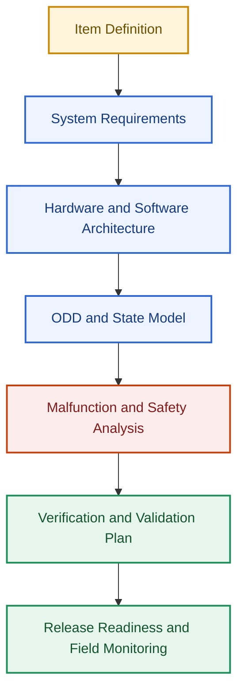

| Nhóm tài liệu | Mục đích |
|---|---|
| Item Definition | Khóa phạm vi feature, authority, ODD và assumption nền |
| Interface Control Document (ICD) | Chốt signal/message, timing, ownership, DTC/DID giữa các bên |
| Safety/SOTIF Analysis | Ghi rõ hazard, trigger condition, giới hạn perception và reaction concept |
| SW/HW Architecture | Phân bổ chức năng theo ECU, task, module và đường dữ liệu |
| Verification Plan | Xác định test level, KPI, pass criteria và evidence phải thu |
| Release Checklist | Chặn việc phát hành khi thiếu integration, diagnostics hoặc rollback evidence |

---

## I.5 Kiến trúc hệ thống mức xe

Hệ thống TSR không chỉ là một mô hình AI phát hiện biển báo. Trên xe thật, đây là chuỗi chuyển đổi tín hiệu nhiều tầng — từ cảnh đường thực tế, qua các thành phần phần cứng/phần mềm, đến thông tin hiển thị cho người lái và các hệ thống hỗ trợ lái xe.

### I.5.1 Kiến trúc thành phần

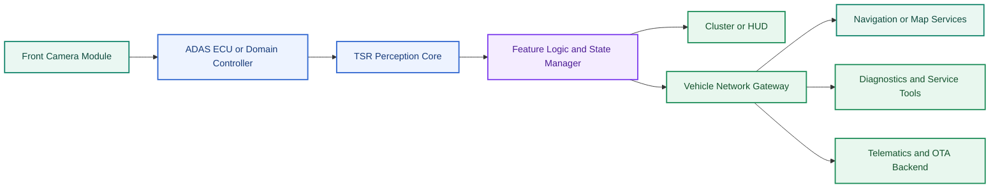

#### Góc nhìn phân lớp bên trong TSR ECU

Sơ đồ trên mô tả kiến trúc mức xe. Nếu zoom vào bên trong ECU chạy TSR, pipeline thường chia thành ba lớp: `Perception Layer`, `Feature Logic Layer` và `Vehicle Integration Layer`. Đây là cầu nối rõ ràng giữa detector/classifier và feature hành vi trên xe.

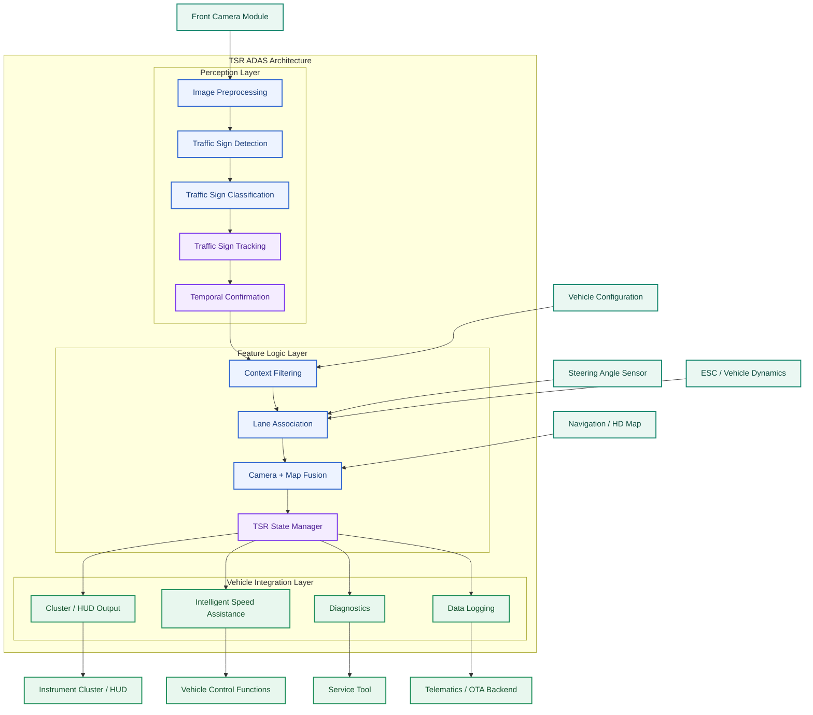

| Lớp | Vai trò | Khác biệt cốt lõi |
|---|---|---|
| Perception Layer | Biến ảnh camera thành sign candidates có class, confidence, track và xác nhận theo thời gian | Chưa quyết định biển nào thực sự áp dụng cho xe ego |
| Feature Logic Layer | Lọc ngữ cảnh, gắn làn, đối chiếu bản đồ và quyết định sign hiệu lực | Đây là nơi biến AI output thành TSR feature behavior |
| Vehicle Integration Layer | Xuất kết quả sang HMI, ISA, diagnostics và logging | Đảm bảo feature sống được trong hệ thống xe thật, không chỉ trong demo |

### I.5.2 Trách nhiệm và luồng tín hiệu

| Thành phần | Trách nhiệm chính | Đầu vào | Đầu ra |
|---|---|---|---|
| Front Camera Module | Thu nhận hình ảnh phía trước xe | Cảnh đường thực tế, điều kiện ánh sáng, môi trường | Luồng ảnh, timestamp, trạng thái camera |
| ADAS ECU / Domain Controller | Nền tảng tính toán cho các thuật toán ADAS | Khung hình camera, dữ liệu xe, tham số hiệu chuẩn | Kết quả perception, dữ liệu trung gian |
| TSR Perception Core | Phát hiện, phân loại và theo dõi biển báo | Hình ảnh, mô hình AI, lịch sử theo dõi | Traffic sign candidates |
| Feature Logic & State Manager | Chuyển kết quả perception thành chức năng TSR thực tế | Dữ liệu perception, bản đồ, làn đường, trạng thái xe | Giới hạn tốc độ hiệu lực, cảnh báo, trạng thái TSR |
| Instrument Cluster / HUD | Hiển thị thông tin cho người lái | Trạng thái TSR, yêu cầu hiển thị | Biểu tượng và cảnh báo |
| Vehicle Network Gateway | Phân phối dữ liệu giữa các ECU | Dữ liệu TSR, trạng thái hệ thống | CAN/FlexRay/Ethernet messages |
| Navigation / Map Services | Cung cấp dữ liệu bản đồ hỗ trợ TSR | GPS, HD Map | Giới hạn tốc độ từ bản đồ, thông tin ngữ cảnh |
| Diagnostics & Service Tools | Giám sát sức khỏe hệ thống | Diagnostic messages | DTC, log lỗi, báo cáo bảo trì |
| Telematics & OTA Backend | Quản lý đội xe và cập nhật phần mềm | Telemetry, KPI vận hành | OTA package, báo cáo phân tích |

### I.5.3 Mô tả chi tiết từng thành phần

#### Front Camera Module

Cảm biến chính của hệ thống TSR.

| Hạng mục | Nội dung |
|---|---|
| Trách nhiệm | Thu nhận hình ảnh phía trước xe; điều khiển phơi sáng (Exposure Control); cân bằng trắng (White Balance); đồng bộ thời gian với các cảm biến khác |
| Đầu vào | Môi trường giao thông; điều kiện ánh sáng; điều kiện thời tiết |
| Đầu ra | RGB Frames; Timestamp; Camera Health Status |
| Lỗi thường gặp | Bụi bẩn trên ống kính; nước mưa che khuất; lóa sáng mặt trời; Motion Blur; mất nét |

#### ADAS ECU / Domain Controller

Bộ xử lý trung tâm thực hiện các thuật toán ADAS.

| Hạng mục | Nội dung |
|---|---|
| Trách nhiệm | Chạy mô hình AI; thực hiện inference thời gian thực; điều phối tài nguyên CPU/GPU/NPU; giao tiếp với các ECU khác |
| Đầu vào | Camera Frames; Vehicle Speed; Yaw Rate; Calibration Data; Map Data |
| Đầu ra | Traffic Sign Candidates; Perception Metadata; Feature Status |
| Yêu cầu Automotive | Độ trễ thấp (Low Latency); Deterministic Execution; Health Monitoring; Functional Safety Monitoring |

#### TSR Perception Core

Lõi perception của hệ thống TSR.

| Hạng mục | Nội dung |
|---|---|
| Trách nhiệm | Traffic Sign Detection; Traffic Sign Classification; Traffic Sign Tracking; Confidence Estimation; Temporal Fusion |
| Đầu vào | Camera Frames; AI Models; Track History |
| Đầu ra | Bounding Box; Class ID; Confidence Score; Track ID; Track Age |
| Ví dụ | Class = Speed Limit 60; Confidence = 0.97; Track ID = 125; Track Age = 12 frames |
| Luồng xử lý nội bộ | Camera Frame → Detector → Classifier → Tracker → Temporal Fusion → Traffic Sign Candidate |

#### Feature Logic & State Manager

Chuyển kết quả AI thành chức năng TSR thực tế cho xe.

| Hạng mục | Nội dung |
|---|---|
| Trách nhiệm | Sign Confirmation; Sign Expiration; Lane Relevance Filtering; Map Fusion; ISA Logic; Driver Notification |
| Đầu vào | Perception Results; Lane Model; Map Speed Limit; Vehicle State |
| Đầu ra | Active Speed Limit; Warning State; TSR State |
| Ví dụ | Detector phát hiện 50 km/h, nhưng hệ thống xác định biển chỉ áp dụng cho làn rẽ phải → không kích hoạt giới hạn tốc độ mới |
| Luồng xử lý | Perception Output → Context Filter → Lane Association → Map Fusion → State Manager → Active Speed Limit |

#### Instrument Cluster / HUD

Giao diện người dùng của TSR.

| Hạng mục | Nội dung |
|---|---|
| Trách nhiệm | Hiển thị giới hạn tốc độ; hiển thị cảnh báo; thông báo cho người lái |
| Đầu vào | TSR State; HMI Commands |
| Đầu ra | Speed Limit Icon; Visual Warning; Driver Notification |
| Tác động khi lỗi | Hiển thị sai thông tin; giảm độ tin cậy của ADAS; gây hiểu nhầm cho người lái |

#### Vehicle Network Gateway

Thành phần trung gian trao đổi dữ liệu giữa các ECU.

| Hạng mục | Nội dung |
|---|---|
| Trách nhiệm | Signal Routing; Protocol Translation; Network Distribution |
| Đầu vào | TSR Outputs; Diagnostic Status |
| Đầu ra | CAN Messages; Ethernet Messages; Gateway Signals |
| Ví dụ | CurrentSpeedLimit = 80; Confidence = High; Source = Camera + Map Fusion |

#### Navigation / Map Services

Cung cấp ngữ cảnh giao thông từ bản đồ.

| Hạng mục | Nội dung |
|---|---|
| Trách nhiệm | Map Speed Limit; Road Classification; Road Geometry; Context Support |
| Đầu vào | GPS Position; GNSS Signals; HD Map Database |
| Đầu ra | Map Speed Limit; Road Attributes; Road Context |
| Ví dụ | Camera = 80 km/h, Map = 80 km/h → hệ thống tăng độ tin cậy cho kết quả TSR |
| Luồng Camera + Map Fusion | Camera TSR + HD Map → Fusion Engine → Confidence Evaluation → Final Speed Limit |

#### Diagnostics & Service Tools

Theo dõi sức khỏe hệ thống.

| Hạng mục | Nội dung |
|---|---|
| Trách nhiệm | Health Monitoring; Fault Detection; Service Support |
| Đầu vào | Diagnostic Messages; Health Status; Fault Events |
| Đầu ra | DTC Codes; Error Logs; Service Reports |
| Ví dụ DTC | TSR_CAMERA_BLOCKED; TSR_MODEL_TIMEOUT; TSR_MAP_SYNC_ERROR |

#### Telematics & OTA Backend

Hỗ trợ quản lý đội xe và cập nhật phần mềm từ xa.

| Hạng mục | Nội dung |
|---|---|
| Trách nhiệm | Fleet Analytics; Remote Diagnostics; Software Updates; Performance Monitoring |
| Đầu vào | Vehicle Telemetry; TSR Statistics; Failure Reports |
| Đầu ra | Fleet KPI Dashboard; OTA Packages; Engineering Reports |
| Luồng OTA | Engineering Team → OTA Backend → Vehicle Gateway → ADAS ECU → TSR Software Update |

### I.5.4 Chuyển đổi tín hiệu từ cảm biến đến người lái

Mỗi tầng trong pipeline có trách nhiệm chuyển đổi dữ liệu thô thành thông tin có ý nghĩa đối với người lái và các hệ thống hỗ trợ lái xe.

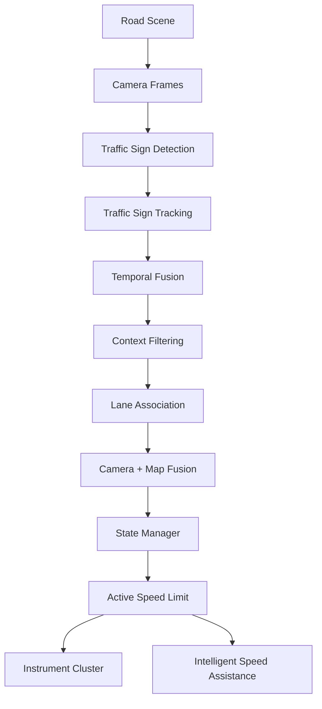

#### Luồng chuyển đổi dữ liệu

| Giai đoạn | Đầu vào | Đầu ra | Mục tiêu | Nếu thiếu giai đoạn này |
|---|---|---|---|---|
| Road Scene | Môi trường giao thông thực tế | Cảnh vật phía trước xe | Nguồn thông tin ban đầu | Không có dữ liệu để nhận thức |
| Camera Frames | Cảnh vật thực tế | Hình ảnh số hóa | Chuyển đổi thế giới thực thành dữ liệu xử lý được | TSR không thể hoạt động |
| Traffic Sign Detection | Camera Frames | Bounding Boxes | Xác định vị trí biển báo trong ảnh | Không biết biển báo nằm ở đâu |
| Traffic Sign Tracking | Bounding Boxes | Sign Tracks | Duy trì nhận dạng qua nhiều frame | Kết quả nhấp nháy (flicker) |
| Temporal Fusion | Sign Tracks | Stable Sign Hypotheses | Tổng hợp thông tin theo thời gian | Dễ sinh false positive hoặc false negative |
| Context Filtering | Stable Sign Hypotheses | Relevant Signs | Loại bỏ biển báo không liên quan | Hiển thị sai biển báo |
| Lane Association | Relevant Signs | Lane-Relevant Signs | Xác định biển báo áp dụng cho làn hiện tại | Áp dụng nhầm biển báo của làn khác |
| Camera + Map Fusion | Lane-Relevant Signs, HD Map | Validated Signs | Tăng độ tin cậy bằng dữ liệu bản đồ | Giảm độ ổn định và độ chính xác |
| State Manager | Validated Signs | Active Speed Limit | Quyết định trạng thái TSR cuối cùng | Không có logic vòng đời biển báo |
| Instrument Cluster | Active Speed Limit | Thông tin hiển thị | Cung cấp thông tin cho người lái | Người lái không nhận được kết quả |
| Intelligent Speed Assistance | Active Speed Limit | Speed Advisory / Intervention | Hỗ trợ duy trì tốc độ phù hợp | Không hỗ trợ điều khiển tốc độ |

#### Chuyển đổi giá trị qua từng tầng

Ví dụ khi xe tiếp cận biển báo tốc độ 80 km/h:

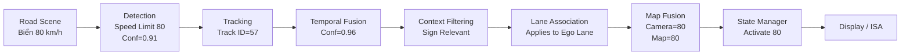

Trong ví dụ trên, giá trị "80 km/h" không được hiển thị ngay sau bước Detection. Hệ thống cần nhiều tầng xác nhận để đảm bảo biển báo:

- Thực sự tồn tại.
- Không phải kết quả nhận dạng sai.
- Áp dụng cho làn đường hiện tại.
- Phù hợp với dữ liệu bản đồ.
- Đủ độ tin cậy để hiển thị cho người lái.

#### Góc nhìn kiến trúc Production TSR

Trong các hệ thống TSR học thuật, pipeline thường dừng lại ở bước Detection hoặc Classification:

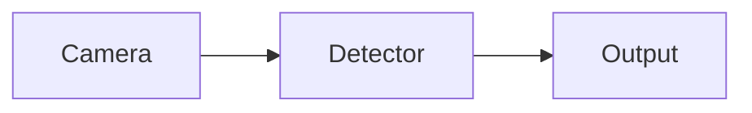

Trong các hệ thống TSR production của OEM hoặc Tier-1, pipeline thường bao gồm:

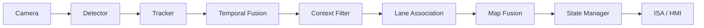

Điểm khác biệt lớn nhất là phần lớn độ phức tạp của hệ thống TSR production không nằm ở mô hình AI mà nằm ở các tầng xử lý sau Detection nhằm đảm bảo tính ổn định, độ tin cậy và mức độ phù hợp với ngữ cảnh giao thông thực tế.

### I.5.5 Điều người mới thường bỏ sót

Người mới hay nghĩ `TSR = model + video output`. Trên xe thật:

- Camera module, SerDes, timestamp, cluster mapping, watchdog, OTA package, DTC quan trọng ngang model;
- Bug mapping class → icon có thể gây hại dù detector đúng;
- Camera HDR kém có thể làm feature fail trên xe dù benchmark lab đẹp.

---

## I.6 Phần cứng và thiết bị

Trong hệ thống Traffic Sign Recognition (TSR), phần cứng đóng vai trò quyết định khả năng thu nhận dữ liệu, tốc độ xử lý và độ ổn định của toàn bộ hệ thống. Một mô hình AI có độ chính xác cao vẫn có thể cho kết quả kém nếu camera không đủ chất lượng, ECU không đáp ứng được thời gian xử lý hoặc dữ liệu không được truyền ổn định.

Do đó, khi thiết kế hệ thống TSR production, việc lựa chọn phần cứng cần được thực hiện song song với quá trình phát triển thuật toán.

---

### I.6.1 Kiến trúc phần cứng mức hệ thống

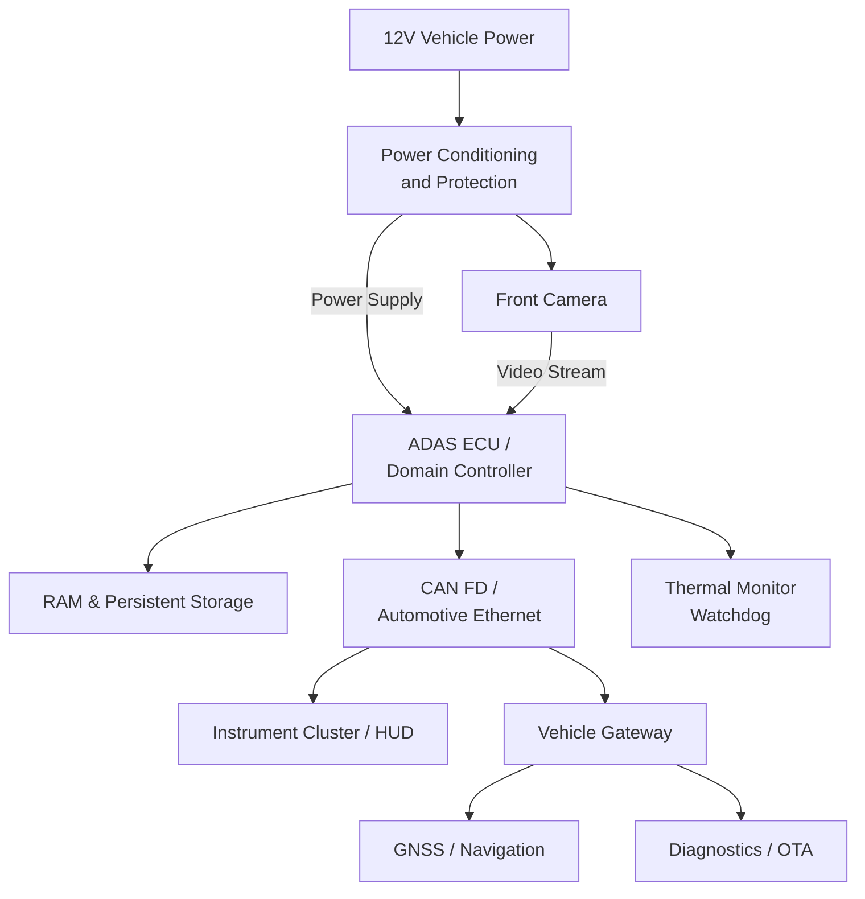

Kiến trúc trên mô tả luồng dữ liệu và kết nối giữa các thành phần phần cứng chính của hệ thống TSR.

Toàn bộ hệ thống bắt đầu từ nguồn điện 12V của xe. Nguồn này được đưa qua mạch **Power Conditioning and Protection** nhằm ổn định điện áp và bảo vệ ECU trước các hiện tượng như sụt áp (brownout), tăng áp (load dump), đảo cực hoặc nhiễu điện từ.

Sau khi được cấp nguồn, **Front Camera** thu nhận hình ảnh phía trước xe và truyền dữ liệu tới **ADAS ECU hoặc Domain Controller**. Đây là trung tâm xử lý của toàn bộ hệ thống TSR, nơi thực hiện các bước tiền xử lý ảnh, chạy mô hình AI, hậu xử lý và đưa ra quyết định cuối cùng.

ECU sử dụng **RAM** để lưu dữ liệu tạm thời trong quá trình xử lý từng frame, đồng thời lưu trữ mô hình AI, tham số hiệu chỉnh và firmware trong **Persistent Storage** (Flash hoặc eMMC/UFS).

Kết quả nhận dạng sau đó được gửi qua **CAN FD** hoặc **Automotive Ethernet** để hiển thị trên **Instrument Cluster**, **HUD** hoặc truyền sang các ECU khác.

Thông qua **Vehicle Gateway**, ECU cũng có thể trao đổi dữ liệu với:

- Hệ thống định vị GNSS và bản đồ HD phục vụ Camera + Map Fusion.
- Hệ thống OTA để cập nhật firmware hoặc AI model.
- Thiết bị chẩn đoán (Diagnostic Tool) phục vụ bảo dưỡng và sửa chữa.

Song song với pipeline xử lý, **Thermal Monitor và Watchdog** liên tục giám sát nhiệt độ, mức sử dụng tài nguyên và trạng thái hoạt động của ECU nhằm phát hiện các lỗi như quá nhiệt, treo tiến trình hoặc vượt quá giới hạn thời gian xử lý.

---

### Luồng dữ liệu phần cứng

| Bước | Thành phần | Input | Output | Vai trò |
|------|------------|--------|---------|----------|
| 1 | Vehicle Power | 12V Battery | Stable Power | Cấp nguồn cho toàn hệ thống |
| 2 | Power Conditioning | Vehicle Power | Protected Power | Ổn định và bảo vệ nguồn |
| 3 | Front Camera | Road Scene | Video Frames | Thu nhận hình ảnh |
| 4 | ADAS ECU | Video Frames | TSR Result | Xử lý thuật toán TSR |
| 5 | Vehicle Network | TSR Result | Vehicle Signals | Truyền dữ liệu tới ECU khác |
| 6 | Cluster / HUD | Vehicle Signals | Driver Information | Hiển thị cho người lái |
| 7 | Navigation | GPS Position | Speed Limit Database | Hỗ trợ Map Fusion |
| 8 | Diagnostics | ECU Status | DTC / Logs | Chuẩn đoán hệ thống |

---

### I.6.2 Danh mục phần cứng cần chốt

Trước khi bắt đầu phát triển hệ thống TSR production, nhóm phát triển cần xác định rõ các thông số phần cứng. Những quyết định này sẽ ảnh hưởng trực tiếp đến độ chính xác của mô hình AI, độ trễ xử lý, khả năng mở rộng tính năng và chi phí sản phẩm.

| Hạng mục | Câu hỏi cần trả lời | Ý nghĩa kỹ thuật | Ví dụ |
|-----------|---------------------|------------------|--------|
| Camera trước | Độ phân giải, HDR/WDR, FPS, FOV, Rolling hay Global Shutter? | Quyết định chất lượng dữ liệu đầu vào của AI | Camera 2MP HDR 30 FPS |
| Camera Interface | CSI-2, GMSL hay FPD-Link? Khoảng cách Camera–ECU bao nhiêu? | Quyết định băng thông và độ ổn định truyền dữ liệu | GMSL2 cho khoảng cách 10–15 m |
| ADAS ECU | CPU, GPU, NPU, RAM có đủ chạy AI không? | Quyết định latency và khả năng mở rộng | Qualcomm Snapdragon Ride |
| Storage | Dung lượng lưu model và OTA? | Đảm bảo cập nhật firmware an toàn | eMMC 64 GB |
| Vehicle Network | CAN FD hay Ethernet? | Quyết định tốc độ truyền tín hiệu | CAN FD cho HMI, Ethernet cho camera |
| HMI | Hiển thị ở đâu? Có âm thanh cảnh báo không? | Trải nghiệm người lái | Cluster + HUD |
| Power | Có chịu được Brownout, Load Dump không? | Đảm bảo ECU hoạt động ổn định | ISO 16750 |
| Mechanical | Camera rung, lệch góc hay bám bụi thế nào? | Ảnh hưởng trực tiếp tới chất lượng nhận dạng | Camera sau kính chắn gió |

---

### Giải thích chi tiết từng thành phần

#### Front Camera

Camera là cảm biến quan trọng nhất của TSR.

Mọi thuật toán AI đều phụ thuộc vào chất lượng hình ảnh do camera cung cấp.

Một camera production thường cần quan tâm đến:

- Độ phân giải (Resolution)
- HDR hoặc WDR
- Tốc độ khung hình (FPS)
- Dynamic Range
- Field of View (FOV)
- Độ nhạy sáng ban đêm
- Rolling hoặc Global Shutter

Ví dụ:

Một camera 2 MP HDR có thể đủ cho TSR trong môi trường đô thị, nhưng nếu camera đồng thời phục vụ Lane Keeping Assist hoặc Object Detection thì thường cần độ phân giải cao hơn.

---

#### Camera Interface

Camera không truyền dữ liệu trực tiếp bằng CAN.

Do băng thông video rất lớn, các chuẩn truyền tốc độ cao được sử dụng như:

- MIPI CSI-2
- GMSL
- FPD-Link III

Những chuẩn này đảm bảo:

- Độ trễ thấp
- Khoảng cách truyền xa
- Khả năng chống nhiễu cao

---

#### ADAS ECU

Đây là "bộ não" của toàn bộ hệ thống TSR.

ECU chịu trách nhiệm:

- Image preprocessing
- AI inference
- Tracking
- Temporal confirmation
- Map Fusion
- State Machine
- HMI Output

Ngoài hiệu năng xử lý, ECU còn phải đáp ứng:

- Automotive Grade
- Functional Safety
- Nhiệt độ làm việc
- Độ tin cậy lâu dài

---

#### Storage

Storage lưu:

- Firmware
- AI Model
- Calibration Data
- Configuration
- Diagnostic Logs

Trong hệ thống production, firmware thường được lưu theo cơ chế **A/B Partition** để hỗ trợ cập nhật OTA an toàn và rollback khi quá trình cập nhật thất bại.

---

#### Vehicle Network

Sau khi TSR xác định biển báo hợp lệ, ECU sẽ truyền kết quả sang các ECU khác.

Ví dụ:

- Instrument Cluster
- HUD
- Intelligent Speed Assistance
- Adaptive Cruise Control
- Data Logger

Thông thường:

- CAN FD dùng để truyền tín hiệu điều khiển.
- Automotive Ethernet dùng cho dữ liệu tốc độ cao.

---

#### HMI

HMI quyết định cách người lái nhận được thông tin.

Ví dụ:

- Hiển thị biển báo trên bảng đồng hồ.
- Hiển thị trên HUD.
- Âm thanh cảnh báo.
- Voice Notification.
- Icon màu đỏ khi vượt tốc độ.

Thiết kế HMI cần đảm bảo:

- Không gây mất tập trung.
- Không hiển thị nhấp nháy.
- Tuân thủ quy định của OEM.

---

#### Power System

Nguồn điện trên ô tô không ổn định như nguồn máy tính.

Hệ thống cần chống chịu:

- Brownout
- Load Dump
- Reverse Polarity
- Cold Cranking
- EMC

Nếu camera mất nguồn trong vài trăm mili giây, hệ thống TSR cần phát hiện ngay và chuyển sang trạng thái **Degraded** thay vì tiếp tục sử dụng dữ liệu không hợp lệ.

---

#### Mechanical & Thermal

Camera cần được lắp đặt chính xác để đảm bảo góc quan sát không thay đổi.

Ngoài ra cần đánh giá:

- Rung động
- Nhiệt độ
- Bụi bẩn
- Nước mưa
- Tuyết
- Ánh sáng ngược

Các yếu tố này có thể làm giảm chất lượng hình ảnh và ảnh hưởng trực tiếp đến độ chính xác của thuật toán AI.

---

### Ví dụ cấu hình phần cứng

#### Ví dụ A – Xe đô thị

| Thành phần | Cấu hình |
|------------|----------|
| Camera | 2 MP HDR |
| FPS | 30 FPS |
| FOV | 50–60° |
| ECU | Mid-range SoC |
| Network | CAN FD |
| HMI | Instrument Cluster |

Đây là cấu hình phù hợp với các xe chỉ sử dụng TSR để hiển thị hoặc cảnh báo tốc độ.

---

#### Ví dụ B – Xe cao cấp

| Thành phần | Cấu hình |
|------------|----------|
| Camera | 8 MP HDR |
| FPS | 60 FPS |
| Interface | GMSL2 |
| ECU | Automotive AI SoC |
| Network | Automotive Ethernet |
| HMI | Cluster + HUD + ISA |

Trong trường hợp này, camera thường được chia sẻ với nhiều tính năng ADAS khác như:

- Lane Keeping Assist (LKA)
- Automatic Emergency Braking (AEB)
- Adaptive Cruise Control (ACC)
- Traffic Light Recognition (TLR)

Do đó cần cân bằng giữa góc nhìn rộng để hỗ trợ nhiều tính năng và độ phân giải đủ cao để TSR vẫn nhận dạng chính xác các biển báo ở khoảng cách xa.


## I.7 Kiến trúc phần mềm nhúng

### I.7.1 Từ script nghiên cứu đến kiến trúc task-based production

Trong giai đoạn nghiên cứu, TSR thường được triển khai dưới dạng một script hoặc một tiến trình đơn lẻ:

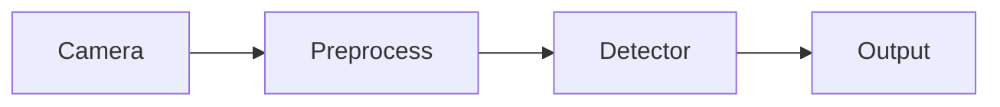

Cách tiếp cận này phù hợp cho:

- Nghiên cứu thuật toán.
- Proof-of-Concept.
- Đánh giá mô hình AI.
- Thử nghiệm trên PC hoặc workstation.

Tuy nhiên, trên ECU production, cách triển khai này không đáp ứng được các yêu cầu về:

- Khả năng giám sát (monitoring).
- Khả năng phục hồi lỗi (fault recovery).
- Khả năng cô lập lỗi (fault containment).
- Khả năng đo lường hiệu năng.
- Functional Safety.
- SOTIF.
- Khả năng bảo trì và cập nhật phần mềm.

Do đó các hệ thống ADAS production thường sử dụng kiến trúc task-based hoặc service-based.

---

### I.7.2 Kiến trúc task-based tổng quát

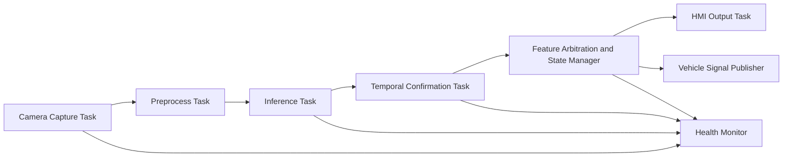

Trong kiến trúc này, mỗi task có thể được:

- Scheduling độc lập.
- Restart độc lập.
- Giám sát độc lập.
- Đo latency riêng.
- Báo lỗi riêng.

Điều này giúp giới hạn phạm vi ảnh hưởng khi xảy ra lỗi.

---

### I.7.3 Trách nhiệm của từng task

| Task | Trách nhiệm | Đầu vào | Đầu ra |
|--------|------------|----------|----------|
| Camera Capture Task | Thu nhận hình ảnh từ camera | Sensor stream | Raw frames |
| Preprocess Task | Resize, normalize, color conversion | Raw frames | Network input tensor |
| Inference Task | Chạy mô hình AI | Tensor | Detection candidates |
| Temporal Confirmation Task | Temporal fusion và sign confirmation | Detection candidates | Stable sign hypotheses |
| Feature Arbitration & State Manager | Xác định sign hợp lệ và trạng thái TSR | Stable signs, vehicle state, map data | Active TSR state |
| HMI Output Task | Hiển thị kết quả cho người lái | Active TSR state | Cluster/HUD commands |
| Vehicle Signal Publisher | Publish TSR signal sang các ECU khác | Active TSR state | CAN/Ethernet messages |
| Health Monitor | Giám sát toàn bộ pipeline | Heartbeat, latency, health counters | Diagnostic events |

---

### I.7.4 Luồng dữ liệu giữa các task

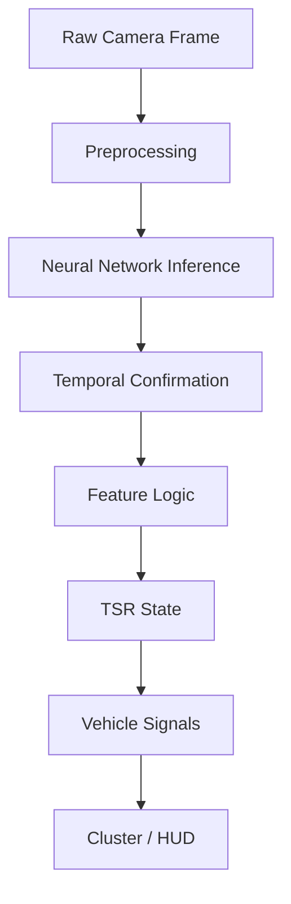

Mỗi task chỉ nhìn thấy dữ liệu cần thiết cho nhiệm vụ của nó.

Điều này giúp:

- Giảm coupling.
- Dễ kiểm thử.
- Dễ thay thế module.
- Hỗ trợ phát triển song song giữa các nhóm.

---

### I.7.5 Fault Containment và Degraded Operation

Một nguyên tắc quan trọng của phần mềm automotive là:

> Hệ thống không nhất thiết phải hoạt động hoàn hảo, nhưng phải biết khi nào nó không còn đáng tin cậy.

Điểm cốt lõi của `fault containment` là cô lập lỗi theo block thay vì để một lỗi cục bộ lan ra thành hành vi hệ thống khó đoán. Trong TSR, detector chậm, camera timestamp lỗi, hoặc quality gate đánh giá ảnh quá xấu không nên trực tiếp biến thành output mơ hồ trên HMI. Mỗi khối phải có ranh giới trách nhiệm, trạng thái sức khỏe và cách báo lỗi riêng để `State Manager` quyết định feature còn `AVAILABLE`, phải `DEGRADED`, hay phải `UNAVAILABLE`.

`Degraded operation` không có nghĩa là hệ thống làm mọi thứ giống trạng thái bình thường nhưng với độ chính xác thấp hơn. Ý nghĩa đúng là feature chủ động giảm authority hoặc giảm capability để giữ hành vi an toàn và dễ giải thích hơn. Ví dụ:

- Bỏ publish sign mới khi quality xuống quá thấp;
- Cho phép giữ sign đã confirm trong thời gian ngắn nhưng không nâng confidence;
- Tắt chime hoặc suppress update mạnh khi hệ thống không chắc;
- Chuyển sang `UNAVAILABLE` nếu lỗi kéo dài vượt giới hạn policy.

Nguyên tắc thiết kế ở đây là:

- Lỗi phải được phát hiện bằng tiêu chí cụ thể: latency budget, nhiệt độ, input timeout, quality score, memory pressure;
- Phản ứng phải xác định trước: degrade gì, giữ gì, bỏ gì, log gì;
- Driver-facing output phải bảo thủ hơn raw perception output;
- Mọi chuyển trạng thái phải đi qua state machine, không xử lý ad-hoc trong detector code.

Ví dụ ECU bị quá nhiệt.

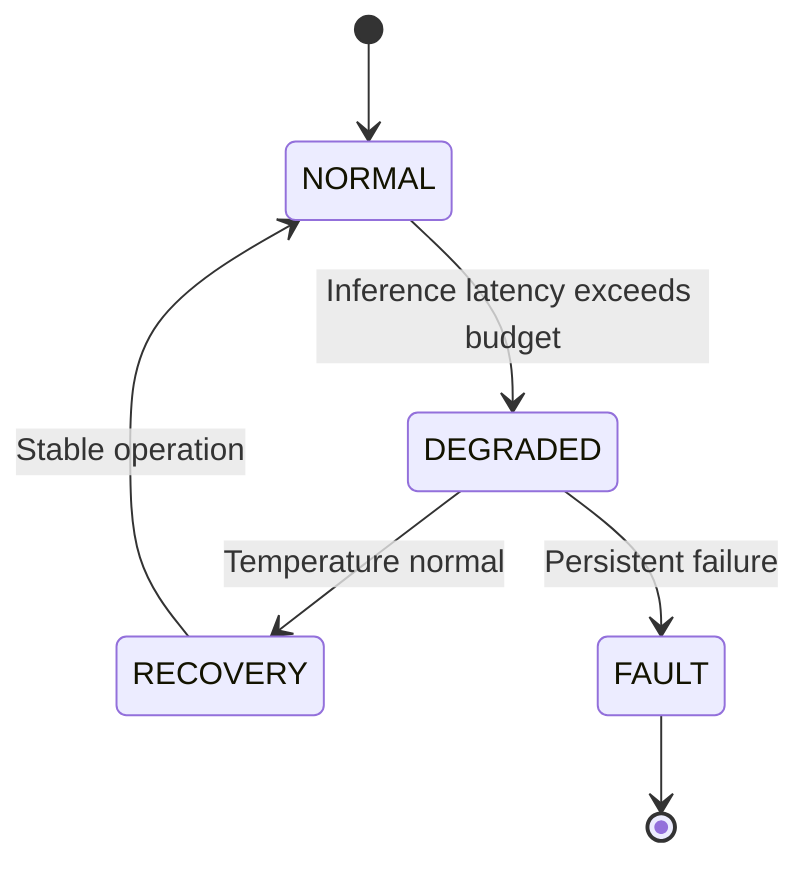

---

### I.7.6 Ví dụ: Detector bị chậm do Thermal Throttling

Trình tự sự kiện:

1. ECU tăng nhiệt độ.
2. GPU/NPU bị giảm xung nhịp.
3. Inference Task vẫn hoạt động.
4. Latency tăng vượt ngân sách cho phép.
5. Health Monitor phát hiện vi phạm timing.
6. TSR chuyển sang chế độ DEGRADED.
7. HMI hiển thị trạng thái hạn chế chức năng.
8. Diagnostic Event được ghi nhận.

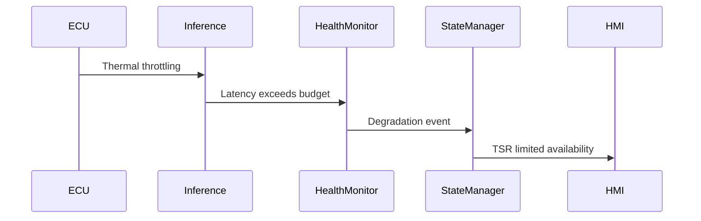

Nếu không có cơ chế này:

- TSR vẫn tiếp tục hiển thị kết quả.
- Người lái tin rằng hệ thống hoạt động bình thường.
- Độ tin cậy thực tế đã suy giảm đáng kể.

Đây là hành vi không chấp nhận được trong hệ thống production.

---

### I.7.7 Phân tầng phần mềm

| Layer | Chức năng |
|---------|-----------|
| Driver / BSP | Camera driver, deserializer, DMA, power management |
| Operating System | Process scheduling, memory management, IPC |
| Runtime Platform | Logging, watchdog, diagnostics, resource supervision |
| Perception Core | Detection, tracking, temporal fusion |
| Feature Logic | Context filtering, lane association, map fusion, state management |
| Vehicle Integration | CAN/Ethernet communication, diagnostics, configuration |
| Service & Tooling | Calibration, manufacturing tests, replay, data collection |
| OTA & Lifecycle Management | Software update, version management, fleet monitoring |

---

### I.7.8 Liên hệ với kiến trúc ADAS hiện đại

Trong các hệ thống ADAS hiện đại:

- AUTOSAR Classic thường quản lý các ECU chức năng đơn giản.
- AUTOSAR Adaptive thường được sử dụng trên Domain Controller.
- ROS2 thường xuất hiện trong môi trường nghiên cứu hoặc phát triển nội bộ.
- Các nền tảng như NVIDIA DRIVE, Qualcomm Ride và Mobileye đều sử dụng kiến trúc service-based tương tự.

Các framework và middleware trong automotive có thể khác nhau giữa các nhà cung cấp (AUTOSAR Adaptive, ROS 2, middleware nội bộ của OEM,...), tuy nhiên hầu hết các hệ thống production đều tuân theo một số nguyên tắc kiến trúc chung. Hiểu được các khái niệm này sẽ giúp người phát triển dễ dàng tiếp cận bất kỳ nền tảng nào.

| Thuật ngữ | Giải thích | Mục đích | Ví dụ trong TSR |
|-----------|------------|----------|-----------------|
| **Task-based Architecture** | Hệ thống được chia thành nhiều **task** hoặc **service** độc lập, mỗi task đảm nhiệm một chức năng cụ thể thay vì gom toàn bộ logic vào một chương trình duy nhất (monolithic). | Giúp dễ phát triển, kiểm thử, tái sử dụng và bảo trì. Khi một task gặp lỗi, các task khác vẫn có thể tiếp tục hoạt động. | Tách riêng thành các task: Camera Capture, Image Preprocessing, AI Inference, Tracking, State Manager và HMI Output. |
| **Health Monitoring** | Cơ chế giám sát trạng thái hoạt động của từng task hoặc toàn bộ hệ thống, bao gồm CPU load, RAM usage, latency, watchdog timeout và lỗi runtime. Thành phần giám sát này hoạt động độc lập với pipeline perception. | Phát hiện sớm lỗi, tránh việc hệ thống tiếp tục đưa ra kết quả khi đã mất khả năng xử lý chính xác. | Nếu AI Inference bị treo hoặc mất quá nhiều thời gian xử lý, Health Monitor sẽ phát hiện và gửi cảnh báo tới State Manager. |
| **Fault Containment** | Nguyên tắc cô lập lỗi trong phạm vi nhỏ nhất có thể, không để lỗi của một module lan sang các module khác hoặc ảnh hưởng tới toàn hệ thống. | Tăng độ tin cậy và khả năng phục hồi của hệ thống. Một lỗi cục bộ không được phép gây mất chức năng của toàn bộ ADAS. | Detector gặp lỗi không được phép gửi dữ liệu sai trực tiếp lên HMI; State Manager sẽ chặn kết quả không hợp lệ và chuyển feature sang trạng thái an toàn. |
| **Degraded Operation** | Chế độ hoạt động suy giảm khi hệ thống không còn đáp ứng đầy đủ điều kiện vận hành nhưng vẫn có thể duy trì một phần chức năng. | Đảm bảo hệ thống vẫn hoạt động an toàn thay vì tắt hoàn toàn khi xảy ra lỗi hoặc thiếu tài nguyên. | Camera bị bẩn hoặc ECU quá nhiệt làm FPS giảm; TSR vẫn hiển thị biển báo nhưng không còn hỗ trợ ISA và thông báo trạng thái suy giảm. |
| **Availability State** | Trạng thái thể hiện mức độ sẵn sàng của một tính năng. Hệ thống thường chuyển đổi giữa các trạng thái như *Initializing*, *Available*, *Unavailable*, *Degraded* hoặc *Fault*. | Giúp các ECU khác và HMI biết feature hiện có thể sử dụng hay không, tránh hiển thị thông tin sai cho người lái. | Khi camera mất tín hiệu, State Manager chuyển trạng thái TSR từ **Available** sang **Unavailable** và Cluster hiển thị biểu tượng TSR không khả dụng. |
| **Deterministic Timing** | Khả năng đảm bảo thời gian xử lý của hệ thống luôn nằm trong giới hạn xác định trước (Worst-Case Execution Time), thay vì dao động ngẫu nhiên giữa các lần thực thi. | Rất quan trọng đối với hệ thống thời gian thực (Real-Time System), giúp dự đoán được độ trễ từ lúc camera thu nhận ảnh đến khi HMI hiển thị kết quả. | Nếu yêu cầu latency của TSR là 100 ms, toàn bộ pipeline từ Camera → AI → State Manager → Cluster phải luôn hoàn thành trong giới hạn này, kể cả khi CPU đang chịu tải cao. |

Với TSR, điều này dẫn tới một hệ quả thực tế: mô hình AI chỉ là một thành phần của stack. Giá trị production đến từ cách cả feature quản lý vòng đời sign, quality, state, diagnostics và contract với các khối khác trên xe. Một detector tốt nhưng không có timing contract, không có health monitor và không có policy `DEGRADED` vẫn chưa đạt chuẩn của một tính năng ADAS trưởng thành.

Đây là nền tảng để chuyển một mô hình AI nghiên cứu thành một chức năng TSR đủ điều kiện triển khai trên xe thương mại.

---

## I.8 ODD và quản lý trạng thái

### I.8.1 ODD phase-1

| Thành phần | ODD khuyến nghị |
|---|---|
| Loại đường | Đô thị, liên huyện và quốc lộ nhẹ; chưa nhắm cao tốc phức tạp hoặc công trường nặng |
| Tốc độ xe | `0–90 km/h`; đủ cho advisory phase-1, chưa khẳng định legal-speed authority rộng hơn |
| Điều kiện sáng | Ban ngày, chạng vạng hoặc đêm có chiếu sáng đủ để biển còn đọc được |
| Thời tiết | Khô ráo hoặc mưa nhẹ; chưa bao gồm mưa lớn, sương dày, splash kéo dài |
| Camera | Đã calibrate, không mờ, không bẩn nặng, không lệch mount và không lỗi timestamp |
| Loại biển | Biển tĩnh, vật lý, nằm trong tập class hỗ trợ và không che khuất nặng |

### I.8.2 Out-of-scope ODD

- Mưa lớn, sương dày, glare kéo dài;
- Camera rung mạnh hoặc che bẩn nhiều;
- Biển tạm công trường, biển điện tử động, che khuất nặng;
- Cần lane-level reasoning nhưng chưa có lane association.

### I.8.3 State flow đầy đủ

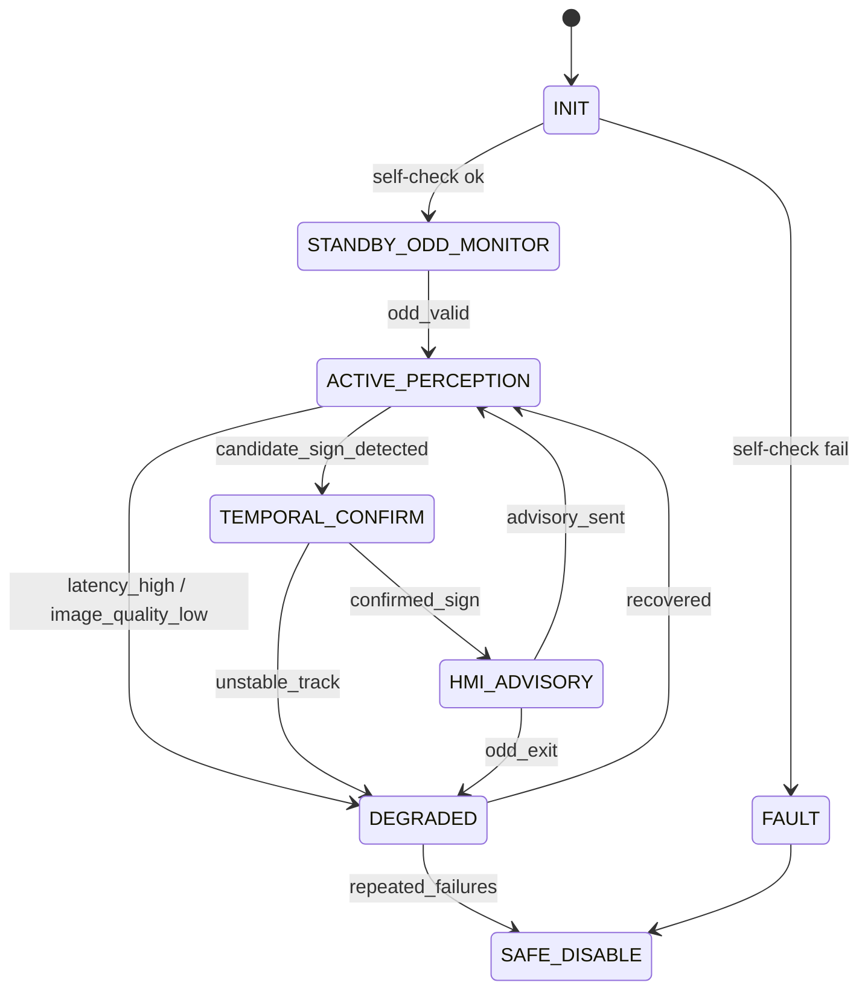

| State | Vai trò |
|---|---|
| `INIT` | Nạp model, kiểm tra camera/config và xác nhận feature đủ điều kiện khởi động |
| `STANDBY_ODD_MONITOR` | Chưa phát advisory; chỉ quan sát ODD và health trước khi vào perception đầy đủ |
| `ACTIVE_PERCEPTION` | Chạy detector trên frame hợp lệ và tạo candidate sign ban đầu |
| `TEMPORAL_CONFIRM` | Tích lũy nhiều frame để xác nhận sign đủ ổn định trước khi ra HMI |
| `HMI_ADVISORY` | Phát event/giữ sign đã confirm theo policy hiển thị và timeout |
| `DEGRADED` | Vẫn hoạt động nhưng đã giảm capability, suppress một số hành vi hoặc giảm độ tin cậy |
| `SAFE_DISABLE` | Ngừng phát feature output tin dùng được và chuyển sang trạng thái an toàn |
| `FAULT` | Gặp lỗi nghiêm trọng cần set fault path, có thể dẫn tới restart hoặc disable |

---

## I.9 Malfunction, diagnostics, phản ứng an toàn

### I.9.1 Phân biệt fault / error / failure / malfunction

| Thuật ngữ | Nghĩa thực dụng |
|---|---|
| `fault` | Nguyên nhân gốc của vấn đề, ví dụ cáp lỏng, nguồn lỗi, bug phần mềm |
| `error` | Trạng thái nội bộ đã sai, ví dụ frame corrupt, timestamp nhảy, tensor NaN |
| `failure` | Dịch vụ không còn đáp ứng kỳ vọng hệ thống, ví dụ không publish đúng hạn hoặc publish sai trạng thái |
| `malfunctioning behavior` | Failure đã đi tới hành vi có thể làm người lái hiểu sai hoặc tin nhầm feature |

**Ví dụ:** Cáp lỏng → fault; frame đen xen kẽ → error; TSR mất output → failure; cluster hiển thị speed limit sai → malfunctioning behavior.

### I.9.2 Fault tree rút gọn

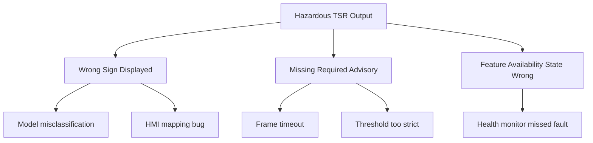

### I.9.3 Bảng malfunction điển hình

| ID | Scenario | Nguyên nhân | Phát hiện | Phản ứng |
|---|---|---|---|---|
| M1 | Mất camera | Cáp, nguồn hoặc deserializer lỗi | Timeout frame hoặc heartbeat mất | Vào `UNAVAILABLE`, set DTC và dừng tin output cũ |
| M2 | Frame quá tối/cháy sáng | Glare mạnh hoặc exposure lỗi | Exposure/quality metric vượt ngưỡng | Suppress sign mới hoặc vào `DEGRADED` |
| M3 | Blur nặng | Rung, rung mount hoặc ống kính bẩn | Blur score hoặc image quality gate | Giữ advisory cũ trong timeout ngắn, sau đó degrade hoặc disable |
| M4 | Runtime crash/NaN | Bug, corrupt memory, runtime fault | Watchdog hoặc sanity check | Restart task; lặp nhiều lần thì `SAFE_DISABLE` |
| M5 | Inference chậm | Thermal throttle, CPU contention, thiếu tài nguyên | Deadline/latency watchdog | Giảm capability, tăng skip hoặc chuyển degrade |
| M6 | Mapping class → icon sai | Bug integration giữa detector và HMI | SIL/HIL regression hoặc review mapping | Chặn release; không cho lên xe thật |
| M7 | Mất tốc độ xe | CAN timeout hoặc signal invalid | Network monitor hoặc plausibility check | Hạ authority, chỉ giữ advisory cơ bản nếu policy cho phép |
| M8 | Update model lỗi | Package hỏng, signature sai hoặc config lệch version | Update verifier/integrity check | Không activate bản mới và rollback bản cũ |

### I.9.4 Diagnostics tối thiểu

| Cơ chế | Vai trò |
|---|---|
| Power-on self-test | Kiểm camera, model file, config và dependency tối thiểu trước khi vào ACTIVE |
| Watchdog | Phát hiện deadlock, task treo hoặc loop không còn sống đúng chu kỳ |
| Latency monitor | Bắt pipeline vượt budget trước khi HMI bị stale hoặc missed deadline |
| Plausibility checks | Chặn output vô lý như bbox ngoài ảnh, confidence NaN, timestamp không monotonic |
| Resource monitor | Theo dõi RAM, CPU, storage, nhiệt để quyết định degrade hoặc restart |
| DTC strategy | Biến lỗi runtime thành mã chẩn đoán đủ dùng cho service/after-sales |
| Freeze-frame logging | Lưu đủ context để điều tra lỗi sau khi xe hoặc task đã phục hồi |

---

## I.10 Safety, SOTIF, cybersecurity, OTA (tổng quan)

### I.10.1 Functional safety và SOTIF

TSR advisory không mặc nhiên ASIL thấp. Phải trả lời: lỗi nào chỉ inconvenience; lỗi nào khiến người lái hiểu sai; lỗi nào ảnh hưởng feature khác qua shared ECU.

**SOTIF** xét ca không có hardware fault: model/ODD chưa đủ → perception vẫn không an toàn trong tình huống dự kiến.

**Ví dụ SOTIF:** Biển quảng cáo phản quang bị nhầm thành speed sign dưới glare — hệ thống "đúng như lập trình" nhưng specification/validation chưa phủ.

### I.10.2 Cybersecurity và attack surface

- Model blob, config/calibration, firmware ECU, OTA backend, service tool/debug interface.

Production cần: secure boot, signed package, update authorization, rollback, security event logging.

### I.10.3 OTA ví dụ thực tế

Bản `v1.1` tăng recall biển 30 km/h nhưng tăng false positive biển quảng cáo đỏ. Không có gate release, soak test, rollback → OTA đưa rủi ro mới vào fleet. Perception update không thể "train xong là phát hành".

---

## I.11 Kiến thức nền và thuật ngữ cốt lõi

### I.11.1 Bốn nhóm kiến thức

| Nhóm | Nội dung |
|---|---|
| Perception | Detection vs classification; FP/FN; small object; glare/blur/occlusion |
| Temporal | Không phát HMI từ 1 frame; tracking vs `hold previous detection` |
| System engineering | ODD, state model, ICD vs debug log, diagnostics vs console print |
| Automotive process | ISO 26262, ISO 21448, AUTOSAR, UNECE R155/R156 |

### I.11.2 Bảng thuật ngữ

| Thuật ngữ | Ý nghĩa trong TSR |
|---|---|
| `ODD` | Điều kiện team dám tuyên bố feature hoạt động đúng |
| `Degraded` | Feature còn chạy nhưng giảm capability |
| `Unavailable` | Feature không còn nên tin dùng |
| `ICD` | Hợp đồng signal/message/timing/ownership |
| `DTC` | Fault code cho service/triage |
| `Freeze-frame` | Snapshot context tại lỗi |
| `SOTIF trigger condition` | Tình huống hợp lệ nhưng perception dễ nguy hiểm |

### I.11.3 Lỗi tư duy phổ biến

1. **Chỉ nhìn mAP** — chưa nói latency, false advisory, temporal stability, degrade behavior.
2. **Đồng nhất detector = feature** — mapping HMI sai, sign không áp dụng ego lane, stale sign, watchdog miss.
3. **Bỏ qua HMI/diagnostics** — bug HMI nguy hiểm không kém detector; không DTC → không support pilot/SOP.

**Nguyên tắc dạy người mới:** *Hãy coi TSR là feature hệ thống có trách nhiệm trước người lái, không phải notebook object detection.*

### Key Takeaways — Phần I

| Điểm chính | Ý nghĩa |
|---|---|
| TSR = 5 lớp xử lý, không chỉ detect/classify | Bỏ lớp 3–5 → false advisory hoặc HMI không tin cậy |
| Item definition phải khóa authority + ODD | "Dùng YOLO" không phải item definition |
| State machine (`DEGRADED`/`UNAVAILABLE`) là contract | Feature phải biết khi nào im lặng |
| SOTIF ≠ DTC | Glare/occlusion có thể unsafe mà không có hardware fault |
| Chi tiết production mở rộng: [Ch. 1–12]() | Phần I là nền; là deep-dive từng topic |

### Common Engineering Mistakes — Phần I

| Lỗi | Hậu quả |
|---|---|
| Release theo mAP + video đẹp | Không có evidence HMI/diagnostics/SOTIF |
| Mở rộng ODD mà không mở rộng validation | Feature fail ở edge case chưa test |
| Bỏ qua HMI mapping bug | Detector đúng nhưng icon sai → malfunctioning behavior |
| Không phân biệt fault/error/failure | RCA và DTC strategy lộn xộn |

---

# Phần II. Thiết Kế Production Pipeline

> Mục tiêu: định nghĩa pipeline production-ready theo góc nhìn tech lead embedded — block, contract, gate, evidence.

---

## II.1 Từ gap baseline tới bài toán hệ thống

### II.1.1 Sáu gap và chuỗi logic

Baseline `tsr_demo.py` thiếu: tracking thật, ICD, DTC, watchdog, HMI policy, map fusion. Ở production, sáu gap **không độc lập** — tạo chuỗi:

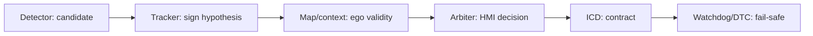

Thiếu một mắt → "detection đúng frame level nhưng feature sai vehicle level".

### II.1.2 Production TSR stack — detector không phải feature

Một stack TSR production thường được chia thành nhiều layer chức năng độc lập. Mỗi layer có một trách nhiệm rõ ràng, giúp hệ thống dễ phát triển, kiểm thử và bảo trì. Điều quan trọng là **không có một layer nào tự đưa ra toàn bộ quyết định**, mà mỗi layer chỉ xử lý đúng phạm vi của mình và truyền kết quả cho layer tiếp theo.

| Thành phần | Giải thích | Input | Output | Ví dụ trong TSR |
|------------|------------|-------|--------|-----------------|
| **Perception Detection** | Là tầng nhận thức (Perception Layer) chịu trách nhiệm **phát hiện** các đối tượng có khả năng là biển báo giao thông trong ảnh. Mục tiêu của tầng này là trả lời câu hỏi: **"Trong frame hiện tại có những vùng nào giống biển báo?"**. Tầng này chưa quan tâm biển báo đó có áp dụng cho xe hay không. | Ảnh hoặc video từ camera | Bounding Box, Confidence Score, Candidate Region | YOLO phát hiện hai biển giới hạn tốc độ và một biển cấm vượt trong cùng một frame. |
| **Sign Object Management** | Là tầng quản lý đối tượng biển báo sau khi được phát hiện. Hệ thống gán **ID** cho từng biển, theo dõi chúng qua nhiều frame (tracking), loại bỏ các phát hiện nhiễu và duy trì vòng đời (lifecycle) của từng biển báo. Mục tiêu là trả lời câu hỏi: **"Đây có phải vẫn là cùng một biển báo đã thấy ở frame trước không?"** | Detection Result của nhiều frame liên tiếp | Sign Object ổn định (ID, vị trí, tuổi đời, trạng thái) | Biển tốc độ 50 km/h xuất hiện trong 30 frame liên tiếp sẽ được duy trì với cùng một Object ID thay vì tạo mới ở mỗi frame. |
| **Feature Interpretation** | Là tầng logic nghiệp vụ (Feature Logic), chịu trách nhiệm diễn giải ý nghĩa của các biển báo đã được theo dõi. Layer này kết hợp thêm thông tin về làn đường, bản đồ số, trạng thái xe và các quy tắc giao thông để quyết định **biển nào thực sự có hiệu lực đối với xe ego**. Đây là nơi trả lời câu hỏi: **"Biển báo nào đang áp dụng cho xe, có hiệu lực trong bao lâu và mức độ tin cậy là bao nhiêu?"** | Sign Objects, Lane Information, Map Data, Vehicle State | Active Speed Limit, Advisory Sign, Warning State | Hai biển giới hạn tốc độ nằm cạnh nhau nhưng chỉ biển phía làn xe ego mới được chọn làm giới hạn tốc độ hiện hành. |
| **HMI / ISA Output** | Là tầng tích hợp với các hệ thống trên xe. Kết quả từ Feature Interpretation được chuyển thành thông tin hiển thị trên HMI hoặc tín hiệu điều khiển cho Intelligent Speed Assistance (ISA). Layer này quyết định **thông tin nào sẽ được hiển thị hoặc phát tới ECU khác**, đồng thời tránh hiện tượng nhấp nháy hoặc thay đổi liên tục trên giao diện người lái. | Active TSR Result | Cluster Display, HUD, ISA Signal, Vehicle Network Message | Hiển thị biển giới hạn tốc độ 80 km/h trên Instrument Cluster, đồng thời gửi giới hạn tốc độ mới tới hệ thống ISA. |
| **Diagnostics** | Là tầng giám sát và chẩn đoán hệ thống. Layer này không tham gia nhận dạng biển báo mà theo dõi sức khỏe của toàn bộ pipeline như trạng thái camera, latency, nhiệt độ ECU, lỗi AI, watchdog và Diagnostic Trouble Code (DTC). Mục tiêu là đảm bảo hệ thống luôn hoạt động an toàn và có thể phát hiện, ghi nhận hoặc báo cáo lỗi. | Health Status, Runtime Metrics, Error Events | DTC, Log File, Diagnostic Message, Health Report | Camera mất tín hiệu hoặc AI Inference vượt quá thời gian xử lý sẽ được ghi nhận thành Diagnostic Trouble Code và chuyển TSR sang trạng thái **Degraded** hoặc **Unavailable**. |

### Quan hệ giữa các layer

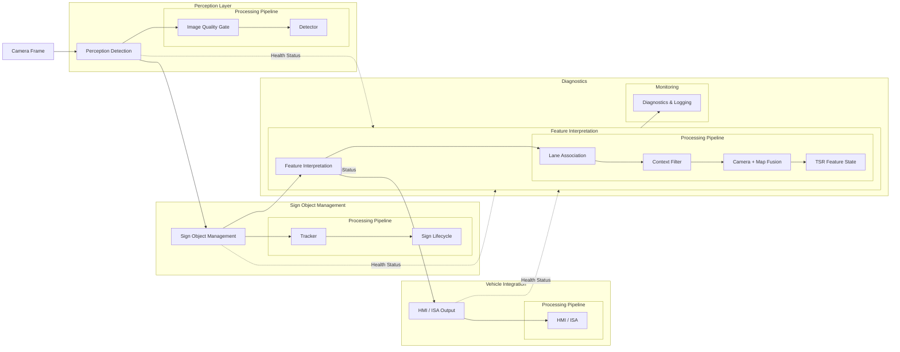

### II.1.3 Ví dụ detector vs feature output

| Tình huống | Detector output | Feature output đúng |
|---|---|---|
| Biển `50` bên làn rẽ phải | Bbox `Speed limit 50` confidence cao | Không áp dụng nếu ego tiếp tục đi thẳng. |
| Biển `80` bị che một frame do xe tải | Một frame miss | Track vẫn sống trong thời gian ngắn, nhưng không tăng confidence. |
| Map nói `60`, camera thấy `40` biển công trường tạm | Camera-map conflict | Ưu tiên camera nếu sign mới, hợp lệ, gần ego lane và confidence đủ. |
| Camera blur kéo dài | Detection jitter | Feature chuyển `DEGRADED` hoặc `UNAVAILABLE`, không phát advisory mới. |

### II.1.4 Production implementation pattern vs repo

| Block | Pattern production | Repo hiện tại |
|---|---|---|
| Image quality | Blur/glare/exposure gate, quality reason code | Chưa có quality gate trong `preprocess()`. |
| Detector | YOLO/DETR/ensemble, calibrated confidence, per-class threshold | Có YOLO `.pt`, `--conf`, `--imgsz`, `max_det=20`. |
| Tracker | Track ID, association, hit/miss counter, velocity/lifetime | Chỉ có `--hold`, chưa có track ID. |
| Lifecycle | `CANDIDATE`, `CONFIRMED`, `ACTIVE`, `STALE`, `EXPIRED` | Chưa có lifecycle. |
| Lane association | Projection vào ego lane, lane split/merge handling | Chưa có lane model. |
| Context filter | ODD, road side, sign applicability, temporal validity | Chưa có context layer. |
| Fusion | Vision-map arbitration, conflict reason, source confidence | Chưa có map input. |
| Output | ICD, timestamp, validity, quality, reason code | Chỉ overlay video. |
| Diagnostics | DTC, watchdog, freeze-frame, health counter | Chưa có diagnostics schema. |

### II.1.5 Gap chính giữa repo và production stack

| Gap | Bằng chứng trong repo | Risk production |
|---|---|---|
| Không có stateful object model | `hold_left` chỉ giữ box cũ theo frame | HMI có thể hiện sign stale hoặc chưa confirmed. |
| Không có output machine-readable | Output chính là video annotated | Không replay RCA theo event, track, reason code. |
| Không có image quality gate | `preprocess()` chỉ resize | Blur/glare vẫn đi vào detector như frame bình thường. |
| Không có lane/context/map | Data flow dừng ở bbox/class | Detector đúng nhưng feature sai ngữ cảnh. |
| Không có deployment artifact | Chỉ chạy PyTorch/Ultralytics `.pt` | Latency CPU và memory chưa đạt ECU target. |
| Không có validation protocol | Benchmark local rời rạc | Không đủ evidence cho pilot hoặc SOP. |

---

## II.2 Khung chuẩn ràng buộc trực tiếp lên TSR

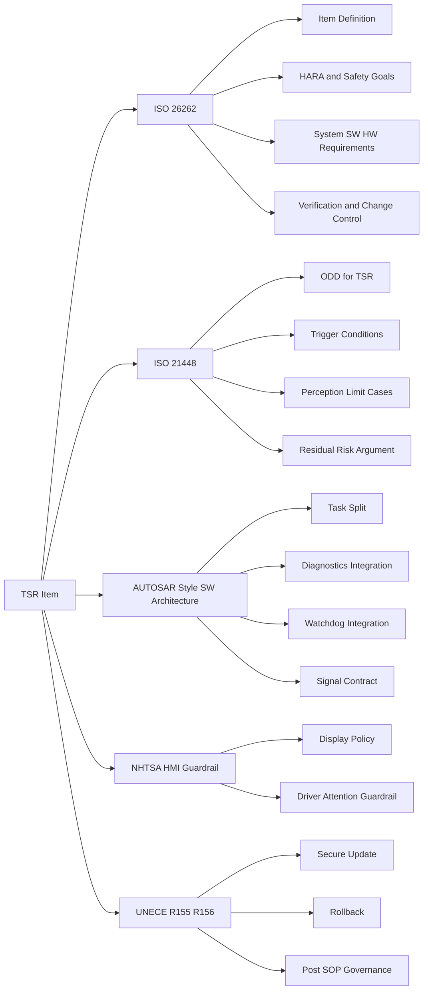

| Câu hỏi | Khung tham chiếu |
|---|---|
| Tài liệu nào buộc viết ODD cho TSR? | ISO 21448 |
| Quản lý hazard, requirement, change impact? | ISO 26262 |
| Tách block SW trên ECU? | AUTOSAR (Classic: Application/RTE/BSW) |
| TSR có được show mọi thứ lên cluster? | NHTSA distraction guidelines |

### II.2.1 ISO 26262 — Functional safety

Buộc: item definition, HARA, safety goals, traceability requirement, change management, verification evidence.

**Ví dụ TSR:** Xe 80 km/h, camera nhầm biển quảng cáo đỏ → `120`. Phải trả lời: HMI sai 2 giây → driver hiểu sai? ISA arbitration chặn ở đâu? Lỗi mapping hay detector? Verification nào cover sign-like object?

```mermaid
flowchart LR
    A[TSR Item Definition] --> B[HARA]
    B --> C[Safety Goals]
    C --> D[Functional Safety Concept]
    D --> E[System and SW Requirements]
    E --> F[Verification and Validation]
```

Nguồn: [ISO 26262 overview](https://www.iso.org/publication/PUB200262.html)

### II.2.2 ISO 21448 — SOTIF cho perception

Áp dụng cho chức năng situational awareness từ complex sensors/algorithms — đúng bản chất TSR camera-based. Phải phân tích functional insufficiency; ODD cụ thể cho TSR; verification nhắm trigger: glare, occlusion, sign-like objects, biển tạm, lane ambiguity, map stale.

**Ví dụ:** Biển `50` ở làn rẽ phải, làn thẳng `80`. Detector đúng class nhưng chưa đủ kết luận — cần ego-lane context, `candidate only`, map corroboration.

```mermaid
flowchart TD
    A[Camera Sees Sign Candidate] --> B{Within TSR ODD?}
    B -- No --> C[Suppress or Degrade]
    B -- Yes --> D{Known Trigger Condition?}
    D -- Yes --> E[Raise Uncertainty or Need Corroboration]
    D -- No --> F[Proceed to Confirmation and Arbitration]
```

Nguồn: [ISO 21448:2022](https://www.iso.org/cms/live/live/en/sites/isoorg/contents/data/standard/07/74/77490.html)

### II.2.3 AUTOSAR — Phân lớp ECU

Classic Platform: `application` / `RTE` / `BSW`. Không bắt buộc AUTOSAR nguyên khối, nhưng ép tách: perception logic, feature state, communication contract, diagnostics, watchdog, HMI adaptation.

**Ví dụ:** Detector + overlay + signal publish + log + watchdog kick trong một process → detector treo → HMI giữ icon cũ, DTC không set, ownership lỗi mơ hồ.

```mermaid
flowchart TD
    A[Application Layer] --> A1[TSR Detector]
    A --> A2[Temporal Confirmation]
    A --> A3[Feature Arbiter]
    B[RTE] --> B1[Signal Exchange]
    C[BSW Services] --> C1[Diagnostics]
    C --> C2[Watchdog]
    C --> C3[Communication]
    C --> C4[Memory and Logging]
```

Nguồn: [AUTOSAR Classic Platform](https://www.autosar.org/standards/classic-platform/)

### II.2.4 NHTSA — HMI guardrail

Khuyến nghị: lock-out tác vụ phân tâm cao khi lái; visual-manual glance ngắn; malfunction ảnh hưởng an toàn phải trình bày cho lái xe.

**Ví dụ:** Đô thị đông biển, detector đổi `30 → No parking → School zone → none` trong vài frame. Raw output lên cluster → nhấp nháy, driver không biết sign nào confirmed.

Nguồn: [NHTSA Driver Distraction Guidelines](https://www.federalregister.gov/d/2012-4017)

---

## II.3 Production pipeline end-to-end

> **Sơ đồ chi tiết theo block feature logic** (lifecycle, lane, context tách riêng): §II.1.2. Sơ đồ dưới đây bổ sung góc nhìn **ECU integration** — capture, health monitor, bus publish.

```mermaid
flowchart LR
    A[Front Camera Module] --> B[Capture and Timestamp]
    B --> C[Image Quality and ODD Gate]
    C --> D[TSR Detector]
    D --> E[Tracking and Temporal Confirmation]
    E --> F[Context and Map Fusion]
    F --> G[Feature Arbiter and State Manager]
    G --> H[HMI Output Policy]
    G --> I[Vehicle Signal Publisher]
    G --> J[Freeze Frame and Event Logger]
    C --> K[Health Monitor and Watchdog]
    D --> K
    E --> K
    F --> K
    K --> L[DTC and Service Diagnostics]

    classDef source fill:#EAF7F2,stroke:#14866D,color:#0F4C3F,stroke-width:2px;
    classDef feature fill:#EDF3FF,stroke:#2F66D0,color:#173B7A,stroke-width:2px;
    classDef temporal fill:#F4ECFF,stroke:#7C3AED,color:#4C1D95,stroke-width:2px;
    classDef support fill:#FCEFF5,stroke:#DB2777,color:#9D174D,stroke-width:2px;
    classDef integration fill:#E8F7EE,stroke:#1E8E5A,color:#14532D,stroke-width:2px;
    class A source;
    class B,C,D,F,G feature;
    class E temporal;
    class K support;
    class H,I,J,L integration;
```

### II.3.1 Phân rã block theo trách nhiệm

| Block | Trách nhiệm | Lý do tồn tại |
|---|---|---|
| `Capture and Timestamp` | Frame, timestamp đồng bộ, timeout/corruption | Không làm việc trên dữ liệu không xác thực |
| `Image Quality and ODD Gate` | Blur/glare/exposure/contamination, ODD validity | Tránh confidence giả từ ảnh kém |
| `TSR Detector` | Detect + classify candidate | Hypothesis ban đầu |
| `Tracking and Temporal Confirmation` | Track ID, persistence, sign lifetime | Giảm false positive frame đơn |
| `Context and Map Fusion` | Ego-lane relevance, map corroboration | Giảm sign đúng nhưng không áp dụng ego |
| `Feature Arbiter and State Manager` | Sign cuối, priority, timeout, availability | Biến perception thành feature |
| `HMI Output Policy` | Icon/chime/suppression | Giảm distraction và sai kỳ vọng |
| `Health Monitor and Watchdog` | Deadline, alive counter, restart, thermal | Không "treo nửa sống nửa chết" |
| `DTC and Service Diagnostics` | DTC, DID, freeze-frame, tester access | Service và fleet triage |

### II.3.2 Sơ đồ kiến trúc ECU (HTML — mở trong trình duyệt)

Phần II mô tả pipeline theo **luồng xử lý**. Sơ đồ dưới đây bổ sung góc nhìn **phân lớp ECU** (sensor → application → platform/BSP → vehicle bus → offboard) — hữu ích khi review với team HW, SW platform, và integration.

**Mở file:** [assets/diagrams/tsr_production_ecu_architecture.html](assets/diagrams/tsr_production_ecu_architecture.html)

| Tính năng sơ đồ | Mô tả |
|---|---|
| Phân lớp | Sensor · Perception/Feature (Application) · Runtime · BSP · Vehicle · OTA/Service |
| Tương tác | Hover/click block → mô tả trách nhiệm; chip lọc luồng Perception / Feature / Health |
| Dark mode | Toggle theme, lưu `localStorage` |
| Map sang AUTOSAR | Application ≈ TSR tasks; Platform ≈ scheduler/watchdog/logger; BSP ≈ camera/NPU driver |

```mermaid
flowchart TB
    subgraph sensor [Sensor Layer]
        CAM[Front Camera HDR]
    end
    subgraph app [ADAS ECU Application]
        CAP[Capture] --> IQ[Quality ODD Gate]
        IQ --> DET[Detector]
        DET --> TRK[Track Confirm]
        TRK --> MAP[Map Context]
        MAP --> ARB[Feature Arbiter]
        ARB --> HMI[HMI Policy]
    end
    subgraph plat [Runtime Platform]
        HM[Health Monitor]
        WDG[Watchdog]
        LOG[Freeze-frame Logger]
    end
    subgraph veh [Vehicle Integration]
        CL[Cluster HUD]
        BUS[CAN Ethernet]
        UDS[UDS DTC]
    end
    CAM --> CAP
    IQ --> HM
    DET --> HM
    ARB --> CL
    ARB --> BUS
    HM --> UDS
    HM --> WDG

    classDef source fill:#EAF7F2,stroke:#14866D,color:#0F4C3F,stroke-width:2px;
    classDef feature fill:#EDF3FF,stroke:#2F66D0,color:#173B7A,stroke-width:2px;
    classDef temporal fill:#F4ECFF,stroke:#7C3AED,color:#4C1D95,stroke-width:2px;
    classDef support fill:#FCEFF5,stroke:#DB2777,color:#9D174D,stroke-width:2px;
    classDef integration fill:#E8F7EE,stroke:#1E8E5A,color:#14532D,stroke-width:2px;
    class CAM source;
    class CAP,IQ,DET,MAP,ARB feature;
    class TRK temporal;
    class HM,WDG,LOG support;
    class HMI,CL,BUS,UDS integration;
```

**Ví dụ đọc sơ đồ:** Khi `Health Monitor` phát hiện deadline miss ở `Detector`, luồng không đi thẳng `HMI Policy` — `Feature Arbiter` chuyển `DEGRADED`, `UDS` có thể set `TSR_SW_DEADLINE_MISS`, cluster nhận `tsr_feature_state` ≠ `ACTIVE`.

---

## II.4 Full step: concept → release

| Bước | Nội dung | Deliverable |
|---|---|---|
| 1 | Khóa item definition | Scope, ODD, authority, output ECU/HMI |
| 2 | System requirements + ICD v1 | Camera, vehicle, map, HMI, timing, diagnostics |
| 3 | State model | INIT → STANDBY → ACTIVE → DEGRADED → UNAVAILABLE |
| 4 | ODD + trigger conditions | Glare, blur, biển rẽ, biển tạm, stale map, sign-like ads |
| 5 | Temporal confirmation policy | `min_confirm_hits`, `max_misses`, `max_track_age_ms` |
| 6 | Context + map fusion | Camera-only, map-assisted, conflict arbitration |
| 7 | HMI policy | No raw output, no flicker, degraded/unavailable states |
| 8 | Watchdog + diagnostics | Alive/deadline/logical supervision, DTC, freeze-frame |
| 9 | Verification gates | Concept → Architecture → Integration → Pilot → SOP |
| 10 | Post-SOP governance | Signed update, rollback, field monitoring |

---

## II.5 Tracking và temporal confirmation

### II.5.1 Tại sao cần tracking thật

TSR production không phát HMI từ detection frame đơn (trừ policy đặc biệt). Dùng **tracking-by-detection**:

- Detector → bbox/class/confidence;
- Tracker → track ID, motion, age;
- Temporal confirmer → `hit_count`, `miss_count`, class/spatial stability;
- Chỉ track vượt ngưỡng → sign candidate cho feature.

`SORT` — nhẹ, tốc độ cao; `Deep SORT` — association metric giảm identity switch khi occlusion. TSR không cần MOT phức tạp như pedestrian, nhưng cần tránh flicker, double count, mất sign khi miss ngắn.

Nguồn: [SORT](https://arxiv.org/abs/1602.00763), [Deep SORT](https://arxiv.org/abs/1703.07402)

### II.5.2 Policy tracking đề xuất

| Tham số | Giá trị khởi điểm | Ý nghĩa |
|---|---:|---|
| `min_confirm_hits` | 3 frame | Tránh advisory từ noise đơn |
| `max_misses_before_lost` | 5 frame | Giữ track qua miss ngắn |
| `max_track_age_ms` | 1200 ms | Không giữ sign quá lâu khi scene đổi |
| `class_majority_ratio` | ≥ 0.6 | Giảm class jitter |
| `bbox_iou_assoc` | 0.3–0.5 | Association motion + overlap |
| `reannounce_deadband_ms` | 2000–5000 ms | Tránh lặp HMI dày |

**Ví dụ chuỗi frame — biển `50`:**

| Frame | Detector | Track state | Feature |
|---|---|---|---|
| F1 | Thấy `50`, conf TB | `hit_count=1` | Chưa HMI |
| F2 | Thấy lại `50` | `hit_count=2` | Chưa HMI |
| F3 | Thấy lại, bbox ổn | `hit_count=3`, confirmed | Phát HMI |
| F4 | Miss ngắn | `miss_count=1` | Giữ sign |
| F5 | Thấy lại | Track hồi phục | Tiếp tục giữ |

**Điều cần tránh:** Dùng `hold previous detection` như tracker giả; giữ sign quá lâu sau khi ra khỏi scene; temporal confirmer che health issue (mất frame nhưng giữ sign cũ quá dài).

### II.5.3 Sign lifecycle và state machine

#### II.5.3.1 Lý Thuyết

Tracking biến detection rời rạc theo frame thành object có identity, history, confidence và lifecycle. Một sign track thường cần các state:

```mermaid
stateDiagram-v2
    [*] --> Candidate
    Candidate --> Confirmed: HitCount >= N
    Candidate --> Rejected: MissCount > M
    Confirmed --> Active: ApplicableToEgo == true
    Confirmed --> Suppressed: ContextInvalid
    Active --> Stale: NoHit But Within TTL
    Stale --> Active: ReDetected And Associated
    Stale --> Expired: TTL Exceeded Or PassedSign
    Suppressed --> Expired: TTL Exceeded
    Rejected --> [*]
    Expired --> [*]
```

Tracking có hai lớp:

| Lớp | Nhiệm Vụ |
|---|---|
| Geometric association | Ghép bbox hiện tại với track cũ bằng IoU, center distance, optical flow hoặc ego-motion. |
| Semantic consistency | Kiểm tra class, sign family, confidence và source consistency qua nhiều frame. |

SORT dùng Kalman filter và Hungarian association cho multi-object tracking. Deep SORT thêm metric appearance. Trong TSR, appearance embedding có thể nhẹ hơn object tracking người/xe vì biển ít biến dạng, nhưng class similarity và occlusion lại quan trọng.

#### II.5.3.2 Vì Sao Quan Trọng Trong Automotive

HMI không được flicker theo từng frame. ISA không được đổi speed limit vì một frame false positive. Tracking giúp:

| Lợi Ích | Ý Nghĩa Automotive |
|---|---|
| Temporal confirmation | Chỉ publish sign sau đủ evidence. |
| Stale control | Giữ sign hợp lý khi miss ngắn, clear khi xe đã qua biển. |
| Track provenance | RCA biết sign đến từ frame nào, source nào, confidence nào. |
| Latency management | Cho phép skip inference có kiểm soát hơn so với hold box thô. |

#### II.5.3.3 Ví Dụ TSR Thực Tế

| Tình Huống | Không Tracking | Có Lifecycle |
|---|---|---|
| Biển `80` bị che 2 frame | HMI mất rồi hiện lại | Track `ACTIVE` chuyển `STALE`, chưa clear ngay. |
| Một frame nhầm `60` thành `80` | HMI đổi số trong 33 ms | Semantic consistency reject class flip nếu chưa đủ hit. |
| Xe đã đi qua biển | Box có thể được hold vài frame | Track expired theo ego-motion hoặc sign passed line. |
| Hai biển cùng cột | NMS hoặc hold lẫn box | Track tách theo center, class và lifecycle. |

#### II.5.3.4 Production Implementation Pattern

| Thành Phần | Pattern |
|---|---|
| Track ID | Monotonic ID hoặc rolling ID với timestamp create/update. |
| Association | IoU + Mahalanobis distance + class-family gate. |
| State counters | `hit_count`, `miss_count`, `age_frames`, `confirmed_age_ms`. |
| Confidence update | EMA hoặc Bayesian update theo detection confidence và quality. |
| Expiry | TTL theo time, distance traveled, lane pass event hoặc map segment change. |
| Output | Publish chỉ `CONFIRMED` hoặc `ACTIVE`, không publish `CANDIDATE`. |

```mermaid
flowchart TD
    A[Detections] --> B[Prediction From Existing Tracks]
    B --> C[Association Matrix]
    C --> D[Hungarian Or Greedy Match]
    D --> E[Update Matched Tracks]
    D --> F[Create New Candidates]
    D --> G[Age Unmatched Tracks]
    E --> H[Lifecycle State Machine]
    F --> H
    G --> H
    H --> I[Feature Output]
```

#### II.5.3.5 Trade-Offs

| Quyết Định | Ưu Điểm | Rủi Ro |
|---|---|---|
| Confirm sau 3 frame | Giảm false positive | Tăng delay ở tốc độ cao. |
| TTL dài | Giảm flicker khi occlusion | Giữ sign cũ sau khi rẽ hoặc qua giao lộ. |
| Class consistency cứng | Giảm class jitter | Có thể bỏ qua biển thật khi detector sửa lỗi class muộn. |
| Dùng Deep appearance | Tăng association khi camera rung | Tốn compute, khó justify cho embedded TSR nhỏ. |

#### II.5.3.6 Gap Repo Hiện Tại

Repo dùng `hold_left` để giữ detection cũ khi frame mới rỗng. Đây là behavior hữu ích cho demo video, nhưng production còn thiếu:

| Thiếu | Hậu Quả |
|---|---|
| Track ID | Không biết detection nào cùng một biển qua thời gian. |
| Hit/miss counters | Không phân biệt sign mới, confirmed, stale, expired. |
| Ego-motion expiry | Không clear sign khi xe đã đi qua. |
| JSONL/event log | Không phân tích RCA theo track. |
| Source consistency | YOLO và heuristic có thể merge mà không ghi source provenance. |

#### Key Takeaways — II.5.3

| Điểm Chính | Ý Nghĩa |
|---|---|
| Tracking là contract giữa detector và feature | Nó quyết định sign nào đủ ổn định để publish. |
| Lifecycle quan trọng ngang thuật toán association | Track không có state machine vẫn khó dùng cho HMI/ISA. |
| Stale là trạng thái hợp lệ nhưng nguy hiểm | Cần reason code và timeout rõ. |

#### Common Engineering Mistakes — II.5.3

| Lỗi | Hậu Quả |
|---|---|
| Giữ bbox cũ và gọi là tracking | Không có identity, không có confidence evolution, không có expiry đúng. |
| Confirm bằng frame count cố định | Không tính tốc độ xe, FPS, blur hoặc route topology. |
| Clear sign ngay khi miss một frame | HMI flicker và ISA mất ổn định. |

---

## II.6 Context filtering và map fusion

> **Chi tiết fusion state machine:** §II.15 (source confidence, provenance, implementation pattern). Phần này giữ arbitration policy cấp feature; không lặp state machine §II.15.

### II.6.1 Vì sao map fusion là block bắt buộc

Biển detect đúng vẫn có thể không áp dụng ego: làn rẽ, đường song hành, biển tạm, map stale, unit khác biên giới. ISA châu Âu dùng speed limit từ nhiều nguồn, không chỉ optical — củng cố camera/map corroboration dù phase-1 chỉ advisory sanity check.

Nguồn: [Intelligent Speed Assistance](https://en.wikipedia.org/wiki/Intelligent_speed_assistance)

### II.6.2 Ba tầng phase-1

1. **No-map safe default** — Map unavailable → camera-only advisory.
2. **Map-assisted plausibility** — Map quality tốt → kiểm tra sign camera hợp lý theo vị trí/road class.
3. **Conflict arbitration** — Camera vs map mâu thuẫn → policy, không tự lấy bên thắng tuyệt đối.

### II.6.3 Arbitration policy

| Tình huống | Quyết định |
|---|---|
| Camera mạnh, map stale/không có | Ưu tiên camera, cờ `map_unavailable` |
| Camera yếu, map mạnh, không conflict lớn | Giữ map-assisted, không phát "new sign" nếu camera chưa confirm |
| Camera vs map conflict ở legal speed | Suppress ISA authority, advisory conservative |
| Biển tạm detect, map không có | Ưu tiên camera nếu temporal confirmation mạnh |

**Ví dụ conflict:** Ra khỏi cao tốc — map báo `100`, camera confirm `60` ở lối ra 4 frame. Advisory only: ưu tiên camera HMI + cờ `map_conflict`. Authority cao hơn: policy bảo thủ, không tin mù quáng một nguồn. Conflict kéo dài → event log hoặc DTC mềm.

Nguồn bổ sung: [MapFusion](https://arxiv.org/abs/2103.05929), [Mapillary TSD](https://arxiv.org/abs/1909.04422)

---

## II.7 ICD production

### II.7.1 ICD phải chứa gì

| Nhóm | Nội dung |
|---|---|
| Input camera | Frame timing, timestamp domain, status, corruption flags |
| Vehicle signals | Ego speed, yaw rate, gear, ignition, ambient light, wiper |
| Map input | Source, freshness, confidence, road segment ID, speed zone validity |
| Output HMI | Sign class, displayed value, confidence state, availability, chime |
| Output ECU khác | Validity bit, age, quality, degraded reason, sequence counter |
| Diagnostics | DTC IDs, DID IDs, freeze-frame, tester session |
| Timing | Period, deadline, timeout, startup latency, stale timeout |
| Ownership | Producer/consumer, calibration owner, release owner |

### II.7.2 Message contract đề xuất

| Signal | Type | Chu kỳ | Ghi chú |
|---|---|---:|---|
| `tsr_feature_state` | enum | 100 ms | INIT/STANDBY/ACTIVE/DEGRADED/UNAVAILABLE/FAULT |
| `tsr_primary_sign_type` | enum | 100 ms | Class HMI-ready, không phải raw model class |
| `tsr_speed_limit_value` | uint8 | 100 ms | Chỉ hợp lệ với speed sign |
| `tsr_output_valid` | bool | 100 ms | Validity cuối của feature |
| `tsr_quality_level` | enum | 100 ms | GOOD/LIMITED/POOR |
| `tsr_degraded_reason` | bitfield | 100 ms | blur, glare, timeout, thermal, map_conflict... |
| `tsr_diag_snapshot_id` | uint16 | event | Liên kết freeze-frame |

**Nguyên tắc:** Raw detector class không đi thẳng HMI; output là feature-semantic signal; Quality và Availability quan trọng gần bằng recognized sign.

---

## II.8 Diagnostics, DTC, watchdog, serviceability

### II.8.1 Watchdog ba tầng

1. **Alive supervision** — Heartbeat đúng chu kỳ;
2. **Deadline supervision** — Capture/inference/publish không vượt budget;
3. **Logical supervision** — Timestamp monotonic, output age hợp lệ, confidence không NaN.

### II.8.2 DTC strategy

| DTC ID | Mô tả | Điều kiện set | Phản ứng |
|---|---|---|---|
| `TSR_CAM_NO_FRAME` | Mất luồng camera đầu vào | Timeout frame hoặc capture không tiến | Chuyển `UNAVAILABLE`, set DTC, lưu freeze-frame |
| `TSR_IMG_QUALITY_LOW` | Chất lượng ảnh kéo dài dưới ngưỡng | Blur/glare/exposure xấu liên tục | Vào `DEGRADED`, suppress sign mới nếu cần |
| `TSR_SW_DEADLINE_MISS` | Pipeline không còn giữ deadline | p95 hoặc số lần miss liên tiếp vượt ngưỡng | Degrade, tăng skip hoặc restart task |
| `TSR_SW_WATCHDOG_RESET` | Task bị reset bởi watchdog | Kick fail hoặc alive supervision fail | Ghi event, tăng counter restart, theo dõi tái diễn |
| `TSR_MAP_CONFLICT_PERSISTENT` | Mâu thuẫn camera-map kéo dài | Arbitration fail nhiều lần liên tiếp | Hạ authority, giữ policy bảo thủ và log sự kiện |
| `TSR_HMI_PUBLISH_FAIL` | Không publish được ra cluster/HUD | Transport timeout hoặc consumer không nhận | Giữ internal state, set diag và tránh phát HMI sai |
| `TSR_MODEL_INTEGRITY_FAIL` | Model hoặc config không còn đáng tin | Checksum/signature/version compatibility fail | Không cho feature vào `ACTIVE` |

**Ví dụ chuỗi lỗi — camera bẩn sau mưa phùn:**
1. Quality Gate thấy blur kéo dài → `DEGRADED`;
2. Quá ngưỡng → set `TSR_IMG_QUALITY_LOW`;
3. HMI dừng sign mới, giữ availability theo OEM policy.

### II.8.3 UDS và freeze-frame

`UDS` (ISO 14229) — đọc DTC, DID, reset, routine control, security access. TSR phải expose health state cho service tool; freeze-frame đủ tái hiện lỗi perception.

```mermaid
flowchart LR
    A[Fault or Anomaly] --> B[Health Monitor]
    B --> C{Within Recovery Budget?}
    C -- Yes --> D[Restart or Degrade]
    C -- No --> E[Set DTC and Go Unavailable]
    D --> F[Log Freeze Frame]
    E --> F

    classDef risk fill:#FDECEC,stroke:#C2410C,color:#7F1D1D,stroke-width:2px;
    classDef feature fill:#EDF3FF,stroke:#2F66D0,color:#173B7A,stroke-width:2px;
    classDef decision fill:#FFF1E0,stroke:#D97706,color:#7C2D12,stroke-width:2px;
    classDef integration fill:#E8F7EE,stroke:#1E8E5A,color:#14532D,stroke-width:2px;
    class A,E risk;
    class B,D feature;
    class C decision;
    class F integration;
```

| Trường freeze-frame | Mục đích |
|---|---|
| timestamp | Đồng bộ sự kiện giữa TSR, camera, HMI và các ECU liên quan |
| vehicle speed | Cho biết xe đang ở bối cảnh vận hành nào khi lỗi xảy ra |
| feature state | Xác định lỗi phát sinh ở `INIT`, `ACTIVE`, `DEGRADED` hay đường publish |
| image quality metrics | Phân biệt lỗi perception do blur, glare hay exposure |
| inference latency | Kiểm tra có phải thermal/deadline miss là nguyên nhân gần nhất không |
| CPU/RAM/temp | Triage nhanh xem lỗi nghiêng về tài nguyên hay logic |
| map state | Phân biệt conflict do map stale hay camera side |
| last confirmed sign | Biết HMI đã từng hiển thị gì ngay trước khi fault xuất hiện |

Nguồn: [UDS overview](https://en.wikipedia.org/wiki/Unified_Diagnostic_Services)

---

## II.9 HMI policy production

### II.9.1 Nguyên tắc

- Chỉ hiển thị sau temporal confirmation + arbitration;
- Không nhấp nháy theo frame;
- Không hiển thị sign confidence biên hoặc conflict chưa resolve;
- Policy cho `DEGRADED` và `UNAVAILABLE`.

### II.9.2 Policy hiển thị

| Trạng thái | HMI policy |
|---|---|
| Sign mới confirm | Hiển thị icon/giá trị mới; chime tối đa một lần nếu OEM policy cho phép |
| Same sign tiếp diễn | Giữ icon ổn định; không lặp chime và không tạo visual event mới |
| Conflict chưa resolve | Chưa đổi HMI ngay; hoặc suppress update, hoặc giữ sign cũ trong timeout ngắn |
| `DEGRADED` | Giảm độ chủ động của HMI; tránh phát sự kiện sign mới quá mạnh khi độ tin cậy thấp |
| `UNAVAILABLE` | Bỏ sign advisory và chỉ hiển thị trạng thái feature không dùng được nếu OEM yêu cầu |

**Ví dụ timeline:**
- T0: HMI hiển thị `80`;
- T1: Detector thấy `50`, mới 1 frame → **không đổi HMI**;
- T2: Quality giảm glare → **không nhấp nháy 80/50**;
- T3: Map nói zone `80`, conflict → **giữ state bảo thủ**.

```mermaid
flowchart TD
    A[Confirmed Sign] --> B{Quality and Context Good?}
    B -- No --> C[Suppress or Hold Conservative State]
    B -- Yes --> D{Conflict with Existing HMI State?}
    D -- Yes --> E[Arbitrate or Delay Update]
    D -- No --> F[Display Sign Event]

    classDef temporal fill:#F4ECFF,stroke:#7C3AED,color:#4C1D95,stroke-width:2px;
    classDef decision fill:#FFF1E0,stroke:#D97706,color:#7C2D12,stroke-width:2px;
    classDef risk fill:#FDECEC,stroke:#C2410C,color:#7F1D1D,stroke-width:2px;
    classDef feature fill:#EDF3FF,stroke:#2F66D0,color:#173B7A,stroke-width:2px;
    classDef integration fill:#E8F7EE,stroke:#1E8E5A,color:#14532D,stroke-width:2px;
    class A temporal;
    class B,D decision;
    class C risk;
    class E feature;
    class F integration;
```

### II.9.3 Tiêu chí nội bộ

- Single visual event ngắn, không text dài;
- No-debug-on-driver-surface;
- Malfunction ảnh hưởng safety → đường ra HMI hoặc service indicator;
- HMI policy thuộc system/HMI team, không để perception team tự quyết.

---

## II.10 Verification, release gates, KPI

> **KPI gates, release flow và failure RCA chi tiết:** [2.research_tsr_baseline_analysis.md](2.research_tsr_baseline_analysis.md) §10–§14. Phần này giữ V-model, gate tổng quan và checklist embedded; không lặp bảng KPI gate §10.1 hoặc release flow §11.

### II.10.1 V-model

```mermaid
flowchart TD
    A[Item Definition and ODD] --> B[System Requirements and ICD]
    B --> C[Architecture and Safety/SOTIF Concept]
    C --> D[SW/HW Implementation]
    D --> E[SIL Replay and Unit Tests]
    E --> F[Bench and HIL]
    F --> G[Vehicle Shadow Mode]
    G --> H[Pilot Release]
    H --> I[Field Monitoring and OTA Governance]

    classDef baseline fill:#FFF5DD,stroke:#C78600,color:#6B4F00,stroke-width:2px;
    classDef feature fill:#EDF3FF,stroke:#2F66D0,color:#173B7A,stroke-width:2px;
    classDef support fill:#FCEFF5,stroke:#DB2777,color:#9D174D,stroke-width:2px;
    classDef integration fill:#E8F7EE,stroke:#1E8E5A,color:#14532D,stroke-width:2px;
    class A baseline;
    class B,C feature;
    class D,E,F,G support;
    class H,I integration;
```

### II.10.2 Test gates

| Gate | Điều kiện tối thiểu |
|---|---|
| Concept freeze | Đã khóa item definition, ODD, misuse assumptions và hazard list đủ dùng để thiết kế tiếp |
| Architecture freeze | Đã chốt module split, ICD v1, watchdog concept và chiến lược DTC ở mức kiến trúc |
| Integration entry | Có timing budget, startup/shutdown behavior và signal contract để nối sang ECU/HMI thật |
| Pilot entry | Đã pass SIL/HIL chính, HMI mapping đúng, restart path và freeze-frame path có evidence |
| SOP entry | Có vòng triage hiện trường, rollback OTA và release evidence đủ để chịu trách nhiệm sau phát hành |

### II.10.3 KPI production

| Nhóm | Metric |
|---|---|
| Detection | Recall/precision theo class, điều kiện sáng, road class và độ khó biển nhỏ |
| Advisory | False advisory rate và tần suất sign confirmed sai ngữ cảnh |
| Runtime | P50/P95/P99 latency, FPS hữu dụng và RAM peak trên target workload |
| Availability | Duty cycle của `ACTIVE`/`DEGRADED`/`UNAVAILABLE`, kèm restart count |
| Diagnostics | Tần suất DTC, độ phủ freeze-frame và khả năng tái hiện lỗi sau test |
| Integration | Tỷ lệ conflict camera-map, correctness của HMI/signal trong HIL hoặc bench integration |
| Safety/SOTIF | False advisory với lớp biển pháp lý mạnh và độ chính xác khi ra/vào ODD |

### II.10.4 Release checklist embedded

- ICD frozen; DTC list thống nhất;
- Watchdog/restart policy có bằng chứng test;
- Brownout/over-temperature đã kiểm tra;
- Benchmark target hardware có;
- Update/rollback dry-run;
- Field logging đủ điều tra issue sau pilot.

**Chưa được release nếu:** Model đẹp trên laptop nhưng chưa target HW benchmark; cluster icon chưa integration test; mất camera mà HMI không báo unavailable; chưa rollback khi update model fail.

---

## II.11 OTA, cybersecurity, post-SOP

`UNECE R155/R156` tác động trực tiếp: model blob, calibration, feature config, update eligibility, rollback, evidence package cho behavior change.

Production pipeline cần:
- Signed package (SW/model/config);
- Version compatibility matrix;
- Rollback strategy;
- Post-update sanity test;
- Field monitoring regression theo class/ODD slice.

Nguồn: [UNECE R155](https://unece.org/sites/default/files/2021-03/R155e.docx), [UNECE R156](https://unece.org/sites/default/files/2021-03/R156e.docx)

---

## II.12 Work products trước pilot (checklist)

1. Item Definition TSR  
2. ODD specification và state model  
3. Functional safety assessment (TSR + shared-platform dependencies)  
4. SOTIF trigger-condition catalogue  
5. System architecture và module responsibility matrix  
6. ICD input/output/diagnostics/timing  
7. HMI policy document  
8. DTC/DID/freeze-frame specification  
9. Watchdog and recovery concept  
10. Replay/bench/HIL/vehicle validation plan  
11. Update and rollback concept  
12. Release readiness checklist  

---

## II.13 Lane association

### II.13.1 Lý Thuyết

Lane association trả lời câu hỏi: **Biển phát hiện được có áp dụng cho ego lane không?** Đây là bài toán hình học và ngữ cảnh, không phải chỉ phân loại ảnh. Cần kết hợp bbox sign, camera calibration, lane model, ego trajectory và road topology.

```mermaid
flowchart LR
    A[Detected Sign Bbox] --> B[Estimate Bearing And Height]
    C[Lane Model] --> D[Ego Lane Corridor]
    E[Navigation Maneuver] --> D
    B --> F[Applicability Test]
    D --> F
    F --> G{Applies To Ego?}
    G -->|Yes| H[Candidate For Feature]
    G -->|No| I[Suppress Or Keep As Non Ego Sign]
```

### II.13.2 Vì Sao Quan Trọng Trong Automotive

Một detector có thể đúng 100% mà feature vẫn sai nếu áp dụng biển của làn khác. Trong đô thị, biển speed hoặc cấm rẽ có thể áp dụng cho nhánh đường, bus lane, exit ramp hoặc làn rẽ. Lane association là ranh giới giữa perception output và driving-relevant interpretation.

### II.13.3 Ví Dụ TSR Thực Tế

| Tình Huống | Nếu Không Lane Association | Hành Vi Production |
|---|---|---|
| Biển `40` trên ramp thoát cao tốc, ego đi thẳng | HMI/ISA giảm về 40 | Suppress hoặc mark `NON_EGO_LANE`. |
| Biển cấm rẽ phải, ego ở làn đi thẳng | Advisory cấm rẽ không cần thiết | Chỉ publish nếu navigation hoặc turn indicator liên quan. |
| Biển bus lane bên phải | Nhận là speed/mandatory sign | Context filter loại nếu không thuộc ego drivable corridor. |
| Đường chia nhánh ngay trước giao lộ | Camera thấy biển bên nhánh trái | Delay publish tới khi lane/topology rõ hơn hoặc mark low applicability. |

### II.13.4 Production Implementation Pattern

| Pattern | Cách Làm |
|---|---|
| Image-space heuristic | Sign bên trái/phải quá xa ego corridor bị suppress với confidence thấp. |
| Camera calibration | Chuyển bearing của sign sang ground-relative region nếu có chiều cao/geometry assumption. |
| Lane model integration | Dùng lane boundaries và ego path để tạo corridor áp dụng. |
| Map topology | Dùng lane-level map hoặc road segment để biết sign thuộc segment nào. |
| Delayed arbitration | Với split/merge, giữ sign candidate tới khi ego path rõ. |

```mermaid
flowchart TD
    A[Sign Track] --> B{Inside Ego Corridor?}
    B -->|Yes| C[Applicable Candidate]
    B -->|No| D{Inside Adjacent Lane?}
    D -->|Yes| E[Suppress With Reason AdjacentLane]
    D -->|No| F{Near Split Or Ramp?}
    F -->|Yes| G[Hold Pending Topology]
    F -->|No| H[Reject Context]
```

### II.13.5 Trade-Offs

| Quyết Định | Ưu Điểm | Rủi Ro |
|---|---|---|
| Heuristic theo vị trí ảnh | Dễ triển khai camera-only | Sai ở đường cong, dốc, camera yaw lệch. |
| Lane-level map | Applicability mạnh hơn | Phụ thuộc localization và map freshness. |
| Suppress aggressive | Giảm false advisory | Tăng miss khi biển thật nằm lệch bên đường. |
| Hold pending ở split | Tránh publish nhầm | Tăng delay, HMI có thể thiếu thông tin sớm. |

### II.13.6 Gap Repo Hiện Tại

Repo không có lane model, calibration, ego trajectory hoặc navigation route. Vì vậy, mọi detection đều được overlay như nhau. Đây là đúng cho demo, nhưng nếu coi overlay là feature output thì sẽ tạo false advisory trong case biển không áp dụng cho ego lane.

### II.13.7 TSR + lane model coupling (ego lane, adjacent, exit)

Production TSR không chỉ hỏi "biển có trong frame không" mà phải hỏi **biển thuộc corridor nào của ego**. Coupling với lane model là contract giữa perception track và feature interpretation.

```mermaid
flowchart TD
    A[Lane Model Input] --> B[Ego Lane Corridor]
    A --> C[Adjacent Lane Regions]
    A --> D[Exit Ramp Geometry]
    E[Sign Track] --> F{Projection Test}
    B --> F
    C --> F
    D --> F
    F -->|Ego Lane| G[Applicable Candidate]
    F -->|Adjacent Only| H[Suppress AdjacentLane]
    F -->|Exit Ramp| I{Ego Intent Exit?}
    I -->|Yes| J[Hold Pending Or Applicable]
    I -->|No| K[Suppress ExitRamp]
```

| Coupling case | Lane model signal | TSR behavior |
|---|---|---|
| Ego lane speed sign | Ego corridor stable | Publish sau lifecycle confirm |
| Adjacent lane mandatory | Sign outside ego corridor | Suppress với `reason_code=ADJACENT_LANE` |
| Exit ramp speed drop | Ramp geometry + navigation maneuver | Chỉ publish nếu ego intent exit hoặc topology xác nhận |
| Lane split trước giao lộ | Uncertain ego path | `HOLD_PENDING_TOPOLOGY` — không publish sớm |
| Bus lane / HOV | Non-drivable lane mask | Context filter loại nếu không thuộc drivable corridor |

| Input tối thiểu | Mục đích |
|---|---|
| Ego lane boundaries (vision hoặc map) | Xác định corridor áp dụng |
| Ego trajectory / yaw rate | Dự đoán lane change và split |
| Navigation maneuver (optional phase-2) | Phân biệt exit vs through |
| Road topology (merge/split flags) | Delay arbitration tại điểm nhánh |

**Gap repo:** `tsr_demo.py` không có lane model input — mọi detection được overlay đồng nhất. Phase-1 camera-only có thể dùng image-space heuristic nhưng phải ghi `applicability_confidence` thấp và reason code rõ.

#### Key Takeaways — II.13.7

| Điểm chính | Ý nghĩa |
|---|---|
| Lane coupling là feature logic | Detector đúng class vẫn có thể sai applicability |
| Exit/adjacent là case SOTIF cao | Cần pending state, không publish sớm tại split |
| Repo cần schema stub | JSONL field `lane_applicability`, `ego_corridor_state` |

#### Common Engineering Mistakes — II.13.7

| Lỗi | Hậu quả |
|---|---|
| Coi bbox x-offset cố định là lane association | Sai ở cua, ramp, camera misalignment |
| Publish exit ramp sign khi ego đi thẳng | False advisory speed drop |
| Không log adjacent-lane suppress | RCA không phân biệt detector miss vs context reject |

### Key Takeaways — II.13

| Điểm Chính | Ý Nghĩa |
|---|---|
| Lane association là feature logic | Không thể giao toàn bộ cho object detector. |
| Camera-only vẫn có thể làm phase-1 heuristic | Nhưng phải ghi rõ limitation và reason code. |
| Split/merge là case khó | Cần state pending hoặc map/lane fusion. |
| Lane coupling (§II.13.7) là contract với lane model | Ego/adjacent/exit phải có reason code và pending state |

### Common Engineering Mistakes — II.13

| Lỗi | Hậu Quả |
|---|---|
| Dùng vị trí bbox x trái/phải cố định | Sai ở cua, đổi làn, ramp và camera misalignment. |
| Suppress biển ngoài ego corridor mà không log reason | RCA không biết false negative do detector hay context filter. |
| Bỏ qua navigation intent | Cấm rẽ hoặc speed theo nhánh có thể liên quan nếu xe sắp rẽ. |

---

## II.14 Context filtering

### II.14.1 Lý Thuyết

Context filtering lọc detection/track bằng điều kiện ngoài bbox: ODD, road type, ego speed, direction, temporal validity, sign category, scene quality, map consistency và HMI policy. Đây là lớp biến "model nhìn thấy" thành "feature được phép tin".

```mermaid
flowchart LR
    A[Confirmed Sign Track] --> B[ODD Filter]
    B --> C[Quality Filter]
    C --> D[Road Context Filter]
    D --> E[Temporal Filter]
    E --> F[Applicability Filter]
    F --> G[Publish Or Suppress With Reason]
```

### II.14.2 Vì Sao Quan Trọng Trong Automotive

Detector không biết luật đường đầy đủ. Nó có thể detect biển quảng cáo giống biển cấm, biển ở bãi đỗ xe, biển trên xe tải, biển tạm không còn hiệu lực hoặc biển cho hướng ngược lại. Context filter giảm false advisory và tạo explainability cho safety review.

### II.14.3 Ví Dụ TSR Thực Tế

| Context | Ví Dụ | Filter Mong Muốn |
|---|---|---|
| ODD | Mưa lớn, lens bị bẩn | Chuyển degraded, không publish sign mới nếu quality quá thấp. |
| Road type | Đang trong parking lot | Không áp dụng speed sign highway logic. |
| Direction | Biển quay mặt cho chiều ngược lại | Suppress bằng orientation/bearing nếu khả dụng. |
| Temporal | Biển công trường chỉ ban đêm | Cần map/work-zone feed hoặc mark unknown temporal validity. |
| HMI | Nhiều biển cùng lúc | Chỉ publish priority sign theo policy. |

### II.14.4 Production Implementation Pattern

| Pattern | Implementation |
|---|---|
| Reason-coded suppression | Mỗi reject có `reason_code`: `LOW_QUALITY`, `NON_EGO_LANE`, `MAP_CONFLICT`, `ODD_OUT`. |
| Context confidence | Tách `detection_confidence` khỏi `applicability_confidence`. |
| Policy table | Dùng table theo sign family, road type, ego state và source. |
| Fallback state | `AVAILABLE`, `DEGRADED`, `UNAVAILABLE`, `SAFE_DISABLE`. |
| Audit log | Ghi publish/suppress decision để replay RCA. |

```mermaid
flowchart LR
    A[Sign Track] --> B[Detection Confidence]
    A --> C[Applicability Confidence]
    A --> D[Quality Confidence]
    B --> E[Decision Policy]
    C --> E
    D --> E
    E --> F[Published Sign]
    E --> G[Suppressed Event Log]
```

### II.14.5 Trade-Offs

| Quyết Định | Ưu Điểm | Rủi Ro |
|---|---|---|
| Filter chặt | Ít false advisory | Miss biển thật trong context hiếm. |
| Filter mềm bằng confidence | Linh hoạt, dễ debug | HMI/ISA cần threshold và hysteresis rõ. |
| Rule table | Dễ review, deterministic | Rule explosion khi thêm quốc gia và sign family. |
| ML-based context | Có thể học pattern phức tạp | Khó giải thích và khó safety case hơn. |

### II.14.6 Gap Repo Hiện Tại

Repo chỉ có detector confidence và overlay. Chưa có `reason_code`, chưa tách confidence detection/applicability, chưa có state `DEGRADED`, chưa có log cho suppression. Điều này làm cho demo dễ xem nhưng khó dùng để phân tích failure mode.

### Key Takeaways — II.14

| Điểm Chính | Ý Nghĩa |
|---|---|
| Context filter làm giảm false advisory | Nó là một phần của feature safety, không phải post-processing phụ. |
| Mọi suppress cần reason code | Không có reason code thì không có RCA tốt. |
| Confidence phải đa chiều | Detection confidence không đủ để quyết định HMI/ISA. |

### Common Engineering Mistakes — II.14

| Lỗi | Hậu Quả |
|---|---|
| Dùng một threshold confidence cho mọi case | Class hiếm và context khó bị xử lý sai. |
| Không log rejected candidate | Không biết hệ thống bỏ qua biển vì lý do gì. |
| Nhúng rule lẫn vào detector code | Khó test, khó certify, khó đổi policy theo OEM. |

---

## II.15 Camera + map fusion — state machine và provenance

> **Tham chiếu arbitration policy:** Bảng quyết định conflict cấp feature nằm ở §II.6.3. Phần này bổ sung fusion state machine, source confidence, provenance và pattern triển khai — không lặp lại bảng arbitration verbatim.

### II.15.1 Lý Thuyết

Camera-map fusion kết hợp sign nhìn thấy từ camera với speed limit/map attribute từ navigation hoặc HD map. Fusion không chỉ là "map đúng hay camera đúng"; nó là arbitration theo source freshness, localization confidence, sign confidence, route context và regulation policy.

```mermaid
flowchart TD
    A[Camera TSR Track] --> D[Fusion Arbiter]
    B[Map Speed Attribute] --> D
    C[Localization And Route Confidence] --> D
    D --> E{Agreement?}
    E -->|Agree| F[High Confidence Output]
    E -->|Conflict| G[Conflict Policy]
    G --> H[Prefer Camera]
    G --> I[Prefer Map]
    G --> J[Degraded Or Pending]
```

### II.15.2 Vì Sao Quan Trọng Trong Automotive

Camera mạnh ở biển tạm, biển mới, construction zone và ground truth tại thời điểm lái. Map mạnh ở đoạn không có biển trong FOV, speed zone kéo dài, conditional speed limit và context topology. ISA thường cần cả hai để giảm miss và giảm false advisory.

### II.15.3 Ví dụ TSR thực tế — camera vs map

| Case | Camera | Map | Policy Gợi Ý |
|---|---|---|---|
| Biển công trường `40`, map `80` | Sign mới, confidence cao | Map cũ | Ưu tiên camera, log `TEMPORARY_OVERRIDE`. |
| Không thấy biển sau khi vào road segment mới | Không có sign | Map `60` confidence cao | Dùng map với source `MAP_ONLY`, HMI khác nếu cần. |
| Camera thấy `30` trên đường nhánh | Sign không ego lane | Map ego segment `50` | Ưu tiên map/ego lane, suppress camera. |
| GPS sai urban canyon | Camera thấy sign consistent | Map segment uncertainty cao | Giảm map confidence, dùng camera nếu confirmed. |

### II.15.4 Production Implementation Pattern

| Component | Pattern |
|---|---|
| Source confidence | `vision_conf`, `map_conf`, `localization_conf`, `route_conf`. |
| Arbitration state | `VISION_ONLY`, `MAP_ONLY`, `AGREED`, `CONFLICT`, `UNKNOWN`. |
| Conflict duration | Không flip ngay; cần hysteresis và timeout. |
| Provenance | Output phải ghi source quyết định. |
| Map freshness | Map version, update time, provider confidence. |
| Localization | Gating theo covariance hoặc map-matching confidence. |

```mermaid
stateDiagram-v2
    [*] --> Unknown
    Unknown --> VisionOnly: CameraConfirmed
    Unknown --> MapOnly: MapValid
    VisionOnly --> Agreed: MapMatchesVision
    MapOnly --> Agreed: CameraMatchesMap
    Agreed --> Conflict: SourcesDisagree
    Conflict --> VisionOnly: CameraOverridePolicy
    Conflict --> MapOnly: MapTrustedPolicy
    Conflict --> Unknown: ConfidenceTooLow
```

### II.15.5 Trade-Offs

| Quyết Định | Ưu Điểm | Rủi Ro |
|---|---|---|
| Prefer camera on conflict | Bắt biển tạm và biển mới tốt | False positive camera có thể override map đúng. |
| Prefer map on conflict | Ổn định, giảm flicker | Map stale có thể sai ở công trường. |
| Weighted fusion | Mềm, dễ tune theo context | Khó explain nếu không log đầy đủ. |
| Lane-level map | Giải quyết applicability tốt | Cost dữ liệu và localization cao. |

### II.15.6 Gap Repo Hiện Tại

Repo không có map input, localization, route, map version hoặc arbitration log. Vì vậy, không nên gọi baseline là ISA-ready. Hành động production gần nhất là thêm JSONL schema có field `source`, `track_id`, `reason_code`, `map_speed`, `fusion_state` để chuẩn bị replay.

### II.15.7 Nguồn Tham Khảo

| Chủ Đề | Nguồn |
|---|---|
| MapFusion framework | https://arxiv.org/abs/2103.05929 |
| Mapillary Traffic Sign Dataset | https://arxiv.org/abs/1909.04422 |

### Key Takeaways — II.15

| Điểm Chính | Ý Nghĩa |
|---|---|
| Camera và map bù nhau | Không nguồn nào đủ cho mọi ODD. |
| Fusion phải có provenance | HMI/ISA và RCA cần biết vì sao output được chọn. |
| Conflict là trạng thái bình thường | Production phải thiết kế conflict policy, không che giấu conflict. |

### Common Engineering Mistakes — II.15

| Lỗi | Hậu Quả |
|---|---|
| Override map bằng camera mọi lúc | False positive sign-like có thể thành speed limit sai. |
| Tin map tuyệt đối | Map stale làm feature sai ở công trường hoặc đường mới. |
| Không dùng localization confidence | Fusion sai segment trong đô thị hoặc đường song song. |

---

---

## II.16 Intelligent Speed Assistance (ISA)

### II.16.1 Lý Thuyết

ISA là feature hỗ trợ người lái tuân thủ giới hạn tốc độ bằng cảnh báo hoặc hỗ trợ can thiệp tùy cấp authority. TSR cung cấp một nguồn speed limit cho ISA, nhưng ISA còn cần map, ego speed, vehicle state, HMI policy, driver override và regulation-specific behavior.

```mermaid
flowchart TD
    A[Camera TSR Speed Sign] --> D[Speed Limit Estimator]
    B[Map Speed Limit] --> D
    C[Vehicle Context] --> D
    D --> E[ISA State Manager]
    E --> F[Visual Warning]
    E --> G[Acoustic Or Haptic Warning]
    E --> H[Speed Control Assist If Authorized]
    E --> I[Driver Override Handling]
```

### II.16.2 Vì Sao Quan Trọng Trong Automotive

Theo [Regulation (EU) 2019/2144](https://eur-lex.europa.eu/eli/reg/2019/2144/oj) (General Safety Regulation 2) và [Delegated Regulation (EU) 2021/1958](https://eur-lex.europa.eu/eli/reg_del/2021/1958/oj), ISA đã trở thành yêu cầu bắt buộc cho xe M/N category ở EU:

| Mốc thời gian | Phạm vi áp dụng | Nguồn |
|---|---|---|
| 6 July 2022 | Bắt buộc cho **new types** (type approval mới) | [InterRegs analysis](https://www.interregs.com/articles/spotlight/236/eu-regulation-on-intelligent-speed-assistance-systems-published-) citing EU 2019/2144 |
| 7 July 2024 | Bắt buộc cho **all new vehicles** M/N | Cùng nguồn |

ISA phải có **Speed Limit Information Function (SLIF)** — xác định giới hạn tốc độ áp dụng bằng camera (TSR), GNSS, electronic map hoặc kết hợp. Test thực địa 400 km theo delegated regulation yêu cầu SLIF đúng **≥ 90%** quãng đường. Vì vậy, TSR không còn là "nice-to-have" HMI icon; nó là input trực tiếp tới compliance, safety case và user acceptance.

> **Lưu ý kỹ thuật:** ISA cho phép driver override và tắt hệ thống tạm thời (ví dụ biển sai do construction zone) — TSR phải có degraded/conflict behavior tương ứng, không ép publish khi evidence không đủ.

### II.16.3 Ví Dụ TSR/ISA Thực Tế

| Case | TSR Output | ISA Decision |
|---|---|---|
| Camera và map đều `50`, ego chạy `58` | High confidence speed limit | Cảnh báo theo policy nếu vượt ngưỡng. |
| Camera thấy `30` biển phụ dành cho xe tải | Class/context chưa đủ | Không áp dụng cho passenger car nếu context không xác nhận. |
| Map `80`, camera `60` sau biển tạm | Conflict | ISA có thể dùng camera nếu sign confirmed và map stale likelihood cao. |
| TSR unavailable vì camera blocked | No valid camera output | ISA chuyển map-only hoặc degraded theo feature concept. |

### II.16.4 Production Implementation Pattern

| Layer | Pattern |
|---|---|
| Speed source arbitration | Vision/map/fleet/cloud speed source, source confidence và timestamp. |
| Speed limit object | `value`, `unit`, `source`, `valid_from`, `valid_until`, `conditional_flags`. |
| HMI policy | Visual first, acoustic/haptic theo severity và regulation. |
| Driver override | Log override, không coi override là sensor fault. |
| Availability | `ISA_AVAILABLE`, `ISA_DEGRADED`, `ISA_UNAVAILABLE`. |
| Compliance evidence | Scenario coverage, false warning rate, missed limit rate, response time. |

```mermaid
stateDiagram-v2
    [*] --> ISAUnavailable
    ISAUnavailable --> ISAAvailable: ValidSpeedSource
    ISAAvailable --> WarningPending: EgoSpeedAboveLimit
    WarningPending --> WarningActive: ThresholdAndDelayMet
    WarningActive --> ISAAvailable: EgoSpeedBelowLimit
    ISAAvailable --> ISADegraded: SourceConflictOrLowQuality
    ISADegraded --> ISAAvailable: ConfidenceRecovered
    ISADegraded --> ISAUnavailable: NoReliableSource
```

### II.16.5 Trade-Offs

| Quyết Định | Ưu Điểm | Rủi Ro |
|---|---|---|
| Conservative warning threshold | Ít cảnh báo sai | Có thể cảnh báo muộn. |
| Aggressive camera override | Bắt biển tạm tốt | False warning nếu camera nhầm. |
| Map-only fallback | Duy trì availability | Không phản ánh construction/temporary signs. |
| HMI cảnh báo mạnh | Tăng compliance | Driver annoyance nếu false positive cao. |

### II.16.6 Gap Repo Hiện Tại

Repo phát hiện nhiều class biển, nhưng chưa có ISA abstraction:

| Thiếu | Lý Do Quan Trọng |
|---|---|
| Speed limit canonical model | Class label chưa được normalize thành `value`, `unit`, `conditional_flag`. |
| Ego speed input | Không biết xe có đang vượt giới hạn không. |
| ISA state manager | Không có warning delay, hysteresis, override, availability. |
| Regulation traceability | Không map behavior tới yêu cầu ISA cụ thể. |

### II.16.7 Nguồn Tham Khảo

| Chủ Đề | Nguồn |
|---|---|
| EU General Safety Regulation | https://eur-lex.europa.eu/eli/reg/2019/2144/oj |
| EU ISA delegated regulation | https://eur-lex.europa.eu/eli/reg_del/2021/1958/oj |
| ETSC ISA overview | https://etsc.eu/intelligent-speed-assistance-isa/ |

### Key Takeaways — II.16

| Điểm Chính | Ý Nghĩa |
|---|---|
| TSR là input cho ISA, không phải ISA | ISA cần speed source arbitration, HMI, override và compliance evidence. |
| Source conflict phải được quản lý | Camera/map disagreement là case production bình thường. |
| Speed sign class cần canonicalization | Label string không đủ cho vehicle feature. |

### Common Engineering Mistakes — II.16

| Lỗi | Hậu Quả |
|---|---|
| Dùng label trực tiếp làm speed limit | Sai unit, sai conditional sign, sai vehicle class applicability. |
| Không có hysteresis cảnh báo | ISA cảnh báo flicker quanh ngưỡng tốc độ. |
| Gọi camera-only TSR là ISA-ready | Thiếu map, ego speed, HMI policy và regulation traceability. |

---

---

## II.17 SOTIF trigger catalog cho TSR

### II.17.1 Lý Thuyết

SOTIF xử lý rủi ro từ **functional insufficiency** và **reasonably foreseeable misuse** khi hệ thống không nhất thiết có fault cổ điển. Với TSR, trigger condition là điều kiện làm perception hoặc interpretation không đủ dù camera và ECU vẫn hoạt động theo thiết kế.

```mermaid
flowchart LR
    A[Trigger Condition] --> B[Functional Insufficiency]
    B --> C[Hazardous Behavior]
    C --> D[Scenario Evidence]
    D --> E[Mitigation]
    E --> F[Residual Risk Argument]
```

### II.17.2 Vì Sao Quan Trọng Trong Automotive

TSR thường fail trong điều kiện hợp lý trên đường thật: glare, mưa, biển bẩn, biển tạm, biển bị che, sign-like advertisement, lane split. Đây không phải lúc nào cũng tạo DTC. SOTIF buộc team định nghĩa, test và giảm rủi ro cho các trigger này.

### II.17.3 Trigger Catalog Cho TSR

| Trigger Condition | Failure Risk | Mitigation Pattern |
|---|---|---|
| Sun glare trực diện | Miss sign hoặc wrong class | Glare quality gate, exposure-aware threshold, degraded state. |
| Night reflective sign | Digit bloom, class confusion | Night validation, HDR/ISP tuning, temporal confirmation. |
| Motion blur do đường xấu | Jitter và miss | Blur metric, tracking TTL, camera mount requirement. |
| Partial occlusion | Late detection hoặc wrong class | Multi-frame evidence, small-object/occlusion augmentation. |
| Temporary construction sign | Map conflict | Camera override policy, work-zone scenario tests. |
| Non-ego lane sign | False advisory | Lane association, map topology, context filter. |
| Sign-like advertisement | False positive | Hard negative mining, context filtering. |
| Dirty windshield/lens | Degraded perception | Lens blockage detection, DTC/availability state. |
| Country/taxonomy mismatch | Unknown sign | ODD boundary, taxonomy update, fallback behavior. |
| Electronic variable sign | Flicker, exposure issue | LED sign dataset, temporal sampling, map corroboration. |

### II.17.4 Production Implementation Pattern

| Work Product | Nội Dung |
|---|---|
| SOTIF scenario catalog | Trigger, scene description, expected behavior, KPI, evidence. |
| Trigger monitor | Quality/ODD reason code tại runtime. |
| Mitigation traceability | Link trigger -> requirement -> test -> result -> residual risk. |
| Unknown unsafe mining | Field/pilot data mining cho case chưa biết. |
| Residual risk review | Safety/perception/system cùng ký-off. |

```mermaid
flowchart LR
    A[Known Trigger] --> B[Test Scenario]
    B --> C[Mitigation]
    C --> D[Validation Result]
    D --> E[Residual Risk]
    F[Field Unknown] --> G[Mining]
    G --> A
```

### II.17.5 Trade-Offs

| Quyết Định | Ưu Điểm | Rủi Ro |
|---|---|---|
| Degrade sớm khi quality thấp | Giảm false advisory | Availability thấp, driver thấy feature hay unavailable. |
| Cố publish trong quality thấp | Availability cao | SOTIF risk tăng. |
| Scenario catalog rộng | Coverage tốt | Label/test cost cao. |
| ODD hẹp phase-1 | Release dễ kiểm soát | Feature value thấp hơn. |

### II.17.6 Gap Repo Hiện Tại

Tài liệu hiện có đã nhắc SOTIF, nhưng repo chưa có trigger catalog, quality monitor, degraded behavior test, ODD tagging hoặc residual risk matrix. `tsr_demo.py` vẫn chạy detector trong mọi frame mà không biết frame đang glare/blur/out-of-ODD.

### II.17.7 Nguồn Tham Khảo

| Chủ Đề | Nguồn |
|---|---|
| ISO 21448:2022 | https://www.iso.org/standard/77490.html |
| ML product development under ISO 26262/SOTIF | https://arxiv.org/abs/1910.05112 |
| GLARE traffic sign dataset | https://arxiv.org/abs/2209.08716 |

### Key Takeaways — II.17

| Điểm Chính | Ý Nghĩa |
|---|---|
| SOTIF không đợi fault | Camera hoạt động bình thường vẫn có thể tạo unsafe output. |
| Trigger condition phải cụ thể | "Bad weather" quá rộng; cần glare, blur, rain, occlusion, lens dirt. |
| Mitigation phải có evidence | Rule hoặc model update phải được test bằng scenario catalog. |

### Common Engineering Mistakes — II.17

| Lỗi | Hậu Quả |
|---|---|
| Gộp SOTIF vào DTC | DTC không bắt functional insufficiency không có fault. |
| Chỉ test sunny daytime | Bỏ qua trigger conditions thực tế. |
| Không định nghĩa degraded behavior | Hệ thống tiếp tục publish khi evidence không đủ. |

---

---

## II.18 Production release process (SIL / MIL / HIL / vehicle / shadow / fleet)

Tier-1/OEM không release TSR từ benchmark offline. Release là chuỗi **evidence gates** — mỗi level tăng fidelity và giảm rủi ro trước khi ảnh hưởng lái xe hoặc fleet.

```mermaid
flowchart TD
    A[Unit And Module Tests] --> B[SIL Replay]
    B --> C[MIL Model In Loop]
    C --> D[Bench Integration]
    D --> E[HIL ECU In Loop]
    E --> F[Vehicle Shadow Mode]
    F --> G[Controlled Pilot]
    G --> H[Fleet Soak And Monitoring]
    H --> I[SOP Release]
```

| Level | Mục đích | TSR evidence tối thiểu | Pass criteria ví dụ |
|---|---|---|---|
| **SIL** (Software-in-the-Loop) | Replay log/video trên SW stack đầy đủ | JSONL replay, tracker/lifecycle, ICD publish, DTC path | KPI event-level pass trên scenario catalog; không regression so baseline |
| **MIL** (Model-in-the-Loop) | Kiểm model + postprocess trong pipeline | Parity PyTorch vs edge runtime; per-class threshold | mAP/event KPI trong tolerance; latency p95 trên target profile |
| **HIL** (Hardware-in-the-Loop) | ECU thật + camera inject + bus consumers | Timing deadline, watchdog, UDS/DTC, HMI mapping | Không deadline miss liên tiếp; DTC/freeze-frame đúng; cluster signal đúng contract |
| **Vehicle (controlled)** | Xe thật, route có kiểm soát | End-to-end perception → HMI → diagnostics | False advisory rate trong ngưỡng; availability/degraded behavior đúng ODD |
| **Shadow mode** | Chạy song song, không ảnh hưởng control | Log feature output vs baseline/human review | Không silent failure; conflict/map/lane cases có log đủ RCA |
| **Fleet soak** | Phạm vi rộng sau pilot | Telematics regression, ODD slice KPI, DTC rate | Không spike false advisory/DTC; rollback trigger nếu regression |

| Gate | Blocker nếu thiếu |
|---|---|
| SIL entry | JSONL schema, replay tool, KPI script |
| HIL entry | ICD frozen, DTC list, watchdog concept tested |
| Shadow entry | Vehicle integration path, không publish vào control |
| Fleet/SOP entry | OTA rollback dry-run, field monitoring dashboard, safety case package |

```mermaid
flowchart LR
    A[Change: model/policy/ICD] --> B{Impact Analysis}
    B --> C[Regression SIL MIL]
    C --> D[HIL Smoke]
    D --> E[Shadow Or Pilot Route]
    E --> F{KPI Pass?}
    F -->|Yes| G[Release Approval]
    F -->|No| H[Block Or Rollback]
```

**Quy trình release đề xuất (rút gọn):**

| Bước | Owner | Deliverable |
|---|---|---|
| 1. Change request | Perception + system | Impact note: model, policy, ODD, authority |
| 2. SIL/MIL regression | Perception | KPI report theo class/size/lighting/route tag |
| 3. Integration sign-off | Embedded | HIL report: timing, DTC, HMI, restart |
| 4. Safety/SOTIF review | Safety | Trigger catalog coverage, residual risk delta |
| 5. Shadow or pilot | Validation | Route log, false advisory, availability |
| 6. Release board | Program | Signed evidence package, version matrix, rollback plan |

> **Liên kết:** V-model và gate checklist chi tiết ở §II.10; work products trước pilot ở §II.12.

### Key Takeaways — II.18

| Điểm chính | Ý nghĩa |
|---|---|
| Release là evidence chain | Không có SIL/HIL thì không có automotive release |
| Shadow trước authority cao | Giảm rủi ro trước khi HMI/ISA ảnh hưởng lái xe |
| Fleet monitoring là gate sau SOP | OTA và field drift cần regression theo ODD slice |

### Common Engineering Mistakes — II.18

| Lỗi | Hậu quả |
|---|---|
| Chỉ chạy video demo rồi release | Không có timing, bus, DTC, HMI evidence |
| Bỏ qua shadow mode | Bug chỉ lộ trên route thật, không có log đối chiếu |
| Fleet rollout không có rollback | Regression lan rộng trước khi phát hiện |

---

## II.19 Production safety case evidence (tóm tắt)

Safety case cho TSR advisory/ISA không phải một tài liệu duy nhất — là **gói evidence** chứng minh hazard đã được xác định, mitigated, verified và residual risk được chấp nhận theo ODD.

| Evidence class | Nội dung | Liên kết tài liệu |
|---|---|---|
| Item definition + ODD | Authority, scope, assumption | I.3, I.8 |
| HARA / safety goals | Hazard từ false advisory, miss sign, HMI distraction | I.9, II.2.1 |
| SOTIF trigger catalog | Functional insufficiency, không fault | II.17 |
| Requirement traceability | Trigger → requirement → test → result | Phụ lục A |
| Verification matrix | SIL/MIL/HIL/vehicle/shadow/fleet | II.18, II.10 |
| Diagnostics + fail-safe | DTC, degraded/unavailable, watchdog | II.8 |
| Residual risk argument | Case chưa cover, field monitoring plan | II.17, II.11 |

| Mức authority | Evidence tối thiểu thêm |
|---|---|
| L0–L1 (demo/prototype) | Benchmark protocol, failure taxonomy |
| L2 (confirmed HMI) | Track/flicker KPI, HMI policy test, basic DTC |
| L3 (ISA-ready) | Fusion conflict policy, SLIF route KPI, regulation mapping |
| L4+ (control assist / AD context) | Full safety case sign-off, override behavior, scenario catalog rộng |

```mermaid
flowchart LR
    A[Hazard And Trigger] --> B[Requirement And Mitigation]
    B --> C[Implementation]
    C --> D[Verification Evidence]
    D --> E[Residual Risk Review]
    E --> F[Release Sign Off]
```

**Không đủ cho safety case nếu chỉ có:** mAP trên public dataset; một video demo; overlay đẹp không có JSONL/DTC/HMI integration test.

### Key Takeaways — II.19

| Điểm chính | Ý nghĩa |
|---|---|
| Safety case = traceable evidence | Không thay bằng metric đơn lẻ |
| Authority cao → evidence cao | ISA cần regulation và route KPI, không chỉ detector |
| SOTIF và FuSa cùng package | Trigger catalog và DTC path phải cùng review |

### Common Engineering Mistakes — II.19

| Lỗi | Hậu quả |
|---|---|
| Gọi ISO 26262 "done" khi chỉ có HARA slide | Thiếu verification link tới test |
| Không có residual risk cho unknown trigger | Field surprise không có mitigation path |
| Safety case tách rời perception KPI | Team release model mà system chưa đủ evidence |

---

### Key Takeaways — Phần II

| Điểm chính | Ý nghĩa |
|---|---|
| Sáu gap baseline tạo chuỗi: detector → tracker → context → arbiter → ICD → watchdog | Thiếu một mắt → feature sai vehicle-level |
| Tracking + lifecycle là contract giữa perception và HMI | Không có → flicker và stale sign |
| ICD/DTC/watchdog phải frozen trước pilot | Không có → không integration test được |
| KPI production đa chiều (§II.10.3) | mAP alone không đủ |
| Deep-dive từng block: §II.5.3–II.19 | Lifecycle, lane, context, fusion, ISA, SOTIF, release, safety case |

### Common Engineering Mistakes — Phần II

| Lỗi | Hậu quả |
|---|---|
| Làm map fusion trước khi có tracker ổn định | Fusion nhiễu, conflict không debug được |
| Publish raw detector qua CAN | Consumer không biết confirmed vs candidate |
| Không có release gate theo scenario | Regression âm thầm sau OTA |
| OTA model không có rollback dry-run | Fleet nhận behavior mới không kiểm soát |

---

# Phần III. Baseline Demo và Lộ Trình Repo

> Mục tiêu: map thiết kế production về `adas-tsr` thực tế — có gì, thiếu gì, làm gì tiếp.

---

## III.1 Vai trò repo hiện tại

Repo `adas-tsr` là:
- Baseline inference tốt cho research/prototype;
- **Chưa** feature production-ready;
- Đủ benchmark local, quan sát failure mode;
- **Chưa** claim vehicle feature maturity.

`tsr_demo.py` dùng để: kiểm tra `best.pt` trên video/webcam; benchmark latency/FPS; quan sát failure mode qua heuristic; làm nền đặc tả feature logic cao hơn.

---

## III.2 Flow baseline hiện tại

```mermaid
flowchart LR
    A[Frame Input] --> B[Resize by preprocess]
    B --> C[YOLO Detection]
    B --> D[HSV Heuristic Branch]
    C --> E[Merge and NMS]
    D --> E
    E --> F[Hold Previous Detection]
    F --> G[Overlay and Video Output]
```

| Mặt | Nhận xét |
|---|---|
| Điểm mạnh | Gọn, dễ đọc, chạy được trên CPU và phù hợp để benchmark/replay nhanh |
| Điểm yếu | Thiếu tracking thật, ICD, diagnostics, watchdog, HMI policy và context/map fusion |
| Ý nghĩa đúng | Đây là baseline thuật toán và demo pipeline, chưa phải feature production-ready |

### III.2.1 Số đo runtime local (tham khảo)

| Video | Cấu hình | Avg latency | Avg FPS | Peak RSS |
|---|---|---:|---:|---:|
| `traffic_sign_test.mp4` | imgsz=640, max_width=1280, skip=0 | 139.68 ms | 7.16 | 696.04 MB |
| `14212806_3840_2160_60fps.mp4` | imgsz=512, max_width=1280, skip=1 | 123.17 ms | 8.12 | 1076.44 MB |

*Chỉ là runtime characterization CPU local — không phải kết luận accuracy feature.*

---

## III.3 Runtime budget theo state (RAM thấp)

| State | Việc chính | Mục tiêu RAM |
|---|---|---|
| `INIT` | Nạp model, self-check và dựng runtime tối thiểu | < 1.2 GB |
| `STANDBY_ODD_MONITOR` | Giữ frame buffer nhỏ, chạy quality gate và monitor ODD | < 1.4 GB |
| `ACTIVE_PERCEPTION` | Chạy detector, post-processing và output logic cơ bản | < 2.2 GB |
| `TEMPORAL_CONFIRM` | Giữ metadata 3-5 frame và track state tối thiểu | < 2.4 GB |
| `DEGRADED` | Giảm `imgsz`, tăng `skip`, tắt nhánh phụ để cứu tài nguyên | < 2.0 GB |
| `SAFE_DISABLE` | Ngừng inference, chỉ còn monitor và state/reporting tối thiểu | < 1.5 GB |

| Use case | Cấu hình |
|---|---|
| Debug ảnh đơn | `imgsz=640`, `skip=0`; ưu tiên nhìn rõ lỗi detector |
| Video lab 720p | `imgsz=640`, `max_width=1280`; cân bằng giữa độ rõ và tốc độ |
| Video 4K CPU-safe | `imgsz=512`, `max_width=1280`, `skip=1`; giữ pipeline còn chạy được trên CPU |
| Degraded mode | `imgsz=512`, `skip=2`, tắt heuristic; chấp nhận giảm capability để giữ ổn định |

---

## III.4 Minimal pipeline có kỷ luật

Mục tiêu repo: **minimal pipeline** đủ gần production về tư duy kiến trúc, vẫn nhẹ, chạy local, không đòi hardware thật.

Bốn câu hỏi pipeline phải trả lời:
1. Baseline đang làm được gì?
2. Block tối thiểu nào để thoát "overlay demo"?
3. Output nào là source of truth?
4. Block nào là stub giữ traceability sang production?

```mermaid
flowchart LR
    A[Frame Input] --> B[Preprocess]
    B --> C[Detector]
    C --> D[Temporal Confirmation Lite]
    D --> E[Feature Output Lite]
    E --> F[Overlay and Log]
    B --> G[Image Quality Lite]
    C --> H[Health Counters Lite]
    D --> H
```

### III.4.1 Nên và không nên claim

| Nên làm | Không nên claim |
|---|---|
| Detector trên video/webcam để hiểu hành vi model | ASIL-ready hoặc đã có safety case hoàn chỉnh |
| Benchmark latency/FPS/RSS trên workload local | SOTIF-ready hoặc đã phủ trigger condition hiện trường |
| Temporal confirmation tối thiểu để giảm one-frame noise | Diagnostics mức service ECU hoặc after-sales grade |
| Feature-like result, không chỉ bbox/overlay | HMI trên xe thật đã được validate đầy đủ |
| Log replay và phân tích lỗi để học failure mode | Map fusion production hoặc watchdog/recovery trên target ECU |
| Contract/stub cho bước sau | Claim feature đã sẵn sàng pilot chỉ vì demo chạy ổn |

### III.4.2 Block nên thêm ngay

#### a. Temporal confirmation lite

Group theo class; associate IoU/tâm-bbox; `N` hits trong `M` frame; timeout sign; giữ `track_id`, `hit_count`, `miss_count`, `last_seen_age_ms`.

**Ví dụ biển `50`:** F1 chưa phát; F2 candidate; F3 confirm; F4 miss ngắn vẫn giữ — khác "giữ ảnh cũ".

#### b. Feature output lite

| Field | Ý nghĩa |
|---|---|
| `timestamp_ms` | Thời điểm feature output được tạo, dùng để đồng bộ replay/log |
| `frame_id` | Frame đang xét, giúp truy ngược về ảnh hoặc video gốc |
| `feature_state` | Trạng thái mức feature như `NO_SIGN`, `CANDIDATE`, `CONFIRMED`, `DEGRADED_LITE` |
| `sign_class` | Class sign đã qua logic confirm, không phải raw detector id |
| `sign_value` | Giá trị speed sign hoặc payload tương đương nếu class có giá trị số |
| `valid` | Cờ cho biết output hiện tại đã đủ tin cậy để consumer dùng tiếp hay chưa |
| `quality_lite` | Đánh giá chất lượng input/pipeline ở mức `GOOD`, `LIMITED`, `POOR` |
| `latency_ms` | Độ trễ của pipeline cho frame đó, phục vụ benchmark và health |
| `reason_codes` | Mã lý do như `blur_high`, `detector_empty`, `timeout_like` để debug nhanh |

`jsonl` = source of truth; overlay = artefact minh họa.

#### c. Diagnostics lite

`startup_ok`, `weights_loaded`, `source_open_ok`, `avg_latency_ms`, `p95_latency_ms`, `empty_detection_streak`, `quality_poor_ratio`, `exception_count`.

#### d. Watchdog lite

Timeout mềm inference; bắt exception; `DEGRADED_LITE` khi vượt ngưỡng; abort + summary nếu lỗi lặp.

#### e. HMI lite (overlay)

Chỉ hiển thị sign confirmed; debug text bật/tắt; không nhấp nháy; quality kém → trạng thái hạn chế.

#### f. Map stub (`map_stub`)

Repo có thể giữ một `map_stub` rất nhẹ:

- Không có map: chạy camera-only;
- Map trùng sign camera: gắn cờ `map_assisted=true`;
- Map conflict: log `map_conflict`, chưa cần arbitration production.

Ý nghĩa của stub là giữ chỗ cho contract, không phải giả vờ đã có map fusion thật.

---

## III.5 Cố tình bỏ qua (không đủ hardware)

| Có thể tạm bỏ qua | Phải ghi rõ đang bỏ qua |
|---|---|
| SerDes/MIPI/deserializer thật | Demo chưa cover integration phần cứng kiểu ECU production |
| ECU thermal/brownout thật | Demo chưa chứng minh behavior khi nóng máy, sụt áp hoặc reset giữa chừng |
| CAN/Ethernet integration thật | Demo chưa chứng minh signal contract, timeout và consumer behavior trên xe |
| Cluster/HUD, UDS stack, OTA signed | Demo chưa có HMI thật, diagnostics stack thật hay update path thật |
| Map localization, lane association | Demo chưa đủ cơ sở để kết luận sign áp đúng ego lane trong giao lộ phức tạp |

---

## III.6 Case demo chưa cover đủ

### Perception
Biển nhỏ xa; glare mạnh; che khuất; biển tạm; làn rẽ; nhiều biển gần; phản quang ban đêm.

### System
Detector chậm kéo dài; source corrupt; output stale; quality xấu kéo dài; miss ngắn liên tiếp; map conflict giả lập; exception inference.

### HMI
Sign flicker; chồng nhiều sign; stale sign sau scene đổi; degraded nhưng HMI trông active.

---

## III.7 Roadmap trưởng thành L0–L5

TSR maturity tăng theo **authority** — không phải theo mAP. Camera-only advisory có risk thấp hơn vì chỉ thông báo. ISA-ready cần speed limit estimate đáng tin cậy. Automated driving cần sign interpretation gắn với planning, behavior và safety case rộng hơn.

```mermaid
flowchart LR
    A[L0 Offline Demo] --> B[L1 Camera Advisory]
    B --> C[L2 Confirmed HMI Feature]
    C --> D[L3 ISA Ready Fusion]
    D --> E[L4 ADAS Control Assist]
    E --> F[L5 Automated Driving Context]
```

| Mức trưởng thành | Repo hiện tại | Evidence cần có để lên mức tiếp |
|---|---|---|
| **L0** Offline demo | **Đang ở đây** — overlay video, ~7–8 FPS CPU | Script chạy ổn định, benchmark protocol |
| **L1** Advisory prototype | Thiếu JSONL, per-class eval | `--jsonl-output`, KPI script |
| **L2** Confirmed HMI | Thiếu tracker thật (`hold` ≠ tracking) | Track ID, lifecycle, flicker KPI |
| **L3** ISA-ready | Thiếu map/ego speed/ISA model | Fusion arbiter, speed canonicalization |
| **L4+** AD context | Thiếu lane/map/planning interface | Full stack integration + safety case |

### III.7.1 Maturity ladder chi tiết

| Level | Capability | Required evidence | Repo gap |
|---|---|---|---|
| L0 Offline Demo | Video overlay, manual review | Script chạy được, sample replay | Repo đang ở gần mức này. |
| L1 Camera Advisory Prototype | Detection + basic threshold | Per-class eval, basic runtime | Cần JSONL và test set. |
| L2 Confirmed HMI Feature | Tracking, lifecycle, HMI policy | Track KPI, flicker KPI, DTC basic | Cần tracker/state/ICD. |
| L3 ISA-Ready Fusion | Camera+map speed source | Fusion KPI, conflict policy, ISA state | Cần map/ego speed/ISA model. |
| L4 ADAS Control Assist | Speed advisory ảnh hưởng control assist | Safety case, driver override, regulation evidence | Cần system integration sâu. |
| L5 Automated Driving Context | Sign semantics vào planning | HD map/lane fusion, ODD, fallback, scenario validation | Cần full AD stack interface. |

### III.7.2 Ánh xạ STATE-A–D (repo) sang L0–L5

| STATE repo (legacy) | Tương đương L-level | Ghi chú |
|---|---|---|
| STATE-A / Offline Replay | L0 → L1 | Khóa baseline, JSONL, KPI |
| STATE-B / Shadow Feature | L1 → L2 | Bench/vehicle shadow, chưa ảnh hưởng control |
| STATE-C / Confirmed Advisory | L2 | Tracker, HMI policy, diagnostics |
| STATE-D / ISA-ready | L3 → L4 | Fusion, ISA state, validation sâu |

### III.7.3 Phase implementation pattern

| Phase | Work items |
|---|---|
| Phase A | Baseline cleanup, JSONL output, reproducible benchmark, dataset card. |
| Phase B | Quality gate, tracker, lifecycle, event KPI, failure taxonomy. |
| Phase C | Lane association, context filtering, HMI signal contract, diagnostics. |
| Phase D | Map fusion, ISA state manager, camera-map conflict validation. |
| Phase E | Edge export, INT8 calibration, target ECU benchmark, watchdog. |
| Phase F | Pilot route validation, SOTIF scenario catalog, post-SOP monitoring. |

```mermaid
gantt
    title TSR Production Maturity Roadmap
    dateFormat  YYYY-MM-DD
    section Baseline
    JSONL And Benchmark Protocol       :a1, 2026-06-20, 20d
    Dataset Card And KPI Script        :a2, after a1, 20d
    section Feature Logic
    Tracker And Lifecycle              :b1, after a2, 30d
    Context And Lane Association        :b2, after b1, 35d
    section Fusion And ISA
    Map Fusion Arbiter                  :c1, after b2, 35d
    ISA State Manager                   :c2, after c1, 30d
    section Deployment
    ONNX OpenVINO TensorRT Benchmark    :d1, after b1, 35d
    INT8 Calibration And Parity         :d2, after d1, 30d
    section Safety
    SOTIF Scenario Catalog              :e1, after a2, 60d
    Pilot Release Gate                  :e2, after c2, 30d
```

### III.7.4 Trade-offs roadmap

| Quyết định | Ưu điểm | Rủi ro |
|---|---|---|
| Đi từng phase | Risk được kiểm soát | Mất thời gian tới ISA/full AD. |
| Làm map fusion sớm | ISA readiness nhanh | Chưa có tracker/context tốt thì fusion nhiễu. |
| Optimize edge sớm | Biết hardware feasibility | Có thể optimize model chưa ổn định. |
| Build validation trước feature | Release discipline tốt | Ban đầu ít tính năng demo hấp dẫn. |

---

## III.8 Khuyến nghị cho repo và next actions

1. Giữ `tsr_demo.py` làm baseline inference chính.
2. Giữ research dạng report + chuyên đề; bỏ artefact thử nghiệm không cần khỏi repo.
3. Ưu tiên tiếp: temporal confirmation thật; health monitor + diagnostics schema; benchmark ONNX/OpenVINO; signal contract HMI/vehicle.
4. Chỉ mở authority cao hơn khi đã khóa ODD, malfunction reactions, validation plan.

| Ưu tiên | Action |
|---|---|
| P0 | Thêm JSONL output cho frame/detection/timing để có dữ liệu review. |
| P0 | Thêm tracker/lifecycle lite thay `hold_left`. |
| P1 | Thêm quality score và reason code. |
| P1 | Tạo KPI script cho precision/recall theo class/size và latency p95. |
| P1 | Tạo export benchmark ONNX/OpenVINO. |
| P2 | Tạo schema cho lane/context/map stub. |
| P2 | Tạo ISA speed-limit canonicalization cho speed sign family. |
| P3 | A/B RT-DETR hoặc transformer teacher cho data mining. |

### Key Takeaways — Phần III

| Điểm chính | Ý nghĩa |
|---|---|
| Repo = L0 offline demo, không phải production feature | Overlay ≠ HMI; `hold` ≠ tracking |
| JSONL feature output là bước P0 quan trọng nhất | Tạo source of truth cho KPI và RCA |
| Runtime ~140 ms CPU vs 16 ms GPU model card | Edge export (ONNX/OpenVINO/INT8) là blocker |
| Roadmap L0–L5 + Gantt §III.7 | Mỗi level cần evidence riêng; repo ≈ L0 |
| Gap chi tiết theo code: [2.research_tsr_baseline_analysis.md](2.research_tsr_baseline_analysis.md) | Ma trận 14 gap → triệu chứng cụ thể |

### Common Engineering Mistakes — Phần III

| Lỗi | Hậu quả |
|---|---|
| Claim ISA-ready từ camera-only demo | Thiếu map, ego speed, SLIF validation |
| Optimize edge trước khi lock KPI protocol | Tăng tốc behavior sai |
| Bỏ qua case demo §III.6 trong validation | SOTIF gap không được phát hiện |
| Giữ video output làm artefact duy nhất | Không replay được failure theo event |

---

## Kết luận

Production TSR khó vì phải biến perception thành **feature có nghĩa ở mức xe**. Sáu cột xương sống:

| Cột | Vai trò |
|---|---|
| Tracking | Biến detection rời rạc thành sign ổn định theo thời gian |
| ICD | Bảo đảm mọi ECU/HMI hiểu cùng một signal, timing và ownership |
| DTC + Watchdog | Đưa lỗi vào đúng reaction path thay vì để feature treo nửa sống nửa chết |
| HMI policy | Chỉ đưa tới lái xe thông tin đã qua filter và đủ tin cậy |
| Map fusion | Giảm trường hợp detector đúng nhưng sign không áp dụng cho ego |
| Validation gates | Buộc team có evidence trước pilot/SOP, không release theo cảm tính |

**Nguyên tắc duy nhất:** Đừng release TSR dựa trên mAP và video đẹp.

---

# Phụ lục A — Ma trận traceability topic theo yêu cầu production

| Yêu cầu | Vị trí trong tài liệu này |
|---|---|
| Small Object Detection theory | [3.research_tsr_detection_architecture_research.md](3.research_tsr_detection_architecture_research.md) |
| Traffic Sign Tracking and Lifecycle Management | II.5, II.5.3 |
| Lane Association | II.13 |
| Context Filtering | II.14 |
| Camera + Map Fusion | II.6, II.15 |
| Intelligent Speed Assistance | II.16 |
| Transformer-based TSR architectures | [3.research_tsr_detection_architecture_research.md](3.research_tsr_detection_architecture_research.md) |
| Dataset comparison | [3.research_tsr_detection_architecture_research.md](3.research_tsr_detection_architecture_research.md) §13 |
| KPI and validation metrics used by OEMs | II.10 (tổng quan), [2.research_tsr_baseline_analysis.md](2.research_tsr_baseline_analysis.md) §10–§12 |
| Failure Mode and Root Cause Analysis | I.9 (malfunction), [2.research_tsr_baseline_analysis.md](2.research_tsr_baseline_analysis.md) §13–§14 |
| SOTIF trigger conditions specific to TSR | II.17 |
| Edge deployment | [3.research_tsr_detection_architecture_research.md](3.research_tsr_detection_architecture_research.md) §14 |
| TSR evolution roadmap | III.7 |
| Production release process | II.18 |
| Production safety case evidence | II.19 |
| TSR + lane model coupling | II.13.7 |

---

# Phụ lục C — Council Review Summary

Tài liệu được rà soát theo quy trình multi-perspective (research-council). Tóm tắt feedback và cách xử lý:

| Persona | Feedback chính | Cách xử lý |
|---|---|---|
| **Lead Domain Expert** | Cần công thức small-object và time-to-sign, không chỉ mô tả | [3.research_tsr_detection_architecture_research.md](3.research_tsr_detection_architecture_research.md) §12.1.1: $h_{net}$, $T_{ttf}$, stride, IoU sensitivity |
| **Rigorous Critic** | Dataset numbers phải có nguồn; không claim production từ VN HF | [3.research_tsr_detection_architecture_research.md](3.research_tsr_detection_architecture_research.md) §13.2 gắn URL chính thức; quadrant chart phân biệt research vs production |
| **Methodologist** | KPI phải có release gate, không chỉ liệt kê metric | [2.research_tsr_baseline_analysis.md](2.research_tsr_baseline_analysis.md) §10–§11: gate flow và SLIF ≥90% |
| **Clarity Editor** | Cần executive summary và đường đọc theo vai trò | Tóm tắt điều hành đầu file 1; §0.2 theo vai trò |
| **Deployment Lens** | ISA timeline phải chính xác theo EU regulation | §II.16.2: 6 July 2022 (new types), 7 July 2024 (all new vehicles) |

**Limitations còn lại (cần xác minh khi triển khai thật):**

- Số instance CCTSDB gốc phụ thuộc package release — chỉ dùng research, không làm KPI gate.
- Ngưỡng KPI "gợi ý" trong [2.research_tsr_baseline_analysis.md](2.research_tsr_baseline_analysis.md) §10.1 là pattern OEM thường dùng, **không** phải số contract cố định — mỗi OEM negotiate riêng.
- Repo chưa có implementation cho hầu hết pattern production — tài liệu mô tả **target design**, không claim đã implement.

---

# Phụ lục B — Liên kết nội bộ

- **(1) Tài liệu chính (file này):** [1.research_tsr_three_part_unified.md](1.research_tsr_three_part_unified.md)
- Sơ đồ ECU HTML: [assets/diagrams/tsr_production_ecu_architecture.html](assets/diagrams/tsr_production_ecu_architecture.html)
- **(2) Baseline gắn code:** [2.research_tsr_baseline_analysis.md](2.research_tsr_baseline_analysis.md)
- **(3) Nghiên cứu kiến trúc detector:** [3.research_tsr_detection_architecture_research.md](3.research_tsr_detection_architecture_research.md)
- Nguồn: [sources.md](sources.md)
- Script: [`code/tsr_demo.py`](../code/tsr_demo.py)
