# Automotive Standards for ADAS TSR

> **Vai trò file này:** chuyển các production gaps từ narrative thành khung tiêu chuẩn và yêu cầu thiết kế ở mức concept.
>
> **Phạm vi:** ISO 26262 cho xe road-vehicle/passenger car, ISO 21448 (SOTIF) cho giới hạn perception, và Euro NCAP Speed Assistance/ISA cho ngữ cảnh đánh giá TSR/SLIF/ISA trên xe 4 bánh.
>
> **Ngoài phạm vi:** code runtime, tham số CLI và benchmark triển khai; các nội dung đó nằm trong `../3.implementation/`.

## 0. Cách Đọc Tài Liệu

> **Vai trò mục này:** entrypoint duy nhất cho Knowledge Base.
>
> **Khi nào đọc:** sau narrative chính, hoặc khi cần chọn đúng tài liệu deep-dive.
>
> **Narrative chính:** [1.01. Prototype to Production Narrative](../1.narrative/01.prototype_to_production.md) — Lấy: mạch đọc chính nối baseline prototype với yêu cầu production TSR. Dùng ở: định hướng người đọc trước khi mở từng bài knowledge base.

---

### 0.1 Cách đọc tuyến tính

Knowledge Base là nơi tiếp nhận gap từ narrative và chuyển hóa thành tiêu chuẩn/đặc tả thiết kế, không kể lại code hoặc hướng dẫn chạy lệnh.

Đọc luồng chính trước:

| Thứ tự | File | Vai trò |
|---:|---|---|
| `1` | [2.01. Automotive Standards](01.automotive_standards.md) | ISO 26262, ISO 21448/SOTIF và Euro NCAP Speed Assistance cho TSR xe 4 bánh |
| `2` | [2.02. Camera Sensor and IEEE 2020](02.camera_hardware_ieee2020.md) | CMOS HDR, LFM, ISP tuning và 7 KPI IEEE 2020-2024 |
| `3` | [2.03. Safety Analysis HAZOP and FTA](03.safety_analysis_hazop_fta.md) | HAZOP cụm camera và FTA cho top event TSR không cảnh báo |
| `4` | [3.01. Hybrid Pipeline Architecture](../3.implementation/01.hybrid_pipeline_architecture.md) | Chuyển sang tầng hiện thực hóa kỹ thuật |

Sau đó mở tài liệu mở rộng khi cần chiều sâu:

| Nhóm | File | Vai trò |
|---|---|---|
| Production reference | [TSR Production Reference](01.automotive_standards.md) | Production TSR end-to-end: feature architecture, ODD, SOTIF, HMI, diagnostics, V&V và roadmap |
| Architecture diagram | [System Diagram](01.automotive_standards.md) | Sơ đồ kiến trúc, signal flow và block boundary để đưa vào slide hoặc review nhanh |
| Provenance | [Sources and Provenance](01.automotive_standards.md) | Danh mục nguồn, provenance và cách gắn nhãn `[SRC]` |
| Feature architecture | [TSR Feature Architecture](01.automotive_standards.md) | Ranh giới detector output, feature output và vehicle-level TSR |
| Lifecycle | [State Manager and Sign Lifecycle](03.safety_analysis_hazop_fta.md) | Candidate, confirmed, active, suppressed, expired, TTL và anti-flicker lifecycle |
| ODD | [ODD for TSR](01.automotive_standards.md) | Operational Design Domain, out-of-ODD và degraded behavior |
| SOTIF | [SOTIF for TSR](01.automotive_standards.md) | Trigger condition, perception insufficiency, mitigation và residual risk |
| V&V | [Verification, Validation, and Release](01.automotive_standards.md) | MIL, SIL, HIL, VIL, road test, release gate và evidence package |
| HMI/diagnostics | [HMI, Diagnostics, and Vehicle Interface](03.safety_analysis_hazop_fta.md) | HMI policy, diagnostics, logging, DTC và vehicle interface |
| ISP deep dive | [ISP Image Pipeline for TSR](02.camera_hardware_ieee2020.md) | CMOS, RAW Bayer, AE, AWB, demosaic, denoise, HDR, tone mapping, lens correction, sharpening trước YOLO/TSR |
| Camera safety deep dive | [Camera HAZOP, SOTIF, and FTA](03.safety_analysis_hazop_fta.md) | Phân tích HAZOP/FTA chi tiết cho cụm camera và runtime TSR |
| Camera spec deep dive | [Camera Spec and IEEE 2020](02.camera_hardware_ieee2020.md) | Đặc tả camera/ISP chi tiết cho môi trường đường Việt Nam |

### 0.2 Glossary nhanh

> **Nguồn thuật ngữ chính:**
>
> - [ISO 26262-1:2018](https://www.iso.org/standard/68383.html) — Lấy: thuật ngữ safety lifecycle, item, verification và hazard. Dùng ở: định nghĩa `Production`, safety-related output và release evidence.
> - [ISO 21448:2022](https://www.iso.org/standard/77490.html) — Lấy: thuật ngữ SOTIF, ODD, trigger condition và residual risk. Dùng ở: định nghĩa `ODD`, `SOTIF`, degraded behavior và quality gate.
> - [Delegated Regulation (EU) 2021/1958 — ISA](https://eur-lex.europa.eu/eli/reg_del/2021/1958/oj) — Lấy: thuật ngữ Intelligent Speed Assistance, warning và override. Dùng ở: định nghĩa HMI/ISA output và TSR consumer.
> - [ISO 14229-1:2026 — UDS](https://www.iso.org/standard/87962.html) — Lấy: thuật ngữ UDS, DTC và diagnostic service. Dùng ở: định nghĩa diagnostics output và vehicle service interface.
> - [JSON Lines](https://jsonlines.org/) — Lấy: định dạng JSONL line-delimited log. Dùng ở: định nghĩa event log/replay cho notebook production-lite.
> - [2.06. Sources and Provenance](01.automotive_standards.md) `[SRC]` — Lấy: quy ước `[SRC]` và danh mục evidence nội bộ. Dùng ở: giải thích ký hiệu nguồn trong glossary và các bài KB.

| Thuật ngữ | Nghĩa chuẩn trong repo | Nguồn tại thuật ngữ |
|---|---|---|
| `Prototype` | Hệ thống giữa kỳ hoặc baseline repo đang chạy thật | [3.09. Baseline Repo Analysis](../3.implementation/01.hybrid_pipeline_architecture.md) `[SRC]` — Lấy: trạng thái code/demo hiện tại. Dùng ở: phân biệt baseline runtime với feature production. |
| `Production` | Feature TSR cấp xe, không đồng nghĩa với detector | [TSR Production Reference](01.automotive_standards.md) `[SRC]` và [ISO 26262-1:2018](https://www.iso.org/standard/68383.html) — Lấy: lifecycle/release evidence. Dùng ở: định nghĩa maturity, release gate và scope feature cấp xe. |
| `Detector output` | Bbox + class/confidence theo frame | [Ultralytics Predict Mode](https://docs.ultralytics.com/modes/predict/) — Lấy: output inference YOLO-style. Dùng ở: tách raw perception output khỏi feature output. |
| `Feature output` | Sign/state đã qua temporal/context/state logic | [2.08. State Manager and Sign Lifecycle](03.safety_analysis_hazop_fta.md) `[SRC]` — Lấy: lifecycle `Candidate/Confirmed/Active/Suppressed/Expired`. Dùng ở: output contract cho HMI/diagnostics. |
| `HMI output` | Thông tin cuối cùng được phép hiển thị/cảnh báo cho người lái | [NHTSA Driver Distraction Guidelines](https://www.nhtsa.gov/document/visual-manual-nhtsa-driver-distraction-guidelines-vehicle-electronic-devices) và [Delegated Regulation (EU) 2021/1958](https://eur-lex.europa.eu/eli/reg_del/2021/1958/oj) — Lấy: driver-facing guardrail và ISA warning context. Dùng ở: HMI policy, warning level và suppress flicker. |
| `Overlay` | Video annotation phục vụ demo, không phải HMI thật | [1.01. Prototype to Production Narrative](../1.narrative/01.prototype_to_production.md) `[SRC]` — Lấy: ranh giới demo visualization vs production HMI. Dùng ở: cảnh báo không lấy video overlay làm feature output. |
| `Temporal filtering lite` | Logic đơn giản hiện dùng trong prototype trước khi có tracking/state manager đầy đủ | [3.11. Colab Production-Lite Demo Full](../3.implementation/03.edge_deployment_and_benchmarks.md) `[SRC]` — Lấy: hit/miss, `min_confirm_hits`, timeout và state lite. Dùng ở: prototype bridge trước tracking/state manager production. |
| `State Manager` | Khối quản lý lifecycle sign rõ ràng qua nhiều frame | [Managing driving modes in automated driving systems](https://arxiv.org/abs/2107.00280) và [2.08. State Manager and Sign Lifecycle](03.safety_analysis_hazop_fta.md) `[SRC]` — Lấy: mode/state behavior và sign lifecycle. Dùng ở: publish/suppress/expire policy. |
| `ODD` | Operational Design Domain | [ISO 21448:2022](https://www.iso.org/standard/77490.html) và [Setting AI in context](https://arxiv.org/abs/2201.11451) — Lấy: operating conditions/context boundary. Dùng ở: quality/ODD gate và validation scope. |
| `SOTIF` | Safety of the Intended Functionality | [ISO 21448:2022](https://www.iso.org/standard/77490.html) — Lấy: functional insufficiency, trigger condition và residual risk. Dùng ở: SOTIF trigger catalog, mitigation và degraded behavior. |
| `JSONL` | Machine-readable log, thường dùng cho replay/RCA/regression | [JSON Lines](https://jsonlines.org/) và [3.11. Colab Production-Lite Demo Full](../3.implementation/03.edge_deployment_and_benchmarks.md) `[SRC]` — Lấy: định dạng line-delimited log và event schema demo. Dùng ở: replay, RCA và regression artifact. |

### 0.3 Quy ước tránh trùng lặp

- Knowledge Base giữ vai trò điều hướng và tiêu chuẩn cốt lõi cho layer này.
- Chỉ tách file riêng khi nội dung thuộc đúng một trong ba cụm mục tiêu: automotive standards, camera hardware/IEEE 2020, hoặc safety analysis HAZOP/FTA.
- Luồng chính là [2.01](01.automotive_standards.md) -> [2.02](02.camera_hardware_ieee2020.md) -> [2.03](03.safety_analysis_hazop_fta.md).
- Các mục `2.07` đến `2.12` giữ vai trò checkpoint theo chủ đề; không thay thế bản production dài ở [TSR Production Reference](01.automotive_standards.md).
- Glossary ngắn nằm trực tiếp trong file index để luôn xuất hiện ở đầu Knowledge Base.
- ISP/image pipeline là deep-dive riêng vì nội dung đủ lớn và nằm trước detector/runtime, không nên nhồi vào notebook analysis.
- Camera HAZOP/FTA và camera spec IEEE 2020 là tài liệu an toàn/cảm biến riêng; README chỉ trỏ link để giữ vai trò entrypoint vận hành.
- Nội dung gắn trực tiếp với detector, runtime, notebook, benchmark hoặc export nằm trong [3.01. Hybrid Pipeline Architecture](../3.implementation/01.hybrid_pipeline_architecture.md), [3.02. State Manager and HMI](../3.implementation/02.state_manager_and_hmi.md) và [3.03. Edge Deployment and Benchmarks](../3.implementation/03.edge_deployment_and_benchmarks.md).
- Chi tiết quy ước nguồn nằm ở [2.06. Sources and Provenance](01.automotive_standards.md) `[SRC]`.


## 1. Vì Sao TSR Cần Tiêu Chuẩn Automotive

TSR nhìn giống một bài toán object detection, nhưng khi kết quả đi tới HMI hoặc ISA, nó trở thành một chức năng có ảnh hưởng trực tiếp đến hành vi người lái. Một biển tốc độ bị bỏ sót, một cảnh báo xuất hiện muộn hoặc một HMI tiếp tục hiển thị thông tin cũ đều có thể tạo rủi ro.

Vì vậy, thiết kế TSR cần ba lớp tiêu chuẩn:

| Lớp | Tiêu chuẩn | Câu hỏi kiểm soát |
|---|---|---|
| Functional safety | ISO 26262 | Nếu phần cứng/phần mềm lỗi, hệ thống phát hiện và phản ứng thế nào? |
| Intended functionality safety | ISO 21448 (SOTIF) | Nếu hệ thống không hỏng nhưng nhận thức sai do giới hạn cảm biến/thuật toán, rủi ro được kiểm soát thế nào? |
| Consumer assessment | Euro NCAP Speed Assistance | Hệ thống nhận diện/cảnh báo tốc độ được đánh giá ra sao trong kịch bản xe thật? |

## 2. ISO 26262 Cho Xe 4 Bánh

ISO 26262:2018 là nền tảng functional safety cho hệ thống E/E safety-related trên road vehicles sản xuất hàng loạt. Với xe 4 bánh, TSR cần được định nghĩa như một item ở mức vehicle feature: camera trước, detector, state manager, HMI/ISA interface, diagnostics và các dependency như map, speed signal, CAN/Ethernet.

Các điểm cần áp dụng cho TSR:

- Xác định item definition ở mức chức năng advisory hoặc input cho ISA; đây là bước khóa ranh giới giữa detector, HMI, map và vehicle interface.
- Phân tích hazard do warning thiếu, warning sai, warning trễ, stale HMI hoặc speed-limit determination sai; mỗi hazard cần gắn với hành vi an toàn mong muốn.
- Thực hiện HARA theo `Severity`, `Exposure`, `Controllability` và gán `ASIL` phù hợp cho từng safety goal; mức ASIL quyết định độ chặt của evidence sau đó.
- Tách rõ fault theo ISO 26262 với performance limitation theo ISO 21448/SOTIF; hai nhóm rủi ro này cần mitigation và validation khác nhau.
- Kiểm soát lỗi phần cứng, lỗi phần mềm, lỗi giao tiếp camera/ECU/HMI và trạng thái degraded/unavailable; hệ thống không được im lặng khi health suy giảm.
- Nếu TSR chỉ hiển thị thông tin, safety goal có thể ở mức thấp hơn; nếu output feed sang ISA hoặc speed control, mức ASIL và evidence phải tăng tương ứng.

## 2.1 HARA Và ASIL Cho TSR Xe 4 Bánh

Với xe 4 bánh, controllability chịu ảnh hưởng bởi tốc độ xe, loại đường, mật độ giao thông, vị trí HMI, mức độ can thiệp của ISA và khả năng người lái override. TSR advisory tưởng như "chỉ hiển thị" vẫn cần HARA vì cảnh báo sai/trễ có thể làm người lái phản ứng sai hoặc tin vào speed limit không còn hợp lệ.

| Mức đề xuất | Khi áp dụng cho TSR | Kỳ vọng quy trình |
|---|---|---|
| `QM` hoặc `ASIL A` | TSR chỉ hiển thị thông tin, không kích hoạt cảnh báo mạnh hoặc điều khiển tốc độ, có trạng thái unavailable rõ. | Hazard analysis, basic fault detection, ODD/weather test và evidence runtime. |
| `ASIL B` | TSR feed sang warning policy/ISA advisory hoặc HMI có tác động đáng kể tới hành vi người lái. | Traceability, fault injection, latency/freshness monitor, diagnostics và V&V theo scenario. |
| `ASIL C/D` | TSR là một phần của speed control hoặc chức năng có authority cao hơn advisory. | Không thuộc scope repo; nếu mở rộng phải có item definition, safety concept, redundancy/fusion và release evidence đầy đủ. |

HARA nên xem ít nhất các tình huống:

- Xe chạy trên cao tốc và cảnh báo tốc độ đến muộn sau khi qua biển; đây là tình huống latency biến detection đúng thành advisory không còn hữu ích.
- Camera degraded do mưa/glare nhưng HMI vẫn hiển thị như bình thường; người lái có thể hiểu nhầm feature vẫn đáng tin.
- Map và camera conflict ở nút giao, đường nhánh hoặc công trường; arbitration cần reason rõ thay vì ghi đè im lặng.
- Biển phụ áp dụng cho xe tải/bus bị hiểu nhầm là áp dụng cho passenger car; vehicle applicability phải được kiểm soát trước khi publish.
- CAN/Ethernet hoặc HMI bị stale nhưng người lái vẫn thấy speed limit cũ; timeout và age field cần ngăn stale data đi tới HMI.

## 3. Hazard Theo ISO 26262

| Hazard | Nguyên nhân kỹ thuật | Hành vi an toàn mong muốn |
|---|---|---|
| Không cảnh báo biển giới hạn tốc độ | Camera mất tín hiệu, detector crash, ECU quá nhiệt, bus/HMI lỗi. | Phát hiện fault, ngừng publish cảnh báo mới, báo unavailable/degraded cho HMI. |
| Cảnh báo sai biển hoặc sai tốc độ | Model phân loại nhầm, dữ liệu bị corrupt, calibration sai. | Temporal confirmation, plausibility check, logging và suppression khi confidence/quality thấp. |
| Cảnh báo đến quá muộn | Latency vượt budget do video 4K, CPU throttling hoặc queue bị nghẽn. | Giám sát latency, chuyển cấu hình degraded, ưu tiên freshness hơn hiển thị output đẹp. |
| HMI chớp tắt gây nhiễu người lái | Detector dao động qua từng frame, thiếu state manager. | Hysteresis, lifecycle state, timeout và rule publish ổn định. |

## 4. ISO 21448 (SOTIF)

SOTIF xử lý rủi ro khi hệ thống không hỏng theo nghĩa ISO 26262 nhưng vẫn hành xử không an toàn vì chức năng dự định có giới hạn. TSR phụ thuộc camera và AI perception nên rất nhạy với nhóm rủi ro này.

Ba nhóm cần quản lý:

| Nhóm SOTIF | Ví dụ trong TSR | Tác động |
|---|---|---|
| Functional insufficiencies | YOLO bỏ sót biển nhỏ, biển bị che một phần hoặc class long-tail. | Không có warning dù camera vẫn hoạt động. |
| Performance limitations | Mưa mờ, sương, glare, motion blur, low contrast. | Input không đủ chất lượng nhưng detector vẫn trả output có vẻ hợp lệ. |
| Foreseeable misuse | Người lái tin tuyệt đối vào TSR khi hệ thống đang degraded. | HMI tạo cảm giác an toàn giả nếu không báo trạng thái feature. |

SOTIF yêu cầu TSR phải có ODD rõ ràng, trigger catalog, quality gate, residual risk review và hành vi degraded/unavailable khi điều kiện vượt phạm vi tin cậy.

## 5. ODD Và Trigger Condition

ODD phase đầu cho TSR advisory nên mô tả ít nhất:

- Loại đường và biển báo mục tiêu; phạm vi này quyết định dataset slice và scenario replay tối thiểu.
- Dải ánh sáng được cho phép; cần tách daylight, night, tunnel và backlight vì image quality thay đổi mạnh.
- Giới hạn mưa/sương/tầm nhìn; đây là ranh giới để chuyển sang `DEGRADED` hoặc `UNAVAILABLE`.
- Trạng thái sạch/căn chỉnh của camera; lens, kính chắn gió và calibration phải có health assumption rõ.
- Tốc độ xe và khoảng cách nhận diện mục tiêu; hai tham số này quyết định latency budget và confirmation window.
- Giới hạn về biển LED, biển bị che khuất và biển ở làn bên cạnh; các tình huống này cần rule applicability riêng.

Trigger condition nên được ghi theo dạng có thể kiểm thử:

| Trigger | Lý do nguy hiểm | Dấu hiệu cần monitor |
|---|---|---|
| Mưa lớn che camera | Detector có thể miss liên tiếp. | Blur, contrast thấp, streak/rain artifact. |
| Glare hoặc over-exposure | Chữ số/viền biển bị bão hòa. | Tỷ lệ pixel saturated, flare, CNR thấp. |
| Biển nhỏ ở xa | Bbox nhỏ, confidence thấp và dễ nhầm class. | Size bin recall, confidence stability. |
| Nền có vật thể giống biển | CV heuristic hoặc detector tạo false positive. | Context mismatch, persistence thấp, class jitter. |

## 6. Euro NCAP Speed Assistance

Euro NCAP Speed Assistance đánh giá khả năng hỗ trợ người lái tuân thủ tốc độ. Trong ngữ cảnh này, TSR thường là một phần của SLIF/ISA: camera nhận diện biển tốc độ, hệ thống chuẩn hóa thông tin, sau đó HMI hoặc ISA cảnh báo người lái.

Các ý nghĩa chính cho thiết kế:

- TSR không chỉ cần phát hiện biển, mà phải publish giá trị tốc độ có thể sử dụng; output phải đủ ổn định để đi tới HMI/ISA.
- Cần nhận diện biển giới hạn tốc độ cục bộ và biển phụ (sub-signs); các biển này quyết định phạm vi áp dụng theo lane, vehicle type hoặc thời điểm.
- Camera-only có giới hạn ở biển bị che, biển ngoài ODD hoặc điều kiện thời tiết xấu; feature cần báo rõ khi confidence không còn đủ.
- Hệ thống kết hợp camera và bản đồ có thể đạt điểm cao hơn vì có nguồn đối chiếu; fusion giúp xử lý missing sign hoặc camera degraded.
- Sai số hiển thị tốc độ nên được kiểm soát ở mức nhỏ; mục tiêu thiết kế là không lệch quá `5 km/h` so với speed limit đã xác nhận.
- HMI phải rõ ràng, không gây nhiễu và không báo stale data như dữ liệu hiện thời; người lái cần hiểu availability của feature.
- Warning policy cần xét override, availability và trạng thái degraded; chính sách này quyết định khi nào cảnh báo được phép xuất hiện.

## 6.1 Camera-Map Fusion Cho SAS/ISA

Camera cung cấp evidence mới nhất từ đường thật; bản đồ số cung cấp prior về speed limit và road segment. Fusion không nên là lấy trung bình đơn giản, mà là arbitration theo freshness và confidence.

| Tình huống | Camera | Map | Hành vi đề xuất |
|---|---|---|---|
| Camera thấy biển mới, quality tốt | Confirmed | Speed cũ | Ưu tiên camera và cập nhật HMI sau temporal confirmation. |
| Camera degraded do mưa | Không đủ tin cậy | Có speed segment | Giữ advisory dựa trên map nếu policy cho phép, đồng thời báo degraded camera. |
| Camera-map conflict | Confirmed khác map | Map khác | Publish với reason conflict hoặc yêu cầu thêm evidence; không im lặng ghi đè. |
| Không có map hoặc map stale | Confirmed | Missing/stale | Camera-only nhưng cần confidence và state manager chặt hơn. |

## 7. Traceability Từ Tiêu Chuẩn Sang Tài Liệu

| Production gap từ narrative | Tiêu chuẩn liên quan | Tài liệu tiếp theo |
|---|---|---|
| Camera mưa mờ/lóa | ISO 21448, IEEE 2020 | [2.02. Camera Sensor and IEEE 2020](02.camera_hardware_ieee2020.md) |
| Cảnh báo trễ do phần cứng yếu | ISO 26262, SOTIF | [3.03. Edge Deployment and Benchmarks](../3.implementation/03.edge_deployment_and_benchmarks.md) |
| HMI chớp tắt hoặc stale | ISO 26262, SOTIF, Euro NCAP SAS | [3.02. State Manager and HMI](../3.implementation/02.state_manager_and_hmi.md) |
| Không truy vết được nguyên nhân miss/false alarm | ISO 26262 evidence, SOTIF trigger catalog | [2.03. Safety Analysis HAZOP and FTA](03.safety_analysis_hazop_fta.md) |

## 8. Kết Luận

ISO 26262 giúp kiểm soát fault và malfunctioning behavior. ISO 21448 giúp kiểm soát giới hạn perception khi hệ thống không hỏng nhưng điều kiện vượt năng lực dự định. Euro NCAP Speed Assistance đặt TSR vào bối cảnh đánh giá người dùng thật trên xe passenger car/light vehicle. Ba lớp này tạo cơ sở cho đặc tả camera, safety analysis và implementation ở các tài liệu tiếp theo.


---

## Production Feature Reference — TSR cho ADAS Ô Tô

> **Thứ tự đọc:** đọc sau narrative chính khi cần production deep dive.
>
> **Đối tượng đọc:** Tech lead thiết kế triển khai TSR trên embedded automotive.
>
> **Mục này trả lời:** production feature TSR cần những block nào, baseline demo còn thiếu gì, và roadmap repo nên đi theo chuỗi nào.
>
> **Ngày cập nhật:** 2026-06-29 | **Phạm vi repo:** `adas-tsr`

---

### 0. Metadata và hướng dẫn đọc

| Thuộc tính | Giá trị |
|---|---|
| Narrative chính | [1.01. Prototype to Production Narrative](../1.narrative/01.prototype_to_production.md) `[SRC]` |
| Brief đầu bài | [0. Requirements](../0.requirements.md) `[SRC]` |
| Script baseline | [`code/tsr_demo.py`](../../code/tsr_demo.py) `[SRC]` |
| Model | [`models/best.pt`](../../models/best.pt) `[SRC]` = checkpoint `Ultralytics YOLO11s` fine-tune trên dataset VN `82` class |
| Tài liệu chuyên đề | [Baseline TSR Analysis](../3.implementation/01.hybrid_pipeline_architecture.md) `[SRC]`, [3.10. Detector Architecture Deep Reference](../3.implementation/01.hybrid_pipeline_architecture.md) `[SRC]`, [3.11. Colab Production-Lite Demo Full](../3.implementation/03.edge_deployment_and_benchmarks.md) `[SRC]` |
| Tài liệu dẫn xuất | [2.05. System Diagram](01.automotive_standards.md) `[SRC]` |
| Sơ đồ HTML Phần II | Không nằm trong phạm vi repo hiện tại; giữ mô tả Mermaid trong tài liệu này làm nguồn đọc chính. |
| Nguồn tham khảo | [2.06. Sources and Provenance](01.automotive_standards.md) `[SRC]` |

#### 0.1 Điều hướng tài liệu

Điều hướng chi tiết đã được gom theo folder để tránh lặp:

| Folder | Index |
|---|---|
| Knowledge Base | [2.00. Knowledge Base Index](01.automotive_standards.md) |
| Implementation | [3.01. Hybrid Pipeline Architecture](../3.implementation/01.hybrid_pipeline_architecture.md) |

File này chỉ giữ phần production deep reference.

#### 0.2 Nguồn chuẩn và link nhanh

Các phần safety, SOTIF, HMI, diagnostics, cybersecurity, OTA và ISA trong tài liệu này dùng các nguồn chính dưới đây. Khi viết báo cáo hoặc slide, ưu tiên link này và đối chiếu thêm [2.06. Sources and Provenance](01.automotive_standards.md) `[SRC]`.

| Nhóm | Link chính | Lấy thông tin gì | Dùng ở đâu trong hệ thống TSR |
|---|---|---|---|
| Functional safety | [ISO 26262-1:2018](https://www.iso.org/standard/68383.html) | Safety lifecycle, item definition, verification traceability. | Safety/release layer: item definition, V-model, gate evidence. |
| Functional safety | [ISO 26262 package overview](https://www.iso.org/publication/PUB200262.html) | Tổng quan cấu trúc bộ ISO 26262. | Phần roadmap/process để đặt tài liệu vào đúng safety lifecycle. |
| SOTIF / ODD / perception insufficiency | [ISO 21448:2022](https://www.iso.org/standard/77490.html) | ODD, trigger condition, functional insufficiency, residual risk. | ODD gate, SOTIF monitor, degraded behavior trước khi publish HMI. |
| Automotive software architecture | [AUTOSAR Classic Platform](https://www.autosar.org/standards/classic-platform) | Software component, ECU boundary, platform interface. | Vehicle interface layer: bus publish, diagnostics và SWC boundary. |
| Automotive software architecture | [AUTOSAR Standards](https://www.autosar.org/standards) | Trang đối chiếu platform/version standard. | Phần integration roadmap khi chuyển prototype sang ECU/platform. |
| Cybersecurity / software update governance | [UNECE R155](https://unece.org/transport/documents/2021/03/standards/un-regulation-no-155-cyber-security-and-cyber-security) | Cyber security management expectations. | Release/update layer: model/config/package integrity và security evidence. |
| Cybersecurity / software update governance | [UNECE R156](https://unece.org/transport/documents/2021/03/standards/un-regulation-no-156-software-update-and-software-update) | Software update governance, campaign và rollback expectation. | OTA/update flow: signed package, compatibility, rollback, post-update sanity. |
| Cybersecurity / software update governance | [ISO/SAE 21434:2021](https://www.iso.org/standard/70918.html) | Road-vehicle cybersecurity engineering. | Security work products đi kèm release evidence của TSR ECU/model. |
| Cybersecurity / software update governance | [ISO 24089:2023](https://www.iso.org/standard/77796.html) | Software update engineering cho road vehicle. | Update workflow: version matrix, rollback strategy và field monitoring. |
| HMI / driver distraction | [NHTSA Driver Distraction Guidelines](https://www.nhtsa.gov/document/visual-manual-nhtsa-driver-distraction-guidelines-vehicle-electronic-devices) | Nguyên tắc hạn chế visual-manual distraction. | HMI layer: suppress flicker, chỉ cảnh báo khi sign đã confirm/arbitrate. |
| Diagnostics / UDS | [ISO 14229-1:2026](https://www.iso.org/standard/87962.html) | Diagnostic service, DTC và session behavior. | Diagnostics layer: DTC, service tool interface, fault/degraded reporting. |
| Environmental robustness | [ISO 16750-1:2023](https://www.iso.org/standard/77578.html) | Điều kiện môi trường/điện trên road vehicle. | Robustness layer: power/thermal/environment assumptions cho ECU deployment. |
| Intelligent Speed Assistance | [Regulation (EU) 2019/2144](https://eur-lex.europa.eu/eli/reg/2019/2144/oj) | Legal context cho general safety và ISA. | HMI/ISA consumer: vì sao TSR output phải phục vụ feature safety, không chỉ overlay. |
| Intelligent Speed Assistance | [Delegated Regulation (EU) 2021/1958](https://eur-lex.europa.eu/eli/reg_del/2021/1958/oj) | ISA warning, override và behavior requirement. | HMI/degraded behavior: warning policy, driver override, map-camera conflict. |

#### 0.3 Legend màu Mermaid

> Legend này áp dụng cho các sơ đồ Mermaid đã được tô màu trong tài liệu. Không phải sơ đồ nào cũng dùng đủ mọi màu.

| Màu | Vai trò | Ý nghĩa |
|---|---|---|
| <span style="display:inline-block;width:14px;height:14px;border:1px solid #C78600;background:#FFF5DD;"></span> | `baseline` | Thành phần baseline hiện tại, demo hiện có, hoặc điểm khởi đầu của repo |
| <span style="display:inline-block;width:14px;height:14px;border:1px solid #2F66D0;background:#EDF3FF;"></span> | `feature` | Khối xử lý chính, perception logic, hoặc feature pipeline cốt lõi |
| <span style="display:inline-block;width:14px;height:14px;border:1px solid #7C3AED;background:#F4ECFF;"></span> | `temporal` | Tracking, state, lifecycle, temporal confirmation, hoặc logic theo thời gian |
| <span style="display:inline-block;width:14px;height:14px;border:1px solid #14866D;background:#EAF7F2;"></span> | `source` | Input, sensor, data source, hoặc đầu vào ban đầu của pipeline |
| <span style="display:inline-block;width:14px;height:14px;border:1px solid #1E8E5A;background:#E8F7EE;"></span> | `integration` | Output, publish path, HMI, diagnostics, hoặc tích hợp hệ thống xe |
| <span style="display:inline-block;width:14px;height:14px;border:1px solid #C2410C;background:#FDECEC;"></span> | `risk` | Gap, lỗi, blocking issue, unavailable path, hoặc điểm cần giảm rủi ro |
| <span style="display:inline-block;width:14px;height:14px;border:1px solid #D97706;background:#FFF1E0;"></span> | `decision` | Gate, nhánh quyết định, arbitration, hoặc logic pass/fail |
| <span style="display:inline-block;width:14px;height:14px;border:1px solid #DB2777;background:#FCEFF5;"></span> | `support` | Monitoring, utility block, logging, watchdog, hoặc khối hỗ trợ phụ trợ |

---

### Tóm tắt điều hành

TSR trông đơn giản ở mức demo CV, nhưng trên xe thật là **feature hệ thống liên ngành**: camera, ECU, bus, HMI, diagnostics, safety, SOTIF, cybersecurity, OTA, validation, vận hành hiện trường. Thiết kế TSR không thể dừng ở "model nào tốt nhất" mà phải trả lời đồng thời:

- Tính năng hoạt động trong ODD nào?
- Camera và ECU nào đảm nhận?
- Output nào đi tới cluster/HUD, với policy nào?
- Khi sensor hoặc runtime lỗi, xe phản ứng ra sao?
- Làm sao update model sau SOP mà vẫn kiểm soát rủi ro?

Repo `adas-tsr` cung cấp baseline inference (`tsr_demo.py`) phù hợp nghiên cứu/prototype. Production TSR phải biến perception thành **vehicle feature có nghĩa** — không release dựa trên mAP và video đẹp, mà chỉ khi state behavior, diagnostics behavior, và HMI behavior đã khóa như automotive feature thật.

Phần này dùng hai chuẩn chính:

- [ISO 26262-1:2018](https://www.iso.org/standard/68383.html) — Lấy: safety lifecycle và traceability từ item definition tới verification. Dùng ở: release gate, verification evidence và safety work products của TSR.
- [ISO 21448:2022](https://www.iso.org/standard/77490.html) — Lấy: functional insufficiency và reasonably foreseeable misuse cho perception. Dùng ở: ODD/SOTIF handling cho camera blur, glare, occlusion và sign ambiguity.

**Câu hỏi review Tier-1/OEM:** *"Detector chạy được trên video có nghĩa là feature sẵn sàng production chưa?"* — **Chưa**, nếu thiếu tracking/lifecycle, lane association, context filter, fusion, ISA abstraction, KPI theo event, SOTIF catalog, edge parity và release gate.

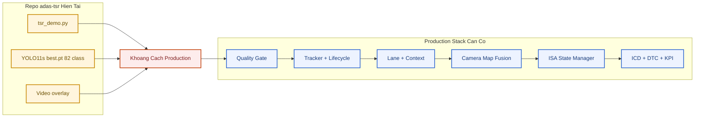

| Mức trưởng thành | Repo hiện tại | Evidence cần có để lên mức tiếp |
|---|---|---|
| L0 Offline demo | **Đang ở đây** — overlay video, ~7–8 FPS CPU | Script chạy ổn định, benchmark protocol |
| L1 Advisory prototype | Thiếu JSONL, per-class eval | `--jsonl-output`, KPI script |
| L2 Confirmed HMI | Thiếu tracker thật (`hold` ≠ tracking) | Track ID, lifecycle, flicker KPI |
| L3 ISA-ready | Thiếu map/ego speed/ISA model | Fusion arbiter, speed canonicalization |
| L4+ AD context | Thiếu lane/map/planning interface | Full stack integration + safety case |

---

## Phần I. Nghiên Cứu và Thiết Kế Hệ Thống

> Mục tiêu: xây tư duy đúng về TSR như automotive feature, không phải notebook object detection.

---

### I.1 TSR là gì và không phải là gì

> **Nguồn tại mục:** [1.01. Prototype to Production Narrative](../1.narrative/01.prototype_to_production.md) `[SRC]` và [Regulation (EU) 2019/2144](https://eur-lex.europa.eu/eli/reg/2019/2144/oj) — Lấy: ranh giới prototype/detector vs feature ADAS và bối cảnh ISA/general safety. Dùng ở: định nghĩa TSR là vehicle feature, không phải chỉ object detection/video overlay.

Traffic Sign Recognition (TSR) dùng camera trước để phát hiện và phân loại biển báo, chuyển kết quả thành thông tin cho người lái hoặc feature cao hơn (ISA).

**TSR không phải:**
- Chỉ object detection;
- Chỉ video overlay;
- Chỉ chọn model mAP cao nhất.

**TSR thực tế liên quan:** camera, ECU/runtime, HMI, diagnostics, watchdog, ODD, safety, SOTIF, map context, OTA, post-SOP governance.

**Ví dụ — detector vs feature**

| Mức | Hành vi |
|---|---|
| Detector | Nhìn thấy hình tròn đỏ, gán `Speed limit 50 km/h` |
| Feature trưởng thành | Xác nhận 3 frame liên tiếp → kiểm tra ODD → đối chiếu HMI policy → mới phát icon/chime |

Khoảng cách giữa hai hàng trên là khoảng cách từ **CV demo** tới **automotive feature**.

---

### I.2 Bài toán kỹ thuật đúng: năm lớp xử lý

> **Nguồn tại mục:** [TSR Production Reference](01.automotive_standards.md) `[SRC]`, [2.08. State Manager and Sign Lifecycle](03.safety_analysis_hazop_fta.md) `[SRC]` và [ISO 21448:2022](https://www.iso.org/standard/77490.html) — Lấy: phân lớp perception → temporal/context → feature output và ODD/SOTIF gate. Dùng ở: bảng năm lớp xử lý trước khi publish HMI/ISA.

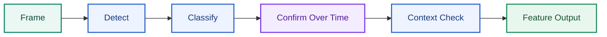

| Lớp | Nội dung | Bỏ qua hậu quả |
|---|---|---|
| 1. Nhìn thấy | Phát hiện đúng vùng biển trong frame, đủ kích thước và chất lượng để các bước sau còn ý nghĩa | Miss sign hoàn toàn; các bước sau không còn gì để cứu |
| 2. Gán class | Phân loại đúng loại biển, giá trị biển và confidence đủ tin cậy/có calibrate | False advisory; áp sai giới hạn tốc độ hoặc sai loại cấm/cảnh báo |
| 3. Xác nhận thời gian | Ổn định qua nhiều frame bằng tracking hoặc temporal confirmation, tránh quyết định từ one-frame glitch | Flicker HMI; sign lúc hiện lúc mất; giữ sign cũ quá lâu hoặc clear quá sớm |
| 4. Ngữ cảnh ego | Xác định biển có thực sự áp dụng cho xe ego: đúng làn, đúng hướng đi, đúng đoạn đường, đúng thời điểm | Nhận đúng biển nhưng áp cho nhầm làn/nhánh đường; advisory đúng theo detector nhưng sai theo ngữ cảnh lái xe |
| 5. Output có kiểm soát | Xuất advisory/HMI/signal theo state machine, hysteresis, timeout và degraded/unavailable behavior rõ ràng | HMI gây hiểu nhầm; feature phản ứng thất thường; malfunctioning behavior ở mức hệ thống |

Chỉ làm tốt lớp 1–2 → hệ thống vẫn chưa đủ an toàn cho triển khai thực tế.

---

### I.3 Mục tiêu dự án và item definition

> **Nguồn tại mục:** [ISO 26262 package overview](https://www.iso.org/publication/PUB200262.html), [ISO 21448:2022](https://www.iso.org/standard/77490.html) và [2.09. ODD for TSR](01.automotive_standards.md) `[SRC]` — Lấy: item definition, authority, ODD và fallback/degraded behavior. Dùng ở: item definition phase-1 cho TSR advisory-only.

#### I.3.1 Mục tiêu ngắn gọn

- Phát hiện/phân loại biển tĩnh phía trước bằng camera trước;
- Cung cấp cảnh báo đáng tin cậy lên HMI;
- Tạo đầu ra sẵn sàng tích hợp ISA hoặc feature logic cao hơn;
- Vận hành an toàn trong ODD đã xác định;
- Có cơ chế `DEGRADED` / `UNAVAILABLE` rõ ràng.

#### I.3.2 Item definition phase-1 (production đề xuất)

| Hạng mục | Giá trị đề xuất |
|---|---|
| Authority | `advisory only`; chỉ hiển thị/cảnh báo, chưa tự can thiệp ga phanh |
| Sensor | Camera trước; giả định đường capture và timestamp đủ ổn định cho feature |
| Output chính | Biển đã confirm cho cluster/HUD, kèm trạng thái availability và quality |
| Integration đích | Xuất signal sạch để pha sau nối sang ISA hoặc map-consistency |
| ODD phase-1 | Đô thị/quốc lộ/cao tốc có topology không quá phức tạp; `10-100,000 lux`; không mưa hoặc mưa nhẹ (`<10 mm/h`); tầm nhìn `>100 m`; camera sạch và calibrate; biển tĩnh vật lý trong vùng quan sát ego |
| Fallback | `DEGRADED` giảm capability; `SAFE_DISABLE` ngừng advisory mới; `UNAVAILABLE` báo feature không dùng được |

**Ví dụ item definition có kỷ luật:** *"TSR advisory only cho biển tĩnh phía trước trong ODD phase-1."*
**Ví dụ yếu:** *"Dùng YOLO nhận diện biển báo"* — nói về thuật toán, không nói về feature.

#### I.3.3 Bảng item definition đầy đủ

| Hạng mục | Nội dung cần xác định |
|---|---|
| Chức năng chính | Detect/classify biển tĩnh phía trước và phát advisory đã confirm, không phát raw detector output |
| Kiểu authority | Chỉ advisory hay đã được phép cấp dữ liệu cho ISA/arbitration khác |
| Sensor | Camera nào, vị trí lắp, FOV, HDR/WDR, frame rate và điều kiện hiệu chuẩn |
| Compute platform | ECU/SoC nào chạy, OS/runtime gì, budget CPU/RAM/nhiệt ra sao |
| ODD | Loại đường, dải tốc độ, ánh sáng, thời tiết và điều kiện camera được coi là hợp lệ |
| Output | HMI nào nhận gì, có chime không, signal nào đi CAN/Ethernet, log nào lưu lại |
| Fallback | Khi degrade hoặc fault thì feature giảm gì, dừng gì, báo cho ai |
| KPI | Recall/precision, false advisory, latency, availability, độ phủ diagnostics |

---

### I.4 Work products và chuỗi tài liệu dự án

> **Nguồn tại mục:** [ISO 26262-1:2018](https://www.iso.org/standard/68383.html), [Automotive SPICE / VDA QMC](https://vda-qmc.de/en/automotive-spice/) và [2.08. Verification Validation and Release](01.automotive_standards.md) `[SRC]` — Lấy: lifecycle evidence, traceability và release gate mindset. Dùng ở: chuỗi work products item definition → verification → release readiness.

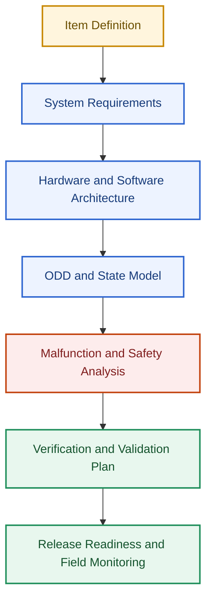

| Nhóm tài liệu | Mục đích |
|---|---|
| Item Definition | Khóa phạm vi feature, authority, ODD và assumption nền |
| Interface Control Document (ICD) | Chốt signal/message, timing, ownership, DTC/DID giữa các bên |
| Safety/SOTIF Analysis | Ghi rõ hazard, trigger condition, giới hạn perception và reaction concept |
| SW/HW Architecture | Phân bổ chức năng theo ECU, task, module và đường dữ liệu |
| Verification Plan | Xác định test level, KPI, pass criteria và evidence phải thu |
| Release Checklist | Chặn việc phát hành khi thiếu integration, diagnostics hoặc rollback evidence |

---

### I.5 Kiến trúc hệ thống mức xe

> **Nguồn tại mục:** [2.05. System Diagram](01.automotive_standards.md) `[SRC]`, [AUTOSAR Classic Platform](https://www.autosar.org/standards/classic-platform) và [ISO 14229-1:2026](https://www.iso.org/standard/87962.html) — Lấy: block decomposition, ECU/software boundary và diagnostics interface. Dùng ở: kiến trúc camera/ECU/perception/state/HMI/gateway/service.

Hệ thống TSR không chỉ là một mô hình AI phát hiện biển báo. Trên xe thật, đây là chuỗi chuyển đổi tín hiệu nhiều tầng — từ cảnh đường thực tế, qua các thành phần phần cứng/phần mềm, đến thông tin hiển thị cho người lái và các hệ thống hỗ trợ lái xe.

#### I.5.1 Kiến trúc thành phần

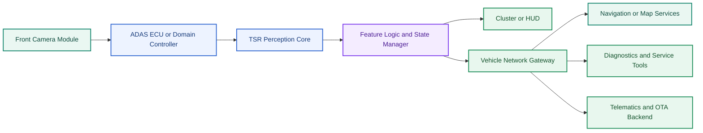

##### Góc nhìn phân lớp bên trong TSR ECU

Sơ đồ trên mô tả kiến trúc mức xe. Nếu zoom vào bên trong ECU chạy TSR, pipeline thường chia thành ba lớp: `Perception Layer`, `Feature Logic Layer` và `Vehicle Integration Layer`. Đây là cầu nối rõ ràng giữa detector/classifier và feature hành vi trên xe.

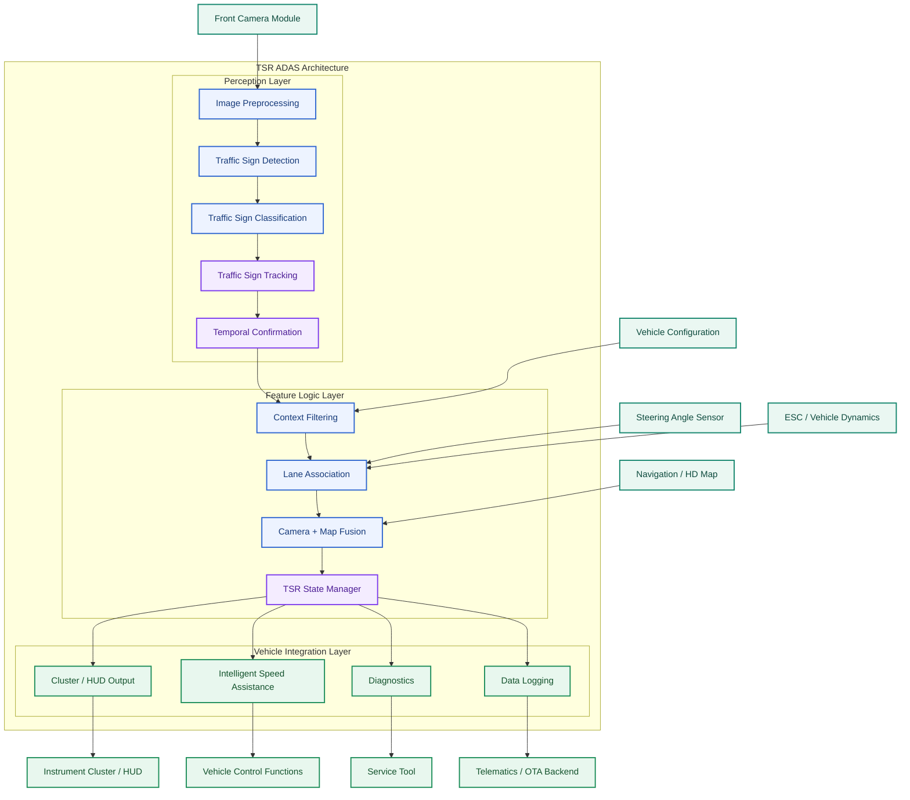

| Lớp | Vai trò | Khác biệt cốt lõi |
|---|---|---|
| Perception Layer | Biến ảnh camera thành sign candidates có class, confidence, track và xác nhận theo thời gian | Chưa quyết định biển nào thực sự áp dụng cho xe ego |
| Feature Logic Layer | Lọc ngữ cảnh, gắn làn, đối chiếu bản đồ và quyết định sign hiệu lực | Đây là nơi biến AI output thành TSR feature behavior |
| Vehicle Integration Layer | Xuất kết quả sang HMI, ISA, diagnostics và logging | Đảm bảo feature sống được trong hệ thống xe thật, không chỉ trong demo |

#### I.5.2 Trách nhiệm và luồng tín hiệu

| Thành phần | Trách nhiệm chính | Đầu vào | Đầu ra |
|---|---|---|---|
| Front Camera Module | Thu nhận hình ảnh phía trước xe | Cảnh đường thực tế, điều kiện ánh sáng, môi trường | Luồng ảnh, timestamp, trạng thái camera |
| ADAS ECU / Domain Controller | Nền tảng tính toán cho các thuật toán ADAS | Khung hình camera, dữ liệu xe, tham số hiệu chuẩn | Kết quả perception, dữ liệu trung gian |
| TSR Perception Core | Phát hiện, phân loại và theo dõi biển báo | Hình ảnh, mô hình AI, lịch sử theo dõi | Traffic sign candidates |
| Feature Logic & State Manager | Chuyển kết quả perception thành chức năng TSR thực tế | Dữ liệu perception, bản đồ, làn đường, trạng thái xe | Giới hạn tốc độ hiệu lực, cảnh báo, trạng thái TSR |
| Instrument Cluster / HUD | Hiển thị thông tin cho người lái | Trạng thái TSR, yêu cầu hiển thị | Biểu tượng và cảnh báo |
| Vehicle Network Gateway | Phân phối dữ liệu giữa các ECU | Dữ liệu TSR, trạng thái hệ thống | CAN/FlexRay/Ethernet messages |
| Navigation / Map Services | Cung cấp dữ liệu bản đồ hỗ trợ TSR | GPS, HD Map | Giới hạn tốc độ từ bản đồ, thông tin ngữ cảnh |
| Diagnostics & Service Tools | Giám sát sức khỏe hệ thống | Diagnostic messages | DTC, log lỗi, báo cáo bảo trì |
| Telematics & OTA Backend | Quản lý đội xe và cập nhật phần mềm | Telemetry, KPI vận hành | OTA package, báo cáo phân tích |

#### I.5.3 Mô tả chi tiết từng thành phần

##### Front Camera Module

Cảm biến chính của hệ thống TSR.

| Hạng mục | Nội dung |
|---|---|
| Trách nhiệm | Thu nhận hình ảnh phía trước xe; điều khiển phơi sáng (Exposure Control); cân bằng trắng (White Balance); đồng bộ thời gian với các cảm biến khác |
| Đầu vào | Môi trường giao thông; điều kiện ánh sáng; điều kiện thời tiết |
| Đầu ra | RGB Frames; Timestamp; Camera Health Status |
| Lỗi thường gặp | Bụi bẩn trên ống kính; nước mưa che khuất; lóa sáng mặt trời; Motion Blur; mất nét |

##### ADAS ECU / Domain Controller

Bộ xử lý trung tâm thực hiện các thuật toán ADAS.

| Hạng mục | Nội dung |
|---|---|
| Trách nhiệm | Chạy mô hình AI; thực hiện inference thời gian thực; điều phối tài nguyên CPU/GPU/NPU; giao tiếp với các ECU khác |
| Đầu vào | Camera Frames; Vehicle Speed; Yaw Rate; Calibration Data; Map Data |
| Đầu ra | Traffic Sign Candidates; Perception Metadata; Feature Status |
| Yêu cầu Automotive | Độ trễ thấp (Low Latency); Deterministic Execution; Health Monitoring; Functional Safety Monitoring |

##### TSR Perception Core

Lõi perception của hệ thống TSR.

| Hạng mục | Nội dung |
|---|---|
| Trách nhiệm | Traffic Sign Detection; Traffic Sign Classification; Traffic Sign Tracking; Confidence Estimation; Temporal Fusion |
| Đầu vào | Camera Frames; AI Models; Track History |
| Đầu ra | Bounding Box; Class ID; Confidence Score; Track ID; Track Age |
| Ví dụ | Class = Speed Limit 60; Confidence = 0.97; Track ID = 125; Track Age = 12 frames |
| Luồng xử lý nội bộ | Camera Frame → Detector → Classifier → Tracker → Temporal Fusion → Traffic Sign Candidate |

##### Feature Logic & State Manager

Chuyển kết quả AI thành chức năng TSR thực tế cho xe.

| Hạng mục | Nội dung |
|---|---|
| Trách nhiệm | Sign Confirmation; Sign Expiration; Lane Relevance Filtering; Map Fusion; ISA Logic; Driver Notification |
| Đầu vào | Perception Results; Lane Model; Map Speed Limit; Vehicle State |
| Đầu ra | Active Speed Limit; Warning State; TSR State |
| Ví dụ | Detector phát hiện 50 km/h, nhưng hệ thống xác định biển chỉ áp dụng cho làn rẽ phải → không kích hoạt giới hạn tốc độ mới |
| Luồng xử lý | Perception Output → Context Filter → Lane Association → Map Fusion → State Manager → Active Speed Limit |

##### Instrument Cluster / HUD

Giao diện người dùng của TSR.

| Hạng mục | Nội dung |
|---|---|
| Trách nhiệm | Hiển thị giới hạn tốc độ; hiển thị cảnh báo; thông báo cho người lái |
| Đầu vào | TSR State; HMI Commands |
| Đầu ra | Speed Limit Icon; Visual Warning; Driver Notification |
| Tác động khi lỗi | Hiển thị sai thông tin; giảm độ tin cậy của ADAS; gây hiểu nhầm cho người lái |

##### Vehicle Network Gateway

Thành phần trung gian trao đổi dữ liệu giữa các ECU.

| Hạng mục | Nội dung |
|---|---|
| Trách nhiệm | Signal Routing; Protocol Translation; Network Distribution |
| Đầu vào | TSR Outputs; Diagnostic Status |
| Đầu ra | CAN Messages; Ethernet Messages; Gateway Signals |
| Ví dụ | CurrentSpeedLimit = 80; Confidence = High; Source = Camera + Map Fusion |

##### Navigation / Map Services

Cung cấp ngữ cảnh giao thông từ bản đồ.

| Hạng mục | Nội dung |
|---|---|
| Trách nhiệm | Map Speed Limit; Road Classification; Road Geometry; Context Support |
| Đầu vào | GPS Position; GNSS Signals; HD Map Database |
| Đầu ra | Map Speed Limit; Road Attributes; Road Context |
| Ví dụ | Camera = 80 km/h, Map = 80 km/h → hệ thống tăng độ tin cậy cho kết quả TSR |
| Luồng Camera + Map Fusion | Camera TSR + HD Map → Fusion Engine → Confidence Evaluation → Final Speed Limit |

##### Diagnostics & Service Tools

Theo dõi sức khỏe hệ thống.

| Hạng mục | Nội dung |
|---|---|
| Trách nhiệm | Health Monitoring; Fault Detection; Service Support |
| Đầu vào | Diagnostic Messages; Health Status; Fault Events |
| Đầu ra | DTC Codes; Error Logs; Service Reports |
| Ví dụ DTC | TSR_CAMERA_BLOCKED; TSR_MODEL_TIMEOUT; TSR_MAP_SYNC_ERROR |

##### Telematics & OTA Backend

Hỗ trợ quản lý đội xe và cập nhật phần mềm từ xa.

| Hạng mục | Nội dung |
|---|---|
| Trách nhiệm | Fleet Analytics; Remote Diagnostics; Software Updates; Performance Monitoring |
| Đầu vào | Vehicle Telemetry; TSR Statistics; Failure Reports |
| Đầu ra | Fleet KPI Dashboard; OTA Packages; Engineering Reports |
| Luồng OTA | Engineering Team → OTA Backend → Vehicle Gateway → ADAS ECU → TSR Software Update |

#### I.5.4 Chuyển đổi tín hiệu từ cảm biến đến người lái

Mỗi tầng trong pipeline có trách nhiệm chuyển đổi dữ liệu thô thành thông tin có ý nghĩa đối với người lái và các hệ thống hỗ trợ lái xe.

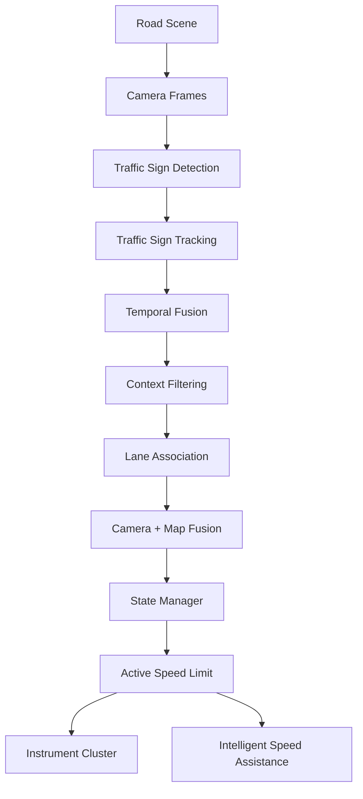

##### Luồng chuyển đổi dữ liệu

| Giai đoạn | Đầu vào | Đầu ra | Mục tiêu | Nếu thiếu giai đoạn này |
|---|---|---|---|---|
| Road Scene | Môi trường giao thông thực tế | Cảnh vật phía trước xe | Nguồn thông tin ban đầu | Không có dữ liệu để nhận thức |
| Camera Frames | Cảnh vật thực tế | Hình ảnh số hóa | Chuyển đổi thế giới thực thành dữ liệu xử lý được | TSR không thể hoạt động |
| Traffic Sign Detection | Camera Frames | Bounding Boxes | Xác định vị trí biển báo trong ảnh | Không biết biển báo nằm ở đâu |
| Traffic Sign Tracking | Bounding Boxes | Sign Tracks | Duy trì nhận dạng qua nhiều frame | Kết quả nhấp nháy (flicker) |
| Temporal Fusion | Sign Tracks | Stable Sign Hypotheses | Tổng hợp thông tin theo thời gian | Dễ sinh false positive hoặc false negative |
| Context Filtering | Stable Sign Hypotheses | Relevant Signs | Loại bỏ biển báo không liên quan | Hiển thị sai biển báo |
| Lane Association | Relevant Signs | Lane-Relevant Signs | Xác định biển báo áp dụng cho làn hiện tại | Áp dụng nhầm biển báo của làn khác |
| Camera + Map Fusion | Lane-Relevant Signs, HD Map | Validated Signs | Tăng độ tin cậy bằng dữ liệu bản đồ | Giảm độ ổn định và độ chính xác |
| State Manager | Validated Signs | Active Speed Limit | Quyết định trạng thái TSR cuối cùng | Không có logic vòng đời biển báo |
| Instrument Cluster | Active Speed Limit | Thông tin hiển thị | Cung cấp thông tin cho người lái | Người lái không nhận được kết quả |
| Intelligent Speed Assistance | Active Speed Limit | Speed Advisory / Intervention | Hỗ trợ duy trì tốc độ phù hợp | Không hỗ trợ điều khiển tốc độ |

##### Chuyển đổi giá trị qua từng tầng

Ví dụ khi xe tiếp cận biển báo tốc độ 80 km/h:

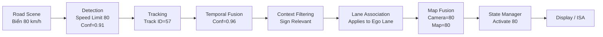

Trong ví dụ trên, giá trị "80 km/h" không được hiển thị ngay sau bước Detection. Hệ thống cần nhiều tầng xác nhận để đảm bảo biển báo:

- Thực sự tồn tại; temporal evidence giúp tránh publish từ one-frame glitch.
- Không phải kết quả nhận dạng sai; confidence và plausibility cần được kiểm tra trước HMI.
- Áp dụng cho làn đường hiện tại; sign ở lane khác không nên trở thành advisory cho ego vehicle.
- Phù hợp với dữ liệu bản đồ; camera-map conflict cần arbitration thay vì ghi đè im lặng.
- Đủ độ tin cậy để hiển thị cho người lái; output phải qua state manager và publish policy.

##### Góc nhìn kiến trúc Production TSR

Trong các hệ thống TSR học thuật, pipeline thường dừng lại ở bước Detection hoặc Classification:

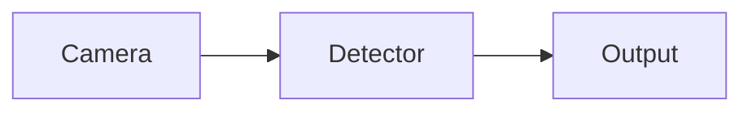

Trong các hệ thống TSR production của OEM hoặc Tier-1, pipeline thường bao gồm:

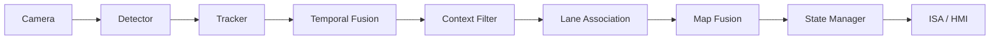

Điểm khác biệt lớn nhất là phần lớn độ phức tạp của hệ thống TSR production không nằm ở mô hình AI mà nằm ở các tầng xử lý sau Detection nhằm đảm bảo tính ổn định, độ tin cậy và mức độ phù hợp với ngữ cảnh giao thông thực tế.

#### I.5.5 Điều người mới thường bỏ sót

Người mới hay nghĩ `TSR = model + video output`. Trên xe thật:

- Camera module, SerDes, timestamp, cluster mapping, watchdog, OTA package, DTC quan trọng ngang model;
- Bug mapping class → icon có thể gây hại dù detector đúng;
- Camera HDR kém có thể làm feature fail trên xe dù benchmark lab đẹp.

---

### I.6 Phần cứng và thiết bị

> **Nguồn tại mục:** [ISO 16750-1:2023](https://www.iso.org/standard/77578.html), [AUTOSAR Classic Platform](https://www.autosar.org/standards/classic-platform) và [3.10. Detector Architecture Deep Reference](../3.implementation/01.hybrid_pipeline_architecture.md) `[SRC]` — Lấy: vehicle environmental robustness, platform boundary và edge/runtime constraints. Dùng ở: camera, ECU, storage, network, power, thermal và hardware trade-off của TSR.

Trong hệ thống Traffic Sign Recognition (TSR), phần cứng đóng vai trò quyết định khả năng thu nhận dữ liệu, tốc độ xử lý và độ ổn định của toàn bộ hệ thống. Một mô hình AI có độ chính xác cao vẫn có thể cho kết quả kém nếu camera không đủ chất lượng, ECU không đáp ứng được thời gian xử lý hoặc dữ liệu không được truyền ổn định.

Do đó, khi thiết kế hệ thống TSR production, việc lựa chọn phần cứng cần được thực hiện song song với quá trình phát triển thuật toán.

---

#### I.6.1 Kiến trúc phần cứng mức hệ thống

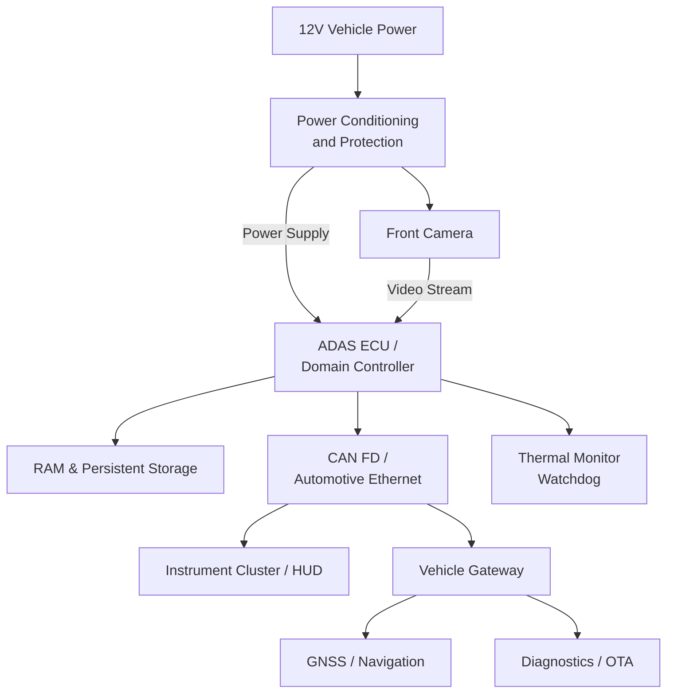

Kiến trúc trên mô tả luồng dữ liệu và kết nối giữa các thành phần phần cứng chính của hệ thống TSR.

Toàn bộ hệ thống bắt đầu từ nguồn điện 12V của xe. Nguồn này được đưa qua mạch **Power Conditioning and Protection** nhằm ổn định điện áp và bảo vệ ECU trước các hiện tượng như sụt áp (brownout), tăng áp (load dump), đảo cực hoặc nhiễu điện từ.

Sau khi được cấp nguồn, **Front Camera** thu nhận hình ảnh phía trước xe và truyền dữ liệu tới **ADAS ECU hoặc Domain Controller**. Đây là trung tâm xử lý của toàn bộ hệ thống TSR, nơi thực hiện các bước tiền xử lý ảnh, chạy mô hình AI, hậu xử lý và đưa ra quyết định cuối cùng.

ECU sử dụng **RAM** để lưu dữ liệu tạm thời trong quá trình xử lý từng frame, đồng thời lưu trữ mô hình AI, tham số hiệu chỉnh và firmware trong **Persistent Storage** (Flash hoặc eMMC/UFS).

Kết quả nhận dạng sau đó được gửi qua **CAN FD** hoặc **Automotive Ethernet** để hiển thị trên **Instrument Cluster**, **HUD** hoặc truyền sang các ECU khác.

Thông qua **Vehicle Gateway**, ECU cũng có thể trao đổi dữ liệu với:

- Hệ thống định vị GNSS và bản đồ HD phục vụ Camera + Map Fusion.
- Hệ thống OTA để cập nhật firmware hoặc AI model.
- Thiết bị chẩn đoán (Diagnostic Tool) phục vụ bảo dưỡng và sửa chữa.

Song song với pipeline xử lý, **Thermal Monitor và Watchdog** liên tục giám sát nhiệt độ, mức sử dụng tài nguyên và trạng thái hoạt động của ECU nhằm phát hiện các lỗi như quá nhiệt, treo tiến trình hoặc vượt quá giới hạn thời gian xử lý.

---

#### Luồng dữ liệu phần cứng

| Bước | Thành phần | Input | Output | Vai trò |
|------|------------|--------|---------|----------|
| 1 | Vehicle Power | 12V Battery | Stable Power | Cấp nguồn cho toàn hệ thống |
| 2 | Power Conditioning | Vehicle Power | Protected Power | Ổn định và bảo vệ nguồn |
| 3 | Front Camera | Road Scene | Video Frames | Thu nhận hình ảnh |
| 4 | ADAS ECU | Video Frames | TSR Result | Xử lý thuật toán TSR |
| 5 | Vehicle Network | TSR Result | Vehicle Signals | Truyền dữ liệu tới ECU khác |
| 6 | Cluster / HUD | Vehicle Signals | Driver Information | Hiển thị cho người lái |
| 7 | Navigation | GPS Position | Speed Limit Database | Hỗ trợ Map Fusion |
| 8 | Diagnostics | ECU Status | DTC / Logs | Chuẩn đoán hệ thống |

---

#### I.6.2 Danh mục phần cứng cần chốt

Trước khi bắt đầu phát triển hệ thống TSR production, nhóm phát triển cần xác định rõ các thông số phần cứng. Những quyết định này sẽ ảnh hưởng trực tiếp đến độ chính xác của mô hình AI, độ trễ xử lý, khả năng mở rộng tính năng và chi phí sản phẩm.

| Hạng mục | Câu hỏi cần trả lời | Ý nghĩa kỹ thuật | Ví dụ |
|-----------|---------------------|------------------|--------|
| Camera trước | Độ phân giải, HDR/WDR, FPS, FOV, Rolling hay Global Shutter? | Quyết định chất lượng dữ liệu đầu vào của AI | Camera 2MP HDR 30 FPS |
| Camera Interface | CSI-2, GMSL hay FPD-Link? Khoảng cách Camera–ECU bao nhiêu? | Quyết định băng thông và độ ổn định truyền dữ liệu | GMSL2 cho khoảng cách 10–15 m |
| ADAS ECU | CPU, GPU, NPU, RAM có đủ chạy AI không? | Quyết định latency và khả năng mở rộng | Qualcomm Snapdragon Ride |
| Storage | Dung lượng lưu model và OTA? | Đảm bảo cập nhật firmware an toàn | eMMC 64 GB |
| Vehicle Network | CAN FD hay Ethernet? | Quyết định tốc độ truyền tín hiệu | CAN FD cho HMI, Ethernet cho camera |
| HMI | Hiển thị ở đâu? Có âm thanh cảnh báo không? | Trải nghiệm người lái | Cluster + HUD |
| Power | Có chịu được Brownout, Load Dump không? | Đảm bảo ECU hoạt động ổn định | [ISO 16750-1:2023](https://www.iso.org/standard/77578.html) |
| Mechanical | Camera rung, lệch góc hay bám bụi thế nào? | Ảnh hưởng trực tiếp tới chất lượng nhận dạng | Camera sau kính chắn gió |

---

#### Giải thích chi tiết từng thành phần

##### Front Camera

Camera là cảm biến quan trọng nhất của TSR.

Mọi thuật toán AI đều phụ thuộc vào chất lượng hình ảnh do camera cung cấp.

Một camera production thường cần quan tâm đến:

- Độ phân giải (Resolution); biển ở xa cần đủ pixel để đọc chữ số và viền.
- HDR hoặc WDR; camera phải giữ chi tiết biển khi nền trời hoặc đèn pha quá sáng.
- Tốc độ khung hình (FPS); FPS ảnh hưởng trực tiếp tới confirmation latency và tracking stability.
- Dynamic Range; dải sáng rộng giúp giảm mất chi tiết trong cảnh tối/sáng chênh lệch mạnh.
- Field of View (FOV); FOV phải đủ rộng để thấy biển ven đường nhưng không làm biển quá nhỏ.
- Độ nhạy sáng ban đêm; low-light performance quyết định khả năng hoạt động trong đô thị ban đêm.
- Rolling hoặc Global Shutter; shutter behavior ảnh hưởng tới méo hình khi xe rung hoặc chạy nhanh.

Ví dụ:

Một camera 2 MP HDR có thể đủ cho TSR trong môi trường đô thị, nhưng nếu camera đồng thời phục vụ Lane Keeping Assist hoặc Object Detection thì thường cần độ phân giải cao hơn.

---

##### Camera Interface

Camera không truyền dữ liệu trực tiếp bằng CAN.

Do băng thông video rất lớn, các chuẩn truyền tốc độ cao được sử dụng như:

- MIPI CSI-2
- GMSL
- FPD-Link III

Những chuẩn này đảm bảo:

- Độ trễ thấp; video frame phải tới ECU đủ nhanh để warning không bị muộn.
- Khoảng cách truyền xa; harness trong xe cần giữ signal integrity từ camera tới ECU.
- Khả năng chống nhiễu cao; môi trường điện từ automotive dễ gây lỗi truyền nếu interface không đủ robust.

---

##### ADAS ECU

Đây là "bộ não" của toàn bộ hệ thống TSR.

ECU chịu trách nhiệm:

- Image preprocessing
- AI inference
- Tracking
- Temporal confirmation
- Map Fusion; đối chiếu camera với prior từ bản đồ để xử lý missing sign hoặc conflict.
- State Machine; quản lý lifecycle và availability của sign theo thời gian.
- HMI Output; publish thông tin cuối cùng tới cluster/HUD theo policy an toàn.

Ngoài hiệu năng xử lý, ECU còn phải đáp ứng:

- Automotive Grade; linh kiện và platform phải phù hợp môi trường xe thật.
- Functional Safety; fault phải được phát hiện, cô lập và đưa hệ thống về degraded/unavailable khi cần.
- Nhiệt độ làm việc; SoC/ECU phải giữ timing budget khi cabin hoặc khoang máy nóng.
- Độ tin cậy lâu dài; TSR cần ổn định qua rung, nhiệt, aging và nhiều chu kỳ vận hành.

---

##### Storage

Storage lưu:

- Firmware
- AI Model
- Calibration Data
- Configuration
- Diagnostic Logs

Trong hệ thống production, firmware thường được lưu theo cơ chế **A/B Partition** để hỗ trợ cập nhật OTA an toàn và rollback khi quá trình cập nhật thất bại.

---

##### Vehicle Network

Sau khi TSR xác định biển báo hợp lệ, ECU sẽ truyền kết quả sang các ECU khác.

Ví dụ:

- Instrument Cluster
- HUD
- Intelligent Speed Assistance
- Adaptive Cruise Control
- Data Logger

Thông thường:

- CAN FD dùng để truyền tín hiệu điều khiển.
- Automotive Ethernet dùng cho dữ liệu tốc độ cao.

---

##### HMI

HMI quyết định cách người lái nhận được thông tin.

Ví dụ:

- Hiển thị biển báo trên bảng đồng hồ.
- Hiển thị trên HUD.
- Âm thanh cảnh báo.
- Voice Notification.
- Icon màu đỏ khi vượt tốc độ.

Thiết kế HMI cần đảm bảo:

- Không gây mất tập trung.
- Không hiển thị nhấp nháy.
- Tuân thủ quy định của OEM.

---

##### Power System

Nguồn điện trên ô tô không ổn định như nguồn máy tính.

Hệ thống cần chống chịu:

- Brownout
- Load Dump
- Reverse Polarity
- Cold Cranking
- EMC

Nếu camera mất nguồn trong vài trăm mili giây, hệ thống TSR cần phát hiện ngay và chuyển sang trạng thái **Degraded** thay vì tiếp tục sử dụng dữ liệu không hợp lệ.

---

##### Mechanical & Thermal

Camera cần được lắp đặt chính xác để đảm bảo góc quan sát không thay đổi.

Ngoài ra cần đánh giá:

- Rung động
- Nhiệt độ
- Bụi bẩn
- Nước mưa
- Tuyết
- Ánh sáng ngược

Các yếu tố này có thể làm giảm chất lượng hình ảnh và ảnh hưởng trực tiếp đến độ chính xác của thuật toán AI.

---

#### Ví dụ cấu hình phần cứng

##### Ví dụ A – Xe đô thị

| Thành phần | Cấu hình |
|------------|----------|
| Camera | 2 MP HDR |
| FPS | 30 FPS |
| FOV | 50–60° |
| ECU | Mid-range SoC |
| Network | CAN FD |
| HMI | Instrument Cluster |

Đây là cấu hình phù hợp với các xe chỉ sử dụng TSR để hiển thị hoặc cảnh báo tốc độ.

---

##### Ví dụ B – Xe cao cấp

| Thành phần | Cấu hình |
|------------|----------|
| Camera | 8 MP HDR |
| FPS | 60 FPS |
| Interface | GMSL2 |
| ECU | Automotive AI SoC |
| Network | Automotive Ethernet |
| HMI | Cluster + HUD + ISA |

Trong trường hợp này, camera thường được chia sẻ với nhiều tính năng ADAS khác như:

- Lane Keeping Assist (LKA)
- Automatic Emergency Braking (AEB)
- Adaptive Cruise Control (ACC)
- Traffic Light Recognition (TLR)

Do đó cần cân bằng giữa góc nhìn rộng để hỗ trợ nhiều tính năng và độ phân giải đủ cao để TSR vẫn nhận dạng chính xác các biển báo ở khoảng cách xa.


### I.7 Kiến trúc phần mềm nhúng

> **Nguồn tại mục:** [AUTOSAR Classic Platform](https://www.autosar.org/standards/classic-platform), [ISO 26262-1:2018](https://www.iso.org/standard/68383.html) và [Baseline TSR Analysis](../3.implementation/01.hybrid_pipeline_architecture.md) `[SRC]` — Lấy: phân lớp SWC/platform, fault containment và gap monolithic script. Dùng ở: task-based architecture, health monitor, degraded operation và timing contract.

#### I.7.1 Từ script nghiên cứu đến kiến trúc task-based production

Trong giai đoạn nghiên cứu, TSR thường được triển khai dưới dạng một script hoặc một tiến trình đơn lẻ:

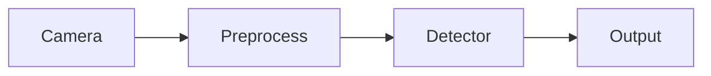

Cách tiếp cận này phù hợp cho:

- Nghiên cứu thuật toán; một script đơn giản giúp thử detector và heuristic nhanh.
- Proof-of-Concept; overlay demo đủ để chứng minh pipeline có thể chạy end-to-end.
- Đánh giá mô hình AI; nhóm có thể quan sát class/confidence và failure mode ban đầu.
- Thử nghiệm trên PC hoặc workstation; môi trường này thuận tiện cho debug nhưng khác ECU production.

Tuy nhiên, trên ECU production, cách triển khai này không đáp ứng được các yêu cầu về:

- Khả năng giám sát (monitoring); runtime cần health signal, watchdog và trạng thái feature rõ.
- Khả năng phục hồi lỗi (fault recovery); hệ thống phải xử lý crash, timeout hoặc OOM có kiểm soát.
- Khả năng cô lập lỗi (fault containment); lỗi detector không nên kéo sập HMI, diagnostics hoặc publisher.
- Khả năng đo lường hiệu năng; latency, queue age và freshness phải có metric riêng.
- Functional Safety; fault và malfunctioning behavior cần safety goal, requirement và verification.
- SOTIF; perception insufficiency cần ODD, trigger catalog và residual-risk mitigation.
- Khả năng bảo trì và cập nhật phần mềm; package/model/config cần versioning, rollback và sanity check.

Do đó các hệ thống ADAS production thường sử dụng kiến trúc task-based hoặc service-based.

---

#### I.7.2 Kiến trúc task-based tổng quát

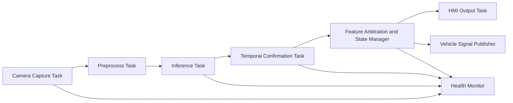

Trong kiến trúc này, mỗi task có thể được:

- Scheduling độc lập; mỗi task có timing budget riêng để tránh block dây chuyền.
- Restart độc lập; task lỗi có thể phục hồi mà không cần reset toàn bộ feature.
- Giám sát độc lập; health monitor biết chính xác khối nào đang degraded hoặc failed.
- Đo latency riêng; p95/p99 từng block giúp tìm bottleneck và viết timing contract.
- Báo lỗi riêng; DTC/reason code cần chỉ ra camera, inference, state manager hay HMI publisher.

Điều này giúp giới hạn phạm vi ảnh hưởng khi xảy ra lỗi.

---

#### I.7.3 Trách nhiệm của từng task

| Task | Trách nhiệm | Đầu vào | Đầu ra |
|--------|------------|----------|----------|
| Camera Capture Task | Thu nhận hình ảnh từ camera | Sensor stream | Raw frames |
| Preprocess Task | Resize, normalize, color conversion | Raw frames | Network input tensor |
| Inference Task | Chạy mô hình AI | Tensor | Detection candidates |
| Temporal Confirmation Task | Temporal fusion và sign confirmation | Detection candidates | Stable sign hypotheses |
| Feature Arbitration & State Manager | Xác định sign hợp lệ và trạng thái TSR | Stable signs, vehicle state, map data | Active TSR state |
| HMI Output Task | Hiển thị kết quả cho người lái | Active TSR state | Cluster/HUD commands |
| Vehicle Signal Publisher | Publish TSR signal sang các ECU khác | Active TSR state | CAN/Ethernet messages |
| Health Monitor | Giám sát toàn bộ pipeline | Heartbeat, latency, health counters | Diagnostic events |

---

#### I.7.4 Luồng dữ liệu giữa các task

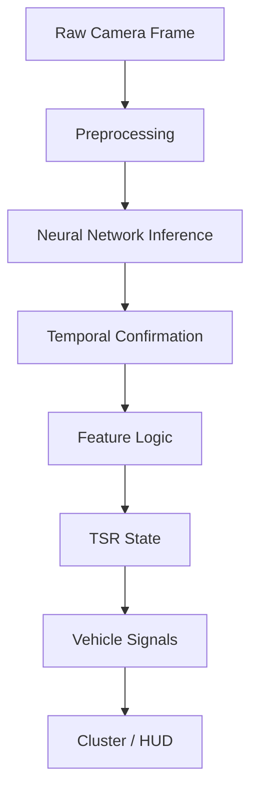

Mỗi task chỉ nhìn thấy dữ liệu cần thiết cho nhiệm vụ của nó.

Điều này giúp:

- Giảm coupling.
- Dễ kiểm thử.
- Dễ thay thế module.
- Hỗ trợ phát triển song song giữa các nhóm.

---

#### I.7.5 Fault Containment và Degraded Operation

Một nguyên tắc quan trọng của phần mềm automotive là:

> Hệ thống không nhất thiết phải hoạt động hoàn hảo, nhưng phải biết khi nào nó không còn đáng tin cậy.

Điểm cốt lõi của `fault containment` là cô lập lỗi theo block thay vì để một lỗi cục bộ lan ra thành hành vi hệ thống khó đoán. Trong TSR, detector chậm, camera timestamp lỗi, hoặc quality gate đánh giá ảnh quá xấu không nên trực tiếp biến thành output mơ hồ trên HMI. Mỗi khối phải có ranh giới trách nhiệm, trạng thái sức khỏe và cách báo lỗi riêng để `State Manager` quyết định feature còn `AVAILABLE`, phải `DEGRADED`, hay phải `UNAVAILABLE`.

`Degraded operation` không có nghĩa là hệ thống làm mọi thứ giống trạng thái bình thường nhưng với độ chính xác thấp hơn. Ý nghĩa đúng là feature chủ động giảm authority hoặc giảm capability để giữ hành vi an toàn và dễ giải thích hơn. Ví dụ:

- Bỏ publish sign mới khi quality xuống quá thấp;
- Cho phép giữ sign đã confirm trong thời gian ngắn nhưng không nâng confidence;
- Tắt chime hoặc suppress update mạnh khi hệ thống không chắc;
- Chuyển sang `UNAVAILABLE` nếu lỗi kéo dài vượt giới hạn policy.

Nguyên tắc thiết kế ở đây là:

- Lỗi phải được phát hiện bằng tiêu chí cụ thể: latency budget, nhiệt độ, input timeout, quality score, memory pressure;
- Phản ứng phải xác định trước: degrade gì, giữ gì, bỏ gì, log gì;
- Driver-facing output phải bảo thủ hơn raw perception output;
- Mọi chuyển trạng thái phải đi qua state machine, không xử lý ad-hoc trong detector code.

Ví dụ ECU bị quá nhiệt.

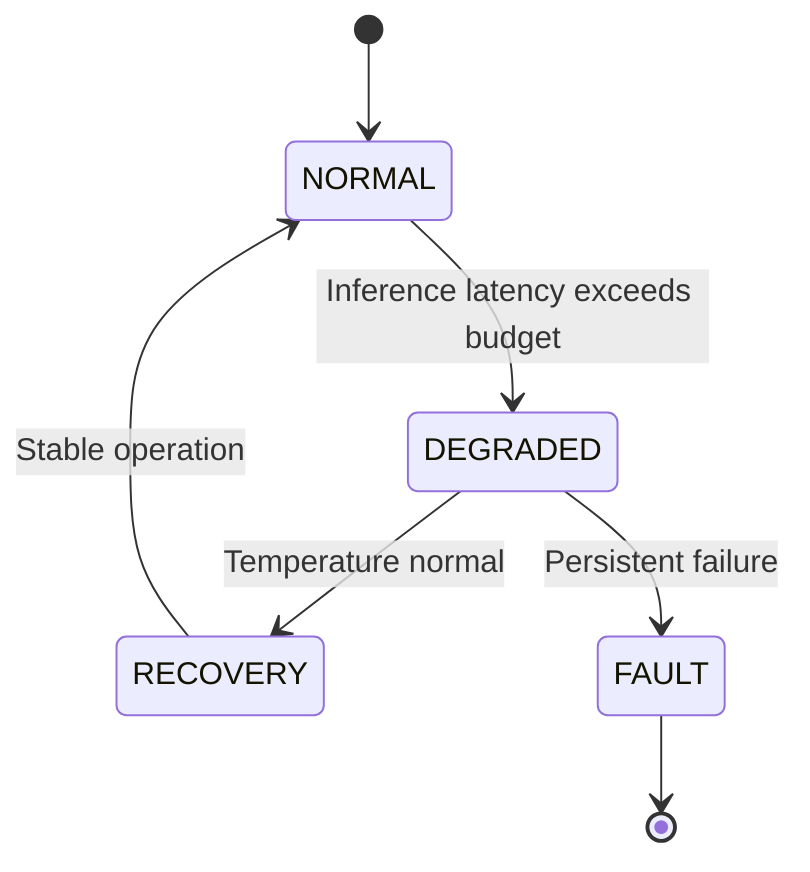

---

#### I.7.6 Ví dụ: Detector bị chậm do Thermal Throttling

Trình tự sự kiện:

1. ECU tăng nhiệt độ.
2. GPU/NPU bị giảm xung nhịp.
3. Inference Task vẫn hoạt động.
4. Latency tăng vượt ngân sách cho phép.
5. Health Monitor phát hiện vi phạm timing.
6. TSR chuyển sang chế độ DEGRADED.
7. HMI hiển thị trạng thái hạn chế chức năng.
8. Diagnostic Event được ghi nhận.

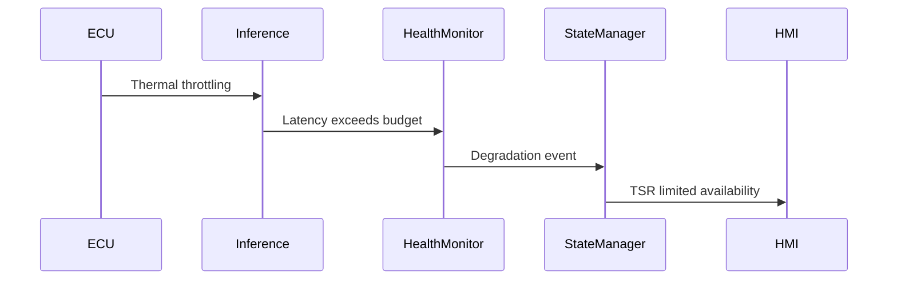

Nếu không có cơ chế này:

- TSR vẫn tiếp tục hiển thị kết quả; HMI có thể giữ advisory dù input không còn đáng tin.
- Người lái tin rằng hệ thống hoạt động bình thường; đây là foreseeable misuse cần tránh.
- Độ tin cậy thực tế đã suy giảm đáng kể; feature phải chuyển sang degraded/unavailable thay vì im lặng.

Đây là hành vi không chấp nhận được trong hệ thống production.

---

#### I.7.7 Phân tầng phần mềm

| Layer | Chức năng |
|---------|-----------|
| Driver / BSP | Camera driver, deserializer, DMA, power management |
| Operating System | Process scheduling, memory management, IPC |
| Runtime Platform | Logging, watchdog, diagnostics, resource supervision |
| Perception Core | Detection, tracking, temporal fusion |
| Feature Logic | Context filtering, lane association, map fusion, state management |
| Vehicle Integration | CAN/Ethernet communication, diagnostics, configuration |
| Service & Tooling | Calibration, manufacturing tests, replay, data collection |
| OTA & Lifecycle Management | Software update, version management, fleet monitoring |

---

#### I.7.8 Liên hệ với kiến trúc ADAS hiện đại

Trong các hệ thống ADAS hiện đại:

- AUTOSAR Classic thường quản lý các ECU chức năng đơn giản.
- AUTOSAR Adaptive thường được sử dụng trên Domain Controller.
- ROS2 thường xuất hiện trong môi trường nghiên cứu hoặc phát triển nội bộ.
- Các nền tảng như NVIDIA DRIVE, Qualcomm Ride và Mobileye đều sử dụng kiến trúc service-based tương tự.

Các framework và middleware trong automotive có thể khác nhau giữa các nhà cung cấp (AUTOSAR Adaptive, ROS 2, middleware nội bộ của OEM,...), tuy nhiên hầu hết các hệ thống production đều tuân theo một số nguyên tắc kiến trúc chung. Hiểu được các khái niệm này sẽ giúp người phát triển dễ dàng tiếp cận bất kỳ nền tảng nào.

| Thuật ngữ | Giải thích | Mục đích | Ví dụ trong TSR |
|-----------|------------|----------|-----------------|
| **Task-based Architecture** | Hệ thống được chia thành nhiều **task** hoặc **service** độc lập, mỗi task đảm nhiệm một chức năng cụ thể thay vì gom toàn bộ logic vào một chương trình duy nhất (monolithic). | Giúp dễ phát triển, kiểm thử, tái sử dụng và bảo trì. Khi một task gặp lỗi, các task khác vẫn có thể tiếp tục hoạt động. | Tách riêng thành các task: Camera Capture, Image Preprocessing, AI Inference, Tracking, State Manager và HMI Output. |
| **Health Monitoring** | Cơ chế giám sát trạng thái hoạt động của từng task hoặc toàn bộ hệ thống, bao gồm CPU load, RAM usage, latency, watchdog timeout và lỗi runtime. Thành phần giám sát này hoạt động độc lập với pipeline perception. | Phát hiện sớm lỗi, tránh việc hệ thống tiếp tục đưa ra kết quả khi đã mất khả năng xử lý chính xác. | Nếu AI Inference bị treo hoặc mất quá nhiều thời gian xử lý, Health Monitor sẽ phát hiện và gửi cảnh báo tới State Manager. |
| **Fault Containment** | Nguyên tắc cô lập lỗi trong phạm vi nhỏ nhất có thể, không để lỗi của một module lan sang các module khác hoặc ảnh hưởng tới toàn hệ thống. | Tăng độ tin cậy và khả năng phục hồi của hệ thống. Một lỗi cục bộ không được phép gây mất chức năng của toàn bộ ADAS. | Detector gặp lỗi không được phép gửi dữ liệu sai trực tiếp lên HMI; State Manager sẽ chặn kết quả không hợp lệ và chuyển feature sang trạng thái an toàn. |
| **Degraded Operation** | Chế độ hoạt động suy giảm khi hệ thống không còn đáp ứng đầy đủ điều kiện vận hành nhưng vẫn có thể duy trì một phần chức năng. | Đảm bảo hệ thống vẫn hoạt động an toàn thay vì tắt hoàn toàn khi xảy ra lỗi hoặc thiếu tài nguyên. | Camera bị bẩn hoặc ECU quá nhiệt làm FPS giảm; TSR vẫn hiển thị biển báo nhưng không còn hỗ trợ ISA và thông báo trạng thái suy giảm. |
| **Availability State** | Trạng thái thể hiện mức độ sẵn sàng của một tính năng. Hệ thống thường chuyển đổi giữa các trạng thái như *Initializing*, *Available*, *Unavailable*, *Degraded* hoặc *Fault*. | Giúp các ECU khác và HMI biết feature hiện có thể sử dụng hay không, tránh hiển thị thông tin sai cho người lái. | Khi camera mất tín hiệu, State Manager chuyển trạng thái TSR từ **Available** sang **Unavailable** và Cluster hiển thị biểu tượng TSR không khả dụng. |
| **Deterministic Timing** | Khả năng đảm bảo thời gian xử lý của hệ thống luôn nằm trong giới hạn xác định trước (Worst-Case Execution Time), thay vì dao động ngẫu nhiên giữa các lần thực thi. | Rất quan trọng đối với hệ thống thời gian thực (Real-Time System), giúp dự đoán được độ trễ từ lúc camera thu nhận ảnh đến khi HMI hiển thị kết quả. | Nếu yêu cầu latency của TSR là 100 ms, toàn bộ pipeline từ Camera → AI → State Manager → Cluster phải luôn hoàn thành trong giới hạn này, kể cả khi CPU đang chịu tải cao. |

Với TSR, điều này dẫn tới một hệ quả thực tế: mô hình AI chỉ là một thành phần của stack. Giá trị production đến từ cách cả feature quản lý vòng đời sign, quality, state, diagnostics và contract với các khối khác trên xe. Một detector tốt nhưng không có timing contract, không có health monitor và không có policy `DEGRADED` vẫn chưa đạt chuẩn của một tính năng ADAS trưởng thành.

Đây là nền tảng để chuyển một mô hình AI nghiên cứu thành một chức năng TSR đủ điều kiện triển khai trên xe thương mại.

---

### I.8 ODD và quản lý trạng thái

> **Nguồn tại mục:** [ISO 21448:2022](https://www.iso.org/standard/77490.html), [Setting AI in context](https://arxiv.org/abs/2201.11451), [IEEE Std 2020-2024 / P2020](https://standards.ieee.org/ieee/2020/11960/) và [2.09. ODD for TSR](01.automotive_standards.md) `[SRC]` — Lấy: ODD boundary, trigger conditions, automotive image-quality attributes và state/degraded behavior. Dùng ở: phase-1 ODD, quality gate, out-of-scope ODD và state flow `INIT` → `SAFE_DISABLE`.

#### I.8.1 ODD phase-1

| Thành phần | ODD khuyến nghị |
|---|---|
| Loại đường | Đô thị, quốc lộ và cao tốc có topology không quá phức tạp; biển chủ yếu áp dụng trong `1-2` làn liên quan tới ego vehicle |
| Tốc độ xe | Dải thiết kế `0-130 km/h`; hiệu quả kỳ vọng tốt nhất dưới `100-120 km/h`; release claim cuối phải gắn với timing và blur validation |
| Điều kiện sáng | Khoảng `10-100,000 lux`; ban ngày, chạng vạng hoặc đêm có chiếu sáng; chưa bao gồm glare trực diện kéo dài làm saturate sensor |
| Thời tiết / tầm nhìn | Không mưa hoặc mưa nhẹ (`<10 mm/h`); tầm nhìn `>100 m`; chưa bao gồm mưa lớn, sương dày, splash kéo dài hoặc snow-heavy scene |
| Camera | Đã calibrate, sạch, lệch mount dưới `2°`, rung thấp, không che khuất và không lỗi timestamp |
| Loại biển / khả năng quan sát | Biển tĩnh, vật lý, nằm trong tập class hỗ trợ; khoảng cách mục tiêu `20-150 m`; che khuất nên dưới `30-40%` |

Các ngưỡng trên là baseline để thiết kế `quality gate`, `ODD gate` và `reason_code`. Chúng vẫn cần được xác nhận bằng replay benchmark, route validation và KPI release gate trước khi biến thành production claim chính thức.

IEEE 2020/P2020 bổ sung cơ sở cho phần `quality gate`: thay vì mô tả chung là "ảnh xấu", quality reason nên bám vào các thuộc tính image quality của camera automotive như `flare`, `dynamic range`, `contrast`, `noise`, `flicker`, `geometry`, `resolution` và `color`. Trong TSR, các thuộc tính này map trực tiếp tới rủi ro perception: glare làm mất chữ số/viền biển, dynamic range kém gây quá tối/cháy sáng, contrast thấp làm biển chìm vào nền, resolution/sharpness thấp làm biển nhỏ hoặc mờ thành ambiguous candidate. Khi cần giải thích chi tiết camera pipeline trước YOLO, xem [2.13. ISP Image Pipeline for TSR](02.camera_hardware_ieee2020.md) `[SRC]`.

| Nhóm quality reason TSR | Thuộc tính IEEE 2020/P2020 liên quan | Ý nghĩa release |
|---|---|---|
| `LOW_SHARPNESS` / blur | `resolution`, geometry/motion effects | Cần blur slice và small-object slice, không chỉ mAP trung bình |
| `TOO_DARK` / exposure thấp | `dynamic range`, noise, color | Cần night/low-light validation và threshold calibration |
| `GLARE` / backlight | `flare`, dynamic range, contrast | Cần glare scenario, degraded/unavailable policy và validation riêng |
| Contrast thấp | `contrast`, noise, color | CLAHE/ISP tuning chỉ là mitigation, phải đo lại detection impact |

#### I.8.2 Out-of-scope ODD

- Mưa lớn, sương dày, tầm nhìn `<=100 m` hoặc glare kéo dài;
- Camera rung mạnh, che bẩn nhiều, lệch mount đáng kể hoặc lỗi timestamp/calibration;
- Biển tạm công trường, biển điện tử động, che khuất `>40%`, quá xa hoặc quá nhỏ để còn đủ pixel;
- Cần lane-level reasoning nhưng chưa có lane association.

#### I.8.3 State flow đầy đủ

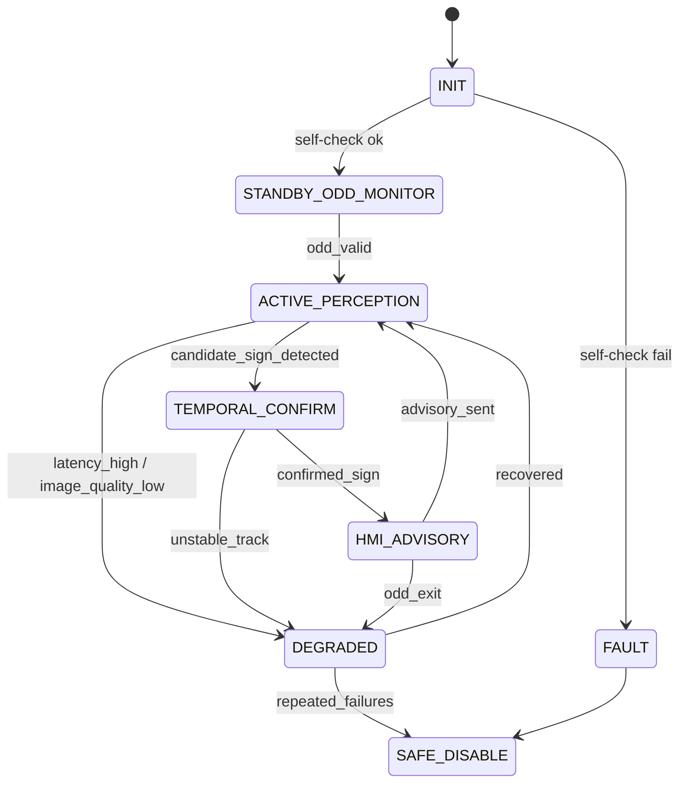

| State | Vai trò |
|---|---|
| `INIT` | Nạp model, kiểm tra camera/config và xác nhận feature đủ điều kiện khởi động |
| `STANDBY_ODD_MONITOR` | Chưa phát advisory; chỉ quan sát ODD và health trước khi vào perception đầy đủ |
| `ACTIVE_PERCEPTION` | Chạy detector trên frame hợp lệ và tạo candidate sign ban đầu |
| `TEMPORAL_CONFIRM` | Tích lũy nhiều frame để xác nhận sign đủ ổn định trước khi ra HMI |
| `HMI_ADVISORY` | Phát event/giữ sign đã confirm theo policy hiển thị và timeout |
| `DEGRADED` | Vẫn hoạt động nhưng đã giảm capability, suppress một số hành vi hoặc giảm độ tin cậy |
| `SAFE_DISABLE` | Ngừng phát feature output tin dùng được và chuyển sang trạng thái an toàn |
| `FAULT` | Gặp lỗi nghiêm trọng cần set fault path, có thể dẫn tới restart hoặc disable |

---

### I.9 Malfunction, diagnostics, phản ứng an toàn

> **Nguồn tại mục:** [ISO 26262-1:2018](https://www.iso.org/standard/68383.html), [ISO 14229-1:2026](https://www.iso.org/standard/87962.html) và [HMI Diagnostics and Vehicle Interface](03.safety_analysis_hazop_fta.md) `[SRC]` — Lấy: fault/error/failure framing, DTC/service concept và diagnostics-lite output. Dùng ở: malfunction table, watchdog, DTC strategy và freeze-frame logging.

#### I.9.1 Phân biệt fault / error / failure / malfunction

| Thuật ngữ | Nghĩa thực dụng |
|---|---|
| `fault` | Nguyên nhân gốc của vấn đề, ví dụ cáp lỏng, nguồn lỗi, bug phần mềm |
| `error` | Trạng thái nội bộ đã sai, ví dụ frame corrupt, timestamp nhảy, tensor NaN |
| `failure` | Dịch vụ không còn đáp ứng kỳ vọng hệ thống, ví dụ không publish đúng hạn hoặc publish sai trạng thái |
| `malfunctioning behavior` | Failure đã đi tới hành vi có thể làm người lái hiểu sai hoặc tin nhầm feature |

**Ví dụ:** Cáp lỏng → fault; frame đen xen kẽ → error; TSR mất output → failure; cluster hiển thị speed limit sai → malfunctioning behavior.

#### I.9.2 Fault tree rút gọn

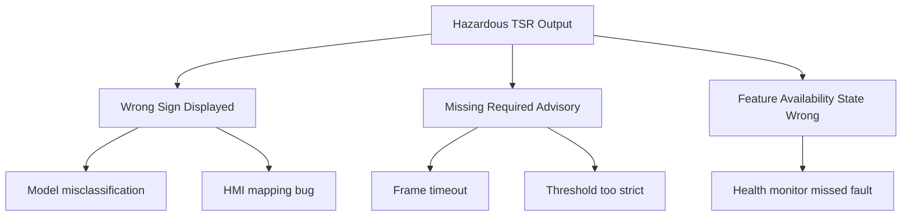

#### I.9.3 Bảng malfunction điển hình

| ID | Scenario | Nguyên nhân | Phát hiện | Phản ứng |
|---|---|---|---|---|
| M1 | Mất camera | Cáp, nguồn hoặc deserializer lỗi | Timeout frame hoặc heartbeat mất | Vào `UNAVAILABLE`, set DTC và dừng tin output cũ |
| M2 | Frame quá tối/cháy sáng | Glare mạnh hoặc exposure lỗi | Exposure/quality metric vượt ngưỡng | Suppress sign mới hoặc vào `DEGRADED` |
| M3 | Blur nặng | Rung, rung mount hoặc ống kính bẩn | Blur score hoặc image quality gate | Giữ advisory cũ trong timeout ngắn, sau đó degrade hoặc disable |
| M4 | Runtime crash/NaN | Bug, corrupt memory, runtime fault | Watchdog hoặc sanity check | Restart task; lặp nhiều lần thì `SAFE_DISABLE` |
| M5 | Inference chậm | Thermal throttle, CPU contention, thiếu tài nguyên | Deadline/latency watchdog | Giảm capability, tăng skip hoặc chuyển degrade |
| M6 | Mapping class → icon sai | Bug integration giữa detector và HMI | SIL/HIL regression hoặc review mapping | Chặn release; không cho lên xe thật |
| M7 | Mất tốc độ xe | CAN timeout hoặc signal invalid | Network monitor hoặc plausibility check | Hạ authority, chỉ giữ advisory cơ bản nếu policy cho phép |
| M8 | Update model lỗi | Package hỏng, signature sai hoặc config lệch version | Update verifier/integrity check | Không activate bản mới và rollback bản cũ |

#### I.9.4 Diagnostics tối thiểu

| Cơ chế | Vai trò |
|---|---|
| Power-on self-test | Kiểm camera, model file, config và dependency tối thiểu trước khi vào ACTIVE |
| Watchdog | Phát hiện deadlock, task treo hoặc loop không còn sống đúng chu kỳ |
| Latency monitor | Bắt pipeline vượt budget trước khi HMI bị stale hoặc missed deadline |
| Plausibility checks | Chặn output vô lý như bbox ngoài ảnh, confidence NaN, timestamp không monotonic |
| Resource monitor | Theo dõi RAM, CPU, storage, nhiệt để quyết định degrade hoặc restart |
| DTC strategy | Biến lỗi runtime thành mã chẩn đoán đủ dùng cho service/after-sales |
| Freeze-frame logging | Lưu đủ context để điều tra lỗi sau khi xe hoặc task đã phục hồi |

---

### I.10 Safety, SOTIF, cybersecurity, OTA (tổng quan)

> **Nguồn tại mục:** [ISO 26262-1:2018](https://www.iso.org/standard/68383.html), [ISO 21448:2022](https://www.iso.org/standard/77490.html), [UNECE R155](https://unece.org/transport/documents/2021/03/standards/un-regulation-no-155-cyber-security-and-cyber-security), [UNECE R156](https://unece.org/transport/documents/2021/03/standards/un-regulation-no-156-software-update-and-software-update) và [ISO 24089:2023](https://www.iso.org/standard/77796.html) — Lấy: FuSa/SOTIF/cybersecurity/software-update governance. Dùng ở: risk framing, secure update, rollback và post-SOP controls.

#### I.10.1 Functional safety và SOTIF

TSR advisory không mặc nhiên ASIL thấp. Phải trả lời: lỗi nào chỉ inconvenience; lỗi nào khiến người lái hiểu sai; lỗi nào ảnh hưởng feature khác qua shared ECU.

**SOTIF** xét ca không có hardware fault: model/ODD chưa đủ → perception vẫn không an toàn trong tình huống dự kiến.

**Ví dụ SOTIF:** Biển quảng cáo phản quang bị nhầm thành speed sign dưới glare — hệ thống "đúng như lập trình" nhưng specification/validation chưa phủ.

#### I.10.2 Cybersecurity và attack surface

- Model blob, config/calibration, firmware ECU, OTA backend, service tool/debug interface.

Production cần: secure boot, signed package, update authorization, rollback, security event logging.

#### I.10.3 OTA ví dụ thực tế

Bản `v1.1` tăng recall biển 30 km/h nhưng tăng false positive biển quảng cáo đỏ. Không có gate release, soak test, rollback → OTA đưa rủi ro mới vào fleet. Perception update không thể "train xong là phát hành".

---

### I.11 Kiến thức nền và thuật ngữ cốt lõi

> **Nguồn tại mục:** [Glossary nhanh](#glossary-nhanh) `[SRC]` và [Sources and Provenance](01.automotive_standards.md#sources-research-provenance-tsr) `[SRC]` — Lấy: thuật ngữ chuẩn nội bộ và provenance của từng nhóm nguồn. Dùng ở: bảng thuật ngữ nền, common mistakes và cách đọc khái niệm trong toàn bộ research.

#### I.11.1 Bốn nhóm kiến thức

| Nhóm | Nội dung |
|---|---|
| Perception | Detection vs classification; FP/FN; small object; glare/blur/occlusion |
| Temporal | Không phát HMI từ 1 frame; tracking vs `hold previous detection` |
| System engineering | ODD, state model, ICD vs debug log, diagnostics vs console print |
| Automotive process | [ISO 26262-1:2018](https://www.iso.org/standard/68383.html) — Lấy: functional safety lifecycle. Dùng ở: safety/release evidence. |
| Automotive process | [ISO 21448:2022](https://www.iso.org/standard/77490.html) — Lấy: SOTIF/ODD concepts. Dùng ở: ODD gate, trigger catalog và residual risk. |
| Automotive process | [AUTOSAR Classic Platform](https://www.autosar.org/standards/classic-platform) — Lấy: ECU/software architecture framing. Dùng ở: vehicle interface và diagnostics boundary. |
| Automotive process | [UNECE R155](https://unece.org/transport/documents/2021/03/standards/un-regulation-no-155-cyber-security-and-cyber-security) — Lấy: cyber security governance. Dùng ở: package/model/config integrity khi release. |
| Automotive process | [UNECE R156](https://unece.org/transport/documents/2021/03/standards/un-regulation-no-156-software-update-and-software-update) — Lấy: software update governance. Dùng ở: update, rollback và post-update sanity flow. |

#### I.11.2 Bảng thuật ngữ

| Thuật ngữ | Ý nghĩa trong TSR |
|---|---|
| `ODD` | Điều kiện team dám tuyên bố feature hoạt động đúng |
| `Degraded` | Feature còn chạy nhưng giảm capability |
| `Unavailable` | Feature không còn nên tin dùng |
| `ICD` | Hợp đồng signal/message/timing/ownership |
| `DTC` | Fault code cho service/triage |
| `Freeze-frame` | Snapshot context tại lỗi |
| `SOTIF trigger condition` | Tình huống hợp lệ nhưng perception dễ nguy hiểm |

#### I.11.3 Lỗi tư duy phổ biến

1. **Chỉ nhìn mAP** — chưa nói latency, false advisory, temporal stability, degrade behavior.
2. **Đồng nhất detector = feature** — mapping HMI sai, sign không áp dụng ego lane, stale sign, watchdog miss.
3. **Bỏ qua HMI/diagnostics** — bug HMI nguy hiểm không kém detector; không DTC → không support pilot/SOP.

**Nguyên tắc dạy người mới:** *Hãy coi TSR là feature hệ thống có trách nhiệm trước người lái, không phải notebook object detection.*

#### Key Takeaways — Phần I

| Điểm chính | Ý nghĩa |
|---|---|
| TSR = 5 lớp xử lý, không chỉ detect/classify | Bỏ lớp 3–5 → false advisory hoặc HMI không tin cậy |
| Item definition phải khóa authority + ODD | "Dùng YOLO" không phải item definition |
| State machine (`DEGRADED`/`UNAVAILABLE`) là contract | Feature phải biết khi nào im lặng |
| SOTIF ≠ DTC | Glare/occlusion có thể unsafe mà không có hardware fault |
| Phần I chỉ đặt nền hệ thống | Các deep-dive contract, KPI và release flow bắt đầu từ Phần II |

#### Common Engineering Mistakes — Phần I

| Lỗi | Hậu quả |
|---|---|
| Release theo mAP + video đẹp | Không có evidence HMI/diagnostics/SOTIF |
| Mở rộng ODD mà không mở rộng validation | Feature fail ở edge case chưa test |
| Bỏ qua HMI mapping bug | Detector đúng nhưng icon sai → malfunctioning behavior |
| Không phân biệt fault/error/failure | RCA và DTC strategy lộn xộn |

---

## Phần II. Thiết Kế Production Pipeline

> Mục tiêu: định nghĩa pipeline production-ready theo góc nhìn tech lead embedded — block, contract, gate, evidence.

---

### II.1 Từ gap baseline tới bài toán hệ thống

> **Nguồn tại mục:** [Baseline TSR Analysis](../3.implementation/01.hybrid_pipeline_architecture.md) `[SRC]`, [1.01. Prototype to Production Narrative](../1.narrative/01.prototype_to_production.md) `[SRC]` và [2.05. System Diagram](01.automotive_standards.md) `[SRC]` — Lấy: gap detector frame-level, block production cần thêm và kiến trúc feature. Dùng ở: sáu gap baseline và stack `Perception/Feature/Vehicle Integration`.

#### II.1.1 Sáu gap và chuỗi logic

Repo hiện tại đã có **detector frame-level**. Vấn đề là detector output đó chưa đủ để trở thành một **TSR feature** ở mức vehicle-level. Từ "có bbox trong frame" tới "xe phát advisory đúng và fail-safe" còn thiếu sáu mắt xích:

| Gap | Vai trò | Nếu thiếu |
|---|---|---|
| Tracking + lifecycle | Biến detection rời rạc thành cùng một sign object qua nhiều frame | HMI nhấp nháy, giữ sign stale, hoặc tin vào one-frame glitch |
| Lane / context / map | Kiểm tra biển có thực sự áp dụng cho xe ego hay không | Detect đúng nhưng áp nhầm biển làn rẽ hoặc biển không liên quan |
| Arbiter + HMI policy | Quyết định sign nào được publish, khi nào được đổi, khi nào phải giữ bảo thủ | Camera-map conflict hoặc class jitter đi thẳng lên cluster/HUD |
| ICD | Chuẩn hóa signal, timestamp, validity, quality, ownership giữa các ECU | HMI, ISA, logger hiểu output khác nhau hoặc tích hợp không ổn định |
| Watchdog + health monitor | Phát hiện timeout, deadline miss, runtime fault, thermal/resource issue | Pipeline lỗi nhưng feature vẫn tiếp tục publish như thể đang khỏe |
| DTC + freeze-frame | Ghi lỗi, lưu evidence và hỗ trợ degraded/unavailable behavior | Pilot fail nhưng không triage được nguyên nhân trên xe thật |

Sáu gap này **không phải checklist rời nhau**. Chúng tạo thành một chuỗi logic: khối sau luôn giả định khối trước đã làm đúng. Nếu tracker không ổn, context sẽ đánh giá trên object sai; nếu context sai, arbiter sẽ publish sign sai; nếu ICD yếu, sign sai còn lan sang ECU khác; nếu watchdog/DTC thiếu, toàn bộ lỗi đó có thể xảy ra mà hệ thống không tự bảo vệ được.

```mermaid
flowchart LR
    A[Baseline detector output] --> B[Tracking + lifecycle]
    B --> C[Lane / context / map]
    C --> D[Arbiter + HMI policy]
    D --> E[ICD signal contract]
    E --> F[Watchdog + health monitor]
    F --> G[DTC + freeze-frame + unavailable]

    classDef baseline fill:#FFF5DD,stroke:#C78600,color:#6B4F00,stroke-width:2px;
    classDef temporal fill:#F4ECFF,stroke:#7C3AED,color:#4C1D95,stroke-width:2px;
    classDef feature fill:#EDF3FF,stroke:#2F66D0,color:#173B7A,stroke-width:2px;
    classDef integration fill:#E8F7EE,stroke:#1E8E5A,color:#14532D,stroke-width:2px;
    classDef support fill:#FCEFF5,stroke:#DB2777,color:#9D174D,stroke-width:2px;
    classDef risk fill:#FDECEC,stroke:#C2410C,color:#7F1D1D,stroke-width:2px;
    class A baseline;
    class B temporal;
    class C,D feature;
    class E integration;
    class F support;
    class G risk;
```

Nói ngắn gọn: **detect đúng trong một frame** mới chỉ là điều kiện cần; để **feature đúng ở mức vehicle-level** phải đi đủ cả sáu mắt xích trên.

#### II.1.2 Production TSR stack — detector không phải feature

Một stack TSR production thường được chia thành nhiều layer chức năng độc lập. Mỗi layer có một trách nhiệm rõ ràng, giúp hệ thống dễ phát triển, kiểm thử và bảo trì. Điều quan trọng là **không có một layer nào tự đưa ra toàn bộ quyết định**, mà mỗi layer chỉ xử lý đúng phạm vi của mình và truyền kết quả cho layer tiếp theo.

| Thành phần | Giải thích | Input | Output | Ví dụ trong TSR |
|------------|------------|-------|--------|-----------------|
| **Perception Detection** | Là tầng nhận thức (Perception Layer) chịu trách nhiệm **phát hiện** các đối tượng có khả năng là biển báo giao thông trong ảnh. Mục tiêu của tầng này là trả lời câu hỏi: **"Trong frame hiện tại có những vùng nào giống biển báo?"**. Tầng này chưa quan tâm biển báo đó có áp dụng cho xe hay không. | Ảnh hoặc video từ camera | Bounding Box, Confidence Score, Candidate Region | YOLO phát hiện hai biển giới hạn tốc độ và một biển cấm vượt trong cùng một frame. |
| **Sign Object Management** | Là tầng quản lý đối tượng biển báo sau khi được phát hiện. Hệ thống gán **ID** cho từng biển, theo dõi chúng qua nhiều frame (tracking), loại bỏ các phát hiện nhiễu và duy trì vòng đời (lifecycle) của từng biển báo. Mục tiêu là trả lời câu hỏi: **"Đây có phải vẫn là cùng một biển báo đã thấy ở frame trước không?"** | Detection Result của nhiều frame liên tiếp | Sign Object ổn định (ID, vị trí, tuổi đời, trạng thái) | Biển tốc độ 50 km/h xuất hiện trong 30 frame liên tiếp sẽ được duy trì với cùng một Object ID thay vì tạo mới ở mỗi frame. |
| **Feature Interpretation** | Là tầng logic nghiệp vụ (Feature Logic), chịu trách nhiệm diễn giải ý nghĩa của các biển báo đã được theo dõi. Layer này kết hợp thêm thông tin về làn đường, bản đồ số, trạng thái xe và các quy tắc giao thông để quyết định **biển nào thực sự có hiệu lực đối với xe ego**. Đây là nơi trả lời câu hỏi: **"Biển báo nào đang áp dụng cho xe, có hiệu lực trong bao lâu và mức độ tin cậy là bao nhiêu?"** | Sign Objects, Lane Information, Map Data, Vehicle State | Active Speed Limit, Advisory Sign, Warning State | Hai biển giới hạn tốc độ nằm cạnh nhau nhưng chỉ biển phía làn xe ego mới được chọn làm giới hạn tốc độ hiện hành. |
| **HMI / ISA Output** | Là tầng tích hợp với các hệ thống trên xe. Kết quả từ Feature Interpretation được chuyển thành thông tin hiển thị trên HMI hoặc tín hiệu điều khiển cho Intelligent Speed Assistance (ISA). Layer này quyết định **thông tin nào sẽ được hiển thị hoặc phát tới ECU khác**, đồng thời tránh hiện tượng nhấp nháy hoặc thay đổi liên tục trên giao diện người lái. | Active TSR Result | Cluster Display, HUD, ISA Signal, Vehicle Network Message | Hiển thị biển giới hạn tốc độ 80 km/h trên Instrument Cluster, đồng thời gửi giới hạn tốc độ mới tới hệ thống ISA. |
| **Diagnostics** | Là tầng giám sát và chẩn đoán hệ thống. Layer này không tham gia nhận dạng biển báo mà theo dõi sức khỏe của toàn bộ pipeline như trạng thái camera, latency, nhiệt độ ECU, lỗi AI, watchdog và Diagnostic Trouble Code (DTC). Mục tiêu là đảm bảo hệ thống luôn hoạt động an toàn và có thể phát hiện, ghi nhận hoặc báo cáo lỗi. | Health Status, Runtime Metrics, Error Events | DTC, Log File, Diagnostic Message, Health Report | Camera mất tín hiệu hoặc AI Inference vượt quá thời gian xử lý sẽ được ghi nhận thành Diagnostic Trouble Code và chuyển TSR sang trạng thái **Degraded** hoặc **Unavailable**. |

#### Quan hệ giữa các layer

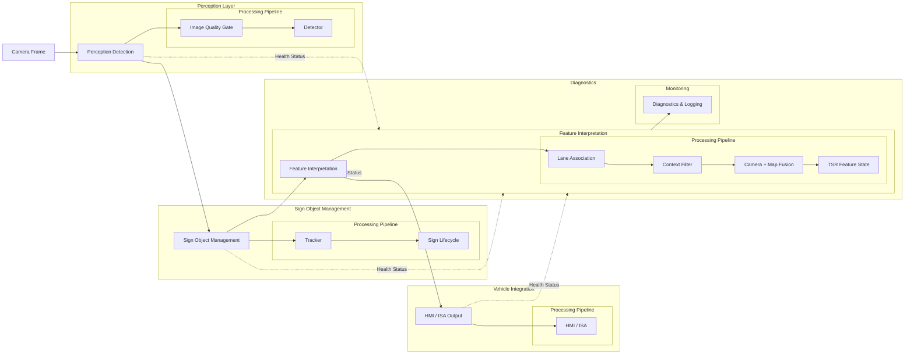

#### II.1.3 Ví dụ detector vs feature output

| Tình huống | Detector output | Feature output đúng |
|---|---|---|
| Biển `50` bên làn rẽ phải | Bbox `Speed limit 50` confidence cao | Không áp dụng nếu ego tiếp tục đi thẳng. |
| Biển `80` bị che một frame do xe tải | Một frame miss | Track vẫn sống trong thời gian ngắn, nhưng không tăng confidence. |
| Map nói `60`, camera thấy `40` biển công trường tạm | Camera-map conflict | Ưu tiên camera nếu sign mới, hợp lệ, gần ego lane và confidence đủ. |
| Camera blur kéo dài | Detection jitter | Feature chuyển `DEGRADED` hoặc `UNAVAILABLE`, không phát advisory mới. |

#### II.1.4 Production implementation pattern vs repo

| Block | Pattern production | Repo hiện tại |
|---|---|---|
| Image quality | Blur/glare/exposure gate, quality reason code | Chưa có quality gate trong `preprocess()`. |
| Detector | YOLO/DETR/ensemble, calibrated confidence, per-class threshold | Có YOLO `.pt`, `--conf`, `--imgsz`, `max_det=20`. |
| Tracker | Track ID, association, hit/miss counter, velocity/lifetime | Chỉ có `--hold`, chưa có track ID. |
| Lifecycle | `CANDIDATE`, `CONFIRMED`, `ACTIVE`, `STALE`, `EXPIRED` | Chưa có lifecycle. |
| Lane association | Projection vào ego lane, lane split/merge handling | Chưa có lane model. |
| Context filter | ODD, road side, sign applicability, temporal validity | Chưa có context layer. |
| Fusion | Vision-map arbitration, conflict reason, source confidence | Chưa có map input. |
| Output | ICD, timestamp, validity, quality, reason code | Chỉ overlay video. |
| Diagnostics | DTC, watchdog, freeze-frame, health counter | Chưa có diagnostics schema. |

#### II.1.5 Cách đọc phần còn lại của Phần II

Sau mục mở bài này, Phần II không lặp lại bảng gap ở cùng độ sâu nữa. Thay vào đó, mỗi cụm section phía sau sẽ giải quyết một đoạn của chuỗi hệ thống:

| Câu hỏi cần trả lời | Section nên đọc tiếp |
|---|---|
| Làm sao biến detection theo frame thành sign object có lifecycle? | `II.5`, đặc biệt `II.5.3` |
| Làm sao quyết định biển nào thực sự áp dụng cho ego vehicle? | `II.13`, `II.14`, `II.15` |
| Làm sao publish ra HMI/ISA mà không nhấp nháy hoặc đổi state tùy tiện? | `II.9`, `II.16` |
| Làm sao định nghĩa KPI, release gate và evidence trước pilot? | `II.10`, `II.18` |
| Làm sao bao phủ malfunction, degraded behavior và safety/SOTIF review? | `II.7`, `II.8`, `II.17`, `II.19` |

Nhìn theo storytelling, `II.1.1` chỉ đặt vấn đề; các section phía sau mới lần lượt "trả nợ" cho từng mắt xích của chuỗi đó.

---

### II.2 Khung chuẩn ràng buộc trực tiếp lên TSR

> **Nguồn tại mục:** [ISO 26262 package overview](https://www.iso.org/publication/PUB200262.html), [ISO 21448:2022](https://www.iso.org/standard/77490.html), [AUTOSAR Classic Platform](https://www.autosar.org/standards/classic-platform), [NHTSA Driver Distraction Guidelines](https://www.nhtsa.gov/document/visual-manual-nhtsa-driver-distraction-guidelines-vehicle-electronic-devices), [UNECE R155](https://unece.org/transport/documents/2021/03/standards/un-regulation-no-155-cyber-security-and-cyber-security) và [UNECE R156](https://unece.org/transport/documents/2021/03/standards/un-regulation-no-156-software-update-and-software-update) — Lấy: safety, SOTIF, software architecture, HMI và update governance. Dùng ở: framework ràng buộc trực tiếp lên TSR.

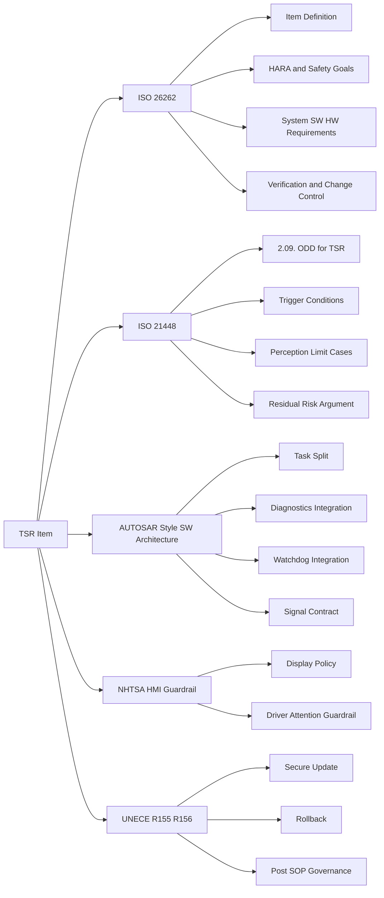

| Câu hỏi | Khung tham chiếu |
|---|---|
| Tài liệu nào buộc viết ODD cho TSR? | [ISO 21448:2022](https://www.iso.org/standard/77490.html) |
| Quản lý hazard, requirement, change impact? | [ISO 26262-1:2018](https://www.iso.org/standard/68383.html) |
| Tách block SW trên ECU? | [AUTOSAR Classic Platform](https://www.autosar.org/standards/classic-platform) |
| TSR có được show mọi thứ lên cluster? | [NHTSA Driver Distraction Guidelines](https://www.nhtsa.gov/document/visual-manual-nhtsa-driver-distraction-guidelines-vehicle-electronic-devices) |

#### II.2.1 ISO 26262 — Functional safety

Buộc: item definition, HARA, safety goals, traceability requirement, change management, verification evidence.

**Ví dụ TSR:** Xe 80 km/h, camera nhầm biển quảng cáo đỏ → `120`. Phải trả lời: HMI sai 2 giây → driver hiểu sai? ISA arbitration chặn ở đâu? Lỗi mapping hay detector? Verification nào cover sign-like object?

```mermaid
flowchart LR
    A[TSR Item Definition] --> B[HARA]
    B --> C[Safety Goals]
    C --> D[Functional Safety Concept]
    D --> E[System and SW Requirements]
    E --> F[Verification and Validation]
```

Nguồn tại claim: [ISO 26262 overview](https://www.iso.org/publication/PUB200262.html) — Lấy: safety lifecycle, item definition, HARA, safety goals và verification evidence. Dùng ở: yêu cầu TSR phải có traceability, change management và câu hỏi HMI/ISA arbitration khi detector báo sai.

#### II.2.2 ISO 21448 — SOTIF cho perception

Áp dụng cho chức năng situational awareness từ complex sensors/algorithms — đúng bản chất TSR camera-based. Phải phân tích functional insufficiency; ODD cụ thể cho TSR; verification nhắm trigger: glare, occlusion, sign-like objects, biển tạm, lane ambiguity, map stale.

**Ví dụ:** Biển `50` ở làn rẽ phải, làn thẳng `80`. Detector đúng class nhưng chưa đủ kết luận — cần ego-lane context, `candidate only`, map corroboration.

```mermaid
flowchart TD
    A[Camera Sees Sign Candidate] --> B{Within TSR ODD?}
    B -- No --> C[Suppress or Degrade]
    B -- Yes --> D{Known Trigger Condition?}
    D -- Yes --> E[Raise Uncertainty or Need Corroboration]
    D -- No --> F[Proceed to Confirmation and Arbitration]
```

Nguồn tại claim: [ISO 21448:2022](https://www.iso.org/standard/77490.html) — Lấy: SOTIF cho functional insufficiency, ODD và trigger condition của perception. Dùng ở: claim TSR camera-based phải xử lý glare, occlusion, sign-like object, biển tạm và lane ambiguity bằng suppress/degrade/corroboration.

#### II.2.3 AUTOSAR — Phân lớp ECU

Classic Platform: `application` / `RTE` / `BSW`. Không bắt buộc AUTOSAR nguyên khối, nhưng ép tách: perception logic, feature state, communication contract, diagnostics, watchdog, HMI adaptation.

**Ví dụ:** Detector + overlay + signal publish + log + watchdog kick trong một process → detector treo → HMI giữ icon cũ, DTC không set, ownership lỗi mơ hồ.

```mermaid
flowchart TD
    A[Application Layer] --> A1[TSR Detector]
    A --> A2[Temporal Confirmation]
    A --> A3[Feature Arbiter]
    B[RTE] --> B1[Signal Exchange]
    C[BSW Services] --> C1[Diagnostics]
    C --> C2[Watchdog]
    C --> C3[Communication]
    C --> C4[Memory and Logging]
```

Nguồn tại claim: [AUTOSAR Classic Platform](https://www.autosar.org/standards/classic-platform/) — Lấy: phân lớp application, RTE và BSW service trên ECU. Dùng ở: yêu cầu tách detector, state, communication contract, diagnostics, watchdog và HMI adaptation thay vì gom vào một process demo.

#### II.2.4 NHTSA — HMI guardrail

Khuyến nghị: lock-out tác vụ phân tâm cao khi lái; visual-manual glance ngắn; malfunction ảnh hưởng an toàn phải trình bày cho lái xe.

**Ví dụ:** Đô thị đông biển, detector đổi `30 → No parking → School zone → none` trong vài frame. Raw output lên cluster → nhấp nháy, driver không biết sign nào confirmed.

Nguồn tại claim: [NHTSA Driver Distraction Guidelines](https://www.nhtsa.gov/document/visual-manual-nhtsa-driver-distraction-guidelines-vehicle-electronic-devices) — Lấy: guardrail về visual-manual distraction, lock-out và cách trình bày malfunction liên quan an toàn. Dùng ở: yêu cầu HMI TSR không publish raw detector output gây nhấp nháy hoặc làm driver hiểu sai trạng thái confirmed.

---

### II.3 Production pipeline end-to-end

> **Nguồn tại mục:** [2.05. System Diagram](01.automotive_standards.md) `[SRC]`, [2.08. State Manager and Sign Lifecycle](03.safety_analysis_hazop_fta.md) `[SRC]`, [HMI Diagnostics and Vehicle Interface](03.safety_analysis_hazop_fta.md) `[SRC]`, [IEEE Std 2020-2024 / P2020](https://standards.ieee.org/ieee/2020/11960/) và [AUTOSAR Classic Platform](https://www.autosar.org/standards/classic-platform) — Lấy: pipeline camera → quality gate → detector → state/context → HMI/diagnostics, image-quality attributes và ECU layering. Dùng ở: sơ đồ end-to-end, quality gate và phân rã block theo trách nhiệm.

> **Sơ đồ chi tiết theo block feature logic** (lifecycle, lane, context tách riêng): §II.1.2. Sơ đồ dưới đây bổ sung góc nhìn **ECU integration** — capture, health monitor, bus publish.

```mermaid
flowchart LR
    A[Front Camera Module] --> B[Capture and Timestamp]
    B --> C[Image Quality and ODD Gate]
    C --> D[TSR Detector]
    D --> E[Tracking and Temporal Confirmation]
    E --> F[Context and Map Fusion]
    F --> G[Feature Arbiter and State Manager]
    G --> H[HMI Output Policy]
    G --> I[Vehicle Signal Publisher]
    G --> J[Freeze Frame and Event Logger]
    C --> K[Health Monitor and Watchdog]
    D --> K
    E --> K
    F --> K
    K --> L[DTC and Service Diagnostics]

    classDef source fill:#EAF7F2,stroke:#14866D,color:#0F4C3F,stroke-width:2px;
    classDef feature fill:#EDF3FF,stroke:#2F66D0,color:#173B7A,stroke-width:2px;
    classDef temporal fill:#F4ECFF,stroke:#7C3AED,color:#4C1D95,stroke-width:2px;
    classDef support fill:#FCEFF5,stroke:#DB2777,color:#9D174D,stroke-width:2px;
    classDef integration fill:#E8F7EE,stroke:#1E8E5A,color:#14532D,stroke-width:2px;
    class A source;
    class B,C,D,F,G feature;
    class E temporal;
    class K support;
    class H,I,J,L integration;
```

#### II.3.1 Phân rã block theo trách nhiệm

| Block | Trách nhiệm | Lý do tồn tại |
|---|---|---|
| `Capture and Timestamp` | Frame, timestamp đồng bộ, timeout/corruption | Không làm việc trên dữ liệu không xác thực |
| `Image Quality and ODD Gate` | Blur/glare/exposure/contamination, ODD validity | Tránh confidence giả từ ảnh kém |
| `TSR Detector` | Detect + classify candidate | Hypothesis ban đầu |
| `Tracking and Temporal Confirmation` | Track ID, persistence, sign lifetime | Giảm false positive frame đơn |
| `Context and Map Fusion` | Ego-lane relevance, map corroboration | Giảm sign đúng nhưng không áp dụng ego |
| `Feature Arbiter and State Manager` | Sign cuối, priority, timeout, availability | Biến perception thành feature |
| `HMI Output Policy` | Icon/chime/suppression | Giảm distraction và sai kỳ vọng |
| `Health Monitor and Watchdog` | Deadline, alive counter, restart, thermal | Không "treo nửa sống nửa chết" |
| `DTC and Service Diagnostics` | DTC, DID, freeze-frame, tester access | Service và fleet triage |

`Image Quality and ODD Gate` là nơi IEEE 2020/P2020 đi vào kiến trúc. Block này không chỉ kiểm tra "có frame hay không", mà phải diễn giải frame theo các thuộc tính ảnh có ảnh hưởng tới machine vision:

| Attribute family | Ví dụ reason trong TSR | Hành vi feature |
|---|---|---|
| Flare / dynamic range | `GLARE`, over-exposure, backlight | Skip inference hoặc chuyển `DEGRADED/UNAVAILABLE` nếu kéo dài |
| Low light / noise | `TOO_DARK`, night noise | Giảm confidence authority, cần validation night slice |
| Resolution / sharpness | `LOW_SHARPNESS`, motion blur, sign too small | Cho infer ở mức degraded hoặc yêu cầu temporal confirmation mạnh hơn |
| Contrast / color | low contrast sign, washed-out color | CLAHE/ISP tuning là mitigation, không thay thế validation |

#### II.3.2 Sơ đồ kiến trúc ECU

Phần II mô tả pipeline theo **luồng xử lý**. Sơ đồ dưới đây bổ sung góc nhìn **phân lớp ECU** (sensor → application → platform/BSP → vehicle bus → offboard) — hữu ích khi review với team HW, SW platform, và integration.

File HTML tương tác không nằm trong phạm vi repo hiện tại. Tài liệu này giữ lại mô tả kiến trúc bằng bảng và Mermaid để không phụ thuộc vào asset ngoài luồng tuyến tính.

| Tính năng sơ đồ | Mô tả |
|---|---|
| Phân lớp | Sensor · Perception/Feature (Application) · Runtime · BSP · Vehicle · OTA/Service |
| Tương tác | Hover/click block → mô tả trách nhiệm; chip lọc luồng Perception / Feature / Health |
| Dark mode | Toggle theme, lưu `localStorage` |
| Map sang AUTOSAR | Application ≈ TSR tasks; Platform ≈ scheduler/watchdog/logger; BSP ≈ camera/NPU driver |

```mermaid
flowchart TB
    subgraph sensor [Sensor Layer]
        CAM[Front Camera HDR]
    end
    subgraph app [ADAS ECU Application]
        CAP[Capture] --> IQ[Quality ODD Gate]
        IQ --> DET[Detector]
        DET --> TRK[Track Confirm]
        TRK --> MAP[Map Context]
        MAP --> ARB[Feature Arbiter]
        ARB --> HMI[HMI Policy]
    end
    subgraph plat [Runtime Platform]
        HM[Health Monitor]
        WDG[Watchdog]
        LOG[Freeze-frame Logger]
    end
    subgraph veh [Vehicle Integration]
        CL[Cluster HUD]
        BUS[CAN Ethernet]
        UDS[UDS DTC]
    end
    CAM --> CAP
    IQ --> HM
    DET --> HM
    ARB --> CL
    ARB --> BUS
    HM --> UDS
    HM --> WDG

    classDef source fill:#EAF7F2,stroke:#14866D,color:#0F4C3F,stroke-width:2px;
    classDef feature fill:#EDF3FF,stroke:#2F66D0,color:#173B7A,stroke-width:2px;
    classDef temporal fill:#F4ECFF,stroke:#7C3AED,color:#4C1D95,stroke-width:2px;
    classDef support fill:#FCEFF5,stroke:#DB2777,color:#9D174D,stroke-width:2px;
    classDef integration fill:#E8F7EE,stroke:#1E8E5A,color:#14532D,stroke-width:2px;
    class CAM source;
    class CAP,IQ,DET,MAP,ARB feature;
    class TRK temporal;
    class HM,WDG,LOG support;
    class HMI,CL,BUS,UDS integration;
```

**Ví dụ đọc sơ đồ:** Khi `Health Monitor` phát hiện deadline miss ở `Detector`, luồng không đi thẳng `HMI Policy` — `Feature Arbiter` chuyển `DEGRADED`, `UDS` có thể set `TSR_SW_DEADLINE_MISS`, cluster nhận `tsr_feature_state` ≠ `ACTIVE`.

---

### II.4 Full step: concept → release

> **Nguồn tại mục:** [ISO 26262-1:2018](https://www.iso.org/standard/68383.html), [ISO 21448:2022](https://www.iso.org/standard/77490.html), [UNECE R156](https://unece.org/transport/documents/2021/03/standards/un-regulation-no-156-software-update-and-software-update) và [2.08. Verification Validation and Release](01.automotive_standards.md) `[SRC]` — Lấy: lifecycle gate, ODD/trigger validation và update/rollback evidence. Dùng ở: bảng concept → release của TSR.

| Bước | Nội dung | Deliverable |
|---|---|---|
| 1 | Khóa item definition | Scope, ODD, authority, output ECU/HMI |
| 2 | System requirements + ICD v1 | Camera, vehicle, map, HMI, timing, diagnostics |
| 3 | State model | INIT → STANDBY → ACTIVE → DEGRADED → UNAVAILABLE |
| 4 | ODD + trigger conditions | Glare, blur, biển rẽ, biển tạm, stale map, sign-like ads |
| 5 | Temporal confirmation policy | `min_confirm_hits`, `max_misses`, `max_track_age_ms` |
| 6 | Context + map fusion | Camera-only, map-assisted, conflict arbitration |
| 7 | HMI policy | No raw output, no flicker, degraded/unavailable states |
| 8 | Watchdog + diagnostics | Alive/deadline/logical supervision, DTC, freeze-frame |
| 9 | Verification gates | Concept → Architecture → Integration → Pilot → SOP |
| 10 | Post-SOP governance | Signed update, rollback, field monitoring |

---

### II.5 Tracking và temporal confirmation

> **Nguồn tại mục:** [SORT](https://arxiv.org/abs/1602.00763), [Deep SORT](https://arxiv.org/abs/1703.07402), [2.08. State Manager and Sign Lifecycle](03.safety_analysis_hazop_fta.md) `[SRC]` và [3.11. Colab Production-Lite Demo Full](../3.implementation/03.edge_deployment_and_benchmarks.md) `[SRC]` — Lấy: tracking-by-detection, association qua miss/occlusion, lifecycle state và hit/miss counters. Dùng ở: tracking policy, sign lifecycle và gap `hold` của repo.

#### II.5.1 Tại sao cần tracking thật

TSR production không phát HMI từ detection frame đơn (trừ policy đặc biệt). Dùng **tracking-by-detection**:

- Detector → bbox/class/confidence;
- Tracker → track ID, motion, age;
- Temporal confirmer → `hit_count`, `miss_count`, class/spatial stability;
- Chỉ track vượt ngưỡng → sign candidate cho feature.

`SORT` — nhẹ, tốc độ cao; `Deep SORT` — association metric giảm identity switch khi occlusion. TSR không cần MOT phức tạp như pedestrian, nhưng cần tránh flicker, double count, mất sign khi miss ngắn.

Nguồn tại mục:

- [SORT](https://arxiv.org/abs/1602.00763) — Lấy: tracking-by-detection nhẹ với Kalman filter và Hungarian matching. Dùng ở: Perception Tracking để tạo `track_id`, track age, `hit_count` và `miss_count`.
- [Deep SORT](https://arxiv.org/abs/1703.07402) — Lấy: appearance embedding để giảm identity switch khi occlusion/miss. Dùng ở: hướng nâng cấp tracking khi nhiều biển gần nhau hoặc detector miss ngắn.

#### II.5.2 Policy tracking đề xuất

| Tham số | Giá trị khởi điểm | Ý nghĩa |
|---|---:|---|
| `min_confirm_hits` | 3 frame | Tránh advisory từ noise đơn |
| `max_misses_before_lost` | 5 frame | Giữ track qua miss ngắn |
| `max_track_age_ms` | 1200 ms | Không giữ sign quá lâu khi scene đổi |
| `class_majority_ratio` | ≥ 0.6 | Giảm class jitter |
| `bbox_iou_assoc` | 0.3–0.5 | Association motion + overlap |
| `reannounce_deadband_ms` | 2000–5000 ms | Tránh lặp HMI dày |

**Ví dụ chuỗi frame — biển `50`:**

| Frame | Detector | Track state | Feature |
|---|---|---|---|
| F1 | Thấy `50`, conf TB | `hit_count=1` | Chưa HMI |
| F2 | Thấy lại `50` | `hit_count=2` | Chưa HMI |
| F3 | Thấy lại, bbox ổn | `hit_count=3`, confirmed | Phát HMI |
| F4 | Miss ngắn | `miss_count=1` | Giữ sign |
| F5 | Thấy lại | Track hồi phục | Tiếp tục giữ |

**Điều cần tránh:** Dùng `hold previous detection` như tracker giả; giữ sign quá lâu sau khi ra khỏi scene; temporal confirmer che health issue (mất frame nhưng giữ sign cũ quá dài).

#### II.5.3 Sign lifecycle và state machine

##### II.5.3.1 Lý Thuyết

Tracking biến detection rời rạc theo frame thành object có identity, history, confidence và lifecycle. Một sign track thường cần các state:

```mermaid
stateDiagram-v2
    [*] --> Candidate
    Candidate --> Confirmed: HitCount >= N
    Candidate --> Rejected: MissCount > M
    Confirmed --> Active: ApplicableToEgo == true
    Confirmed --> Suppressed: ContextInvalid
    Active --> Stale: NoHit But Within TTL
    Stale --> Active: ReDetected And Associated
    Stale --> Expired: TTL Exceeded Or PassedSign
    Suppressed --> Expired: TTL Exceeded
    Rejected --> [*]
    Expired --> [*]
```

Tracking có hai lớp:

| Lớp | Nhiệm Vụ |
|---|---|
| Geometric association | Ghép bbox hiện tại với track cũ bằng IoU, center distance, optical flow hoặc ego-motion. |
| Semantic consistency | Kiểm tra class, sign family, confidence và source consistency qua nhiều frame. |

SORT dùng Kalman filter và Hungarian association cho multi-object tracking. Deep SORT thêm metric appearance. Trong TSR, appearance embedding có thể nhẹ hơn object tracking người/xe vì biển ít biến dạng, nhưng class similarity và occlusion lại quan trọng.

##### II.5.3.2 Vì Sao Quan Trọng Trong Automotive

HMI không được flicker theo từng frame. ISA không được đổi speed limit vì một frame false positive. Tracking giúp:

| Lợi Ích | Ý Nghĩa Automotive |
|---|---|
| Temporal confirmation | Chỉ publish sign sau đủ evidence. |
| Stale control | Giữ sign hợp lý khi miss ngắn, clear khi xe đã qua biển. |
| Track provenance | RCA biết sign đến từ frame nào, source nào, confidence nào. |
| Latency management | Cho phép skip inference có kiểm soát hơn so với hold box thô. |

##### II.5.3.3 Ví Dụ TSR Thực Tế

| Tình Huống | Không Tracking | Có Lifecycle |
|---|---|---|
| Biển `80` bị che 2 frame | HMI mất rồi hiện lại | Track `ACTIVE` chuyển `STALE`, chưa clear ngay. |
| Một frame nhầm `60` thành `80` | HMI đổi số trong 33 ms | Semantic consistency reject class flip nếu chưa đủ hit. |
| Xe đã đi qua biển | Box có thể được hold vài frame | Track expired theo ego-motion hoặc sign passed line. |
| Hai biển cùng cột | NMS hoặc hold lẫn box | Track tách theo center, class và lifecycle. |

##### II.5.3.4 Production Implementation Pattern

| Thành Phần | Pattern |
|---|---|
| Track ID | Monotonic ID hoặc rolling ID với timestamp create/update. |
| Association | IoU + Mahalanobis distance + class-family gate. |
| State counters | `hit_count`, `miss_count`, `age_frames`, `confirmed_age_ms`. |
| Confidence update | EMA hoặc Bayesian update theo detection confidence và quality. |
| Expiry | TTL theo time, distance traveled, lane pass event hoặc map segment change. |
| Output | Publish chỉ `CONFIRMED` hoặc `ACTIVE`, không publish `CANDIDATE`. |

```mermaid
flowchart TD
    A[Detections] --> B[Prediction From Existing Tracks]
    B --> C[Association Matrix]
    C --> D[Hungarian Or Greedy Match]
    D --> E[Update Matched Tracks]
    D --> F[Create New Candidates]
    D --> G[Age Unmatched Tracks]
    E --> H[Lifecycle State Machine]
    F --> H
    G --> H
    H --> I[Feature Output]
```

##### II.5.3.5 Trade-Offs

| Quyết Định | Ưu Điểm | Rủi Ro |
|---|---|---|
| Confirm sau 3 frame | Giảm false positive | Tăng delay ở tốc độ cao. |
| TTL dài | Giảm flicker khi occlusion | Giữ sign cũ sau khi rẽ hoặc qua giao lộ. |
| Class consistency cứng | Giảm class jitter | Có thể bỏ qua biển thật khi detector sửa lỗi class muộn. |
| Dùng Deep appearance | Tăng association khi camera rung | Tốn compute, khó justify cho embedded TSR nhỏ. |

##### II.5.3.6 Gap Repo Hiện Tại

Repo dùng `hold_left` để giữ detection cũ khi frame mới rỗng. Đây là behavior hữu ích cho demo video, nhưng production còn thiếu:

| Thiếu | Hậu Quả |
|---|---|
| Track ID | Không biết detection nào cùng một biển qua thời gian. |
| Hit/miss counters | Không phân biệt sign mới, confirmed, stale, expired. |
| Ego-motion expiry | Không clear sign khi xe đã đi qua. |
| JSONL/event log | Không phân tích RCA theo track. |
| Source consistency | YOLO và heuristic có thể merge mà không ghi source provenance. |

##### Key Takeaways — II.5.3

| Điểm Chính | Ý Nghĩa |
|---|---|
| Tracking là contract giữa detector và feature | Nó quyết định sign nào đủ ổn định để publish. |
| Lifecycle quan trọng ngang thuật toán association | Track không có state machine vẫn khó dùng cho HMI/ISA. |
| Stale là trạng thái hợp lệ nhưng nguy hiểm | Cần reason code và timeout rõ. |

##### Common Engineering Mistakes — II.5.3

| Lỗi | Hậu Quả |
|---|---|
| Giữ bbox cũ và gọi là tracking | Không có identity, không có confidence evolution, không có expiry đúng. |
| Confirm bằng frame count cố định | Không tính tốc độ xe, FPS, blur hoặc route topology. |
| Clear sign ngay khi miss một frame | HMI flicker và ISA mất ổn định. |

---

### II.6 Từ context filtering tới fusion decision

> **Nguồn tại mục:** [ISO 21448:2022](https://www.iso.org/standard/77490.html), [MapFusion](https://arxiv.org/abs/2103.05929), [2.09. ODD for TSR](01.automotive_standards.md) `[SRC]` và [HMI Diagnostics and Vehicle Interface](03.safety_analysis_hazop_fta.md) `[SRC]` — Lấy: ODD/context gate, camera-map fusion concept và publish policy. Dùng ở: ba câu hỏi lane/context/fusion trước khi publish sign.

> **Mục đích section này:** nối mạch storytelling từ tracking (§II.5) sang ba deep-dive tách riêng ở §II.13, §II.14, §II.15. Phần này chỉ giữ handoff logic cấp feature; không lặp lại theory lane/context/fusion ở cùng độ sâu.

#### II.6.1 Ba câu hỏi phải trả lời trước khi publish sign

| Câu hỏi | Block chính | Deep-dive canonical |
|---|---|---|
| Biển này có thuộc ego lane hay không? | Lane association | `II.13` |
| Biển này có nên được tin trong bối cảnh hiện tại hay không? | Context filtering | `II.14` |
| Khi camera và map không đồng ý, feature sẽ hành xử ra sao? | Camera + map fusion | `II.15` |

Nếu thiếu một trong ba câu hỏi này, detector có thể đúng ở mức ảnh nhưng feature vẫn sai ở mức vehicle-level.

#### II.6.2 Ba tầng phase-1

1. **No-map safe default**: map unavailable thì chỉ camera-only advisory.
2. **Map-assisted plausibility**: map tốt thì dùng để kiểm tra sign camera có hợp lý theo vị trí/road class hay không.
3. **Conflict arbitration**: camera và map mâu thuẫn thì vào policy rõ ràng, không tự chọn nguồn thắng tuyệt đối.

#### II.6.3 Policy cấp feature trước khi đi vào deep-dive

| Tình huống | Quyết định cấp feature |
|---|---|
| Camera mạnh, map stale/không có | Ưu tiên camera, gắn `map_unavailable` |
| Camera yếu, map mạnh, không conflict lớn | Giữ map-assisted, chưa phát sign mới nếu camera chưa confirm |
| Camera vs map conflict ở legal speed | Suppress authority cao hơn; advisory giữ bảo thủ |
| Biển tạm detect, map không có | Cho phép camera override nếu temporal confirmation mạnh |

**Ví dụ conflict:** Ra khỏi cao tốc — map báo `100`, camera confirm `60` ở lối ra 4 frame. Advisory only: ưu tiên camera HMI + cờ `map_conflict`. Chi tiết vì sao conflict được xử lý như vậy nằm ở `II.13–II.15`.

Nguồn tại mục:

- [Intelligent Speed Assistance](https://en.wikipedia.org/wiki/Intelligent_speed_assistance) — Lấy: bối cảnh ISA và vai trò camera/map trong cảnh báo tốc độ. Dùng ở: HMI/ISA consumer và policy camera-map conflict.
- [MapFusion](https://arxiv.org/abs/2103.05929) — Lấy: hướng fusion camera-map để xử lý map stale hoặc sensor conflict. Dùng ở: feature arbitration và source provenance cho speed-limit estimate.
- [Mapillary TSD](https://arxiv.org/abs/1909.04422) — Lấy: traffic sign detection trong ảnh street-level đa dạng. Dùng ở: benchmark/dataset reasoning cho domain shift và ODD coverage.

---

### II.7 ICD production

> **Nguồn tại mục:** [AUTOSAR Classic Platform](https://www.autosar.org/standards/classic-platform), [ISO 14229-1:2026](https://www.iso.org/standard/87962.html) và [HMI Diagnostics and Vehicle Interface](03.safety_analysis_hazop_fta.md) `[SRC]` — Lấy: interface contract, diagnostics/service fields và vehicle signal boundary. Dùng ở: ICD input/output/timing/ownership và message contract đề xuất.

#### II.7.1 ICD phải chứa gì

| Nhóm | Nội dung |
|---|---|
| Input camera | Frame timing, timestamp domain, status, corruption flags |
| Vehicle signals | Ego speed, yaw rate, gear, ignition, ambient light, wiper |
| Map input | Source, freshness, confidence, road segment ID, speed zone validity |
| Output HMI | Sign class, displayed value, confidence state, availability, chime |
| Output ECU khác | Validity bit, age, quality, degraded reason, sequence counter |
| Diagnostics | DTC IDs, DID IDs, freeze-frame, tester session |
| Timing | Period, deadline, timeout, startup latency, stale timeout |
| Ownership | Producer/consumer, calibration owner, release owner |

#### II.7.2 Message contract đề xuất

| Signal | Type | Chu kỳ | Ghi chú |
|---|---|---:|---|
| `tsr_feature_state` | enum | 100 ms | INIT/STANDBY/ACTIVE/DEGRADED/UNAVAILABLE/FAULT |
| `tsr_primary_sign_type` | enum | 100 ms | Class HMI-ready, không phải raw model class |
| `tsr_speed_limit_value` | uint8 | 100 ms | Chỉ hợp lệ với speed sign |
| `tsr_output_valid` | bool | 100 ms | Validity cuối của feature |
| `tsr_quality_level` | enum | 100 ms | GOOD/LIMITED/POOR |
| `tsr_degraded_reason` | bitfield | 100 ms | blur, glare, timeout, thermal, map_conflict... |
| `tsr_diag_snapshot_id` | uint16 | event | Liên kết freeze-frame |

**Nguyên tắc:** Raw detector class không đi thẳng HMI; output là feature-semantic signal; Quality và Availability quan trọng gần bằng recognized sign.

---

### II.8 Diagnostics, DTC, watchdog, serviceability

> **Nguồn tại mục:** [ISO 14229-1:2026](https://www.iso.org/standard/87962.html), [ISO 26262-1:2018](https://www.iso.org/standard/68383.html) và [HMI Diagnostics and Vehicle Interface](03.safety_analysis_hazop_fta.md) `[SRC]` — Lấy: diagnostics service, DTC/freeze-frame concept và health monitor/degraded behavior. Dùng ở: watchdog ba tầng, DTC strategy và serviceability.

#### II.8.1 Watchdog ba tầng

1. **Alive supervision** — Heartbeat đúng chu kỳ;
2. **Deadline supervision** — Capture/inference/publish không vượt budget;
3. **Logical supervision** — Timestamp monotonic, output age hợp lệ, confidence không NaN.

#### II.8.2 DTC strategy

| DTC ID | Mô tả | Điều kiện set | Phản ứng |
|---|---|---|---|
| `TSR_CAM_NO_FRAME` | Mất luồng camera đầu vào | Timeout frame hoặc capture không tiến | Chuyển `UNAVAILABLE`, set DTC, lưu freeze-frame |
| `TSR_IMG_QUALITY_LOW` | Chất lượng ảnh kéo dài dưới ngưỡng | Blur/glare/exposure xấu liên tục | Vào `DEGRADED`, suppress sign mới nếu cần |
| `TSR_SW_DEADLINE_MISS` | Pipeline không còn giữ deadline | p95 hoặc số lần miss liên tiếp vượt ngưỡng | Degrade, tăng skip hoặc restart task |
| `TSR_SW_WATCHDOG_RESET` | Task bị reset bởi watchdog | Kick fail hoặc alive supervision fail | Ghi event, tăng counter restart, theo dõi tái diễn |
| `TSR_MAP_CONFLICT_PERSISTENT` | Mâu thuẫn camera-map kéo dài | Arbitration fail nhiều lần liên tiếp | Hạ authority, giữ policy bảo thủ và log sự kiện |
| `TSR_HMI_PUBLISH_FAIL` | Không publish được ra cluster/HUD | Transport timeout hoặc consumer không nhận | Giữ internal state, set diag và tránh phát HMI sai |
| `TSR_MODEL_INTEGRITY_FAIL` | Model hoặc config không còn đáng tin | Checksum/signature/version compatibility fail | Không cho feature vào `ACTIVE` |

**Ví dụ chuỗi lỗi — camera bẩn sau mưa phùn:**
1. Quality Gate thấy blur kéo dài → `DEGRADED`;
2. Quá ngưỡng → set `TSR_IMG_QUALITY_LOW`;
3. HMI dừng sign mới, giữ availability theo OEM policy.

#### II.8.3 UDS và freeze-frame

`UDS` ([ISO 14229-1:2026](https://www.iso.org/standard/87962.html)) — đọc DTC, DID, reset, routine control, security access. TSR phải expose health state cho service tool; freeze-frame đủ tái hiện lỗi perception.

```mermaid
flowchart LR
    A[Fault or Anomaly] --> B[Health Monitor]
    B --> C{Within Recovery Budget?}
    C -- Yes --> D[Restart or Degrade]
    C -- No --> E[Set DTC and Go Unavailable]
    D --> F[Log Freeze Frame]
    E --> F

    classDef risk fill:#FDECEC,stroke:#C2410C,color:#7F1D1D,stroke-width:2px;
    classDef feature fill:#EDF3FF,stroke:#2F66D0,color:#173B7A,stroke-width:2px;
    classDef decision fill:#FFF1E0,stroke:#D97706,color:#7C2D12,stroke-width:2px;
    classDef integration fill:#E8F7EE,stroke:#1E8E5A,color:#14532D,stroke-width:2px;
    class A,E risk;
    class B,D feature;
    class C decision;
    class F integration;
```

| Trường freeze-frame | Mục đích |
|---|---|
| timestamp | Đồng bộ sự kiện giữa TSR, camera, HMI và các ECU liên quan |
| vehicle speed | Cho biết xe đang ở bối cảnh vận hành nào khi lỗi xảy ra |
| feature state | Xác định lỗi phát sinh ở `INIT`, `ACTIVE`, `DEGRADED` hay đường publish |
| image quality metrics | Phân biệt lỗi perception do blur, glare hay exposure |
| inference latency | Kiểm tra có phải thermal/deadline miss là nguyên nhân gần nhất không |
| CPU/RAM/temp | Triage nhanh xem lỗi nghiêng về tài nguyên hay logic |
| map state | Phân biệt conflict do map stale hay camera side |
| last confirmed sign | Biết HMI đã từng hiển thị gì ngay trước khi fault xuất hiện |

Nguồn tại mục:

- [ISO 14229-1:2026](https://www.iso.org/standard/87962.html) — Lấy: diagnostic services, DTC và session behavior. Dùng ở: diagnostics layer, freeze-frame data và service tool interface của TSR.
- [UDS overview](https://en.wikipedia.org/wiki/Unified_Diagnostic_Services) — Lấy: tóm tắt khái niệm UDS để đọc nhanh. Dùng ở: phần giải thích DTC/DID/routine control cho người đọc chưa có bản chuẩn.

---

### II.9 HMI policy production

> **Nguồn tại mục:** [NHTSA Driver Distraction Guidelines](https://www.nhtsa.gov/document/visual-manual-nhtsa-driver-distraction-guidelines-vehicle-electronic-devices), [Delegated Regulation (EU) 2021/1958](https://eur-lex.europa.eu/eli/reg_del/2021/1958/oj) và [HMI Diagnostics and Vehicle Interface](03.safety_analysis_hazop_fta.md) `[SRC]` — Lấy: driver-facing guardrail, ISA warning context và warning priority. Dùng ở: HMI suppression, no-flicker policy và degraded/unavailable display behavior.

#### II.9.1 Nguyên tắc

- Chỉ hiển thị sau temporal confirmation + arbitration;
- Không nhấp nháy theo frame;
- Không hiển thị sign confidence biên hoặc conflict chưa resolve;
- Policy cho `DEGRADED` và `UNAVAILABLE`.

#### II.9.2 Policy hiển thị

| Trạng thái | HMI policy |
|---|---|
| Sign mới confirm | Hiển thị icon/giá trị mới; chime tối đa một lần nếu OEM policy cho phép |
| Same sign tiếp diễn | Giữ icon ổn định; không lặp chime và không tạo visual event mới |
| Conflict chưa resolve | Chưa đổi HMI ngay; hoặc suppress update, hoặc giữ sign cũ trong timeout ngắn |
| `DEGRADED` | Giảm độ chủ động của HMI; tránh phát sự kiện sign mới quá mạnh khi độ tin cậy thấp |
| `UNAVAILABLE` | Bỏ sign advisory và chỉ hiển thị trạng thái feature không dùng được nếu OEM yêu cầu |

**Ví dụ timeline:**
- T0: HMI hiển thị `80`;
- T1: Detector thấy `50`, mới 1 frame → **không đổi HMI**;
- T2: Quality giảm glare → **không nhấp nháy 80/50**;
- T3: Map nói zone `80`, conflict → **giữ state bảo thủ**.

```mermaid
flowchart TD
    A[Confirmed Sign] --> B{Quality and Context Good?}
    B -- No --> C[Suppress or Hold Conservative State]
    B -- Yes --> D{Conflict with Existing HMI State?}
    D -- Yes --> E[Arbitrate or Delay Update]
    D -- No --> F[Display Sign Event]

    classDef temporal fill:#F4ECFF,stroke:#7C3AED,color:#4C1D95,stroke-width:2px;
    classDef decision fill:#FFF1E0,stroke:#D97706,color:#7C2D12,stroke-width:2px;
    classDef risk fill:#FDECEC,stroke:#C2410C,color:#7F1D1D,stroke-width:2px;
    classDef feature fill:#EDF3FF,stroke:#2F66D0,color:#173B7A,stroke-width:2px;
    classDef integration fill:#E8F7EE,stroke:#1E8E5A,color:#14532D,stroke-width:2px;
    class A temporal;
    class B,D decision;
    class C risk;
    class E feature;
    class F integration;
```

#### II.9.3 Tiêu chí nội bộ

- Single visual event ngắn, không text dài;
- No-debug-on-driver-surface;
- Malfunction ảnh hưởng safety → đường ra HMI hoặc service indicator;
- HMI policy thuộc system/HMI team, không để perception team tự quyết.

---

### II.10 Verification, release gates, KPI

> **Nguồn tại mục:** [ISO 26262-1:2018](https://www.iso.org/standard/68383.html), [ISO 21448:2022](https://www.iso.org/standard/77490.html), [Automotive SPICE / VDA QMC](https://vda-qmc.de/en/automotive-spice/) và [Baseline TSR Analysis](../3.implementation/01.hybrid_pipeline_architecture.md) `[SRC]` — Lấy: verification lifecycle, scenario validation, process evidence và KPI/release gates. Dùng ở: V-model, test gates, KPI production và embedded release checklist.

> **KPI gates, release flow và failure RCA chi tiết:** [Baseline TSR Analysis](../3.implementation/01.hybrid_pipeline_architecture.md) — Lấy: evidence implementation cho KPI gates, release flow và failure RCA; xem §10–§14. Dùng ở: phần release/checklist của production reference, không lặp bảng KPI gate §10.1 hoặc release flow §11.

#### II.10.1 V-model

```mermaid
flowchart TD
    A[Item Definition and ODD] --> B[System Requirements and ICD]
    B --> C[Architecture and Safety/SOTIF Concept]
    C --> D[SW/HW Implementation]
    D --> E[SIL Replay and Unit Tests]
    E --> F[Bench and HIL]
    F --> G[Vehicle Shadow Mode]
    G --> H[Pilot Release]
    H --> I[Field Monitoring and OTA Governance]

    classDef baseline fill:#FFF5DD,stroke:#C78600,color:#6B4F00,stroke-width:2px;
    classDef feature fill:#EDF3FF,stroke:#2F66D0,color:#173B7A,stroke-width:2px;
    classDef support fill:#FCEFF5,stroke:#DB2777,color:#9D174D,stroke-width:2px;
    classDef integration fill:#E8F7EE,stroke:#1E8E5A,color:#14532D,stroke-width:2px;
    class A baseline;
    class B,C feature;
    class D,E,F,G support;
    class H,I integration;
```

#### II.10.2 Test gates

| Gate | Điều kiện tối thiểu |
|---|---|
| Concept freeze | Đã khóa item definition, ODD, misuse assumptions và hazard list đủ dùng để thiết kế tiếp |
| Architecture freeze | Đã chốt module split, ICD v1, watchdog concept và chiến lược DTC ở mức kiến trúc |
| Integration entry | Có timing budget, startup/shutdown behavior và signal contract để nối sang ECU/HMI thật |
| Pilot entry | Đã pass SIL/HIL chính, HMI mapping đúng, restart path và freeze-frame path có evidence |
| SOP entry | Có vòng triage hiện trường, rollback OTA và release evidence đủ để chịu trách nhiệm sau phát hành |

#### II.10.3 KPI production

| Nhóm | Metric |
|---|---|
| Detection | Recall/precision theo class, điều kiện sáng, road class và độ khó biển nhỏ |
| Advisory | False advisory rate và tần suất sign confirmed sai ngữ cảnh |
| Runtime | P50/P95/P99 latency, FPS hữu dụng và RAM peak trên target workload |
| Availability | Duty cycle của `ACTIVE`/`DEGRADED`/`UNAVAILABLE`, kèm restart count |
| Diagnostics | Tần suất DTC, độ phủ freeze-frame và khả năng tái hiện lỗi sau test |
| Integration | Tỷ lệ conflict camera-map, correctness của HMI/signal trong HIL hoặc bench integration |
| Safety/SOTIF | False advisory với lớp biển pháp lý mạnh và độ chính xác khi ra/vào ODD |

#### II.10.4 Release checklist embedded

- ICD frozen; DTC list thống nhất;
- Watchdog/restart policy có bằng chứng test;
- Brownout/over-temperature đã kiểm tra;
- Benchmark target hardware có;
- Update/rollback dry-run;
- Field logging đủ điều tra issue sau pilot.

**Chưa được release nếu:** Model đẹp trên laptop nhưng chưa target HW benchmark; cluster icon chưa integration test; mất camera mà HMI không báo unavailable; chưa rollback khi update model fail.

---

### II.11 OTA, cybersecurity, post-SOP

> **Nguồn tại mục:** [UNECE R155](https://unece.org/transport/documents/2021/03/standards/un-regulation-no-155-cyber-security-and-cyber-security), [UNECE R156](https://unece.org/transport/documents/2021/03/standards/un-regulation-no-156-software-update-and-software-update), [ISO/SAE 21434:2021](https://www.iso.org/standard/70918.html) và [ISO 24089:2023](https://www.iso.org/standard/77796.html) — Lấy: cybersecurity management, software update governance và update engineering. Dùng ở: signed package, compatibility matrix, rollback và post-update monitoring.

`UNECE R155/R156` tác động trực tiếp: model blob, calibration, feature config, update eligibility, rollback, evidence package cho behavior change.

Production pipeline cần:
- Signed package (SW/model/config);
- Version compatibility matrix;
- Rollback strategy;
- Post-update sanity test;
- Field monitoring regression theo class/ODD slice.

Nguồn tại mục:

- [UNECE R155](https://unece.org/transport/documents/2021/03/standards/un-regulation-no-155-cyber-security-and-cyber-security) — Lấy: yêu cầu quản lý cyber security cho vehicle type approval. Dùng ở: release checklist cho model/config/package integrity.
- [UNECE R156](https://unece.org/transport/documents/2021/03/standards/un-regulation-no-156-software-update-and-software-update) — Lấy: yêu cầu quản lý software update và update campaign. Dùng ở: OTA/update, rollback và post-update sanity flow.
- [ISO/SAE 21434:2021](https://www.iso.org/standard/70918.html) — Lấy: engineering cyber security cho road vehicle. Dùng ở: security work products cho TSR ECU/model package.
- [ISO 24089:2023](https://www.iso.org/standard/77796.html) — Lấy: software update engineering. Dùng ở: version compatibility matrix, rollback strategy và field monitoring.

---

### II.12 Work products trước pilot (checklist)

> **Nguồn tại mục:** [ISO 26262-1:2018](https://www.iso.org/standard/68383.html), [ISO 21448:2022](https://www.iso.org/standard/77490.html), [UNECE R156](https://unece.org/transport/documents/2021/03/standards/un-regulation-no-156-software-update-and-software-update) và [2.08. Verification Validation and Release](01.automotive_standards.md) `[SRC]` — Lấy: evidence package, validation work products và update/rollback concept. Dùng ở: checklist trước pilot.

1. Item Definition TSR
2. ODD specification và state model
3. Functional safety assessment (TSR + shared-platform dependencies)
4. SOTIF trigger-condition catalogue
5. System architecture và module responsibility matrix
6. ICD input/output/diagnostics/timing
7. HMI policy document
8. DTC/DID/freeze-frame specification
9. Watchdog and recovery concept
10. Replay/bench/HIL/vehicle validation plan
11. Update and rollback concept
12. Release readiness checklist

---

### II.13 Lane association

> **Nguồn tại mục:** [Requirements Engineering for Automotive Perception Systems](https://arxiv.org/abs/2302.12155), [2.09. ODD for TSR](01.automotive_standards.md) `[SRC]` và [2.05. System Diagram](01.automotive_standards.md) `[SRC]` — Lấy: perception requirements theo context/operating condition và lane/context block trong TSR. Dùng ở: ego-lane applicability, topology pending và camera-only stub boundary.

#### II.13.1 Lý Thuyết

Lane association trả lời câu hỏi: **Biển phát hiện được có áp dụng cho ego lane không?** Đây là bài toán hình học và ngữ cảnh, không phải chỉ phân loại ảnh. Cần kết hợp bbox sign, camera calibration, lane model, ego trajectory và road topology.

```mermaid
flowchart LR
    A[Detected Sign Bbox] --> B[Estimate Bearing And Height]
    C[Lane Model] --> D[Ego Lane Corridor]
    E[Navigation Maneuver] --> D
    B --> F[Applicability Test]
    D --> F
    F --> G{Applies To Ego?}
    G -->|Yes| H[Candidate For Feature]
    G -->|No| I[Suppress Or Keep As Non Ego Sign]
```

#### II.13.2 Vì Sao Quan Trọng Trong Automotive

Một detector có thể đúng 100% mà feature vẫn sai nếu áp dụng biển của làn khác. Trong đô thị, biển speed hoặc cấm rẽ có thể áp dụng cho nhánh đường, bus lane, exit ramp hoặc làn rẽ. Lane association là ranh giới giữa perception output và driving-relevant interpretation.

#### II.13.3 Ví Dụ TSR Thực Tế

| Tình Huống | Nếu Không Lane Association | Hành Vi Production |
|---|---|---|
| Biển `40` trên ramp thoát cao tốc, ego đi thẳng | HMI/ISA giảm về 40 | Suppress hoặc mark `NON_EGO_LANE`. |
| Biển cấm rẽ phải, ego ở làn đi thẳng | Advisory cấm rẽ không cần thiết | Chỉ publish nếu navigation hoặc turn indicator liên quan. |
| Biển bus lane bên phải | Nhận là speed/mandatory sign | Context filter loại nếu không thuộc ego drivable corridor. |
| Đường chia nhánh ngay trước giao lộ | Camera thấy biển bên nhánh trái | Delay publish tới khi lane/topology rõ hơn hoặc mark low applicability. |

#### II.13.4 Production Implementation Pattern

| Pattern | Cách Làm |
|---|---|
| Image-space heuristic | Sign bên trái/phải quá xa ego corridor bị suppress với confidence thấp. |
| Camera calibration | Chuyển bearing của sign sang ground-relative region nếu có chiều cao/geometry assumption. |
| Lane model integration | Dùng lane boundaries và ego path để tạo corridor áp dụng. |
| Map topology | Dùng lane-level map hoặc road segment để biết sign thuộc segment nào. |
| Delayed arbitration | Với split/merge, giữ sign candidate tới khi ego path rõ. |

```mermaid
flowchart TD
    A[Sign Track] --> B{Inside Ego Corridor?}
    B -->|Yes| C[Applicable Candidate]
    B -->|No| D{Inside Adjacent Lane?}
    D -->|Yes| E[Suppress With Reason AdjacentLane]
    D -->|No| F{Near Split Or Ramp?}
    F -->|Yes| G[Hold Pending Topology]
    F -->|No| H[Reject Context]
```

#### II.13.5 Trade-Offs

| Quyết Định | Ưu Điểm | Rủi Ro |
|---|---|---|
| Heuristic theo vị trí ảnh | Dễ triển khai camera-only | Sai ở đường cong, dốc, camera yaw lệch. |
| Lane-level map | Applicability mạnh hơn | Phụ thuộc localization và map freshness. |
| Suppress aggressive | Giảm false advisory | Tăng miss khi biển thật nằm lệch bên đường. |
| Hold pending ở split | Tránh publish nhầm | Tăng delay, HMI có thể thiếu thông tin sớm. |

#### II.13.6 Gap Repo Hiện Tại

Repo không có lane model, calibration, ego trajectory hoặc navigation route. Vì vậy, mọi detection đều được overlay như nhau. Đây là đúng cho demo, nhưng nếu coi overlay là feature output thì sẽ tạo false advisory trong case biển không áp dụng cho ego lane.

#### II.13.7 Ranh giới camera-only và contract với lane model

`II.13.4` đã mô tả pattern production. Phần này chỉ chốt **boundary**: trong phase camera-only, repo có thể dùng heuristic ảnh để xấp xỉ applicability, nhưng đó không phải lane association production.

| Case cần phân biệt | Lane model signal tối thiểu | Nếu chưa có lane model thì phải làm gì |
|---|---|---|
| Ego lane speed sign | Ego corridor ổn định | Có thể publish, nhưng phải giữ `applicability_confidence` rõ |
| Adjacent lane sign | Corridor bên cạnh hoặc non-drivable mask | Suppress với reason code, không overlay như sign ego |
| Exit ramp speed drop | Ramp geometry + route intent | Nếu chưa biết ego intent thì `HOLD_PENDING_TOPOLOGY` |
| Lane split trước giao lộ | Uncertain ego path | Trì hoãn publish thay vì chọn sớm |

**Gap repo:** `tsr_demo.py` chưa có lane model input, nên mọi detection đang được overlay đồng nhất. Điều hợp lý nhất ở phase hiện tại là giữ camera-only heuristic như một stub và log rõ `lane_applicability` / `ego_corridor_state` cho các bước sau.

#### Key Takeaways — II.13

| Điểm Chính | Ý Nghĩa |
|---|---|
| Lane association là feature logic | Không thể giao toàn bộ cho object detector. |
| Camera-only vẫn có thể làm phase-1 heuristic | Nhưng phải ghi rõ limitation và reason code. |
| Split/merge là case khó | Cần state pending hoặc map/lane fusion. |
| Contract tối thiểu với lane model phải rõ | Ego/adjacent/exit cần reason code và pending state |

#### Common Engineering Mistakes — II.13

| Lỗi | Hậu Quả |
|---|---|
| Dùng vị trí bbox x trái/phải cố định | Sai ở cua, đổi làn, ramp và camera misalignment. |
| Suppress biển ngoài ego corridor mà không log reason | RCA không biết false negative do detector hay context filter. |
| Bỏ qua navigation intent hoặc topology pending | Cấm rẽ hoặc speed theo nhánh có thể liên quan nếu xe sắp rẽ. |

---

### II.14 Context filtering

> **Nguồn tại mục:** [ISO 21448:2022](https://www.iso.org/standard/77490.html), [2.09. ODD for TSR](01.automotive_standards.md) `[SRC]` và [2.10. SOTIF for TSR](01.automotive_standards.md) `[SRC]` — Lấy: trigger condition, ODD/quality gate và residual-risk mitigation. Dùng ở: reason-coded suppression, applicability confidence và degraded/unavailable behavior.

#### II.14.1 Lý Thuyết

Context filtering lọc detection/track bằng điều kiện ngoài bbox: ODD, road type, ego speed, direction, temporal validity, sign category, scene quality, map consistency và HMI policy. Đây là lớp biến "model nhìn thấy" thành "feature được phép tin".

```mermaid
flowchart LR
    A[Confirmed Sign Track] --> B[ODD Filter]
    B --> C[Quality Filter]
    C --> D[Road Context Filter]
    D --> E[Temporal Filter]
    E --> F[Applicability Filter]
    F --> G[Publish Or Suppress With Reason]
```

#### II.14.2 Vì Sao Quan Trọng Trong Automotive

Detector không biết luật đường đầy đủ. Nó có thể detect biển quảng cáo giống biển cấm, biển ở bãi đỗ xe, biển trên xe tải, biển tạm không còn hiệu lực hoặc biển cho hướng ngược lại. Context filter giảm false advisory và tạo explainability cho safety review.

#### II.14.3 Ví Dụ TSR Thực Tế

| Context | Ví Dụ | Filter Mong Muốn |
|---|---|---|
| ODD | Mưa lớn, lens bị bẩn | Chuyển degraded, không publish sign mới nếu quality quá thấp. |
| Road type | Đang trong parking lot | Không áp dụng speed sign highway logic. |
| Direction | Biển quay mặt cho chiều ngược lại | Suppress bằng orientation/bearing nếu khả dụng. |
| Temporal | Biển công trường chỉ ban đêm | Cần map/work-zone feed hoặc mark unknown temporal validity. |
| HMI | Nhiều biển cùng lúc | Chỉ publish priority sign theo policy. |

#### II.14.4 Production Implementation Pattern

| Pattern | Implementation |
|---|---|
| Reason-coded suppression | Mỗi reject có `reason_code`: `LOW_QUALITY`, `NON_EGO_LANE`, `MAP_CONFLICT`, `ODD_OUT`. |
| Context confidence | Tách `detection_confidence` khỏi `applicability_confidence`. |
| Policy table | Dùng table theo sign family, road type, ego state và source. |
| Fallback state | `AVAILABLE`, `DEGRADED`, `UNAVAILABLE`, `SAFE_DISABLE`. |
| Audit log | Ghi publish/suppress decision để replay RCA. |

```mermaid
flowchart LR
    A[Sign Track] --> B[Detection Confidence]
    A --> C[Applicability Confidence]
    A --> D[Quality Confidence]
    B --> E[Decision Policy]
    C --> E
    D --> E
    E --> F[Published Sign]
    E --> G[Suppressed Event Log]
```

#### II.14.5 Trade-Offs

| Quyết Định | Ưu Điểm | Rủi Ro |
|---|---|---|
| Filter chặt | Ít false advisory | Miss biển thật trong context hiếm. |
| Filter mềm bằng confidence | Linh hoạt, dễ debug | HMI/ISA cần threshold và hysteresis rõ. |
| Rule table | Dễ review, deterministic | Rule explosion khi thêm quốc gia và sign family. |
| ML-based context | Có thể học pattern phức tạp | Khó giải thích và khó safety case hơn. |

#### II.14.6 Gap Repo Hiện Tại

Repo chỉ có detector confidence và overlay. Chưa có `reason_code`, chưa tách confidence detection/applicability, chưa có state `DEGRADED`, chưa có log cho suppression. Điều này làm cho demo dễ xem nhưng khó dùng để phân tích failure mode.

#### Key Takeaways — II.14

| Điểm Chính | Ý Nghĩa |
|---|---|
| Context filter làm giảm false advisory | Nó là một phần của feature safety, không phải post-processing phụ. |
| Mọi suppress cần reason code | Không có reason code thì không có RCA tốt. |
| Confidence phải đa chiều | Detection confidence không đủ để quyết định HMI/ISA. |

#### Common Engineering Mistakes — II.14

| Lỗi | Hậu Quả |
|---|---|
| Dùng một threshold confidence cho mọi case | Class hiếm và context khó bị xử lý sai. |
| Không log rejected candidate | Không biết hệ thống bỏ qua biển vì lý do gì. |
| Nhúng rule lẫn vào detector code | Khó test, khó certify, khó đổi policy theo OEM. |

---

### II.15 Camera + map fusion — state machine và provenance

> **Nguồn tại mục:** [MapFusion](https://arxiv.org/abs/2103.05929), [Mapillary Traffic Sign Dataset](https://arxiv.org/abs/1909.04422) và [HMI Diagnostics and Vehicle Interface](03.safety_analysis_hazop_fta.md) `[SRC]` — Lấy: map-assisted perception/fusion, sign dataset domain diversity và output provenance/reason code. Dùng ở: camera-map arbitration, `fusion_state`, `source` và conflict policy.

> **Tham chiếu arbitration policy:** Bảng quyết định conflict cấp feature nằm ở §II.6.3. Phần này bổ sung fusion state machine, source confidence, provenance và pattern triển khai — không lặp lại bảng arbitration verbatim.

#### II.15.1 Lý Thuyết

Camera-map fusion kết hợp sign nhìn thấy từ camera với speed limit/map attribute từ navigation hoặc HD map. Fusion không chỉ là "map đúng hay camera đúng"; nó là arbitration theo source freshness, localization confidence, sign confidence, route context và regulation policy.

```mermaid
flowchart TD
    A[Camera TSR Track] --> D[Fusion Arbiter]
    B[Map Speed Attribute] --> D
    C[Localization And Route Confidence] --> D
    D --> E{Agreement?}
    E -->|Agree| F[High Confidence Output]
    E -->|Conflict| G[Conflict Policy]
    G --> H[Prefer Camera]
    G --> I[Prefer Map]
    G --> J[Degraded Or Pending]
```

#### II.15.2 Vì Sao Quan Trọng Trong Automotive

Camera mạnh ở biển tạm, biển mới, construction zone và ground truth tại thời điểm lái. Map mạnh ở đoạn không có biển trong FOV, speed zone kéo dài, conditional speed limit và context topology. ISA thường cần cả hai để giảm miss và giảm false advisory.

#### II.15.3 Ví dụ TSR thực tế — camera vs map

| Case | Camera | Map | Policy Gợi Ý |
|---|---|---|---|
| Biển công trường `40`, map `80` | Sign mới, confidence cao | Map cũ | Ưu tiên camera, log `TEMPORARY_OVERRIDE`. |
| Không thấy biển sau khi vào road segment mới | Không có sign | Map `60` confidence cao | Dùng map với source `MAP_ONLY`, HMI khác nếu cần. |
| Camera thấy `30` trên đường nhánh | Sign không ego lane | Map ego segment `50` | Ưu tiên map/ego lane, suppress camera. |
| GPS sai urban canyon | Camera thấy sign consistent | Map segment uncertainty cao | Giảm map confidence, dùng camera nếu confirmed. |

#### II.15.4 Production Implementation Pattern

| Component | Pattern |
|---|---|
| Source confidence | `vision_conf`, `map_conf`, `localization_conf`, `route_conf`. |
| Arbitration state | `VISION_ONLY`, `MAP_ONLY`, `AGREED`, `CONFLICT`, `UNKNOWN`. |
| Conflict duration | Không flip ngay; cần hysteresis và timeout. |
| Provenance | Output phải ghi source quyết định. |
| Map freshness | Map version, update time, provider confidence. |
| Localization | Gating theo covariance hoặc map-matching confidence. |

```mermaid
stateDiagram-v2
    [*] --> Unknown
    Unknown --> VisionOnly: CameraConfirmed
    Unknown --> MapOnly: MapValid
    VisionOnly --> Agreed: MapMatchesVision
    MapOnly --> Agreed: CameraMatchesMap
    Agreed --> Conflict: SourcesDisagree
    Conflict --> VisionOnly: CameraOverridePolicy
    Conflict --> MapOnly: MapTrustedPolicy
    Conflict --> Unknown: ConfidenceTooLow
```

#### II.15.5 Trade-Offs

| Quyết Định | Ưu Điểm | Rủi Ro |
|---|---|---|
| Prefer camera on conflict | Bắt biển tạm và biển mới tốt | False positive camera có thể override map đúng. |
| Prefer map on conflict | Ổn định, giảm flicker | Map stale có thể sai ở công trường. |
| Weighted fusion | Mềm, dễ tune theo context | Khó explain nếu không log đầy đủ. |
| Lane-level map | Giải quyết applicability tốt | Cost dữ liệu và localization cao. |

#### II.15.6 Gap Repo Hiện Tại

Repo không có map input, localization, route, map version hoặc arbitration log. Vì vậy, không nên gọi baseline là ISA-ready. Hành động production gần nhất là thêm JSONL schema có field `source`, `track_id`, `reason_code`, `map_speed`, `fusion_state` để chuẩn bị replay.

#### II.15.7 Nguồn Tham Khảo

| Chủ Đề | Nguồn | Lấy thông tin gì | Dùng ở đâu trong TSR |
|---|---|---|---|
| MapFusion framework | https://arxiv.org/abs/2103.05929 | Framework fusion perception với HD map và xử lý source conflict. | `Camera + Map Fusion`, arbitration state và map corroboration. |
| Mapillary Traffic Sign Dataset | https://arxiv.org/abs/1909.04422 | Traffic sign detection/classification trên ảnh street-level đa domain. | Domain-shift reasoning, benchmark caveat và map/sign source diversity. |

#### Key Takeaways — II.15

| Điểm Chính | Ý Nghĩa |
|---|---|
| Camera và map bù nhau | Không nguồn nào đủ cho mọi ODD. |
| Fusion phải có provenance | HMI/ISA và RCA cần biết vì sao output được chọn. |
| Conflict là trạng thái bình thường | Production phải thiết kế conflict policy, không che giấu conflict. |

#### Common Engineering Mistakes — II.15

| Lỗi | Hậu Quả |
|---|---|
| Override map bằng camera mọi lúc | False positive sign-like có thể thành speed limit sai. |
| Tin map tuyệt đối | Map stale làm feature sai ở công trường hoặc đường mới. |
| Không dùng localization confidence | Fusion sai segment trong đô thị hoặc đường song song. |

---

### II.16 Intelligent Speed Assistance (ISA)

> **Nguồn tại mục:** [Regulation (EU) 2019/2144](https://eur-lex.europa.eu/eli/reg/2019/2144/oj), [Delegated Regulation (EU) 2021/1958](https://eur-lex.europa.eu/eli/reg_del/2021/1958/oj) và [European Transport Safety Council — ISA overview](https://etsc.eu/intelligent-speed-assistance-isa/) — Lấy: ISA legal context, warning/override behavior và public deployment context. Dùng ở: ISA state manager, SLIF, speed-source arbitration và warning policy.

#### II.16.1 Lý Thuyết

ISA là feature hỗ trợ người lái tuân thủ giới hạn tốc độ bằng cảnh báo hoặc hỗ trợ can thiệp tùy cấp authority. TSR cung cấp một nguồn speed limit cho ISA, nhưng ISA còn cần map, ego speed, vehicle state, HMI policy, driver override và regulation-specific behavior.

```mermaid
flowchart TD
    A[Camera TSR Speed Sign] --> D[Speed Limit Estimator]
    B[Map Speed Limit] --> D
    C[Vehicle Context] --> D
    D --> E[ISA State Manager]
    E --> F[Visual Warning]
    E --> G[Acoustic Or Haptic Warning]
    E --> H[Speed Control Assist If Authorized]
    E --> I[Driver Override Handling]
```

#### II.16.2 Vì Sao Quan Trọng Trong Automotive

Theo [Regulation (EU) 2019/2144](https://eur-lex.europa.eu/eli/reg/2019/2144/oj) (General Safety Regulation 2) và [Delegated Regulation (EU) 2021/1958](https://eur-lex.europa.eu/eli/reg_del/2021/1958/oj), ISA đã trở thành yêu cầu bắt buộc cho xe M/N category ở EU:

| Mốc thời gian | Phạm vi áp dụng | Nguồn |
|---|---|---|
| 6 July 2022 | Bắt buộc cho **new types** (type approval mới) | [InterRegs analysis](https://www.interregs.com/articles/spotlight/236/eu-regulation-on-intelligent-speed-assistance-systems-published-) citing EU 2019/2144 |
| 7 July 2024 | Bắt buộc cho **all new vehicles** M/N | Cùng nguồn |

ISA phải có **Speed Limit Information Function (SLIF)** — xác định giới hạn tốc độ áp dụng bằng camera (TSR), GNSS, electronic map hoặc kết hợp. Test thực địa 400 km theo delegated regulation yêu cầu SLIF đúng **≥ 90%** quãng đường. Vì vậy, TSR không còn là "nice-to-have" HMI icon; nó là input trực tiếp tới compliance, safety case và user acceptance.

> **Lưu ý kỹ thuật:** ISA cho phép driver override và tắt hệ thống tạm thời (ví dụ biển sai do construction zone) — TSR phải có degraded/conflict behavior tương ứng, không ép publish khi evidence không đủ.

#### II.16.3 Ví Dụ TSR/ISA Thực Tế

| Case | TSR Output | ISA Decision |
|---|---|---|
| Camera và map đều `50`, ego chạy `58` | High confidence speed limit | Cảnh báo theo policy nếu vượt ngưỡng. |
| Camera thấy `30` biển phụ dành cho xe tải | Class/context chưa đủ | Không áp dụng cho passenger car nếu context không xác nhận. |
| Map `80`, camera `60` sau biển tạm | Conflict | ISA có thể dùng camera nếu sign confirmed và map stale likelihood cao. |
| TSR unavailable vì camera blocked | No valid camera output | ISA chuyển map-only hoặc degraded theo feature concept. |

#### II.16.4 Production Implementation Pattern

| Layer | Pattern |
|---|---|
| Speed source arbitration | Vision/map/fleet/cloud speed source, source confidence và timestamp. |
| Speed limit object | `value`, `unit`, `source`, `valid_from`, `valid_until`, `conditional_flags`. |
| HMI policy | Visual first, acoustic/haptic theo severity và regulation. |
| Driver override | Log override, không coi override là sensor fault. |
| Availability | `ISA_AVAILABLE`, `ISA_DEGRADED`, `ISA_UNAVAILABLE`. |
| Compliance evidence | Scenario coverage, false warning rate, missed limit rate, response time. |

```mermaid
stateDiagram-v2
    [*] --> ISAUnavailable
    ISAUnavailable --> ISAAvailable: ValidSpeedSource
    ISAAvailable --> WarningPending: EgoSpeedAboveLimit
    WarningPending --> WarningActive: ThresholdAndDelayMet
    WarningActive --> ISAAvailable: EgoSpeedBelowLimit
    ISAAvailable --> ISADegraded: SourceConflictOrLowQuality
    ISADegraded --> ISAAvailable: ConfidenceRecovered
    ISADegraded --> ISAUnavailable: NoReliableSource
```

#### II.16.5 Trade-Offs

| Quyết Định | Ưu Điểm | Rủi Ro |
|---|---|---|
| Conservative warning threshold | Ít cảnh báo sai | Có thể cảnh báo muộn. |
| Aggressive camera override | Bắt biển tạm tốt | False warning nếu camera nhầm. |
| Map-only fallback | Duy trì availability | Không phản ánh construction/temporary signs. |
| HMI cảnh báo mạnh | Tăng compliance | Driver annoyance nếu false positive cao. |

#### II.16.6 Gap Repo Hiện Tại

Repo phát hiện nhiều class biển, nhưng chưa có ISA abstraction:

| Thiếu | Lý Do Quan Trọng |
|---|---|
| Speed limit canonical model | Class label chưa được normalize thành `value`, `unit`, `conditional_flag`. |
| Ego speed input | Không biết xe có đang vượt giới hạn không. |
| ISA state manager | Không có warning delay, hysteresis, override, availability. |
| Regulation traceability | Không map behavior tới yêu cầu ISA cụ thể. |

#### II.16.7 Nguồn Tham Khảo

| Chủ Đề | Nguồn | Lấy thông tin gì | Dùng ở đâu trong TSR |
|---|---|---|---|
| EU General Safety Regulation | https://eur-lex.europa.eu/eli/reg/2019/2144/oj | Legal context cho ISA trong general safety regulation. | Lý do TSR output phải phục vụ vehicle-safety consumer, không chỉ overlay. |
| EU ISA delegated regulation | https://eur-lex.europa.eu/eli/reg_del/2021/1958/oj | ISA warning, override, SLIF và test-context behavior. | ISA state manager, speed-source arbitration và HMI warning policy. |
| ETSC ISA overview | https://etsc.eu/intelligent-speed-assistance-isa/ | Public explainer về ISA và adoption context. | Bối cảnh narrative/context, không thay thế regulation chính thức. |

#### Key Takeaways — II.16

| Điểm Chính | Ý Nghĩa |
|---|---|
| TSR là input cho ISA, không phải ISA | ISA cần speed source arbitration, HMI, override và compliance evidence. |
| Source conflict phải được quản lý | Camera/map disagreement là case production bình thường. |
| Speed sign class cần canonicalization | Label string không đủ cho vehicle feature. |

#### Common Engineering Mistakes — II.16

| Lỗi | Hậu Quả |
|---|---|
| Dùng label trực tiếp làm speed limit | Sai unit, sai conditional sign, sai vehicle class applicability. |
| Không có hysteresis cảnh báo | ISA cảnh báo flicker quanh ngưỡng tốc độ. |
| Gọi camera-only TSR là ISA-ready | Thiếu map, ego speed, HMI policy và regulation traceability. |

---

### II.17 SOTIF trigger catalog cho TSR

> **Nguồn tại mục:** [ISO 21448:2022](https://www.iso.org/standard/77490.html), [IEEE Std 2020-2024 / P2020](https://standards.ieee.org/ieee/2020/11960/), [Organization of ML-based product development under ISO 26262/SOTIF](https://arxiv.org/abs/1910.05112), [GLARE Traffic Sign Dataset](https://arxiv.org/abs/2209.08716) và [2.10. SOTIF for TSR](01.automotive_standards.md) `[SRC]` — Lấy: SOTIF trigger condition, automotive image-quality attributes, ML evidence lifecycle và glare dataset example. Dùng ở: trigger catalog, quality gate, mitigation pattern và residual risk argument.

#### II.17.1 Lý Thuyết

SOTIF xử lý rủi ro từ **functional insufficiency** và **reasonably foreseeable misuse** khi hệ thống không nhất thiết có fault cổ điển. Với TSR, trigger condition là điều kiện làm perception hoặc interpretation không đủ dù camera và ECU vẫn hoạt động theo thiết kế.

```mermaid
flowchart LR
    A[Trigger Condition] --> B[Functional Insufficiency]
    B --> C[Hazardous Behavior]
    C --> D[Scenario Evidence]
    D --> E[Mitigation]
    E --> F[Residual Risk Argument]
```

#### II.17.2 Vì Sao Quan Trọng Trong Automotive

TSR thường fail trong điều kiện hợp lý trên đường thật: glare, mưa, biển bẩn, biển tạm, biển bị che, sign-like advertisement, lane split. Đây không phải lúc nào cũng tạo DTC. SOTIF buộc team định nghĩa, test và giảm rủi ro cho các trigger này.

#### II.17.3 Trigger Catalog Cho TSR

| Trigger Condition | Failure Risk | Mitigation Pattern |
|---|---|---|
| Sun glare trực diện | Miss sign hoặc wrong class | Glare quality gate, exposure-aware threshold, degraded state. |
| Night reflective sign | Digit bloom, class confusion | Night validation, HDR/ISP tuning, temporal confirmation. |
| Motion blur do đường xấu | Jitter và miss | Blur metric, tracking TTL, camera mount requirement. |
| Partial occlusion | Late detection hoặc wrong class | Multi-frame evidence, small-object/occlusion augmentation. |
| Temporary construction sign | Map conflict | Camera override policy, work-zone scenario tests. |
| Non-ego lane sign | False advisory | Lane association, map topology, context filter. |
| Sign-like advertisement | False positive | Hard negative mining, context filtering. |
| Dirty windshield/lens | Degraded perception | Lens blockage detection, DTC/availability state. |
| Country/taxonomy mismatch | Unknown sign | ODD boundary, taxonomy update, fallback behavior. |
| Electronic variable sign | Flicker, exposure issue | LED sign dataset, temporal sampling, map corroboration. |

IEEE 2020/P2020 giúp gom các trigger ảnh vào nhóm đo được:

| IEEE image-quality attribute | Trigger TSR tương ứng | Vì sao cần trong quality gate |
|---|---|---|
| `flare` | Sun glare, backlight | Detector có thể tự tin sai hoặc miss biển vì vùng biển bị lóa |
| `dynamic range` | Night, over-exposure, tunnel exit | Biển mất chi tiết khi cảnh quá tối/quá sáng |
| `contrast` | Biển chìm vào nền, mưa nhẹ, haze | Classifier khó tách số/viền/màu biển |
| `noise` | Low-light sensor noise | Tăng false candidate và confidence jitter |
| `resolution` | Small/blurred sign | Chữ số tốc độ không còn đủ pixel để nhận dạng ổn định |
| `geometry` | Camera mount lệch, lens distortion | Bbox/lane association/context có thể sai |

#### II.17.4 Production Implementation Pattern

| Work Product | Nội Dung |
|---|---|
| SOTIF scenario catalog | Trigger, scene description, expected behavior, KPI, evidence. |
| Trigger monitor | Quality/ODD reason code tại runtime. |
| Mitigation traceability | Link trigger -> requirement -> test -> result -> residual risk. |
| Unknown unsafe mining | Field/pilot data mining cho case chưa biết. |
| Residual risk review | Safety/perception/system cùng ký-off. |

```mermaid
flowchart LR
    A[Known Trigger] --> B[Test Scenario]
    B --> C[Mitigation]
    C --> D[Validation Result]
    D --> E[Residual Risk]
    F[Field Unknown] --> G[Mining]
    G --> A
```

#### II.17.5 Trade-Offs

| Quyết Định | Ưu Điểm | Rủi Ro |
|---|---|---|
| Degrade sớm khi quality thấp | Giảm false advisory | Availability thấp, driver thấy feature hay unavailable. |
| Cố publish trong quality thấp | Availability cao | SOTIF risk tăng. |
| Scenario catalog rộng | Coverage tốt | Label/test cost cao. |
| ODD hẹp phase-1 | Release dễ kiểm soát | Feature value thấp hơn. |

#### II.17.6 Gap Repo Hiện Tại

Tài liệu hiện có đã nhắc SOTIF, nhưng repo chưa có trigger catalog, quality monitor, degraded behavior test, ODD tagging hoặc residual risk matrix. `tsr_demo.py` vẫn chạy detector trong mọi frame mà không biết frame đang glare/blur/out-of-ODD.

#### II.17.7 Nguồn Tham Khảo

| Chủ Đề | Nguồn | Lấy thông tin gì | Dùng ở đâu trong TSR |
|---|---|---|---|
| ISO 21448:2022 | https://www.iso.org/standard/77490.html | SOTIF, functional insufficiency, ODD và trigger condition. | Trigger catalog, mitigation, residual risk và validation scenario. |
| ML product development under ISO 26262/SOTIF | https://arxiv.org/abs/1910.05112 | ML development lifecycle gắn safety/SOTIF evidence. | Model/data evidence, safety review và release traceability. |
| IEEE Std 2020-2024 / P2020 | https://standards.ieee.org/ieee/2020/11960/ | Automotive camera image quality attributes và test-method mindset. | Quality gate, reason code, blur/glare/exposure validation slice. |
| GLARE traffic sign dataset | https://arxiv.org/abs/2209.08716 | Glare-specific traffic sign detection scenario. | SOTIF trigger `Sun glare`, quality gate và glare validation slice. |

#### Key Takeaways — II.17

| Điểm Chính | Ý Nghĩa |
|---|---|
| SOTIF không đợi fault | Camera hoạt động bình thường vẫn có thể tạo unsafe output. |
| Trigger condition phải cụ thể | "Bad weather" quá rộng; cần glare, blur, rain, occlusion, lens dirt. |
| Mitigation phải có evidence | Rule hoặc model update phải được test bằng scenario catalog. |

#### Common Engineering Mistakes — II.17

| Lỗi | Hậu Quả |
|---|---|
| Gộp SOTIF vào DTC | DTC không bắt functional insufficiency không có fault. |
| Chỉ test sunny daytime | Bỏ qua trigger conditions thực tế. |
| Không định nghĩa degraded behavior | Hệ thống tiếp tục publish khi evidence không đủ. |

---

---

### II.18 Production release process (SIL / MIL / HIL / vehicle / shadow / fleet)

> **Nguồn tại mục:** [ISO 26262-1:2018](https://www.iso.org/standard/68383.html), [ISO 21448:2022](https://www.iso.org/standard/77490.html), [Automotive SPICE / VDA QMC](https://vda-qmc.de/en/automotive-spice/) và [2.08. Verification Validation and Release](01.automotive_standards.md) `[SRC]` — Lấy: verification lifecycle, scenario validation và release process evidence. Dùng ở: SIL/MIL/HIL/vehicle/shadow/fleet gate chain.

> **Ranh giới với §II.10:** `II.10` giữ gate definition và KPI classes; `II.18` chỉ mô tả chuỗi môi trường thực thi, owner và evidence package khi đưa một thay đổi đi qua release program.

Tier-1/OEM không release TSR từ benchmark offline. Release là chuỗi **evidence gates** — mỗi level tăng fidelity và giảm rủi ro trước khi ảnh hưởng lái xe hoặc fleet.

```mermaid
flowchart TD
    A[Unit And Module Tests] --> B[SIL Replay]
    B --> C[MIL Model In Loop]
    C --> D[Bench Integration]
    D --> E[HIL ECU In Loop]
    E --> F[Vehicle Shadow Mode]
    F --> G[Controlled Pilot]
    G --> H[Fleet Soak And Monitoring]
    H --> I[SOP Release]
```

| Level | Mục đích | TSR evidence tối thiểu | Pass criteria ví dụ |
|---|---|---|---|
| **SIL** (Software-in-the-Loop) | Replay log/video trên SW stack đầy đủ | JSONL replay, tracker/lifecycle, ICD publish, DTC path | KPI event-level pass trên scenario catalog; không regression so baseline |
| **MIL** (Model-in-the-Loop) | Kiểm model + postprocess trong pipeline | Parity PyTorch vs edge runtime; per-class threshold | mAP/event KPI trong tolerance; latency p95 trên target profile |
| **HIL** (Hardware-in-the-Loop) | ECU thật + camera inject + bus consumers | Timing deadline, watchdog, UDS/DTC, HMI mapping | Không deadline miss liên tiếp; DTC/freeze-frame đúng; cluster signal đúng contract |
| **Vehicle (controlled)** | Xe thật, route có kiểm soát | End-to-end perception → HMI → diagnostics | False advisory rate trong ngưỡng; availability/degraded behavior đúng ODD |
| **Shadow mode** | Chạy song song, không ảnh hưởng control | Log feature output vs baseline/human review | Không silent failure; conflict/map/lane cases có log đủ RCA |
| **Fleet soak** | Phạm vi rộng sau pilot | Telematics regression, ODD slice KPI, DTC rate | Không spike false advisory/DTC; rollback trigger nếu regression |

| Gate | Blocker nếu thiếu |
|---|---|
| SIL entry | JSONL schema, replay tool, KPI script |
| HIL entry | ICD frozen, DTC list, watchdog concept tested |
| Shadow entry | Vehicle integration path, không publish vào control |
| Fleet/SOP entry | OTA rollback dry-run, field monitoring dashboard, safety case package |

```mermaid
flowchart LR
    A[Change: model/policy/ICD] --> B{Impact Analysis}
    B --> C[Regression SIL MIL]
    C --> D[HIL Smoke]
    D --> E[Shadow Or Pilot Route]
    E --> F{KPI Pass?}
    F -->|Yes| G[Release Approval]
    F -->|No| H[Block Or Rollback]
```

**Quy trình release đề xuất (rút gọn):**

| Bước | Owner | Deliverable |
|---|---|---|
| 1. Change request | Perception + system | Impact note: model, policy, ODD, authority |
| 2. SIL/MIL regression | Perception | KPI report theo class/size/lighting/route tag |
| 3. Integration sign-off | Embedded | HIL report: timing, DTC, HMI, restart |
| 4. Safety/SOTIF review | Safety | Trigger catalog coverage, residual risk delta |
| 5. Shadow or pilot | Validation | Route log, false advisory, availability |
| 6. Release board | Program | Signed evidence package, version matrix, rollback plan |

> **Liên kết:** V-model và gate checklist chi tiết ở §II.10; work products trước pilot ở §II.12.

#### Key Takeaways — II.18

| Điểm chính | Ý nghĩa |
|---|---|
| Release là evidence chain | Không có SIL/HIL thì không có automotive release |
| Shadow trước authority cao | Giảm rủi ro trước khi HMI/ISA ảnh hưởng lái xe |
| Fleet monitoring là gate sau SOP | OTA và field drift cần regression theo ODD slice |

#### Common Engineering Mistakes — II.18

| Lỗi | Hậu quả |
|---|---|
| Chỉ chạy video demo rồi release | Không có timing, bus, DTC, HMI evidence |
| Bỏ qua shadow mode | Bug chỉ lộ trên route thật, không có log đối chiếu |
| Fleet rollout không có rollback | Regression lan rộng trước khi phát hiện |

---

### II.19 Production safety case evidence (tóm tắt)

> **Nguồn tại mục:** [ISO 26262-1:2018](https://www.iso.org/standard/68383.html), [ISO 21448:2022](https://www.iso.org/standard/77490.html), [UNECE R156](https://unece.org/transport/documents/2021/03/standards/un-regulation-no-156-software-update-and-software-update) và [2.08. Verification Validation and Release](01.automotive_standards.md) `[SRC]` — Lấy: safety lifecycle evidence, SOTIF residual risk và post-release/update governance. Dùng ở: safety case package, authority-level evidence và residual risk review.

Safety case cho TSR advisory/ISA không phải một tài liệu duy nhất — là **gói evidence** chứng minh hazard đã được xác định, mitigated, verified và residual risk được chấp nhận theo ODD.

| Evidence class | Nội dung | Liên kết tài liệu |
|---|---|---|
| Item definition + ODD | Authority, scope, assumption | I.3, I.8 |
| HARA / safety goals | Hazard từ false advisory, miss sign, HMI distraction | I.9, II.2.1 |
| SOTIF trigger catalog | Functional insufficiency, không fault | II.17 |
| Requirement traceability | Trigger → requirement → test → result | Phụ lục A |
| Verification matrix | SIL/MIL/HIL/vehicle/shadow/fleet | II.18, II.10 |
| Diagnostics + fail-safe | DTC, degraded/unavailable, watchdog | II.8 |
| Residual risk argument | Case chưa cover, field monitoring plan | II.17, II.11 |

| Mức authority | Evidence tối thiểu thêm |
|---|---|
| L0–L1 (demo/prototype) | Benchmark protocol, failure taxonomy |
| L2 (confirmed HMI) | Track/flicker KPI, HMI policy test, basic DTC |
| L3 (ISA-ready) | Fusion conflict policy, SLIF route KPI, regulation mapping |
| L4+ (control assist / AD context) | Full safety case sign-off, override behavior, scenario catalog rộng |

```mermaid
flowchart LR
    A[Hazard And Trigger] --> B[Requirement And Mitigation]
    B --> C[Implementation]
    C --> D[Verification Evidence]
    D --> E[Residual Risk Review]
    E --> F[Release Sign Off]
```

**Không đủ cho safety case nếu chỉ có:** mAP trên public dataset; một video demo; overlay đẹp không có JSONL/DTC/HMI integration test.

#### Key Takeaways — II.19

| Điểm chính | Ý nghĩa |
|---|---|
| Safety case = traceable evidence | Không thay bằng metric đơn lẻ |
| Authority cao → evidence cao | ISA cần regulation và route KPI, không chỉ detector |
| SOTIF và FuSa cùng package | Trigger catalog và DTC path phải cùng review |

#### Common Engineering Mistakes — II.19

| Lỗi | Hậu quả |
|---|---|
| Gọi ISO 26262 "done" khi chỉ có HARA slide | Thiếu verification link tới test |
| Không có residual risk cho unknown trigger | Field surprise không có mitigation path |
| Safety case tách rời perception KPI | Team release model mà system chưa đủ evidence |

---

#### Key Takeaways — Phần II

| Điểm chính | Ý nghĩa |
|---|---|
| Phần II không dừng ở detector | Nó định nghĩa các contract biến perception thành feature vehicle-level |
| Tracking/lifecycle, context/fusion và ICD/diagnostics phải được khóa cùng nhau | Thiếu một block thì block sau không còn đáng tin |
| KPI production là KPI theo feature, không phải chỉ theo frame | mAP một mình không đủ để quyết định release |
| Authority càng cao thì evidence càng nặng | Advisory, ISA và AD-context cần các mức validation khác nhau |
| Các section `II.5.3–II.19` là deep-dive theo từng mắt xích | Dùng chúng như appendix có chủ đích, không cần đọc lại cùng một bảng gap |

#### Common Engineering Mistakes — Phần II

| Lỗi | Hậu quả |
|---|---|
| Làm map fusion trước khi có tracker ổn định | Fusion nhiễu, conflict không debug được |
| Publish raw detector qua CAN | Consumer không biết confirmed vs candidate |
| Không có release gate theo scenario | Regression âm thầm sau OTA |
| OTA model không có rollback dry-run | Fleet nhận behavior mới không kiểm soát |

---

## Phần III. Baseline Demo và Lộ Trình Repo

> Mục tiêu: map thiết kế production về `adas-tsr` thực tế — có gì, thiếu gì, làm gì tiếp.

---

### III.1 Vai trò repo hiện tại

> **Nguồn tại mục:** [Baseline TSR Analysis](../3.implementation/01.hybrid_pipeline_architecture.md) `[SRC]`, [`code/tsr_demo.py`](../../code/tsr_demo.py) `[SRC]` và [1.01. Prototype to Production Narrative](../1.narrative/01.prototype_to_production.md) `[SRC]` — Lấy: trạng thái baseline runtime/code và gap production. Dùng ở: phân loại repo là research/prototype, chưa production-ready.

Repo `adas-tsr` là:
- Baseline inference tốt cho research/prototype; repo đủ để chạy detector và quan sát behavior trên video.
- **Chưa** feature production-ready; runtime còn thiếu safety case, HMI contract và diagnostics production.
- Đủ benchmark local, quan sát failure mode; các kết quả này là evidence nghiên cứu chứ chưa phải release gate.
- **Chưa** claim vehicle feature maturity; mọi kết luận automotive cần thêm V&V, ODD và integration evidence.

`tsr_demo.py` dùng để: kiểm tra `best.pt` trên video/webcam; benchmark latency/FPS; quan sát failure mode qua heuristic; làm nền đặc tả feature logic cao hơn.

---

### III.2 Flow baseline hiện tại

> **Nguồn tại mục:** [`code/tsr_demo.py`](../../code/tsr_demo.py) `[SRC]`, [Baseline TSR Analysis](../3.implementation/01.hybrid_pipeline_architecture.md) `[SRC]` và [Ultralytics Predict Mode](https://docs.ultralytics.com/modes/predict/) — Lấy: flow preprocess/YOLO/heuristic/NMS/hold/overlay và inference API. Dùng ở: sơ đồ baseline hiện tại và bảng điểm mạnh/yếu.

```mermaid
flowchart LR
    A[Frame Input] --> B[Resize by preprocess]
    B --> C[YOLO Detection]
    B --> D[HSV Heuristic Branch]
    C --> E[Merge and NMS]
    D --> E
    E --> F[Hold Previous Detection]
    F --> G[Overlay and Video Output]
```

| Mặt | Nhận xét |
|---|---|
| Điểm mạnh | Gọn, dễ đọc, chạy được trên CPU và phù hợp để benchmark/replay nhanh |
| Điểm yếu | Thiếu tracking thật, ICD, diagnostics, watchdog, HMI policy và context/map fusion |
| Ý nghĩa đúng | Đây là baseline thuật toán và demo pipeline, chưa phải feature production-ready |

#### III.2.1 Số đo runtime local (tham khảo)

| Video | Cấu hình | Avg latency | Avg FPS | Peak RSS |
|---|---|---:|---:|---:|
| `traffic_sign_test.mp4` | imgsz=640, max_width=1280, skip=0 | 139.68 ms | 7.16 | 696.04 MB |
| `14212806_3840_2160_60fps.mp4` | imgsz=512, max_width=1280, skip=1 | 123.17 ms | 8.12 | 1076.44 MB |

*Chỉ là runtime characterization CPU local của baseline `tsr_demo.py` — không phải kết luận accuracy feature và không phải cấu hình mặc định hiện tại của notebook production-lite.*

> **Nguồn tại mục:** [Baseline TSR Analysis](../3.implementation/01.hybrid_pipeline_architecture.md) `[SRC]`, [3.05. Colab Production-Lite Demo](../3.implementation/03.edge_deployment_and_benchmarks.md) `[SRC]` và [3.06. Notebook Analyze](../3.implementation/02.state_manager_and_hmi.md) `[SRC]` — Lấy: số đo baseline lịch sử, video replay hiện có `59.94 fps`, và lịch `skip` của notebook `3.NB01`. Dùng ở: tách rõ baseline benchmark, video FPS, scheduled inference rate và measured processing FPS.

Hiện tại notebook `3.NB01` dùng `skip=0` cho profile `high/medium` và `skip=1` cho profile `low`. Video replay hiện có là `videos/14212806_3840_2160_60fps.mp4` với `3840x2160`, `1187` frame, `59.94 fps`.

---

### III.3 Runtime budget theo state (RAM thấp)

> **Nguồn tại mục:** [Baseline TSR Analysis](../3.implementation/01.hybrid_pipeline_architecture.md) `[SRC]`, [Ultralytics Benchmark Mode](https://docs.ultralytics.com/modes/benchmark/) và [3.10. Detector Architecture Deep Reference](../3.implementation/01.hybrid_pipeline_architecture.md) `[SRC]` — Lấy: runtime local, benchmark discipline và edge-runtime constraints. Dùng ở: RAM/FPS/latency budget theo state và degraded mode.

| State | Việc chính | Mục tiêu RAM |
|---|---|---|
| `INIT` | Nạp model, self-check và dựng runtime tối thiểu | < 1.2 GB |
| `STANDBY_ODD_MONITOR` | Giữ frame buffer nhỏ, chạy quality gate và monitor ODD | < 1.4 GB |
| `ACTIVE_PERCEPTION` | Chạy detector, post-processing và output logic cơ bản | < 2.2 GB |
| `TEMPORAL_CONFIRM` | Giữ metadata 3-5 frame và track state tối thiểu | < 2.4 GB |
| `DEGRADED` | Giảm `imgsz`, tăng `skip`, tắt nhánh phụ để cứu tài nguyên | < 2.0 GB |
| `SAFE_DISABLE` | Ngừng inference, chỉ còn monitor và state/reporting tối thiểu | < 1.5 GB |

| Use case | Cấu hình |
|---|---|
| Debug ảnh đơn | `imgsz=640`, `skip=0`; ưu tiên nhìn rõ lỗi detector |
| Video lab 720p | `imgsz=640`, `max_width=1280`; cân bằng giữa độ rõ và tốc độ |
| Video 4K CPU-safe | `imgsz=512`, `max_width=1280`, `skip=1`; giữ pipeline còn chạy được trên CPU |
| Degraded mode | `imgsz=512`, `skip=2`, tắt heuristic; chấp nhận giảm capability để giữ ổn định |

---

### III.4 Minimal pipeline có kỷ luật

> **Nguồn tại mục:** [3.11. Colab Production-Lite Demo Full](../3.implementation/03.edge_deployment_and_benchmarks.md) `[SRC]`, [JSON Lines](https://jsonlines.org/) và [3.08. Experiment and Benchmark Guide](../3.implementation/03.edge_deployment_and_benchmarks.md) `[SRC]` — Lấy: event JSONL, temporal confirmation lite, quality gate và benchmark protocol. Dùng ở: minimal pipeline, source-of-truth log và block nên thêm ngay.

Mục tiêu repo: **minimal pipeline** đủ gần production về tư duy kiến trúc, vẫn nhẹ, chạy local, không đòi hardware thật.

Bốn câu hỏi pipeline phải trả lời:
1. Baseline đang làm được gì?
2. Block tối thiểu nào để thoát "overlay demo"?
3. Output nào là source of truth?
4. Block nào là stub giữ traceability sang production?

```mermaid
flowchart LR
    A[Frame Input] --> B[Preprocess]
    B --> C[Detector]
    C --> D[Temporal Confirmation Lite]
    D --> E[Feature Output Lite]
    E --> F[Overlay and Log]
    B --> G[Image Quality Lite]
    C --> H[Health Counters Lite]
    D --> H
```

#### III.4.1 Nên và không nên claim

| Nên làm | Không nên claim |
|---|---|
| Detector trên video/webcam để hiểu hành vi model | ASIL-ready hoặc đã có safety case hoàn chỉnh |
| Benchmark latency/FPS/RSS trên workload local | SOTIF-ready hoặc đã phủ trigger condition hiện trường |
| Temporal confirmation tối thiểu để giảm one-frame noise | Diagnostics mức service ECU hoặc after-sales grade |
| Feature-like result, không chỉ bbox/overlay | HMI trên xe thật đã được validate đầy đủ |
| Log replay và phân tích lỗi để học failure mode | Map fusion production hoặc watchdog/recovery trên target ECU |
| Contract/stub cho bước sau | Claim feature đã sẵn sàng pilot chỉ vì demo chạy ổn |

#### III.4.2 Block nên thêm ngay

##### a. Temporal confirmation lite

Group theo class; associate IoU/tâm-bbox; `N` hits trong `M` frame; timeout sign; giữ `track_id`, `hit_count`, `miss_count`, `last_seen_age_ms`.

**Ví dụ biển `50`:** F1 chưa phát; F2 candidate; F3 confirm; F4 miss ngắn vẫn giữ — khác "giữ ảnh cũ".

##### b. Feature output lite

| Field | Ý nghĩa |
|---|---|
| `timestamp_ms` | Thời điểm feature output được tạo, dùng để đồng bộ replay/log |
| `frame_id` | Frame đang xét, giúp truy ngược về ảnh hoặc video gốc |
| `feature_state` | Trạng thái mức feature như `NO_SIGN`, `CANDIDATE`, `CONFIRMED`, `DEGRADED_LITE` |
| `sign_class` | Class sign đã qua logic confirm, không phải raw detector id |
| `sign_value` | Giá trị speed sign hoặc payload tương đương nếu class có giá trị số |
| `valid` | Cờ cho biết output hiện tại đã đủ tin cậy để consumer dùng tiếp hay chưa |
| `quality_lite` | Đánh giá chất lượng input/pipeline ở mức `GOOD`, `LIMITED`, `POOR` |
| `latency_ms` | Độ trễ của pipeline cho frame đó, phục vụ benchmark và health |
| `reason_codes` | Mã lý do như `blur_high`, `detector_empty`, `timeout_like` để debug nhanh |

`jsonl` = source of truth; overlay = artefact minh họa.

##### c. Diagnostics lite

`startup_ok`, `weights_loaded`, `source_open_ok`, `avg_latency_ms`, `p95_latency_ms`, `empty_detection_streak`, `quality_poor_ratio`, `exception_count`.

##### d. Watchdog lite

Timeout mềm inference; bắt exception; `DEGRADED_LITE` khi vượt ngưỡng; abort + summary nếu lỗi lặp.

##### e. HMI lite (overlay)

Chỉ hiển thị sign confirmed; debug text bật/tắt; không nhấp nháy; quality kém → trạng thái hạn chế.

##### f. Map stub (`map_stub`)

Repo có thể giữ một `map_stub` rất nhẹ:

- Không có map: chạy camera-only;
- Map trùng sign camera: gắn cờ `map_assisted=true`;
- Map conflict: log `map_conflict`, chưa cần arbitration production.

Ý nghĩa của stub là giữ chỗ cho contract, không phải giả vờ đã có map fusion thật.

---

### III.5 Cố tình bỏ qua (không đủ hardware)

> **Nguồn tại mục:** [ISO 16750-1:2023](https://www.iso.org/standard/77578.html), [AUTOSAR Classic Platform](https://www.autosar.org/standards/classic-platform) và [HMI Diagnostics and Vehicle Interface](03.safety_analysis_hazop_fta.md) `[SRC]` — Lấy: environmental/HW assumptions, platform integration boundary và HMI/diagnostics stack. Dùng ở: danh sách hardware/integration production đang cố tình bỏ qua.

| Có thể tạm bỏ qua | Phải ghi rõ đang bỏ qua |
|---|---|
| SerDes/MIPI/deserializer thật | Demo chưa cover integration phần cứng kiểu ECU production |
| ECU thermal/brownout thật | Demo chưa chứng minh behavior khi nóng máy, sụt áp hoặc reset giữa chừng |
| CAN/Ethernet integration thật | Demo chưa chứng minh signal contract, timeout và consumer behavior trên xe |
| Cluster/HUD, UDS stack, OTA signed | Demo chưa có HMI thật, diagnostics stack thật hay update path thật |
| Map localization, lane association | Demo chưa đủ cơ sở để kết luận sign áp đúng ego lane trong giao lộ phức tạp |

---

### III.6 Case demo chưa cover đủ

> **Nguồn tại mục:** [2.10. SOTIF for TSR](01.automotive_standards.md) `[SRC]`, [2.09. ODD for TSR](01.automotive_standards.md) `[SRC]` và [Baseline TSR Analysis](../3.implementation/01.hybrid_pipeline_architecture.md) `[SRC]` — Lấy: trigger conditions, ODD gap và baseline failure modes. Dùng ở: case demo chưa cover cho perception/system/HMI.

#### Perception
Biển nhỏ xa; glare mạnh; che khuất; biển tạm; làn rẽ; nhiều biển gần; phản quang ban đêm.

#### System
Detector chậm kéo dài; source corrupt; output stale; quality xấu kéo dài; miss ngắn liên tiếp; map conflict giả lập; exception inference.

#### HMI
Sign flicker; chồng nhiều sign; stale sign sau scene đổi; degraded nhưng HMI trông active.

---

### III.7 Roadmap trưởng thành L0–L5

> **Nguồn tại mục:** [1.01. Prototype to Production Narrative](../1.narrative/01.prototype_to_production.md) `[SRC]`, [2.08. Verification Validation and Release](01.automotive_standards.md) `[SRC]`, [3.10. Detector Architecture Deep Reference](../3.implementation/01.hybrid_pipeline_architecture.md) `[SRC]` và [Delegated Regulation (EU) 2021/1958](https://eur-lex.europa.eu/eli/reg_del/2021/1958/oj) — Lấy: maturity ladder, release evidence, edge/deployment blocker và ISA authority context. Dùng ở: roadmap L0–L5, STATE-A–D mapping và Gantt.

TSR maturity tăng theo **authority** — không phải theo mAP. Camera-only advisory có risk thấp hơn vì chỉ thông báo. ISA-ready cần speed limit estimate đáng tin cậy. Automated driving cần sign interpretation gắn với planning, behavior và safety case rộng hơn.

```mermaid
flowchart LR
    A[L0 Offline Demo] --> B[L1 Camera Advisory]
    B --> C[L2 Confirmed HMI Feature]
    C --> D[L3 ISA Ready Fusion]
    D --> E[L4 ADAS Control Assist]
    E --> F[L5 Automated Driving Context]
```

| Mức trưởng thành | Repo hiện tại | Evidence cần có để lên mức tiếp |
|---|---|---|
| **L0** Offline demo | **Đang ở đây** — overlay video, ~7–8 FPS CPU | Script chạy ổn định, benchmark protocol |
| **L1** Advisory prototype | Thiếu JSONL, per-class eval | `--jsonl-output`, KPI script |
| **L2** Confirmed HMI | Thiếu tracker thật (`hold` ≠ tracking) | Track ID, lifecycle, flicker KPI |
| **L3** ISA-ready | Thiếu map/ego speed/ISA model | Fusion arbiter, speed canonicalization |
| **L4+** AD context | Thiếu lane/map/planning interface | Full stack integration + safety case |

#### III.7.1 Cách đọc các L-level theo authority

| Cụm level | Authority tăng ở đâu | Evidence bắt đầu đổi bản chất |
|---|---|---|
| `L0 -> L1` | Từ overlay demo sang advisory prototype có thể đo và replay | Cần `JSONL`, KPI cơ bản, benchmark protocol |
| `L1 -> L2` | Từ detector output sang HMI behavior đã confirm | Cần tracking, lifecycle, flicker/stale KPI, diagnostics lite |
| `L2 -> L3` | Từ camera-only advisory sang speed-limit feature có fusion | Cần map/context, conflict policy, speed canonicalization |
| `L3 -> L4/L5` | Từ advisory sang control/planning context | Cần safety case, route validation sâu, ODD và integration đầy đủ |

Ý chính của ladder này là: level tăng theo **authority**, nên artifact cần có cũng đổi từ "demo evidence" sang "system evidence".

#### III.7.2 Ánh xạ STATE-A–D (repo) sang L0–L5

| STATE repo (baseline) | Tương đương L-level | Ghi chú |
|---|---|---|
| STATE-A / Offline Replay | L0 → L1 | Khóa baseline, JSONL, KPI |
| STATE-B / Shadow Feature | L1 → L2 | Bench/vehicle shadow, chưa ảnh hưởng control |
| STATE-C / Confirmed Advisory | L2 | Tracker, HMI policy, diagnostics |
| STATE-D / ISA-ready | L3 → L4 | Fusion, ISA state, validation sâu |

#### III.7.3 Phase implementation pattern

| Phase | Work items |
|---|---|
| Phase A | Baseline cleanup, JSONL output, reproducible benchmark, dataset card. |
| Phase B | Quality gate, tracker, lifecycle, event KPI, failure taxonomy. |
| Phase C | Lane association, context filtering, HMI signal contract, diagnostics. |
| Phase D | Map fusion, ISA state manager, camera-map conflict validation. |
| Phase E | Edge export, INT8 calibration, target ECU benchmark, watchdog. |
| Phase F | Pilot route validation, SOTIF scenario catalog, post-SOP monitoring. |

```mermaid
gantt
    title TSR Production Maturity Roadmap
    dateFormat  YYYY-MM-DD
    section Baseline
    JSONL And Benchmark Protocol       :a1, 2026-06-20, 20d
    Dataset Card And KPI Script        :a2, after a1, 20d
    section Feature Logic
    Tracker And Lifecycle              :b1, after a2, 30d
    Context And Lane Association        :b2, after b1, 35d
    section Fusion And ISA
    Map Fusion Arbiter                  :c1, after b2, 35d
    ISA State Manager                   :c2, after c1, 30d
    section Deployment
    ONNX OpenVINO TensorRT Benchmark    :d1, after b1, 35d
    INT8 Calibration And Parity         :d2, after d1, 30d
    section Safety
    SOTIF Scenario Catalog              :e1, after a2, 60d
    Pilot Release Gate                  :e2, after c2, 30d
```

#### III.7.4 Trade-offs roadmap

| Quyết định | Ưu điểm | Rủi ro |
|---|---|---|
| Đi từng phase | Risk được kiểm soát | Mất thời gian tới ISA/full AD. |
| Làm map fusion sớm | ISA readiness nhanh | Chưa có tracker/context tốt thì fusion nhiễu. |
| Optimize edge sớm | Biết hardware feasibility | Có thể optimize model chưa ổn định. |
| Build validation trước feature | Release discipline tốt | Ban đầu ít tính năng demo hấp dẫn. |

---

### III.8 Khuyến nghị cho repo và next actions

> **Nguồn tại mục:** [Baseline TSR Analysis](../3.implementation/01.hybrid_pipeline_architecture.md) `[SRC]`, [3.11. Colab Production-Lite Demo Full](../3.implementation/03.edge_deployment_and_benchmarks.md) `[SRC]` và [3.08. Experiment and Benchmark Guide](../3.implementation/03.edge_deployment_and_benchmarks.md) `[SRC]` — Lấy: gap theo code, production-lite block và benchmark/replay sequencing. Dùng ở: thứ tự triển khai JSONL → lifecycle → diagnostics → parity/stub.

Các block cần thêm đã được mô tả ở `III.4.2`, còn maturity roadmap đã nằm ở `III.7`. Section này chỉ chốt **thứ tự triển khai** để repo không làm nhiều thứ cùng lúc rồi mất khả năng đo tiến bộ.

| Giai đoạn | Mục tiêu | Kết quả tối thiểu nên có |
|---|---|---|
| Bước 1: khóa source of truth | Biến demo thành replay có thể so sánh giữa versions | `JSONL`, benchmark protocol, KPI script cơ bản |
| Bước 2: khóa temporal behavior | Thoát khỏi `hold` và có sign lifecycle lite | `track_id`, confirm/stale logic, flicker proxy |
| Bước 3: khóa health và explainability | Biết vì sao feature degrade hoặc suppress | `quality score`, `reason_code`, diagnostics-lite |
| Bước 4: khóa parity và stub hệ thống | Chuẩn bị đường lên L2/L3-lite | ONNX/OpenVINO benchmark, lane/context/map schema stub, speed canonicalization |

Nguyên tắc sequencing là: **đo được trước, rồi mới thêm authority**. Nếu chưa có replay đáng tin, việc thêm map, ISA hay tối ưu edge sẽ làm repo khó debug hơn chứ không trưởng thành hơn.

#### Key Takeaways — Phần III

| Điểm chính | Ý nghĩa |
|---|---|
| Repo = L0 offline demo, không phải production feature | Overlay ≠ HMI; `hold` ≠ tracking |
| JSONL feature output là bước P0 quan trọng nhất | Tạo source of truth cho KPI và RCA |
| Runtime ~140 ms CPU vs 16 ms GPU model card | Edge export (ONNX/OpenVINO/INT8) là blocker |
| Roadmap L0–L5 + Gantt §III.7 | Mỗi level cần evidence riêng; repo ≈ L0 |
| Gap chi tiết theo code: [Baseline TSR Analysis](../3.implementation/01.hybrid_pipeline_architecture.md) | Ma trận 14 gap → triệu chứng cụ thể |

#### Common Engineering Mistakes — Phần III

| Lỗi | Hậu quả |
|---|---|
| Claim ISA-ready từ camera-only demo | Thiếu map, ego speed, SLIF validation |
| Optimize edge trước khi lock KPI protocol | Tăng tốc behavior sai |
| Bỏ qua case demo §III.6 trong validation | SOTIF gap không được phát hiện |
| Giữ video output làm artefact duy nhất | Không replay được failure theo event |

---

### Kết luận

Production TSR khó không phải vì detector đơn lẻ quá bí hiểm, mà vì phải biến detection thành **feature có state, contract, diagnostics và validation** ở mức xe. Phần I đặt bối cảnh, Phần II đi qua từng mắt xích hệ thống, và Phần III map các mắt xích đó về đúng maturity của repo hiện tại.

Nếu chỉ giữ lại một nguyên tắc cho toàn bộ tài liệu này: **đừng release TSR dựa trên mAP và video đẹp**.

---

## Phụ lục A — Ma trận traceability topic theo yêu cầu production

> **Nguồn tại mục:** [2.06. Sources and Provenance](01.automotive_standards.md) `[SRC]` và các section chính trong file này — Lấy: mapping topic/source/location đã chuẩn hóa. Dùng ở: traceability matrix để tìm nơi dùng từng chủ đề production.

| Yêu cầu | Vị trí trong tài liệu này |
|---|---|
| Small Object Detection theory | [3.10. Detector Architecture Deep Reference](../3.implementation/01.hybrid_pipeline_architecture.md) |
| Traffic Sign Tracking and Lifecycle Management | II.5, II.5.3 |
| Lane Association | II.13 |
| Context Filtering | II.14 |
| Camera + Map Fusion | II.6, II.15 |
| Intelligent Speed Assistance | II.16 |
| Transformer-based TSR architectures | [3.10. Detector Architecture Deep Reference](../3.implementation/01.hybrid_pipeline_architecture.md) |
| Dataset comparison | [3.10. Detector Architecture Deep Reference](../3.implementation/01.hybrid_pipeline_architecture.md) §13 |
| KPI and validation metrics used by OEMs | II.10 (tổng quan), [Baseline TSR Analysis](../3.implementation/01.hybrid_pipeline_architecture.md) §10–§12 |
| Failure Mode and Root Cause Analysis | I.9 (malfunction), [Baseline TSR Analysis](../3.implementation/01.hybrid_pipeline_architecture.md) §13–§14 |
| SOTIF trigger conditions specific to TSR | II.17 |
| Edge deployment | [3.10. Detector Architecture Deep Reference](../3.implementation/01.hybrid_pipeline_architecture.md) §14 |
| TSR evolution roadmap | III.7 |
| Production release process | II.18 |
| Production safety case evidence | II.19 |
| TSR + lane model coupling | II.13.7 |

---

## Phụ lục C — Council Review Summary

> **Nguồn tại mục:** [3.10. Detector Architecture Deep Reference](../3.implementation/01.hybrid_pipeline_architecture.md) `[SRC]`, [Baseline TSR Analysis](../3.implementation/01.hybrid_pipeline_architecture.md) `[SRC]` và [2.06. Sources and Provenance](01.automotive_standards.md) `[SRC]` — Lấy: feedback review, dataset/source caveat và KPI/release evidence. Dùng ở: summary cách tài liệu đã xử lý phản biện.

Tài liệu được rà soát theo quy trình multi-perspective (research-council). Tóm tắt feedback và cách xử lý:

| Persona | Feedback chính | Cách xử lý |
|---|---|---|
| **Lead Domain Expert** | Cần công thức small-object và time-to-sign, không chỉ mô tả | [3.10. Detector Architecture Deep Reference](../3.implementation/01.hybrid_pipeline_architecture.md) §12.1.1: $h_{net}$, $T_{ttf}$, stride, IoU sensitivity |
| **Rigorous Critic** | Dataset numbers phải có nguồn; không claim production từ VN HF | [3.10. Detector Architecture Deep Reference](../3.implementation/01.hybrid_pipeline_architecture.md) §13.2 gắn URL chính thức; quadrant chart phân biệt research vs production |
| **Methodologist** | KPI phải có release gate, không chỉ liệt kê metric | [Baseline TSR Analysis](../3.implementation/01.hybrid_pipeline_architecture.md) §10–§11: gate flow và SLIF ≥90% |
| **Clarity Editor** | Cần executive summary và đường đọc theo vai trò | Tóm tắt điều hành đầu file 1; §0.2 theo vai trò |
| **Deployment Lens** | ISA timeline phải chính xác theo EU regulation | §II.16.2: 6 July 2022 (new types), 7 July 2024 (all new vehicles) |

**Limitations còn lại (cần xác minh khi triển khai thật):**

- Số instance CCTSDB gốc phụ thuộc package release — chỉ dùng research, không làm KPI gate.
- Ngưỡng KPI "gợi ý" trong [Baseline TSR Analysis](../3.implementation/01.hybrid_pipeline_architecture.md) §10.1 là pattern OEM thường dùng, **không** phải số contract cố định — mỗi OEM negotiate riêng.
- Repo chưa có implementation cho hầu hết pattern production — tài liệu mô tả **target design**, không claim đã implement.

---

## Phụ lục B — Liên kết nội bộ

> **Nguồn tại mục:** [2.06. Sources and Provenance](01.automotive_standards.md) `[SRC]` — Lấy: danh sách evidence nội bộ và vai trò từng file. Dùng ở: liên kết điều hướng cuối tài liệu.

- **(1) Tài liệu production mở rộng (file này):** [TSR Production Reference](01.automotive_standards.md)
- Sơ đồ ECU HTML không nằm trong phạm vi repo hiện tại; dùng phần II.3 trong tài liệu này làm reference thay thế.
- **(2) Baseline gắn code:** [Baseline TSR Analysis](../3.implementation/01.hybrid_pipeline_architecture.md)
- **(3) Nghiên cứu kiến trúc detector:** [3.10. Detector Architecture Deep Reference](../3.implementation/01.hybrid_pipeline_architecture.md)
- Nguồn: [2.06. Sources and Provenance](01.automotive_standards.md)
- Script: [`code/tsr_demo.py`](../../code/tsr_demo.py)


---

## TSR System Architecture

> **Thứ tự đọc:** 5 — visual appendix sau [TSR Production Reference](01.automotive_standards.md).
>
> **Mục này trả lời:** các block kiến trúc TSR nối với nhau như thế nào ở mức nhìn nhanh.
>
> **[SRC] Ngoài phạm vi:** giải thích dài về production mindset, gap baseline hay roadmap; các phần đó nằm ở [TSR Production Reference](01.automotive_standards.md) — Lấy: narrative production đầy đủ. Dùng ở: điều hướng người đọc sang deep dive khi sơ đồ không đủ chi tiết.
>
> **Nguồn chính:**
>
> - [AUTOSAR Classic Platform](https://www.autosar.org/standards/classic-platform) — Lấy: ECU/software component/interface framing. Dùng ở: sơ đồ integration giữa TSR logic, vehicle bus và diagnostics.
> - [Regulation (EU) 2019/2144](https://eur-lex.europa.eu/eli/reg/2019/2144/oj) — Lấy: vai trò ISA/ADAS safety trong vehicle context. Dùng ở: block HMI/ISA consumer của TSR output.
> - [Delegated Regulation (EU) 2021/1958 — ISA](https://eur-lex.europa.eu/eli/reg_del/2021/1958/oj) — Lấy: warning/override behavior của ISA. Dùng ở: luồng HMI warning và degraded/conflict policy.
> - [ISO 14229-1:2026 — UDS](https://www.iso.org/standard/87962.html) — Lấy: diagnostics/DTC/service concept. Dùng ở: block Diagnostics/UDS và fault reporting trong sơ đồ.
> - [Ultralytics YOLO11](https://docs.ultralytics.com/models/yolo11/) — Lấy: detector/runtime baseline. Dùng ở: block Perception Detector trước tracking/state logic.
> - [2.06. Sources and Provenance](01.automotive_standards.md) `[SRC]` — Lấy: quy ước `[SRC]` và danh mục evidence nội bộ. Dùng ở: chú thích nguồn cho sơ đồ và link sang provenance.

### Tổng quan kiến trúc

> **Nguồn tại mục:** [TSR Production Reference](01.automotive_standards.md) `[SRC]` — Lấy: phân lớp production TSR thành perception, feature logic và vehicle integration. Dùng ở: ba lớp kiến trúc trong phần tổng quan.
>
> **Nguồn tại mục:** [AUTOSAR Classic Platform](https://www.autosar.org/standards/classic-platform) — Lấy: cách đặt software component trong ECU/vehicle interface. Dùng ở: lớp Vehicle Integration.

Kiến trúc TSR (Traffic Sign Recognition) trong hệ thống ADAS production thường được chia thành 3 lớp chính:

1. **Perception Layer**
   - Chịu trách nhiệm nhận biết biển báo từ dữ liệu cảm biến.
   - Bao gồm detection, classification, tracking và temporal confirmation.

2. **Feature Logic Layer**
   - Quyết định biển báo nào thực sự áp dụng cho xe.
   - Bao gồm context filtering, lane association, map fusion và state management.

3. **Vehicle Integration Layer**
   - Tích hợp với các ECU khác trên xe.
   - Cung cấp thông tin cho HMI, ISA, Diagnostics và Data Logging.

Phần narrative đầy đủ của 3 lớp này đã nằm trong `research/1...`; file này chỉ giữ sơ đồ và glossary ngắn để tra nhanh.

### Legend màu Mermaid

> Legend này áp dụng cho sơ đồ Mermaid trong file này.

| Màu | Vai trò | Ý nghĩa |
|---|---|---|
| <span style="display:inline-block;width:14px;height:14px;border:1px solid #2F66D0;background:#EDF3FF;"></span> | `feature` | Perception, context, fusion, hoặc processing core của TSR |
| <span style="display:inline-block;width:14px;height:14px;border:1px solid #7C3AED;background:#F4ECFF;"></span> | `temporal` | Tracking, temporal confirmation, hoặc state-oriented block |
| <span style="display:inline-block;width:14px;height:14px;border:1px solid #14866D;background:#EAF7F2;"></span> | `source` | Sensor hoặc input source đi vào kiến trúc |
| <span style="display:inline-block;width:14px;height:14px;border:1px solid #1E8E5A;background:#E8F7EE;"></span> | `integration` | Output HMI, ISA, diagnostics, logging, hoặc đầu ra hệ thống |

---

### TSR Architecture Diagram

> **Nguồn tại mục:** [TSR Production Reference](01.automotive_standards.md) `[SRC]` — Lấy: stack detector → tracking → context/lane/fusion/state → HMI/ISA/diagnostics/logging. Dùng ở: sơ đồ Mermaid chính.
>
> **Nguồn tại mục:** [AUTOSAR Classic Platform](https://www.autosar.org/standards/classic-platform) — Lấy: integration boundary giữa application logic và vehicle platform/consumer. Dùng ở: các output Cluster/HUD, service tool và backend.
>
> **Nguồn tại mục:** [ISO 14229-1:2026 — UDS](https://www.iso.org/standard/87962.html) — Lấy: diagnostics/service tool concept. Dùng ở: block `Diagnostics -> Service Tool`.

```mermaid
flowchart TD

%% =====================================================
%% INPUT SOURCES
%% =====================================================

CAM["Front Camera Module"]
ISP["Camera ISP"]
MAP["Navigation / HD Map"]
SAS["Steering Angle Sensor"]
ESC["ESC / Vehicle Dynamics"]
CFG["Vehicle Configuration"]

%% =====================================================
%% TSR ECU
%% =====================================================

subgraph TSR["TSR ADAS Architecture"]

    direction TD

    %% ---------------------------------
    %% PERCEPTION
    %% ---------------------------------

    subgraph PERCEPTION["Perception Layer"]

        direction LR

        PRE["Image Preprocessing"]
        DET["Traffic Sign Detection"]
        CLS["Traffic Sign Classification"]
        TRK["Traffic Sign Tracking"]
        TMP["Temporal Confirmation"]

        PRE --> DET
        DET --> CLS
        CLS --> TRK
        TRK --> TMP

    end

    %% ---------------------------------
    %% FEATURE LOGIC
    %% ---------------------------------

    subgraph FEATURE["Feature Logic Layer"]

        direction LR

        CTX["Context Filtering"]
        LANE["Lane Association"]
        FUSION["Camera + Map Fusion"]
        STATE["TSR State Manager"]

        CTX --> LANE
        LANE --> FUSION
        FUSION --> STATE

    end

    %% ---------------------------------
    %% VEHICLE INTEGRATION
    %% ---------------------------------

    subgraph INTEGRATION["Vehicle Integration Layer"]

        direction LR

        HMI["Cluster / HUD Output"]
        ISA["Intelligent Speed Assistance"]
        DIAG["Diagnostics"]
        LOG["Data Logging"]

    end

end

%% =====================================================
%% CROSS-LAYER CONNECTIONS
%% =====================================================

TMP --> CTX

STATE --> HMI
STATE --> ISA
STATE --> DIAG
STATE --> LOG

%% =====================================================
%% INPUT CONNECTIONS
%% =====================================================

CAM --> ISP
ISP --> PRE

MAP --> FUSION

SAS --> LANE

ESC --> LANE

CFG --> CTX

%% =====================================================
%% OUTPUT CONNECTIONS
%% =====================================================

HMI --> CLUSTER["Instrument Cluster / HUD"]

ISA --> POWERTRAIN["Vehicle Control Functions"]

DIAG --> SERVICE["Service Tool"]

LOG --> CLOUD["Telematics / OTA Backend"]

classDef source fill:#EAF7F2,stroke:#14866D,color:#0F4C3F,stroke-width:2px;
classDef feature fill:#EDF3FF,stroke:#2F66D0,color:#173B7A,stroke-width:2px;
classDef temporal fill:#F4ECFF,stroke:#7C3AED,color:#4C1D95,stroke-width:2px;
classDef integration fill:#E8F7EE,stroke:#1E8E5A,color:#14532D,stroke-width:2px;
class CAM,ISP,MAP,SAS,ESC,CFG source;
class PRE,DET,CLS,CTX,LANE,FUSION feature;
class TRK,TMP,STATE temporal;
class HMI,ISA,DIAG,LOG,CLUSTER,POWERTRAIN,SERVICE,CLOUD integration;
```

---

### Glossary nhanh theo block

#### Input sources

> **Nguồn tại mục:** [TSR Production Reference](01.automotive_standards.md) `[SRC]` — Lấy: camera, map, vehicle dynamics và configuration là inputs cho applicability/fusion. Dùng ở: bảng input sources.
>
> **Nguồn tại mục:** [2.13. ISP Image Pipeline for TSR](02.camera_hardware_ieee2020.md) `[SRC]` — Lấy: camera pipeline `CMOS -> RAW Bayer -> ISP -> RGB/YUV` trước detector. Dùng ở: block `Camera ISP`.

| Block | Vai trò ngắn | Xem chi tiết ở đâu |
|---|---|---|
| `Front Camera Module` | Nguồn ảnh chính cho perception | `research/1...` Phần I–II |
| `Camera ISP` | Biến RAW Bayer thành RGB/YUV qua AE, AWB, demosaic, denoise, HDR, tone mapping, lens correction và sharpening | [2.13. ISP Image Pipeline for TSR](02.camera_hardware_ieee2020.md) |
| `Navigation / HD Map` | Nguồn speed limit/map context bổ sung | `research/1...` Phần II |
| `Steering Angle Sensor` + `ESC / Vehicle Dynamics` | Hỗ trợ lane/context/applicability | `research/1...` Phần II |
| `Vehicle Configuration` | Profile thị trường, policy, cấu hình feature | `research/1...` Phần I |

#### Perception Layer

> **Nguồn tại mục:** [Ultralytics YOLO11](https://docs.ultralytics.com/models/yolo11/) — Lấy: baseline detector/runtime YOLO. Dùng ở: `Traffic Sign Detection` và `Traffic Sign Classification`.
>
> **Nguồn tại mục:** [SORT](https://arxiv.org/abs/1602.00763) — Lấy: tracking-by-detection qua nhiều frame. Dùng ở: `Traffic Sign Tracking` và `Temporal Confirmation`.
>
> **Nguồn tại mục:** [Baseline TSR Analysis](../3.implementation/01.hybrid_pipeline_architecture.md) `[SRC]` — Lấy: runtime chính có gì/chưa có gì. Dùng ở: cột `Repo hiện tại`.

| Block | Vai trò ngắn | Repo hiện tại |
|---|---|---|
| `Image Preprocessing` | Chuẩn hóa ảnh đầu vào trước inference | Có bản tối giản trong `tsr_demo.py` |
| `Traffic Sign Detection` | Tìm bbox biển báo | Có detector `Ultralytics YOLO11s` qua `best.pt` |
| `Traffic Sign Classification` | Gán class và confidence | Đi cùng detector `YOLO11s` 82 lớp, chưa có classifier runtime riêng |
| `Traffic Sign Tracking` | Nối cùng một biển qua nhiều frame | Runtime chính **chưa có thật**; notebook production-lite có IoU tracking lite |
| `Temporal Confirmation` | Chỉ confirm khi bằng chứng theo thời gian đủ mạnh | Runtime chính chưa có; notebook có `min_confirm_hits` + hit/miss |

#### Feature Logic Layer

> **Nguồn tại mục:** [ISO 21448:2022](https://www.iso.org/standard/77490.html) — Lấy: context/ODD/trigger conditions phải ảnh hưởng publish. Dùng ở: `Context Filtering`.
>
> **Nguồn tại mục:** [MapFusion](https://arxiv.org/abs/2103.05929) — Lấy: camera-map fusion concept. Dùng ở: `Camera + Map Fusion`.
>
> **Nguồn tại mục:** [2.08. State Manager and Sign Lifecycle](03.safety_analysis_hazop_fta.md) `[SRC]` — Lấy: lifecycle `CANDIDATE -> ACTIVE -> STALE -> EXPIRED`. Dùng ở: `TSR State Manager`.

| Block | Vai trò ngắn | Repo hiện tại |
|---|---|---|
| `Context Filtering` | Loại sign không phù hợp bối cảnh ego | Chưa có |
| `Lane Association` | Quyết định sign áp cho làn nào | Chưa có |
| `Camera + Map Fusion` | Hòa giải camera với map/route context | Runtime chính chưa có; notebook có `map_speed_limit_kph` stub/policy |
| `TSR State Manager` | Quản lý lifecycle `CANDIDATE -> ACTIVE -> STALE -> EXPIRED` | Runtime chính chưa có; notebook có lifecycle lite |

#### Vehicle Integration Layer

> **Nguồn tại mục:** [Delegated Regulation (EU) 2021/1958 — ISA](https://eur-lex.europa.eu/eli/reg_del/2021/1958/oj) — Lấy: ISA warning/consumer context. Dùng ở: `Intelligent Speed Assistance`.
>
> **Nguồn tại mục:** [ISO 14229-1:2026 — UDS](https://www.iso.org/standard/87962.html) — Lấy: diagnostics/DTC/service concept. Dùng ở: `Diagnostics`.
>
> **Nguồn tại mục:** [3.11. Colab Production-Lite Demo Full](../3.implementation/03.edge_deployment_and_benchmarks.md) `[SRC]` — Lấy: `events.jsonl` replay/logging evidence. Dùng ở: `Data Logging`.

| Block | Vai trò ngắn | Repo hiện tại |
|---|---|---|
| `Cluster / HUD Output` | Chính sách hiển thị cho người lái | Repo chỉ có video overlay |
| `Intelligent Speed Assistance (ISA)` | Client dùng speed limit đã canonicalize | Chưa có |
| `Diagnostics` | DTC, health monitoring, fault handling | Chưa có |
| `Data Logging` | Event log để replay, RCA, regression | Runtime chính chưa có; notebook có `events.jsonl` |

### Luồng tín hiệu tối giản

> **Nguồn tại mục:** [TSR Production Reference](01.automotive_standards.md) `[SRC]` — Lấy: signal flow từ camera/detection/tracking/fusion/state đến HMI/ISA. Dùng ở: sequence diagram.

```mermaid
sequenceDiagram
participant Camera
participant Detection
participant Tracking
participant Fusion
participant StateManager
participant Cluster
participant ISA

Camera->>Detection: Raw image frame
Detection->>Tracking: Sign candidate
Tracking->>Fusion: Confirmed sign
Fusion->>StateManager: Fused/applicable sign
StateManager->>Cluster: Display policy
StateManager->>ISA: Active speed limit
ISA-->>Driver: Warning or assist
```

### Ví dụ 1 dòng signal flow

> **Nguồn tại mục:** [Delegated Regulation (EU) 2021/1958 — ISA](https://eur-lex.europa.eu/eli/reg_del/2021/1958/oj) — Lấy: speed limit/ISA consumer behavior. Dùng ở: ví dụ `Speed Limit 60` → HMI/ISA.
>
> **Nguồn tại mục:** [2.08. State Manager and Sign Lifecycle](03.safety_analysis_hazop_fta.md) `[SRC]` — Lấy: tracking + confirmation + active state. Dùng ở: các bước tracking, state manager và HMI/ISA publish.

| Bước | Ví dụ |
|---|---|
| Camera | Nhìn thấy biển `Speed Limit 60` |
| Tracking + confirmation | Xác nhận cùng sign qua nhiều frame |
| Context + lane | Kết luận biển áp cho ego lane |
| Map fusion | Đối chiếu với map speed limit |
| State manager | Giữ `Active speed limit = 60` |
| HMI / ISA | Hiển thị `60` và cảnh báo nếu ego vượt ngưỡng |

### Khi nào nên mở file khác?

| Nếu bạn cần... | Hãy mở |
|---|---|
| Câu chuyện hệ thống đầy đủ và roadmap production | [TSR Production Reference](01.automotive_standards.md) `[SRC]` |
| Gap implementation của repo hiện tại | [Baseline TSR Analysis](../3.implementation/01.hybrid_pipeline_architecture.md) `[SRC]` |
| Trade-off detector, small-object, edge deploy | [3.10. Detector Architecture Deep Reference](../3.implementation/01.hybrid_pipeline_architecture.md) `[SRC]` |
| Demo stateful replay trên Colab | [3.11. Colab Production-Lite Demo Full](../3.implementation/03.edge_deployment_and_benchmarks.md) `[SRC]` |


---

## Sources & Research Provenance — TSR

> **Thứ tự đọc:** 6 — appendix provenance, không phải narrative chính.
>
> **Mục này trả lời:** các nhận định trong bộ research dựa trên nguồn nào.
>
> **Ngoài phạm vi:** giải thích toàn bộ hệ thống TSR hay baseline repo; xem narrative, implementation và detector deep dive tương ứng.
>
> **Ký hiệu:** `[SRC]` = evidence nội bộ trong repo/source hiện tại `adas-tsr`; các link còn lại là nguồn ngoài.

### 1. Nội bộ repo `adas-tsr` `[SRC]`

- `[SRC]` Script inference chính: [`code/tsr_demo.py`](../../code/tsr_demo.py) — Lấy: runtime path, input/output demo, overlay và cách gọi model. Dùng ở: baseline analysis, prototype limitation và so sánh detector output vs feature output.
- `[SRC]` Model checkpoint local: [`models/best.pt`](../../models/best.pt) — Lấy: checkpoint detector đang dùng trong repo. Dùng ở: provenance model, benchmark baseline và phần detector architecture.
- `[SRC]` Brief đầu bài: [0. Requirements](../0.requirements.md) — Lấy: yêu cầu đề bài và scope học phần. Dùng ở: narrative, production roadmap và giới hạn claim của repo.
- `[SRC]` Narrative chính: [1.01. Prototype to Production Narrative](../1.narrative/01.prototype_to_production.md) — Lấy: mạch prototype → production và các gap cấp hệ thống. Dùng ở: entrypoint của các bài knowledge base.
- `[SRC]` Tài liệu production mở rộng: [TSR Production Reference](01.automotive_standards.md) — Lấy: production stack, safety/SOTIF/HMI/diagnostics/release roadmap. Dùng ở: source chuẩn nội bộ cho kiến trúc feature TSR.
- `[SRC]` ISP/image pipeline research: [2.13. ISP Image Pipeline for TSR](02.camera_hardware_ieee2020.md) — Lấy: CMOS/RAW Bayer/ISP pipeline, AE, AWB, demosaicing, denoising, HDR, tone mapping, lens correction, sharpening và ảnh hưởng tới YOLO/TSR. Dùng ở: giải thích input quality trước detector và phân biệt ISP thật với software preprocessing trong notebook.
- `[SRC]` Baseline gắn code: [Baseline TSR Analysis](../3.implementation/01.hybrid_pipeline_architecture.md) — Lấy: phân tích chi tiết code, runtime, checkpoint và gap. Dùng ở: các mục “Relation to Current Prototype”.
- `[SRC]` Nghiên cứu kiến trúc detector + edge deployment: [3.10. Detector Architecture Deep Reference](../3.implementation/01.hybrid_pipeline_architecture.md) — Lấy: detector taxonomy, neck/head/NMS, edge runtime và dataset benchmark. Dùng ở: detector overview, dataset guide và architecture deep dive.
- `[SRC]` Notebook production-lite: [3.11. Colab Production-Lite Demo Full](../3.implementation/03.edge_deployment_and_benchmarks.md) — Lấy: quality gate, ODD gate, lifecycle state, event JSONL và KPI proxy. Dùng ở: state manager, diagnostics-lite, V&V và ODD examples.
- `[SRC]` Visual appendix: [2.05. System Diagram](01.automotive_standards.md) — Lấy: block diagram và signal flow camera → detector → state/context → HMI/diagnostics. Dùng ở: architecture overview và slide/narrative visuals.
- Slide deck không nằm trong phạm vi tài liệu tuyến tính hiện tại; các claim trình bày nên trace về Narrative, Knowledge Base và Implementation index.
- `[SRC]` Notebook tái lập nhẹ: [3.NB02. tsr_research_workflow.ipynb](../3.implementation/notebooks/02.tsr_research_workflow.ipynb) — Lấy: workflow tái lập nghiên cứu nhẹ. Dùng ở: provenance local replay và benchmark discipline.
- `[SRC]` Notebook Colab production-lite: [3.NB01. tsr_colab_production_lite_demo.ipynb](../3.implementation/notebooks/01.tsr_colab_production_lite_demo.ipynb) — Lấy: demo notebook runnable cho production-lite concepts. Dùng ở: evidence notebook và so sánh với bản markdown full.

### 2. Model và công cụ chính

- [Ultralytics Predict Mode](https://docs.ultralytics.com/modes/predict/) — Lấy: API/CLI inference và result object. Dùng ở: mô tả detector output, runtime path và baseline script.
- [Ultralytics Export Mode](https://docs.ultralytics.com/modes/export/) — Lấy: export model sang ONNX/TensorRT/OpenVINO. Dùng ở: deployment/edge roadmap và gap production runtime.
- [Ultralytics Benchmark Mode](https://docs.ultralytics.com/modes/benchmark/) — Lấy: cách đo speed/format backend. Dùng ở: benchmark discipline và so sánh latency giữa prototype/edge.
- [Hugging Face model card: `star092304/traffic-sign-detection-vietnam-yolo`](https://huggingface.co/star092304/traffic-sign-detection-vietnam-yolo) — Lấy: YOLO11s, 82 lớp, input size, training/benchmark và export info. Dùng ở: provenance của `models/best.pt` và detector baseline.
- [Hugging Face dataset card: `star092304/Traffic-sign-detection-VietNam`](https://huggingface.co/datasets/star092304/Traffic-sign-detection-VietNam) — Lấy: split train/val/test, taxonomy và long-tail dataset VN. Dùng ở: dataset guide, benchmark caveat và detector training provenance.

Ghi chú:

- Model card được dùng để xác nhận: họ model `YOLO11s`, base pretrained `yolo11s.pt`, `82` class, input `640x640`, benchmark tác giả, khả năng export `best.onnx`, và training details như `50` epochs.
- Dataset card được dùng để xác nhận quy mô train/val/test và taxonomy của dataset Việt Nam dùng để fine-tune `best.pt`.
- `[SRC]` Notebook `research/3.implementation/notebooks/01.tsr_colab_production_lite_demo.ipynb`, `README.md`, và dấu vết cục bộ trong checkpoint `models/best.pt` như `yolo11s.yaml`, `yolo11s.pt`, `traffic_sign_yolo11s`, `data.yaml` được dùng như local corroboration cho provenance của model.
- Ultralytics docs được dùng làm nguồn chính cho CLI/API inference và export runtime.

### 3. Dataset và benchmark công khai

- [GTSRB](http://benchmark.ini.rub.de/?section=gtsrb&subsection=dataset) — Lấy: benchmark classification crop cho traffic sign. Dùng ở: cảnh báo không dùng GTSRB như full-scene detection benchmark.
- [GTSDB](https://benchmark.ini.rub.de/?section=gtsdb&subsection=dataset) — Lấy: benchmark detection full image cho traffic sign. Dùng ở: phân biệt detection task với recognition crop task.
- [TT100K](https://cg.cs.tsinghua.edu.cn/traffic-sign/) — Lấy: large-scale traffic sign benchmark và class/domain diversity. Dùng ở: so sánh dataset scale, long-tail và small-object benchmark.
- [Mapillary Traffic Sign Dataset](https://arxiv.org/abs/1909.04422) — Lấy: detection/classification trên global traffic sign diversity. Dùng ở: benchmark caveat về country/domain/taxonomy.
- [TS-1M: Traffic Sign Recognition in Autonomous Driving](https://arxiv.org/abs/2603.23034) — Lấy: xu hướng dataset traffic sign quy mô lớn. Dùng ở: bối cảnh industry benchmark gap và data scale.
- [LISA Traffic Sign Dataset](https://cvrr.ucsd.edu/LISA/lisa-traffic-sign-dataset.html) — Lấy: dataset traffic sign theo video/road context. Dùng ở: so sánh benchmark theo điều kiện vận hành.
- [GLARE: A Dataset for Traffic Sign Detection in Sun Glare](https://arxiv.org/abs/2209.08716) — Lấy: scenario glare ảnh hưởng detection. Dùng ở: SOTIF trigger catalog và test condition glare.
- [CCTSDB-AUG related paper](https://arxiv.org/abs/2309.06902) — Lấy: augmentation/dataset robustness cho traffic sign detection. Dùng ở: thảo luận robustness, data augmentation và benchmark caveat.

### 4. Nguồn cho ODD, state flow, requirements, và validation

- [Setting AI in context: defining ODD for automated driving](https://arxiv.org/abs/2201.11451) — Lấy: cách mô tả context/ODD cho AI trong automated driving. Dùng ở: ODD dimensions, bounds và validation scope của TSR.
- [Managing driving modes in automated driving systems](https://arxiv.org/abs/2107.00280) — Lấy: driving mode/state behavior trong automated driving. Dùng ở: state manager và lifecycle không quyết định theo frame đơn lẻ.
- [Requirements Engineering for Automotive Perception Systems](https://arxiv.org/abs/2302.12155) — Lấy: perception requirement phải gắn với điều kiện vận hành/testable bounds. Dùng ở: ODD target, validation protocol và requirement traceability.
- [Navigating Dimensionality through State Machines in Automotive System Validation](https://arxiv.org/abs/2408.10569) — Lấy: state machine giúp giảm validation state-space và làm behavior kiểm thử được. Dùng ở: sign lifecycle, transition condition và verification logic.

Ghi chú:

- Các nguồn này được dùng để củng cố phần ODD, driving modes, hệ thống state transition, và verification logic trong [TSR Production Reference](01.automotive_standards.md) `[SRC]`.

### 5. Nguồn cho safety, process, cybersecurity, và update governance

- [ISO 26262-1:2018 official page](https://www.iso.org/standard/68383.html) — Lấy: functional safety lifecycle và vocabulary chuẩn. Dùng ở: safety work products, V&V, release gate và glossary.
- [ISO 26262 package overview](https://www.iso.org/publication/PUB200262.html) — Lấy: cấu trúc bộ tiêu chuẩn ISO 26262. Dùng ở: roadmap/process và giải thích item definition/HARA/safety goal.
- [Automotive SPICE official overview (VDA QMC)](https://vda-qmc.de/en/automotive-spice/) — Lấy: process assessment và traceability mindset. Dùng ở: V&V/release maturity và evidence discipline.
- [ISO 21448:2022 official page](https://www.iso.org/standard/77490.html) — Lấy: SOTIF, ODD, trigger condition và functional insufficiency. Dùng ở: ODD, SOTIF, degraded behavior và perception validation.
- [ISO/SAE 21434:2021 official page](https://www.iso.org/standard/70918.html) — Lấy: cybersecurity engineering cho road vehicles. Dùng ở: security work products, threat surface và release evidence.
- [ISO 24089:2023 official page](https://www.iso.org/standard/77796.html) — Lấy: software update engineering cho road vehicles. Dùng ở: OTA workflow, version compatibility và rollback strategy.
- [ISO 16750-1:2023 official page](https://www.iso.org/standard/77578.html) — Lấy: environmental/electrical conditions for road vehicles. Dùng ở: hardware robustness, power/thermal assumption và ECU deployment.
- [UNECE R155 official regulation page](https://unece.org/transport/documents/2021/03/standards/un-regulation-no-155-cyber-security-and-cyber-security) — Lấy: cybersecurity management expectation. Dùng ở: update/release governance và model/config integrity.
- [UNECE R156 official regulation page](https://unece.org/transport/documents/2021/03/standards/un-regulation-no-156-software-update-and-software-update) — Lấy: software update management và campaign governance. Dùng ở: OTA release gate, rollback và post-update sanity.
- [AUTOSAR Classic Platform official overview](https://www.autosar.org/standards/classic-platform/) — Lấy: application/RTE/BSW layering. Dùng ở: vehicle interface, diagnostics, watchdog và SWC boundary.
- [AUTOSAR organization and governance](https://www.autosar.org/about/organization) — Lấy: context tổ chức/chuẩn AUTOSAR. Dùng ở: provenance cho claim AUTOSAR là chuẩn ngành được quản trị chung.
- [NHTSA Driver Distraction Guidelines for In-Vehicle Electronic Devices](https://www.nhtsa.gov/document/visual-manual-nhtsa-driver-distraction-guidelines-vehicle-electronic-devices) — Lấy: visual-manual distraction guardrail. Dùng ở: HMI policy, suppress flicker và warning prominence.
- [Regulation (EU) 2019/2144 — General Safety Regulation](https://eur-lex.europa.eu/eli/reg/2019/2144/oj) — Lấy: legal context cho general safety và ISA. Dùng ở: why TSR output can feed vehicle safety consumer.
- [Commission Delegated Regulation (EU) 2021/1958 — Intelligent Speed Assistance](https://eur-lex.europa.eu/eli/reg_del/2021/1958/oj) — Lấy: ISA warning, driver override và behavior context. Dùng ở: ISA abstraction, HMI warning level và camera-map conflict behavior.
- [European Transport Safety Council — Intelligent Speed Assistance overview](https://etsc.eu/intelligent-speed-assistance-isa/) — Lấy: public explainer về ISA deployment/safety context. Dùng ở: narrative/context bối cảnh, không thay thế regulation chính thức.

Ghi chú:

- Các nguồn này được dùng như mốc tham chiếu cho các khái niệm: `fault/error/failure`, process capability, cybersecurity engineering, software update engineering, cybersecurity management, software update management, environmental robustness và update governance.
- Các link `ISO`, `AUTOSAR`, `UNECE`, và `NHTSA` ở mục này là nguồn chuẩn hoặc nguồn chính thức được ưu tiên khi viết các phần liên quan safety, SOTIF, HMI, update governance.

### 6. Nguồn cho tracking, temporal confirmation, diagnostics, và map-assisted fusion

- [SORT: Simple Online and Realtime Tracking](https://arxiv.org/abs/1602.00763) — Lấy: tracking-by-detection đơn giản, association và online tracking. Dùng ở: sign track/lifecycle và temporal confirmation.
- [Deep SORT](https://arxiv.org/abs/1703.07402) — Lấy: deep association metric cho tracking ổn định hơn. Dùng ở: nâng cấp khi biển gần nhau, occlusion hoặc ID switch.
- [ISO 14229-1:2026 official page — UDS](https://www.iso.org/standard/87962.html) — Lấy: diagnostic service/DTC/session concept. Dùng ở: diagnostics output, freeze-frame và service interface.
- [UDS overview](https://en.wikipedia.org/wiki/Unified_Diagnostic_Services) — Lấy: explainer phổ thông cho UDS. Dùng ở: bối cảnh đọc nhanh, không thay thế ISO 14229 khi viết release/compliance.
- [MapFusion](https://arxiv.org/abs/2103.05929) — Lấy: framework dùng HD map để hỗ trợ perception. Dùng ở: camera-map fusion concept và map corroboration.
- [Intelligent speed assistance overview](https://en.wikipedia.org/wiki/Intelligent_speed_assistance) — Lấy: explainer phổ thông về ISA. Dùng ở: bối cảnh đọc nhanh trước khi dùng EU regulation.
- [Mapillary Traffic Sign Dataset](https://arxiv.org/abs/1909.04422) — Lấy: traffic sign dataset global cho detection/classification. Dùng ở: dataset benchmark và map/sign diversity.
- [Organization of ML-based product development as per ISO 26262 and ISO/PAS 21448](https://arxiv.org/abs/1910.05112) — Lấy: ML lifecycle nối safety/SOTIF evidence. Dùng ở: SOTIF, model development governance và release evidence.

Ghi chú:

- Ở mục này, một số link overview như `UDS` và `Intelligent speed assistance` được dùng để diễn giải bối cảnh triển khai phổ biến trong ngành; chúng không thay thế tiêu chuẩn gốc khi đi vào release/compliance.

### 7. Nguồn cho taxonomy mô hình và xử lý ảnh

- [Review: Machine learning techniques for traffic sign detection](https://arxiv.org/abs/1712.04391) — Lấy: taxonomy classical/CNN detector cho traffic sign. Dùng ở: detector deep reference và lịch sử approach.
- [YOLO: Unified, Real-Time Object Detection](https://arxiv.org/abs/1506.02640) — Lấy: one-stage real-time detection framing. Dùng ở: giải thích YOLO-family baseline.
- [Faster R-CNN](https://arxiv.org/abs/1506.01497) — Lấy: two-stage detector framing. Dùng ở: trade-off accuracy/latency và comparison taxonomy.
- [SSD: Single Shot MultiBox Detector](https://arxiv.org/abs/1512.02325) — Lấy: one-stage multi-scale default-box detector. Dùng ở: detector taxonomy và anchor/default-box discussion.
- [DETR](https://arxiv.org/abs/2005.12872) — Lấy: transformer set prediction và NMS-free concept. Dùng ở: detector head/NMS-free comparison.
- [RT-DETR](https://arxiv.org/abs/2304.08069) — Lấy: real-time DETR detector framing. Dùng ở: YOLO vs transformer detector trade-off.
- [OpenCV Documentation](https://docs.opencv.org/) — Lấy: image/video processing primitives. Dùng ở: baseline preprocessing/runtime and toolchain references.
- [OpenCV color conversions and demosaicing](https://docs.opencv.org/4.x/d8/d01/group__imgproc__color__conversions.html) — Lấy: Bayer demosaicing API và các mode interpolation. Dùng ở: [2.13. ISP Image Pipeline for TSR](02.camera_hardware_ieee2020.md).
- [OpenCV xphoto white balance and tonemap](https://docs.opencv.org/5.0/extra_modules/xphoto.html) — Lấy: Gray-world/simple/learning-based white balance và tone mapping reference. Dùng ở: [2.13. ISP Image Pipeline for TSR](02.camera_hardware_ieee2020.md).
- [OpenCV denoising](https://docs.opencv.org/4.x/d1/d79/group__photo__denoise.html) — Lấy: Non-local Means denoising và tham số filter strength/window. Dùng ở: [2.13. ISP Image Pipeline for TSR](02.camera_hardware_ieee2020.md).
- [OpenCV HDR imaging](https://docs.opencv.org/4.x/d6/df5/group__photo__hdr.html) — Lấy: merge exposure, exposure fusion và tonemapping. Dùng ở: [2.13. ISP Image Pipeline for TSR](02.camera_hardware_ieee2020.md).
- [OpenCV camera calibration](https://docs.opencv.org/4.x/dc/dbb/tutorial_py_calibration.html) — Lấy: intrinsic/extrinsic calibration, undistortion và remap. Dùng ở: [2.13. ISP Image Pipeline for TSR](02.camera_hardware_ieee2020.md).
- [NVIDIA VPI Lens Distortion Correction](https://docs.nvidia.com/vpi/html/algo_ldc.html) — Lấy: lens distortion correction/remap trong embedded vision pipeline. Dùng ở: [2.13. ISP Image Pipeline for TSR](02.camera_hardware_ieee2020.md).
- [TensorRT Documentation](https://docs.nvidia.com/deeplearning/tensorrt/) — Lấy: NVIDIA inference optimization/deployment. Dùng ở: edge deployment and latency optimization path.
- [ONNX Runtime Documentation](https://onnxruntime.ai/docs/) — Lấy: ONNX inference runtime. Dùng ở: portable deployment path after export.
- [OpenVINO Documentation](https://docs.openvino.ai/) — Lấy: Intel inference optimization/deployment. Dùng ở: CPU/iGPU edge deployment alternative.

Ghi chú:

- Các nguồn trong mục này hỗ trợ [3.10. Detector Architecture Deep Reference](../3.implementation/01.hybrid_pipeline_architecture.md) `[SRC]` cho small-object, edge, dataset và [TSR Production Reference](01.automotive_standards.md) `[SRC]` cho ISA, SOTIF, fusion.

### 8. Nguồn cho KPI, dataset và ISA (cập nhật 2026-06-20)

- [GTSRB official dataset page](http://benchmark.ini.rub.de/gtsrb_dataset.html) — Lấy: official benchmark page cho GTSRB. Dùng ở: đối chiếu dataset classification trong detector deep reference.
- [GTSDB official dataset page](https://benchmark.ini.rub.de/gtsdb_dataset.html) — Lấy: official benchmark page cho GTSDB. Dùng ở: đối chiếu dataset detection trong detector deep reference.
- [TT100K official page](https://cg.cs.tsinghua.edu.cn/traffic-sign/) — Lấy: official dataset page cho TT100K. Dùng ở: dataset scale/taxonomy comparison.
- [EU General Safety Regulation (EU) 2019/2144](https://eur-lex.europa.eu/eli/reg/2019/2144/oj) — Lấy: general safety/ISA legal context. Dùng ở: ISA timeline and HMI/vehicle-safety relevance.
- [EU ISA Delegated Regulation (EU) 2021/1958](https://eur-lex.europa.eu/eli/reg_del/2021/1958/oj) — Lấy: ISA technical/warning/override requirement context. Dùng ở: ISA output, warning policy and regulation mapping.
- [InterRegs ISA timeline analysis](https://www.interregs.com/articles/spotlight/236/eu-regulation-on-intelligent-speed-assistance-systems-published-) — Lấy: public timeline summary for EU ISA dates. Dùng ở: narrative/context timeline only; compliance text vẫn cần đối chiếu EU regulation.

Ghi chú:

- Số liệu dataset trong [3.10. Detector Architecture Deep Reference](../3.implementation/01.hybrid_pipeline_architecture.md) `[SRC]` §13.2 được đối chiếu với các trang chính thức trên.
- Timeline ISA (6 July 2022 new types; 7 July 2024 all new vehicles) theo phân tích InterRegs trích dẫn EU 2019/2144 — cần đối chiếu consolidated text khi làm compliance document chính thức.

### 9. Ghi chú provenance

- Các video output trong `videos/` là artefact runtime cục bộ phục vụ minh họa và kiểm tra thủ công.
- Repo giữ một notebook tái lập nhẹ cho local replay, nhưng không giữ các benchmark artifact nặng như JSON kết quả tạm hoặc notebook output lớn trong nhánh phát hành.
- Council Review Summary nằm ở [TSR Production Reference](01.automotive_standards.md) `[SRC]` Phụ lục C.


---

## TSR Feature Architecture

> **[SRC] Narrative entrypoint:** [1.01. Prototype to Production Narrative](../1.narrative/01.prototype_to_production.md) — Lấy: mạch lập luận prototype → production feature. Dùng ở: toàn bài để tách `detector output`, `feature output`, HMI và release scope.
>
> **[SRC] Bài đọc sâu hơn:**
>
> - [TSR Production Reference](01.automotive_standards.md) — Lấy: danh sách block production, roadmap và trade-off hệ thống. Dùng ở: mục kiến trúc 3 lớp perception/feature logic/vehicle interface.
> - [2.05. System Diagram](01.automotive_standards.md) — Lấy: mapping block và luồng dữ liệu trực quan. Dùng ở: phần giải thích pipeline camera → detector → state/context → HMI/diagnostics.
>
> **Nguồn chính:**
>
> - [ISO 26262-1:2018](https://www.iso.org/standard/68383.html) — Lấy: khái niệm safety lifecycle, item definition và verification traceability. Dùng ở: ranh giới feature architecture với safety/release work products.
> - [ISO 21448:2022](https://www.iso.org/standard/77490.html) — Lấy: ODD, functional insufficiency và residual risk. Dùng ở: yêu cầu feature logic xử lý blur/glare/out-of-ODD trước khi publish.
> - [AUTOSAR Classic Platform](https://www.autosar.org/standards/classic-platform) — Lấy: cách nghĩ software component/ECU/interface. Dùng ở: vehicle interface, diagnostics và boundary giữa app logic với platform.
> - [Regulation (EU) 2019/2144](https://eur-lex.europa.eu/eli/reg/2019/2144/oj) — Lấy: bối cảnh legal của ISA/ADAS safety. Dùng ở: lý do TSR không chỉ là overlay demo mà là input cho HMI/ISA.
> - [2.06. Sources and Provenance](01.automotive_standards.md) `[SRC]` — Lấy: quy ước `[SRC]` và danh mục evidence nội bộ. Dùng ở: phân biệt claim dựa trên repo với claim từ chuẩn/paper ngoài.

---

### Purpose

> **Nguồn tại mục:** [TSR Production Reference](01.automotive_standards.md) `[SRC]` — Lấy: phân tách perception, feature logic và vehicle integration. Dùng ở: định nghĩa feature TSR không dừng ở detector output.
>
> **Nguồn tại mục:** [2.05. System Diagram](01.automotive_standards.md) `[SRC]` — Lấy: luồng camera → detector → state/context → HMI/diagnostics. Dùng ở: câu mô tả pipeline mức hệ thống.

Bài này mô tả feature TSR ở mức hệ thống: perception tạo sign candidate, feature logic quyết định sign nào thật sự áp dụng cho xe, rồi vehicle interface publish kết quả cho HMI hoặc consumer khác.

### Why It Matters for TSR

> **Nguồn tại mục:** [1.01. Prototype to Production Narrative](../1.narrative/01.prototype_to_production.md) `[SRC]` — Lấy: các nhầm lẫn thường gặp giữa prototype demo và production feature. Dùng ở: danh sách detector output / overlay / demo pipeline.
>
> **Nguồn tại mục:** [Regulation (EU) 2019/2144](https://eur-lex.europa.eu/eli/reg/2019/2144/oj) — Lấy: bối cảnh ADAS/ISA có liên quan tới vehicle safety. Dùng ở: lập luận HMI/ISA output không thể xem như overlay demo.

Nếu không hiểu kiến trúc feature, người đọc rất dễ nhầm:

- Detector output = feature output; đây là nhầm lẫn vì bbox/class/confidence theo frame chưa có lifecycle hoặc policy publish.
- Overlay = HMI; video annotation chỉ là visualization, không phải output driver-facing đã qua HMI policy.
- Demo pipeline = production architecture; script chạy được chưa có nghĩa đã có item definition, diagnostics và release evidence.

### Core Concepts

> **Nguồn tại mục:** [2.05. System Diagram](01.automotive_standards.md) `[SRC]` — Lấy: block decomposition của TSR stack. Dùng ở: sơ đồ mermaid và bảng vai trò từng block.
>
> **Nguồn tại mục:** [AUTOSAR Classic Platform](https://www.autosar.org/standards/classic-platform) — Lấy: tư duy software component/vehicle interface. Dùng ở: block `Vehicle Interface`, `HMI`, `Diagnostics`.
>
> **Nguồn tại mục:** [ISO 21448:2022](https://www.iso.org/standard/77490.html) — Lấy: need for ODD/quality/degraded behavior với perception. Dùng ở: vai trò Image Processing, State Manager và Diagnostics.

```mermaid
flowchart LR
    A[Camera] --> B[Image Processing]
    B --> C[Detection]
    C --> D[Tracking]
    D --> E[Classification]
    E --> F[Temporal Filtering]
    F --> G[State Manager]
    G --> H[Vehicle Interface]
    H --> I[HMI]
    G --> J[Diagnostics]
```

| Block | Vai trò |
|---|---|
| Camera | Cảm biến đầu vào và timing base |
| Image Processing | Conditioning và quality-aware processing |
| Detection | Phát hiện candidate sign |
| Tracking | Nối sign qua nhiều frame |
| Classification | Gán class và semantics |
| Temporal Filtering | Yêu cầu đủ bằng chứng theo thời gian |
| State Manager | Giữ lifecycle sign và feature state |
| Vehicle Interface | Publish signal cho HMI/consumer |
| HMI | Hiển thị/cảnh báo driver-facing |
| Diagnostics | Logging, health, degraded/fault visibility |

### Production Implementation Pattern

> **Nguồn tại mục:** [TSR Production Reference](01.automotive_standards.md) `[SRC]` — Lấy: pattern ba lớp `Perception`, `Feature Logic`, `Vehicle Integration`. Dùng ở: danh sách lớp production TSR.
>
> **Nguồn tại mục:** [AUTOSAR Classic Platform](https://www.autosar.org/standards/classic-platform) — Lấy: boundary giữa application logic và platform/vehicle interface. Dùng ở: lớp `Vehicle Integration`.
>
> **Nguồn tại mục:** [Delegated Regulation (EU) 2021/1958](https://eur-lex.europa.eu/eli/reg_del/2021/1958/oj) — Lấy: ISA là consumer có warning/override behavior. Dùng ở: downstream consumers như ISA.

Production TSR thường có ít nhất ba lớp:

1. `Perception`
   Detection, classification, tracking, temporal confirmation.

2. `Feature Logic`
   Context filtering, lane association, fusion, state manager.

3. `Vehicle Integration`
   HMI, diagnostics, downstream consumers như ISA.

### Relation to Current Prototype

> **Nguồn tại mục:** [3.09. Baseline Repo Analysis](../3.implementation/01.hybrid_pipeline_architecture.md) `[SRC]` — Lấy: baseline runtime hiện cover preprocessing tối giản, detection/classification, demo visualization và gap production. Dùng ở: danh sách `Prototype repo hiện tại chủ yếu cover` và `Chưa cover tốt`.
>
> **Nguồn tại mục:** [3.05. Colab Production-Lite Demo](../3.implementation/03.edge_deployment_and_benchmarks.md) `[SRC]` — Lấy: notebook có quality gate, ODD gate, track_id, lifecycle state và event log. Dùng ở: phần notebook sidecar mô phỏng production-lite.

Prototype repo hiện tại chủ yếu cover:

- Image preprocessing mức tối giản; runtime hiện chủ yếu resize/chuẩn hóa frame trước detector.
- Detection; YOLO/Ultralytics tạo candidate sign theo từng frame.
- Classification đi kèm detector; nhãn class vẫn là raw perception output cần policy phía sau.
- Temporal filtering lite; `hold` giúp overlay bớt flicker nhưng chưa phải tracking/state manager.
- Visualization và alert mức demo; output hiện phục vụ review chứ chưa phải HMI contract.

Chưa cover tốt:

- State manager; runtime chính chưa có lifecycle candidate/confirmed/active/expired hoàn chỉnh.
- Vehicle interface; chưa có output schema ổn định cho HMI/ISA hoặc consumer khác.
- Diagnostics; chưa có DTC, health reason và freeze-frame evidence ở mức production.
- Context applicability; lane, map và vehicle-type policy vẫn là gap cần xử lý.

Tuy nhiên, repo hiện đã có thêm notebook sidecar [3.05. Colab Production-Lite Demo](../3.implementation/03.edge_deployment_and_benchmarks.md) `[SRC]` để mô phỏng một phần các block này ở mức demo:

- Quality gate và ODD gate; notebook đã có reason để skip/suppress khi input không đủ tin cậy.
- `track_id` + temporal confirmation lite,
- Lifecycle state; notebook mô phỏng candidate/active/stale ở mức production-lite.
- `events.jsonl`, KPI proxy và optional GT evaluation.

Vì vậy khi đọc repo cần luôn tách:

- `Baseline runtime capability`; đây là những gì `code/tsr_demo.py` thật sự có trong main runtime path.
- `Production-lite notebook capability`; đây là sidecar evidence để chứng minh hướng nâng cấp, không tự động áp vào runtime chính.

### Where to See Implementation Evidence

- [3.09. Baseline Repo Analysis](../3.implementation/01.hybrid_pipeline_architecture.md) `[SRC]`
- [3.05. Colab Production-Lite Demo](../3.implementation/03.edge_deployment_and_benchmarks.md) `[SRC]`

### Related Articles

- [2.08. State Manager and Sign Lifecycle](03.safety_analysis_hazop_fta.md)
- [2.12. HMI, Diagnostics, and Vehicle Interface](03.safety_analysis_hazop_fta.md)


---

## ODD for TSR

> **[SRC] Narrative entrypoint:** [1.01. Prototype to Production Narrative](../1.narrative/01.prototype_to_production.md) — Lấy: ranh giới giữa demo chạy được và feature có điều kiện vận hành rõ. Dùng ở: mở bài để gắn ODD với scope TSR production.
>
> **[SRC] Full reference:**
>
> - [TSR Production Reference](01.automotive_standards.md) — Lấy: ODD taxonomy, degraded behavior và release gate theo ODD slice. Dùng ở: thiết kế ODD gate và behavior khi input ngoài phạm vi.
> - [3.11. Colab Production-Lite Demo Full](../3.implementation/03.edge_deployment_and_benchmarks.md) — Lấy: evidence `quality_gate`, `odd_gate`, skip inference và replay log. Dùng ở: phần liên hệ ODD lý thuyết với notebook production-lite.
>
> **Nguồn chính:**
>
> - [ISO 21448:2022](https://www.iso.org/standard/77490.html) — Lấy: ODD, trigger condition, hazardous behavior và residual risk. Dùng ở: phân loại glare/blur/night/out-of-ODD và degraded/suppress policy.
> - [Setting AI in context: defining ODD for automated driving](https://arxiv.org/abs/2201.11451) — Lấy: cách cấu trúc ODD theo environment, road, traffic và sensor context. Dùng ở: checklist ODD cho TSR camera-based.
> - [Requirements Engineering for Automotive Perception Systems](https://arxiv.org/abs/2302.12155) — Lấy: cách ràng buộc perception requirement theo điều kiện vận hành và giới hạn cảm biến. Dùng ở: viết requirement cho quality gate, dataset slice và benchmark ODD.
> - [2.06. Sources and Provenance](01.automotive_standards.md) `[SRC]` — Lấy: quy ước `[SRC]` và danh mục evidence nội bộ. Dùng ở: phân biệt ODD claim từ notebook với claim từ chuẩn/paper.

---

### Purpose

> **Nguồn tại mục:** [ISO 21448:2022](https://www.iso.org/standard/77490.html) — Lấy: ODD là phạm vi điều kiện vận hành dùng để phân tích SOTIF và residual risk. Dùng ở: định nghĩa ODD cho feature TSR.
>
> **Nguồn tại mục:** [Setting AI in context: defining ODD for automated driving](https://arxiv.org/abs/2201.11451) — Lấy: cách đặt AI/perception vào điều kiện vận hành cụ thể. Dùng ở: câu “feature được kỳ vọng hoạt động đúng” theo bối cảnh.

ODD xác định bối cảnh mà feature TSR được kỳ vọng hoạt động đúng.

### Why It Matters for TSR

> **Nguồn tại mục:** [ISO 21448:2022](https://www.iso.org/standard/77490.html) — Lấy: không overclaim capability ngoài ODD và phải có degraded/suppress behavior. Dùng ở: các bullet về điều kiện được cover, điều kiện vượt khả năng và phản ứng khi ra ngoài ODD.
>
> **Nguồn tại mục:** [Requirements Engineering for Automotive Perception Systems](https://arxiv.org/abs/2302.12155) — Lấy: perception requirement phải gắn với điều kiện vận hành và giới hạn sensor. Dùng ở: lập luận detector chạy được trên video chưa đủ để đánh giá có trách nhiệm.

Một detector có thể chạy được trên nhiều video, nhưng feature TSR chỉ nên được đánh giá có trách nhiệm khi biết rõ:

- Điều kiện môi trường nào đang được cover; phạm vi này quyết định dataset slice và replay route hợp lệ.
- Điều kiện nào vượt quá khả năng feature; out-of-ODD phải được mô tả trước khi đánh giá capability.
- Feature phản ứng thế nào khi ra ngoài ODD; behavior cần chuyển sang degraded/unavailable hoặc suppress có reason.

### Core Dimensions

> **Nguồn tại mục:** [Setting AI in context: defining ODD for automated driving](https://arxiv.org/abs/2201.11451) — Lấy: các nhóm ODD như environment, road, traffic và sensor context. Dùng ở: bảng chiều ODD.
>
> **Nguồn tại mục:** [ISO 21448:2022](https://www.iso.org/standard/77490.html) — Lấy: trigger condition và operating condition liên quan unsafe behavior. Dùng ở: các chiều weather, lighting, camera condition và traffic density.

| Chiều ODD | Ví dụ |
|---|---|
| Weather | nắng, mưa nhẹ, mưa lớn, sương |
| Lighting | ngày, dusk, đêm đủ sáng, backlight mạnh |
| Road type | đô thị, quốc lộ, cao tốc, giao lộ phức tạp |
| Vehicle speed | low speed, medium speed, highway speed |
| Camera condition | sạch, mờ, rung, lệch, bị bẩn |
| Traffic density | thưa, vừa, dày, clutter cao |

### Proposed Quantitative Bounds for Phase-1

> **Nguồn tại mục:** [Requirements Engineering for Automotive Perception Systems](https://arxiv.org/abs/2302.12155) — Lấy: requirement cần chuyển thành bounds/testable conditions. Dùng ở: bảng phase-1 engineering target.
>
> **Nguồn tại mục:** [3.11. Colab Production-Lite Demo Full](../3.implementation/03.edge_deployment_and_benchmarks.md) `[SRC]` — Lấy: quality/ODD gate và reason_code trong notebook. Dùng ở: giải thích vì sao cần threshold để gate/suppress.
>
> **Nguồn tại mục:** [ISO 21448:2022](https://www.iso.org/standard/77490.html) — Lấy: bounds phải được xác nhận bằng validation, không tự biến thành release claim. Dùng ở: đoạn cảnh báo về engineering target.

Các ngưỡng dưới đây nên được hiểu là `engineering target` cho ODD phase-1 của TSR. Chúng giúp team khóa phạm vi feature, thiết kế `quality/ODD gate` và viết test case; chúng không tự động trở thành release claim nếu chưa được xác nhận bằng benchmark và validation route.

| Chiều ODD | Định nghĩa đề xuất | Vì sao cần chốt |
|---|---|---|
| Weather | Không mưa hoặc mưa nhẹ (`<10 mm/h`), tầm nhìn `>100 m`, không có sương mù dày | Mưa lớn, sương mù và spray làm giảm độ tương phản, tạo phản xạ và che khuất biển báo, khiến recall và stability giảm rõ rệt |
| Ambient lighting | Khoảng `10-100,000 lux`, từ đêm có chiếu sáng tới ban ngày; không có chói trực diện kéo dài | Thiếu sáng làm tăng noise; ngược sáng hoặc glare kéo dài có thể làm mất chi tiết biển hoặc bão hòa cảm biến |
| Road environment | Đô thị, quốc lộ và cao tốc có topology không quá phức tạp; biển chủ yếu áp dụng trong `1-2` làn liên quan tới ego vehicle | Giao lộ phức tạp, nhánh rẽ dày và nhiều biển đồng thời làm tăng nguy cơ nhận đúng biển nhưng áp sai ngữ cảnh |
| Vehicle speed | Dải thiết kế `0-130 km/h`; hiệu quả kỳ vọng tốt nhất dưới `100-120 km/h` | Tốc độ cao làm tăng motion blur và rút ngắn thời gian từ lúc detect tới lúc xe đi qua biển, nên timing budget phải chặt hơn |
| Sign visibility | Khoảng cách phát hiện mục tiêu `20-150 m`; phần biển bị che khuất nên dưới `30-40%` | Biển quá xa có quá ít pixel; biển bị che khuất hoặc hư hỏng làm suy giảm đặc trưng hình dạng và nội dung |
| Camera condition | Camera sạch, đã calibrate, lệch góc dưới `2°`, rung thấp, không bị che khuất | Camera là nguồn dữ liệu chính của TSR; bụi bẩn, rung hoặc lệch mount làm giảm chất lượng toàn bộ pipeline phía sau |

### Out-of-ODD

> **Nguồn tại mục:** [ISO 21448:2022](https://www.iso.org/standard/77490.html) — Lấy: out-of-ODD/trigger condition không đồng nghĩa fault phần cứng nhưng cần residual-risk behavior. Dùng ở: suppress/degraded behavior và monitor reason.
>
> **Nguồn tại mục:** [3.11. Colab Production-Lite Demo Full](../3.implementation/03.edge_deployment_and_benchmarks.md) `[SRC]` — Lấy: notebook có `quality score`, `reason_code`, `feature_state`/skip behavior. Dùng ở: monitor ví dụ cho out-of-ODD.

Out-of-ODD không có nghĩa feature “hỏng”, mà có nghĩa:

- Feature không nên overclaim capability; hệ thống phải tránh hiển thị như đang chắc chắn khi điều kiện vượt phạm vi.
- Output có thể bị suppress hoặc degraded; đây là hành vi mong muốn khi input không còn đủ tin cậy.
- Validation phải ghi rõ ranh giới này; nếu không, metric trung bình dễ che mất failure mode quan trọng.
- Các monitor như `quality score`, `reason_code` hoặc `feature_state` phải chỉ ra vì sao feature không còn đáng tin.

Ví dụ điển hình của out-of-ODD cho phase-1:

- Mưa lớn hơn ngưỡng nhẹ, sương dày, hoặc tầm nhìn tụt xuống `<=100 m`; ảnh thường mất contrast và recall giảm mạnh.
- Glare trực diện kéo dài, khung hình quá tối hoặc quá bão hòa; detector có thể mất chữ số/viền biển.
- Biển bị che khuất quá mức, quá nhỏ, hoặc nằm ngoài vùng áp dụng của ego lane; feature cần suppress hoặc yêu cầu thêm evidence.
- Camera bị bẩn nặng, rung mạnh, lệch mount đáng kể, hoặc lỗi timestamp/calibration; đây là health issue cần reason rõ.

### Relation to Current Prototype

> **Nguồn tại mục:** [3.09. Baseline Repo Analysis](../3.implementation/01.hybrid_pipeline_architecture.md) `[SRC]` — Lấy: baseline runtime chưa có lane/map applicability, timing contract ECU và ODD tagging đầy đủ. Dùng ở: danh sách ODD hẹp của prototype.
>
> **Nguồn tại mục:** [3.05. Colab Production-Lite Demo](../3.implementation/03.edge_deployment_and_benchmarks.md) `[SRC]` — Lấy: production-lite notebook thêm quality/ODD gate nhưng vẫn là demo. Dùng ở: đánh giá phạm vi hiện tại của repo.

Prototype hiện phù hợp nhất với ODD hẹp:

- Video nhìn rõ; input hiện phù hợp nhất khi biển đủ lớn và contrast ổn định.
- Biển báo tĩnh; prototype chưa xử lý tốt biển tạm, biển LED flicker hoặc biển bị che khuất.
- Daylight hoặc điều kiện ánh sáng chấp nhận được; night/glare cần quality gate và validation riêng.
- Không có yêu cầu lane/map applicability; runtime chưa xác định biển nào áp dụng cho ego lane.
- Không có timing contract ECU thật; benchmark hiện là evidence nghiên cứu, chưa phải release timing.

### Impact on Prototype Evaluation

> **Nguồn tại mục:** [3.08. Experiment and Benchmark Guide](../3.implementation/03.edge_deployment_and_benchmarks.md) `[SRC]` — Lấy: benchmark phải khóa input/protocol và phân tích theo điều kiện test. Dùng ở: cảnh báo demo đẹp/clip xấu không đại diện nếu không nêu ODD.
>
> **Nguồn tại mục:** [ISO 21448:2022](https://www.iso.org/standard/77490.html) — Lấy: validation phải gắn với operating conditions và residual risk. Dùng ở: kết luận phải nói rõ ODD khi đánh giá prototype.

Nếu không nói rõ ODD, người xem rất dễ:

- Đánh giá quá cao một demo đẹp; một clip thuận lợi không đại diện cho capability trong mọi ODD.
- Kết luận sai từ một clip xấu bất thường; failure ngoài phạm vi cũng cần được tách khỏi lỗi feature thật.

### Where to See Implementation Evidence

- [3.05. Colab Production-Lite Demo](../3.implementation/03.edge_deployment_and_benchmarks.md) `[SRC]`
- [3.08. Experiment and Benchmark Guide](../3.implementation/03.edge_deployment_and_benchmarks.md) `[SRC]`

### Related Articles

- [2.10. SOTIF for TSR](01.automotive_standards.md)
- [2.11. Verification, Validation, and Release](01.automotive_standards.md)


---

## SOTIF for TSR

> **[SRC] Narrative entrypoint:** [1.01. Prototype to Production Narrative](../1.narrative/01.prototype_to_production.md) — Lấy: gap giữa detector demo và feature TSR an toàn. Dùng ở: mở bài để giải thích vì sao SOTIF nằm ngoài accuracy đơn thuần.
>
> **[SRC] Full reference:** [TSR Production Reference](01.automotive_standards.md) — Lấy: SOTIF trigger catalog, ODD monitor và release evidence. Dùng ở: phần residual risk, degraded behavior và checklist artifact production.
>
> **Nguồn chính:**
>
> - [ISO 21448:2022](https://www.iso.org/standard/77490.html) — Lấy: SOTIF scope, known/unknown unsafe scenarios và validation mindset. Dùng ở: xác định trigger conditions cho perception như glare, blur, occlusion và sign ambiguity.
> - [IEEE Std 2020-2024 / P2020 — Standard for Automotive System Image Quality](https://standards.ieee.org/ieee/2020/11960/) — Lấy: thuộc tính image quality cho camera automotive/ADAS như flare, dynamic range, contrast, noise, flicker, geometry, resolution và color. Dùng ở: cơ sở nghiên cứu cho `quality gate`, quality reason và validation slice theo chất lượng ảnh.
> - [2.13. ISP Image Pipeline for TSR](02.camera_hardware_ieee2020.md) `[SRC]` — Lấy: AE/AWB/demosaic/denoise/HDR/tone/LDC/sharpening và tác động tới frame trước detector. Dùng ở: giải thích nguyên nhân camera/ISP của các trigger blur, glare, exposure, color và geometry.
> - [Organization of ML-based product development as per ISO 26262 and ISO/PAS 21448](https://arxiv.org/abs/1910.05112) — Lấy: lifecycle phát triển ML gắn safety/SOTIF. Dùng ở: đề xuất evidence cần có ngoài notebook, như data slice, monitor và residual risk matrix.
> - [GLARE: A Dataset for Traffic Sign Detection in Sun Glare](https://arxiv.org/abs/2209.08716) — Lấy: evidence rằng sun glare là trigger condition thực tế làm giảm detection traffic sign. Dùng ở: trigger `Backlight/Glare` và quality-gate/degraded behavior.
> - [2.06. Sources and Provenance](01.automotive_standards.md) `[SRC]` — Lấy: quy ước `[SRC]` và danh mục evidence nội bộ. Dùng ở: tách claim về baseline repo khỏi claim chuẩn SOTIF.

---

### Trích Dẫn Gốc Dễ Tra

| Nguồn gốc | Cụm gốc nên search | Lấy ý gì | Dùng ở đâu trong bài |
|---|---|---|---|
| [ISO 21448:2022](https://www.iso.org/standard/77490.html), Abstract | "functional insufficiencies" | SOTIF xử lý rủi ro do chức năng hoặc implementation chưa đủ, không chỉ lỗi phần cứng. | `Purpose`, `Why It Matters for TSR` |
| [ISO 21448:2022](https://www.iso.org/standard/77490.html), Abstract | "proper situational awareness is essential to safety" | TSR camera-based là perception feature, nên quality/ODD/context ảnh hưởng trực tiếp tới safety. | `Why It Matters for TSR`, `Trigger Conditions Quan Trọng` |
| [ISO 21448:2022](https://www.iso.org/standard/77490.html), Abstract | "verification and validation measures" | SOTIF phải có validation/evidence, không kết luận bằng mAP hoặc video demo. | `Production Implementation Pattern`, `Common Mistakes` |
| [IEEE Std 2020-2024 / P2020](https://standards.ieee.org/ieee/2020/11960/) | "Automotive System Image Quality" | Quality gate của TSR có cơ sở từ lĩnh vực image quality cho camera automotive/ADAS, không chỉ là heuristic cảm tính. | `Quality Gate Theo IEEE 2020/P2020`, trigger `Blur/Night/Backlight` |
| [IEEE Std 2020-2024 / P2020](https://standards.ieee.org/ieee/2020/11960/) | "flare, dynamic range, contrast, noise, flicker, geometry, resolution, color" | Các reason như glare, exposure, blur/low sharpness và contrast thấp có thể map về thuộc tính image quality được gọi tên rõ. | `Quality Gate Theo IEEE 2020/P2020`, `Trigger Conditions Quan Trọng` |
| [Organization of ML-based product development as per ISO 26262 and ISO/PAS 21448](https://arxiv.org/abs/1910.05112), Abstract | "dataset requirements, performance evaluation metrics, lack of interpretability" | ML safety cần work products cho data, metric và interpretability. | `Why It Matters for TSR`, `Production Implementation Pattern` |
| [Organization of ML-based product development as per ISO 26262 and ISO/PAS 21448](https://arxiv.org/abs/1910.05112), Abstract | "edge cases that can lead to hazards" | Cần catalog trigger/edge case như glare, blur, occlusion, sign-like object. | `Trigger Conditions Quan Trọng` |
| [GLARE](https://arxiv.org/abs/2209.08716), Abstract | "under strong sun glare" | Sun glare là scenario thực tế cần test riêng, không nên gộp chung vào accuracy trung bình. | trigger `Backlight/Glare`, quality gate |
| [GLARE](https://arxiv.org/abs/2209.08716), Abstract | "performed poorly when tested against GLARE" | Detection traffic sign có thể giảm mạnh khi glare, nên cần degraded/suppress hoặc validation slice riêng. | `Trigger Conditions Quan Trọng`, `Relation to Current Prototype` |

Lưu ý: các ngưỡng cụ thể trong notebook như `blur_var < 45`, `mean_luma < 45`, `bright_ratio > 0.18` là **heuristic production-lite của repo**, không phải số lấy trực tiếp từ ISO hoặc paper. Nguồn gốc ở trên chỉ justify vì sao cần quality/ODD gate và trigger catalog; ngưỡng release thật phải được calibrate bằng dataset, route replay và validation.

### Purpose

> **Nguồn tại mục:** [ISO 21448:2022](https://www.iso.org/standard/77490.html) — Lấy: SOTIF xử lý risk do functional insufficiency, không chỉ fault phần cứng. Dùng ở: định nghĩa phạm vi SOTIF cho TSR.

SOTIF tập trung vào các rủi ro do giới hạn nhận thức và giới hạn đặc tả, kể cả khi hệ thống không có fault phần cứng rõ ràng.

### Why It Matters for TSR

> **Nguồn tại mục:** [ISO 21448:2022](https://www.iso.org/standard/77490.html) — Lấy: perception có unsafe scenarios do trigger conditions và specification insufficiency. Dùng ở: các ví dụ hình ảnh mơ hồ, ánh sáng xấu, sign lạ/che khuất.
>
> **Nguồn tại mục:** [Organization of ML-based product development as per ISO 26262 and ISO/PAS 21448](https://arxiv.org/abs/1910.05112) — Lấy: ML lifecycle cần gắn data/monitor/risk evidence. Dùng ở: lập luận policy feature chưa đủ cũng là risk, không chỉ model accuracy.

TSR là feature perception. Phần lớn rủi ro đến từ:

- Hình ảnh mơ hồ; detector có thể trả confidence có vẻ hợp lệ nhưng thông tin thị giác không đủ chắc.
- Điều kiện ánh sáng xấu; night, glare và backlight thường làm mất contrast hoặc bão hòa vùng biển.
- Sign lạ hoặc che khuất; hệ thống cần xử lý unknown/partial sign thay vì ép vào class quen thuộc.
- Policy feature chưa đủ để xử lý ambiguity; thiếu suppression/degraded behavior có thể biến uncertainty thành false advisory.

### Trigger Conditions Quan Trọng

> **Nguồn tại mục:** [ISO 21448:2022](https://www.iso.org/standard/77490.html) — Lấy: trigger condition categories cho perception insufficiency. Dùng ở: bảng trigger false positive/false negative/unknown sign/occlusion/blur/night/backlight.
>
> **Nguồn tại mục:** [IEEE Std 2020-2024 / P2020](https://standards.ieee.org/ieee/2020/11960/) — Lấy: image quality attributes cho automotive camera/ADAS. Dùng ở: giải thích vì sao `quality gate` cần reason theo blur, glare, exposure, contrast/noise thay vì chỉ tin confidence detector.
>
> **Nguồn tại mục:** [2.09. ODD for TSR](01.automotive_standards.md) `[SRC]` — Lấy: phase-1 ODD bounds và out-of-ODD examples. Dùng ở: các trigger weather/lighting/camera/context.
>
> **Nguồn tại mục:** [GLARE](https://arxiv.org/abs/2209.08716) — Lấy: traffic sign detection dưới sun glare là benchmark/scenario riêng và baseline detector có thể suy giảm mạnh. Dùng ở: trigger `Backlight/Glare` và motivation cho quality gate.

| Trigger | Rủi ro |
|---|---|
| False positive | sign-like object bị hiểu là biển thật |
| False negative | bỏ sót biển quan trọng |
| Unknown sign | gặp sign ngoài taxonomy hoặc biển tạm |
| Occlusion | sign bị che một phần |
| Blur | rung xe hoặc motion blur |
| Night | quality giảm dưới ánh sáng yếu |
| Backlight | detector và heuristic dễ dao động |
| Construction zone | sign tạm làm context khó hơn |

### Quality Gate Theo IEEE 2020/P2020

> **Nguồn tại mục:** [IEEE Std 2020-2024 / P2020](https://standards.ieee.org/ieee/2020/11960/) — Lấy: chuẩn image quality cho automotive camera/ADAS và danh sách thuộc tính image quality. Dùng ở: định nghĩa quality reason của TSR và cách giải thích vì sao cần đánh giá frame trước detector/HMI.
>
> **Nguồn tại mục:** [2.13. ISP Image Pipeline for TSR](02.camera_hardware_ieee2020.md) `[SRC]` — Lấy: cách các khối ISP như AE, AWB, HDR, tone mapping, lens correction và sharpening tạo ra hoặc giảm nhẹ trigger image-quality. Dùng ở: mapping thuộc tính image quality sang nguyên nhân pipeline.

IEEE 2020/P2020 không phải tiêu chuẩn riêng cho TSR và không quy định ngưỡng như `blur_var < 45` hay `bright_ratio > 0.18`. Giá trị của nguồn này là cung cấp ngôn ngữ kỹ thuật để nói về chất lượng ảnh automotive: frame không chỉ "xấu", mà có thể xấu vì flare, dynamic range, contrast, noise, flicker, geometry, resolution hoặc color.

| Thuộc tính IEEE 2020/P2020 | Ý nghĩa với TSR | Mapping quality gate |
|---|---|---|
| `flare` | Chói/lóa làm biển bị mất chữ số, viền hoặc màu | `GLARE`, backlight trigger, degraded/unavailable policy |
| `dynamic range` | Cảnh có vùng quá tối/quá sáng làm camera không giữ đủ chi tiết | `TOO_DARK`, glare/exposure reason, ODD quality out |
| `contrast` | Biển và nền không tách rõ, đặc biệt ban đêm hoặc ngược sáng nhẹ | CLAHE là mitigation thử nghiệm; cần validation riêng |
| `noise` | Nhiễu làm detector nhầm chi tiết hoặc giảm confidence | quality reason mở rộng, night/low-light validation |
| `resolution` / sharpness proxy | Biển nhỏ/mờ không còn đủ cạnh và chữ số | `LOW_SHARPNESS`, blur score, small-object slice |
| `geometry` | Méo hình, lệch mount hoặc calibration sai làm bbox/context sai | camera calibration, ODD camera condition, lane/context risk |

Vì vậy khi trả lời vấn đáp, cách nói đúng là: ISO 21448/SOTIF giải thích vì sao phải kiểm soát performance insufficiency và trigger condition; IEEE 2020/P2020 giải thích các thuộc tính image quality nào nên được theo dõi đối với camera automotive; còn ngưỡng cụ thể trong repo là heuristic demo cần calibrate bằng replay và validation.

### Production Implementation Pattern

> **Nguồn tại mục:** [ISO 21448:2022](https://www.iso.org/standard/77490.html) — Lấy: SOTIF cần identify scenario, evaluate risk, define mitigation và validate residual risk. Dùng ở: danh sách trigger/effect/mitigation.
>
> **Nguồn tại mục:** [TSR Production Reference](01.automotive_standards.md) `[SRC]` — Lấy: production pattern temporal confirmation, suppression, degraded behavior và context validation. Dùng ở: mitigation examples.

SOTIF không chỉ là liệt kê risk. Feature cần:

- Xác định trigger conditions; mỗi trigger cần liên hệ tới image quality, detector behavior hoặc context gap cụ thể.
- Xác định effect ở mức driver-facing output; SOTIF phải nói tác động tới HMI/ISA chứ không chỉ nói model sai.
- Có mitigation như temporal confirmation, suppression, degraded behavior, context validation; đây là các lớp giảm residual risk.

### Relation to Current Prototype

> **Nguồn tại mục:** [3.09. Baseline Repo Analysis](../3.implementation/01.hybrid_pipeline_architecture.md) `[SRC]` — Lấy: gap hiện tại về blur/glare, small-object, stale overlay, context/lane/map và evidence RCA. Dùng ở: danh sách residual risk của prototype.
>
> **Nguồn tại mục:** [3.05. Colab Production-Lite Demo](../3.implementation/03.edge_deployment_and_benchmarks.md) `[SRC]` — Lấy: notebook đã có quality/ODD gate và event log nhưng chưa đủ production. Dùng ở: phân biệt prototype hiện tại với production-lite mitigation.

Prototype hiện có residual risk đáng chú ý ở:

- Blur và glare; input quality kém có thể làm detector miss hoặc nhầm class mà không có reason rõ.
- Small-object detection; biển xa có ít pixel và dễ rơi khỏi khả năng nhận diện ổn định.
- Stale overlay do `hold`; thông tin cũ có thể tiếp tục xuất hiện dù scene đã thay đổi.
- Thiếu context/lane/map applicability; detector đúng biển nhưng feature vẫn có thể áp sai ngữ cảnh.
- Thiếu machine-readable evidence để RCA; chỉ xem video overlay rất khó tìm nguyên nhân lỗi.

### Common Mistakes

> **Nguồn tại mục:** [ISO 21448:2022](https://www.iso.org/standard/77490.html) — Lấy: SOTIF không thể được kết luận chỉ từ model metric hoặc absence of crash. Dùng ở: mistake về mAP, crash và sign lạ/scene xấu.

- Chỉ nhìn mAP mà bỏ qua trigger conditions.
- Cho rằng không crash nghĩa là an toàn.
- Bỏ qua sign lạ, biển tạm, hoặc scene quá xấu.

### Where to See Implementation Evidence

- [3.09. Baseline Repo Analysis](../3.implementation/01.hybrid_pipeline_architecture.md) `[SRC]`
- [3.05. Colab Production-Lite Demo](../3.implementation/03.edge_deployment_and_benchmarks.md) `[SRC]`

### Related Articles

- [2.09. ODD for TSR](01.automotive_standards.md)
- [2.11. Verification, Validation, and Release](01.automotive_standards.md)


---

## Verification, Validation, and Release for TSR

> **[SRC] Narrative entrypoint:** [1.01. Prototype to Production Narrative](../1.narrative/01.prototype_to_production.md) — Lấy: chuỗi prototype → production và các gap release. Dùng ở: mở bài để đặt V&V như điều kiện để TSR rời mức demo.
>
> **[SRC] Full reference:**
>
> - [TSR Production Reference](01.automotive_standards.md) — Lấy: V-model, work products, release gates và roadmap production. Dùng ở: checklist verification/validation/release của feature TSR.
> - [Baseline TSR Analysis](../3.implementation/01.hybrid_pipeline_architecture.md) — Lấy: evidence baseline runtime, missing tests, missing metrics và release gaps. Dùng ở: phần “repo hiện tại đã/chưa có gì”.
>
> **Nguồn chính:**
>
> - [ISO 26262-1:2018](https://www.iso.org/standard/68383.html) — Lấy: safety lifecycle, item definition và verification traceability. Dùng ở: V-model và work product checklist cho TSR.
> - [ISO 21448:2022](https://www.iso.org/standard/77490.html) — Lấy: SOTIF validation cho perception insufficiency. Dùng ở: ODD slice, trigger catalog và residual risk validation.
> - [Automotive SPICE / VDA QMC](https://vda-qmc.de/en/) — Lấy: process/traceability mindset. Dùng ở: yêu cầu issue/test/evidence trace thay vì notebook-only demo.
> - [UNECE R155](https://unece.org/transport/documents/2021/03/standards/un-regulation-no-155-cyber-security-and-cyber-security) — Lấy: cyber security management expectation. Dùng ở: release checklist cho model/config/package integrity.
> - [UNECE R156](https://unece.org/transport/documents/2021/03/standards/un-regulation-no-156-software-update-and-software-update) — Lấy: software update governance. Dùng ở: OTA/update, rollback và post-update sanity flow.
> - [2.06. Sources and Provenance](01.automotive_standards.md) `[SRC]` — Lấy: quy ước `[SRC]` và danh mục evidence nội bộ. Dùng ở: phân loại evidence nội bộ khi nói về release readiness.

---

### Purpose

> **Nguồn tại mục:** [ISO 26262-1:2018](https://www.iso.org/standard/68383.html) — Lấy: lifecycle và verification traceability cho automotive item. Dùng ở: định nghĩa V&V/release maturity cho TSR production.
>
> **Nguồn tại mục:** [ISO 21448:2022](https://www.iso.org/standard/77490.html) — Lấy: validation phải bao phủ perception insufficiency và ODD-triggered behavior. Dùng ở: phạm vi kiểm thử feature TSR, không chỉ software fault.

Bài này tóm tắt cách một feature TSR production thường được kiểm thử và đánh giá trưởng thành.

### Why It Matters for TSR

> **Nguồn tại mục:** [Baseline TSR Analysis](../3.implementation/01.hybrid_pipeline_architecture.md) `[SRC]` — Lấy: baseline hiện mới có demo/runtime characterization, thiếu release discipline. Dùng ở: cảnh báo không đánh giá bằng video đẹp/model card.
>
> **Nguồn tại mục:** [Automotive SPICE / VDA QMC](https://vda-qmc.de/en/) — Lấy: process/traceability mindset. Dùng ở: yêu cầu nhiều mức kiểm thử có evidence thay vì ad-hoc demo.

Một feature perception không thể được đánh giá chỉ bằng:

- Một video demo đẹp; một clip thuận lợi không đủ đại diện cho ODD và trigger conditions.
- Vài metric model card; metric offline cần được nối với behavior theo event, track và HMI policy.

Cần nhìn theo nhiều mức kiểm thử khác nhau.

### Test Levels

> **Nguồn tại mục:** [ISO 26262-1:2018](https://www.iso.org/standard/68383.html) — Lấy: verification theo lifecycle và integration level. Dùng ở: các level unit/integration/MIL/SIL/HIL/VIL/road/regression.
>
> **Nguồn tại mục:** [TSR Production Reference](01.automotive_standards.md) `[SRC]` — Lấy: mapping release maturity từ offline demo đến pilot/vehicle validation. Dùng ở: bảng test levels cho TSR.

| Level | Ý nghĩa ngắn | Test những gì / test như thế nào |
|---|---|---|
| Unit Test | Kiểm tra hàm/module nhỏ | Test logic thuần như IoU/NMS, quality gate, ODD gate, lifecycle transition, `reason_code`; dùng fixture nhỏ, mock input và assert output determinism. |
| Integration Test | Kiểm tra nhiều module ghép với nhau | Ghép detector output -> tracker/state manager -> HMI/log; replay vài frame hoặc JSON fixture, kiểm output schema, timeout, stale state và suppression policy. |
| MIL | Model in the Loop | Kiểm mô hình và policy trong môi trường mô phỏng/offline; feed scenario synthetic hoặc dataset slice, sweep ngưỡng và đo miss/false publish/confirmation latency. |
| SIL | Software in the Loop | Chạy software build gần production trên PC/CI; replay video/log cố định, đo FPS/latency, event KPI, JSONL diff và lỗi regression. |
| HIL | Hardware in the Loop | Chạy trên ECU/edge device/camera thật hoặc I/O emulator; kiểm timing, RAM/CPU, watchdog, DTC, CAN/Ethernet message và fault injection cảm biến. |
| VIL | Vehicle in the Loop | Lắp feature trên xe test; chạy route kiểm soát, so HMI/ISA/log với ground truth và kiểm lane/applicability/map conflict trong điều kiện xe thật. |
| Road Test | Chạy xe hoặc replay route thực tế | Chạy hoặc replay route trong/ngoài ODD; tag weather, lighting, road type, camera condition và thu log để review miss/false/stale/RCA. |
| Regression Test | Đảm bảo version mới không làm tụt hành vi cũ | Chạy bộ replay cố định qua mỗi version; so KPI/event diff, latency, output schema và failure catalog, fail gate nếu tụt ngưỡng đã khóa. |

### Production Implementation Pattern

> **Nguồn tại mục:** [ISO 21448:2022](https://www.iso.org/standard/77490.html) — Lấy: scenario/trigger catalog và validation theo ODD. Dùng ở: `scenario catalog` và KPI theo event/track.
>
> **Nguồn tại mục:** [UNECE R156](https://unece.org/transport/documents/2021/03/standards/un-regulation-no-156-software-update-and-software-update) — Lấy: update governance cần release gate/evidence và rollback thinking. Dùng ở: `release gate` và evidence bundle.
>
> **Nguồn tại mục:** [Baseline TSR Analysis](../3.implementation/01.hybrid_pipeline_architecture.md) `[SRC]` — Lấy: KPI/release gap hiện tại. Dùng ở: pattern benchmark/replay cần chuẩn hóa.

Một production flow hợp lý thường cần:

| Thành phần | Giải thích kỹ hơn |
|---|---|
| Replay và benchmark ổn định | Cùng một video/log, cùng tham số, cùng model checkpoint và cùng output schema phải tạo ra kết quả so sánh được qua nhiều lần chạy. Nếu mỗi lần đổi video, đổi threshold hoặc chỉ xem overlay thủ công, nhóm không biết version mới tốt hơn thật hay chỉ may mắn trên một clip. Artifact tối thiểu nên có: danh sách input cố định, command/config chạy, FPS/latency, JSONL output và file tổng hợp KPI. |
| Scenario catalog | Mỗi test case cần được gắn bối cảnh: daylight/night, glare, rain, road type, speed range, sign size, occlusion, lane/applicability, map conflict, camera degraded. Catalog này cho biết feature đã được kiểm trong ODD slice nào và còn hở slice nào. Không có scenario catalog thì metric trung bình dễ che mất lỗi quan trọng, ví dụ tổng accuracy tốt nhưng fail ở biển nhỏ ban đêm hoặc biển nằm ở làn bên cạnh. |
| KPI theo event/track, không chỉ theo frame | TSR production không chỉ hỏi “frame này detect đúng không”, mà hỏi một biển báo từ lúc xuất hiện đến lúc hết hiệu lực được xử lý thế nào. KPI nên đo ở mức event/track như detection-to-confirm latency, false publish, miss event, flicker, stale display, wrong speed value, wrong applicability và timeout. Frame-level mAP/F1 vẫn hữu ích cho detector, nhưng chưa đủ để kết luận HMI/ISA output đúng. |
| Release gate và evidence bundle | Trước khi nhận một version mới, cần có ngưỡng pass/fail rõ: không tụt KPI đã khóa, latency trong budget, không phá schema, không tăng lỗi safety-critical, không làm hỏng replay cũ. Evidence bundle là gói bằng chứng để review hoặc rollback: commit/model id, config, input list, output JSONL, KPI report, failure list, known limitations và quyết định release. |

### Relation to Current Prototype

> **Nguồn tại mục:** [3.09. Baseline Repo Analysis](../3.implementation/01.hybrid_pipeline_architecture.md) `[SRC]` — Lấy: runtime hiện mạnh ở local replay/overlay/manual analysis và thiếu machine-readable benchmark artifacts. Dùng ở: phần prototype hiện mạnh/thiếu.
>
> **Nguồn tại mục:** [3.05. Colab Production-Lite Demo](../3.implementation/03.edge_deployment_and_benchmarks.md) `[SRC]` — Lấy: notebook có `events.jsonl`, temporal confirmation lite và KPI proxy. Dùng ở: phần sidecar production-lite.

Prototype hiện mạnh nhất ở:

- Replay video cục bộ; nhóm có thể tái chạy một clip để quan sát detector và overlay.
- Benchmark runtime thô; FPS/latency cơ bản giúp phát hiện bottleneck ban đầu.
- Phân tích thủ công bằng overlay; cách này hữu ích để review nhanh nhưng chưa đủ cho regression tự động.

Còn thiếu:

- Machine-readable logs; hệ thống cần JSONL/DLT hoặc schema tương đương để replay và RCA.
- Event-level KPI; metric theo frame chưa đủ để đo confirmation latency, stale state hoặc flicker.
- Scenario tagging; mỗi lỗi cần gắn weather, lighting, road type và camera condition.
- Release gate lặp lại được; benchmark phải có protocol cố định để so sánh qua phiên bản.

Repo hiện đã có notebook sidecar production-lite cho một phần các block này:

- `events.jsonl`,
- Temporal confirmation lite; notebook đã mô phỏng hit/miss và confirm behavior theo track.
- KPI proxy và optional GT eval.

Tuy nhiên các artifact đó vẫn chưa nằm trong runtime chính và chưa tạo thành benchmark / release discipline thống nhất cho toàn repo.

### First Practical Steps for This Repo

> **Nguồn tại mục:** [3.08. Experiment and Benchmark Guide](../3.implementation/03.edge_deployment_and_benchmarks.md) `[SRC]` — Lấy: nhu cầu khóa benchmark protocol và KPI script dùng chung. Dùng ở: danh sách bước thực dụng cho repo.
>
> **Nguồn tại mục:** [3.11. Colab Production-Lite Demo Full](../3.implementation/03.edge_deployment_and_benchmarks.md) `[SRC]` — Lấy: JSONL/event schema và temporal confirmation lite từ notebook. Dùng ở: đề xuất đưa schema/logic vào runtime chính.

- Đưa `JSONL` schema của notebook vào runtime chính; đây là nền để replay, diff và RCA nhất quán.
- Khóa protocol benchmark; video, tham số và output schema cần cố định trước khi so sánh thay đổi.
- Hợp nhất temporal confirmation lite về code path chính; runtime cần track/hit/miss thay vì chỉ `hold` overlay.
- Chuẩn hóa KPI script tối thiểu dùng chung cho notebook và runtime chính; cách này tránh mỗi artifact đo một kiểu.

### Where to See Implementation Evidence

- [3.09. Baseline Repo Analysis](../3.implementation/01.hybrid_pipeline_architecture.md) `[SRC]`
- [3.08. Experiment and Benchmark Guide](../3.implementation/03.edge_deployment_and_benchmarks.md) `[SRC]`

### Related Articles

- [2.10. SOTIF for TSR](01.automotive_standards.md)
- [2.12. HMI, Diagnostics, and Vehicle Interface](03.safety_analysis_hazop_fta.md)
