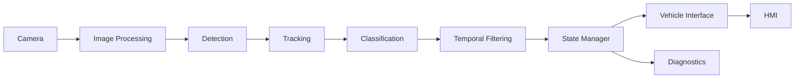

# TSR Feature Architecture

> **Narrative entrypoint:** [../../1.narrative/01.prototype_to_production.md](../1.narrative/01.prototype_to_production.md)  
> **Bài đọc sâu hơn:** [Unified Production Reference](12.unified_production_reference.md), [System Diagram](10.system_diagram.md)

---

## Purpose

Bài này mô tả feature TSR ở mức hệ thống: perception tạo sign candidate, feature logic quyết định sign nào thật sự áp dụng cho xe, rồi vehicle interface publish kết quả cho HMI hoặc consumer khác.

## Why It Matters for TSR

Nếu không hiểu kiến trúc feature, người đọc rất dễ nhầm:

- detector output = feature output,
- overlay = HMI,
- demo pipeline = production architecture.

## Core Concepts

| Block | Vai trò |
|---|---|
| Camera | Cảm biến đầu vào và timing base |
| Image Processing | Conditioning và quality-aware processing |
| Detection | Phát hiện candidate sign |
| Tracking | Nối sign qua nhiều frame |
| Classification | Gán class và semantics |
| Temporal Filtering | Yêu cầu đủ bằng chứng theo thời gian |
| State Manager | Giữ lifecycle sign và feature state |
| Vehicle Interface | Publish signal cho HMI/consumer |
| HMI | Hiển thị/cảnh báo driver-facing |
| Diagnostics | Logging, health, degraded/fault visibility |

## Production Implementation Pattern

Production TSR thường có ít nhất ba lớp:

1. `Perception`
   Detection, classification, tracking, temporal confirmation.

2. `Feature Logic`
   Context filtering, lane association, fusion, state manager.

3. `Vehicle Integration`
   HMI, diagnostics, downstream consumers như ISA.

## Relation to Current Prototype

Prototype repo hiện tại chủ yếu cover:

- image preprocessing mức tối giản,
- detection,
- classification đi kèm detector,
- temporal filtering lite,
- visualization và alert mức demo.

Chưa cover tốt:

- state manager,
- vehicle interface,
- diagnostics,
- context applicability.

## Where to See Implementation Evidence

- [Baseline Repo Analysis](../3.implementation/01.baseline_repo_analysis.md)
- [Colab Production-Lite Demo](../3.implementation/02.colab_production_lite_demo.md)

## Related Articles

- [State Manager and Sign Lifecycle](02.state_manager_and_sign_lifecycle.md)
- [HMI, Diagnostics, and Vehicle Interface](06.hmi_diagnostics_and_vehicle_interface.md)
