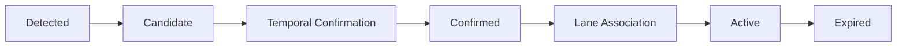
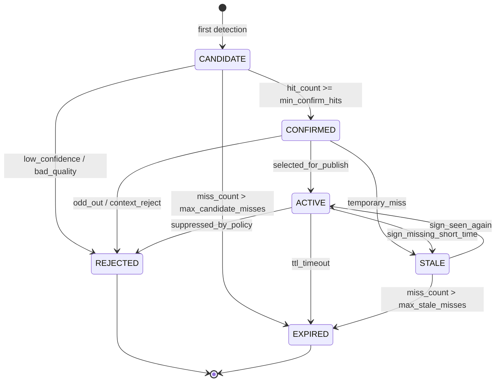

# State Manager and Sign Lifecycle

> **Narrative entrypoint:** [../../1.narrative/01.prototype_to_production.md](../1.narrative/01.prototype_to_production.md)  
> **Full reference:** [12.unified_production_reference.md](12.unified_production_reference.md), [../3.implementation/05.colab_production_lite_demo_full.md](../3.implementation/05.colab_production_lite_demo_full.md)

---

## Purpose

Bài này giải thích vì sao TSR production cần một `State Manager` thay vì chỉ publish raw detection theo frame.

## Why It Matters for TSR

Sign trên đường không nên xuất hiện và biến mất hoàn toàn theo từng frame. Feature phải quản lý vòng đời của sign để:

- giảm flicker,
- tránh publish quá sớm,
- tránh giữ sign cũ quá lâu,
- có lý do rõ ràng khi suppress hoặc expire sign.

## Core Concepts

| Trạng thái | Ý nghĩa |
|---|---|
| `Candidate` | Mới thấy sign nhưng chưa đủ bằng chứng |
| `Confirmed` | Đã đủ hit tối thiểu để tin sign có thật |
| `Active` | Sign hiện đang là output hợp lệ của feature |
| `Suppressed` | Sign bị chặn do policy, context hoặc quality |
| `Expired` | Sign đã hết hiệu lực do timeout hoặc mất bằng chứng |

Các khái niệm thường đi kèm:

- `TTL`
- `hit_count`
- `miss_count`
- `timeout`
- `state transition`

## Production Stage Pipeline

Ở mức production, vòng đời của một sign thường được đọc theo pipeline dưới đây. `Detected` là output theo từng frame của detector; `State Manager` thực sự bắt đầu quản lý từ `Candidate`.

## Stage Definition

| Stage | Mô tả | Điều kiện chuyển trạng thái điển hình |
|---|---|---|
| `Detected` | Detector nhìn thấy biển báo trên một frame | `confidence > threshold`; bbox đủ hợp lệ để tạo hoặc ghép track |
| `Candidate` | Sign mới xuất hiện nhưng chưa đủ bằng chứng | Tracking thành công trong các frame đầu; chưa bị quality/ODD gate loại |
| `Confirmed` | Đã có đủ bằng chứng để tin sign là thật | `hit_count` đạt ngưỡng, confidence đủ ổn định, tracking không bị mất |
| `Active` | Sign hiện có hiệu lực đối với xe ego | Lane association, context filtering và policy publish đều pass |
| `Expired` | Sign không còn hiệu lực | Xe đã đi qua biển, timeout, hoặc có sign khác thay thế |

Lưu ý:

- `Detected` là detector event, chưa phải feature state ổn định.
- Production thực tế thường còn có các nhánh phụ như `STALE`, `REJECTED` hoặc `SUPPRESSED`.

## Typical State Transition Conditions

### `Detected -> Candidate`

Điều kiện thường gặp:

- detection confidence đạt ngưỡng;
- bounding box đủ ổn định để theo dõi;
- `track_id` được tạo hoặc detection được ghép vào track đang sống.

### `Candidate -> Confirmed`

Điều kiện thường gặp:

- xuất hiện liên tục trong `3-5` frame hoặc đạt `min_confirm_hits`;
- confidence không dao động quá mạnh;
- tracking không bị mất giữa chừng.

Mục đích:

- giảm false positive từ detector;
- tránh publish từ one-frame glitch;
- tăng độ ổn định trước khi sign đi vào logic feature.

### `Confirmed -> Active`

Điều kiện thường gặp:

- biển báo áp dụng cho ego lane;
- không bị context filtering loại bỏ;
- chưa hết hiệu lực theo TTL hoặc policy timeout.

Ví dụ sign có thể đi vào `Active`:

- `Speed Limit 60`;
- `Stop`;
- `No Entry`.

### `Active -> Expired`

Điều kiện thường gặp:

- xe đã vượt qua biển báo;
- khoảng cách hoặc thời gian vượt ngưỡng giữ hiệu lực;
- xuất hiện biển `End Limit` hoặc sign thay thế;
- sign mất bằng chứng quá lâu và không nên giữ tiếp.

## Lifecycle Diagram

Sơ đồ dưới đây mô tả `state manager lite` phù hợp với notebook production-lite hiện tại. Nó tập trung vào vòng đời của từng sign track, không phải state machine mức toàn feature như `INIT`, `DEGRADED` hay `SAFE_DISABLE`.

Đọc nhanh sơ đồ:

- `CANDIDATE`: sign mới xuất hiện, chưa đủ bằng chứng.
- `CONFIRMED`: đã đủ hit để tin sign là thật.
- `ACTIVE`: sign đang được feature chọn để publish.
- `STALE`: sign vừa mất tạm thời nhưng chưa hết hiệu lực ngay.
- `REJECTED`: sign bị loại bởi quality, ODD, context hoặc policy.
- `EXPIRED`: sign hết hiệu lực do timeout hoặc mất bằng chứng quá lâu.

## Production Implementation Pattern

Một pattern phổ biến:

1. detector tạo sign candidate,
2. tracker nối candidate qua các frame,
3. temporal logic tăng `hit_count` và `miss_count`,
4. state manager quyết định khi nào sign vào `Confirmed`, `Active`, `Suppressed`, `Expired`.

## Relation to Current Prototype

Prototype hiện thay `State Manager` bằng:

- `hold` để giữ overlay,
- một số rule demo rất nhẹ,
- chưa có `track_id` hay lifecycle rõ.

Điều này có nghĩa:

- `hold` chỉ cải thiện hình ảnh demo,
- nhưng chưa tạo feature behavior đúng nghĩa.

Notebook sidecar [Colab Production-Lite Demo](../3.implementation/02.colab_production_lite_demo.md) đã tiến thêm một bước:

- có `track_id`, `hit_count`, `miss_count`,
- có các state `CANDIDATE`, `CONFIRMED`, `ACTIVE`, `STALE`, `REJECTED`, `EXPIRED`,
- có policy publish qua `warning_level`, `feature_state` và `primary_track`.

Điểm cần nói đúng:

- notebook hiện **chưa** có state track riêng tên `SUPPRESSED`;
- việc suppress được biểu diễn gián tiếp qua quality/ODD gate và `warning_level = 0`;
- notebook hiện **chưa** có lane association thật, nên transition `Confirmed -> Active` mới chỉ là `active-lite` theo policy demo;
- vì vậy notebook là `state manager lite`, không phải full production state manager.

## Common Mistakes

- Nhầm `hold` với tracking.
- Nhầm sign còn hiển thị trên overlay với sign đang `Active`.
- Không tách `candidate` và `confirmed`.
- Nhầm notebook lifecycle lite với production-grade state manager đầy đủ.

## Where to See Implementation Evidence

- [Baseline Repo Analysis](../3.implementation/01.baseline_repo_analysis.md)
- [Colab Production-Lite Demo](../3.implementation/02.colab_production_lite_demo.md)

## Related Articles

- [ODD for TSR](03.odd_for_tsr.md)
- [HMI, Diagnostics, and Vehicle Interface](06.hmi_diagnostics_and_vehicle_interface.md)
