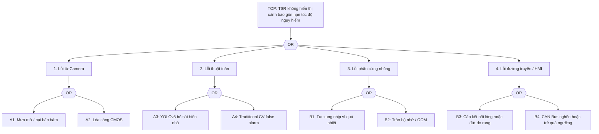
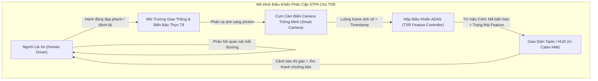

# Safety Analysis HAZOP and FTA for TSR

> **Vai trò file này:** phân tích an toàn hệ thống cho cụm camera và pipeline TSR dưới mưa, sương mù, chói sáng, rung động và giới hạn phần cứng.
>
> **Phạm vi:** HAZOP camera/CMOS/thuật toán và Fault Tree Analysis cho sự kiện đỉnh TSR không hiển thị cảnh báo giới hạn tốc độ nguy hiểm.
>
> **Ngoài phạm vi:** hướng dẫn chạy lệnh chi tiết; mapping tham số triển khai nằm trong `../3.implementation/`.

## 1. Top Risk

Sự kiện nguy hiểm chính được phân tích:

**TSR không hiển thị cảnh báo giới hạn tốc độ nguy hiểm cho người lái.**

Rủi ro này có thể đến từ cảm biến, thuật toán, phần cứng ECU, đường truyền hoặc HMI. Một số nguyên nhân là fault theo ISO 26262; một số nguyên nhân là performance limitation theo ISO 21448 (SOTIF), ví dụ camera không hỏng nhưng bị mưa/lóa làm ảnh không còn đủ tin cậy.

## 2. HAZOP Cụm Camera

| Node | Parameter | Guide Word | Deviation | Potential Causes | Safety Consequences | Recommended Mitigations |
| :--- | :--- | :--- | :--- | :--- | :--- | :--- |
| **Node 1: Hệ thống quang học và kính chắn gió** | Độ truyền quang (Light Transmission) | **Không / Mất (No/Loss)** | `No Light`: hình ảnh bị mờ hoàn toàn hoặc bị che khuất. | Mưa lớn bám hạt nước trên kính; bụi bẩn bám ống kính; sương muối hoặc đọng sương mặt trong kính chắn gió. | YOLOv8 bỏ sót biển báo (False Negative); người lái không nhận cảnh báo tốc độ. | Tích hợp vùng gạt mưa bao phủ camera; sưởi kính/cụm camera; image quality monitor phát hiện trạng thái degraded; HMI báo TSR suy giảm thay vì im lặng. |
| **Node 1: Hệ thống quang học và kính chắn gió** | Độ sắc nét hình ảnh (Image Sharpness) | **Giảm / Ít (Less/Low)** | `Less Sharpness`: hình ảnh nhòe cục bộ hoặc mất tiêu cự. | Nước mưa chảy loang gây tán xạ; rung từ mặt đường, bracket camera hoặc kính chắn gió. | Lỗi định vị bbox, phân loại nhầm, HMI chớp tắt hoặc false positive. | Giá đỡ/cụm camera đủ cứng theo yêu cầu môi trường automotive; DIS trong ISP; temporal stabilization/state manager; trace implementation có thể bắt đầu từ hold-based stabilization trước khi lên lifecycle đầy đủ. |
| **Node 1: Hệ thống quang học và kính chắn gió** | Trường nhìn (Field of View) | **Sai / Lệch (Other Than)** | Biển nằm ngoài ROI hữu ích hoặc bị che bởi gá/lắp đặt. | Camera lắp lệch sau bảo dưỡng; rung làm bracket xoay; kính chắn gió không cùng trục với camera. | TSR không thấy biển dù camera vẫn có ảnh; lỗi khó phát hiện nếu chỉ kiểm tra FPS/model. | Calibration check khi khởi động; kiểm tra ROI upper-third; DTC khi lệch hình học hoặc coverage bất thường. |
| **Node 2: Cảm biến CMOS và ISP** | Độ phơi sáng (Exposure) | **Quá nhiều / Cao (More/High)** | `Over-exposure`: frame bị lóa hoặc quá phơi sáng. | Mặt trời thấp chiếu trực diện; đèn pha ngược chiều ban đêm; biển phản quang quá mạnh. | Pixel vùng biển báo bão hòa, mất chữ số/viền biển, detector mất đặc trưng phân loại. | Cảm biến HDR trên `120 dB`; AE ưu tiên upper-third; Local Tone Mapping; adaptive histogram ở vùng ROI; degraded reason cho glare/over-exposure. |
| **Node 2: Cảm biến CMOS và ISP** | Độ nhiễu (Noise) | **Nhiều / Cao (More/High)** | Nhiễu đêm hoặc mưa làm xuất hiện hạt sáng giả. | ISO/gain quá cao; ISP denoise yếu; nhiệt sensor tăng; ánh sáng đô thị phức tạp. | Traditional CV nhận contour giả; YOLO confidence dao động, tạo cảnh báo giả. | Noise proxy, denoise theo ODD đêm, temporal confirmation, không publish candidate yếu. |
| **Node 2: Cảm biến CMOS và ISP** | LED flicker | **Theo chu kỳ / Không ổn định (Intermittent)** | Biển LED hoặc đèn điều biến mất một phần ký tự theo frame. | Thiếu LFM; thời gian phơi sáng không phù hợp tần số LED; rolling shutter. | Detector lúc thấy lúc mất, HMI chớp tắt hoặc speed limit sai. | Chọn CMOS có LFM; benchmark MMP; State Manager giữ output có kiểm soát và ghi flicker reason. |
| **Node 3: Thuật toán YOLO và CV Pipeline** | Tần suất xử lý (Inference Latency) | **Giảm / Ít (Less/Low)** | `Latency spikes`: latency tăng đột biến, bỏ sót frame hoặc cảnh báo muộn. | ECU quá nhiệt; CPU/NPU bị throttling; video 4K vượt băng thông; queue đọc/ghi video bị nghẽn. | Cảnh báo xuất hiện sau khi xe đã đi qua biển báo, không còn đủ thời gian phản ứng. | Giám sát latency và nhiệt; CPU-safer degraded mode; giảm tải inference theo profile; watchdog và cơ chế tự ngắt quá nhiệt. |
| **Node 3: Thuật toán YOLO và CV Pipeline** | Detection confidence | **Ít / Thấp (Less/Low)** | YOLOv8 thấy vùng nghi ngờ nhưng confidence thấp dưới ngưỡng publish. | Biển nhỏ, mưa mờ, ảnh ngược sáng, domain shift Việt Nam. | Nếu bỏ ngay có thể miss biển nguy hiểm; nếu publish ngay có thể cảnh báo sai. | Hybrid verification bằng Hough Circle + HSV, nâng confidence nội bộ chỉ khi shape/color khớp và vẫn qua State Manager. |
| **Node 3: Thuật toán YOLO và CV Pipeline** | Candidate filtering | **Sai (Other Than)** | Traditional CV xác nhận nhầm vật thể giống biển. | Đèn hậu/đèn trang trí tròn đỏ, logo/quảng cáo, biển hoặc biển phụ không áp dụng cho passenger car. | False warning làm người lái mất tin cậy hoặc phản ứng sai. | Không cho CV publish trực tiếp; dùng provenance, NMS, context gate và temporal evidence. |

## 3. SOTIF Interpretation

| Trigger condition | Functional insufficiency hoặc performance limitation | Mitigation concept |
|---|---|---|
| Mưa mờ che camera | Camera vẫn chạy nhưng ảnh không đủ tương phản/sắc nét. | Quality gate, degraded/unavailable HMI, validation slice mưa. |
| Glare ban đêm hoặc bình minh | Pixel bão hòa làm mất đặc trưng biển. | HDR, LTM, AE upper-third, glare monitor. |
| Biển nhỏ/che khuất | Detector chưa học đủ hoặc bbox quá nhỏ. | Dataset slice, temporal evidence, confidence calibration. |
| Nền giống biển | CV heuristic hoặc detector nhầm vật thể ngoài đường. | Context gate, fusion YOLO-CV, false-positive suppression. |
| Người lái lạm dụng TSR | Tin vào feature khi camera degraded. | HMI phải báo trạng thái suy giảm/không khả dụng rõ ràng. |

## 4. Fault Tree Analysis

### 4.1. Cơ Sở Toán Học Định Lượng Cho Cây Lỗi (Quantitative FTA Mathematics)

Cây lỗi (Fault Tree Analysis - FTA) được mô hình hóa dựa trên đại số Boolean và giải tích xác suất theo **IEC 61025 / ISO 26262-9**:

1. **Rút gọn tập vết cắt tối thiểu (Minimal Cut Sets - MCS)**:
   Sự kiện đỉnh $TOP$ là hàm logic Boolean của các sự kiện cơ bản ($E_i$):
   $$TOP = \bigcup_{j=1}^m MCS_j = MCS_1 \cup MCS_2 \cup \dots \cup MCS_m$$
   Trong đó mỗi tập cắt $MCS_j$ là một tổ hợp tối thiểu các sự kiện cơ bản mà nếu chúng cùng xảy ra sẽ dẫn tới sự kiện đỉnh.

2. **Công thức tính xác suất sự kiện đỉnh cho các tập cắt độc lập**:
   Theo nguyên lý bù trừ xác suất (Inclusion-Exclusion Principle):
   $$P(TOP) = 1 - \prod_{j=1}^m (1 - P(MCS_j)) \approx \sum_{j=1}^m P(MCS_j) - \sum_{j < k} P(MCS_j \cap MCS_k) + \dots$$
   Khi xác suất của từng sự kiện thành phần rất nhỏ ($P(MCS_j) \ll 1$), ta áp dụng xấp xỉ cận trên hiếm gặp (Rare-event Approximation):
   $$P(TOP) \approx \sum_{j=1}^m P(MCS_j)$$

3. **Quy tắc tính xác suất qua các cổng logic**:
   - **Cổng HOẶC (OR Gate)** với $n$ sự kiện đầu vào độc lập $E_1, E_2, \dots, E_n$:
     $$P(OR) = 1 - \prod_{i=1}^n (1 - P(E_i)) \approx \sum_{i=1}^n P(E_i)$$
   - **Cổng VÀ (AND Gate)** với $n$ sự kiện đầu vào độc lập $E_1, E_2, \dots, E_n$:
     $$P(AND) = \prod_{i=1}^n P(E_i)$$

4. **Tỷ lệ hỏng hóc định lượng (Failure Rate $\lambda$ tính theo FIT)**:
   Một đơn vị **$1\text{ FIT} = 10^{-9}\text{ hỏng hóc/giờ}$**.
   Xác suất hỏng hóc tích lũy sau thời gian vận hành $t$ tuân theo phân phối mũ:
   $$F(t) = 1 - \exp(-\lambda t) \approx \lambda t \quad (\text{khi } \lambda t \ll 1)$$

---

### 4.2. Bảng Phân Bổ Ngân Sách Tỷ Lệ Lỗi Định Lượng (Quantitative FIT Budget Table)

Hệ thống được thiết kế hướng tới mục tiêu an toàn **ASIL B** với chỉ số lỗi ngẫu nhiên phần cứng toàn hệ thống $M_{PMHF} < 100\text{ FIT}$ ($10^{-7}\text{ lỗi/giờ}$):

| Mã Sự Kiện | Tên Sự Kiện Cơ Bản | Loại Rủi Ro | Tỷ Lệ Lỗi Thô ($\lambda_{raw}$) | Biện Pháp Chẩn Đoán & Giảm Thiểu | Tỷ Lệ Bao Phủ Chẩn Đoán ($DC$) | Tỷ Lệ Lỗi Dư Chưa Giảm Thiểu ($\lambda_{residual}$) |
|:---|:---|:---|:---:|:---|:---:|:---:|
| **$A_1$** | Kính chắn gió bám nước mưa / bụi mờ | SOTIF | $5.0 \times 10^{-4}\text{ /h}$ | Image Quality Gate (`IEEE2020CTAMonitorV2`) phát hiện $CTA < 0.35$ | $99.0\%$ | $5.0 \times 10^{-6}\text{ /h}$ |
| **$A_2$** | Cảm biến CMOS bị lóa đèn pha / mặt trời | SOTIF | $2.0 \times 10^{-4}\text{ /h}$ | Đo độ bão hòa điểm ảnh `saturation_ratio > 0.35` | $98.5\%$ | $3.0 \times 10^{-6}\text{ /h}$ |
| **$A_3$** | YOLO bỏ sót biển nhỏ ở cự ly xa | SOTIF | $1.0 \times 10^{-3}\text{ /h}$ | Đa khung thời gian (Temporal Confirmation $3\text{ frames}$) + Traditional CV | $97.0\%$ | $3.0 \times 10^{-5}\text{ /h}$ |
| **$B_1$** | SoC/ECU bị quá nhiệt (Thermal Throttling) | Hardware | $120\text{ FIT}$ | Giám sát nhiệt độ sysfs `/sys/class/thermal`; chuyển sang degraded mode | $95.0\%$ | $6.0\text{ FIT}$ |
| **$B_2$** | Tràn bộ đệm queue / Rò rỉ bộ nhớ OOM | Software | $80\text{ FIT}$ | Watchdog Timer phần cứng chu kỳ $100\text{ ms}$; giới hạn độ dài queue | $99.9\%$ | $0.08\text{ FIT}$ |
| **$B_3$** | Đứt gãy cáp tín hiệu camera FPD-Link | Hardware | $25\text{ FIT}$ | Đo điện trở cuối đường truyền (Line Continuity Check); phát hiện mất xung sync | $99.0\%$ | $0.25\text{ FIT}$ |
| **$B_4$** | Tắc nghẽn mạng CAN Bus nội bộ xe | Network | $40\text{ FIT}$ | Giao thức CAN FD ưu tiên cao; giám sát timeout thông điệp $\le 50\text{ ms}$ | $99.0\%$ | $0.40\text{ FIT}$ |

**Tổng kết tính toán định lượng phần cứng (ISO 26262 Part 5):**
$$\lambda_{HW\_residual} = \lambda_{B1} + \lambda_{B2} + \lambda_{B3} + \lambda_{B4} = 6.0 + 0.08 + 0.25 + 0.40 = 6.73\text{ FIT}$$
Giá trị **$6.73\text{ FIT} \ll 100\text{ FIT}$** $\Rightarrow$ **Thỏa mãn vượt bậc tiêu chuẩn phần cứng ASIL B!**

---

### 4.3. Phân Tích Cấu Trúc Điều Khiển Hệ Thống STPA (Systems-Theoretic Process Analysis)

Bên cạnh FTA phân tích hỏng hóc đơn thuần, phương pháp **STPA** phân tích các tương tác sai lệch giữa các thành phần trong cấu trúc điều khiển kín:

#### Bốn Lớp Hành Động Điều Khiển Không An Toàn (Unsafe Control Actions - UCAs)

1. **UCA-1 (Cung cấp hành động gây nguy hiểm - Providing causes hazard)**:
   Hệ thống phát âm thanh cảnh báo phanh khẩn cấp giả khi xe đang chạy $100\text{ km/h}$ trên cao tốc không có biển báo nào (do nhận nhầm đèn hậu xe tải).
   $\rightarrow$ *Hậu quả*: Tài xế giật mình phanh gấp, xe phía sau tông dồn toa.
2. **UCA-2 (Không cung cấp hành động khi cần thiết - Not providing causes hazard)**:
   Xe chạy $80\text{ km/h}$ tiến vào đoạn đường đô thị giới hạn $50\text{ km/h}$, nhưng hệ thống hoàn toàn im lặng do camera bị lóa đèn pha.
   $\rightarrow$ *Hậu quả*: Tài xế không biết mình đang vi phạm tốc độ nguy hiểm.
3. **UCA-3 (Cung cấp quá trễ - Providing too late)**:
   Hệ thống nhận diện đúng biển $60\text{ km/h}$ nhưng thông tin chỉ hiện lên màn hình sau khi xe đã vượt qua biển $50\text{ m}$ do nghẽn hàng đợi xử lý.
   $\rightarrow$ *Hậu quả*: Khoảng cách còn lại không đủ cho quãng đường phanh an toàn ($SSD$).
4. **UCA-4 (Duy trì cảnh báo quá lâu - Stopped too soon / Applied too long)**:
   Biển báo hạn chế tốc độ công trường $40\text{ km/h}$ đã kết thúc sau $500\text{ m}$, xe đã vào lại cao tốc $120\text{ km/h}$ nhưng màn hình taplo vẫn khóa cứng ở mức $40\text{ km/h}$ trong suốt 10 phút do thiếu cơ chế hết hạn Time-To-Live (TTL).
   $\rightarrow$ *Hậu quả*: Tài xế mất niềm tin vào hệ thống, chủ động tắt tính năng ADAS.

---

## 5. Danh Mục Sự Kiện Cơ Bản & Biện Pháp Kiểm Soát

| Mã | Sự kiện cơ bản | Mô tả | Kiểm soát đề xuất |
|---|---|---|---|
| `A1` | Mưa mờ / bụi bẩn bám | Camera bị che khuất hoặc mất nét do mưa, bụi, sương. | Gạt/sưởi kính, monitor blur/contrast, degraded HMI. |
| `A2` | Lóa sáng CMOS | Vùng biển bị bão hòa do mặt trời hoặc đèn pha. | HDR, AE upper-third, LTM, glare validation. |
| `A3` | YOLOv8 bỏ sót biển báo | Biển nhỏ, bị che hoặc nằm ngoài phân phối train. | Dataset slice, confidence calibration, temporal confirmation. |
| `A4` | Traditional CV false alarm | Hough/HSV nhận nhầm vật thể tròn màu đỏ/xanh như quảng cáo, đèn xe hoặc biển không áp dụng. | Chỉ dùng CV như verification/candidate, yêu cầu YOLO/context/temporal gate trước HMI. |
| `B1` | Tụt xung nhịp vì quá nhiệt | ECU/NPU/CPU giảm hiệu năng khi nhiệt cao. | Thermal monitor, giảm tải runtime, watchdog. |
| `B2` | Tràn bộ nhớ / OOM | Luồng đọc/ghi video hoặc inference leak tài nguyên. | Soak test, giới hạn buffer, restart/fail-safe policy. |
| `B3` | Cáp kết nối lỏng hoặc đứt | Rung, nhiệt hoặc lỗi harness làm suy giảm tín hiệu camera/ADAS ECU/HMI. | Connector automotive, strain relief, diagnostics link. |
| `B4` | CAN Bus nghẽn hoặc trễ | Băng thông bị chiếm dụng bởi ECU khác hoặc message priority chưa đúng. | Message priority, timeout, stale-data handling, DTC. |

## 6. Safety Requirements Rút Ra

| Requirement | Rationale |
|---|---|
| TSR phải có image-quality state trước khi publish HMI. | Mưa/lóa là SOTIF trigger, không nhất thiết là fault. |
| HMI phải tách `available`, `degraded` và `unavailable`. | Tránh foreseeable misuse khi người lái tin vào feature không còn tin cậy. |
| Detection phải có temporal confirmation trước khi thành advisory. | Giảm one-frame glitch và HMI flicker. |
| Runtime phải monitor latency/freshness. | Cảnh báo đúng nhưng muộn vẫn là rủi ro. |
| Camera/ECU/HMI link phải có diagnostics. | Fault phần cứng cần được phát hiện, không để im lặng. |

## 7. Traceability Sang Implementation

| Safety requirement | Tài liệu implementation liên quan |
|---|---|
| YOLO + Traditional CV có provenance và fusion rõ | [3.01. Hybrid Pipeline Architecture](../3.implementation/01.hybrid_pipeline_architecture.md) |
| Temporal stabilization và HMI degraded/unavailable | [3.02. State Manager and HMI](../3.implementation/02.state_manager_and_hmi.md) |
| Latency/thermal degraded profile | [3.03. Edge Deployment and Benchmarks](../3.implementation/03.edge_deployment_and_benchmarks.md) |
| Demo/notebook evidence | [3.04. Production-Lite Demo Notebook](../3.implementation/03.edge_deployment_and_benchmarks.md) |

---

## 8. Danh Mục Nguồn Tham Chiếu Chuẩn (Verifiable References)

1. **ISO 26262:2018:** *Road vehicles — Functional safety* (Part 3: Concept phase & Hazard Analysis and Risk Assessment - HARA; Part 4: Product development at the system level; Part 5: Product development at the hardware level). International Organization for Standardization.
2. **ISO 21448:2022:** *Road vehicles — Safety of the intended functionality (SOTIF)* (Clause 7: Identification and evaluation of trigger conditions; Clause 8: Functional modifications for risk mitigation). ISO.
3. **IEC 61882:2016:** *Hazard and operability studies (HAZOP studies) — Application guide*. International Electrotechnical Commission.
4. **IEC 61025:2006:** *Fault tree analysis (FTA)*. International Electrotechnical Commission.
5. **SAE J3016_202104:** *Taxonomy and Definitions for Terms Related to Driving Automation Systems for On-Road Motor Vehicles*. SAE International.
6. **Euro NCAP Assessment Protocol:** *Safe Driving — Speed Assist Systems (SAS)*, Version 10.2, 2023.
