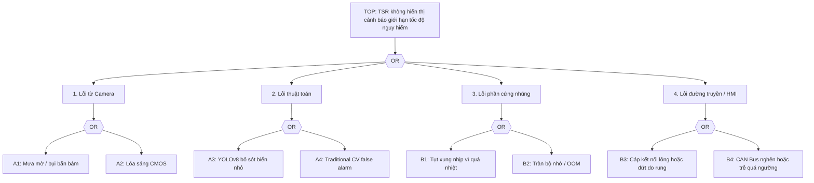

# Safety Analysis HAZOP and FTA for TSR

> **Vai trò file này:** phân tích an toàn hệ thống cho cụm camera và pipeline TSR dưới mưa, sương mù, chói sáng, rung động và giới hạn phần cứng.
>
> **Phạm vi:** HAZOP camera/CMOS/thuật toán và Fault Tree Analysis cho sự kiện đỉnh TSR không hiển thị cảnh báo giới hạn tốc độ nguy hiểm.
>
> **Ngoài phạm vi:** hướng dẫn chạy lệnh chi tiết; mapping tham số triển khai nằm trong `../3.implementation/`.

## 1. Top Risk

Sự kiện nguy hiểm chính được phân tích:

**TSR không hiển thị cảnh báo giới hạn tốc độ nguy hiểm cho người lái.**

Rủi ro này có thể đến từ cảm biến, thuật toán, phần cứng ECU, đường truyền hoặc HMI. Một số nguyên nhân là fault theo ISO 26262; một số nguyên nhân là performance limitation theo ISO 21448 (SOTIF), ví dụ camera không hỏng nhưng bị mưa/lóa làm ảnh không còn đủ tin cậy.

## 2. HAZOP Cụm Camera

| Node | Parameter | Guide Word | Deviation | Potential Causes | Safety Consequences | Recommended Mitigations |
| :--- | :--- | :--- | :--- | :--- | :--- | :--- |
| **Node 1: Hệ thống quang học và kính chắn gió** | Độ truyền quang (Light Transmission) | **Không / Mất (No/Loss)** | `No Light`: hình ảnh bị mờ hoàn toàn hoặc bị che khuất. | Mưa lớn bám hạt nước trên kính; bụi bẩn bám ống kính; sương muối hoặc đọng sương mặt trong kính chắn gió. | YOLOv8 bỏ sót biển báo (False Negative); người lái không nhận cảnh báo tốc độ. | Tích hợp vùng gạt mưa bao phủ camera; sưởi kính/cụm camera; image quality monitor phát hiện trạng thái degraded; HMI báo TSR suy giảm thay vì im lặng. |
| **Node 1: Hệ thống quang học và kính chắn gió** | Độ sắc nét hình ảnh (Image Sharpness) | **Giảm / Ít (Less/Low)** | `Less Sharpness`: hình ảnh nhòe cục bộ hoặc mất tiêu cự. | Nước mưa chảy loang gây tán xạ; rung động mạnh từ động cơ xe máy hoặc mặt đường xấu. | Lỗi định vị bbox, phân loại nhầm, HMI chớp tắt hoặc false positive. | Giá đỡ chống rung theo tinh thần ISO 26262-12; DIS trong ISP; temporal stabilization/state manager; trace implementation có thể bắt đầu từ hold-based stabilization trước khi lên lifecycle đầy đủ. |
| **Node 1: Hệ thống quang học và kính chắn gió** | Trường nhìn (Field of View) | **Sai / Lệch (Other Than)** | Biển nằm ngoài ROI hữu ích hoặc bị che bởi gá/lắp đặt. | Camera lắp lệch sau bảo dưỡng; rung làm bracket xoay; kính chắn gió không cùng trục với camera. | TSR không thấy biển dù camera vẫn có ảnh; lỗi khó phát hiện nếu chỉ kiểm tra FPS/model. | Calibration check khi khởi động; kiểm tra ROI upper-third; DTC khi lệch hình học hoặc coverage bất thường. |
| **Node 2: Cảm biến CMOS và ISP** | Độ phơi sáng (Exposure) | **Quá nhiều / Cao (More/High)** | `Over-exposure`: frame bị lóa hoặc quá phơi sáng. | Mặt trời thấp chiếu trực diện; đèn pha ngược chiều ban đêm; biển phản quang quá mạnh. | Pixel vùng biển báo bão hòa, mất chữ số/viền biển, detector mất đặc trưng phân loại. | Cảm biến HDR trên `120 dB`; AE ưu tiên upper-third; Local Tone Mapping; adaptive histogram ở vùng ROI; degraded reason cho glare/over-exposure. |
| **Node 2: Cảm biến CMOS và ISP** | Độ nhiễu (Noise) | **Nhiều / Cao (More/High)** | Nhiễu đêm hoặc mưa làm xuất hiện hạt sáng giả. | ISO/gain quá cao; ISP denoise yếu; nhiệt sensor tăng; ánh sáng đô thị phức tạp. | Traditional CV nhận contour giả; YOLO confidence dao động, tạo cảnh báo giả. | Noise proxy, denoise theo ODD đêm, temporal confirmation, không publish candidate yếu. |
| **Node 2: Cảm biến CMOS và ISP** | LED flicker | **Theo chu kỳ / Không ổn định (Intermittent)** | Biển LED hoặc đèn điều biến mất một phần ký tự theo frame. | Thiếu LFM; thời gian phơi sáng không phù hợp tần số LED; rolling shutter. | Detector lúc thấy lúc mất, HMI chớp tắt hoặc speed limit sai. | Chọn CMOS có LFM; benchmark MMP; State Manager giữ output có kiểm soát và ghi flicker reason. |
| **Node 3: Thuật toán YOLO và CV Pipeline** | Tần suất xử lý (Inference Latency) | **Giảm / Ít (Less/Low)** | `Latency spikes`: latency tăng đột biến, bỏ sót frame hoặc cảnh báo muộn. | ECU quá nhiệt; CPU/NPU bị throttling; video 4K vượt băng thông; queue đọc/ghi video bị nghẽn. | Cảnh báo xuất hiện sau khi xe đã đi qua biển báo, không còn đủ thời gian phản ứng. | Giám sát latency và nhiệt; CPU-safer degraded mode; giảm tải inference theo profile; watchdog và cơ chế tự ngắt quá nhiệt. |
| **Node 3: Thuật toán YOLO và CV Pipeline** | Detection confidence | **Ít / Thấp (Less/Low)** | YOLOv8 thấy vùng nghi ngờ nhưng confidence thấp dưới ngưỡng publish. | Biển nhỏ, mưa mờ, ảnh ngược sáng, domain shift Việt Nam. | Nếu bỏ ngay có thể miss biển nguy hiểm; nếu publish ngay có thể cảnh báo sai. | Hybrid verification bằng Hough Circle + HSV, nâng confidence nội bộ chỉ khi shape/color khớp và vẫn qua State Manager. |
| **Node 3: Thuật toán YOLO và CV Pipeline** | Candidate filtering | **Sai (Other Than)** | Traditional CV xác nhận nhầm vật thể giống biển. | Đèn xe tròn đỏ, logo/quảng cáo, biển không áp dụng cho xe máy. | False warning làm người lái mất tin cậy hoặc phản ứng sai. | Không cho CV publish trực tiếp; dùng provenance, NMS, context gate và temporal evidence. |

## 3. SOTIF Interpretation

| Trigger condition | Functional insufficiency hoặc performance limitation | Mitigation concept |
|---|---|---|
| Mưa mờ che camera | Camera vẫn chạy nhưng ảnh không đủ tương phản/sắc nét. | Quality gate, degraded/unavailable HMI, validation slice mưa. |
| Glare ban đêm hoặc bình minh | Pixel bão hòa làm mất đặc trưng biển. | HDR, LTM, AE upper-third, glare monitor. |
| Biển nhỏ/che khuất | Detector chưa học đủ hoặc bbox quá nhỏ. | Dataset slice, temporal evidence, confidence calibration. |
| Nền giống biển | CV heuristic hoặc detector nhầm vật thể ngoài đường. | Context gate, fusion YOLO-CV, false-positive suppression. |
| Người lái lạm dụng TSR | Tin vào feature khi camera degraded. | HMI phải báo trạng thái suy giảm/không khả dụng rõ ràng. |

## 4. Fault Tree Analysis



### 4.1 Cây Lỗi Dạng Văn Bản

```text
TOP: TSR không hiển thị cảnh báo giới hạn tốc độ nguy hiểm
|
+-- OR: Lỗi từ Camera
|   +-- A1: Mưa mờ, bụi bẩn hoặc nước bám lên lens/cover glass
|   +-- A2: CMOS bị lóa, cháy sáng hoặc mất CNR do glare
|
+-- OR: Lỗi thuật toán
|   +-- A3: YOLOv8 bỏ sót biển nhỏ, biển che khuất hoặc biển ngoài phân phối train
|   +-- A4: Traditional CV false alarm, làm State Manager nhận candidate sai
|
+-- OR: Lỗi phần cứng nhúng
|   +-- B1: ECU/NPU/CPU thermal throttling khiến latency spike
|   +-- B2: Rò rỉ bộ nhớ, queue tích tụ hoặc OOM làm pipeline dừng
|
+-- OR: Lỗi đường truyền và HMI
    +-- B3: Cáp camera/ECU/HMI lỏng hoặc đứt do rung động xe máy
    +-- B4: CAN Bus nghẽn do ABS ECU hoặc message priority không phù hợp
```

FTA dạng văn bản này cố ý giữ các sự kiện cơ bản độc lập để dễ trace sang test case. Ví dụ `A1` đi sang bài camera quality monitor, `A3/A4` đi sang hybrid pipeline, `B1/B2` đi sang edge benchmark và `B3/B4` đi sang CAN/HMI diagnostics.

### 4.2 FTA Dạng Báo Cáo 3 Nhánh

Biểu diễn dưới đây giữ đúng bố cục báo cáo ngắn: lỗi camera, lỗi phần cứng ECU và lỗi HMI/CAN. Nhánh thuật toán được đặt dưới camera/perception để phù hợp cách trình bày sự kiện cơ bản `A1..A4`.

```text
                           [SỰ KIỆN ĐỈNH: TSR không cảnh báo giới hạn tốc độ]
                                                   |
                                            +------+------+
                                            |   CỔNG OR   |
                                            +------+------+
                                                   |
         +-----------------------------------------+-----------------------------------------+
         |                                         |                                         |
[1. Lỗi nhận diện từ Camera]             [2. Lỗi xử lý phần cứng ECU]            [3. Lỗi hiển thị HMI/CAN]
         |                                         |                                         |
     +---+---+                                 +---+---+                                 +---+---+
     | CỔNG  |                                 | CỔNG  |                                 | CỔNG  |
     |  OR   |                                 |  OR   |                                 |  OR   |
     +---+---+                                 +---+---+                                 +---+---+
         |                                         |                                         |
  +------+------+                           +------+------+                           +------+------+
  |             |                           |             |                           |             |
[1.1 Lỗi      [1.2 Lỗi                    [2.1 Quá      [2.2 Lỗi                    [3.1 Lỗi      [3.2 Trễ dòng
Vật lý        Thuật toán                  nhiệt ECU     Bộ nhớ /                    Đường truyền  truyền CAN
Camera]       Nhận diện]                  nhúng]        Crash Luồng]                CAN Bus]      quá ngưỡng]
  |             |                           |             |                           |             |
+-+-+         +-+-+                       (B1)          (B2)                        (B3)          (B4)
|   |         |   |
|   +----+    |   +----+
|        |    |        |
(A1)    (A2) (A3)     (A4)
```

## 5. Basic Events

| Mã | Sự kiện cơ bản | Mô tả | Kiểm soát đề xuất |
|---|---|---|---|
| `A1` | Mưa mờ / bụi bẩn bám | Camera bị che khuất hoặc mất nét do mưa, bụi, sương. | Gạt/sưởi kính, monitor blur/contrast, degraded HMI. |
| `A2` | Lóa sáng CMOS | Vùng biển bị bão hòa do mặt trời hoặc đèn pha. | HDR, AE upper-third, LTM, glare validation. |
| `A3` | YOLOv8 bỏ sót biển báo | Biển nhỏ, bị che hoặc nằm ngoài phân phối train. | Dataset slice, confidence calibration, temporal confirmation. |
| `A4` | Traditional CV false alarm | Hough/HSV nhận nhầm vật thể tròn màu đỏ/xanh như quảng cáo, đèn xe hoặc biển không áp dụng. | Chỉ dùng CV như verification/candidate, yêu cầu YOLO/context/temporal gate trước HMI. |
| `B1` | Tụt xung nhịp vì quá nhiệt | ECU/NPU/CPU giảm hiệu năng khi nhiệt cao. | Thermal monitor, giảm tải runtime, watchdog. |
| `B2` | Tràn bộ nhớ / OOM | Luồng đọc/ghi video hoặc inference leak tài nguyên. | Soak test, giới hạn buffer, restart/fail-safe policy. |
| `B3` | Cáp kết nối lỏng hoặc đứt | Rung động xe máy làm suy giảm tín hiệu camera/ECU/HMI. | Connector automotive, strain relief, diagnostics link. |
| `B4` | CAN Bus nghẽn hoặc trễ | Băng thông bị chiếm dụng bởi ECU khác hoặc message priority chưa đúng. | Message priority, timeout, stale-data handling, DTC. |

## 6. Safety Requirements Rút Ra

| Requirement | Rationale |
|---|---|
| TSR phải có image-quality state trước khi publish HMI. | Mưa/lóa là SOTIF trigger, không nhất thiết là fault. |
| HMI phải tách `available`, `degraded` và `unavailable`. | Tránh foreseeable misuse khi người lái tin vào feature không còn tin cậy. |
| Detection phải có temporal confirmation trước khi thành advisory. | Giảm one-frame glitch và HMI flicker. |
| Runtime phải monitor latency/freshness. | Cảnh báo đúng nhưng muộn vẫn là rủi ro. |
| Camera/ECU/HMI link phải có diagnostics. | Fault phần cứng cần được phát hiện, không để im lặng. |

## 7. Traceability Sang Implementation

| Safety requirement | Tài liệu implementation liên quan |
|---|---|
| YOLO + Traditional CV có provenance và fusion rõ | [3.01. Hybrid Pipeline Architecture](../3.implementation/01.hybrid_pipeline_architecture.md) |
| Temporal stabilization và HMI degraded/unavailable | [3.02. State Manager and HMI](../3.implementation/02.state_manager_and_hmi.md) |
| Latency/thermal degraded profile | [3.03. Edge Deployment and Benchmarks](../3.implementation/03.edge_deployment_and_benchmarks.md) |
| Demo/notebook evidence | [3.04. Production-Lite Demo Notebook](../3.implementation/04.production_lite_demo_notebook.md) |
