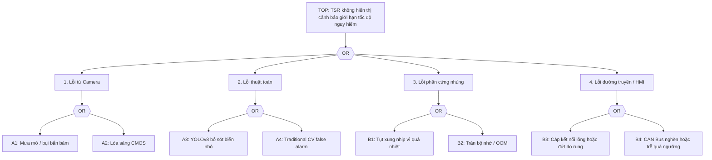
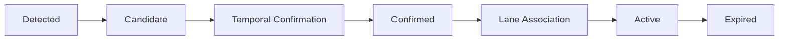
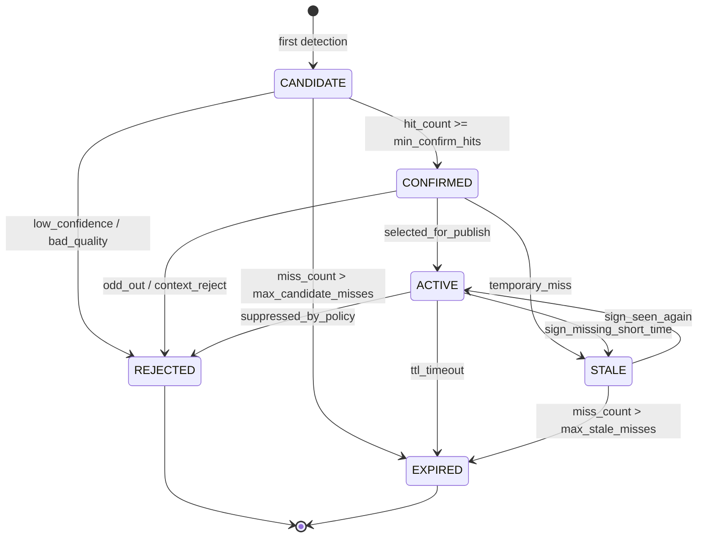
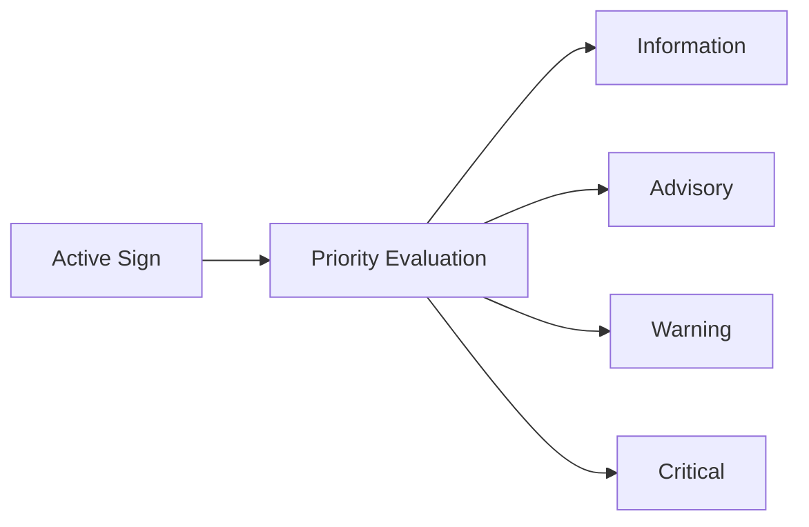

# Safety Analysis HAZOP and FTA for TSR

> **Vai trò file này:** phân tích an toàn hệ thống cho cụm camera và pipeline TSR dưới mưa, sương mù, chói sáng, rung động và giới hạn phần cứng.
>
> **Phạm vi:** HAZOP camera/CMOS/thuật toán và Fault Tree Analysis cho sự kiện đỉnh TSR không hiển thị cảnh báo giới hạn tốc độ nguy hiểm.
>
> **Ngoài phạm vi:** hướng dẫn chạy lệnh chi tiết; mapping tham số triển khai nằm trong `../3.implementation/`.

## 1. Top Risk

Sự kiện nguy hiểm chính được phân tích:

**TSR không hiển thị cảnh báo giới hạn tốc độ nguy hiểm cho người lái.**

Rủi ro này có thể đến từ cảm biến, thuật toán, phần cứng ECU, đường truyền hoặc HMI. Một số nguyên nhân là fault theo ISO 26262; một số nguyên nhân là performance limitation theo ISO 21448 (SOTIF), ví dụ camera không hỏng nhưng bị mưa/lóa làm ảnh không còn đủ tin cậy.

## 2. HAZOP Cụm Camera

| Node | Parameter | Guide Word | Deviation | Potential Causes | Safety Consequences | Recommended Mitigations |
| :--- | :--- | :--- | :--- | :--- | :--- | :--- |
| **Node 1: Hệ thống quang học và kính chắn gió** | Độ truyền quang (Light Transmission) | **Không / Mất (No/Loss)** | `No Light`: hình ảnh bị mờ hoàn toàn hoặc bị che khuất. | Mưa lớn bám hạt nước trên kính; bụi bẩn bám ống kính; sương muối hoặc đọng sương mặt trong kính chắn gió. | YOLOv8 bỏ sót biển báo (False Negative); người lái không nhận cảnh báo tốc độ. | Tích hợp vùng gạt mưa bao phủ camera; sưởi kính/cụm camera; image quality monitor phát hiện trạng thái degraded; HMI báo TSR suy giảm thay vì im lặng. |
| **Node 1: Hệ thống quang học và kính chắn gió** | Độ sắc nét hình ảnh (Image Sharpness) | **Giảm / Ít (Less/Low)** | `Less Sharpness`: hình ảnh nhòe cục bộ hoặc mất tiêu cự. | Nước mưa chảy loang gây tán xạ; rung từ mặt đường, bracket camera hoặc kính chắn gió. | Lỗi định vị bbox, phân loại nhầm, HMI chớp tắt hoặc false positive. | Giá đỡ/cụm camera đủ cứng theo yêu cầu môi trường automotive; DIS trong ISP; temporal stabilization/state manager; trace implementation có thể bắt đầu từ hold-based stabilization trước khi lên lifecycle đầy đủ. |
| **Node 1: Hệ thống quang học và kính chắn gió** | Trường nhìn (Field of View) | **Sai / Lệch (Other Than)** | Biển nằm ngoài ROI hữu ích hoặc bị che bởi gá/lắp đặt. | Camera lắp lệch sau bảo dưỡng; rung làm bracket xoay; kính chắn gió không cùng trục với camera. | TSR không thấy biển dù camera vẫn có ảnh; lỗi khó phát hiện nếu chỉ kiểm tra FPS/model. | Calibration check khi khởi động; kiểm tra ROI upper-third; DTC khi lệch hình học hoặc coverage bất thường. |
| **Node 2: Cảm biến CMOS và ISP** | Độ phơi sáng (Exposure) | **Quá nhiều / Cao (More/High)** | `Over-exposure`: frame bị lóa hoặc quá phơi sáng. | Mặt trời thấp chiếu trực diện; đèn pha ngược chiều ban đêm; biển phản quang quá mạnh. | Pixel vùng biển báo bão hòa, mất chữ số/viền biển, detector mất đặc trưng phân loại. | Cảm biến HDR trên `120 dB`; AE ưu tiên upper-third; Local Tone Mapping; adaptive histogram ở vùng ROI; degraded reason cho glare/over-exposure. |
| **Node 2: Cảm biến CMOS và ISP** | Độ nhiễu (Noise) | **Nhiều / Cao (More/High)** | Nhiễu đêm hoặc mưa làm xuất hiện hạt sáng giả. | ISO/gain quá cao; ISP denoise yếu; nhiệt sensor tăng; ánh sáng đô thị phức tạp. | Traditional CV nhận contour giả; YOLO confidence dao động, tạo cảnh báo giả. | Noise proxy, denoise theo ODD đêm, temporal confirmation, không publish candidate yếu. |
| **Node 2: Cảm biến CMOS và ISP** | LED flicker | **Theo chu kỳ / Không ổn định (Intermittent)** | Biển LED hoặc đèn điều biến mất một phần ký tự theo frame. | Thiếu LFM; thời gian phơi sáng không phù hợp tần số LED; rolling shutter. | Detector lúc thấy lúc mất, HMI chớp tắt hoặc speed limit sai. | Chọn CMOS có LFM; benchmark MMP; State Manager giữ output có kiểm soát và ghi flicker reason. |
| **Node 3: Thuật toán YOLO và CV Pipeline** | Tần suất xử lý (Inference Latency) | **Giảm / Ít (Less/Low)** | `Latency spikes`: latency tăng đột biến, bỏ sót frame hoặc cảnh báo muộn. | ECU quá nhiệt; CPU/NPU bị throttling; video 4K vượt băng thông; queue đọc/ghi video bị nghẽn. | Cảnh báo xuất hiện sau khi xe đã đi qua biển báo, không còn đủ thời gian phản ứng. | Giám sát latency và nhiệt; CPU-safer degraded mode; giảm tải inference theo profile; watchdog và cơ chế tự ngắt quá nhiệt. |
| **Node 3: Thuật toán YOLO và CV Pipeline** | Detection confidence | **Ít / Thấp (Less/Low)** | YOLOv8 thấy vùng nghi ngờ nhưng confidence thấp dưới ngưỡng publish. | Biển nhỏ, mưa mờ, ảnh ngược sáng, domain shift Việt Nam. | Nếu bỏ ngay có thể miss biển nguy hiểm; nếu publish ngay có thể cảnh báo sai. | Hybrid verification bằng Hough Circle + HSV, nâng confidence nội bộ chỉ khi shape/color khớp và vẫn qua State Manager. |
| **Node 3: Thuật toán YOLO và CV Pipeline** | Candidate filtering | **Sai (Other Than)** | Traditional CV xác nhận nhầm vật thể giống biển. | Đèn hậu/đèn trang trí tròn đỏ, logo/quảng cáo, biển hoặc biển phụ không áp dụng cho passenger car. | False warning làm người lái mất tin cậy hoặc phản ứng sai. | Không cho CV publish trực tiếp; dùng provenance, NMS, context gate và temporal evidence. |

## 3. SOTIF Interpretation

| Trigger condition | Functional insufficiency hoặc performance limitation | Mitigation concept |
|---|---|---|
| Mưa mờ che camera | Camera vẫn chạy nhưng ảnh không đủ tương phản/sắc nét. | Quality gate, degraded/unavailable HMI, validation slice mưa. |
| Glare ban đêm hoặc bình minh | Pixel bão hòa làm mất đặc trưng biển. | HDR, LTM, AE upper-third, glare monitor. |
| Biển nhỏ/che khuất | Detector chưa học đủ hoặc bbox quá nhỏ. | Dataset slice, temporal evidence, confidence calibration. |
| Nền giống biển | CV heuristic hoặc detector nhầm vật thể ngoài đường. | Context gate, fusion YOLO-CV, false-positive suppression. |
| Người lái lạm dụng TSR | Tin vào feature khi camera degraded. | HMI phải báo trạng thái suy giảm/không khả dụng rõ ràng. |

## 4. Fault Tree Analysis



### 4.1 Cây Lỗi Dạng Văn Bản

```text
TOP: TSR không hiển thị cảnh báo giới hạn tốc độ nguy hiểm
|
+-- OR: Lỗi từ Camera
|   +-- A1: Mưa mờ, bụi bẩn hoặc nước bám lên lens/cover glass
|   +-- A2: CMOS bị lóa, cháy sáng hoặc mất CNR do glare
|
+-- OR: Lỗi thuật toán
|   +-- A3: YOLOv8 bỏ sót biển nhỏ, biển che khuất hoặc biển ngoài phân phối train
|   +-- A4: Traditional CV false alarm, làm State Manager nhận candidate sai
|
+-- OR: Lỗi phần cứng nhúng
|   +-- B1: ECU/NPU/CPU thermal throttling khiến latency spike
|   +-- B2: Rò rỉ bộ nhớ, queue tích tụ hoặc OOM làm pipeline dừng
|
+-- OR: Lỗi đường truyền và HMI
    +-- B3: Cáp camera/ADAS ECU/HMI lỏng hoặc đứt do rung/nhiệt
    +-- B4: CAN Bus nghẽn do ABS ECU hoặc message priority không phù hợp
```

FTA dạng văn bản này cố ý giữ các sự kiện cơ bản độc lập để dễ trace sang test case. Ví dụ `A1` đi sang bài camera quality monitor, `A3/A4` đi sang hybrid pipeline, `B1/B2` đi sang edge benchmark và `B3/B4` đi sang CAN/HMI diagnostics.

### 4.2 FTA Dạng Báo Cáo 3 Nhánh

Biểu diễn dưới đây giữ đúng bố cục báo cáo ngắn: lỗi camera, lỗi phần cứng ECU và lỗi HMI/CAN. Nhánh thuật toán được đặt dưới camera/perception để phù hợp cách trình bày sự kiện cơ bản `A1..A4`.

```text
                           [SỰ KIỆN ĐỈNH: TSR không cảnh báo giới hạn tốc độ]
                                                   |
                                            +------+------+
                                            |   CỔNG OR   |
                                            +------+------+
                                                   |
         +-----------------------------------------+-----------------------------------------+
         |                                         |                                         |
[1. Lỗi nhận diện từ Camera]             [2. Lỗi xử lý phần cứng ECU]            [3. Lỗi hiển thị HMI/CAN]
         |                                         |                                         |
     +---+---+                                 +---+---+                                 +---+---+
     | CỔNG  |                                 | CỔNG  |                                 | CỔNG  |
     |  OR   |                                 |  OR   |                                 |  OR   |
     +---+---+                                 +---+---+                                 +---+---+
         |                                         |                                         |
  +------+------+                           +------+------+                           +------+------+
  |             |                           |             |                           |             |
[1.1 Lỗi      [1.2 Lỗi                    [2.1 Quá      [2.2 Lỗi                    [3.1 Lỗi      [3.2 Trễ dòng
Vật lý        Thuật toán                  nhiệt ECU     Bộ nhớ /                    Đường truyền  truyền CAN
Camera]       Nhận diện]                  nhúng]        Crash Luồng]                CAN Bus]      quá ngưỡng]
  |             |                           |             |                           |             |
+-+-+         +-+-+                       (B1)          (B2)                        (B3)          (B4)
|   |         |   |
|   +----+    |   +----+
|        |    |        |
(A1)    (A2) (A3)     (A4)
```

## 5. Basic Events

| Mã | Sự kiện cơ bản | Mô tả | Kiểm soát đề xuất |
|---|---|---|---|
| `A1` | Mưa mờ / bụi bẩn bám | Camera bị che khuất hoặc mất nét do mưa, bụi, sương. | Gạt/sưởi kính, monitor blur/contrast, degraded HMI. |
| `A2` | Lóa sáng CMOS | Vùng biển bị bão hòa do mặt trời hoặc đèn pha. | HDR, AE upper-third, LTM, glare validation. |
| `A3` | YOLOv8 bỏ sót biển báo | Biển nhỏ, bị che hoặc nằm ngoài phân phối train. | Dataset slice, confidence calibration, temporal confirmation. |
| `A4` | Traditional CV false alarm | Hough/HSV nhận nhầm vật thể tròn màu đỏ/xanh như quảng cáo, đèn xe hoặc biển không áp dụng. | Chỉ dùng CV như verification/candidate, yêu cầu YOLO/context/temporal gate trước HMI. |
| `B1` | Tụt xung nhịp vì quá nhiệt | ECU/NPU/CPU giảm hiệu năng khi nhiệt cao. | Thermal monitor, giảm tải runtime, watchdog. |
| `B2` | Tràn bộ nhớ / OOM | Luồng đọc/ghi video hoặc inference leak tài nguyên. | Soak test, giới hạn buffer, restart/fail-safe policy. |
| `B3` | Cáp kết nối lỏng hoặc đứt | Rung, nhiệt hoặc lỗi harness làm suy giảm tín hiệu camera/ADAS ECU/HMI. | Connector automotive, strain relief, diagnostics link. |
| `B4` | CAN Bus nghẽn hoặc trễ | Băng thông bị chiếm dụng bởi ECU khác hoặc message priority chưa đúng. | Message priority, timeout, stale-data handling, DTC. |

## 6. Safety Requirements Rút Ra

| Requirement | Rationale |
|---|---|
| TSR phải có image-quality state trước khi publish HMI. | Mưa/lóa là SOTIF trigger, không nhất thiết là fault. |
| HMI phải tách `available`, `degraded` và `unavailable`. | Tránh foreseeable misuse khi người lái tin vào feature không còn tin cậy. |
| Detection phải có temporal confirmation trước khi thành advisory. | Giảm one-frame glitch và HMI flicker. |
| Runtime phải monitor latency/freshness. | Cảnh báo đúng nhưng muộn vẫn là rủi ro. |
| Camera/ECU/HMI link phải có diagnostics. | Fault phần cứng cần được phát hiện, không để im lặng. |

## 7. Traceability Sang Implementation

| Safety requirement | Tài liệu implementation liên quan |
|---|---|
| YOLO + Traditional CV có provenance và fusion rõ | [3.01. Hybrid Pipeline Architecture](../3.implementation/01.hybrid_pipeline_architecture.md) |
| Temporal stabilization và HMI degraded/unavailable | [3.02. State Manager and HMI](../3.implementation/02.state_manager_and_hmi.md) |
| Latency/thermal degraded profile | [3.03. Edge Deployment and Benchmarks](../3.implementation/03.edge_deployment_and_benchmarks.md) |
| Demo/notebook evidence | [3.04. Production-Lite Demo Notebook](../3.implementation/03.edge_deployment_and_benchmarks.md) |

---

## State Manager and Sign Lifecycle

> **[SRC] Narrative entrypoint:** [1.01. Prototype to Production Narrative](../1.narrative/01.prototype_to_production.md) — Lấy: luận điểm detector theo frame chưa đủ thành feature production. Dùng ở: mở bài để giải thích vì sao cần State Manager trước HMI/vehicle output.
>
> **[SRC] Full reference:**
>
> - [TSR Production Reference](01.automotive_standards.md) — Lấy: policy lifecycle, tracking, arbitration và state transitions. Dùng ở: mô hình `CANDIDATE → CONFIRMED → ACTIVE → STALE/EXPIRED`.
> - [3.11. Colab Production-Lite Demo Full](../3.implementation/03.edge_deployment_and_benchmarks.md) — Lấy: implementation evidence về `track_id`, `hit_count`, `miss_count`, temporal confirmation và JSONL replay. Dùng ở: phần so sánh prototype hiện tại với production-lite state manager.
>
> **Nguồn chính:**
>
> - [Managing driving modes in automated driving systems](https://arxiv.org/abs/2107.00280) — Lấy: nguyên tắc quản lý mode/state thay vì decision rời rạc từng frame. Dùng ở: thiết kế State Manager để không publish biển báo trực tiếp từ raw detection.
> - [Navigating Dimensionality through State Machines in Automotive System Validation](https://arxiv.org/abs/2408.10569) — Lấy: state machine giúp giảm không gian validation và làm behavior kiểm thử được. Dùng ở: justification cho lifecycle state rõ ràng và test theo transition.
> - [SORT](https://arxiv.org/abs/1602.00763) — Lấy: tracking-by-detection, Kalman prediction và matching detection-to-track. Dùng ở: block Perception Tracking để tạo `track_id`, track age và miss/hit history.
> - [Deep SORT](https://arxiv.org/abs/1703.07402) — Lấy: appearance-based association để giảm identity switch qua occlusion/miss. Dùng ở: hướng nâng cấp tracking khi TSR gặp biển gần nhau hoặc miss ngắn.
> - [2.06. Sources and Provenance](01.automotive_standards.md) `[SRC]` — Lấy: quy ước `[SRC]` và danh mục evidence nội bộ. Dùng ở: phân biệt claim từ notebook/repo với claim từ paper tracking/state-machine.

---

### Purpose

> **Nguồn tại mục:** [Managing driving modes in automated driving systems](https://arxiv.org/abs/2107.00280) — Lấy: automated-driving behavior cần mode/state rõ thay vì quyết định rời rạc. Dùng ở: claim TSR production cần State Manager.
>
> **Nguồn tại mục:** [TSR Production Reference](01.automotive_standards.md) `[SRC]` — Lấy: ranh giới detector output và feature output. Dùng ở: câu “không publish raw detection theo frame”.

Bài này giải thích vì sao TSR production cần một `State Manager` thay vì chỉ publish raw detection theo frame.

### Why It Matters for TSR

> **Nguồn tại mục:** [Navigating Dimensionality through State Machines in Automotive System Validation](https://arxiv.org/abs/2408.10569) — Lấy: state machine làm behavior kiểm thử được và giảm state-space validation. Dùng ở: các lý do giảm flicker, suppress/expire có căn cứ.
>
> **Nguồn tại mục:** [3.11. Colab Production-Lite Demo Full](../3.implementation/03.edge_deployment_and_benchmarks.md) `[SRC]` — Lấy: evidence notebook dùng hit/miss/state để giảm one-frame glitch. Dùng ở: motivation quản lý lifecycle qua nhiều frame.

Sign trên đường không nên xuất hiện và biến mất hoàn toàn theo từng frame. Feature phải quản lý vòng đời của sign để:

- giảm flicker,
- tránh publish quá sớm,
- tránh giữ sign cũ quá lâu,
- có lý do rõ ràng khi suppress hoặc expire sign.

### Core Concepts

> **Nguồn tại mục:** [TSR Production Reference](01.automotive_standards.md) `[SRC]` — Lấy: lifecycle state của sign trong production TSR. Dùng ở: bảng `Candidate`, `Confirmed`, `Active`, `Suppressed`, `Expired`.
>
> **Nguồn tại mục:** [3.11. Colab Production-Lite Demo Full](../3.implementation/03.edge_deployment_and_benchmarks.md) `[SRC]` — Lấy: field `track_id`, `hit_count`, `miss_count`, timeout/state transition trong notebook. Dùng ở: danh sách khái niệm đi kèm lifecycle.

| Trạng thái | Ý nghĩa |
|---|---|
| `Candidate` | Mới thấy sign nhưng chưa đủ bằng chứng |
| `Confirmed` | Đã đủ hit tối thiểu để tin sign có thật |
| `Active` | Sign hiện đang là output hợp lệ của feature |
| `Suppressed` | Sign bị chặn do policy, context hoặc quality |
| `Expired` | Sign đã hết hiệu lực do timeout hoặc mất bằng chứng |

Các khái niệm thường đi kèm:

- `TTL`
- `hit_count`
- `miss_count`
- `timeout`
- `state transition`

### Production Stage Pipeline

> **Nguồn tại mục:** [SORT](https://arxiv.org/abs/1602.00763) — Lấy: detection được nối thành track qua thời gian bằng tracking-by-detection. Dùng ở: đoạn `Detected` → `Candidate` và vai trò tracker trước temporal confirmation.
>
> **Nguồn tại mục:** [TSR Production Reference](01.automotive_standards.md) `[SRC]` — Lấy: pipeline detector → tracking → temporal confirmation → lane/context → active output. Dùng ở: sơ đồ stage pipeline.

Ở mức production, vòng đời của một sign thường được đọc theo pipeline dưới đây. `Detected` là output theo từng frame của detector; `State Manager` thực sự bắt đầu quản lý từ `Candidate`.



### Stage Definition

> **Nguồn tại mục:** [SORT](https://arxiv.org/abs/1602.00763) — Lấy: confidence/bbox/track association là điều kiện tạo hoặc ghép track. Dùng ở: stage `Detected` và `Candidate`.
>
> **Nguồn tại mục:** [TSR Production Reference](01.automotive_standards.md) `[SRC]` — Lấy: active sign cần lane association, context filtering và policy publish. Dùng ở: stage `Confirmed`, `Active`, `Expired`.

| Stage | Mô tả | Điều kiện chuyển trạng thái điển hình |
|---|---|---|
| `Detected` | Detector nhìn thấy biển báo trên một frame | `confidence > threshold`; bbox đủ hợp lệ để tạo hoặc ghép track |
| `Candidate` | Sign mới xuất hiện nhưng chưa đủ bằng chứng | Tracking thành công trong các frame đầu; chưa bị quality/ODD gate loại |
| `Confirmed` | Đã có đủ bằng chứng để tin sign là thật | `hit_count` đạt ngưỡng, confidence đủ ổn định, tracking không bị mất |
| `Active` | Sign hiện có hiệu lực đối với xe ego | Lane association, context filtering và policy publish đều pass |
| `Expired` | Sign không còn hiệu lực | Xe đã đi qua biển, timeout, hoặc có sign khác thay thế |

Lưu ý:

- `Detected` là detector event, chưa phải feature state ổn định.
- Production thực tế thường còn có các nhánh phụ như `STALE`, `REJECTED` hoặc `SUPPRESSED`.

### Typical State Transition Conditions

> **Nguồn tại mục:** [3.11. Colab Production-Lite Demo Full](../3.implementation/03.edge_deployment_and_benchmarks.md) `[SRC]` — Lấy: `min_confirm_hits`, `miss_count`, `warning_level`, quality/ODD gate trong state manager lite. Dùng ở: các điều kiện transition theo hit/miss và suppress/publish.
>
> **Nguồn tại mục:** [Deep SORT](https://arxiv.org/abs/1703.07402) — Lấy: association ổn định qua miss/occlusion. Dùng ở: yêu cầu tracking không bị mất giữa chừng và nâng cấp khi biển gần nhau.

#### `Detected -> Candidate`

Điều kiện thường gặp:

- detection confidence đạt ngưỡng;
- bounding box đủ ổn định để theo dõi;
- `track_id` được tạo hoặc detection được ghép vào track đang sống.

#### `Candidate -> Confirmed`

Điều kiện thường gặp:

- xuất hiện liên tục trong `3-5` frame hoặc đạt `min_confirm_hits`;
- confidence không dao động quá mạnh;
- tracking không bị mất giữa chừng.

Mục đích:

- giảm false positive từ detector;
- tránh publish từ one-frame glitch;
- tăng độ ổn định trước khi sign đi vào logic feature.

#### `Confirmed -> Active`

Điều kiện thường gặp:

- biển báo áp dụng cho ego lane;
- không bị context filtering loại bỏ;
- chưa hết hiệu lực theo TTL hoặc policy timeout.

Ví dụ sign có thể đi vào `Active`:

- `Speed Limit 60`;
- `Stop`;
- `No Entry`.

#### `Active -> Expired`

Điều kiện thường gặp:

- xe đã vượt qua biển báo;
- khoảng cách hoặc thời gian vượt ngưỡng giữ hiệu lực;
- xuất hiện biển `End Limit` hoặc sign thay thế;
- sign mất bằng chứng quá lâu và không nên giữ tiếp.

### Lifecycle Diagram

> **Nguồn tại mục:** [3.11. Colab Production-Lite Demo Full](../3.implementation/03.edge_deployment_and_benchmarks.md) `[SRC]` — Lấy: state `CANDIDATE`, `CONFIRMED`, `ACTIVE`, `STALE`, `REJECTED`, `EXPIRED` trong notebook. Dùng ở: sơ đồ `state manager lite`.
>
> **Nguồn tại mục:** [Navigating Dimensionality through State Machines in Automotive System Validation](https://arxiv.org/abs/2408.10569) — Lấy: biểu diễn behavior bằng state/transition để validation rõ. Dùng ở: cách đọc sơ đồ theo transition.

Sơ đồ dưới đây mô tả `state manager lite` phù hợp với notebook production-lite hiện tại. Nó tập trung vào vòng đời của từng sign track, không phải state machine mức toàn feature như `INIT`, `DEGRADED` hay `SAFE_DISABLE`.



Đọc nhanh sơ đồ:

- `CANDIDATE`: sign mới xuất hiện, chưa đủ bằng chứng.
- `CONFIRMED`: đã đủ hit để tin sign là thật.
- `ACTIVE`: sign đang được feature chọn để publish.
- `STALE`: sign vừa mất tạm thời nhưng chưa hết hiệu lực ngay.
- `REJECTED`: sign bị loại bởi quality, ODD, context hoặc policy.
- `EXPIRED`: sign hết hiệu lực do timeout hoặc mất bằng chứng quá lâu.

### Production Implementation Pattern

> **Nguồn tại mục:** [SORT](https://arxiv.org/abs/1602.00763) — Lấy: detector tạo candidate và tracker nối candidate qua frame. Dùng ở: bước 1-2 của pattern.
>
> **Nguồn tại mục:** [TSR Production Reference](01.automotive_standards.md) `[SRC]` — Lấy: temporal logic và state manager quyết định publish/suppress/expire. Dùng ở: bước 3-4 của pattern.

Một pattern phổ biến:

1. detector tạo sign candidate,
2. tracker nối candidate qua các frame,
3. temporal logic tăng `hit_count` và `miss_count`,
4. state manager quyết định khi nào sign vào `Confirmed`, `Active`, `Suppressed`, `Expired`.

### Relation to Current Prototype

> **Nguồn tại mục:** [3.09. Baseline Repo Analysis](../3.implementation/01.hybrid_pipeline_architecture.md) `[SRC]` — Lấy: baseline dùng `hold`/rule demo, chưa có tracking/state lifecycle đầy đủ. Dùng ở: phần hạn chế prototype hiện tại.
>
> **Nguồn tại mục:** [3.05. Colab Production-Lite Demo](../3.implementation/03.edge_deployment_and_benchmarks.md) `[SRC]` — Lấy: notebook bổ sung `track_id`, hit/miss, lifecycle state và publish policy. Dùng ở: phần production-lite notebook.

Prototype hiện thay `State Manager` bằng:

- `hold` để giữ overlay,
- một số rule demo rất nhẹ,
- chưa có `track_id` hay lifecycle rõ.

Điều này có nghĩa:

- `hold` chỉ cải thiện hình ảnh demo,
- nhưng chưa tạo feature behavior đúng nghĩa.

Notebook sidecar [3.05. Colab Production-Lite Demo](../3.implementation/03.edge_deployment_and_benchmarks.md) `[SRC]` đã tiến thêm một bước:

- có `track_id`, `hit_count`, `miss_count`,
- có các state `CANDIDATE`, `CONFIRMED`, `ACTIVE`, `STALE`, `REJECTED`, `EXPIRED`,
- có policy publish qua `warning_level`, `feature_state` và `primary_track`.

Điểm cần nói đúng:

- notebook hiện **chưa** có state track riêng tên `SUPPRESSED`;
- việc suppress được biểu diễn gián tiếp qua quality/ODD gate và `warning_level = 0`;
- notebook hiện **chưa** có lane association thật, nên transition `Confirmed -> Active` mới chỉ là `active-lite` theo policy demo;
- vì vậy notebook là `state manager lite`, không phải full production state manager.

### Common Mistakes

> **Nguồn tại mục:** [3.09. Baseline Repo Analysis](../3.implementation/01.hybrid_pipeline_architecture.md) `[SRC]` — Lấy: rủi ro nhầm overlay/hold với behavior production. Dùng ở: các mistake về `hold`, overlay và thiếu candidate/confirmed.
>
> **Nguồn tại mục:** [3.11. Colab Production-Lite Demo Full](../3.implementation/03.edge_deployment_and_benchmarks.md) `[SRC]` — Lấy: phạm vi “state manager lite” của notebook. Dùng ở: mistake nhầm notebook lifecycle lite với production-grade state manager.

- Nhầm `hold` với tracking.
- Nhầm sign còn hiển thị trên overlay với sign đang `Active`.
- Không tách `candidate` và `confirmed`.
- Nhầm notebook lifecycle lite với production-grade state manager đầy đủ.

### Where to See Implementation Evidence

- [3.09. Baseline Repo Analysis](../3.implementation/01.hybrid_pipeline_architecture.md) `[SRC]`
- [3.05. Colab Production-Lite Demo](../3.implementation/03.edge_deployment_and_benchmarks.md) `[SRC]`

### Related Articles

- [2.09. ODD for TSR](01.automotive_standards.md)
- [2.12. HMI, Diagnostics, and Vehicle Interface](03.safety_analysis_hazop_fta.md)


---

## HMI, Diagnostics, and Vehicle Interface

> **[SRC] Narrative entrypoint:** [1.01. Prototype to Production Narrative](../1.narrative/01.prototype_to_production.md) — Lấy: ranh giới overlay demo, feature output, HMI và vehicle integration. Dùng ở: mở bài để tránh nhầm video annotation với HMI production.
>
> **[SRC] Full reference:** [TSR Production Reference](01.automotive_standards.md) — Lấy: HMI policy, diagnostics, CAN/service interface và degraded behavior. Dùng ở: các mục output contract, DTC/logging và publish policy.
>
> **Nguồn chính:**
>
> - [NHTSA Driver Distraction Guidelines](https://www.nhtsa.gov/document/visual-manual-nhtsa-driver-distraction-guidelines-vehicle-electronic-devices) — Lấy: nguyên tắc hạn chế visual-manual distraction. Dùng ở: HMI policy chỉ hiển thị sign đã confirm/arbitrate, tránh flicker hoặc spam cảnh báo.
> - [Regulation (EU) 2019/2144](https://eur-lex.europa.eu/eli/reg/2019/2144/oj) — Lấy: bối cảnh general safety và ISA trong vehicle approval. Dùng ở: lý do TSR output cần đủ tin cậy để feed ISA/HMI.
> - [Delegated Regulation (EU) 2021/1958](https://eur-lex.europa.eu/eli/reg_del/2021/1958/oj) — Lấy: warning, ISA behavior và driver override. Dùng ở: HMI/degraded behavior khi sign conflict hoặc camera confidence thấp.
> - [ISO 14229-1:2026 UDS](https://www.iso.org/standard/87962.html) — Lấy: diagnostic service, DTC và session behavior. Dùng ở: diagnostics output, fault reporting và service tool interface.
> - [AUTOSAR Classic Platform](https://www.autosar.org/standards/classic-platform) — Lấy: component/interface mindset trong ECU. Dùng ở: phân tách TSR app logic, vehicle bus publish và diagnostics boundary.
> - [2.06. Sources and Provenance](01.automotive_standards.md) `[SRC]` — Lấy: quy ước `[SRC]` và danh mục evidence nội bộ. Dùng ở: phân biệt interface claim từ repo với claim từ chuẩn/quy định.

---

### Purpose

> **Nguồn tại mục:** [NHTSA Driver Distraction Guidelines](https://www.nhtsa.gov/document/visual-manual-nhtsa-driver-distraction-guidelines-vehicle-electronic-devices) — Lấy: HMI driver-facing cần kiểm soát distraction/prominence. Dùng ở: phân biệt overlay demo với HMI output.
>
> **Nguồn tại mục:** [ISO 14229-1:2026 UDS](https://www.iso.org/standard/87962.html) — Lấy: diagnostics output là service/fault interface, không phải log tùy ý. Dùng ở: phân biệt diagnostics output với overlay/log demo.

Bài này giải thích vì sao TSR production cần phân biệt rõ `overlay`, `feature output`, `HMI output` và `diagnostics output`.

### Why It Matters for TSR

> **Nguồn tại mục:** [TSR Production Reference](01.automotive_standards.md) `[SRC]` — Lấy: output contract và HMI/diagnostics boundary của TSR production. Dùng ở: ba nhầm lẫn về bbox, detection event và missing machine-readable diagnosis.
>
> **Nguồn tại mục:** [3.11. Colab Production-Lite Demo Full](../3.implementation/03.edge_deployment_and_benchmarks.md) `[SRC]` — Lấy: notebook dùng `events.jsonl` để replay/RCA mức demo. Dùng ở: claim thiếu log machine-readable gây khó diagnosis.

Nếu không tách các lớp output, rất dễ xảy ra ba nhầm lẫn:

- bbox trên video bị hiểu là HMI behavior,
- detection event bị hiểu là sign đã confirm,
- thiếu log machine-readable khiến diagnosis gần như không thể.

### Core Concepts

> **Nguồn tại mục:** [AUTOSAR Classic Platform](https://www.autosar.org/standards/classic-platform) — Lấy: phân lớp application/interface/platform trong ECU. Dùng ở: bảng output layer và ranh giới feature/vehicle integration.
>
> **Nguồn tại mục:** [ISO 14229-1:2026 UDS](https://www.iso.org/standard/87962.html) — Lấy: diagnostics output cần health/fault/traceability. Dùng ở: dòng `Diagnostics output`.

| Output layer | Ý nghĩa |
|---|---|
| Overlay | Artifact demo để con người nhìn nhanh |
| Feature output | Sign/state đã qua logic feature |
| HMI output | Thông tin cuối cùng được phép hiển thị |
| Diagnostics output | Health, degraded reason, fault, traceability |

### Warning Level Concept

> **Nguồn tại mục:** [Delegated Regulation (EU) 2021/1958](https://eur-lex.europa.eu/eli/reg_del/2021/1958/oj) — Lấy: ISA/HMI warning và driver override context. Dùng ở: concept warning/advisory/critical tùy authority.
>
> **Nguồn tại mục:** [NHTSA Driver Distraction Guidelines](https://www.nhtsa.gov/document/visual-manual-nhtsa-driver-distraction-guidelines-vehicle-electronic-devices) — Lấy: HMI phải kiểm soát mức prominence để tránh distraction. Dùng ở: priority evaluation trước khi phản hồi HMI.

Không phải mọi sign đều cần phản ứng giống nhau. Sau khi sign đã đủ điều kiện publish, feature logic cần đánh giá mức ưu tiên để quyết định hình thức phản hồi phù hợp cho HMI hoặc consumer khác.



### Warning Level Definition

> **Nguồn tại mục:** [Delegated Regulation (EU) 2021/1958](https://eur-lex.europa.eu/eli/reg_del/2021/1958/oj) — Lấy: ISA có warning/driver-facing behavior và không đồng nghĩa autonomous actuation. Dùng ở: phân biệt `Information`, `Advisory`, `Warning`, `Critical`.
>
> **Nguồn tại mục:** [TSR Production Reference](01.automotive_standards.md) `[SRC]` — Lấy: TSR warning ladder là policy feature, không phải AEB trigger. Dùng ở: hai lưu ý về AEB và authority.

| Level | Ý nghĩa | Hành động điển hình |
|---|---|---|
| `Information` | Chỉ cung cấp thông tin | Hiển thị biểu tượng trên cluster hoặc HUD |
| `Advisory` | Khuyến nghị | Hiển thị sign và nhắc tài xế ở mức nhẹ |
| `Warning` | Cảnh báo | Tăng prominence bằng âm thanh hoặc cảnh báo trực quan |
| `Critical` | Cần phối hợp phản ứng mức cao hơn nếu được phép | Chỉ dùng khi TSR được kết hợp với logic/consumer khác như ISA hoặc policy ADAS phù hợp |

Lưu ý:

- TSR không tự kích hoạt `AEB` chỉ dựa trên việc nhìn thấy biển báo.
- `Critical` chỉ nên được dùng khi thông tin từ TSR đã đi qua logic hệ thống rộng hơn và authority của feature cho phép.

### Example Mapping

> **Nguồn tại mục:** [Delegated Regulation (EU) 2021/1958](https://eur-lex.europa.eu/eli/reg_del/2021/1958/oj) — Lấy: speed limit/ISA có warning/assist context. Dùng ở: mapping `Speed Limit` và ISA policy.
>
> **Nguồn tại mục:** [3.11. Colab Production-Lite Demo Full](../3.implementation/03.edge_deployment_and_benchmarks.md) `[SRC]` — Lấy: warning_level demo theo sign family. Dùng ở: ví dụ mapping priority.

| Sign hoặc tình huống | Warning level gợi ý |
|---|---|
| `Parking` | `Information` |
| `Speed Limit` đã confirm | `Advisory` |
| `Speed Limit` + ego đang vượt ngưỡng | `Warning` |
| `No Entry` | `Warning` |
| `Stop` | `Warning` |
| `Speed Limit` đã canonicalize và đi vào ISA policy | `Critical` |

### Priority Evaluation Inputs

> **Nguồn tại mục:** [2.08. State Manager and Sign Lifecycle](03.safety_analysis_hazop_fta.md) `[SRC]` — Lấy: sign phải có lifecycle/stage trước publish. Dùng ở: input `stage/lifecycle`.
>
> **Nguồn tại mục:** [2.09. ODD for TSR](01.automotive_standards.md) `[SRC]` — Lấy: context/quality/ODD ảnh hưởng publish. Dùng ở: input confidence, lane association và context filtering.
>
> **Nguồn tại mục:** [Delegated Regulation (EU) 2021/1958](https://eur-lex.europa.eu/eli/reg_del/2021/1958/oj) — Lấy: speed/ISA context. Dùng ở: input vận tốc xe và consumer authority.

Hệ thống thường đánh giá ít nhất các yếu tố sau:

- loại sign;
- độ tin cậy của detection hoặc track;
- lane association;
- context filtering;
- trạng thái hiện tại của xe;
- vận tốc xe;
- khoảng cách tới sign;
- stage/lifecycle hiện tại của sign.

### Production Implementation Pattern

> **Nguồn tại mục:** [NHTSA Driver Distraction Guidelines](https://www.nhtsa.gov/document/visual-manual-nhtsa-driver-distraction-guidelines-vehicle-electronic-devices) — Lấy: HMI cần hysteresis/prominence policy để tránh distraction/flicker. Dùng ở: `policy hiển thị theo priority và hysteresis`.
>
> **Nguồn tại mục:** [ISO 14229-1:2026 UDS](https://www.iso.org/standard/87962.html) — Lấy: diagnostics cần fault/reason/service visibility. Dùng ở: reason code, logging và RCA.
>
> **Nguồn tại mục:** [AUTOSAR Classic Platform](https://www.autosar.org/standards/classic-platform) — Lấy: interface contract giữa SWC/consumer. Dùng ở: contract cho consumer khác.

Production thường cần:

- policy hiển thị theo priority và hysteresis,
- reason code khi suppress hoặc degrade,
- interface contract cho consumer khác,
- logging để replay và RCA.

### Relation to Current Prototype

> **Nguồn tại mục:** [3.09. Baseline Repo Analysis](../3.implementation/01.hybrid_pipeline_architecture.md) `[SRC]` — Lấy: prototype hiện có overlay/alert đơn giản, thiếu diagnostics-lite/output schema. Dùng ở: phần prototype hiện có/chưa có.
>
> **Nguồn tại mục:** [3.05. Colab Production-Lite Demo](../3.implementation/03.edge_deployment_and_benchmarks.md) `[SRC]` — Lấy: notebook có `warning_level`, `feature_state`, `events.jsonl` và `primary_track`. Dùng ở: phần sidecar feature-like output.

Prototype hiện có:

- video overlay,
- alert đơn giản,
- chưa có diagnostics-lite,
- chưa có output schema.

Notebook sidecar hiện đã có thêm một lớp gần feature hơn:

- `warning_level` theo sign family,
- `feature_state` (`AVAILABLE`, `DEGRADED`, `UNAVAILABLE`),
- `events.jsonl` với `primary_track`, quality reasons và runtime metadata.

Với notebook hiện tại cần nói đúng:

- `warning_level` là mapping số `0..3` ở mức demo;
- `Level 0` nghĩa là chưa publish;
- `Level 1..3` là priority proxy cho HMI-lite, chưa phải production severity ladder đầy đủ `Information / Advisory / Warning / Critical`.

Nhưng vẫn cần giữ ranh giới:

- đây chưa phải diagnostics stack thật,
- chưa có DTC / service interface / ECU contract,
- và không nên nhầm `events.jsonl` demo với production diagnostics output.

### Common Mistakes

> **Nguồn tại mục:** [NHTSA Driver Distraction Guidelines](https://www.nhtsa.gov/document/visual-manual-nhtsa-driver-distraction-guidelines-vehicle-electronic-devices) — Lấy: driver-facing output không nên benchmark bằng overlay tùy ý. Dùng ở: mistake lấy overlay làm output chính.
>
> **Nguồn tại mục:** [ISO 14229-1:2026 UDS](https://www.iso.org/standard/87962.html) — Lấy: diagnostics cần reason/fault distinction. Dùng ở: mistake không có reason code và không tách `no sign detected` với `feature unavailable`.

- Lấy overlay làm output chính để benchmark.
- Không có reason code.
- Không tách `no sign detected` và `feature unavailable`.

### Where to See Implementation Evidence

- [3.09. Baseline Repo Analysis](../3.implementation/01.hybrid_pipeline_architecture.md) `[SRC]`
- [3.05. Colab Production-Lite Demo](../3.implementation/03.edge_deployment_and_benchmarks.md) `[SRC]`

### Related Articles

- [2.08. State Manager and Sign Lifecycle](03.safety_analysis_hazop_fta.md)
- [2.11. Verification, Validation, and Release](01.automotive_standards.md)


---

## Camera HAZOP, SOTIF, and FTA for TSR

> **Vai trò mục này:** tài liệu thiết kế an toàn cho cụm camera TSR khi hoạt động trong mưa, sương mù, bụi bẩn, chói sáng và rung động trên xe 4 bánh.
>
> **Phạm vi:** phân tích HAZOP, liên hệ ISO 21448 (SOTIF), ISO 26262 và Fault Tree Analysis cho top event "TSR không cảnh báo được biển giới hạn tốc độ nguy hiểm".

### 1. Bối Cảnh An Toàn

Camera là cảm biến chính của pipeline Traffic Sign Recognition trong repo `adas-tsr`. Với xe 4 bánh tại Việt Nam, camera trước thường đặt sau kính chắn gió hoặc trong cụm ADAS; camera có thể gặp mưa lớn, sương mù, bụi bẩn, lóa sáng, reflection từ kính/dashboard, rung động cơ học và điều kiện ánh sáng thay đổi nhanh. Các tình huống này có thể không phải lỗi phần cứng thuần túy, nhưng vẫn tạo rủi ro SOTIF vì chức năng dự định hoạt động đúng về mặt thiết kế vẫn có giới hạn hiệu năng trong ODD thực tế.

Theo cách nhìn ISO 21448, các yếu tố như mưa mờ, glare, biển báo nhỏ hoặc bị che khuất là trigger condition làm lộ functional insufficiency của perception. Theo cách nhìn ISO 26262, camera/ADAS ECU trên xe 4 bánh còn cần xét kết nối vật lý, nguồn điện, nhiệt, watchdog, diagnostics và cơ chế fail-safe/fail-silent khi tín hiệu không còn đủ tin cậy.

### 2. HAZOP Cho Cụm Camera TSR

| Node | Parameter | Guide Word | Deviation | Potential Causes | Safety Consequences | Recommended Mitigations |
| :--- | :--- | :--- | :--- | :--- | :--- | :--- |
| **Node 1: Hệ thống quang học và kính chắn gió** | Độ truyền quang (Light Transmission) | **Không / Mất (No/Loss)** | Hình ảnh bị mờ hoàn toàn hoặc bị che khuất. | Mưa lớn bám hạt nước trên kính; bụi bẩn bám ống kính; đọng sương mặt trong kính chắn gió. | YOLOv8 bỏ sót hoàn toàn biển báo (False Negative), xe chạy quá tốc độ giới hạn mà không có cảnh báo. | 1. Thiết lập vùng gạt mưa tự động bao phủ vùng đặt camera. 2. Tích hợp module sưởi kính chắn gió tại hốc camera. 3. Sử dụng bộ giám sát chất lượng ảnh ISP để báo trạng thái Degraded Mode. |
| **Node 1: Hệ thống quang học và kính chắn gió** | Độ sắc nét hình ảnh (Image Sharpness) | **Giảm / Ít (Less/Low)** | Hình ảnh bị nhòe cục bộ hoặc mất tiêu cự. | Hạt nước chảy loang trên kính gây tán xạ ánh sáng; rung từ mặt đường, bracket camera hoặc kính chắn gió. | Thuật toán YOLOv8 định vị sai bbox hoặc phân loại nhầm biển báo (False Positive). | 1. Tăng cường kết cấu chống rung vật lý cho cụm camera theo yêu cầu môi trường automotive. 2. Chạy ổn định hình ảnh kỹ thuật số (DIS) trong ISP. 3. Sử dụng State Manager với `--hold 3` hoặc logic temporal confirmation để giữ hiển thị ổn định trên HMI. |
| **Node 2: Cảm biến CMOS và ISP** | Độ phơi sáng (Exposure) | **Quá nhiều / Cao (More/High)** | Cảm biến bị lóa sáng hoặc quá phơi sáng. | Camera hướng thẳng về phía mặt trời; đèn pha xe đi ngược chiều chiếu trực diện vào ban đêm. | Pixel vùng biển báo bị bão hòa, thuật toán mất khả năng trích xuất đặc trưng màu sắc/hình dáng của biển báo. | 1. Sử dụng cảm biến CMOS automotive hỗ trợ HDR trên `120 dB`. 2. Cấu hình Auto Exposure ưu tiên đo sáng vùng upper-third. 3. Nhánh CV truyền thống áp dụng Local Tone Mapping để khôi phục vùng lóa. |
| **Node 3: Thuật toán YOLO và CV Pipeline** | Tần suất xử lý (Inference Latency) | **Giảm / Ít (Less/Low)** | Tăng độ trễ xử lý, bỏ sót khung hình. | ECU nhúng quá nhiệt gây giảm xung nhịp; video độ phân giải quá cao như 4K vượt băng thông phần cứng. | Cảnh báo TSR hiển thị quá muộn sau khi xe đã đi qua biển báo, người lái không đủ thời gian phản ứng an toàn. | 1. Triển khai CPU-safer Degraded Mode với `--imgsz 512` và `--skip 1` hoặc `--skip 2`. 2. Tích hợp cơ chế ngắt bảo vệ quá nhiệt phần cứng. 3. Giữ nhánh Traditional CV chạy CPU độc lập khi cần latency ổn định, có giới hạn rõ về độ tin cậy. |

### 3. Liên Hệ SOTIF Và ISO 26262

| Nhóm rủi ro | Phân loại | Ý nghĩa cho TSR | Biện pháp kiểm soát |
|---|---|---|---|
| Mưa mờ, bụi bẩn, đọng sương | SOTIF trigger condition | Cảm biến vẫn hoạt động nhưng ảnh không đủ chất lượng để detector đưa kết quả tin cậy. | Image Quality Monitor, ODD gate, degraded mode, cảnh báo tạm ngưng TSR. |
| Lóa CMOS, HDR không đủ | SOTIF performance limitation | Detector bỏ sót hoặc nhầm biển vì chi tiết bị bão hòa. | HDR automotive, AE upper-third, LTM, benchmark glare/night slice. |
| Rung động hoặc lệch cụm camera xe 4 bánh | ISO 26262 hardware/environment concern | Bbox dao động, mất nét, lỏng kết nối hoặc lỗi khung hình. | Mount/bracket đủ cứng, kiểm thử rung/nhiệt, diagnostics camera link, temporal filtering. |
| Quá nhiệt ECU, OOM, crash luồng video | ISO 26262 system/software concern | Cảnh báo đến muộn hoặc tiến trình dừng đột ngột. | Watchdog, resource budget, thermal monitoring, fallback config, log RCA. |
| CAN/HMI lỗi hoặc trễ | ISO 26262 interface concern | Detection đúng nhưng cảnh báo không tới người lái. | Timeout, DTC, health message, fail-silent/fail-degraded policy. |

### 4. Fault Tree Analysis

Top event của FTA là:

**Hệ thống TSR không cảnh báo được biển giới hạn tốc độ nguy hiểm cho người lái.**

```text
                           [SỰ KIỆN ĐỈNH: TSR không cảnh báo giới hạn tốc độ]
                                                   |
                                            +------+------+
                                            |   CỔNG OR   |
                                            +------+------+
                                                   |
         +-----------------------------------------+-----------------------------------------+
         |                                         |                                         |
[1. Lỗi nhận diện từ Camera]             [2. Lỗi xử lý phần cứng ECU]            [3. Lỗi hiển thị HMI/CAN]
         |                                         |                                         |
     +---+---+                                 +---+---+                                 +---+---+
     | CỔNG  |                                 | CỔNG  |                                 | CỔNG  |
     |  OR   |                                 |  OR   |                                 |  OR   |
     +---+---+                                 +---+---+                                 +---+---+
         |                                         |                                         |
  +------+------+                           +------+------+                           +------+------+
  |             |                           |             |                           |             |
[1.1 Lỗi      [1.2 Lỗi                    [2.1 Quá      [2.2 Lỗi                    [3.1 Lỗi      [3.2 Trễ dòng
Vật lý        Thuật toán                  nhiệt ECU     Bộ nhớ /                    Đường truyền  truyền CAN
Camera]       Nhận diện]                  nhúng]        Crash Luồng]                CAN Bus]      quá ngưỡng]
  |             |                           |             |                           |             |
+-+-+         +-+-+                       (B1)          (B2)                        (B3)          (B4)
|   |         |   |
|   +----+    |   +----+
|        |    |        |
(A1)    (A2) (A3)     (A4)
```

### 5. Basic Events

| Mã | Sự kiện cơ bản | Mô tả | Mitigation ưu tiên |
|---|---|---|---|
| `A1` | Mưa mờ / bụi bẩn bám | Camera bị che khuất hoàn toàn hoặc mất nét do thời tiết khắc nghiệt, thuộc nhóm SOTIF performance limitation. | Vùng gạt mưa/sưởi kính, image quality monitor, degraded mode. |
| `A2` | Lóa sáng CMOS | Pixel bị bão hòa do ánh sáng trực diện ở bình minh/hoàng hôn hoặc đèn pha ban đêm. | HDR `>120 dB`, AE upper-third, LTM và validation glare/night. |
| `A3` | YOLOv8 misses | YOLOv8 bỏ sót biển báo do kích thước quá nhỏ hoặc bị che khuất một phần. | Tăng `--imgsz`, giảm `--conf` khi debug, temporal confirmation, dataset slice cho small/occluded signs. |
| `A4` | Traditional CV false alarm | Nhánh xử lý ảnh truyền thống bị nhiễu bởi vật thể hình tròn/màu tương tự biển báo như quảng cáo hoặc đèn sau xe khác. | Fuse với YOLO, ROI/context gate, giới hạn vai trò heuristic ở candidate/provenance. |
| `B1` | Throttling do quá nhiệt | ADAS ECU hoặc SoC chạy liên tục trong môi trường nhiệt cao làm tụt xung nhịp và tăng latency. | Thermal monitor, CPU-safer config, watchdog, test nhiệt. |
| `B2` | Tràn bộ nhớ (OOM) | Rò rỉ bộ nhớ trong luồng đọc/ghi video OpenCV/PyTorch làm tiến trình bị tắt. | Soak test, giới hạn queue/buffer, logging, restart policy. |
| `B3` | Đứt/lỏng cáp kết nối vật lý | Camera hoặc ECU lỏng cáp do rung lắc liên tục trên đường xấu. | Connector automotive, strain relief, diagnostics link, DTC. |
| `B4` | CAN Bus quá tải | Băng thông CAN bị chiếm dụng bởi ECU an toàn khác như ABS/MCU làm chậm bản tin TSR. | Message priority, timeout, health heartbeat, HMI stale-data policy. |

### 6. Yêu Cầu Thiết Kế Rút Ra

- TSR không được chỉ dựa vào confidence của detector; cần quality gate và ODD gate trước khi publish HMI.
- Khi image quality xuống dưới ngưỡng an toàn, trạng thái đúng là degraded hoặc unavailable, không phải tiếp tục hiển thị sign cũ như dữ liệu chắc chắn.
- Với xe 4 bánh, rung động, nhiệt, nguồn điện và health của camera/ADAS ECU phải được đưa vào verification plan theo ISO 26262.
- `--hold 3` trong prototype chỉ là chống nhấp nháy overlay; production cần State Manager có `candidate`, `confirmed`, `active`, `suppressed` và `expired`.
- Nhánh Traditional CV nên được ghi provenance rõ ràng, vì nó hữu ích cho candidate/fallback nhưng dễ false alarm trong cảnh nền phức tạp.
