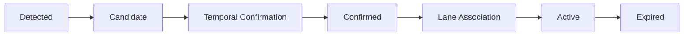
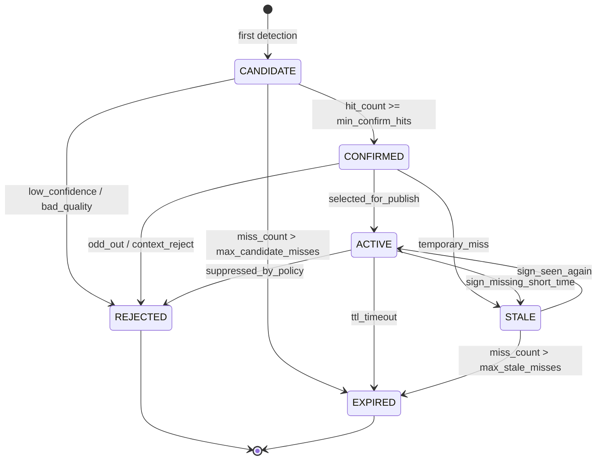

# State Manager and Sign Lifecycle

> **[SRC] Narrative entrypoint:** [1.01. Prototype to Production Narrative](../1.narrative/01.prototype_to_production.md) — Lấy: luận điểm detector theo frame chưa đủ thành feature production. Dùng ở: mở bài để giải thích vì sao cần State Manager trước HMI/vehicle output.
>
> **[SRC] Full reference:**
>
> - [2.01. Unified Production Reference](01.unified_production_reference.md) — Lấy: policy lifecycle, tracking, arbitration và state transitions. Dùng ở: mô hình `CANDIDATE → CONFIRMED → ACTIVE → STALE/EXPIRED`.
> - [3.07. Colab Production-Lite Demo Full](../3.implementation/07.colab_production_lite_demo_full.md) — Lấy: implementation evidence về `track_id`, `hit_count`, `miss_count`, temporal confirmation và JSONL replay. Dùng ở: phần so sánh prototype hiện tại với production-lite state manager.
>
> **Nguồn chính:**
>
> - [Managing driving modes in automated driving systems](https://arxiv.org/abs/2107.00280) — Lấy: nguyên tắc quản lý mode/state thay vì decision rời rạc từng frame. Dùng ở: thiết kế State Manager để không publish biển báo trực tiếp từ raw detection.
> - [Navigating Dimensionality through State Machines in Automotive System Validation](https://arxiv.org/abs/2408.10569) — Lấy: state machine giúp giảm không gian validation và làm behavior kiểm thử được. Dùng ở: justification cho lifecycle state rõ ràng và test theo transition.
> - [SORT](https://arxiv.org/abs/1602.00763) — Lấy: tracking-by-detection, Kalman prediction và matching detection-to-track. Dùng ở: block Perception Tracking để tạo `track_id`, track age và miss/hit history.
> - [Deep SORT](https://arxiv.org/abs/1703.07402) — Lấy: appearance-based association để giảm identity switch qua occlusion/miss. Dùng ở: hướng nâng cấp tracking khi TSR gặp biển gần nhau hoặc miss ngắn.
> - [2.03. Sources and Provenance](03.sources_and_provenance.md) `[SRC]` — Lấy: quy ước `[SRC]` và danh mục evidence nội bộ. Dùng ở: phân biệt claim từ notebook/repo với claim từ paper tracking/state-machine.

---

## Purpose

> **Nguồn tại mục:** [Managing driving modes in automated driving systems](https://arxiv.org/abs/2107.00280) — Lấy: automated-driving behavior cần mode/state rõ thay vì quyết định rời rạc. Dùng ở: claim TSR production cần State Manager.
>
> **Nguồn tại mục:** [2.01. Unified Production Reference](01.unified_production_reference.md) `[SRC]` — Lấy: ranh giới detector output và feature output. Dùng ở: câu “không publish raw detection theo frame”.

Bài này giải thích vì sao TSR production cần một `State Manager` thay vì chỉ publish raw detection theo frame.

## Why It Matters for TSR

> **Nguồn tại mục:** [Navigating Dimensionality through State Machines in Automotive System Validation](https://arxiv.org/abs/2408.10569) — Lấy: state machine làm behavior kiểm thử được và giảm state-space validation. Dùng ở: các lý do giảm flicker, suppress/expire có căn cứ.
>
> **Nguồn tại mục:** [3.07. Colab Production-Lite Demo Full](../3.implementation/07.colab_production_lite_demo_full.md) `[SRC]` — Lấy: evidence notebook dùng hit/miss/state để giảm one-frame glitch. Dùng ở: motivation quản lý lifecycle qua nhiều frame.

Sign trên đường không nên xuất hiện và biến mất hoàn toàn theo từng frame. Feature phải quản lý vòng đời của sign để:

- giảm flicker,
- tránh publish quá sớm,
- tránh giữ sign cũ quá lâu,
- có lý do rõ ràng khi suppress hoặc expire sign.

## Core Concepts

> **Nguồn tại mục:** [2.01. Unified Production Reference](01.unified_production_reference.md) `[SRC]` — Lấy: lifecycle state của sign trong production TSR. Dùng ở: bảng `Candidate`, `Confirmed`, `Active`, `Suppressed`, `Expired`.
>
> **Nguồn tại mục:** [3.07. Colab Production-Lite Demo Full](../3.implementation/07.colab_production_lite_demo_full.md) `[SRC]` — Lấy: field `track_id`, `hit_count`, `miss_count`, timeout/state transition trong notebook. Dùng ở: danh sách khái niệm đi kèm lifecycle.

| Trạng thái | Ý nghĩa |
|---|---|
| `Candidate` | Mới thấy sign nhưng chưa đủ bằng chứng |
| `Confirmed` | Đã đủ hit tối thiểu để tin sign có thật |
| `Active` | Sign hiện đang là output hợp lệ của feature |
| `Suppressed` | Sign bị chặn do policy, context hoặc quality |
| `Expired` | Sign đã hết hiệu lực do timeout hoặc mất bằng chứng |

Các khái niệm thường đi kèm:

- `TTL`
- `hit_count`
- `miss_count`
- `timeout`
- `state transition`

## Production Stage Pipeline

> **Nguồn tại mục:** [SORT](https://arxiv.org/abs/1602.00763) — Lấy: detection được nối thành track qua thời gian bằng tracking-by-detection. Dùng ở: đoạn `Detected` → `Candidate` và vai trò tracker trước temporal confirmation.
>
> **Nguồn tại mục:** [2.01. Unified Production Reference](01.unified_production_reference.md) `[SRC]` — Lấy: pipeline detector → tracking → temporal confirmation → lane/context → active output. Dùng ở: sơ đồ stage pipeline.

Ở mức production, vòng đời của một sign thường được đọc theo pipeline dưới đây. `Detected` là output theo từng frame của detector; `State Manager` thực sự bắt đầu quản lý từ `Candidate`.

## Stage Definition

> **Nguồn tại mục:** [SORT](https://arxiv.org/abs/1602.00763) — Lấy: confidence/bbox/track association là điều kiện tạo hoặc ghép track. Dùng ở: stage `Detected` và `Candidate`.
>
> **Nguồn tại mục:** [2.01. Unified Production Reference](01.unified_production_reference.md) `[SRC]` — Lấy: active sign cần lane association, context filtering và policy publish. Dùng ở: stage `Confirmed`, `Active`, `Expired`.

| Stage | Mô tả | Điều kiện chuyển trạng thái điển hình |
|---|---|---|
| `Detected` | Detector nhìn thấy biển báo trên một frame | `confidence > threshold`; bbox đủ hợp lệ để tạo hoặc ghép track |
| `Candidate` | Sign mới xuất hiện nhưng chưa đủ bằng chứng | Tracking thành công trong các frame đầu; chưa bị quality/ODD gate loại |
| `Confirmed` | Đã có đủ bằng chứng để tin sign là thật | `hit_count` đạt ngưỡng, confidence đủ ổn định, tracking không bị mất |
| `Active` | Sign hiện có hiệu lực đối với xe ego | Lane association, context filtering và policy publish đều pass |
| `Expired` | Sign không còn hiệu lực | Xe đã đi qua biển, timeout, hoặc có sign khác thay thế |

Lưu ý:

- `Detected` là detector event, chưa phải feature state ổn định.
- Production thực tế thường còn có các nhánh phụ như `STALE`, `REJECTED` hoặc `SUPPRESSED`.

## Typical State Transition Conditions

> **Nguồn tại mục:** [3.07. Colab Production-Lite Demo Full](../3.implementation/07.colab_production_lite_demo_full.md) `[SRC]` — Lấy: `min_confirm_hits`, `miss_count`, `warning_level`, quality/ODD gate trong state manager lite. Dùng ở: các điều kiện transition theo hit/miss và suppress/publish.
>
> **Nguồn tại mục:** [Deep SORT](https://arxiv.org/abs/1703.07402) — Lấy: association ổn định qua miss/occlusion. Dùng ở: yêu cầu tracking không bị mất giữa chừng và nâng cấp khi biển gần nhau.

### `Detected -> Candidate`

Điều kiện thường gặp:

- detection confidence đạt ngưỡng;
- bounding box đủ ổn định để theo dõi;
- `track_id` được tạo hoặc detection được ghép vào track đang sống.

### `Candidate -> Confirmed`

Điều kiện thường gặp:

- xuất hiện liên tục trong `3-5` frame hoặc đạt `min_confirm_hits`;
- confidence không dao động quá mạnh;
- tracking không bị mất giữa chừng.

Mục đích:

- giảm false positive từ detector;
- tránh publish từ one-frame glitch;
- tăng độ ổn định trước khi sign đi vào logic feature.

### `Confirmed -> Active`

Điều kiện thường gặp:

- biển báo áp dụng cho ego lane;
- không bị context filtering loại bỏ;
- chưa hết hiệu lực theo TTL hoặc policy timeout.

Ví dụ sign có thể đi vào `Active`:

- `Speed Limit 60`;
- `Stop`;
- `No Entry`.

### `Active -> Expired`

Điều kiện thường gặp:

- xe đã vượt qua biển báo;
- khoảng cách hoặc thời gian vượt ngưỡng giữ hiệu lực;
- xuất hiện biển `End Limit` hoặc sign thay thế;
- sign mất bằng chứng quá lâu và không nên giữ tiếp.

## Lifecycle Diagram

> **Nguồn tại mục:** [3.07. Colab Production-Lite Demo Full](../3.implementation/07.colab_production_lite_demo_full.md) `[SRC]` — Lấy: state `CANDIDATE`, `CONFIRMED`, `ACTIVE`, `STALE`, `REJECTED`, `EXPIRED` trong notebook. Dùng ở: sơ đồ `state manager lite`.
>
> **Nguồn tại mục:** [Navigating Dimensionality through State Machines in Automotive System Validation](https://arxiv.org/abs/2408.10569) — Lấy: biểu diễn behavior bằng state/transition để validation rõ. Dùng ở: cách đọc sơ đồ theo transition.

Sơ đồ dưới đây mô tả `state manager lite` phù hợp với notebook production-lite hiện tại. Nó tập trung vào vòng đời của từng sign track, không phải state machine mức toàn feature như `INIT`, `DEGRADED` hay `SAFE_DISABLE`.

Đọc nhanh sơ đồ:

- `CANDIDATE`: sign mới xuất hiện, chưa đủ bằng chứng.
- `CONFIRMED`: đã đủ hit để tin sign là thật.
- `ACTIVE`: sign đang được feature chọn để publish.
- `STALE`: sign vừa mất tạm thời nhưng chưa hết hiệu lực ngay.
- `REJECTED`: sign bị loại bởi quality, ODD, context hoặc policy.
- `EXPIRED`: sign hết hiệu lực do timeout hoặc mất bằng chứng quá lâu.

## Production Implementation Pattern

> **Nguồn tại mục:** [SORT](https://arxiv.org/abs/1602.00763) — Lấy: detector tạo candidate và tracker nối candidate qua frame. Dùng ở: bước 1-2 của pattern.
>
> **Nguồn tại mục:** [2.01. Unified Production Reference](01.unified_production_reference.md) `[SRC]` — Lấy: temporal logic và state manager quyết định publish/suppress/expire. Dùng ở: bước 3-4 của pattern.

Một pattern phổ biến:

1. detector tạo sign candidate,
2. tracker nối candidate qua các frame,
3. temporal logic tăng `hit_count` và `miss_count`,
4. state manager quyết định khi nào sign vào `Confirmed`, `Active`, `Suppressed`, `Expired`.

## Relation to Current Prototype

> **Nguồn tại mục:** [3.05. Baseline Repo Analysis](../3.implementation/05.baseline_repo_analysis.md) `[SRC]` — Lấy: baseline dùng `hold`/rule demo, chưa có tracking/state lifecycle đầy đủ. Dùng ở: phần hạn chế prototype hiện tại.
>
> **Nguồn tại mục:** [3.01. Colab Production-Lite Demo](../3.implementation/01.colab_production_lite_demo.md) `[SRC]` — Lấy: notebook bổ sung `track_id`, hit/miss, lifecycle state và publish policy. Dùng ở: phần production-lite notebook.

Prototype hiện thay `State Manager` bằng:

- `hold` để giữ overlay,
- một số rule demo rất nhẹ,
- chưa có `track_id` hay lifecycle rõ.

Điều này có nghĩa:

- `hold` chỉ cải thiện hình ảnh demo,
- nhưng chưa tạo feature behavior đúng nghĩa.

Notebook sidecar [3.01. Colab Production-Lite Demo](../3.implementation/01.colab_production_lite_demo.md) `[SRC]` đã tiến thêm một bước:

- có `track_id`, `hit_count`, `miss_count`,
- có các state `CANDIDATE`, `CONFIRMED`, `ACTIVE`, `STALE`, `REJECTED`, `EXPIRED`,
- có policy publish qua `warning_level`, `feature_state` và `primary_track`.

Điểm cần nói đúng:

- notebook hiện **chưa** có state track riêng tên `SUPPRESSED`;
- việc suppress được biểu diễn gián tiếp qua quality/ODD gate và `warning_level = 0`;
- notebook hiện **chưa** có lane association thật, nên transition `Confirmed -> Active` mới chỉ là `active-lite` theo policy demo;
- vì vậy notebook là `state manager lite`, không phải full production state manager.

## Common Mistakes

> **Nguồn tại mục:** [3.05. Baseline Repo Analysis](../3.implementation/05.baseline_repo_analysis.md) `[SRC]` — Lấy: rủi ro nhầm overlay/hold với behavior production. Dùng ở: các mistake về `hold`, overlay và thiếu candidate/confirmed.
>
> **Nguồn tại mục:** [3.07. Colab Production-Lite Demo Full](../3.implementation/07.colab_production_lite_demo_full.md) `[SRC]` — Lấy: phạm vi “state manager lite” của notebook. Dùng ở: mistake nhầm notebook lifecycle lite với production-grade state manager.

- Nhầm `hold` với tracking.
- Nhầm sign còn hiển thị trên overlay với sign đang `Active`.
- Không tách `candidate` và `confirmed`.
- Nhầm notebook lifecycle lite với production-grade state manager đầy đủ.

## Where to See Implementation Evidence

- [3.05. Baseline Repo Analysis](../3.implementation/05.baseline_repo_analysis.md) `[SRC]`
- [3.01. Colab Production-Lite Demo](../3.implementation/01.colab_production_lite_demo.md) `[SRC]`

## Related Articles

- [2.06. ODD for TSR](06.odd_for_tsr.md)
- [2.09. HMI, Diagnostics, and Vehicle Interface](09.hmi_diagnostics_and_vehicle_interface.md)
