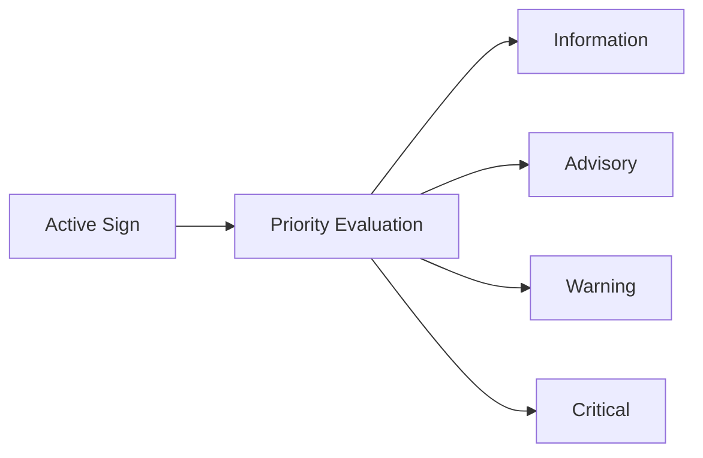

# HMI, Diagnostics, and Vehicle Interface

> **Narrative entrypoint:** [../../1.narrative/01.prototype_to_production.md](../1.narrative/01.prototype_to_production.md)  
> **Full reference:** [12.unified_production_reference.md](12.unified_production_reference.md)

---

## Purpose

Bài này giải thích vì sao TSR production cần phân biệt rõ `overlay`, `feature output`, `HMI output` và `diagnostics output`.

## Why It Matters for TSR

Nếu không tách các lớp output, rất dễ xảy ra ba nhầm lẫn:

- bbox trên video bị hiểu là HMI behavior,
- detection event bị hiểu là sign đã confirm,
- thiếu log machine-readable khiến diagnosis gần như không thể.

## Core Concepts

| Output layer | Ý nghĩa |
|---|---|
| Overlay | Artifact demo để con người nhìn nhanh |
| Feature output | Sign/state đã qua logic feature |
| HMI output | Thông tin cuối cùng được phép hiển thị |
| Diagnostics output | Health, degraded reason, fault, traceability |

## Warning Level Concept

Không phải mọi sign đều cần phản ứng giống nhau. Sau khi sign đã đủ điều kiện publish, feature logic cần đánh giá mức ưu tiên để quyết định hình thức phản hồi phù hợp cho HMI hoặc consumer khác.

## Warning Level Definition

| Level | Ý nghĩa | Hành động điển hình |
|---|---|---|
| `Information` | Chỉ cung cấp thông tin | Hiển thị biểu tượng trên cluster hoặc HUD |
| `Advisory` | Khuyến nghị | Hiển thị sign và nhắc tài xế ở mức nhẹ |
| `Warning` | Cảnh báo | Tăng prominence bằng âm thanh hoặc cảnh báo trực quan |
| `Critical` | Cần phối hợp phản ứng mức cao hơn nếu được phép | Chỉ dùng khi TSR được kết hợp với logic/consumer khác như ISA hoặc policy ADAS phù hợp |

Lưu ý:

- TSR không tự kích hoạt `AEB` chỉ dựa trên việc nhìn thấy biển báo.
- `Critical` chỉ nên được dùng khi thông tin từ TSR đã đi qua logic hệ thống rộng hơn và authority của feature cho phép.

## Example Mapping

| Sign hoặc tình huống | Warning level gợi ý |
|---|---|
| `Parking` | `Information` |
| `Speed Limit` đã confirm | `Advisory` |
| `Speed Limit` + ego đang vượt ngưỡng | `Warning` |
| `No Entry` | `Warning` |
| `Stop` | `Warning` |
| `Speed Limit` đã canonicalize và đi vào ISA policy | `Critical` |

## Priority Evaluation Inputs

Hệ thống thường đánh giá ít nhất các yếu tố sau:

- loại sign;
- độ tin cậy của detection hoặc track;
- lane association;
- context filtering;
- trạng thái hiện tại của xe;
- vận tốc xe;
- khoảng cách tới sign;
- stage/lifecycle hiện tại của sign.

## Production Implementation Pattern

Production thường cần:

- policy hiển thị theo priority và hysteresis,
- reason code khi suppress hoặc degrade,
- interface contract cho consumer khác,
- logging để replay và RCA.

## Relation to Current Prototype

Prototype hiện có:

- video overlay,
- alert đơn giản,
- chưa có diagnostics-lite,
- chưa có output schema.

Notebook sidecar hiện đã có thêm một lớp gần feature hơn:

- `warning_level` theo sign family,
- `feature_state` (`AVAILABLE`, `DEGRADED`, `UNAVAILABLE`),
- `events.jsonl` với `primary_track`, quality reasons và runtime metadata.

Với notebook hiện tại cần nói đúng:

- `warning_level` là mapping số `0..3` ở mức demo;
- `Level 0` nghĩa là chưa publish;
- `Level 1..3` là priority proxy cho HMI-lite, chưa phải production severity ladder đầy đủ `Information / Advisory / Warning / Critical`.

Nhưng vẫn cần giữ ranh giới:

- đây chưa phải diagnostics stack thật,
- chưa có DTC / service interface / ECU contract,
- và không nên nhầm `events.jsonl` demo với production diagnostics output.

## Common Mistakes

- Lấy overlay làm output chính để benchmark.
- Không có reason code.
- Không tách `no sign detected` và `feature unavailable`.

## Where to See Implementation Evidence

- [Baseline Repo Analysis](../3.implementation/01.baseline_repo_analysis.md)
- [Colab Production-Lite Demo](../3.implementation/02.colab_production_lite_demo.md)

## Related Articles

- [State Manager and Sign Lifecycle](02.state_manager_and_sign_lifecycle.md)
- [Verification, Validation, and Release](05.verification_validation_and_release.md)
