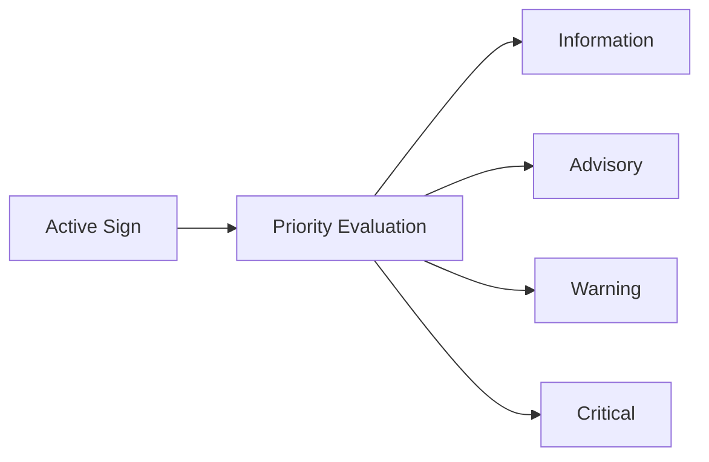

# HMI, Diagnostics, and Vehicle Interface

> **[SRC] Narrative entrypoint:** [Prototype to Production Narrative](../1.narrative/01.prototype_to_production.md) — Lấy: ranh giới overlay demo, feature output, HMI và vehicle integration. Dùng ở: mở bài để tránh nhầm video annotation với HMI production.
>
> **[SRC] Full reference:** [Unified Production Reference](12.unified_production_reference.md) — Lấy: HMI policy, diagnostics, CAN/service interface và degraded behavior. Dùng ở: các mục output contract, DTC/logging và publish policy.
>
> **Nguồn chính:**
>
> - [NHTSA Driver Distraction Guidelines](https://www.nhtsa.gov/document/visual-manual-nhtsa-driver-distraction-guidelines-vehicle-electronic-devices) — Lấy: nguyên tắc hạn chế visual-manual distraction. Dùng ở: HMI policy chỉ hiển thị sign đã confirm/arbitrate, tránh flicker hoặc spam cảnh báo.
> - [Regulation (EU) 2019/2144](https://eur-lex.europa.eu/eli/reg/2019/2144/oj) — Lấy: bối cảnh general safety và ISA trong vehicle approval. Dùng ở: lý do TSR output cần đủ tin cậy để feed ISA/HMI.
> - [Delegated Regulation (EU) 2021/1958](https://eur-lex.europa.eu/eli/reg_del/2021/1958/oj) — Lấy: warning, ISA behavior và driver override. Dùng ở: HMI/degraded behavior khi sign conflict hoặc camera confidence thấp.
> - [ISO 14229-1:2026 UDS](https://www.iso.org/standard/87962.html) — Lấy: diagnostic service, DTC và session behavior. Dùng ở: diagnostics output, fault reporting và service tool interface.
> - [AUTOSAR Classic Platform](https://www.autosar.org/standards/classic-platform) — Lấy: component/interface mindset trong ECU. Dùng ở: phân tách TSR app logic, vehicle bus publish và diagnostics boundary.
> - [Sources and Provenance](11.sources_and_provenance.md) `[SRC]` — Lấy: quy ước `[SRC]` và danh mục evidence nội bộ. Dùng ở: phân biệt interface claim từ repo với claim từ chuẩn/quy định.

---

## Purpose

> **Nguồn tại mục:** [NHTSA Driver Distraction Guidelines](https://www.nhtsa.gov/document/visual-manual-nhtsa-driver-distraction-guidelines-vehicle-electronic-devices) — Lấy: HMI driver-facing cần kiểm soát distraction/prominence. Dùng ở: phân biệt overlay demo với HMI output.
>
> **Nguồn tại mục:** [ISO 14229-1:2026 UDS](https://www.iso.org/standard/87962.html) — Lấy: diagnostics output là service/fault interface, không phải log tùy ý. Dùng ở: phân biệt diagnostics output với overlay/log demo.

Bài này giải thích vì sao TSR production cần phân biệt rõ `overlay`, `feature output`, `HMI output` và `diagnostics output`.

## Why It Matters for TSR

> **Nguồn tại mục:** [Unified Production Reference](12.unified_production_reference.md) `[SRC]` — Lấy: output contract và HMI/diagnostics boundary của TSR production. Dùng ở: ba nhầm lẫn về bbox, detection event và missing machine-readable diagnosis.
>
> **Nguồn tại mục:** [Colab Production-Lite Demo Full](../3.implementation/05.colab_production_lite_demo_full.md) `[SRC]` — Lấy: notebook dùng `events.jsonl` để replay/RCA mức demo. Dùng ở: claim thiếu log machine-readable gây khó diagnosis.

Nếu không tách các lớp output, rất dễ xảy ra ba nhầm lẫn:

- bbox trên video bị hiểu là HMI behavior,
- detection event bị hiểu là sign đã confirm,
- thiếu log machine-readable khiến diagnosis gần như không thể.

## Core Concepts

> **Nguồn tại mục:** [AUTOSAR Classic Platform](https://www.autosar.org/standards/classic-platform) — Lấy: phân lớp application/interface/platform trong ECU. Dùng ở: bảng output layer và ranh giới feature/vehicle integration.
>
> **Nguồn tại mục:** [ISO 14229-1:2026 UDS](https://www.iso.org/standard/87962.html) — Lấy: diagnostics output cần health/fault/traceability. Dùng ở: dòng `Diagnostics output`.

| Output layer | Ý nghĩa |
|---|---|
| Overlay | Artifact demo để con người nhìn nhanh |
| Feature output | Sign/state đã qua logic feature |
| HMI output | Thông tin cuối cùng được phép hiển thị |
| Diagnostics output | Health, degraded reason, fault, traceability |

## Warning Level Concept

> **Nguồn tại mục:** [Delegated Regulation (EU) 2021/1958](https://eur-lex.europa.eu/eli/reg_del/2021/1958/oj) — Lấy: ISA/HMI warning và driver override context. Dùng ở: concept warning/advisory/critical tùy authority.
>
> **Nguồn tại mục:** [NHTSA Driver Distraction Guidelines](https://www.nhtsa.gov/document/visual-manual-nhtsa-driver-distraction-guidelines-vehicle-electronic-devices) — Lấy: HMI phải kiểm soát mức prominence để tránh distraction. Dùng ở: priority evaluation trước khi phản hồi HMI.

Không phải mọi sign đều cần phản ứng giống nhau. Sau khi sign đã đủ điều kiện publish, feature logic cần đánh giá mức ưu tiên để quyết định hình thức phản hồi phù hợp cho HMI hoặc consumer khác.

## Warning Level Definition

> **Nguồn tại mục:** [Delegated Regulation (EU) 2021/1958](https://eur-lex.europa.eu/eli/reg_del/2021/1958/oj) — Lấy: ISA có warning/driver-facing behavior và không đồng nghĩa autonomous actuation. Dùng ở: phân biệt `Information`, `Advisory`, `Warning`, `Critical`.
>
> **Nguồn tại mục:** [Unified Production Reference](12.unified_production_reference.md) `[SRC]` — Lấy: TSR warning ladder là policy feature, không phải AEB trigger. Dùng ở: hai lưu ý về AEB và authority.

| Level | Ý nghĩa | Hành động điển hình |
|---|---|---|
| `Information` | Chỉ cung cấp thông tin | Hiển thị biểu tượng trên cluster hoặc HUD |
| `Advisory` | Khuyến nghị | Hiển thị sign và nhắc tài xế ở mức nhẹ |
| `Warning` | Cảnh báo | Tăng prominence bằng âm thanh hoặc cảnh báo trực quan |
| `Critical` | Cần phối hợp phản ứng mức cao hơn nếu được phép | Chỉ dùng khi TSR được kết hợp với logic/consumer khác như ISA hoặc policy ADAS phù hợp |

Lưu ý:

- TSR không tự kích hoạt `AEB` chỉ dựa trên việc nhìn thấy biển báo.
- `Critical` chỉ nên được dùng khi thông tin từ TSR đã đi qua logic hệ thống rộng hơn và authority của feature cho phép.

## Example Mapping

> **Nguồn tại mục:** [Delegated Regulation (EU) 2021/1958](https://eur-lex.europa.eu/eli/reg_del/2021/1958/oj) — Lấy: speed limit/ISA có warning/assist context. Dùng ở: mapping `Speed Limit` và ISA policy.
>
> **Nguồn tại mục:** [Colab Production-Lite Demo Full](../3.implementation/05.colab_production_lite_demo_full.md) `[SRC]` — Lấy: warning_level demo theo sign family. Dùng ở: ví dụ mapping priority.

| Sign hoặc tình huống | Warning level gợi ý |
|---|---|
| `Parking` | `Information` |
| `Speed Limit` đã confirm | `Advisory` |
| `Speed Limit` + ego đang vượt ngưỡng | `Warning` |
| `No Entry` | `Warning` |
| `Stop` | `Warning` |
| `Speed Limit` đã canonicalize và đi vào ISA policy | `Critical` |

## Priority Evaluation Inputs

> **Nguồn tại mục:** [State Manager and Sign Lifecycle](02.state_manager_and_sign_lifecycle.md) `[SRC]` — Lấy: sign phải có lifecycle/stage trước publish. Dùng ở: input `stage/lifecycle`.
>
> **Nguồn tại mục:** [ODD for TSR](03.odd_for_tsr.md) `[SRC]` — Lấy: context/quality/ODD ảnh hưởng publish. Dùng ở: input confidence, lane association và context filtering.
>
> **Nguồn tại mục:** [Delegated Regulation (EU) 2021/1958](https://eur-lex.europa.eu/eli/reg_del/2021/1958/oj) — Lấy: speed/ISA context. Dùng ở: input vận tốc xe và consumer authority.

Hệ thống thường đánh giá ít nhất các yếu tố sau:

- loại sign;
- độ tin cậy của detection hoặc track;
- lane association;
- context filtering;
- trạng thái hiện tại của xe;
- vận tốc xe;
- khoảng cách tới sign;
- stage/lifecycle hiện tại của sign.

## Production Implementation Pattern

> **Nguồn tại mục:** [NHTSA Driver Distraction Guidelines](https://www.nhtsa.gov/document/visual-manual-nhtsa-driver-distraction-guidelines-vehicle-electronic-devices) — Lấy: HMI cần hysteresis/prominence policy để tránh distraction/flicker. Dùng ở: `policy hiển thị theo priority và hysteresis`.
>
> **Nguồn tại mục:** [ISO 14229-1:2026 UDS](https://www.iso.org/standard/87962.html) — Lấy: diagnostics cần fault/reason/service visibility. Dùng ở: reason code, logging và RCA.
>
> **Nguồn tại mục:** [AUTOSAR Classic Platform](https://www.autosar.org/standards/classic-platform) — Lấy: interface contract giữa SWC/consumer. Dùng ở: contract cho consumer khác.

Production thường cần:

- policy hiển thị theo priority và hysteresis,
- reason code khi suppress hoặc degrade,
- interface contract cho consumer khác,
- logging để replay và RCA.

## Relation to Current Prototype

> **Nguồn tại mục:** [Baseline Repo Analysis](../3.implementation/01.baseline_repo_analysis.md) `[SRC]` — Lấy: prototype hiện có overlay/alert đơn giản, thiếu diagnostics-lite/output schema. Dùng ở: phần prototype hiện có/chưa có.
>
> **Nguồn tại mục:** [Colab Production-Lite Demo](../3.implementation/02.colab_production_lite_demo.md) `[SRC]` — Lấy: notebook có `warning_level`, `feature_state`, `events.jsonl` và `primary_track`. Dùng ở: phần sidecar feature-like output.

Prototype hiện có:

- video overlay,
- alert đơn giản,
- chưa có diagnostics-lite,
- chưa có output schema.

Notebook sidecar hiện đã có thêm một lớp gần feature hơn:

- `warning_level` theo sign family,
- `feature_state` (`AVAILABLE`, `DEGRADED`, `UNAVAILABLE`),
- `events.jsonl` với `primary_track`, quality reasons và runtime metadata.

Với notebook hiện tại cần nói đúng:

- `warning_level` là mapping số `0..3` ở mức demo;
- `Level 0` nghĩa là chưa publish;
- `Level 1..3` là priority proxy cho HMI-lite, chưa phải production severity ladder đầy đủ `Information / Advisory / Warning / Critical`.

Nhưng vẫn cần giữ ranh giới:

- đây chưa phải diagnostics stack thật,
- chưa có DTC / service interface / ECU contract,
- và không nên nhầm `events.jsonl` demo với production diagnostics output.

## Common Mistakes

> **Nguồn tại mục:** [NHTSA Driver Distraction Guidelines](https://www.nhtsa.gov/document/visual-manual-nhtsa-driver-distraction-guidelines-vehicle-electronic-devices) — Lấy: driver-facing output không nên benchmark bằng overlay tùy ý. Dùng ở: mistake lấy overlay làm output chính.
>
> **Nguồn tại mục:** [ISO 14229-1:2026 UDS](https://www.iso.org/standard/87962.html) — Lấy: diagnostics cần reason/fault distinction. Dùng ở: mistake không có reason code và không tách `no sign detected` với `feature unavailable`.

- Lấy overlay làm output chính để benchmark.
- Không có reason code.
- Không tách `no sign detected` và `feature unavailable`.

## Where to See Implementation Evidence

- [Baseline Repo Analysis](../3.implementation/01.baseline_repo_analysis.md) `[SRC]`
- [Colab Production-Lite Demo](../3.implementation/02.colab_production_lite_demo.md) `[SRC]`

## Related Articles

- [State Manager and Sign Lifecycle](02.state_manager_and_sign_lifecycle.md)
- [Verification, Validation, and Release](05.verification_validation_and_release.md)
