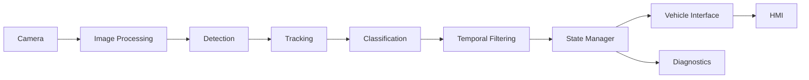

# TSR Feature Architecture

> **[SRC] Narrative entrypoint:** [1.01. Prototype to Production Narrative](../1.narrative/01.prototype_to_production.md) — Lấy: mạch lập luận prototype → production feature. Dùng ở: toàn bài để tách `detector output`, `feature output`, HMI và release scope.
>
> **[SRC] Bài đọc sâu hơn:**
>
> - [2.04. Unified Production Reference](04.unified_production_reference.md) — Lấy: danh sách block production, roadmap và trade-off hệ thống. Dùng ở: mục kiến trúc 3 lớp perception/feature logic/vehicle interface.
> - [2.05. System Diagram](05.system_diagram.md) — Lấy: mapping block và luồng dữ liệu trực quan. Dùng ở: phần giải thích pipeline camera → detector → state/context → HMI/diagnostics.
>
> **Nguồn chính:**
>
> - [ISO 26262-1:2018](https://www.iso.org/standard/68383.html) — Lấy: khái niệm safety lifecycle, item definition và verification traceability. Dùng ở: ranh giới feature architecture với safety/release work products.
> - [ISO 21448:2022](https://www.iso.org/standard/77490.html) — Lấy: ODD, functional insufficiency và residual risk. Dùng ở: yêu cầu feature logic xử lý blur/glare/out-of-ODD trước khi publish.
> - [AUTOSAR Classic Platform](https://www.autosar.org/standards/classic-platform) — Lấy: cách nghĩ software component/ECU/interface. Dùng ở: vehicle interface, diagnostics và boundary giữa app logic với platform.
> - [Regulation (EU) 2019/2144](https://eur-lex.europa.eu/eli/reg/2019/2144/oj) — Lấy: bối cảnh legal của ISA/ADAS safety. Dùng ở: lý do TSR không chỉ là overlay demo mà là input cho HMI/ISA.
> - [2.06. Sources and Provenance](06.sources_and_provenance.md) `[SRC]` — Lấy: quy ước `[SRC]` và danh mục evidence nội bộ. Dùng ở: phân biệt claim dựa trên repo với claim từ chuẩn/paper ngoài.

---

## Purpose

> **Nguồn tại mục:** [2.04. Unified Production Reference](04.unified_production_reference.md) `[SRC]` — Lấy: phân tách perception, feature logic và vehicle integration. Dùng ở: định nghĩa feature TSR không dừng ở detector output.
>
> **Nguồn tại mục:** [2.05. System Diagram](05.system_diagram.md) `[SRC]` — Lấy: luồng camera → detector → state/context → HMI/diagnostics. Dùng ở: câu mô tả pipeline mức hệ thống.

Bài này mô tả feature TSR ở mức hệ thống: perception tạo sign candidate, feature logic quyết định sign nào thật sự áp dụng cho xe, rồi vehicle interface publish kết quả cho HMI hoặc consumer khác.

## Why It Matters for TSR

> **Nguồn tại mục:** [1.01. Prototype to Production Narrative](../1.narrative/01.prototype_to_production.md) `[SRC]` — Lấy: các nhầm lẫn thường gặp giữa prototype demo và production feature. Dùng ở: danh sách detector output / overlay / demo pipeline.
>
> **Nguồn tại mục:** [Regulation (EU) 2019/2144](https://eur-lex.europa.eu/eli/reg/2019/2144/oj) — Lấy: bối cảnh ADAS/ISA có liên quan tới vehicle safety. Dùng ở: lập luận HMI/ISA output không thể xem như overlay demo.

Nếu không hiểu kiến trúc feature, người đọc rất dễ nhầm:

- detector output = feature output,
- overlay = HMI,
- demo pipeline = production architecture.

## Core Concepts

> **Nguồn tại mục:** [2.05. System Diagram](05.system_diagram.md) `[SRC]` — Lấy: block decomposition của TSR stack. Dùng ở: sơ đồ mermaid và bảng vai trò từng block.
>
> **Nguồn tại mục:** [AUTOSAR Classic Platform](https://www.autosar.org/standards/classic-platform) — Lấy: tư duy software component/vehicle interface. Dùng ở: block `Vehicle Interface`, `HMI`, `Diagnostics`.
>
> **Nguồn tại mục:** [ISO 21448:2022](https://www.iso.org/standard/77490.html) — Lấy: need for ODD/quality/degraded behavior với perception. Dùng ở: vai trò Image Processing, State Manager và Diagnostics.

| Block | Vai trò |
|---|---|
| Camera | Cảm biến đầu vào và timing base |
| Image Processing | Conditioning và quality-aware processing |
| Detection | Phát hiện candidate sign |
| Tracking | Nối sign qua nhiều frame |
| Classification | Gán class và semantics |
| Temporal Filtering | Yêu cầu đủ bằng chứng theo thời gian |
| State Manager | Giữ lifecycle sign và feature state |
| Vehicle Interface | Publish signal cho HMI/consumer |
| HMI | Hiển thị/cảnh báo driver-facing |
| Diagnostics | Logging, health, degraded/fault visibility |

## Production Implementation Pattern

> **Nguồn tại mục:** [2.04. Unified Production Reference](04.unified_production_reference.md) `[SRC]` — Lấy: pattern ba lớp `Perception`, `Feature Logic`, `Vehicle Integration`. Dùng ở: danh sách lớp production TSR.
>
> **Nguồn tại mục:** [AUTOSAR Classic Platform](https://www.autosar.org/standards/classic-platform) — Lấy: boundary giữa application logic và platform/vehicle interface. Dùng ở: lớp `Vehicle Integration`.
>
> **Nguồn tại mục:** [Delegated Regulation (EU) 2021/1958](https://eur-lex.europa.eu/eli/reg_del/2021/1958/oj) — Lấy: ISA là consumer có warning/override behavior. Dùng ở: downstream consumers như ISA.

Production TSR thường có ít nhất ba lớp:

1. `Perception`
   Detection, classification, tracking, temporal confirmation.

2. `Feature Logic`
   Context filtering, lane association, fusion, state manager.

3. `Vehicle Integration`
   HMI, diagnostics, downstream consumers như ISA.

## Relation to Current Prototype

> **Nguồn tại mục:** [3.09. Baseline Repo Analysis](../3.implementation/09.baseline_repo_analysis.md) `[SRC]` — Lấy: baseline runtime hiện cover preprocessing tối giản, detection/classification, demo visualization và gap production. Dùng ở: danh sách `Prototype repo hiện tại chủ yếu cover` và `Chưa cover tốt`.
>
> **Nguồn tại mục:** [3.05. Colab Production-Lite Demo](../3.implementation/05.colab_production_lite_demo.md) `[SRC]` — Lấy: notebook có quality gate, ODD gate, track_id, lifecycle state và event log. Dùng ở: phần notebook sidecar mô phỏng production-lite.

Prototype repo hiện tại chủ yếu cover:

- image preprocessing mức tối giản,
- detection,
- classification đi kèm detector,
- temporal filtering lite,
- visualization và alert mức demo.

Chưa cover tốt:

- state manager,
- vehicle interface,
- diagnostics,
- context applicability.

Tuy nhiên, repo hiện đã có thêm notebook sidecar [3.05. Colab Production-Lite Demo](../3.implementation/05.colab_production_lite_demo.md) `[SRC]` để mô phỏng một phần các block này ở mức demo:

- quality gate và ODD gate,
- `track_id` + temporal confirmation lite,
- lifecycle state,
- `events.jsonl`, KPI proxy và optional GT evaluation.

Vì vậy khi đọc repo cần luôn tách:

- `baseline runtime capability`,
- và `production-lite notebook capability`.

## Where to See Implementation Evidence

- [3.09. Baseline Repo Analysis](../3.implementation/09.baseline_repo_analysis.md) `[SRC]`
- [3.05. Colab Production-Lite Demo](../3.implementation/05.colab_production_lite_demo.md) `[SRC]`

## Related Articles

- [2.08. State Manager and Sign Lifecycle](08.state_manager_and_sign_lifecycle.md)
- [2.12. HMI, Diagnostics, and Vehicle Interface](12.hmi_diagnostics_and_vehicle_interface.md)
