# (3) Nghiên Cứu Kiến Trúc Detector cho TSR — Anchor, Head, NMS, và Multi-Scale Fusion

> **Thứ tự đọc:** đọc sau [Baseline Repo Analysis Full](../3.implementation/04.baseline_repo_analysis_full.md).  
> **File này trả lời:** nếu cần đổi hoặc đánh giá detector cho TSR, nên soi vào những trade-off kiến trúc nào.  
> **Ngoài phạm vi:** kể lại production pipeline TSR từ đầu đến cuối; narrative đó nằm ở [Unified Production Reference](12.unified_production_reference.md).

## 1. Metadata

| Thuộc tính | Giá trị |
|---|---|
| Phạm vi | Lý thuyết và so sánh kiến trúc object detection áp dụng cho Traffic Sign Recognition |
| Đối tượng đọc | Research engineer, tech lead — đọc độc lập, không cần mở `tsr_demo.py` |
| Liên kết triển khai repo | [Baseline Repo Analysis Full](../3.implementation/04.baseline_repo_analysis_full.md) |
| Liên kết narrative hệ thống | [Unified Production Reference](12.unified_production_reference.md) |
| Ngày cập nhật | 2026-06-29 |

## 2. Tóm tắt

TSR trên xe là bài toán **small-object detection** trong scene lớn, với yêu cầu latency chặt và false advisory thấp. Kiến trúc detector quyết định ba nhóm trade-off:

1. **Độ nhạy biển nhỏ ở xa** — phụ thuộc backbone + neck multi-scale.
2. **Độ ổn định output theo thời gian** — phụ thuộc head design + NMS/post-process (hoặc end-to-end).
3. **Khả năng triển khai edge** — phụ thuộc FLOPs, memory, export toolchain.

Tài liệu giải thích các thuật ngữ: **anchor-based / anchor-free**, **coupled / decoupled head**, **NMS-based / NMS-free**, **FPN / PANet / BiFPN**, **hybrid encoder (RT-DETR)** — kèm ví dụ TSR và bảng so sánh.

Đây là deep-dive chuẩn cho chủ đề detector trong perception. Khi cần trace biểu hiện của các trade-off này trong repo hiện tại, quay lại [Baseline Repo Analysis Full](../3.implementation/04.baseline_repo_analysis_full.md); khi cần hệ quả system-level lên HMI, diagnostics hay maturity, quay lại [Unified Production Reference](12.unified_production_reference.md).

### 2.1 Legend màu Mermaid

> Legend này áp dụng cho các sơ đồ Mermaid đã được tô màu trong tài liệu. Không phải sơ đồ nào cũng dùng đủ mọi nhóm màu.

| Màu | Vai trò | Ý nghĩa |
|---|---|---|
| <span style="display:inline-block;width:14px;height:14px;border:1px solid #C78600;background:#FFF5DD;"></span> | `baseline` | Baseline architecture, đường tham chiếu hiện tại, hoặc input branch gốc |
| <span style="display:inline-block;width:14px;height:14px;border:1px solid #2F66D0;background:#EDF3FF;"></span> | `feature` | Backbone, detector core, classifier core, hoặc processing block chính |
| <span style="display:inline-block;width:14px;height:14px;border:1px solid #7C3AED;background:#F4ECFF;"></span> | `temporal` | Track update, stateful merge, hoặc nhánh cần ổn định theo thời gian |
| <span style="display:inline-block;width:14px;height:14px;border:1px solid #14866D;background:#EAF7F2;"></span> | `source` | Ảnh vào, dataset input, replay input, hoặc data source |
| <span style="display:inline-block;width:14px;height:14px;border:1px solid #1E8E5A;background:#E8F7EE;"></span> | `integration` | Output cuối, feature output, benchmark result, hoặc merged result |
| <span style="display:inline-block;width:14px;height:14px;border:1px solid #C2410C;background:#FDECEC;"></span> | `risk` | Block release, parity fail, hoặc nhánh thể hiện rủi ro/không đạt |
| <span style="display:inline-block;width:14px;height:14px;border:1px solid #D97706;background:#FFF1E0;"></span> | `decision` | Decision node, branch chọn hướng xử lý, hoặc gate điều kiện |
| <span style="display:inline-block;width:14px;height:14px;border:1px solid #DB2777;background:#FCEFF5;"></span> | `support` | ROI pass, utility head, support branch, OCR branch, hoặc helper stage |

---

## 3. Khung phân tích một detector hiện đại


| Thành phần | Câu hỏi thiết kế | Liên quan TSR |
|---|---|---|
| Backbone | Trích đặc trưng semantic ở scale nào? | Biển nhỏ cần feature map độ phân giải cao |
| Neck | Kết hợp low-level + high-level thế nào? | **Quan trọng nhất** cho biển xa |
| Head | Anchor hay point-based? Head tách hay chung? | Ảnh hưởng localization class nhỏ |
| Post-process | NMS hay end-to-end? | Ảnh hưởng duplicate / miss khi nhiều biển |

**Ví dụ TSR:** Biển `50` cách 40 m, chiếm 24×24 px trên 1920×1080. Backbone stride-32 có thể “nhìn thấy” vùng đỏ mờ; neck FPN đưa feature P3/P4 (stride 8/16) giúp head regression chính xác hơn.

---

## 4. Anchor-based vs Anchor-free

### 4.1 Định nghĩa

| Thuật ngữ | Ý nghĩa |
|---|---|
| **Anchor-based** | Mỗi vị trí trên feature map gắn với một hoặc nhiều **prior box** (anchor) có kích thước/tỉ lệ cố định. Head dự đoán **offset** so với anchor + class. |
| **Anchor-free** | Không dùng prior box. Head dự đoán trực tiếp **tâm object** (center-ness) hoặc **góc/biên** (corner/center-to-boundary). |

### 4.2 Cơ chế (trực giác)

**Anchor-based (YOLO, SSD, Faster R-CNN):**

```
Feature map cell (i,j) + anchor 32×32  →  predict Δx, Δy, Δw, Δh, P(class)
```

**Anchor-free (FCOS, CenterNet-style):**

```
Feature map cell (i,j) nếu nằm trong vùng center của object  →  predict l,t,r,b distances + P(class)
```

### 4.3 Ví dụ TSR

| Tình huống | Anchor-based | Anchor-free |
|---|---|---|
| Biển tròn chuẩn, scale ổn định | Anchor aspect ~1:1 khớp tốt | Center point ở giữa biển, regression 4 cạnh |
| Biển xiên (góc camera) | Anchor fixed aspect **lệch** → cần nhiều anchor ratio | Một số anchor-free **linh hoạt hơn** với biên |
| Nhiều biển cùng loại gần nhau | Nhiều anchor match → **NMS quan trọng** | Ít duplicate anchor nhưng vẫn cần suppress |

### 4.4 Trade-off cho embedded TSR

| | Anchor-based | Anchor-free |
|---|---|---|
| Độ trưởng thành toolchain | Cao (YOLO ecosystem) | Trung bình |
| Hyperparameter | Nhiều (anchor size, IoU match) | Ít hơn |
| Small object | Tốt nếu anchor/stride calibrate | Tốt với center sampling đúng |
| Repo hiện tại | **YOLO11s = anchor-based family** | Chưa dùng |

Nguồn: [YOLO](https://arxiv.org/abs/1506.02640), [FCOS](https://arxiv.org/abs/1904.01355) (anchor-free representative)

---

## 5. Coupled head vs Decoupled head

### 5.1 Định nghĩa

| Thuật ngữ | Ý nghĩa |
|---|---|
| **Coupled head** | Một nhánh conv chung (shared features) cho cả **classification** và **box regression**. |
| **Decoupled head** | **Tách** hai (hoặc nhiều) nhánh: một cho class, một cho localization (thường depthwise separable). |

### 5.2 Vì sao tách head?

Classification cần feature **semantic** (màu, symbol); localization cần feature **spatial** (biên, góc). Dùng chung một representation có thể **xung đột gradient** — class đúng nhưng box lệch, hoặc ngược lại.

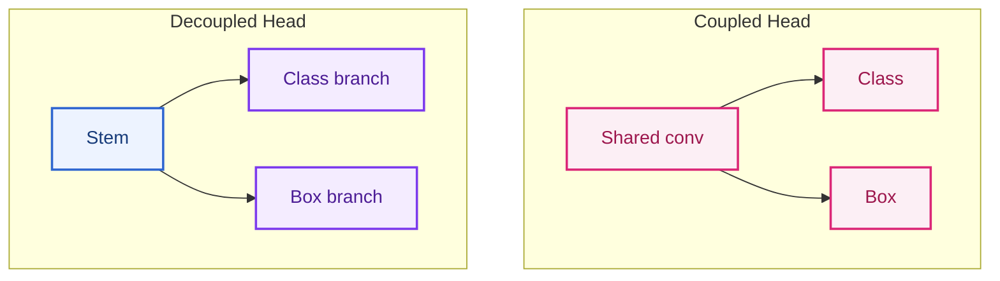

### 5.3 Ví dụ TSR

**Biển `Speed limit 50` vs `Speed limit 60`:**

- Hai class khác nhau nhưng bbox gần giống hệt.
- **Coupled head:** dễ nhầm class khi digit nhỏ (feature shared nghiêng về localization).
- **Decoupled head:** nhánh class có thể học texture digit tốt hơn khi nhánh box giữ spatial ổn định.

**Biển cảnh báo tam giác vs biển tròn cấm:**

- Coupled có thể “đoán class từ màu đỏ chung” nếu box branch không đủ mạnh.
- Decoupled giúp tách **shape cue** (box branch) và **symbol cue** (class branch).

YOLOv6+ và nhiều biến thể YOLO hiện đại dùng **decoupled head**; YOLO11 tiếp tục tradition này trong Ultralytics stack.

---

## 6. NMS-based vs NMS-free / End-to-end

### 6.1 Định nghĩa

| Thuật ngữ | Ý nghĩa |
|---|---|
| **NMS (Non-Maximum Suppression)** | Hậu xử lý: giữ box confidence cao, **loại box trùng** IoU &gt; ngưỡng. |
| **NMS-based pipeline** | Detector sinh nhiều candidate → **bắt buộc NMS** trước output. |
| **NMS-free / End-to-end** | Mô hình học trực tiếp **tập prediction không trùng** (DETR, RT-DETR) — không NMS cổ điển ở inference. |

### 6.2 Ví dụ TSR — nhiều biển trong một frame

Cảnh quốc lộ: biển `80`, biển `60` phía sau, biển `No overtaking` bên phải.

| Pipeline | Hành vi |
|---|---|
| NMS-based | 15 raw boxes → NMS IoU 0.45 → 3 boxes. **Rủi ro:** hai biển chồng nhẹ → mất một box |
| NMS-free (DETR) | 100 queries → Hungarian matching → 3 boxes. **Rủi ro:** query collision khi train chưa đủ diverse |

### 6.3 Trade-off

| | NMS-based (YOLO) | NMS-free (RT-DETR) |
|---|---|---|
| Latency | NMS thêm ~1–5 ms tùy số box | Bỏ NMS nhưng decoder nặng hơn |
| Determinism | Phụ thuộc thứ tự sort + IoU thresh | Ổn định hơn nếu fixed queries |
| Tuning | `iou_thresh`, `conf_thresh` | `num_queries`, matcher cost |
| `tsr_demo.py` | `non_max_suppression_simple` IoU 0.45 | Chưa áp dụng |

**Điểm yếu cụ thể khi thiếu tuning NMS (baseline repo):** Hai biển speed gần nhau trên cùng cột → IoU &gt; 0.45 → chỉ giữ box lớn hơn (sort theo diện tích trong `non_max_suppression_simple`).

Nguồn: [DETR](https://arxiv.org/abs/2005.12872), [RT-DETR](https://arxiv.org/abs/2304.08069)

---

## 7. FPN, PANet, BiFPN — Neck multi-scale

### 7.1 Vấn đề cần giải quyết

Backbone CNN sâu (ResNet, CSPDarknet) tạo feature:

- **Shallow layers:** độ phân giải cao, semantic yếu — tốt cho **vị trí**.
- **Deep layers:** semantic mạnh, resolution thấp — tốt cho **class**.

Biển báo xa = **small object** → cần kết hợp cả hai.

### 7.2 FPN (Feature Pyramid Network)

**Ý tưởng:** Top-down pathway — upsample feature semantic cao, **cộng** (lateral connection) với feature resolution cao từ backbone.

```
P5 (semantic) ──upsample──┐
                          ⊕ → P4
P4 (backbone) ────────────┘
```

**Ví dụ TSR:** P3 (stride 8) giúp detect biển ~32 px; P5 (stride 32) giúp context “đây là đường cao tốc”.

Nguồn: [FPN](https://arxiv.org/abs/1612.03144)

### 7.3 PANet (Path Aggregation Network)

**Bổ sung FPN:** Thêm **bottom-up path** sau top-down — information từ low-level đi ngược lên lần nữa.

```
Top-down (FPN) + Bottom-up aggregation
```

**Ví dụ TSR:** Biển nhỏ sau cây che một phần — bottom-up giúp **localization cue** từ edge low-level không bị “loãng” chỉ qua top-down.

Nguồn: [PANet](https://arxiv.org/abs/1803.00894)

### 7.4 BiFPN (Bidirectional FPN — EfficientDet)

**Cải tiến:**

- **Weighted feature fusion** — học trọng số cho từng nhánh thay vì cộng đều.
- **Repeated bidirectional fusion** — nhiều vòng top-down + bottom-up với depthwise separable conv (nhẹ hơn).

**Ví dụ TSR:** Trong cảnh đông biển + xe + cây, BiFPN ưu tiên feature level nào đóng góp nhiều cho từng scale — hữu ích khi class long-tail cần semantic mạnh ở P4 nhưng vị trí ở P3.

Nguồn: [EfficientDet](https://arxiv.org/abs/1911.09070)

### 7.5 Bảng so sánh neck cho TSR

| Neck | Luồng thông tin | Ưu điểm TSR | Nhược điểm |
|---|---|---|---|
| FPN | Top-down | Đơn giản, đủ cho biển vừa/nhỏ | Small object cực nhỏ vẫn khó |
| PANet | Top-down + bottom-up | Localization tốt hơn FPN | Thêm latency |
| BiFPN | Bidirectional + weighted | Cân bằng accuracy/latency tốt | Phức tạp train/export |
| YOLO11 neck (C2f/C3k2 + PAN) | Gần PAN family | Ecosystem Ultralytics | Phụ thuộc phiên bản YOLO |

**Liên hệ repo:** YOLO11s dùng neck kiểu **PAN-FPN hybrid** trong họ Ultralytics — baseline đã có multi-scale, nhưng **không thay thế** việc giữ resolution đầu vào (`max_width`, `imgsz`) khi biển quá nhỏ sau resize (xem baseline analysis §5).

---

## 8. Hybrid encoder trong RT-DETR

### 8.1 Bối cảnh

DETR gốc chậm vì transformer encoder xử lý feature full resolution. **RT-DETR** (Real-Time DETR) tối ưu cho deployment:

- **Hybrid encoder:** Kết hợp **CNN backbone** (local feature, hiệu quả) + **Transformer encoder nhẹ** (global context, ít token).
- **IoU-aware query selection** — chọn query chất lượng cao, giảm số layer decoder cần thiết.

```mermaid
flowchart LR
    A[Image] --> B[CNN Backbone]
    B --> C[Efficient Hybrid Encoder]
    C --> D[Query Selection]
    D --> E[Transformer Decoder]
    E --> F[Set Predictions no NMS]

    classDef source fill:#EAF7F2,stroke:#14866D,color:#0F4C3F,stroke-width:2px;
    classDef feature fill:#EDF3FF,stroke:#2F66D0,color:#173B7A,stroke-width:2px;
    classDef support fill:#FCEFF5,stroke:#DB2777,color:#9D174D,stroke-width:2px;
    classDef integration fill:#E8F7EE,stroke:#1E8E5A,color:#14532D,stroke-width:2px;
    class A source;
    class B,E feature;
    class C,D support;
    class F integration;
```

### 8.2 Giải thích thuật ngữ

| Thuật ngữ | Ý nghĩa |
|---|---|
| **Hybrid encoder** | Không chạy self-attention trên toàn bộ feature map; thường **downsample + cross-scale fusion** rồi attention trên tập token đã chọn. |
| **Query** | Vector học được đại diện cho “một object giả định” — decoder refine thành box + class. |
| **Set prediction** | Output là tập cố định N predictions; training dùng bipartite matching (Hungarian). |

### 8.3 Ví dụ TSR

**Cảnh nhiều biển + biển quảng cáo sign-like:**

- CNN backbone: phát hiện vùng đỏ tròn cục bộ.
- Transformer encoder: **global context** — biển trên cao vs biển ven đường.
- Không NMS: tránh merge nhầm hai biển speed khác nhau cùng cột (nếu train đủ).

**So với YOLO11s trong repo:**

| Tiêu chí | YOLO11s (repo) | RT-DETR |
|---|---|---|
| Post-process | NMS + conf thresh | End-to-end set |
| Export edge | ONNX/OpenVINO mature | Cải thiện nhưng nặng hơn YOLO-nano |
| Fine-tune 82 class VN | Đã có `best.pt` | Cần train lại + benchmark deployment |
| Latency CPU | ~140 ms (đo local) | Cần đo riêng trên cùng hardware |

### 8.4 Production Implementation Pattern

| Pattern | Implementation |
|---|---|
| Candidate architecture A/B | Benchmark YOLO11s, YOLO11n, RT-DETR variant trên cùng protocol. |
| NMS-free validation | Đo duplicate, miss adjacent signs, latency p95/p99. |
| Hybrid deployment | CNN detector production, transformer offline mining hoặc teacher model. |
| Distillation | Dùng transformer teacher để cải thiện lightweight student. |
| Query budget tuning | Giảm `num_queries` nếu traffic sign density thấp. |

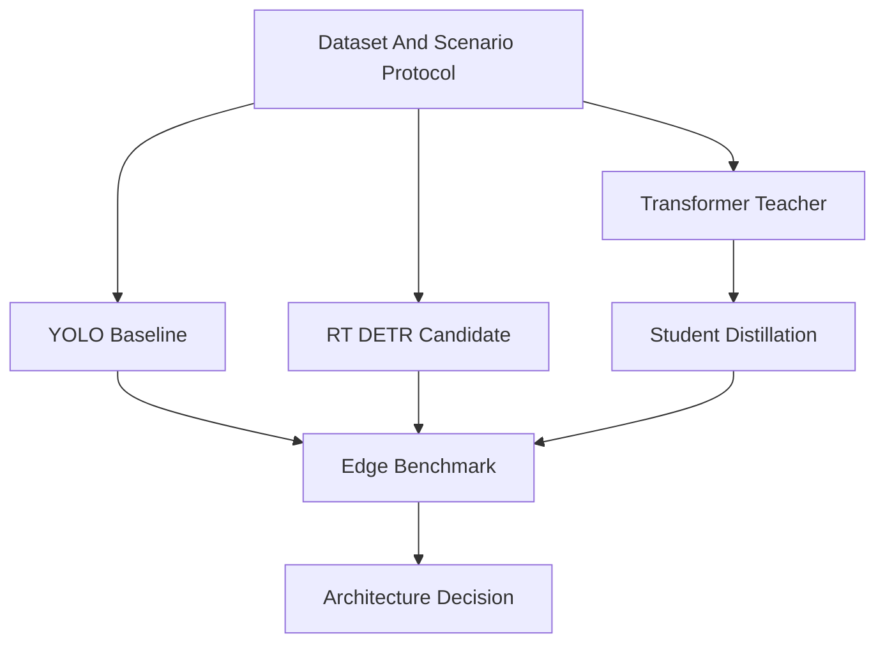

### 8.5 Trade-Offs

| Quyết Định | Ưu Điểm | Rủi Ro |
|---|---|---|
| YOLO family | Mature edge tooling, low latency | NMS tuning, duplicate/suppress issues. |
| RT-DETR | NMS-free, strong global context | Decoder/attention cost, export maturity phải kiểm. |
| Transformer teacher only | Tăng data mining và pseudo-label quality | Production vẫn phụ thuộc student consistency. |
| Full transformer production | Architecture hiện đại | Embedded risk nếu không đạt deterministic latency. |

### 8.6 Gap Repo Hiện Tại

Repo dùng Ultralytics YOLO `.pt`, chưa có abstraction để swap architecture, chưa có benchmark architecture A/B, chưa có ONNX/TensorRT/OpenVINO export protocol và chưa đo duplicate/miss theo cảnh nhiều biển. Bước production là biến phần RT-DETR lý thuyết ở trên thành experiment protocol có KPI gate.

Nguồn: [RT-DETR](https://arxiv.org/abs/2304.08069)

---

## 9. Bảng tổng hợp lựa chọn kiến trúc cho TSR automotive

| Nhu cầu hệ thống | Hướng kiến trúc ưu tiên | Lý do |
|---|---|---|
| Prototype CPU, có weights VN | YOLO small + PAN neck (**hiện tại**) | Ecosystem, đã train 82 class |
| Biển nhỏ ở xa, cùng model | Tăng input res + FPN/P3 head tuning; small-object aug | Neck alone không đủ nếu resize phá pixel |
| Giảm duplicate / NMS tuning | Thử soft-NMS, class-aware NMS; hoặc RT-DETR | Giảm mất box chồng nhẹ |
| Class speed dễ nhầm | Decoupled head + OCR branch | Tách digit semantics |
| Edge NPU &lt; 30 ms | YOLO INT8 TensorRT / OpenVINO | RT-DETR thường nặng hơn ở cùng accuracy |
| Research SOTA accuracy | Two-stage hoặc large YOLO / RT-DETR-L | Không ưu tiên latency |

---

## 10. Câu hỏi tự kiểm tra (research)

1. Vì sao TSR coi neck quan trọng hơn backbone đơn thuần khi biển ở xa?
2. Anchor-based YOLO gặp khó khăn gì khi biển xiên mạnh?
3. Decoupled head giúp giảm nhầm `50` vs `60` theo cơ chế nào?
4. NMS IoU 0.45 có thể gây miss detection trong cảnh nào?
5. RT-DETR “NMS-free” có nghĩa là không cần hậu xử lý nào sao?
6. FPN vs PANet vs BiFPN — khác biệt một câu mỗi loại?

---

## Key Takeaways

| Điểm chính | Ý nghĩa |
|---|---|
| Neck (FPN/PAN/BiFPN) quan trọng hơn backbone đơn thuần cho biển xa | Small object cần feature stride 8/16, không chỉ semantic sâu |
| YOLO11s repo = anchor-based + decoupled head + NMS | `non_max_suppression_simple` IoU 0.45 + sort area là điểm yếu TSR đông biển |
| RT-DETR NMS-free hữu ích multi-sign nhưng nặng edge | Pattern thực dụng: YOLO production + transformer teacher/mining |
| Decoupled head giúp tách digit semantics (`50` vs `60`) | Cần thêm OCR branch nếu class speed dễ nhầm |
| Kiến trúc không thay thế resolution policy | `max_width` + `imgsz` trong `tsr_demo.py` quyết định pixel còn lại cho head |

## Common Engineering Mistakes

| Lỗi | Hậu quả |
|---|---|
| Chọn transformer vì trend, không benchmark p99 trên ECU | Latency/memory fail dù mAP lab đẹp |
| Tune NMS trên dataset crop, không trên full scene | Miss adjacent signs trên đường thật |
| Bỏ qua export parity khi đổi kiến trúc | ONNX/TensorRT output khác PyTorch âm thầm |
| So sánh YOLO vs DETR trên protocol khác nhau | Kết luận architecture không có giá trị |
| Tin neck đủ mà không tăng input resolution | Biển &lt;16 px sau resize vẫn miss dù FPN tốt |

---

## 12. Small Object Detection Theory Cho TSR

### 12.1 Lý Thuyết

Traffic sign thường là **small object** vì biển ở xa chỉ chiếm vài chục pixel trên frame full HD hoặc 4K. Vấn đề không chỉ là kích thước bbox nhỏ; đó là tổng hợp của scale, motion blur, compression, perspective, occlusion, class similarity và quantization noise.

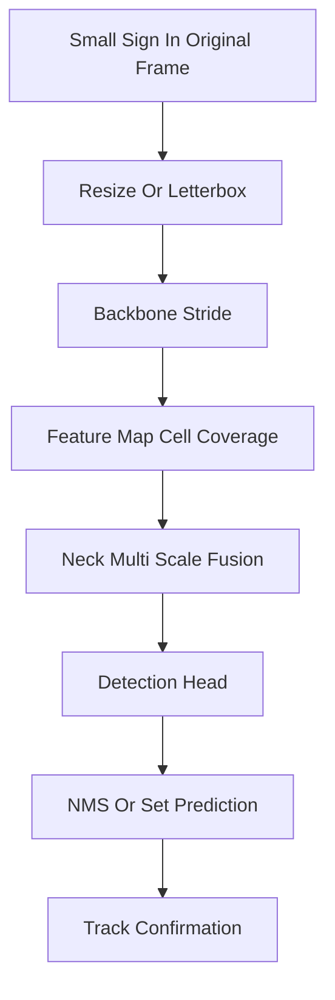

Một biển `Speed limit 50` có đường kính 24 px trên ảnh 1920×1080. Nếu detector dùng feature stride 32, object gần như rơi vào một cell hoặc ít hơn. Vì vậy, small object detection phụ thuộc mạnh vào:

#### 12.1.1 Công Thức Và Intuition Kỹ Thuật

**Kích thước biển sau preprocess** — với frame gốc rộng $W_{orig}$, resize về `max_width` $W_{max}$, và YOLO letterbox/resize về `imgsz` $S$:

$$
h_{net} \approx h_{orig} \cdot \frac{W_{max}}{W_{orig}} \cdot \frac{S}{\max(W_{proc}, H_{proc})}
$$

Trong đó $h_{orig}$ là chiều cao bbox trên frame gốc, $W_{proc}$ và $H_{proc}$ là kích thước sau `preprocess()`. Với `tsr_demo.py` mặc định `--max-width 1280 --imgsz 640` trên video 4K (3840 px), hệ số co ~$1280/3840 \times 640/1280 \approx 0.17$ — biển 40 px gốc còn ~7 px trên tensor inference, dưới ngưỡng usable cho hầu hết head stride 8/16.

**Ngưỡng detectable size theo stride** — heuristic thực dụng trong design review:

| Feature level | Stride $s$ | Kích thước object tối thiểu khuyến nghị |
|---|---|---|
| P3 | 8 | $\geq 16$ px (2 cell) |
| P4 | 16 | $\geq 32$ px |
| P5 | 32 | $\geq 64$ px |

**Time-to-sign** — khoảng thời gian từ lần detect đầu tiên đến khi xe đi qua biển:

$$
T_{ttf} = \frac{D_{sign}}{v_{ego}} - t_{confirm} - t_{latency}
$$

Với $D_{sign}$ là khoảng cách còn lại khi detect lần đầu, $v_{ego}$ tốc độ ego, $t_{confirm}$ thời gian temporal confirmation, $t_{latency}$ pipeline delay. Ở 80 km/h (~22 m/s), detect muộn 1 giây tương đương mất ~22 m thời gian advisory — đủ để ISA/HMI trở nên vô nghĩa.

**IoU sensitivity** — với object nhỏ, lệch label vài pixel làm IoU giảm mạnh. Bbox 16×16 lệch 2 px mỗi cạnh có thể rơi từ IoU 1.0 xuống ~0.56 — đủ fail gate mAP50-95 dù detector "nhìn thấy" biển.

| Yếu Tố | Tác Động |
|---|---|
| Input resolution | Resize quá mạnh làm mất digit hoặc viền biển. |
| Feature stride | Stride 8/16 quan trọng hơn stride 32 cho biển xa. |
| Neck fusion | FPN/PAN/BiFPN đưa semantic xuống feature map độ phân giải cao. |
| Label quality | Bbox lệch vài pixel làm IoU giảm mạnh với object nhỏ. |
| Augmentation | Mosaic, copy-paste, blur, glare synth giúp tăng độ phủ ODD. |
| Thresholding | Confidence thấp ở object nhỏ cần calibration theo class/size. |

### 12.2 Vì Sao Quan Trọng Trong Automotive

TSR càng phát hiện biển sớm thì feature càng có thời gian confirm, associate lane, fuse map và hiển thị không giật. Nếu chỉ nhận được biển khi xe đã đi sát, advisory đến muộn và ISA không còn giá trị. Small object failure cũng là nguồn SOTIF lớn vì hệ thống không bị fault phần cứng nhưng vẫn insufficient trong điều kiện hợp lý như nắng xiên, biển xa hoặc camera rung.

### 12.3 Ví Dụ TSR Thực Tế

| Ví Dụ | Root Cause Small Object | Hành Vi Production Mong Muốn |
|---|---|---|
| Biển `50` chỉ hiện ở 18 px sau resize | `max_width` thấp, `imgsz` thấp | Tăng resolution path hoặc dùng small-object ROI pass. |
| Biển `No overtaking` nằm sau biển speed | NMS merge hoặc suppress | Class-aware NMS hoặc tracker tách track qua thời gian. |
| Digit `60` thành `80` ban đêm | Reflective glare và digit nhỏ | Quality score thấp, confirmation nhiều frame, per-class threshold. |
| Biển tam giác bị xiên | Bbox aspect thay đổi, shape cue yếu | Perspective augmentation và anchor/anchor-free tuning. |

### 12.4 Production Implementation Pattern

| Pattern | Cách Làm | Trade-Off |
|---|---|---|
| Multi-scale training | Train với scale jitter, mosaic, copy-paste sign nhỏ | Có thể tăng false positive trên object sign-like. |
| Higher inference resolution | `imgsz=768/960`, giữ `max_width` cao | Latency và memory tăng. |
| ROI second pass | Pass đầu tìm vùng road side, pass hai crop high-res | Pipeline phức tạp, cần tránh double counting. |
| Feature pyramid tuning | Dùng P2/P3 cho small objects | Tăng compute ở feature map lớn. |
| Size-aware confidence | Threshold riêng cho small/medium/large sign | Cần validation theo bin kích thước. |
| Temporal accumulation | Confirm biển nhỏ qua nhiều frame | Tăng delay, cần ego-motion compensation. |

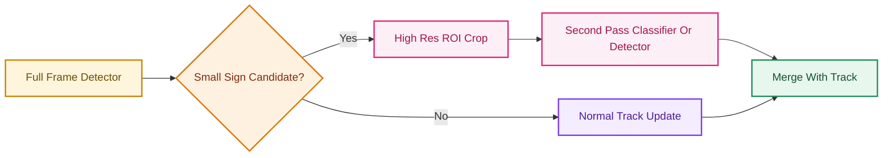

### 12.5 Gap Repo Hiện Tại

| Repo Detail | Production Gap |
|---|---|
| `preprocess()` chỉ resize theo `--max-width` | Không có small-object preserving policy theo tốc độ, FOV hoặc expected sign distance. |
| `detect_with_yolo()` dùng một `imgsz` | Không có multi-scale inference hoặc ROI pass. |
| `non_max_suppression_simple()` sort theo diện tích | Có thể giữ box lớn sai và bỏ box nhỏ đúng khi overlap. |
| Không có bin KPI theo bbox size | Không biết recall của biển 0-16 px, 16-32 px, 32-64 px. |

### 12.6 Nguồn Tham Khảo

| Chủ Đề | Nguồn |
|---|---|
| YOLO real-time detection | https://arxiv.org/abs/1506.02640 |
| FPN | https://arxiv.org/abs/1612.03144 |
| EfficientDet/BiFPN | https://arxiv.org/abs/1911.09070 |
| TT100K large-scale traffic sign benchmark | https://cg.cs.tsinghua.edu.cn/traffic-sign/ |

---

## 13. Dataset Comparison Cho TSR

### 13.1 Lý Thuyết

Dataset quyết định model nhìn thấy thế giới nào. TSR production cần phân biệt:

| Loại Dataset | Mục Đích |
|---|---|
| Classification crop | Học class sign sau khi đã crop. |
| Detection full image | Học phát hiện sign trong scene lớn. |
| Country-specific | Học taxonomy và hình dạng biển của quốc gia. |
| Global dataset | Học diversity về quốc gia, thời tiết, camera và sign style. |
| Edge-case dataset | Học glare, night, blur, occlusion, construction. |

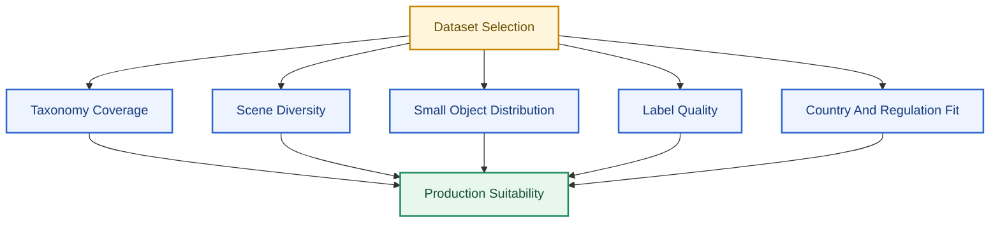

### 13.2 Dataset So Sánh

> **Provenance:** Số liệu dưới đây lấy từ trang benchmark chính thức hoặc paper gốc. Trước release, phải kiểm lại package/split thực tế — đặc biệt Mapillary và CCTSDB có nhiều phiên bản.

| Dataset | Nhiệm Vụ | Quy Mô (nguồn chính thức) | Taxonomy / Ghi chú | Điểm mạnh TSR | Hạn chế production | Phù hợp repo |
|---|---|---|---|---|---|---|
| **GTSRB** | Classification crop | >40 class, >50,000 ảnh crop ([benchmark.ini.rub.de](http://benchmark.ini.rub.de/gtsrb_dataset.html)) | 43 class thường dùng trong paper; ảnh 15–250 px | Benchmark cổ điển, label ổn định | **Không phải** full-scene detection; Đức-only; không có lane context | Pretrain classifier head, sanity check |
| **GTSDB** | Detection full image | **900 ảnh** (600 train + 300 eval); 0–6 sign/ảnh; sign 16–128 px ([GTSDB page](https://benchmark.ini.rub.de/gtsdb_dataset.html)) | 3 category: prohibitive, danger, mandatory | Nhỏ, dễ reproduce baseline detector | Quá nhỏ cho modern deep learning; diversity hạn chế | So sánh kiến trúc nhanh, không claim production |
| **TT100K** | Detection + classification | **100,000 ảnh**, **30,000** sign instances ([Tsinghua page](https://cg.cs.tsinghua.edu.cn/traffic-sign/)) | Taxonomy Trung Quốc; bản 2021 mở rộng classification | Large-scale, small sign trong wild, weather variation | Country-specific; long-tail; license CC-BY-NC | Pretrain/finetune, small-object aug ideas |
| **Mapillary TSD** | Detection + classification global | Hàng trăm nghìn ảnh, ~300+ class, đa quốc gia ([arXiv:1909.04422](https://arxiv.org/abs/1909.04422)) | Global taxonomy phức tạp | Diversity camera/country cao nhất trong public set | License, class mapping nặng; không thay fleet data | Domain adaptation, taxonomy study |
| **CCTSDB** | Detection Trung Quốc | ~1,600+ ảnh trong bản gốc; CCTSDB-AUG mở rộng synthetic ([arXiv:2309.06902](https://arxiv.org/abs/2309.06902)) | Biển Trung Quốc | Augmentation pipeline cho rare sign | Package/split cần verify; không map trực tiếp VN | Research augmentation, không dùng làm KPI chính |
| **Traffic-sign-detection-VietNam** | Detection VN | **10,157 ảnh**, **82 class**, ~19,748 instance ([HF dataset](https://huggingface.co/datasets/star092304/Traffic-sign-detection-VietNam)) | Taxonomy VN; long-tail 16/82 class <100 instance | **Baseline repo** — fit biển VN | Chưa đủ ODD production (glare/night/construction) | **Primary** cho `best.pt` |

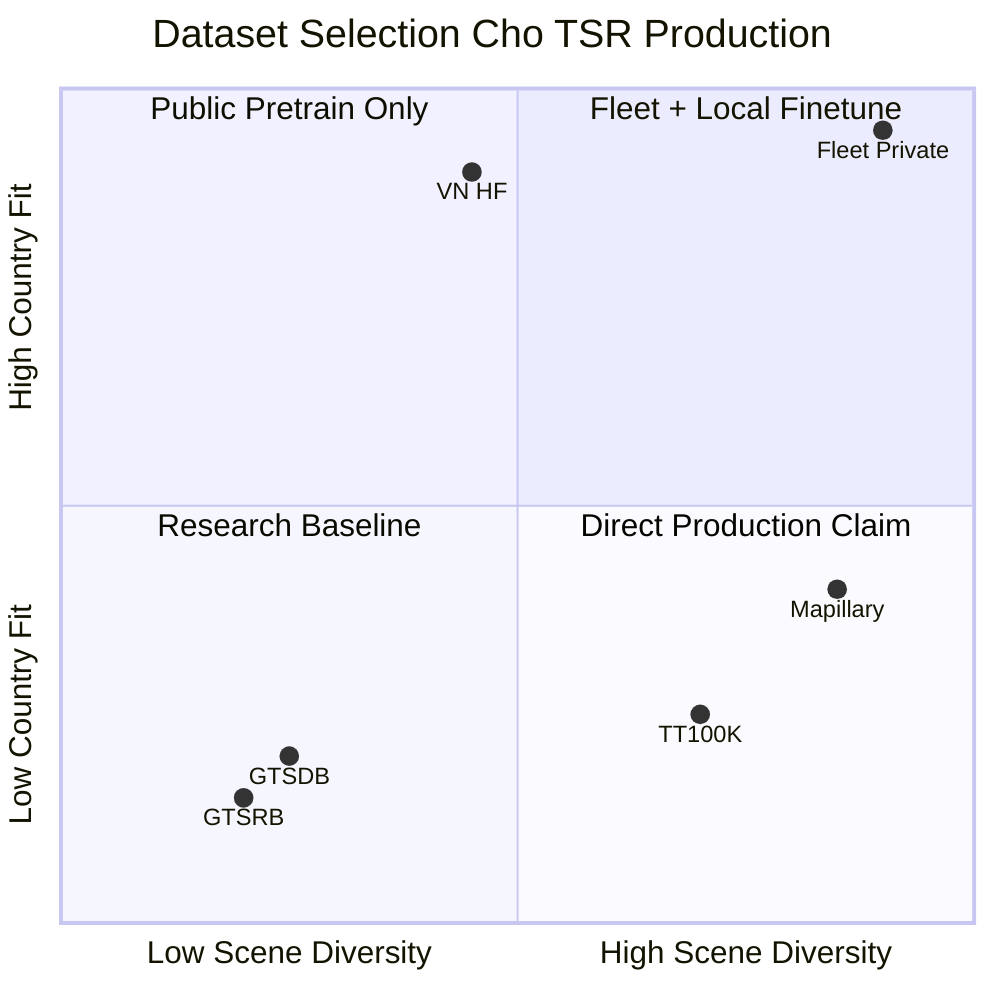

**Chiến lược dataset production khuyến nghị cho repo:**

| Phase | Dataset mix | Mục tiêu |
|---|---|---|
| Research/baseline | VN HF 100% | Fit 82 class, benchmark `tsr_demo.py` |
| Pretrain (optional) | Mapillary hoặc TT100K → finetune VN | Tăng small-object và diversity |
| Production validation | **Fleet/route catalog riêng** | KPI event-level, không dùng public set làm gate duy nhất |
| Edge-case mining | GLARE + hard negative từ field | SOTIF trigger coverage |

### 13.3 Vì Sao Quan Trọng Trong Automotive

Không dataset công khai nào tự nó đủ để release TSR production. OEM/Tier-1 thường cần private fleet data theo ODD, country, camera, lens, mount, ISP, weather, road type và customer usage. Dataset công khai dùng tốt cho pretraining, sanity benchmark và architecture comparison, nhưng production validation phải chạy trên scenario catalog và route coverage.

### 13.4 Ví Dụ TSR Thực Tế

| Sai Lầm Dataset | Hậu Quả |
|---|---|
| Train nhiều crop classification nhưng ít full scene | Model classify tốt khi crop đúng, nhưng detector miss biển xa. |
| Dùng dataset Đức để claim Việt Nam | Taxonomy, sign style, text và road environment khác. |
| Không kiểm long-tail | Class hiếm như construction, surveillance, lane-specific sign fail. |
| Không có negative mining | Biển quảng cáo đỏ/tròn tạo false positive. |

### 13.5 Production Implementation Pattern

| Pattern | Implementation |
|---|---|
| Dataset card | Ghi source, license, country, camera, split, class taxonomy, label policy. |
| Class mapping | Map public dataset class vào internal ontology, giữ unmapped class. |
| Scenario tagging | Gắn tag: day/night/rain/glare/urban/highway/tunnel/construction. |
| Size bins | Report KPI theo bbox pixel area hoặc sign distance proxy. |
| Hard negative loop | Thu thập false positive sign-like và đưa vào retraining/eval. |
| Split hygiene | Route-level split, không để frame gần nhau rơi vào train/test khác nhau. |

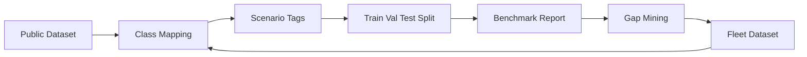

### 13.6 Trade-Offs

| Quyết Định | Ưu Điểm | Rủi Ro |
|---|---|---|
| Pretrain global, finetune country | Diversity tốt, adapt local | Class mapping và label inconsistency. |
| Country-only training | Fit taxonomy địa phương | Generalization kém trong rare ODD. |
| Synthetic augmentation | Tăng edge case nhanh | Domain gap nếu render không thực. |
| Large taxonomy | Bao phủ nhiều sign | Long-tail và confusion tăng. |

### 13.7 Gap Repo Hiện Tại

Repo dùng model 82 class từ dataset Việt Nam upstream. Tài liệu baseline đã nêu long-tail và scale dataset. Còn thiếu dataset card nội bộ, scenario coverage matrix, route-level split protocol, hard negative catalog, per-class confusion và KPI theo size/weather/night.

### 13.8 Nguồn Tham Khảo

| Dataset | Nguồn |
|---|---|
| GTSRB | http://benchmark.ini.rub.de/?section=gtsrb&subsection=dataset |
| GTSDB | https://benchmark.ini.rub.de/?section=gtsdb&subsection=dataset |
| TT100K | https://cg.cs.tsinghua.edu.cn/traffic-sign/ |
| Mapillary Traffic Sign Dataset | https://arxiv.org/abs/1909.04422 |
| CCTSDB-AUG related paper | https://arxiv.org/abs/2309.06902 |
| Vietnam HF model/dataset | https://huggingface.co/star092304/traffic-sign-detection-vietnam-yolo |

---

## 14. Edge Deployment: ONNX, TensorRT, OpenVINO, INT8

### 14.1 Lý Thuyết

Edge deployment chuyển model research sang runtime chạy ổn định trên ECU/SoC với latency, memory, thermal và determinism đạt target. Các bước thường gồm export graph, optimize kernel, quantize, calibrate, validate numerical parity và benchmark trên target.

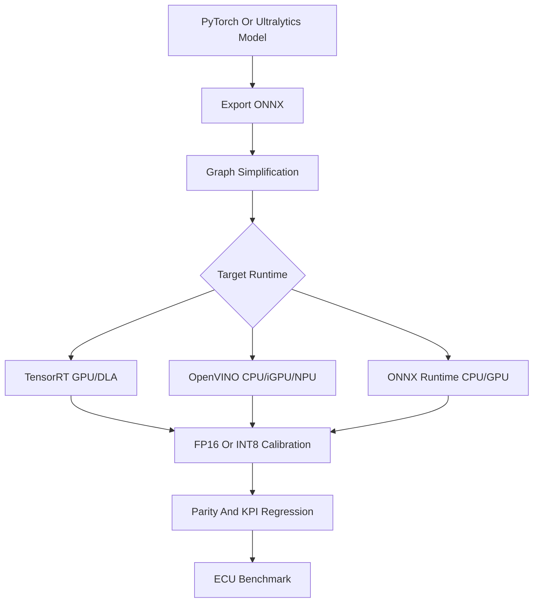

### 14.2 Vì Sao Quan Trọng Trong Automotive

Model card FPS trên GPU desktop không đại diện ECU. Production phải đạt p95/p99 latency, RAM peak, thermal stability và deterministic behavior trên hardware thực. INT8 có thể giảm latency, nhưng calibration sai có thể làm class hiếm hoặc small object giảm recall.

### 14.3 Ví Dụ TSR Thực Tế

| Case | Deployment Risk | Validation Cần Có |
|---|---|---|
| Export YOLO sang ONNX | Operator mismatch hoặc NMS khác | Parity bbox/class/confidence trên replay set. |
| TensorRT FP16 | Numeric drift nhỏ | mAP/event KPI so với PyTorch. |
| INT8 quantization | Small sign confidence giảm | Calibration set có small/night/glare/long-tail. |
| OpenVINO CPU | Latency tốt hơn PyTorch | p95/p99 latency và memory trên CPU target. |

### 14.4 Production Implementation Pattern

| Pattern | Implementation |
|---|---|
| Export matrix | PyTorch baseline, ONNX FP32, ONNX FP16, TensorRT FP16/INT8, OpenVINO FP16/INT8. |
| Calibration dataset | Representative theo class, size, lighting, camera ISP và ODD. |
| Parity tolerance | Define tolerance cho bbox IoU, class match, confidence delta. |
| Runtime wrapper | Stable input/output contract, timestamp, error handling. |
| Watchdog | Inference timeout, memory failure, runtime exception, fallback state. |
| Versioning | Model hash, engine hash, runtime version, calibration set ID. |

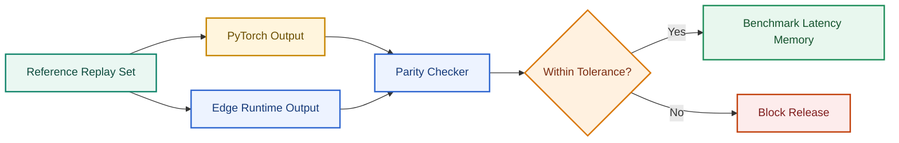

### 14.5 Trade-Offs

| Quyết Định | Ưu Điểm | Rủi Ro |
|---|---|---|
| FP32 | Accuracy ổn định | Latency/RAM cao. |
| FP16 | Tốc độ tốt trên GPU/NPU | Cần kiểm numeric drift. |
| INT8 | Tốc độ và memory tốt | Calibration khó, small object/class hiếm dễ drop. |
| Runtime-specific NMS | Nhanh | Behavior khác PyTorch nếu threshold/order khác. |
| Dynamic shape | Linh hoạt | Khó optimize và test determinism. |

### 14.6 Gap Repo Hiện Tại

Repo chưa có export script, engine artifact, parity checker, calibration set, runtime wrapper hoặc benchmark protocol. `requirements.txt` và README hướng dẫn PyTorch/Ultralytics inference, phù hợp baseline. Bước production gần nhất là thêm benchmark command dùng `ultralytics export` và so sánh ONNX/OpenVINO trên cùng video protocol.

### 14.7 Nguồn Tham Khảo

| Chủ Đề | Nguồn |
|---|---|
| Ultralytics export | https://docs.ultralytics.com/modes/export/ |
| Ultralytics benchmark | https://docs.ultralytics.com/modes/benchmark/ |
| ONNX Runtime | https://onnxruntime.ai/docs/ |
| TensorRT | https://docs.nvidia.com/deeplearning/tensorrt/ |
| OpenVINO | https://docs.openvino.ai/ |

---

## 15. Production OCR Pipeline Cho TSR

### 15.1 Lý Thuyết

TSR production thường tách **detection** (tìm vùng biển) khỏi **interpretation** (đọc nội dung biển). Với taxonomy lớn (82 class VN), one-stage detector có thể đủ; nhưng **speed family** (`50` vs `60`), biển có chữ dài, biển điều kiện và biển đa panel thường cần **classifier head**, **digit head** hoặc **OCR branch** riêng.

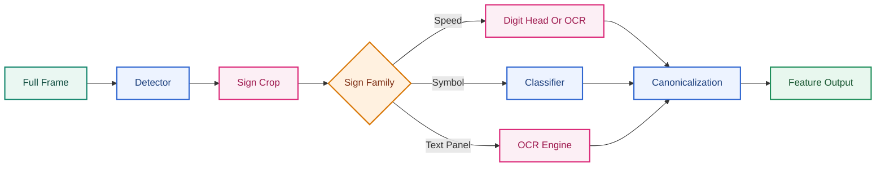

| Thành phần | Vai trò | Output |
|---|---|---|
| **Detector** | Tìm bbox sign trong scene | `bbox`, `sign_family`, `det_conf` |
| **Classifier** | Phân loại biển symbol (cấm, cảnh báo, mandatory) | `class_id`, `class_conf` |
| **Digit/OCR head** | Đọc giá trị số hoặc chữ trên biển | `raw_text`, `digit_conf` |
| **Canonicalization** | Chuẩn hóa sang vehicle feature model | `value`, `unit`, `conditional_flags` |

### 15.2 Vì Sao Quan Trọng Trong Automotive

Class label string (`Speed limit 50`) **không đủ** cho ISA hoặc planning. Feature cần object có cấu trúc:

```json
{
  "sign_type": "SPEED_LIMIT",
  "value": 50,
  "unit": "km/h",
  "conditional_flags": [],
  "source": "VISION",
  "confidence": 0.91
}
```

Nhầm `50` → `60` ở tốc độ cao là false advisory nghiêm trọng. Decoupled head (§5) giúp tách spatial và semantic, nhưng **digit resolution** vẫn là bottleneck khi biển nhỏ (§12). OCR branch chạy trên crop high-res sau detector giảm lỗi class confusion trong long-tail taxonomy.

### 15.3 Ví Dụ TSR Thực Tế

| Tình huống | One-stage only | Detector + OCR/canonicalization |
|---|---|---|
| Biển `50` vs `60`, bbox 24 px | Class head dễ nhầm digit | Digit head trên crop 128×128 đọc rõ hơn |
| Biển `30` phụ cho xe tải | Label class riêng, long-tail | OCR đọc panel + context filter vehicle class |
| Biển tạm công trường `40` | Có thể không có class train | OCR + temporal confirm + map override |
| Nhánh `--traditional` heuristic | Chỉ `SpeedLimit (heuristic)` | Không phân biệt giá trị — không dùng cho HMI |

### 15.4 Production Implementation Pattern

| Pattern | Implementation | Trade-off |
|---|---|---|
| Two-stage detect-then-read | YOLO detect → crop expand 10% → digit CNN hoặc lightweight OCR | +Latency ~2–8 ms/crop; cần cap số crop |
| Shared backbone multi-head | Detector backbone + auxiliary digit head trên RoI align | Train phức tạp; export phải giữ cả hai head |
| Template matching fallback | Speed family: match digit glyph khi OCR conf thấp | Chỉ work với font chuẩn; fragile với glare |
| Canonicalization table | Map `(family, raw_value, country)` → internal enum | Cần maintain ontology theo regulation |
| Confidence fusion | `publish_conf = min(det_conf, read_conf)` hoặc learned fusion | Conservative — giảm false advisory |

**Canonicalization speed sign — ví dụ logic:**

| Raw detector/OCR | Canonical output |
|---|---|
| Class `speed_limit_50` | `{type: SPEED_LIMIT, value: 50, unit: km/h}` |
| OCR `5O` (O thay 0) | Reject hoặc hold pending — plausibility check |
| Biển `80` + panel `when wet` | `{value: 80, conditional: [WET_ROAD]}` |

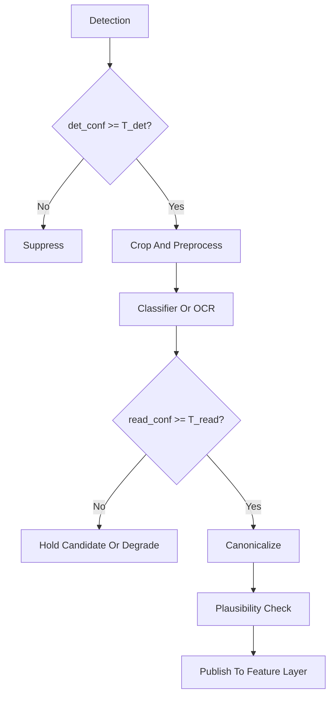

### 15.5 Trade-Offs

| Quyết Định | Ưu Điểm | Rủi Ro |
|---|---|---|
| Một model 82 class | Đơn giản, latency thấp | Long-tail và digit confusion |
| Thêm digit head | Giảm nhầm speed value | Thêm train data digit-aligned |
| Full OCR (CRNN/Transformer) | Đọc panel text, biển tạm | Latency, glare sensitivity |
| Canonicalization cứng | Deterministic cho ISA | Không cover biển lạ — cần fallback |

### 15.6 Gap Repo Hiện Tại

| Thiếu | Hậu quả |
|---|---|
| Không OCR/digit branch | Phụ thuộc 82 class one-shot; `50`/`60` confusion không tách được |
| Heuristic traditional không đọc digit | Chỉ sign-like, không giá trị |
| Không canonicalization layer | Label string không feed được ISA speed object |
| Không plausibility check | Không chặn `5O`, `999`, bbox/class mismatch |

---

## 16. Perception Uncertainty Và Confidence Engineering

### 16.1 Lý Thuyết

Confidence từ detector **không đồng nghĩa** xác suất đúng. Production TSR cần phân biệt hai nguồn uncertainty và engineering confidence qua nhiều lớp:

| Loại | Định nghĩa | Nguồn TSR điển hình |
|---|---|---|
| **Aleatoric** | Không chắc do **noise dữ liệu** — không giảm hết bằng thêm data | Motion blur, glare bloom, compression, rain, low SNR |
| **Epistemic** | Không chắc do **model thiếu kiến thức** — có thể giảm bằng data/train | OOD sign, taxonomy mới, rare class, country transfer |

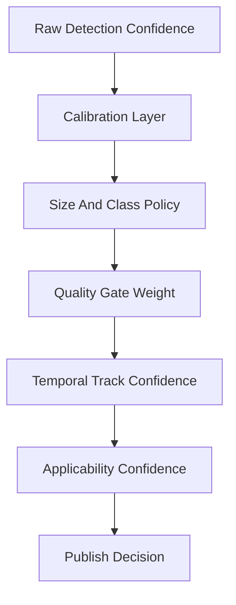

**Expected Calibration Error (ECE)** — metric chuẩn cho reliability:

Chia predictions theo bin confidence $B_m$, với $n_m$ samples trong bin:

$$
\text{ECE} = \sum_{m=1}^{M} \frac{n_m}{N} \left| \text{acc}(B_m) - \text{conf}(B_m) \right|
$$

ECE thấp → confidence gần đúng xác suất; ECE cao → không nên dùng raw `conf` làm gate HMI/ISA.

**Temperature scaling** (post-hoc calibration):

$$
P_\text{cal}(y|x) = \text{softmax}(z/T)
$$

Fit $T$ trên validation set để minimize NLL — đơn giản, hiệu quả cho per-class threshold sau calibration.

### 16.2 Reliability Diagram Và Calibration Workflow

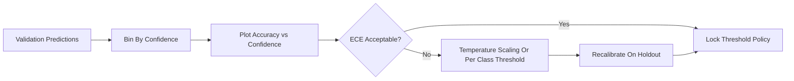

| Bước | Hành động |
|---|---|
| 1 | Thu thập `(conf, correct, class, bbox_size, quality)` trên validation đại diện ODD |
| 2 | Vẽ reliability diagram: trục x = mean confidence bin, trục y = accuracy bin |
| 3 | Tính ECE, Brier score, per-class calibration |
| 4 | Fit temperature / per-class threshold để đạt target precision (ưu tiên false advisory thấp) |
| 5 | Lock policy + regression test mỗi model version |

**Reliability diagram — đọc nhanh:**

| Hình dạng | Ý nghĩa | Hành động TSR |
|---|---|---|
| Đường chéo (ideal) | Confidence = accuracy | Có thể dùng conf trực tiếp với hysteresis |
| Over-confident (dưới đường chéo) | Model quá tin | Tăng threshold hoặc temperature $T>1$ |
| Under-confident (trên đường chéo) | Model thận trọng | Có thể hạ threshold class hiếm nếu recall thấp |

### 16.3 Confidence Engineering Cho TSR Production

| Chiều confidence | Công thức / pattern | Mục đích |
|---|---|---|
| Detection | `det_conf` calibrated | Gate bbox publish |
| Read/OCR | `read_conf` từ digit head | Gate speed value |
| Quality | `quality_score` từ blur/glare/exposure | Down-weight hoặc degrade |
| Size-aware | $T_\text{class,size}$ lookup table | Biển nhỏ cần threshold khác (§12) |
| Temporal | EMA over track: $\bar{c}_t = \alpha c_t + (1-\alpha)\bar{c}_{t-1}$ | Giảm jitter frame-level |
| Applicability | `app_conf` từ lane/context/map | Tách "nhìn thấy" khỏi "áp dụng" |

**Multi-dimensional publish rule (ví dụ conservative ISA):**

$$
\text{publish} \Leftrightarrow \bar{c}_\text{det} \geq T_d \land \bar{c}_\text{read} \geq T_r \land q \geq T_q \land \text{hits} \geq N
$$

### 16.4 Ví Dụ TSR Thực Tế

| Case | Raw conf | Sau calibration + policy | Hành vi |
|---|---|---|---|
| Biển `50` nhỏ, conf=0.82 nhưng accuracy bin=0.55 | 0.82 (over-confident) | Suppress hoặc candidate only | Tránh false advisory |
| Biển `80` blur, conf=0.18 | 0.18 | Quality gate → degraded | Không publish mới |
| Class hiếm construction, conf=0.45 calibrated=0.45 | Khớp accuracy | Confirm với 5 frame | Publish sau temporal |
| Glare trigger (SOTIF) | Det conf cao, read conf thấp | `need_corroboration` | Chờ map hoặc thêm frame |

### 16.5 Gap Repo Hiện Tại

| Repo | Gap |
|---|---|
| `conf=0.15` global default | Không calibrated; không per-class/size |
| Không ECE/reliability eval | Không biết over-confidence mức nào |
| Một chiều confidence | Không tách det/read/applicability/quality |
| Không temperature scaling artifact | Mỗi `best.pt` version không có calibration bundle |

### 16.6 Nguồn Tham Khảo

| Chủ đề | Nguồn |
|---|---|
| On calibration of modern neural networks | https://arxiv.org/abs/1706.04599 |
| Temperature scaling | https://arxiv.org/abs/1706.04599 |
| ISO 21448 uncertainty / corroboration | https://www.iso.org/standard/77490.html |

---

## Industry Benchmark Gaps (Ghi Chú Ngắn)

Public benchmark **không đại diện** production TSR stack đầy đủ:

| Gap | Ý nghĩa |
|---|---|
| Không có benchmark chuẩn cho detector + tracker + ISA event KPI | mAP/GTSDB/TT100K chỉ đo frame-level detection |
| Dataset công khai thiếu lane applicability, map conflict, HMI flicker | KPI feature-layer phải tự xây trên fleet catalog |
| Số liệu dataset đa phiên bản (Mapillary, CCTSDB) | Phải verify package trước khi báo cáo OEM |
| Paper FPS ≠ ECU p99 | Architecture comparison phải kèm export parity (§14) |
| VN HF 82 class fit research, không thay ODD validation | Production gate cần route/scenario catalog riêng |

Khi so sánh kiến trúc (YOLO vs RT-DETR) hoặc dataset, **lock protocol**: cùng preprocess, NMS/export path, size bins, và calibration policy — nếu không, kết luận chỉ có giá trị academic.

---

## 17. Tài liệu tham khảo

1. Lin et al., *Feature Pyramid Networks for Object Detection*. arXiv:1612.03144. https://arxiv.org/abs/1612.03144
2. Liu et al., *Path Aggregation Network for Instance Segmentation*. arXiv:1803.00894. https://arxiv.org/abs/1803.00894
3. Tan et al., *EfficientDet: Scalable and Efficient Object Detection*. arXiv:1911.09070. https://arxiv.org/abs/1911.09070
4. Redmon et al., *YOLO*. arXiv:1506.02640. https://arxiv.org/abs/1506.02640
5. Tian et al., *FCOS: Fully Convolutional One-Stage Object Detection*. arXiv:1904.01355. https://arxiv.org/abs/1904.01355
6. Carion et al., *DETR*. arXiv:2005.12872. https://arxiv.org/abs/2005.12872
7. Zhao et al., *RT-DETR*. arXiv:2304.08069. https://arxiv.org/abs/2304.08069
8. Ultralytics YOLO11 docs. https://docs.ultralytics.com/models/yolo11/
9. Mapillary Traffic Sign Dataset. arXiv:1909.04422. https://arxiv.org/abs/1909.04422
10. GLARE glare dataset. arXiv:2209.08716. https://arxiv.org/abs/2209.08716
11. TT100K traffic sign benchmark. https://cg.cs.tsinghua.edu.cn/traffic-sign/
12. GTSRB/GTSDB. https://benchmark.ini.rub.de/
13. Guo et al., *On Calibration of Modern Neural Networks*. arXiv:1706.04599. https://arxiv.org/abs/1706.04599
14. Ultralytics export/benchmark. https://docs.ultralytics.com/modes/export/
15. ONNX Runtime. https://onnxruntime.ai/docs/
16. TensorRT. https://docs.nvidia.com/deeplearning/tensorrt/
17. OpenVINO. https://docs.openvino.ai/
