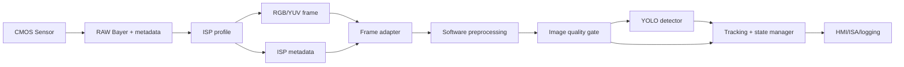

# ISP Image Pipeline for TSR

> **Thứ tự đọc:** 13 — đọc sau [2.10. SOTIF for TSR](10.sotif_for_tsr.md) và trước khi đi sâu vào [3.06. Notebook Analyze](../3.implementation/06.notebook_analyze.md) nếu cần giải thích vì sao frame đầu vào đã bị camera/ISP biến đổi trước khi tới YOLO.
>
> **File này trả lời:** CMOS sensor, RAW Bayer và các khối ISP như `AE`, `AWB`, `Demosaicing`, `Denoising`, `HDR Merge`, `Tone Mapping`, `Lens Distortion Correction`, `Sharpening` ảnh hưởng thế nào tới Traffic Sign Recognition.
>
> **Phân biệt phạm vi:** ISP là pipeline camera/hardware hoặc low-level imaging trước detector. Notebook [3.NB01. Colab Production-Lite Notebook](../3.implementation/notebooks/01.tsr_colab_production_lite_demo.ipynb) chủ yếu nhận frame video đã là `BGR/RGB/YUV` sau ISP; notebook không xử lý RAW Bayer thật.

---

## 1. Tóm tắt pipeline

```text
CMOS Sensor
      |
      v
RAW Bayer
      |
      v
ISP
      |
      +-- Auto Exposure (AE)
      +-- Auto White Balance (AWB)
      +-- Demosaicing
      +-- Denoising
      +-- HDR Merge
      +-- Tone Mapping
      +-- Lens Distortion Correction
      +-- Sharpening
      v
RGB/YUV
      v
YOLO / TSR
```

Ở mức system, YOLO không nhìn "thế giới thật" trực tiếp. YOLO nhìn tensor được tạo từ frame đã đi qua sensor, analog/digital gain, ISP, codec/video pipeline, resize và normalization. Vì vậy khi TSR sai dưới glare, đêm, tunnel exit hoặc biển nhỏ ở mép ảnh, root cause có thể nằm ở:

- detector chưa học đủ dữ liệu;
- preprocessing software làm mất pixel của biển;
- camera ISP làm mất chi tiết trước khi detector nhận ảnh;
- ODD/quality gate chưa nhận biết frame không đáng tin;
- benchmark trộn nhiều cấu hình ISP khác nhau nhưng không ghi metadata.

## 2. Hợp đồng dữ liệu từng block

| Block | Input | Output | Vai trò với TSR |
|---|---|---|---|
| CMOS Sensor | Photon qua lens, exposure time, analog gain | Điện tích/pixel trước ADC | Quyết định signal-to-noise, motion blur và saturation gốc |
| RAW Bayer | Mẫu mosaic 1 kênh theo CFA, black level, bit depth | RAW frame tuyến tính hoặc gần tuyến tính | Giữ nhiều thông tin nhất, nhưng chưa phải ảnh màu đủ 3 kênh |
| Auto Exposure | Histogram/luma RAW hoặc Y, target brightness, anti-flicker | Shutter time, analog/digital gain | Cân bằng biển đủ sáng với motion blur/noise/saturation |
| Auto White Balance | Thống kê màu, illuminant estimate | Gain `R/G/B`, color temperature estimate | Giữ màu đỏ/vàng/xanh của biển ổn định qua ánh sáng khác nhau |
| Demosaicing | RAW Bayer | RGB tuyến tính hoặc gần tuyến tính | Tạo 3 kênh màu; có thể sinh artifact ở chữ số/viền biển nhỏ |
| Denoising | RAW hoặc RGB/YUV có nhiễu | Frame ít nhiễu hơn | Giảm false positive do noise nhưng có thể làm mờ cạnh/chữ số |
| HDR Merge | Nhiều exposure hoặc staggered HDR | Frame dynamic range rộng hơn | Giữ chi tiết biển trong cảnh vừa tối vừa chói |
| Tone Mapping | HDR/linear RGB | RGB/YUV display/model range | Nén dynamic range; có thể cứu chi tiết hoặc làm wash-out màu biển |
| Lens Distortion Correction | RGB/YUV + calibration | Frame rectified | Làm hình học ổn định cho bbox/ROI/lane, đặc biệt ở mép ảnh |
| Sharpening | RGB/YUV sau denoise/tone | Frame tăng cạnh | Tăng edge/digit contrast nhưng có thể tạo halo và boost noise |
| RGB/YUV adapter | RGB/YUV/NV12/BGR | Tensor input cho YOLO | Đảm bảo đúng channel order, range và resize trước inference |

## 3. CMOS Sensor

CMOS sensor biến ánh sáng thành tín hiệu điện. Mỗi pixel tích lũy điện tích trong thời gian phơi sáng `t_exp`. Sau đó tín hiệu đi qua analog gain, ADC và các bước hiệu chỉnh low-level để tạo RAW.

Mô hình đơn giản của một pixel:

$$
x_\text{raw} = \operatorname{clip}(g_a \cdot t_\text{exp} \cdot L + b + n, 0, 2^B - 1)
$$

Trong đó:

- `L` là lượng ánh sáng tới pixel;
- `t_exp` là thời gian phơi sáng;
- `g_a` là analog gain;
- `b` là black level/offset;
- `n` gồm shot noise, read noise, fixed-pattern noise và quantization noise;
- `B` là bit depth, ví dụ `10`, `12` hoặc `14` bit.

### 3.1 Vì sao sensor quan trọng với TSR

Biển báo thường là object nhỏ, có cạnh sắc, màu mạnh và có chữ số/ký hiệu mảnh. Ba lỗi sensor-level ảnh hưởng trực tiếp tới TSR:

- **Saturation:** vùng biển hoặc nền bị cháy sáng, chữ số/viền mất chi tiết.
- **Low SNR:** ban đêm hoặc exposure thấp làm nhiễu tăng, confidence detector giảm.
- **Motion blur:** `t_exp` dài trong khi xe/camera chuyển động làm biên biển bị kéo dài.

Motion blur có thể xấp xỉ bằng độ dịch ảnh trong thời gian phơi sáng:

$$
d_\text{blur} \approx v_\text{image} \cdot t_\text{exp}
$$

Nếu biển chỉ cao `20 px` mà blur dài `4 px`, detector mất một phần lớn thông tin cạnh và chữ số. Vì vậy AE không thể chỉ tối ưu ảnh sáng đẹp; nó phải giữ `t_exp` đủ ngắn cho tốc độ xe và rung camera.

### 3.2 Metadata nên giữ

Một feature TSR production nên log tối thiểu:

- `exposure_us`;
- `analog_gain`;
- `digital_gain`;
- `sensor_temperature`;
- `frame_counter`;
- `timestamp_hw`;
- `bit_depth`;
- `saturation_ratio`;
- `black_level`;
- `isp_profile_id`.

Nếu chỉ lưu frame RGB cuối cùng, khi detector miss dưới night/glare, team rất khó biết lỗi đến từ model hay do sensor/ISP đã làm mất thông tin.

## 4. RAW Bayer

Hầu hết camera dùng Color Filter Array, thường là Bayer pattern. Mỗi pixel chỉ đo một màu cơ bản, ví dụ `R`, `G` hoặc `B`, chứ chưa có đủ `RGB`.

Ví dụ Bayer `RGGB`:

```text
R G R G
G B G B
R G R G
G B G B
```

RAW Bayer có hai đặc điểm quan trọng:

- giá trị còn gần tuyến tính với ánh sáng hơn ảnh sau tone mapping;
- mỗi vị trí chỉ có một kênh màu thật, hai kênh còn lại phải được nội suy ở bước demosaicing.

### 4.1 Hệ quả cho TSR

Nếu biển báo nhỏ, chữ số có thể chỉ rộng vài pixel trên sensor. Khi mỗi pixel chỉ giữ một màu, việc nội suy màu có thể làm:

- nhòe biên đỏ/trắng;
- tạo false color quanh cạnh xiên;
- làm chữ số `60`/`80` bớt rõ;
- làm detector học domain khác nếu train image đến từ ISP khác.

### 4.2 RAW không giống RGB/YUV

Không nên nói notebook hoặc YOLO "xử lý RAW" nếu input là video `.mp4`. Video replay thường đã qua:

```text
RAW Bayer -> ISP -> RGB/YUV -> encode -> decode -> BGR/RGB frame
```

Notebook [3.NB01](../3.implementation/notebooks/01.tsr_colab_production_lite_demo.ipynb) chỉ làm việc từ frame video đã decode. Vì vậy các kỹ thuật như AE/AWB/HDR merge thật không nằm trong notebook hiện tại; notebook chỉ mô phỏng hậu quả bằng quality reason như `LOW_SHARPNESS`, `TOO_DARK`, `GLARE`.

## 5. Auto Exposure (AE)

AE chọn thời gian phơi sáng và gain để ảnh đủ sáng nhưng không cháy. Với TSR, mục tiêu không phải ảnh "đẹp" cho người xem, mà là giữ đủ chi tiết của biển báo cho detector.

### 5.1 Input và output

| Thành phần | Nội dung |
|---|---|
| Input | Histogram RAW/Y, mean luminance, saturation ratio, ROI weight, tốc độ xe, anti-flicker frequency |
| Output | `exposure_us`, `analog_gain`, `digital_gain`, đôi khi cả `hdr_ratio` |
| Constraint | Không vượt motion-blur budget, không để saturation kéo dài, không làm gain/noise tăng quá mức |

### 5.2 Điều khiển AE đơn giản

Một AE loop cơ bản dùng luminance đo được `Y_k` và target `Y_t`:

$$
e_k = \log\frac{Y_t + \epsilon}{Y_k + \epsilon}
$$

$$
\log t_{k+1} = \operatorname{clip}(\log t_k + \alpha e_k,\ \log t_\min,\ \log t_\max)
$$

Nếu exposure time đã chạm `t_max`, hệ thống mới tăng gain:

$$
g_{k+1} = \operatorname{clip}(g_k \cdot \exp(\beta e_k),\ g_\min,\ g_\max)
$$

`alpha` và `beta` càng lớn thì ảnh thích nghi nhanh hơn khi ra/vào hầm, nhưng dễ flicker brightness giữa các frame. Với TSR, flicker có thể làm confidence và label dao động, kéo theo state manager `CANDIDATE`/`ACTIVE` không ổn định.

### 5.3 AE weighted ROI

Nếu AE chỉ nhìn mean toàn ảnh, bầu trời sáng hoặc đèn xe có thể kéo exposure xuống, làm biển bị tối. Một cách tốt hơn là dùng weighted histogram:

$$
Y_\text{meas} =
\frac{\sum_{p \in \Omega} w(p)Y(p)}{\sum_{p \in \Omega} w(p)}
$$

Trong đó `w(p)` tăng ở vùng dự kiến có biển: phía trước xe, vùng gần horizon, hoặc ROI từ camera calibration. Tuy nhiên không nên chỉ dùng ROI quá hẹp, vì biển có thể nằm ngoài vùng dự kiến ở giao lộ hoặc đường cong.

### 5.4 Trade-off AE cho TSR

| Tình huống | AE chọn sai | Hậu quả TSR | Mitigation |
|---|---|---|---|
| Xe chạy nhanh ban ngày | `t_exp` quá dài | Motion blur, mất chữ số | Giới hạn `t_exp` theo speed/blur budget |
| Ra khỏi hầm | Exposure chưa kịp giảm | Over-exposure, sign cháy sáng | AE convergence test, HDR, `GLARE` reason |
| Đêm có biển phản quang | Gain quá cao | Noise, bloom, class jitter | Gain cap, temporal confirmation, night slice |
| Nền trời rất sáng | Biển bị under-exposed | False negative | ROI-weighted AE, dynamic range metric |
| LED/flicker | Exposure lệch chu kỳ | Brightness flicker | Anti-flicker exposure set |

### 5.5 Mapping với quality gate

AE không publish trực tiếp output TSR. Nó ảnh hưởng chất lượng frame. Quality gate nên đọc được hậu quả:

- `TOO_DARK` khi mean luma thấp hoặc dark ratio cao;
- `GLARE` khi bright/saturation ratio quá cao;
- `LOW_SHARPNESS` khi blur score thấp, có thể do exposure time dài;
- `DEGRADED` khi chất lượng xấu nhưng vẫn còn có thể giữ track cũ;
- `UNAVAILABLE` khi frame không còn đủ tin cậy để infer sign mới.

## 6. Auto White Balance (AWB)

AWB điều chỉnh gain màu để vật thể trung tính nhìn gần trung tính dưới nhiều nguồn sáng khác nhau: nắng, mây, đèn vàng, LED, hầm. Nếu AWB sai, màu đỏ/vàng/xanh của biển báo bị lệch, ảnh hưởng cả detector học màu lẫn heuristic HSV.

### 6.1 Gray-world model

Một baseline AWB phổ biến là gray-world: giả định trung bình cảnh nên gần màu xám. Nếu mean kênh sau black-level correction là `\bar{R}`, `\bar{G}`, `\bar{B}`, gain có thể tính:

$$
g_R = \frac{\bar{G}}{\bar{R} + \epsilon}
$$

$$
g_G = 1
$$

$$
g_B = \frac{\bar{G}}{\bar{B} + \epsilon}
$$

Sau đó:

$$
R' = \operatorname{clip}(g_R R),\quad
G' = G,\quad
B' = \operatorname{clip}(g_B B)
$$

Gray-world đơn giản, nhưng dễ sai khi cảnh bị chi phối bởi một màu lớn, ví dụ tường vàng, cây xanh hoặc trời xanh.

### 6.2 White-patch và learning-based AWB

White-patch dùng vùng sáng nhất làm tham chiếu trắng. Cách này nhanh nhưng dễ bị lóa hoặc biển phản quang đánh lừa. Learning-based AWB dùng mô hình học từ dữ liệu để đoán illuminant, ổn định hơn trong nhiều scene nhưng cần dataset đại diện.

### 6.3 Hệ quả AWB cho TSR

| AWB issue | Ví dụ | Hậu quả |
|---|---|---|
| Color cast vàng | Đèn sodium ban đêm | Biển trắng/đỏ bị ám vàng, HSV heuristic miss |
| Color cast xanh | Bóng râm, mây dày | Biển xanh/đỏ dịch hue, detector confidence giảm |
| AWB flicker | Xe đi qua bóng cây | Label/confidence dao động theo frame |
| Over-correction | Cảnh có nhiều biển đỏ/vàng | AWB kéo màu biển về trung tính, mất discriminative color |

### 6.4 Quy tắc cho benchmark

Khi benchmark TSR giữa hai camera hoặc hai video, cần ghi:

- `awb_mode`;
- `awb_gains`;
- color correction matrix/profile;
- lighting tag: `day`, `night`, `tunnel`, `backlight`, `led`;
- white-balance stability theo thời gian.

Nếu không ghi AWB metadata, kết luận "model A tốt hơn model B" có thể chỉ là do camera pipeline khác màu.

## 7. Demosaicing

Demosaicing biến RAW Bayer một kênh thành ảnh 3 kênh. Ở mỗi pixel, sensor chỉ đo một màu thật; hai màu còn lại được ước lượng từ pixel lân cận.

### 7.1 Bilinear interpolation

Ví dụ tại một pixel xanh lá cần ước lượng đỏ từ hai pixel đỏ trái/phải:

$$
\hat{R}(x,y) = \frac{R(x-1,y) + R(x+1,y)}{2}
$$

Ở vị trí khác có thể phải dùng bốn hàng xóm:

$$
\hat{B}(x,y) =
\frac{B(x-1,y-1) + B(x+1,y-1) + B(x-1,y+1) + B(x+1,y+1)}{4}
$$

Bilinear nhanh và dễ chạy realtime, nhưng không hiểu cấu trúc cạnh. Khi cạnh biển đỏ/trắng nghiêng qua Bayer grid, bilinear có thể làm màu rò qua biên.

### 7.2 Edge-aware demosaicing

Edge-aware demosaicing cố tránh nội suy xuyên qua cạnh mạnh. Ý tưởng:

1. Tính gradient theo nhiều hướng.
2. Chọn hướng có thay đổi nhỏ hơn.
3. Nội suy theo hướng đó để giữ biên.

Ví dụ nếu gradient ngang nhỏ hơn gradient dọc:

$$
\hat{G}(x,y) =
\frac{G(x-1,y) + G(x+1,y)}{2}
$$

Nếu gradient dọc nhỏ hơn:

$$
\hat{G}(x,y) =
\frac{G(x,y-1) + G(x,y+1)}{2}
$$

### 7.3 Artifact quan trọng với biển báo

| Artifact | Nguyên nhân | Hậu quả với TSR |
|---|---|---|
| Zipper edge | Nội suy sai qua cạnh mạnh | Viền biển rung/răng cưa, bbox không ổn định |
| False color | Cạnh mảnh hoặc pattern lặp | Chữ số/ký hiệu có màu giả |
| Moire/aliasing | Biển nhỏ gần tần số sampling | Detector thấy texture lạ |
| Color bleeding | Nội suy màu qua viền đỏ/trắng | Nhầm family hoặc giảm confidence |

### 7.4 Demosaicing và training domain

Nếu model được train trên ảnh đã qua demosaicing của camera A nhưng deploy trên camera B, domain shift có thể đến từ thuật toán ISP khác, không chỉ khác dataset. Với TSR production, dataset card nên ghi:

- camera module;
- Bayer pattern;
- demosaicing mode;
- image size sau ISP;
- bit depth trước/sau ISP;
- compression/video path.

## 8. Denoising

Denoising giảm nhiễu trước detector. Nhưng với TSR, nhiễu và chi tiết nhỏ nằm rất gần nhau: xóa nhiễu quá mạnh có thể xóa luôn nét chữ số hoặc viền biển.

### 8.1 Noise model

Một mô hình đơn giản:

$$
x = s + n_\text{shot} + n_\text{read} + n_\text{quant}
$$

Shot noise thường tăng theo tín hiệu:

$$
\operatorname{Var}(n_\text{shot}) \approx s
$$

Read noise có thể xấp xỉ Gaussian:

$$
n_\text{read} \sim \mathcal{N}(0,\sigma_r^2)
$$

Gain càng cao, nhiễu càng dễ thấy trong ảnh sau ISP. Ban đêm, AE thường tăng gain để giữ brightness, nên denoising và sharpening phải được tune cùng nhau.

### 8.2 Spatial denoise

Các filter đơn giản:

```text
Gaussian blur: giảm high-frequency noise nhưng làm mờ cạnh.
Bilateral filter: giữ cạnh tốt hơn nhưng chậm hơn.
Median filter: tốt cho salt-and-pepper noise nhưng có thể làm méo chi tiết mảnh.
```

Gaussian filter:

$$
I'(p) = \sum_{q \in \mathcal{N}(p)} G_\sigma(p-q)I(q)
$$

Bilateral filter thêm trọng số theo khác biệt intensity:

$$
I'(p) =
\frac{1}{W_p}
\sum_{q \in \mathcal{N}(p)}
G_{\sigma_s}(p-q)G_{\sigma_r}(I(p)-I(q))I(q)
$$

### 8.3 Non-local means

Non-local means so sánh patch thay vì chỉ pixel gần nhau:

$$
I'(p) = \sum_q w(p,q)I(q)
$$

$$
w(p,q) =
\frac{1}{Z_p}
\exp\left(-\frac{\|P_p - P_q\|^2}{h^2}\right)
$$

`h` càng lớn thì khử nhiễu càng mạnh, nhưng càng dễ mất texture nhỏ. Với TSR, phải kiểm tra riêng speed-sign digit và biển nhỏ xa sau denoise.

### 8.4 Temporal denoise

Với video, có thể trung bình nhiều frame:

$$
I'_t = (1-\alpha)I_t + \alpha I'_{t-1}
$$

Cách này giảm nhiễu tốt khi scene đứng yên, nhưng TSR có chuyển động camera và sign. Nếu không bù motion, temporal denoise có thể tạo ghost biển, làm tracking nhận nhầm một sign đã đi qua vẫn còn tồn tại.

### 8.5 Denoise tuning cho TSR

| Mức denoise | Lợi ích | Rủi ro |
|---|---|---|
| Thấp | Giữ chi tiết chữ số tốt | Noise gây false positive hoặc confidence dao động |
| Trung bình | Cân bằng noise/detail | Cần benchmark theo class/size |
| Cao | Ảnh nhìn sạch hơn | Mất cạnh, digit blur, biển nhỏ biến mất |

Không nên tune denoise bằng cảm nhận ảnh đẹp. Cần đo:

- recall theo `size_bin`;
- confidence theo `family`;
- false positive trên object giống biển;
- quality reason `LOW_SHARPNESS`;
- confirmation latency của state manager.

## 9. HDR Merge

HDR xử lý cảnh có dynamic range rộng: trời rất sáng nhưng biển nằm trong bóng, hoặc đêm có biển phản quang và đèn xe. Một exposure đơn có thể không giữ được cả vùng tối và vùng sáng.

### 9.1 Multi-exposure merge

Với nhiều ảnh cùng scene ở exposure khác nhau, radiance có thể ước lượng:

$$
E(p) =
\frac{\sum_i w(z_i(p)) \frac{f^{-1}(z_i(p))}{t_i}}
{\sum_i w(z_i(p))}
$$

Trong đó:

- `z_i(p)` là giá trị pixel ở exposure `i`;
- `t_i` là exposure time;
- `f^{-1}` là inverse camera response;
- `w(z)` giảm trọng số vùng quá tối hoặc quá sáng.

Trong camera automotive, HDR thường không phải chụp nhiều ảnh rời như máy ảnh tĩnh, mà có thể dùng staggered exposure, multi-slope sensor hoặc pipeline chuyên dụng. Ý tưởng vẫn giống nhau: giữ chi tiết ở cả highlight và shadow.

### 9.2 Ghosting và motion

Xe chạy làm scene thay đổi giữa exposure ngắn và dài. Nếu merge không bù motion tốt:

- viền biển bị double edge;
- chữ số có bóng ma;
- bbox detector nhảy;
- optical flow/tracking downstream khó ổn định.

### 9.3 HDR và TSR

| Scene | Không HDR | HDR tốt | HDR lỗi |
|---|---|---|---|
| Ra khỏi hầm | Biển ngoài cửa hầm cháy sáng | Giữ viền/chữ số | Ghosting nếu exposure lệch |
| Đêm, biển phản quang | Biển bloom, chữ số mất | Giữ chi tiết biển | Tone mapping làm biển wash-out |
| Trời nắng gắt | Nền trời kéo exposure | Biển không quá tối | Local contrast quá mạnh gây halo |

HDR không tự đảm bảo TSR tốt hơn. Sau khi bật HDR cần benchmark lại detector, quality gate và confidence calibration.

## 10. Tone Mapping

Tone mapping nén ảnh HDR hoặc ảnh tuyến tính dynamic range rộng xuống ảnh `8-bit`/`10-bit` mà video pipeline và model có thể dùng.

### 10.1 Gamma mapping

Một mapping đơn giản:

$$
Y_\text{out} = Y_\text{in}^{1/\gamma}
$$

Với `\gamma > 1`, vùng tối thường được nâng lên khi encode theo gamma display. Nhưng detector được train trên distribution cụ thể; đổi tone curve có thể làm feature map thay đổi.

### 10.2 Reinhard-style compression

Một dạng nén highlight trực quan:

$$
Y_\text{out} = \frac{Y_\text{in}}{1 + Y_\text{in}}
$$

Cách này giữ giá trị trong khoảng hữu hạn, nhưng nếu áp quá mạnh có thể làm biển sáng mất contrast so với nền.

### 10.3 Local tone mapping

Local tone mapping điều chỉnh theo vùng cục bộ. Nó có thể cứu biển trong bóng cây nhưng cũng có thể tạo halo quanh cạnh biển. Với TSR, halo làm detector tưởng cạnh lớn hơn hoặc làm màu viền bị lệch.

### 10.4 Tone mapping và model input

Nếu pipeline train dùng tone mapping A nhưng deploy dùng tone mapping B, model có thể giảm performance dù camera và lens giống nhau. Vì vậy `isp_profile_id` và tone curve version là một phần của model provenance.

## 11. Lens Distortion Correction

Lens distortion correction biến ảnh méo do lens thành ảnh rectified. Với camera góc rộng, biển ở mép ảnh có thể bị kéo cong hoặc đổi kích thước nếu không hiệu chỉnh.

### 11.1 Camera model

Với camera matrix:

$$
K =
\begin{bmatrix}
f_x & 0 & c_x \\
0 & f_y & c_y \\
0 & 0 & 1
\end{bmatrix}
$$

Điểm normalized:

$$
x = \frac{u - c_x}{f_x},\quad
y = \frac{v - c_y}{f_y}
$$

$$
r^2 = x^2 + y^2
$$

Radial distortion thường được mô hình hóa:

$$
x_r = x(1 + k_1r^2 + k_2r^4 + k_3r^6)
$$

$$
y_r = y(1 + k_1r^2 + k_2r^4 + k_3r^6)
$$

Tangential distortion:

$$
x_d = x_r + 2p_1xy + p_2(r^2 + 2x^2)
$$

$$
y_d = y_r + p_1(r^2 + 2y^2) + 2p_2xy
$$

LDC dùng calibration để tạo map từ output pixel về input pixel rồi nội suy.

### 11.2 Hệ quả với TSR

| Vấn đề hình học | Hậu quả |
|---|---|
| Không undistort | Bbox ở mép ảnh sai shape, sign aspect ratio lệch |
| Undistort nhưng crop mạnh | Mất biển ở rìa ảnh |
| Calibration cũ sau lệch mount | ROI/lane association sai |
| Không log calibration version | Không RCA được lỗi theo camera build |

### 11.3 LDC và ROI/lane

ROI filter hoặc lane association chỉ có ý nghĩa nếu hình học ảnh ổn định. Nếu lens distortion khác giữa train và deploy, một ROI cố định theo pixel có thể lọc nhầm biển thật. Production nên định nghĩa ROI trong hệ tọa độ đã rectified hoặc dùng calibration-aware transform.

## 12. Sharpening

Sharpening tăng contrast ở cạnh. ISP thường đặt sharpening sau denoise và tone mapping hoặc gần cuối pipeline.

### 12.1 Unsharp mask

Unsharp mask:

$$
B = G_\sigma * I
$$

$$
I_\text{sharp} = I + \lambda(I - B)
$$

Trong đó:

- `B` là ảnh blur thấp tần;
- `I - B` là high-frequency detail;
- `\lambda` là strength.

Kernel sharpening đơn giản:

$$
K =
\begin{bmatrix}
0 & -1 & 0 \\
-1 & 5 & -1 \\
0 & -1 & 0
\end{bmatrix}
$$

### 12.2 Lợi ích và rủi ro

| Effect | Tốt cho TSR | Rủi ro |
|---|---|---|
| Tăng cạnh viền biển | Bbox ổn định hơn | Halo quanh biển |
| Tăng nét chữ số | Phân biệt `50/80` tốt hơn | Ringing làm digit giả |
| Bù denoise nhẹ | Giữ chi tiết sau khử nhiễu | Boost noise ban đêm |

### 12.3 Không nhầm sharpening với ảnh thật sắc

Notebook dùng Laplacian variance như sharpness proxy. Nếu ISP sharpening quá mạnh, Laplacian có thể tăng dù ảnh gốc bị blur/noise. Vì vậy quality gate nên log thêm:

- sharpening strength;
- noise estimate;
- exposure time;
- motion estimate hoặc ego speed;
- confidence stability qua nhiều frame.

Một frame được sharpen mạnh có thể vượt `LOW_SHARPNESS` nhưng vẫn không đáng tin nếu digit đã mất thông tin trước đó.

## 13. RGB/YUV và adapter vào YOLO

Sau ISP, frame thường ở `RGB`, `BGR`, `YUV`, `NV12` hoặc format tương tự. YOLO thường nhận tensor 3 kênh sau resize/letterbox và normalization.

### 13.1 YUV

YUV tách luminance và chroma. Một công thức gần đúng thường gặp:

$$
Y \approx 0.299R + 0.587G + 0.114B
$$

Hệ số thật phụ thuộc chuẩn màu và range. Nếu pipeline nhầm full range/limited range hoặc nhầm `RGB/BGR`, detector có thể sai mà không crash.

### 13.2 Adapter contract

Trước YOLO, cần xác định rõ:

- input color order: `RGB` hay `BGR`;
- pixel range: `0..255`, `0..1`, normalized mean/std;
- YUV range: full hay limited;
- resize policy: stretch, keep aspect, letterbox;
- interpolation mode;
- timestamp đi kèm frame;
- frame đã rectified hay chưa;
- `isp_profile_id`.

### 13.3 Mapping với notebook

Notebook hiện tại dùng OpenCV đọc video nên frame trong code thường là `BGR`. Khi gọi model hoặc vẽ overlay, cần biết hàm downstream đang kỳ vọng `BGR` hay `RGB`. Đây là lỗi rất thực tế: hình vẫn hiển thị được, nhưng màu biển sai với model nếu channel order bị đảo.

## 14. ISP không thay thế preprocessing software

ISP và preprocessing trong notebook nằm ở hai tầng khác nhau.

| Tầng | Ví dụ | Ai sở hữu | Có trong repo hiện tại |
|---|---|---|---|
| Sensor/ISP | AE, AWB, demosaic, denoise, HDR, tone mapping, LDC, sharpening | Camera module, SoC ISP, low-level platform | Không, vì repo dùng video đã encode |
| Software preprocessing | Decode frame, resize, optional CLAHE, ROI filter | TSR application/notebook | Có resize; CLAHE/ROI ở ref downstream |
| Quality gate | Blur/luma/glare metric, reason code | TSR feature logic | Có trong notebook `3.NB01` |
| Detector | YOLO inference | Model/runtime | Có qua `best.pt` và Ultralytics |

Vì vậy câu trả lời đúng khi vấn đáp:

1. Repo hiện tại **không implement ISP thật**.
2. Repo có **software preprocessing** và **quality gate** để xử lý hậu quả của ảnh xấu sau ISP.
3. Nếu đề cập AE/AWB/HDR/LDC, phải nói đây là **research/production camera pipeline requirement**, không phải phần notebook đang chạy.

## 15. Failure modes từ ISP sang TSR

| ISP block | Failure mode | Biểu hiện ở YOLO/TSR | Reason/KPI nên có |
|---|---|---|---|
| AE | Under-exposure | Miss sign ban đêm | `TOO_DARK`, night recall |
| AE | Over-exposure | Sign cháy, wrong class | `GLARE`, saturation ratio |
| AWB | Color cast | Nhầm màu biển, HSV miss | hue shift, class confusion |
| Demosaic | False color/zipper | Bbox jitter ở cạnh biển | edge artifact slice |
| Denoise | Over-smoothing | Mất chữ số, confidence thấp | size-bin recall, digit confusion |
| HDR | Ghosting | Double edge, track switch | temporal consistency, ID switch |
| Tone mapping | Washed contrast | Detector miss sign trong shadow/highlight | contrast metric |
| LDC | Calibration mismatch | ROI/lane sai, bbox méo | calibration version, reprojection error |
| Sharpening | Halo/ringing | False edge, false positive | noise/sharpness consistency |

## 16. Benchmark protocol cho ISP-aware TSR

Nếu muốn claim "bật ISP tuning giúp TSR tốt hơn", benchmark phải khóa các biến sau:

| Nhóm | Cần khóa/log |
|---|---|
| Camera | sensor id, lens id, mount, calibration version |
| Exposure | `exposure_us`, analog gain, digital gain, AE mode |
| Color | AWB mode, AWB gains, color correction matrix |
| HDR | HDR mode, exposure ratio, merge profile |
| Geometry | LDC on/off, distortion coefficients, output FOV/crop |
| Image enhancement | denoise strength, sharpening strength, tone curve |
| Video path | codec, resolution, FPS, color format, compression quality |
| Model input | resize, `imgsz`, channel order, normalization |

KPI nên tách theo:

- day/night/tunnel/backlight/glare;
- sign size bin;
- sign color/family;
- center vs edge of frame;
- speed/blur bucket;
- confidence calibration;
- temporal stability;
- confirmation latency;
- false positive trên sign-like object.

## 17. Design pattern production



Frame adapter không chỉ chuyển format. Nó là nơi kiểm tra contract:

- frame có đúng timestamp không;
- frame có đúng resolution không;
- frame có đúng color format không;
- metadata ISP có đồng bộ với frame không;
- camera calibration/profile có đúng version không.

## 18. Mapping vào tài liệu hiện tại

| Nội dung hiện có | Nên hiểu theo ISP-aware view |
|---|---|
| [3.06. Notebook Analyze](../3.implementation/06.notebook_analyze.md) `preprocess()` | Software resize/CLAHE sau decode, không phải ISP |
| [3.06. Notebook Analyze](../3.implementation/06.notebook_analyze.md) `assess_frame_quality()` | Quality gate đo hậu quả của ISP/scene trên frame đã xử lý |
| [2.10. SOTIF for TSR](10.sotif_for_tsr.md) `Quality Gate Theo IEEE 2020/P2020` | Cơ sở risk cho image quality, không quy định thuật toán AE/AWB cụ thể |
| [2.09. ODD for TSR](09.odd_for_tsr.md) lighting/weather/camera bounds | Điều kiện mà camera/ISP phải giữ ảnh đủ tin cậy |
| [3.12. Baseline Repo Analysis Full](../3.implementation/12.baseline_repo_analysis_full.md) gap preprocessing | Runtime chính chưa có ISP metadata, quality gate hoặc ISP-aware benchmark |

## 19. Câu trả lời ngắn khi vấn đáp

**Câu hỏi: Hệ thống có xử lý ảnh bằng ISP không?**

Trong repo hiện tại, hệ thống không implement ISP thật vì input là video đã qua camera/video pipeline. Tuy nhiên tài liệu research mô tả pipeline production cần có ISP từ CMOS/RAW Bayer sang RGB/YUV trước YOLO. Notebook chỉ xử lý software-side như resize, quality gate và optional CLAHE ở ref downstream.

**Câu hỏi: AE/AWB/HDR có phải phần bạn code không?**

Không. AE, AWB, demosaicing, denoising, HDR merge, tone mapping, lens correction và sharpening là năng lực của camera ISP hoặc low-level platform. Phần nhóm code ở notebook là feature logic phía sau frame đã decode: quality gate, ODD gate, tracking, lifecycle, event log và KPI replay.

**Câu hỏi: Vì sao vẫn cần biết ISP nếu không code ISP?**

Vì detector phụ thuộc trực tiếp vào frame sau ISP. ISP có thể làm mất hoặc thay đổi thông tin biển trước khi YOLO nhận ảnh. Nếu không log/tách ISP profile, benchmark dễ nhầm lỗi camera pipeline thành lỗi model.

## 20. Checklist đưa vào roadmap

- Thêm `isp_profile_id` vào event schema khi có camera thật.
- Log `exposure_us`, gain, AWB gain, HDR mode, LDC profile và sharpening/denoise strength.
- Tách benchmark theo `day/night/glare/tunnel`, `small/medium/large sign`, center/edge frame.
- Không so sánh model hoặc threshold nếu ISP profile khác nhau mà không ghi rõ.
- Calibrate lại quality threshold sau mỗi thay đổi AE/AWB/HDR/tone/sharpening.
- Xác định rõ input contract cho YOLO: `RGB/BGR`, range, resize, rectified/non-rectified.

## 21. Nguồn và traceability

| Nguồn | Dùng để lấy ý |
|---|---|
| [IEEE P2020 / 2020-2024 Automotive System Image Quality](https://standards.ieee.org/ieee/2020/11960/) | Thuộc tính image quality automotive: flare, dynamic range, contrast, noise, flicker, geometry, resolution, color |
| [OpenCV color conversions and demosaicing](https://docs.opencv.org/4.x/d8/d01/group__imgproc__color__conversions.html) | Khái niệm demosaicing Bayer và các mode bilinear/VNG/edge-aware |
| [OpenCV xphoto white balance and tonemap](https://docs.opencv.org/5.0/extra_modules/xphoto.html) | Gray-world/simple/learning-based white balance và tonemap Durand ở mức API reference |
| [OpenCV denoising](https://docs.opencv.org/4.x/d1/d79/group__photo__denoise.html) | Non-local means denoising và tham số strength/window |
| [OpenCV HDR imaging](https://docs.opencv.org/4.x/d6/df5/group__photo__hdr.html) | Merge exposure, exposure fusion và tonemapping |
| [OpenCV camera calibration](https://docs.opencv.org/4.x/dc/dbb/tutorial_py_calibration.html) | Intrinsic/extrinsic calibration và undistortion |
| [NVIDIA VPI Lens Distortion Correction](https://docs.nvidia.com/vpi/html/algo_ldc.html) | Remap/warp-based lens distortion correction trong embedded vision pipeline |
| [2.10. SOTIF for TSR](10.sotif_for_tsr.md) `[SRC]` | Liên hệ ISP/image quality với trigger condition, degraded behavior và validation slice |
| [3.06. Notebook Analyze](../3.implementation/06.notebook_analyze.md) `[SRC]` | Mapping từ frame đã decode sang software preprocessing, quality gate và YOLO input |
