# (2) Phân Tích Baseline TSR — Gắn Trực Tiếp `tsr_demo.py` và Model `best.pt`

> **Thứ tự đọc:** 2 — sau [1.research_tsr_three_part_unified.md](1.research_tsr_three_part_unified.md) (Phần III).

## 1. Metadata

| Thuộc tính | Giá trị |
|---|---|
| Code tham chiếu | [`code/tsr_demo.py`](../code/tsr_demo.py) |
| Weights | `models/best.pt` |
| Model upstream | [star092304/traffic-sign-detection-vietnam-yolo](https://huggingface.co/star092304/traffic-sign-detection-vietnam-yolo) |
| Dataset upstream | [Traffic-sign-detection-VietNam](https://huggingface.co/datasets/star092304/Traffic-sign-detection-VietNam) |
| Liên kết kiến trúc detector (nghiên cứu chung) | [3.research_tsr_detection_architecture_research.md](3.research_tsr_detection_architecture_research.md) |
| Liên kết hệ thống | [1.research_tsr_three_part_unified.md](1.research_tsr_three_part_unified.md) |
| Ngày cập nhật | 2026-06-20 |

## 2. Tóm tắt

Tài liệu này **không** liệt kê taxonomy mô hình chung. Nó trả lời câu hỏi cụ thể cho tech lead và người maintain repo:

- Baseline hiện tại (`tsr_demo.py` + `best.pt`) **bao phủ được gì** và **không bao phủ gì**?
- Model được train trên **bao nhiêu ảnh, bao nhiêu instance, phân bổ class ra sao**?
- **Thiếu kỹ thuật/pipeline nào** trong code hiện tại → **điểm yếu cụ thể nào** trên video/ODD thật?

Mọi nhận định dưới đây map trực tiếp tới hàm, tham số CLI, hoặc artifact trong repo.

### 2.1 Legend màu Mermaid

> Legend này áp dụng cho các sơ đồ Mermaid đã được tô màu trong tài liệu. Một số sơ đồ chỉ dùng một phần của palette dưới đây.

| Màu | Vai trò | Ý nghĩa |
|---|---|---|
| <span style="display:inline-block;width:14px;height:14px;border:1px solid #C78600;background:#FFF5DD;"></span> | `baseline` | Baseline hiện tại, artifact repo đang có, hoặc điểm tham chiếu ban đầu |
| <span style="display:inline-block;width:14px;height:14px;border:1px solid #2F66D0;background:#EDF3FF;"></span> | `feature` | Khối xử lý chính, metric cốt lõi, hoặc bước phân tích chính |
| <span style="display:inline-block;width:14px;height:14px;border:1px solid #7C3AED;background:#F4ECFF;"></span> | `temporal` | Tracking, lifecycle, logic thời gian, hoặc KPI theo track/state |
| <span style="display:inline-block;width:14px;height:14px;border:1px solid #14866D;background:#EAF7F2;"></span> | `source` | Input log, evidence source, replay input, hoặc dữ liệu đầu vào |
| <span style="display:inline-block;width:14px;height:14px;border:1px solid #1E8E5A;background:#E8F7EE;"></span> | `integration` | Output, release outcome, regression result, hoặc đầu ra tích hợp |
| <span style="display:inline-block;width:14px;height:14px;border:1px solid #C2410C;background:#FDECEC;"></span> | `risk` | Gap, failure, blocker, unavailable path, hoặc điểm rủi ro cần xử lý |
| <span style="display:inline-block;width:14px;height:14px;border:1px solid #D97706;background:#FFF1E0;"></span> | `decision` | Gate, pass/fail node, hoặc nhánh quyết định release |
| <span style="display:inline-block;width:14px;height:14px;border:1px solid #DB2777;background:#FCEFF5;"></span> | `support` | Utility, logger, benchmark support, RCA support, hoặc khối phụ trợ |

---

## 3. Data flow thực tế trong `tsr_demo.py`

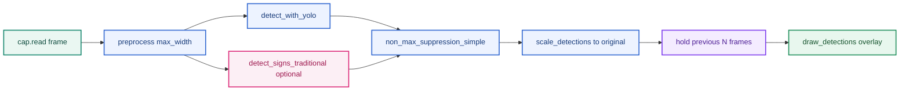

| Hàm | File line (xấp xỉ) | Vai trò |
|---|---|---|
| `preprocess()` | L63–68 | Resize theo `max_width`, không chuẩn hóa quang học |
| `detect_with_yolo()` | L195–209 | Ultralytics YOLO, `conf`, `imgsz`, `max_det=20` |
| `detect_signs_traditional()` | L136–169 | HSV mask + contour + shape heuristic |
| `non_max_suppression_simple()` | L172–192 | NMS IoU 0.45, sort theo diện tích |
| `scale_detections()` | L236–254 | Map bbox từ `proc_frame` → frame gốc |
| `main()` hold logic | L371–373 | Giữ `last_detections` tối đa `--hold` frame |

**Ví dụ luồng một frame:** Video 4K → `preprocess(max_width=1280)` thu nhỏ → YOLO `imgsz=512` → 2 bbox → miss frame sau → `hold=3` vẫn vẽ bbox cũ trên frame mới (không phải tracking).

---

## 4. Model `best.pt` — độ bao phủ và dữ liệu huấn luyện

### 4.1 Thông số kiến trúc (từ model card)

| Thuộc tính | Giá trị | Ý nghĩa triển khai |
|---|---|---|
| Kiến trúc | **YOLO11s** | One-stage, anchor-based family (xem chuyên đề kiến trúc) |
| Số class | **82** | Toàn bộ tập biển VN trong dataset HF |
| Input train/infer mặc định | **640×640** | `tsr_demo.py` mặc định `--imgsz 640` |
| Base pretrained | COCO `yolo11s.pt` | Transfer từ generic object → biển VN |
| Epochs | **50** (early stop patience 20) | |
| Optimizer | AdamW (auto) | |

### 4.2 Dataset huấn luyện — quy mô và phân bổ

Nguồn: [Traffic-sign-detection-VietNam](https://huggingface.co/datasets/star092304/Traffic-sign-detection-VietNam)

| Split | Số ảnh | Ghi chú |
|---|---:|---|
| Train | **8,125** | 8,124 có label + 36 ảnh nền (negative) |
| Validation | **1,016** | 1,014 có label + 2 negative |
| Test | **1,016** | 1,014 có label + 2 negative |
| **Tổng** | **10,157** | ~905 MB dataset |

| Thống kê instance | Giá trị |
|---|---:|
| Tổng bbox instance (gộp 82 class) | **~19,748** |
| Instance / ảnh labeled (trung bình) | **~2.0** |
| Class ít nhất | **32** instance (`Uneven road`) |
| Class nhiều nhất | **1,446** instance (`No Stopping & No Parking`) |
| Class có &lt; 100 instance | **16 / 82** (~19.5%) |
| Class có &lt; 50 instance | **3 / 82** (`Road with Surveillance Camera` 35, `No Moto Turn Left` 46, `Uneven road` 32) |

**Diễn giải độ bao phủ:**

- Model **được thiết kế để nhận 82 loại biển VN** trong dataset — không phải subset tùy repo.
- **ODD dữ liệu huấn luyện** thiên về ảnh tĩnh/crop-friendly trong dataset; không đại diện đầy đủ glare nặng, mưa lớn, biển tạm, domain ngoài VN.
- **Long-tail mạnh:** 16 class dưới 100 mẫu → recall thực tế trên các class hiếm (biển camera, biển đường trơn, công trường) **dễ suy giảm** dù mAP tổng cao.

### 4.3 Metric test (model card — GPU, không phải CPU repo)

| Metric | Giá trị |
|---|---:|
| Precision | 96.42% |
| Recall | 96.15% |
| mAP50 | 98.06% |
| mAP50-95 | 83.57% |
| FPS (GPU) | 61.5 |
| Mean latency (GPU) | 16.25 ms |

**Cảnh báo:** Các số trên **không** mô tả runtime `tsr_demo.py` trên CPU WSL. Benchmark local (xem §6) ~7–8 FPS, ~120–140 ms/frame.

### 4.4 Bảng “model bao phủ gì / không bao phủ gì”

| Phạm vi | Bao phủ | Không bao phủ |
|---|---|---|
| Class | 82 biển tĩnh trong dataset VN | Biển tạm, biển điện tử động, biển ngoài 82 class |
| Task | Detection + classification một lần | Lane association, map fusion, OCR chữ dài |
| Ngữ cảnh | Ảnh/video có biển trong FOV camera trước | Biển làn rẽ không áp dụng ego (chưa có logic) |
| Điều kiện | Gần với phân bổ dataset | Glare kéo dài, sương, đêm tối cực đoan (chưa validate repo) |
| Output | Bbox + class + conf trong overlay | ICD, DTC, feature state, HMI policy |

---

## 5. Ma trận: thiếu kỹ thuật → điểm yếu cụ thể

Bảng dưới map **gap trong code/model hiện tại** sang **triệu chứng quan sát được** khi chạy demo.

| # | Thiếu trong baseline | Kỹ thuật / block production | Điểm yếu cụ thể khi chạy |
|---|---|---|---|
| 1 | Chỉ `resize` trong `preprocess()` | CLAHE, gamma, exposure gate, quality score | Ban ngày qua tốt; **bóng cây / ngược sáng** → heuristic HSV miss; YOLO conf giảm, **false negative** biển đỏ/vàng |
| 2 | Không multi-scale inference | TTA hoặc pyramid / giữ resolution cao cho small object | `max_width=1280` + `imgsz=512` trên 4K → biển xa **&lt; 20px** sau resize → **miss biển nhỏ** (xem benchmark 4K) |
| 3 | `max_det=20` cố định | Dynamic cap theo scene density | Cảnh nhiều biển gần nhau → **cắt detection** (silent drop) |
| 4 | `conf=0.15` mặc định, không calibrate | Confidence calibration, per-class threshold | Class hiếm: **false positive** biển tương tự màu; class khó: vẫn **miss** dù hạ conf |
| 5 | NMS IoU 0.45 đơn giản | Class-aware NMS, soft-NMS | Hai biển chồng nhẹ → **mất một detection**; biển phản quang đôi → duplicate hoặc merge sai |
| 6 | `hold` thay tracking | SORT/Deep SORT + temporal confirmation | Video rung: bbox **nhảy vị trí** nhưng label giữ → trông ổn nhưng **không có track_id**; miss 1 frame vẫn hiện sign **chưa confirmed** |
| 7 | Không image quality gate | Blur/glare metric trước infer | Frame blur (mô tô rung): vẫn infer → **class jitter** 30↔50 trên vài frame |
| 8 | Heuristic label thô (`SpeedLimit (heuristic)`) | OCR / digit head / fine class map | Nhánh `--traditional` không phân biệt **50 vs 60** — chỉ “speed-like” |
| 9 | Không export runtime tối ưu | ONNX/OpenVINO/TensorRT INT8 | CPU PyTorch ~**140 ms** → không đủ 15–30 FPS ECU advisory |
| 10 | Không augment train trong repo | Mosaic, small-object aug, glare synth | Model phụ thuộc **19k instance gốc** — glare/occlusion ngoài phân bổ train → **SOTIF gap** |
| 11 | Không negative mining có hệ thống | Hard negative (biển quảng cáo đỏ tròn) | **False positive** vật thể sign-like dưới glare (điểm SOTIF trong unified doc) |
| 12 | Không lane / map context | Map fusion stub trở lên | Detect đúng biển **làn rẽ** → vẫn overlay → **false advisory** nếu coi là feature |
| 13 | Overlay = output | `jsonl` feature output lite | Không replay phân tích lỗi theo `feature_state` / `reason_codes` |
| 14 | Không per-class eval trong repo | Confusion matrix theo 82 class | Không biết **16 class long-tail** nào đang fail trên video cụ thể |

### 5.1 Ví dụ cụ thể theo tình huống

**Tình huống A — biển 50 xa trên video 4K, `--max-width 1280 --imgsz 512`**

- Thiếu #2 (multi-scale / resolution) + #4 (small object sensitivity YOLO11s).
- Triệu chứng: không bbox đến khi xe gần; hoặc conf &lt; 0.15 → không hiển thị.
- Cách kiểm chứng: chạy cùng clip với `--imgsz 640 --max-width 1920`, so sánh frame có/không detection.

**Tình huống B — detector đổi `80` → `50` → không sign trong 3 frame với `--hold 3`**

- Thiếu #6 (tracking thật).
- Triệu chứng: overlay vẫn hiện `80` trong lúc detector đã thấy `50` một frame (hold kéo state cũ).
- Đây là lý do **hold ≠ temporal confirmation**.

**Tình huống C — `--traditional` bật, nhiều vòng đỏ quảng cáo**

- Thiếu #8 (OCR/class fine) + #11 (hard negative).
- Triệu chứng: `SpeedLimit (heuristic)` xuất hiện trên vật không phải biển giao thông; merge NMS có thể ưu tiên box lớn sai.

---

## 6. Runtime local đã đo (gắn tham số `tsr_demo.py`)

| Video | CLI tương đương | Avg latency | FPS | Peak RSS |
|---|---|---:|---:|---:|
| `traffic_sign_test.mp4` | `imgsz=640, max_width=1280, skip=0` | 139.68 ms | 7.16 | 696.04 MB |
| `14212806_3840_2160_60fps.mp4` | `imgsz=512, max_width=1280, skip=1` | 123.17 ms | 8.12 | 1076.44 MB |

**Điểm yếu hệ thống từ số đo:**

- **Latency ~8×** so với GPU model card (16 ms vs ~140 ms) → thiếu #9 (edge runtime) là blocker cho realtime 30 fps trên CPU.
- **RSS &gt; 1 GB** trên clip 4K → thiếu memory budget cho ECU nhỏ nếu không quantize/export.
- `skip=1` giảm load nhưng **bỏ lỡ frame** → cộng hưởng với thiếu tracking (#6).

---

## 7. Nhánh xử lý ảnh truyền thống trong repo

### 7.1 Cấu hình HSV hiện tại (`HSV_RANGES`)

```python
# tsr_demo.py L55-60 — tóm tắt
red1: H 0-10, red2: H 170-179, blue: H 100-130, yellow: H 20-35
S >= 70-80, V >= 50
```

| Thiếu | Điểm yếu cụ thể |
|---|---|
| Không adaptive threshold theo exposure | Đêm / tăng gain → **miss mask đỏ** (Hue unstable) |
| Không CLAHE trước `inRange` | Bóng cây trên biển vàng → **miss tam giác cảnh báo** |
| `classify_shape` cố định circularity &gt; 0.72 | Biển xiên / ellipse → label `unknown`, bỏ qua |
| Không `frame_quality_score` gate | Vẫn chạy heuristic trên frame blur → **false candidate** |

### 7.2 Vai trò đúng của nhánh traditional trong repo

| Nên dùng | Không nên dùng |
|---|---|
| Debug: YOLO miss nhưng contour đỏ tròn đẹp | Thay YOLO làm nhánh quyết định chính |
| Log candidate cho mở rộng dataset | Phát HMI từ `SpeedLimit (heuristic)` |
| So sánh A/B khi thử preprocess mới | Claim accuracy từ heuristic label thô |

---

## 8. Khuyến nghị ưu tiên và ma trận gap → work item

### 8.1 Ưu tiên theo impact lên `tsr_demo.py`

| Ưu tiên | Hành động | Giảm điểm yếu # |
|---|---|---|
| P0 | Thêm `jsonl` feature output + temporal confirmation lite (hit/miss) | #6, #13 |
| P0 | Benchmark `best.onnx` / OpenVINO cùng protocol video | #9 |
| P1 | `frame_quality_score` + skip infer khi POOR | #1, #7 |
| P1 | Per-class eval script trên video + confusion theo 82 class | #4, #14 |
| P2 | CLAHE optional trong `preprocess()` | #1 |
| P2 | Map stub log `map_conflict` | #12 |
| P3 | OCR/digit cho speed family (nếu mở rộng class) | #8 |

### 8.2 Ma trận gap repo → work item

| Gap repo | Work item đề xuất | Liên quan §5 |
|---|---|---|
| Output chỉ là video overlay | `--jsonl-output`, event schema | #13 |
| `hold_left` thay tracking | Tracker/lifecycle lite | #6 |
| Không có quality gate | Blur/glare/exposure score | #1, #7 |
| Không có lane association | Ego lane corridor stub | #12 |
| Không có map fusion | Map speed input stub và arbiter | #12 |
| Không có ISA model | Speed limit canonicalization và ISA state | #4 |
| Không có benchmark architecture | YOLO vs RT-DETR protocol | #2, #5 |
| Không có dataset card | Dataset card và scenario tags | #10, #14 |
| Không có KPI script | Frame/event/track KPI | #14 |
| Không có RCA evidence bundle | Failure taxonomy và replay log | #13 |
| Không có SOTIF catalog | Trigger catalog và residual risk matrix | #10, #11 |
| Không có edge export protocol | ONNX/OpenVINO/TensorRT benchmark | #9 |

### 8.3 Next actions theo maturity

| Ưu tiên | Action |
|---|---|
| P0 | Thêm JSONL output cho frame/detection/timing để có dữ liệu review. |
| P0 | Thêm tracker/lifecycle lite thay `hold_left`. |
| P1 | Thêm quality score và reason code. |
| P1 | Tạo KPI script cho precision/recall theo class/size và latency p95. |
| P1 | Tạo export benchmark ONNX/OpenVINO. |
| P2 | Tạo schema cho lane/context/map stub. |
| P2 | Tạo ISA speed-limit canonicalization cho speed sign family. |
| P3 | A/B RT-DETR hoặc transformer teacher cho data mining. |

---

## 9. Liên kết

- Kiến trúc detector (anchor, FPN, NMS…): [3.research_tsr_detection_architecture_research.md](3.research_tsr_detection_architecture_research.md)
- Hệ thống production: [1.research_tsr_three_part_unified.md](1.research_tsr_three_part_unified.md)
- Nguồn: [sources.md](sources.md)

---

## 10. KPI production cho TSR

> **Tổng quan V-model và gate checklist:** [1.research_tsr_three_part_unified.md](1.research_tsr_three_part_unified.md) §II.10, §II.18. Phần này là **nguồn chính** cho bảng KPI gate, release flow và tiêu chí OEM.

KPI production TSR phải đo từ nhiều góc: detector, track, feature, HMI, system, safety và operations. Một con số mAP không đủ vì nó không đo sign lifecycle, applicability, map conflict, latency tail, availability hoặc driver-facing false advisory.

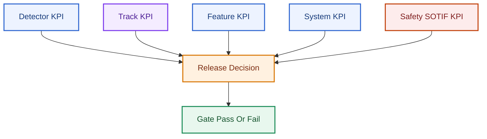

### 10.1 Bảng KPI production

| Nhóm KPI | Metric | Ý nghĩa | Gate gợi ý (OEM thường negotiate) |
|---|---|---|---|
| Detection | mAP50, mAP50-95, precision, recall, FP/hour | Năng lực bbox/class frame-level | mAP50 class critical ≥ target nội bộ; **không** dùng làm gate duy nhất |
| Small object | Recall theo size bin (0–16, 16–32, 32–64 px), time-to-first-detection | Biển thấy đủ sớm | Recall bin 16–32 px ≥ recall bin 64+ (hoặc justify trade-off) |
| Tracking | Track purity, ID switch, confirmation latency, stale duration | Object ổn định theo thời gian | ID switch < threshold/route; confirm latency < $T_{ttf}$ budget |
| Feature | Correct active speed limit rate, false advisory /100 km, missed advisory /100 km | Output driver/ISA đúng | False advisory speed sign: **cực thấp** (OEM thường ưu tiên hơn recall) |
| Context | Non-ego suppression accuracy, lane applicability accuracy | Sign áp đúng ego | Scenario catalog lane-split phải pass riêng |
| Fusion | Agreement rate, conflict resolution correctness | Arbitration hợp lý | Construction/temporary override cases có evidence |
| HMI | Flicker rate, warning latency, stale display time | UX ổn định | Flicker = 0 cho confirmed sign; stale < policy TTL |
| System | p50/p95/p99 latency, RAM peak, thermal | ECU feasibility | p99 < frame budget (ví dụ 33 ms @ 30 fps); không chỉ avg FPS |
| Availability | AVAILABLE/DEGRADED/UNAVAILABLE ratio theo ODD | Feature dùng được khi nào | Degraded behavior phải có test evidence |
| Safety/SOTIF | Trigger coverage %, residual risk sign-off | Safety review | Mỗi trigger catalog có mitigation + test result |
| ISA/SLIF | Speed limit correctness % trên route validation | Compliance EU 2021/1958 | **≥ 90%** quãng đường test 400 km (delegated regulation) |

### 10.2 Vì sao quan trọng trong automotive

OEM review thường hỏi "khi nào fail, fail như thế nào, người lái thấy gì, xe log gì, và team có evidence nào". KPI phải hỗ trợ trả lời câu hỏi đó theo route, scenario, version và release gate. Metric cần stable qua software update để phát hiện regression.

### 10.3 Ví dụ KPI theo scenario

| Scenario | KPI cần xem |
|---|---|
| Highway daylight | Time-to-first-detection, speed sign recall, p95 latency. |
| Urban dense sign | False advisory per km, multi-sign duplicate, NMS miss. |
| Night reflective signs | Confusion matrix, quality gate, false positive rate. |
| Construction zone | Camera-map conflict correctness, temporary sign override. |
| Lane split | Lane applicability accuracy, pending-state duration. |

---

## 11. Release Gate Framework

Release gate buộc team chứng minh evidence trước khi nâng authority feature — từ lab replay → bench/HIL → shadow mode → pilot → SOP.

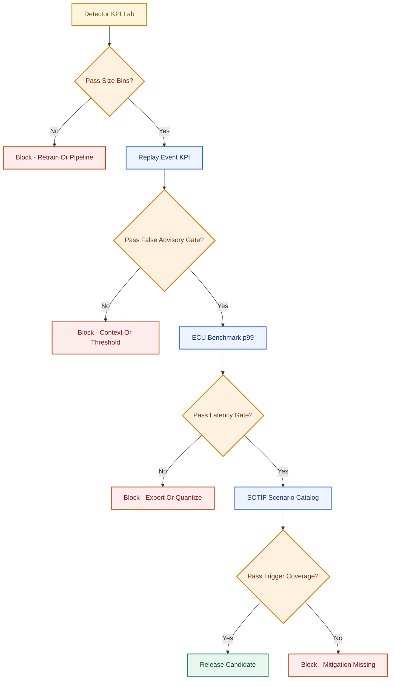

### 11.1 Test gates theo V-model

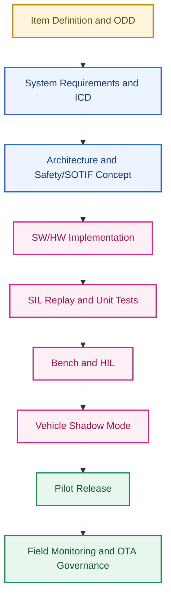

| Gate | Điều kiện tối thiểu |
|---|---|
| Concept freeze | Đã khóa item definition, ODD, misuse assumptions và hazard list đủ dùng để thiết kế tiếp |
| Architecture freeze | Đã chốt module split, ICD v1, watchdog concept và chiến lược DTC ở mức kiến trúc |
| Integration entry | Có timing budget, startup/shutdown behavior và signal contract để nối sang ECU/HMI thật |
| Pilot entry | Đã pass SIL/HIL chính, HMI mapping đúng, restart path và freeze-frame path có evidence |
| SOP entry | Có vòng triage hiện trường, rollback OTA và release evidence đủ để chịu trách nhiệm sau phát hành |

### 11.2 Production implementation pattern

| Pattern | Implementation |
|---|---|
| Scenario catalog | Route/weather/light/road-type/traffic/sign-family tags. |
| Event-level ground truth | Label sign validity interval, ego applicability, lane, map conflict. |
| KPI dashboard | Report by version, route, class, size, ODD and ECU target. |
| Regression gate | Fail build if KPI drop exceeds threshold in critical scenario. |
| Tail latency | Report p95/p99, not just average FPS. |
| Field monitoring | Aggregate anonymized false advisory/miss reports post-SOP. |

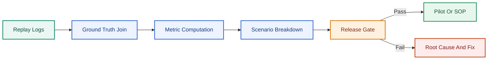

### 11.3 Release checklist embedded

- ICD frozen; DTC list thống nhất;
- Watchdog/restart policy có bằng chứng test;
- Brownout/over-temperature đã kiểm tra;
- Benchmark target hardware có;
- Update/rollback dry-run;
- Field logging đủ điều tra issue sau pilot.

**Chưa được release nếu:** Model đẹp trên laptop nhưng chưa target HW benchmark; cluster icon chưa integration test; mất camera mà HMI không báo unavailable; chưa rollback khi update model fail.

---

## 12. Tiêu chí gate KPI và gap repo

### 12.1 Trade-offs khi đặt gate

| Quyết định | Ưu điểm | Rủi ro |
|---|---|---|
| Strict false advisory gate | Tăng trust | Có thể giảm recall quá mức. |
| Strict recall gate | Ít missed signs | Có thể tăng false warning. |
| Event-level labeling | Đúng với feature | Label cost cao. |
| Frame-level only | Rẻ hơn | Không đánh giá lifecycle/HMI đúng. |

### 12.2 Gap repo hiện tại

Repo có runtime measurement thủ công trong §6, nhưng chưa có script KPI, JSON output, scenario catalog, ground truth format, event-level validation hoặc release gate. Hành động gần nhất là thêm `--jsonl-output` để mỗi frame/track ghi detection, timing, quality và reason code.

| Thiếu | Hậu quả khi review |
|---|---|
| Không có KPI script | Không regression được giữa model versions |
| Không có scenario catalog | KPI tổng che failure night/glare/construction |
| Không có event-level GT | Không đo sign lifetime và applicability |
| Không lock protocol | Benchmark local không so sánh được qua update |

### Key Takeaways — §10–§12

| Điểm chính | Ý nghĩa |
|---|---|
| KPI phải đi qua feature layer | Frame mAP không đủ cho TSR production. |
| Tail latency quan trọng hơn average | ECU fail thường nằm ở p95/p99 và thermal condition. |
| Scenario breakdown bắt buộc | KPI tổng có thể che failure trong night/glare/construction. |

### Common Engineering Mistakes — §10–§12

| Lỗi | Hậu quả |
|---|---|
| Báo FPS trung bình duy nhất | Không thấy latency spike làm miss frame. |
| Không có event-level ground truth | Không đo được sign lifetime và applicability. |
| Không lock protocol giữa model versions | Regression không thể so sánh. |

---

## 13. Failure Mode Catalog

Failure mode là biểu hiện lỗi ở feature output; root cause là nguyên nhân kỹ thuật phía dưới. TSR RCA phải nối perception, sensor, compute, tracking, context, map, HMI và diagnostics.

| Failure Mode | Symptom | Root Cause Candidate | Evidence cần có |
|---|---|---|---|
| Missed sign | Không publish biển thật | Small object, blur, occlusion, threshold, ODD out | Frame, bbox GT, quality, detector raw output. |
| False advisory | Publish biển không áp dụng | False positive, non-ego lane, map stale, context filter fail | Track log, lane state, map segment, reason code. |
| Wrong class | `60` thành `80` | Digit resolution, glare, class imbalance | Crop history, confidence series, confusion matrix. |
| Flicker | HMI hiện/mất liên tục | No tracking, threshold jitter, quality fluctuation | Track lifecycle, hit/miss, HMI event. |
| Stale sign | HMI giữ sign cũ | TTL quá dài, no ego-motion expiry | Ego distance, route transition, last hit time. |
| Late advisory | Sign publish quá muộn | Small object miss, confirmation delay, latency | Time-to-first-detection, p95 latency, speed. |
| Runtime dropout | Frame skipped hoặc infer fail | CPU/RAM/thermal, video source issue | Runtime log, watchdog, memory, DTC. |

Map với triệu chứng §5:

| Failure mode | Điểm yếu §5 liên quan |
|---|---|
| Missed sign | #2, #4, #7, #10 |
| False advisory | #8, #11, #12 |
| Wrong class | #4, #8 |
| Flicker | #6 |
| Stale sign | #6 |
| Late advisory | #2, #6, #9 |
| Runtime dropout | #9 |

---

## 14. RCA framework và Evidence Bundle

### 14.1 Quy trình RCA

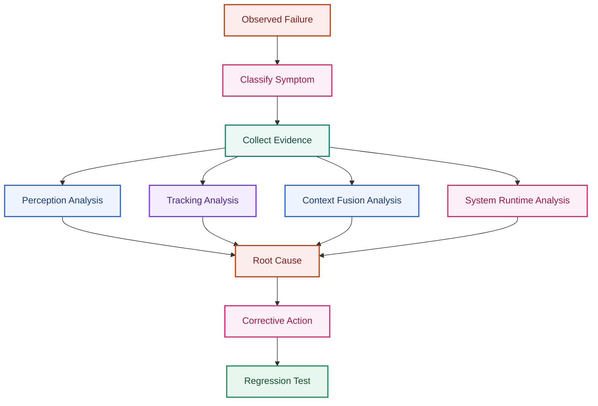

### 14.2 Vì sao quan trọng trong automotive

Production bug triage cần biết lỗi thuộc team nào và sửa ở đâu. Nếu không có RCA structure, team perception có thể retrain model cho lỗi thật ra do map conflict policy; team system có thể tăng timeout cho lỗi thật ra do detector miss small object. RCA tốt giảm vòng lặp thử-sai.

### 14.3 Production implementation pattern

| Pattern | Implementation |
|---|---|
| Failure taxonomy | Chuẩn hóa failure type và owner. |
| Evidence bundle | Frame crop, full frame, raw detections, tracks, map state, HMI output. |
| RCA tree | Sensor → detector → tracker → context → fusion → HMI → system. |
| Corrective action link | Mỗi RCA dẫn tới data, model, rule, runtime hoặc requirement fix. |
| Regression suite | Case đã fail phải thành test cố định. |

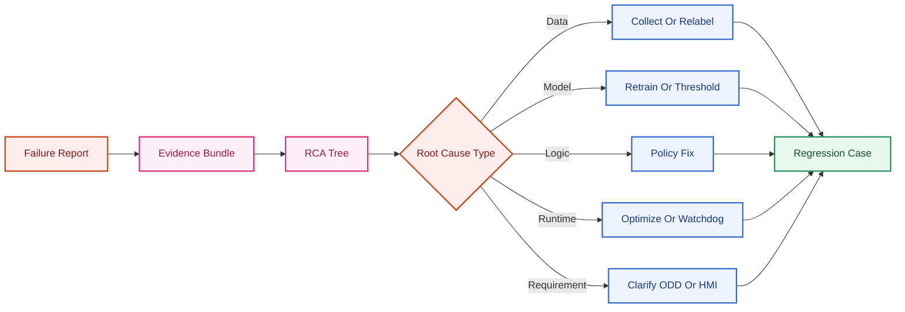

### 14.4 Trade-offs logging

| Quyết định | Ưu điểm | Rủi ro |
|---|---|---|
| Log full evidence | RCA mạnh | Storage/privacy cost. |
| Log compact events | Nhẹ, dễ deploy | Có thể thiếu frame để debug. |
| Hard negative retraining | Giảm false positive | Có thể làm model conservative. |
| Rule fix nhanh | Dễ patch | Rule debt nếu không regression-test. |

### 14.5 Gap repo hiện tại

Repo chưa có event log, track log, raw detector dump, quality score, map/context state hoặc failure taxonomy. Khi demo fail, người dùng chỉ nhìn video và đoán nguyên nhân. Đề xuất: tạo `failure_cases/` hoặc JSONL schema trong repo ở bước tiếp theo — không lưu video nặng trong Git.

### Key Takeaways — §13–§14

| Điểm chính | Ý nghĩa |
|---|---|
| RCA cần evidence đa lớp | Frame overlay không đủ để phân biệt root cause. |
| Failure case phải thành regression | Nếu không, cùng lỗi sẽ quay lại sau update. |
| Root cause không luôn nằm ở model | Lane, map, HMI, timeout và runtime đều có thể là nguyên nhân. |

### Common Engineering Mistakes — §13–§14

| Lỗi | Hậu quả |
|---|---|
| Retrain model cho mọi lỗi | Tốn thời gian và có thể không sửa đúng cause. |
| Không giữ raw detection trước filter | Không biết lỗi do detector miss hay context suppress. |
| Không version model/runtime/map | RCA không tái lập được. |

---

## 15. Scenario-Based Validation Catalog

Catalog scenario là work product bắt buộc trước pilot — không dataset công khai nào thay thế coverage ODD thật. Mỗi scenario phải có tag, KPI mục tiêu, expected behavior và evidence path.

### 15.1 Ma trận scenario cốt lõi

| Scenario tag | Điều kiện / mô tả | KPI ưu tiên | Expected behavior (production) | Gap repo hiện tại |
|---|---|---|---|---|
| **Day** | Ban ngày, exposure ổn định | Recall speed/mandatory, time-to-first-detection | Detect và confirm sign trong budget latency | Chưa có scenario tag trên replay |
| **Night** | Đèn đường / headlight, reflective sign | FP rate, class confusion, quality gate | Quality gate + temporal confirmation; degrade nếu bloom | Dataset train thiên ban ngày; chưa validate |
| **Rain** | Mưa nhẹ–vừa, lens wet | Availability, miss rate, degraded ratio | `DEGRADED` khi quality thấp; không publish sign mới mù | Không quality gate trong `preprocess()` |
| **Fog** | Tầm nhìn &lt; 100 m | Miss rate, false advisory | `UNAVAILABLE` hoặc conservative hold | Chưa có ODD monitor |
| **Glare** | Ngược sáng, sun strike | Wrong class, miss, SOTIF trigger | Suppress sign mới; giữ advisory cũ timeout ngắn | Thiếu #1, #7 — HSV/YOLO conf giảm |
| **Construction** | Biển tạm, work zone | Camera-map conflict, override correctness | Ưu tiên camera nếu sign confirmed | Không map stub |
| **Highway** | Tốc độ cao, biển xa nhỏ | Size-bin recall, $T_{ttf}$, p99 latency | Detect sớm đủ cho advisory | Thiếu #2 — small object trên 4K |
| **Urban** | Nhiều biển, quảng cáo sign-like | FP/km, NMS miss, duplicate | Context filter + hard negative | Thiếu #3, #11 |
| **Rural** | Biển thưa, contrast thấp | Long-tail recall, small object | Per-class threshold; multi-scale | 16/82 class &lt;100 instance |
| **Occlusion** | Che bởi xe/tải/cột | Stale duration, late re-detect | Track `STALE` → `ACTIVE`; không flicker | `hold` không có lifecycle |
| **Motion blur** | Rung đường, mount lỏng | Class jitter, miss | Blur metric → skip infer hoặc degrade | Thiếu #7 — vẫn infer frame blur |

### 15.2 Tagging và split protocol

| Pattern | Implementation |
|---|---|
| Scenario tagging | Gắn tag: day/night/rain/fog/glare/urban/highway/rural/tunnel/construction/occlusion/motion_blur. |
| Route-level split | Không để frame gần nhau rơi vào train/test khác nhau. |
| Size bins | Report KPI theo bbox pixel area hoặc sign distance proxy. |
| Hard negative loop | Thu thập false positive sign-like và đưa vào retraining/eval. |

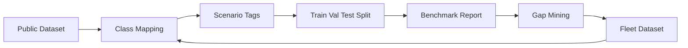

### 15.3 Coverage tối thiểu trước pilot

| Nhóm | Số scenario tối thiểu gợi ý | Gate |
|---|---|---|
| Lighting | day + night + glare | Pass riêng từng tag; không gộp KPI |
| Weather | rain + fog (phase-1 ODD) | Degraded behavior có evidence |
| Road type | highway + urban + rural | Lane-split subset bắt buộc trong urban |
| Perception stress | occlusion + motion_blur | Track lifecycle KPI, không chỉ frame mAP |
| Authority | construction + temporary sign | Conflict policy có log |

---

## 16. OEM/Tier-1 Validation Practices

OEM/Tier-1 không chấp nhận claim production từ một dataset nhỏ hoặc một quốc gia. Validation phải chạy trên **scenario catalog + route coverage + fleet evidence**.

### 16.1 Chiến lược validation nhiều tầng

| Tầng | Mục đích | Artefact |
|---|---|---|
| SIL replay | Regression detector/track/feature trên log đã ghi | JSONL replay, KPI dashboard |
| Bench / HIL | ICD, timing, HMI mapping, watchdog | Integration test report |
| Shadow mode | Chạy trên xe thật, chỉ log, không ảnh hưởng control | Fleet log slice, anonymized events |
| Pilot route | Route có GT event-level, driver observation | False advisory / miss per 100 km |
| Post-SOP monitoring | Regression theo class/ODD sau OTA | Telematics aggregate, DTC rate |

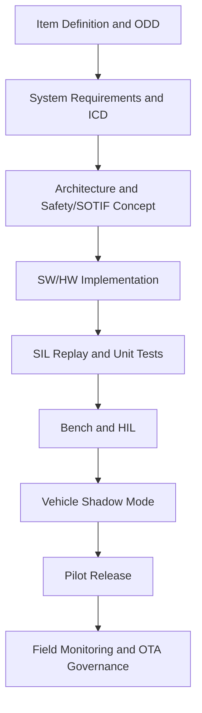

### 16.2 Shadow mode

| Thuộc tính | Mô tả |
|---|---|
| Mục tiêu | Thu thập behavior trên ODD thật mà không ảnh hưởng logic điều khiển khác |
| Output | Log JSONL/event: detection, track, timing, quality, reason_code |
| So sánh | Shadow output vs map/GT (nếu có) — đo false advisory tiềm năng |
| Gate vào pilot | Shadow pass KPI critical scenarios; không blocker DTC mới |
| Repo gap | `tsr_demo.py` chỉ overlay video — chưa shadow-capable |

**STATE-B / Shadow Feature** (roadmap repo): chạy trên xe hoặc bench integration, chỉ log và chưa ảnh hưởng logic điều khiển khác.

### 16.3 Fleet validation

| Practice OEM/Tier-1 | Nội dung |
|---|---|
| Private fleet data | ODD theo country, camera, lens, mount, ISP, weather, road type, usage |
| Route catalog | Đủ đại diện highway/urban/rural; không một clip đẹp |
| Event-level GT | Sign validity interval, ego applicability, lane |
| Regression per OTA | Signed package + rollback dry-run + post-update sanity |
| Field triage | DTC + freeze-frame + telematics slice theo class/ODD |

**Nguyên tắc:** Dataset công khai (VN HF 10,157 ảnh) hỗ trợ research/benchmark — **không** thay fleet validation làm release gate duy nhất.

| Phase dataset | Mix | Mục tiêu |
|---|---|---|
| Research/baseline | VN HF 100% | Fit 82 class, benchmark `tsr_demo.py` |
| Pretrain (optional) | Mapillary hoặc TT100K → finetune VN | Tăng small-object và diversity |
| Production validation | **Fleet/route catalog riêng** | KPI event-level |
| Edge-case mining | GLARE + hard negative từ field | SOTIF trigger coverage |

### 16.4 Câu hỏi OEM thường đặt

| Câu hỏi | Evidence cần trả lời |
|---|---|
| Khi nào fail? | Scenario breakdown §15, failure catalog §13 |
| Người lái thấy gì? | HMI event log, flicker/stale KPI |
| Xe log gì? | JSONL, DTC, freeze-frame |
| Có regression sau update không? | Locked protocol, versioned model hash |
| SLIF/ISA compliance? | Route 400 km, ≥ 90% correctness (nếu scope ISA) |

---

## 17. Repository Maturity Assessment (L0–L5)

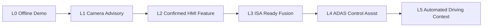

| Level | Capability | Required Evidence | Repo gap |
|---|---|---|---|
| L0 Offline Demo | Video overlay, manual review | Script chạy được, sample replay | **Repo đang ở gần mức này.** |
| L1 Camera Advisory Prototype | Detection + basic threshold | Per-class eval, basic runtime | Cần JSONL và test set. |
| L2 Confirmed HMI Feature | Tracking, lifecycle, HMI policy | Track KPI, flicker KPI, DTC basic | Cần tracker/state/ICD. |
| L3 ISA-Ready Fusion | Camera+map speed source | Fusion KPI, conflict policy, ISA state | Cần map/ego speed/ISA model. |
| L4 ADAS Control Assist | Speed advisory ảnh hưởng control assist | Safety case, driver override, regulation evidence | Cần system integration sâu. |
| L5 Automated Driving Context | Sign semantics vào planning | HD map/lane fusion, ODD, fallback, scenario validation | Cần full AD stack interface. |

| Mức trưởng thành | Repo hiện tại | Evidence cần có để lên mức tiếp |
|---|---|---|
| L0 Offline demo | **Đang ở đây** — overlay video, ~7–8 FPS CPU | Script chạy ổn định, benchmark protocol |
| L1 Advisory prototype | Thiếu JSONL, per-class eval | `--jsonl-output`, KPI script |
| L2 Confirmed HMI | Thiếu tracker thật (`hold` ≠ tracking) | Track ID, lifecycle, flicker KPI |
| L3 ISA-ready | Thiếu map/ego speed/ISA model | Fusion arbiter, speed canonicalization |
| L4+ AD context | Thiếu lane/map/planning interface | Full stack integration + safety case |

Roadmap repo map trực tiếp:

| State | Nội dung |
|---|---|
| `STATE-A / Offline Replay` | Khóa flow cơ bản, benchmark, failure cases và CLI |
| `STATE-B / Shadow Feature` | Chạy trên xe/bench, chỉ log |
| `STATE-C / Confirmed Advisory` | Temporal confirmation, HMI policy, diagnostics |
| `STATE-D / ISA-ready` | Corroboration mạnh, sign lifetime, validation sâu |

---

## 18. Production Readiness Assessment

### 18.1 Câu hỏi cốt lõi

**"Detector chạy được trên video có nghĩa là feature sẵn sàng production chưa?"** — **Chưa**, nếu chưa có tracking/lifecycle, lane association, context filter, fusion, ISA abstraction, KPI theo event, SOTIF catalog, edge parity và release gate.

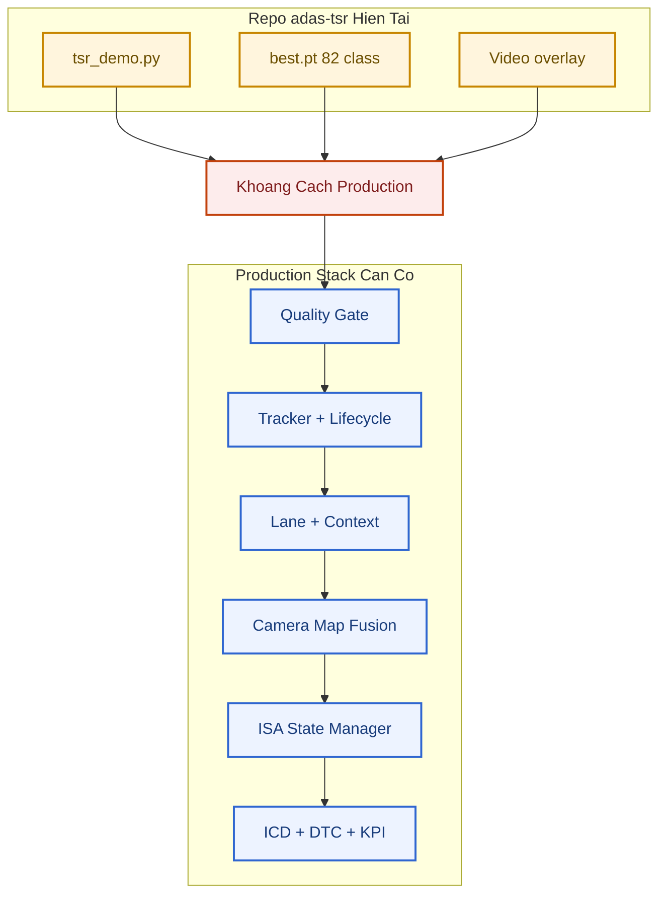

### 18.2 Checklist readiness theo block

| Block | Repo hiện tại | Production cần | Ready? |
|---|---|---|---|
| Detector | YOLO `best.pt`, conf/imgsz CLI | Calibrated conf, per-class threshold, edge export | **Partial** — detect được, chưa edge/KPI |
| Quality gate | `preprocess()` chỉ resize | Blur/glare/exposure score | **No** |
| Tracking | `--hold` | Track ID, lifecycle, hit/miss | **No** |
| Context / lane | Không có | Applicability, reason_code | **No** |
| Fusion / ISA | Không có | Map arbiter, speed canonicalization | **No** |
| Output | Video overlay | ICD, JSONL, DTC | **No** |
| Validation | Benchmark local §6 | Scenario catalog, release gate, fleet | **No** |
| Edge runtime | PyTorch CPU ~140 ms | p99 &lt; 33 ms target ECU | **No** |

### 18.3 Work products trước pilot

1. Item Definition TSR  
2. ODD specification và state model  
3. Functional safety assessment (TSR + shared-platform dependencies)  
4. SOTIF trigger-condition catalogue  
5. System architecture và module responsibility matrix  
6. ICD input/output/diagnostics/timing  
7. HMI policy document  
8. DTC/DID/freeze-frame specification  
9. Watchdog and recovery concept  
10. Replay/bench/HIL/vehicle validation plan  
11. Update and rollback concept  
12. Release readiness checklist  

### 18.4 Kết luận readiness

| Khía cạnh | Đánh giá |
|---|---|
| Research / demo baseline | **Đạt** — `tsr_demo.py` + `best.pt` chạy ổn, có benchmark local |
| Advisory prototype (L1) | **Chưa** — thiếu JSONL, KPI script, per-class video eval |
| Confirmed HMI (L2) | **Chưa** — `hold` ≠ tracking; không ICD/DTC |
| ISA-ready (L3+) | **Chưa** — không map, ego speed, fusion, SLIF route evidence |
| Release candidate | **Không** — chưa pass gate §11 trên scenario catalog §15 |

**Nguyên tắc:** Đừng release TSR dựa trên mAP GPU model card và video overlay. Authority tăng thì evidence tăng — JSONL, KPI, failure cases là nền cho mọi bước sau (xem §8).

---

## Key Takeaways

| Điểm chính | Ý nghĩa |
|---|---|
| `best.pt` bao phủ 82 class VN nhưng long-tail mạnh | 16/82 class có &lt;100 instance — recall thực tế trên class hiếm cần đo riêng |
| mAP GPU model card ≠ runtime CPU repo | ~140 ms/frame local vs 16 ms GPU — edge export là blocker |
| `hold` không phải tracking | Không có track_id, lifecycle, expiry theo ego-motion |
| Ma trận §5 map gap → triệu chứng cụ thể | Mỗi điểm yếu có tình huống kiểm chứng (4K, hold, traditional) |
| Repo ở L0 — chưa production-ready | §18: thiếu quality gate, tracker, ICD, release gate |
| P0 tiếp theo: JSONL + temporal confirmation + ONNX benchmark | §8.3 — nền cho KPI §10, RCA §14, shadow mode §16 |
| Release gate đa tầng bắt buộc | §11: lab KPI → event KPI → ECU p99 → SOTIF catalog |
| Scenario catalog §15 không thay fleet validation | OEM cần route/event GT riêng — VN HF chỉ là research baseline |

## Common Engineering Mistakes

| Lỗi | Hậu quả |
|---|---|
| Dùng mAP test GPU để claim demo CPU đạt realtime | Release gate fail khi lên ECU |
| Bật `--traditional` rồi tin heuristic label | False advisory speed-like trên vật không phải biển |
| Resize 4K → 1280 + imgsz 512 rồi kết luận model kém | Pipeline đã xóa small object trước khi infer |
| Không eval per-class trên video thật | Long-tail failure bị che bởi metric tổng |
| Coi overlay video là feature output | Không có RCA, ICD, hay regression protocol |
