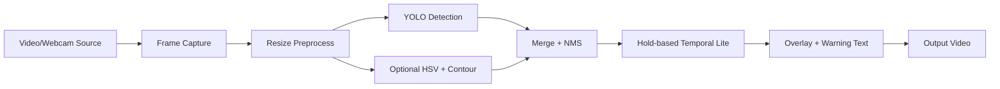
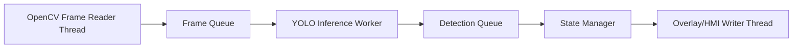

# Hybrid Pipeline Architecture

> **Vai trò file này:** đặc tả implementation cho pipeline lai YOLO/Ultralytics và Traditional CV trong `code/tsr_demo.py`.
>
> **Nguồn yêu cầu:** [2.01. Automotive Standards](../2.knowledge_base/01.automotive_standards.md) và [2.03. Safety Analysis HAZOP and FTA](../2.knowledge_base/03.safety_analysis_hazop_fta.md).

## 1. Mục Tiêu

Pipeline lai giúp prototype không chỉ phụ thuộc vào một đường nhận diện duy nhất. YOLO là nhánh chính vì có khả năng học đặc trưng phức tạp và phân loại nhiều lớp biển Việt Nam. Traditional CV là nhánh phụ dựa trên màu/hình học, dùng như lớp kiểm chứng chéo hoặc candidate generator trong các cảnh đơn giản.

Trong ngữ cảnh SOTIF, nhánh CV truyền thống không thay thế YOLO. Nó giúp quan sát một nhóm rủi ro khác: nếu YOLO miss biển tròn đỏ rõ ràng, heuristic có thể tạo tín hiệu đối chiếu; nếu heuristic false alarm vì vật thể giống biển, provenance giúp hệ thống không nhầm đó là detection chính.

## 2. Runtime Hiện Tại

`code/tsr_demo.py` đang đi theo pipeline:

Các contract chính:

| Block | Input | Output | Ghi chú |
|---|---|---|---|
| Frame capture | Video path hoặc camera index | Raw frame | Cần giữ frame order và FPS input. |
| Preprocess | Raw frame | Frame resized | `max_width` giảm tải xử lý. |
| YOLO detection | Frame preprocess | Bbox, class, confidence | Main path, dùng weights `models/best.pt`. |
| Traditional CV | Frame preprocess | Candidate heuristic | Optional, bật khi cần so sánh hoặc fallback nhẹ. |
| Merge + NMS | Detection list | Detection list đã lọc overlap | Cần giữ provenance ở bước nâng cấp tiếp theo. |
| Temporal lite | Detection hiện tại và detection cũ | Detection hiển thị | Hiện là hold, chưa phải tracking/lifecycle đầy đủ. |
| Overlay/output | Frame gốc và detection | Video annotate | Phục vụ demo, chưa phải HMI production. |

## 3. Nhánh YOLO

Nhánh YOLO/Ultralytics chịu trách nhiệm detection và classification chính. Mỗi detection gồm:

- tọa độ bounding box;
- class name;
- confidence;
- màu hiển thị theo nhóm biển;
- key nội bộ phục vụ cảnh báo đơn giản.

Yêu cầu nâng cấp:

- ghi rõ provenance `source=yolo`;
- thêm confidence policy theo nhóm biển;
- log bbox/class/confidence ra JSONL khi cần benchmark;
- giữ detection ở frame preprocess nhưng scale bbox về frame gốc trước khi output.

## 4. Nhánh Traditional CV

Nhánh CV truyền thống hiện dựa trên:

- HSV threshold cho đỏ, xanh, vàng;
- Hough Circle Transform cho biển tròn, đặc biệt nhóm speed limit/prohibitory;
- morphology để giảm noise;
- contour extraction;
- shape classification đơn giản như circle, triangle, rectangle;
- NMS để giảm candidate trùng lặp.

Vai trò đúng:

| Vai trò | Nên dùng | Không nên dùng |
|---|---|---|
| Verification layer | Đối chiếu biển có màu/hình rõ, phát hiện pattern dễ giải thích. | Tuyên bố thay thế detector deep learning. |
| Candidate generator | Gợi ý vùng nghi ngờ để review hoặc fusion. | Publish HMI trực tiếp khi không có temporal/context gate. |
| Debug tool | So sánh miss/false alarm giữa YOLO và heuristic. | Đánh giá accuracy production nếu thiếu ground truth. |

## 4.1 Hybrid Verification Layer

Luồng hybrid theo prompt v3:

1. YOLO phát hiện vùng nghi ngờ biển báo nhưng confidence thấp, ví dụ `conf < 0.25`.
2. Runtime crop hoặc kiểm tra ROI quanh bbox đó.
3. Nhánh Traditional CV chạy song song trên CPU:
   - Hough Circle Transform kiểm tra hình tròn;
   - HSV segmentation kiểm tra màu đỏ/xanh/vàng;
   - morphology/contour lọc nhiễu.
4. Nếu hình dạng và màu sắc khớp với family biển báo, detection được giữ lại thêm vài frame hoặc nâng confidence nội bộ cho State Manager.
5. Nếu YOLO và CV mâu thuẫn, output phải ghi provenance và không publish thẳng HMI.

| Điều kiện | Hành vi hybrid |
|---|---|
| `yolo_conf >= threshold_high` | Dùng YOLO làm evidence chính. |
| `threshold_low <= yolo_conf < threshold_high` và CV xác nhận shape/color | Giữ detection như candidate mạnh hơn, yêu cầu temporal confirmation. |
| YOLO thấp nhưng CV mạnh | Chỉ log/candidate, không cảnh báo mạnh nếu thiếu confirmation. |
| CV báo biển nhưng YOLO không thấy | Ghi false-alarm candidate để review; không publish trực tiếp. |

## 5. Multi-threading Direction

Runtime hiện tại xử lý tuần tự. Khi nâng lên production-lite edge, pipeline nên tách tối thiểu ba vai trò: OpenCV frame reader thread để đọc/resize frame, YOLO inference worker để chạy model, và overlay/HMI writer thread để vẽ hoặc publish kết quả mà không chặn inference.

Nguyên tắc:

- queue phải có giới hạn để tránh OOM;
- frame quá cũ cần bị drop thay vì publish stale warning;
- timestamp/freshness quan trọng hơn xử lý đủ mọi frame;
- video writer không được chặn inference loop trong cấu hình realtime.

## 6. SOTIF Traceability

| Rủi ro SOTIF | Cách pipeline hỗ trợ | Phần còn thiếu |
|---|---|---|
| YOLO miss biển rõ | Traditional CV có thể tạo candidate đối chiếu. | Fusion/provenance chưa chuẩn hóa. |
| Heuristic false alarm | YOLO và NMS giúp giảm candidate yếu. | Context gate và suppression chưa có. |
| Camera mưa mờ | Pipeline có thể tiếp nhận quality score từ bước preprocess. | Runtime chính chưa có image quality monitor. |
| HMI flicker | Hold-based temporal lite giảm mất bbox ngắn hạn. | Chưa có tracking và lifecycle state đầy đủ. |

## 7. Acceptance Criteria

- Pipeline chạy được với YOLO-only và hybrid mode.
- Detection output giữ được `source`, `bbox`, `class`, `confidence`, `frame_id`.
- Nhánh heuristic không được publish như ground truth; nó chỉ là candidate hoặc cross-check.
- Latency từng block có thể đo được.
- Output video demo không được gọi là HMI production.
