# Hybrid Pipeline Architecture

> **Vai trò file này:** đặc tả implementation cho pipeline lai YOLO/Ultralytics và Traditional CV trong `code/tsr_demo.py`.
>
> **Nguồn yêu cầu:** [2.01. Automotive Standards](../2.knowledge_base/01.automotive_standards.md) và [2.03. Safety Analysis HAZOP and FTA](../2.knowledge_base/03.safety_analysis_hazop_fta.md).

## 1. Mục Tiêu

Pipeline lai giúp prototype không chỉ phụ thuộc vào một đường nhận diện duy nhất. YOLO là nhánh chính vì có khả năng học đặc trưng phức tạp và phân loại nhiều lớp biển Việt Nam. Traditional CV là nhánh phụ dựa trên màu/hình học, dùng như lớp kiểm chứng chéo hoặc candidate generator trong các cảnh đơn giản.

Trong ngữ cảnh SOTIF, nhánh CV truyền thống không thay thế YOLO. Nó giúp quan sát một nhóm rủi ro khác: nếu YOLO miss biển tròn đỏ rõ ràng, heuristic có thể tạo tín hiệu đối chiếu; nếu heuristic false alarm vì vật thể giống biển, provenance giúp hệ thống không nhầm đó là detection chính.

## 2. Runtime Hiện Tại

`code/tsr_demo.py` đang đi theo pipeline:

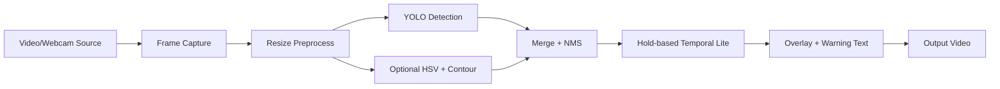

Các contract chính:

| Block | Input | Output | Ghi chú |
|---|---|---|---|
| Frame capture | Video path hoặc camera index | Raw frame | Cần giữ frame order và FPS input. |
| Preprocess | Raw frame | Frame resized | `max_width` giảm tải xử lý. |
| YOLO detection | Frame preprocess | Bbox, class, confidence | Main path, dùng weights `models/best.pt`. |
| Traditional CV | Frame preprocess | Candidate heuristic | Optional, bật khi cần so sánh hoặc fallback nhẹ. |
| Merge + NMS | Detection list | Detection list đã lọc overlap | Cần giữ provenance ở bước nâng cấp tiếp theo. |
| Temporal lite | Detection hiện tại và detection cũ | Detection hiển thị | Hiện là hold, chưa phải tracking/lifecycle đầy đủ. |
| Overlay/output | Frame gốc và detection | Video annotate | Phục vụ demo, chưa phải HMI production. |

## 3. Nhánh YOLO

Nhánh YOLO/Ultralytics chịu trách nhiệm detection và classification chính. Mỗi detection gồm:

- tọa độ bounding box;
- class name;
- confidence;
- màu hiển thị theo nhóm biển;
- key nội bộ phục vụ cảnh báo đơn giản.

Yêu cầu nâng cấp:

- ghi rõ provenance `source=yolo`;
- thêm confidence policy theo nhóm biển;
- log bbox/class/confidence ra JSONL khi cần benchmark;
- giữ detection ở frame preprocess nhưng scale bbox về frame gốc trước khi output.

## 4. Nhánh Traditional CV

Nhánh CV truyền thống hiện dựa trên:

- HSV threshold cho đỏ, xanh, vàng;
- Hough Circle Transform cho biển tròn, đặc biệt nhóm speed limit/prohibitory;
- morphology để giảm noise;
- contour extraction;
- shape classification đơn giản như circle, triangle, rectangle;
- NMS để giảm candidate trùng lặp.

Vai trò đúng:

| Vai trò | Nên dùng | Không nên dùng |
|---|---|---|
| Verification layer | Đối chiếu biển có màu/hình rõ, phát hiện pattern dễ giải thích. | Tuyên bố thay thế detector deep learning. |
| Candidate generator | Gợi ý vùng nghi ngờ để review hoặc fusion. | Publish HMI trực tiếp khi không có temporal/context gate. |
| Debug tool | So sánh miss/false alarm giữa YOLO và heuristic. | Đánh giá accuracy production nếu thiếu ground truth. |

## 4.1 Hybrid Verification Layer

Luồng hybrid theo prompt v3:

1. YOLO phát hiện vùng nghi ngờ biển báo nhưng confidence thấp, ví dụ `conf < 0.25`.
2. Runtime crop hoặc kiểm tra ROI quanh bbox đó.
3. Nhánh Traditional CV chạy song song trên CPU:
   - Hough Circle Transform kiểm tra hình tròn;
   - HSV segmentation kiểm tra màu đỏ/xanh/vàng;
   - morphology/contour lọc nhiễu.
4. Nếu hình dạng và màu sắc khớp với family biển báo, detection được giữ lại thêm vài frame hoặc nâng confidence nội bộ cho State Manager.
5. Nếu YOLO và CV mâu thuẫn, output phải ghi provenance và không publish thẳng HMI.

| Điều kiện | Hành vi hybrid |
|---|---|
| `yolo_conf >= threshold_high` | Dùng YOLO làm evidence chính. |
| `threshold_low <= yolo_conf < threshold_high` và CV xác nhận shape/color | Giữ detection như candidate mạnh hơn, yêu cầu temporal confirmation. |
| YOLO thấp nhưng CV mạnh | Chỉ log/candidate, không cảnh báo mạnh nếu thiếu confirmation. |
| CV báo biển nhưng YOLO không thấy | Ghi false-alarm candidate để review; không publish trực tiếp. |

## 5. Multi-threading Direction

Runtime hiện tại xử lý tuần tự. Khi nâng lên production-lite edge, pipeline nên tách tối thiểu ba vai trò: OpenCV frame reader thread để đọc/resize frame, YOLO inference worker để chạy model, và overlay/HMI writer thread để vẽ hoặc publish kết quả mà không chặn inference.

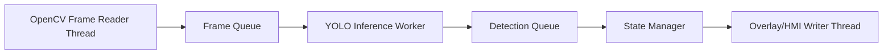

Nguyên tắc:

- queue phải có giới hạn để tránh OOM;
- frame quá cũ cần bị drop thay vì publish stale warning;
- timestamp/freshness quan trọng hơn xử lý đủ mọi frame;
- video writer không được chặn inference loop trong cấu hình realtime.

## 6. SOTIF Traceability

| Rủi ro SOTIF | Cách pipeline hỗ trợ | Phần còn thiếu |
|---|---|---|
| YOLO miss biển rõ | Traditional CV có thể tạo candidate đối chiếu. | Fusion/provenance chưa chuẩn hóa. |
| Heuristic false alarm | YOLO và NMS giúp giảm candidate yếu. | Context gate và suppression chưa có. |
| Camera mưa mờ | Pipeline có thể tiếp nhận quality score từ bước preprocess. | Runtime chính chưa có image quality monitor. |
| HMI flicker | Hold-based temporal lite giảm mất bbox ngắn hạn. | Chưa có tracking và lifecycle state đầy đủ. |

## 7. Acceptance Criteria

- Pipeline chạy được với YOLO-only và hybrid mode.
- Detection output giữ được `source`, `bbox`, `class`, `confidence`, `frame_id`.
- Nhánh heuristic không được publish như ground truth; nó chỉ là candidate hoặc cross-check.
- Latency từng block có thể đo được.
- Output video demo không được gọi là HMI production.

---

## Implementation Index — TSR

> **Vai trò mục này:** entrypoint cho toàn bộ implementation layer.
>
> **Khi nào đọc:** khi đã hiểu narrative và muốn xem artifact chạy được, phạm vi notebook, baseline runtime, benchmark hoặc next actions kỹ thuật.

---

### Thứ tự đọc tuyến tính

Implementation layer đặt sau Knowledge Base và hiện thực hóa trực tiếp yêu cầu về pipeline lai, state manager/HMI, edge deployment và production-lite demo.

| Thứ tự | File | Vai trò |
|---:|---|---|
| `1` | [3.01. Hybrid Pipeline Architecture](01.hybrid_pipeline_architecture.md) | YOLO/Ultralytics + Traditional CV, provenance, fusion và hướng multi-threading |
| `2` | [3.02. State Manager and HMI](02.state_manager_and_hmi.md) | Hold-based stabilization, lifecycle state, CAN/HMI degraded và unavailable |
| `3` | [3.03. Edge Deployment and Benchmarks](03.edge_deployment_and_benchmarks.md) | Tối ưu `imgsz`, `skip`, latency/FPS, thermal và CPU-safer degraded mode |
| `4` | [3.04. Production-Lite Demo Notebook](03.edge_deployment_and_benchmarks.md) | `run_demo.sh`, notebook production-lite, mô phỏng thời tiết và mAP/FPS |

Các tài liệu tham chiếu kỹ thuật:

| Nhóm | File | Vai trò |
|---|---|---|
| Notebook overview | [Colab Production-Lite Demo](03.edge_deployment_and_benchmarks.md) | Overview ngắn của artifact notebook hiện tại |
| Notebook analysis | [Notebook Analyze](02.state_manager_and_hmi.md) | Hợp đồng dữ liệu từng block, công thức và ví dụ tính toán |
| Technique audit | [Notebook Technique Audit](02.state_manager_and_hmi.md) | Audit phạm vi: phần nào là logic notebook, phần nào chưa có |
| Benchmark guide | [Experiment and Benchmark Guide](03.edge_deployment_and_benchmarks.md) | Protocol benchmark và artifact cần chuẩn hóa |
| Baseline runtime | [Baseline Repo Analysis](01.hybrid_pipeline_architecture.md) | Context cho runtime baseline `code/tsr_demo.py` |
| Detector reference | [Detector Architecture Deep Reference](01.hybrid_pipeline_architecture.md) | Detector/runtime/edge trade-off gắn với lựa chọn implementation |

### Quy ước tránh trùng lặp

Implementation layer không dùng nhiều file để kể lại cùng một nội dung. Mỗi file giữ một vai trò riêng:

| Vai trò | Source of truth |
|---|---|
| Artifact chạy chính trên Colab | [3.NB01. tsr_colab_production_lite_demo.ipynb](notebooks/01.tsr_colab_production_lite_demo.ipynb) |
| Overview ngắn cho notebook `3.NB01` | [3.05. Colab Production-Lite Demo](03.edge_deployment_and_benchmarks.md) |
| Mô tả chi tiết notebook khi cần viết báo cáo | [3.11. Colab Production-Lite Demo Full](03.edge_deployment_and_benchmarks.md) |
| Release flow, phân tích công thức, ví dụ tính toán | [3.06. Notebook Analyze](02.state_manager_and_hmi.md) |
| Kiểm tra claim: đã có/chưa có trong notebook | [3.07. Notebook Technique Audit](02.state_manager_and_hmi.md) |
| Runtime script baseline overview | [3.09. Baseline Repo Analysis](01.hybrid_pipeline_architecture.md) |
| Runtime script baseline full reference | [Baseline TSR Analysis](01.hybrid_pipeline_architecture.md) |
| Benchmark protocol | [3.08. Experiment and Benchmark Guide](03.edge_deployment_and_benchmarks.md) |
| Detector architecture, dataset và edge deployment reference | [3.10. Detector Architecture Deep Reference](01.hybrid_pipeline_architecture.md) |
| Luồng implementation tuyến tính | [3.01. Hybrid Pipeline Architecture](01.hybrid_pipeline_architecture.md), [3.02. State Manager and HMI](02.state_manager_and_hmi.md), [3.03. Edge Deployment and Benchmarks](03.edge_deployment_and_benchmarks.md), [3.04. Production-Lite Demo Notebook](03.edge_deployment_and_benchmarks.md) |

### Trạng thái implementation hiện tại

- Notebook `3.NB01` là artifact production-lite chính trong implementation layer.
- `code/tsr_demo.py` vẫn tồn tại như baseline runtime để chạy overlay nhanh và làm đối chứng, nhưng không chứa quality gate, ODD gate, tracking lifecycle hoặc JSONL.
- Notebook `3.NB01` không import `tsr_demo.py`; nó tự định nghĩa pipeline production-lite.
- Notebook `3.NB02` là research workflow tham chiếu có import từ `tsr_demo.py`, nên chỉ đọc khi cần đối chiếu baseline script.
- Notebook `3.NB01` hiện chưa có vehicle applicability filter: các label như `No Cars`, `No Trucks`, `No Bus` chưa được lọc theo loại ego vehicle.
- Video replay hiện có trong repo là `videos/14212806_3840_2160_60fps.mp4` (`59.94 fps`, `1187` frame); notebook `3.NB01` dùng `skip=0` cho profile `high/medium` và `skip=1` cho profile `low`.

### Notebook artifacts

- [3.NB01. Colab Production-Lite Notebook](notebooks/01.tsr_colab_production_lite_demo.ipynb)
- [3.NB02. Research Workflow Notebook](notebooks/02.tsr_research_workflow.ipynb)
- [3.NB03. CTA Monitor Minimal Notebook](notebooks/03.tsr_colab_production_lite_demo_minimal.ipynb)

### Tài liệu mở rộng

- [3.11. Colab Production-Lite Demo Full Reference](03.edge_deployment_and_benchmarks.md)
- [Baseline TSR Analysis Reference](01.hybrid_pipeline_architecture.md)
- [3.13. Detector Architecture Overview](01.hybrid_pipeline_architecture.md) — shortcut optional
- [3.14. Dataset and Benchmark Guide](03.edge_deployment_and_benchmarks.md) — shortcut optional


---

## Baseline Repo Analysis

> **Folder index:** [3.00. Implementation Index](01.hybrid_pipeline_architecture.md) — Lấy: cấu trúc implementation layer và thứ tự đọc. Dùng ở: điều hướng từ baseline overview sang notebook, benchmark và full reference.
>
> **Vai trò mục này:** điểm vào implementation cho baseline repo.
>
> **Detailed reference:** [Baseline TSR Analysis Reference](01.hybrid_pipeline_architecture.md) — Lấy: phân tích đầy đủ runtime, model, dataset và gap production. Dùng ở: chứng minh baseline hiện tại chỉ là detector demo, chưa phải feature TSR production.

---

### Mục tiêu

Giữ lại tất cả insight kỹ thuật gắn trực tiếp với `code/tsr_demo.py`, `models/best.pt` và runtime local, nhưng đặt chúng đúng vào implementation layer thay vì narrative chính.

### Repo hiện làm được gì

- chạy inference trên video/webcam,
- dùng checkpoint `Ultralytics YOLO11s` trong `models/best.pt` cho detection/classification,
- có optional heuristic branch dựa trên `HSV + contour`,
- xuất video annotated,
- có benchmark runtime local cơ bản.

Mô tả model cần giữ thống nhất:

- `best.pt` là weights fine-tuned từ `yolo11s.pt`,
- upstream model nằm ở `star092304/traffic-sign-detection-vietnam-yolo`,
- taxonomy train là `82` lớp biển báo Việt Nam từ dataset `Traffic-sign-detection-VietNam`,
- baseline runtime hiện chưa có classifier riêng; nhãn đi trực tiếp cùng detector output.

### Repo hiện chưa làm được gì

- chưa có `JSONL` machine-readable output,
- chưa có tracking/lifecycle thật,
- chưa có diagnostics-lite,
- chưa có context/lane/map applicability,
- chưa có edge parity benchmark chuẩn.

Lưu ý:

- các nhận định `chưa có` ở đây áp dụng cho **main runtime** `code/tsr_demo.py`;
- repo hiện đã có notebook sidecar [3.NB01. Colab Production-Lite Notebook](notebooks/01.tsr_colab_production_lite_demo.ipynb) để demo quality gate, track lifecycle, `events.jsonl` và KPI proxy trên Colab;
- vì vậy cần tách `baseline runtime gap` khỏi `notebook production-lite capability`.

### Vì sao file này quan trọng

Đây là file người maintain repo nên đọc khi cần trả lời:

- thay đổi code nào sẽ cải thiện baseline nhiều nhất,
- gap nào là implementation gap chứ không chỉ là prose gap,
- artifact kỹ thuật nào nên thêm trước để repo trưởng thành.


---

## Detector Architecture Implementation Reference — TSR

> **Thứ tự đọc:** 10 — đọc sau [3.09. Baseline Repo Analysis](01.hybrid_pipeline_architecture.md) `[SRC]`; mở [Baseline TSR Analysis](01.hybrid_pipeline_architecture.md) `[SRC]` khi cần evidence chi tiết. Dùng ở: đặt các trade-off anchor/head/NMS vào đúng bối cảnh repo.
>
> **Mục này trả lời:** nếu cần đổi, benchmark, export hoặc đánh giá detector cho implementation TSR, nên soi vào những trade-off kiến trúc nào.
>
> **[SRC] Ngoài phạm vi:** kể lại production pipeline TSR từ đầu đến cuối; narrative đó nằm ở [TSR Production Reference](../2.knowledge_base/01.automotive_standards.md) — Lấy: lifecycle, ODD, HMI và release context. Dùng ở: điều hướng khi detector trade-off cần nối sang feature/system behavior.

### 1. Metadata

| Thuộc tính | Giá trị |
|---|---|
| Phạm vi | Reference implementation-facing cho detector, benchmark, export và edge deployment áp dụng cho Traffic Sign Recognition |
| Đối tượng đọc | Research engineer, tech lead — đọc độc lập, không cần mở `tsr_demo.py` |
| Liên kết triển khai repo | [Baseline TSR Analysis](01.hybrid_pipeline_architecture.md) `[SRC]` |
| Liên kết narrative hệ thống | [TSR Production Reference](../2.knowledge_base/01.automotive_standards.md) `[SRC]` |
| Ngày cập nhật | 2026-06-29 |

#### 1.1 Nguồn chính và link nhanh

| Nhóm | Link chính | Lấy thông tin gì | Dùng ở đâu trong hệ thống TSR |
|---|---|---|---|
| YOLO / one-stage detector | [Ultralytics YOLO11](https://docs.ultralytics.com/models/yolo11/) | Model/runtime family, inference/export framing. | Perception detector baseline, benchmark/export path và deployment discussion. |
| YOLO / one-stage detector | [YOLO paper](https://arxiv.org/abs/1506.02640) | One-stage single-pass detection mindset. | Detector block: giải thích speed/latency trade-off và nhu cầu postprocess. |
| YOLO / one-stage detector | [SSD](https://arxiv.org/abs/1512.02325) | Default box/anchor-style one-stage detection. | Detector architecture comparison: anchor design và small-object sensitivity. |
| YOLO / one-stage detector | [FCOS](https://arxiv.org/abs/1904.01355) | Anchor-free center/location prediction. | Alternative detector design khi muốn giảm phụ thuộc anchor preset. |
| NMS-free / transformer detector | [DETR](https://arxiv.org/abs/2005.12872) | Set prediction transformer detector. | So sánh NMS-free pipeline với YOLO/NMS ở perception postprocess. |
| NMS-free / transformer detector | [RT-DETR](https://arxiv.org/abs/2304.08069) | Real-time DETR design và latency framing. | Candidate benchmark khi NMS hoặc box conflict làm sai sign gần nhau. |
| Multi-scale neck | [FPN](https://arxiv.org/abs/1612.03144) | Feature pyramid cho multi-scale detection. | Detector neck: xử lý traffic sign nhỏ/xa ở nhiều stride. |
| Multi-scale neck | [PANet](https://arxiv.org/abs/1803.00894) | Bottom-up path augmentation. | Detector neck comparison: tăng luồng localization/semantic giữa scale. |
| Multi-scale neck | [EfficientDet/BiFPN](https://arxiv.org/abs/1911.09070) | Weighted bidirectional feature fusion. | Edge detector trade-off: accuracy/compute cho small-object detection. |
| Dataset / benchmark | [GTSRB](http://benchmark.ini.rub.de/gtsrb_dataset.html) | Classification benchmark cho sign crop. | Dataset layer: phân biệt classifier/OCR path với detection benchmark. |
| Dataset / benchmark | [GTSDB](https://benchmark.ini.rub.de/gtsdb_dataset.html) | Detection benchmark có bounding box. | Dataset layer: localization metric cho detector training/evaluation. |
| Dataset / benchmark | [TT100K](https://cg.cs.tsinghua.edu.cn/traffic-sign/) | Dataset nhiều class/scene. | Benchmark design: coverage đa dạng hơn cho ODD/dataset slice. |
| Dataset / benchmark | [Mapillary TSD](https://arxiv.org/abs/1909.04422) | Street-level TSD dataset và benchmark framing. | Benchmark design: môi trường đa dạng, domain shift và ODD slice. |
| Dataset / benchmark | [Traffic-sign-detection-VietNam](https://huggingface.co/datasets/star092304/Traffic-sign-detection-VietNam) | Dataset Việt Nam gắn model baseline. | Baseline evidence: nguồn dữ liệu phù hợp traffic sign Việt Nam. |
| Edge deployment | [Ultralytics export](https://docs.ultralytics.com/modes/export/) | Export YOLO sang runtime triển khai. | Deployment path: chuyển `best.pt`/YOLO sang ONNX/TensorRT/OpenVINO. |
| Edge deployment | [ONNX Runtime](https://onnxruntime.ai/docs/) | Runtime inference ONNX. | Edge/runtime layer: chạy model ngoài PyTorch trong benchmark/deployment. |
| Edge deployment | [TensorRT](https://docs.nvidia.com/deeplearning/tensorrt/) | GPU inference optimization. | Deployment option cho NVIDIA edge khi cần latency thấp. |
| Edge deployment | [OpenVINO](https://docs.openvino.ai/) | Intel CPU/iGPU/VPU inference optimization. | Deployment option cho Intel edge/desktop benchmark. |
| Calibration / uncertainty | [On Calibration of Modern Neural Networks](https://arxiv.org/abs/1706.04599) | Confidence calibration và reliability diagram mindset. | Confidence policy: threshold, warning level và uncertainty-aware publish. |
| Calibration / uncertainty | [ISO 21448:2022](https://www.iso.org/standard/77490.html) | Perception insufficiency liên quan SOTIF. | Safety/ODD layer: nối detector uncertainty với degraded behavior và residual risk. |

### 2. Tóm tắt

> **Nguồn tại mục:** [Baseline TSR Analysis](01.hybrid_pipeline_architecture.md) `[SRC]` — Lấy: detector baseline hiện tại, gap runtime và câu hỏi implementation còn mở. Dùng ở: tóm tắt small-object, temporal stability và edge deployment.
>
> **Nguồn tại mục:** [FPN](https://arxiv.org/abs/1612.03144), [RT-DETR](https://arxiv.org/abs/2304.08069), [Ultralytics export](https://docs.ultralytics.com/modes/export/) — Lấy: multi-scale detection, NMS-free/end-to-end và export/deployment framing. Dùng ở: ba nhóm trade-off trong phần tóm tắt.

TSR trên xe là bài toán **small-object detection** trong scene lớn, với yêu cầu latency chặt và false advisory thấp. Kiến trúc detector quyết định ba nhóm trade-off:

1. **Độ nhạy biển nhỏ ở xa** — phụ thuộc backbone + neck multi-scale.
2. **Độ ổn định output theo thời gian** — phụ thuộc head design + NMS/post-process (hoặc end-to-end).
3. **Khả năng triển khai edge** — phụ thuộc FLOPs, memory, export toolchain.

Tài liệu giải thích các thuật ngữ: **anchor-based / anchor-free**, **coupled / decoupled head**, **NMS-based / NMS-free**, **FPN / PANet / BiFPN**, **hybrid encoder (RT-DETR)** — kèm ví dụ TSR và bảng so sánh.

Đây là deep-dive chuẩn cho chủ đề detector trong perception.

- Khi cần trace biểu hiện của các trade-off này trong repo hiện tại, quay lại [Baseline TSR Analysis](01.hybrid_pipeline_architecture.md) — evidence implementation về baseline detector và gap runtime.
- Khi cần hệ quả system-level lên HMI, diagnostics hay maturity, quay lại [TSR Production Reference](../2.knowledge_base/01.automotive_standards.md) — deep dive production cho feature TSR đầy đủ.

#### 2.1 Legend màu Mermaid

> Legend này áp dụng cho các sơ đồ Mermaid đã được tô màu trong tài liệu. Không phải sơ đồ nào cũng dùng đủ mọi nhóm màu.

| Màu | Vai trò | Ý nghĩa |
|---|---|---|
| <span style="display:inline-block;width:14px;height:14px;border:1px solid #C78600;background:#FFF5DD;"></span> | `baseline` | Baseline architecture, đường tham chiếu hiện tại, hoặc input branch gốc |
| <span style="display:inline-block;width:14px;height:14px;border:1px solid #2F66D0;background:#EDF3FF;"></span> | `feature` | Backbone, detector core, classifier core, hoặc processing block chính |
| <span style="display:inline-block;width:14px;height:14px;border:1px solid #7C3AED;background:#F4ECFF;"></span> | `temporal` | Track update, stateful merge, hoặc nhánh cần ổn định theo thời gian |
| <span style="display:inline-block;width:14px;height:14px;border:1px solid #14866D;background:#EAF7F2;"></span> | `source` | Ảnh vào, dataset input, replay input, hoặc data source |
| <span style="display:inline-block;width:14px;height:14px;border:1px solid #1E8E5A;background:#E8F7EE;"></span> | `integration` | Output cuối, feature output, benchmark result, hoặc merged result |
| <span style="display:inline-block;width:14px;height:14px;border:1px solid #C2410C;background:#FDECEC;"></span> | `risk` | Block release, parity fail, hoặc nhánh thể hiện rủi ro/không đạt |
| <span style="display:inline-block;width:14px;height:14px;border:1px solid #D97706;background:#FFF1E0;"></span> | `decision` | Decision node, branch chọn hướng xử lý, hoặc gate điều kiện |
| <span style="display:inline-block;width:14px;height:14px;border:1px solid #DB2777;background:#FCEFF5;"></span> | `support` | ROI pass, utility head, support branch, OCR branch, hoặc helper stage |

---

### 3. Khung phân tích một detector hiện đại

> **Nguồn tại mục:** [YOLO paper](https://arxiv.org/abs/1506.02640) — Lấy: pipeline one-stage input → prediction → class/box. Dùng ở: khung backbone/neck/head/post-process.
>
> **Nguồn tại mục:** [FPN](https://arxiv.org/abs/1612.03144) — Lấy: neck multi-scale kết hợp feature nhiều tầng. Dùng ở: vai trò `Neck Multi-scale` trong sơ đồ.
>
> **Nguồn tại mục:** [DETR](https://arxiv.org/abs/2005.12872) — Lấy: set prediction thay cho post-process NMS. Dùng ở: node `Post-process NMS or Set Selection`.


| Thành phần | Câu hỏi thiết kế | Liên quan TSR |
|---|---|---|
| Backbone | Trích đặc trưng semantic ở scale nào? | Biển nhỏ cần feature map độ phân giải cao |
| Neck | Kết hợp low-level + high-level thế nào? | **Quan trọng nhất** cho biển xa |
| Head | Anchor hay point-based? Head tách hay chung? | Ảnh hưởng localization class nhỏ |
| Post-process | NMS hay end-to-end? | Ảnh hưởng duplicate / miss khi nhiều biển |

**Ví dụ TSR:** Biển `50` cách 40 m, chiếm 24×24 px trên 1920×1080. Backbone stride-32 có thể “nhìn thấy” vùng đỏ mờ; neck FPN đưa feature P3/P4 (stride 8/16) giúp head regression chính xác hơn.

---

### 4. Anchor-based vs Anchor-free

> **Nguồn tại mục:** [YOLO](https://arxiv.org/abs/1506.02640) — Lấy: one-stage/grid/anchor-style detector. Dùng ở: định nghĩa và cơ chế anchor-based.
>
> **Nguồn tại mục:** [SSD](https://arxiv.org/abs/1512.02325) — Lấy: default/prior box framing. Dùng ở: giải thích prior box và anchor ratio.
>
> **Nguồn tại mục:** [FCOS](https://arxiv.org/abs/1904.01355) — Lấy: anchor-free center/location prediction. Dùng ở: định nghĩa, ví dụ và trade-off anchor-free.

#### 4.1 Định nghĩa

| Thuật ngữ | Ý nghĩa |
|---|---|
| **Anchor-based** | Mỗi vị trí trên feature map gắn với một hoặc nhiều **prior box** (anchor) có kích thước/tỉ lệ cố định. Head dự đoán **offset** so với anchor + class. |
| **Anchor-free** | Không dùng prior box. Head dự đoán trực tiếp **tâm object** (center-ness) hoặc **góc/biên** (corner/center-to-boundary). |

#### 4.2 Cơ chế (trực giác)

**Anchor-based (YOLO, SSD, Faster R-CNN):**

```
Feature map cell (i,j) + anchor 32×32  →  predict Δx, Δy, Δw, Δh, P(class)
```

**Anchor-free (FCOS, CenterNet-style):**

```
Feature map cell (i,j) nếu nằm trong vùng center của object  →  predict l,t,r,b distances + P(class)
```

#### 4.3 Ví dụ TSR

| Tình huống | Anchor-based | Anchor-free |
|---|---|---|
| Biển tròn chuẩn, scale ổn định | Anchor aspect ~1:1 khớp tốt | Center point ở giữa biển, regression 4 cạnh |
| Biển xiên (góc camera) | Anchor fixed aspect **lệch** → cần nhiều anchor ratio | Một số anchor-free **linh hoạt hơn** với biên |
| Nhiều biển cùng loại gần nhau | Nhiều anchor match → **NMS quan trọng** | Ít duplicate anchor nhưng vẫn cần suppress |

#### 4.4 Trade-off cho embedded TSR

| | Anchor-based | Anchor-free |
|---|---|---|
| Độ trưởng thành toolchain | Cao (YOLO ecosystem) | Trung bình |
| Hyperparameter | Nhiều (anchor size, IoU match) | Ít hơn |
| Small object | Tốt nếu anchor/stride calibrate | Tốt với center sampling đúng |
| Repo hiện tại | `best.pt` thuộc họ `Ultralytics YOLO11s` và là baseline detector đang dùng | Chưa benchmark lựa chọn khác như RT-DETR trong repo |

Nguồn tại mục:

- [YOLO](https://arxiv.org/abs/1506.02640) — Lấy: one-stage detector anchor/grid-based và single-pass detection. Dùng ở: so sánh baseline YOLO-family với các hướng detector khác.
- [FCOS](https://arxiv.org/abs/1904.01355) — Lấy: anchor-free detector dùng center/location prediction. Dùng ở: mục anchor-free alternative khi muốn giảm phụ thuộc anchor preset.

---

### 5. Coupled head vs Decoupled head

> **Nguồn tại mục:** [3.10. Detector Architecture Deep Reference](01.hybrid_pipeline_architecture.md) `[SRC]` — Lấy: tổng hợp engineering trade-off head design áp dụng cho TSR từ detector literature và YOLO-family practice. Dùng ở: giải thích cls/reg conflict và ví dụ speed-sign digit.
>
> **Nguồn tại mục:** [Ultralytics YOLO11](https://docs.ultralytics.com/models/yolo11/) — Lấy: baseline YOLO-family/head/runtime context. Dùng ở: liên hệ head design với repo hiện tại.

#### 5.1 Định nghĩa

| Thuật ngữ | Ý nghĩa |
|---|---|
| **Coupled head** | Một nhánh conv chung (shared features) cho cả **classification** và **box regression**. |
| **Decoupled head** | **Tách** hai (hoặc nhiều) nhánh: một cho class, một cho localization (thường depthwise separable). |

#### 5.2 Vì sao tách head?

Classification cần feature **semantic** (màu, symbol); localization cần feature **spatial** (biên, góc). Dùng chung một representation có thể **xung đột gradient** — class đúng nhưng box lệch, hoặc ngược lại.

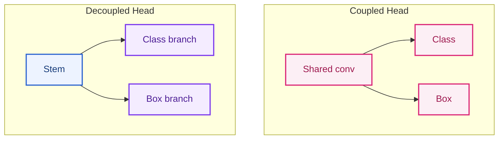

#### 5.3 Ví dụ TSR

**Biển `Speed limit 50` vs `Speed limit 60`:**

- Hai class khác nhau nhưng bbox gần giống hệt.
- **Coupled head:** dễ nhầm class khi digit nhỏ (feature shared nghiêng về localization).
- **Decoupled head:** nhánh class có thể học texture digit tốt hơn khi nhánh box giữ spatial ổn định.

**Biển cảnh báo tam giác vs biển tròn cấm:**

- Coupled có thể “đoán class từ màu đỏ chung” nếu box branch không đủ mạnh.
- Decoupled giúp tách **shape cue** (box branch) và **symbol cue** (class branch).

YOLOv6+ và nhiều biến thể YOLO hiện đại dùng **decoupled head**; YOLO11 tiếp tục tradition này trong Ultralytics stack.

---

### 6. NMS-based vs NMS-free / End-to-end

> **Nguồn tại mục:** [YOLO](https://arxiv.org/abs/1506.02640) — Lấy: detector sinh nhiều candidate cần post-process. Dùng ở: NMS-based pipeline.
>
> **Nguồn tại mục:** [DETR](https://arxiv.org/abs/2005.12872) — Lấy: set prediction và Hungarian matching để tránh NMS. Dùng ở: định nghĩa NMS-free/end-to-end.
>
> **Nguồn tại mục:** [RT-DETR](https://arxiv.org/abs/2304.08069) — Lấy: NMS-free detector hướng real-time. Dùng ở: trade-off latency và candidate benchmark.

#### 6.1 Định nghĩa

| Thuật ngữ | Ý nghĩa |
|---|---|
| **NMS (Non-Maximum Suppression)** | Hậu xử lý: giữ box confidence cao, **loại box trùng** IoU &gt; ngưỡng. |
| **NMS-based pipeline** | Detector sinh nhiều candidate → **bắt buộc NMS** trước output. |
| **NMS-free / End-to-end** | Mô hình học trực tiếp **tập prediction không trùng** (DETR, RT-DETR) — không NMS cổ điển ở inference. |

#### 6.2 Ví dụ TSR — nhiều biển trong một frame

Cảnh quốc lộ: biển `80`, biển `60` phía sau, biển `No overtaking` bên phải.

| Pipeline | Hành vi |
|---|---|
| NMS-based | 15 raw boxes → NMS IoU 0.45 → 3 boxes. **Rủi ro:** hai biển chồng nhẹ → mất một box |
| NMS-free (DETR) | 100 queries → Hungarian matching → 3 boxes. **Rủi ro:** query collision khi train chưa đủ diverse |

#### 6.3 Trade-off

| | NMS-based (YOLO) | NMS-free (RT-DETR) |
|---|---|---|
| Latency | NMS thêm ~1–5 ms tùy số box | Bỏ NMS nhưng decoder nặng hơn |
| Determinism | Phụ thuộc thứ tự sort + IoU thresh | Ổn định hơn nếu fixed queries |
| Tuning | `iou_thresh`, `conf_thresh` | `num_queries`, matcher cost |
| `tsr_demo.py` | `non_max_suppression_simple` IoU 0.45 | Chưa áp dụng |

**Điểm yếu cụ thể khi thiếu tuning NMS (baseline repo):** Hai biển speed gần nhau trên cùng cột → IoU &gt; 0.45 → chỉ giữ box lớn hơn (sort theo diện tích trong `non_max_suppression_simple`).

Nguồn tại mục:

- [DETR](https://arxiv.org/abs/2005.12872) — Lấy: set prediction transformer detector và NMS-free framing. Dùng ở: so sánh postprocess NMS-based với end-to-end detection.
- [RT-DETR](https://arxiv.org/abs/2304.08069) — Lấy: real-time DETR design và latency framing. Dùng ở: candidate benchmark khi cần detector NMS-free nhưng vẫn latency thấp.

---

### 7. FPN, PANet, BiFPN — Neck multi-scale

> **Nguồn tại mục:** [FPN](https://arxiv.org/abs/1612.03144) — Lấy: top-down/lateral multi-scale feature pyramid. Dùng ở: FPN và vấn đề small object.
>
> **Nguồn tại mục:** [PANet](https://arxiv.org/abs/1803.00894) — Lấy: bottom-up path aggregation. Dùng ở: PANet và localization cue.
>
> **Nguồn tại mục:** [EfficientDet/BiFPN](https://arxiv.org/abs/1911.09070) — Lấy: weighted bidirectional fusion. Dùng ở: BiFPN và trade-off accuracy/latency.

#### 7.1 Vấn đề cần giải quyết

Backbone CNN sâu (ResNet, CSPDarknet) tạo feature:

- **Shallow layers:** độ phân giải cao, semantic yếu — tốt cho **vị trí**.
- **Deep layers:** semantic mạnh, resolution thấp — tốt cho **class**.

Biển báo xa = **small object** → cần kết hợp cả hai.

#### 7.2 FPN (Feature Pyramid Network)

**Ý tưởng:** Top-down pathway — upsample feature semantic cao, **cộng** (lateral connection) với feature resolution cao từ backbone.

```
P5 (semantic) ──upsample──┐
                          ⊕ → P4
P4 (backbone) ────────────┘
```

**Ví dụ TSR:** P3 (stride 8) giúp detect biển ~32 px; P5 (stride 32) giúp context “đây là đường cao tốc”.

Nguồn tại claim: [FPN](https://arxiv.org/abs/1612.03144) — Lấy: top-down pathway và lateral connection. Dùng ở: mô tả P5/P4 và ví dụ stride P3/P5 cho TSR.

#### 7.3 PANet (Path Aggregation Network)

**Bổ sung FPN:** Thêm **bottom-up path** sau top-down — information từ low-level đi ngược lên lần nữa.

```
Top-down (FPN) + Bottom-up aggregation
```

**Ví dụ TSR:** Biển nhỏ sau cây che một phần — bottom-up giúp **localization cue** từ edge low-level không bị “loãng” chỉ qua top-down.

Nguồn tại claim: [PANet](https://arxiv.org/abs/1803.00894) — Lấy: bottom-up path aggregation sau FPN. Dùng ở: giải thích localization cue cho biển nhỏ/che khuất.

#### 7.4 BiFPN (Bidirectional FPN — EfficientDet)

**Cải tiến:**

- **Weighted feature fusion** — học trọng số cho từng nhánh thay vì cộng đều.
- **Repeated bidirectional fusion** — nhiều vòng top-down + bottom-up với depthwise separable conv (nhẹ hơn).

**Ví dụ TSR:** Trong cảnh đông biển + xe + cây, BiFPN ưu tiên feature level nào đóng góp nhiều cho từng scale — hữu ích khi class long-tail cần semantic mạnh ở P4 nhưng vị trí ở P3.

Nguồn tại claim: [EfficientDet](https://arxiv.org/abs/1911.09070) — Lấy: BiFPN weighted feature fusion và repeated bidirectional fusion. Dùng ở: ví dụ cân bằng feature level trong cảnh đông biển.

#### 7.5 Bảng so sánh neck cho TSR

| Neck | Luồng thông tin | Ưu điểm TSR | Nhược điểm |
|---|---|---|---|
| FPN | Top-down | Đơn giản, đủ cho biển vừa/nhỏ | Small object cực nhỏ vẫn khó |
| PANet | Top-down + bottom-up | Localization tốt hơn FPN | Thêm latency |
| BiFPN | Bidirectional + weighted | Cân bằng accuracy/latency tốt | Phức tạp train/export |
| YOLO11 neck (C2f/C3k2 + PAN) | Gần PAN family | Ecosystem Ultralytics | Phụ thuộc phiên bản YOLO |

**Liên hệ repo:** YOLO11s dùng neck kiểu **PAN-FPN hybrid** trong họ Ultralytics — baseline đã có multi-scale, nhưng **không thay thế** việc giữ resolution đầu vào (`max_width`, `imgsz`) khi biển quá nhỏ sau resize (xem baseline analysis §5).

---

### 8. Hybrid encoder trong RT-DETR

> **Nguồn tại mục:** [RT-DETR](https://arxiv.org/abs/2304.08069) — Lấy: efficient hybrid encoder, IoU-aware query selection và real-time DETR. Dùng ở: toàn bộ mô tả RT-DETR/Hybrid encoder.
>
> **Nguồn tại mục:** [DETR](https://arxiv.org/abs/2005.12872) — Lấy: set prediction, query và Hungarian matching nền tảng. Dùng ở: giải thích thuật ngữ query/set prediction.

#### 8.1 Bối cảnh

DETR gốc chậm vì transformer encoder xử lý feature full resolution. **RT-DETR** (Real-Time DETR) tối ưu cho deployment:

- **Hybrid encoder:** Kết hợp **CNN backbone** (local feature, hiệu quả) + **Transformer encoder nhẹ** (global context, ít token).
- **IoU-aware query selection** — chọn query chất lượng cao, giảm số layer decoder cần thiết.

```mermaid
flowchart LR
    A[Image] --> B[CNN Backbone]
    B --> C[Efficient Hybrid Encoder]
    C --> D[Query Selection]
    D --> E[Transformer Decoder]
    E --> F[Set Predictions no NMS]

    classDef source fill:#EAF7F2,stroke:#14866D,color:#0F4C3F,stroke-width:2px;
    classDef feature fill:#EDF3FF,stroke:#2F66D0,color:#173B7A,stroke-width:2px;
    classDef support fill:#FCEFF5,stroke:#DB2777,color:#9D174D,stroke-width:2px;
    classDef integration fill:#E8F7EE,stroke:#1E8E5A,color:#14532D,stroke-width:2px;
    class A source;
    class B,E feature;
    class C,D support;
    class F integration;
```

#### 8.2 Giải thích thuật ngữ

| Thuật ngữ | Ý nghĩa |
|---|---|
| **Hybrid encoder** | Không chạy self-attention trên toàn bộ feature map; thường **downsample + cross-scale fusion** rồi attention trên tập token đã chọn. |
| **Query** | Vector học được đại diện cho “một object giả định” — decoder refine thành box + class. |
| **Set prediction** | Output là tập cố định N predictions; training dùng bipartite matching (Hungarian). |

#### 8.3 Ví dụ TSR

**Cảnh nhiều biển + biển quảng cáo sign-like:**

- CNN backbone: phát hiện vùng đỏ tròn cục bộ.
- Transformer encoder: **global context** — biển trên cao vs biển ven đường.
- Không NMS: tránh merge nhầm hai biển speed khác nhau cùng cột (nếu train đủ).

**So với YOLO11s trong repo:**

| Tiêu chí | YOLO11s (repo) | RT-DETR |
|---|---|---|
| Post-process | NMS + conf thresh | End-to-end set |
| Export edge | ONNX/OpenVINO mature | Cải thiện nhưng nặng hơn YOLO-nano |
| Fine-tune 82 class VN | Đã có `best.pt` | Cần train lại + benchmark deployment |
| Latency CPU | ~140 ms (đo local) | Cần đo riêng trên cùng hardware |

#### 8.4 Production Implementation Pattern

| Pattern | Implementation |
|---|---|
| Candidate architecture A/B | Benchmark YOLO11s, YOLO11n, RT-DETR variant trên cùng protocol. |
| NMS-free validation | Đo duplicate, miss adjacent signs, latency p95/p99. |
| Hybrid deployment | CNN detector production, transformer offline mining hoặc teacher model. |
| Distillation | Dùng transformer teacher để cải thiện lightweight student. |
| Query budget tuning | Giảm `num_queries` nếu traffic sign density thấp. |

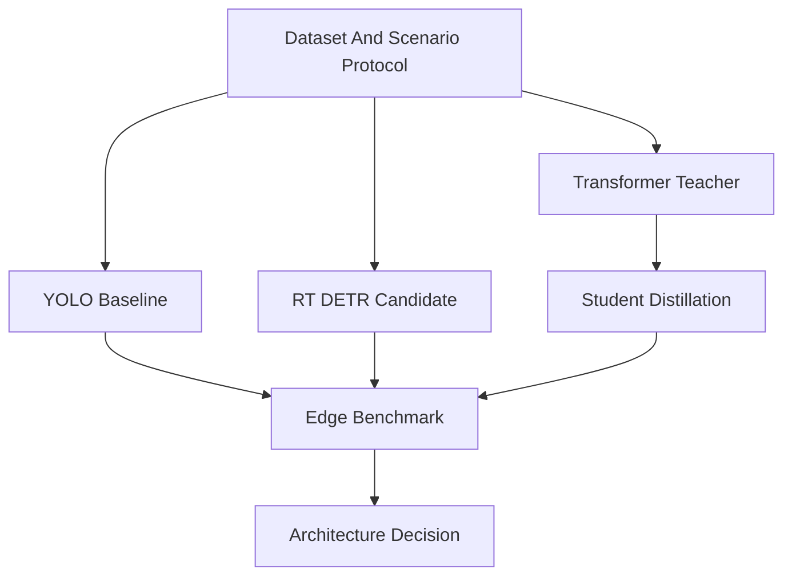

#### 8.5 Trade-Offs

| Quyết Định | Ưu Điểm | Rủi Ro |
|---|---|---|
| YOLO family | Mature edge tooling, low latency | NMS tuning, duplicate/suppress issues. |
| RT-DETR | NMS-free, strong global context | Decoder/attention cost, export maturity phải kiểm. |
| Transformer teacher only | Tăng data mining và pseudo-label quality | Production vẫn phụ thuộc student consistency. |
| Full transformer production | Architecture hiện đại | Embedded risk nếu không đạt deterministic latency. |

#### 8.6 Gap Repo Hiện Tại

Repo dùng Ultralytics YOLO `.pt`, chưa có abstraction để swap architecture, chưa có benchmark architecture A/B, chưa có ONNX/TensorRT/OpenVINO export protocol và chưa đo duplicate/miss theo cảnh nhiều biển. Bước production là biến phần RT-DETR lý thuyết ở trên thành experiment protocol có KPI gate.

Nguồn tại claim: [RT-DETR](https://arxiv.org/abs/2304.08069) — Lấy: hybrid encoder và query-selection design. Dùng ở: gap repo hiện tại và architecture A/B candidate.

---

### 9. Bảng tổng hợp lựa chọn kiến trúc cho TSR automotive

> **Nguồn tại mục:** [Baseline TSR Analysis](01.hybrid_pipeline_architecture.md) `[SRC]` — Lấy: baseline hiện tại `Ultralytics YOLO11s`, CPU runtime và gap implementation. Dùng ở: dòng prototype CPU/current weights.
>
> **Nguồn tại mục:** [Ultralytics export](https://docs.ultralytics.com/modes/export/), [ONNX Runtime](https://onnxruntime.ai/docs/), [TensorRT](https://docs.nvidia.com/deeplearning/tensorrt/), [OpenVINO](https://docs.openvino.ai/) — Lấy: deployment/export options. Dùng ở: dòng edge NPU/INT8/export.
>
> **Nguồn tại mục:** [RT-DETR](https://arxiv.org/abs/2304.08069) — Lấy: NMS-free detector option. Dùng ở: dòng giảm duplicate/NMS tuning và research SOTA candidate.

| Nhu cầu hệ thống | Hướng kiến trúc ưu tiên | Lý do |
|---|---|---|
| Prototype CPU, có weights VN | `Ultralytics YOLO11s` + PAN-like neck (**hiện tại**) | Ecosystem, đã train 82 class |
| Biển nhỏ ở xa, cùng model | Tăng input res + FPN/P3 head tuning; small-object aug | Neck alone không đủ nếu resize phá pixel |
| Giảm duplicate / NMS tuning | Thử soft-NMS, class-aware NMS; hoặc RT-DETR | Giảm mất box chồng nhẹ |
| Class speed dễ nhầm | Decoupled head + OCR branch | Tách digit semantics |
| Edge NPU &lt; 30 ms | YOLO INT8 TensorRT / OpenVINO | RT-DETR thường nặng hơn ở cùng accuracy |
| Research SOTA accuracy | Two-stage hoặc large YOLO / RT-DETR-L | Không ưu tiên latency |

---

### 10. Câu hỏi tự kiểm tra (research)

1. Vì sao TSR coi neck quan trọng hơn backbone đơn thuần khi biển ở xa?
2. Anchor-based YOLO gặp khó khăn gì khi biển xiên mạnh?
3. Decoupled head giúp giảm nhầm `50` vs `60` theo cơ chế nào?
4. NMS IoU 0.45 có thể gây miss detection trong cảnh nào?
5. RT-DETR “NMS-free” có nghĩa là không cần hậu xử lý nào sao?
6. FPN vs PANet vs BiFPN — khác biệt một câu mỗi loại?

---

### Key Takeaways

| Điểm chính | Ý nghĩa |
|---|---|
| Neck (FPN/PAN/BiFPN) quan trọng hơn backbone đơn thuần cho biển xa | Small object cần feature stride 8/16, không chỉ semantic sâu |
| YOLO11s repo = one-stage + decoupled head + NMS-driven postprocess | `non_max_suppression_simple` IoU 0.45 + sort area là điểm yếu TSR đông biển |
| RT-DETR NMS-free hữu ích multi-sign nhưng nặng edge | Pattern thực dụng: YOLO production + transformer teacher/mining |
| Decoupled head giúp tách digit semantics (`50` vs `60`) | Cần thêm OCR branch nếu class speed dễ nhầm |
| Kiến trúc không thay thế resolution policy | `max_width` + `imgsz` trong `tsr_demo.py` quyết định pixel còn lại cho head |

### Common Engineering Mistakes

| Lỗi | Hậu quả |
|---|---|
| Chọn transformer vì trend, không benchmark p99 trên ECU | Latency/memory fail dù mAP lab đẹp |
| Tune NMS trên dataset crop, không trên full scene | Miss adjacent signs trên đường thật |
| Bỏ qua export parity khi đổi kiến trúc | ONNX/TensorRT output khác PyTorch âm thầm |
| So sánh YOLO vs DETR trên protocol khác nhau | Kết luận architecture không có giá trị |
| Tin neck đủ mà không tăng input resolution | Biển &lt;16 px sau resize vẫn miss dù FPN tốt |

---

### 12. Small Object Detection Theory Cho TSR

> **Nguồn tại mục:** [FPN](https://arxiv.org/abs/1612.03144), [PANet](https://arxiv.org/abs/1803.00894), [EfficientDet/BiFPN](https://arxiv.org/abs/1911.09070) — Lấy: feature pyramid, bottom-up aggregation và weighted fusion cho multi-scale detection. Dùng ở: giải thích small-object feature stride/neck fusion.
>
> **Nguồn tại mục:** [Baseline TSR Analysis](01.hybrid_pipeline_architecture.md) `[SRC]` — Lấy: `preprocess()`, `max_width`, `imgsz`, `non_max_suppression_simple()` và gap bbox-size KPI. Dùng ở: công thức resize, gap repo và implementation pattern.
>
> **Nguồn tại mục:** [TT100K](https://cg.cs.tsinghua.edu.cn/traffic-sign/) và [Mapillary TSD](https://arxiv.org/abs/1909.04422) — Lấy: traffic sign trong scene lớn, nhiều scale/domain. Dùng ở: luận điểm benchmark small-object/ODD cần dataset đa dạng.

#### 12.1 Lý Thuyết

Traffic sign thường là **small object** vì biển ở xa chỉ chiếm vài chục pixel trên frame full HD hoặc 4K. Vấn đề không chỉ là kích thước bbox nhỏ; đó là tổng hợp của scale, motion blur, compression, perspective, occlusion, class similarity và quantization noise.

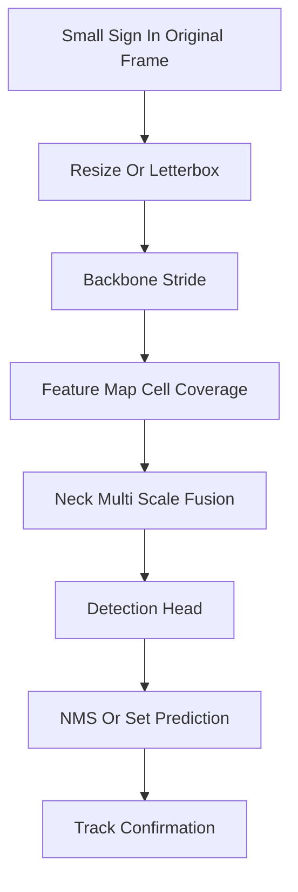

Một biển `Speed limit 50` có đường kính 24 px trên ảnh 1920×1080. Nếu detector dùng feature stride 32, object gần như rơi vào một cell hoặc ít hơn. Vì vậy, small object detection phụ thuộc mạnh vào:

##### 12.1.1 Công Thức Và Intuition Kỹ Thuật

**Kích thước biển sau preprocess** — với frame gốc rộng $W_{orig}$, resize về `max_width` $W_{max}$, và YOLO letterbox/resize về `imgsz` $S$:

$$
h_{net} \approx h_{orig} \cdot \frac{W_{max}}{W_{orig}} \cdot \frac{S}{\max(W_{proc}, H_{proc})}
$$

Trong đó $h_{orig}$ là chiều cao bbox trên frame gốc, $W_{proc}$ và $H_{proc}$ là kích thước sau `preprocess()`. Với `tsr_demo.py` mặc định `--max-width 1280 --imgsz 640` trên video 4K (3840 px), hệ số co ~$1280/3840 \times 640/1280 \approx 0.17$ — biển 40 px gốc còn ~7 px trên tensor inference, dưới ngưỡng usable cho hầu hết head stride 8/16.

**Ngưỡng detectable size theo stride** — heuristic thực dụng trong design review:

| Feature level | Stride $s$ | Kích thước object tối thiểu khuyến nghị |
|---|---|---|
| P3 | 8 | $\geq 16$ px (2 cell) |
| P4 | 16 | $\geq 32$ px |
| P5 | 32 | $\geq 64$ px |

**Time-to-sign** — khoảng thời gian từ lần detect đầu tiên đến khi xe đi qua biển:

$$
T_{ttf} = \frac{D_{sign}}{v_{ego}} - t_{confirm} - t_{latency}
$$

Với $D_{sign}$ là khoảng cách còn lại khi detect lần đầu, $v_{ego}$ tốc độ ego, $t_{confirm}$ thời gian temporal confirmation, $t_{latency}$ pipeline delay. Ở 80 km/h (~22 m/s), detect muộn 1 giây tương đương mất ~22 m thời gian advisory — đủ để ISA/HMI trở nên vô nghĩa.

**IoU sensitivity** — với object nhỏ, lệch label vài pixel làm IoU giảm mạnh. Bbox 16×16 lệch 2 px mỗi cạnh có thể rơi từ IoU 1.0 xuống ~0.56 — đủ fail gate mAP50-95 dù detector "nhìn thấy" biển.

| Yếu Tố | Tác Động |
|---|---|
| Input resolution | Resize quá mạnh làm mất digit hoặc viền biển. |
| Feature stride | Stride 8/16 quan trọng hơn stride 32 cho biển xa. |
| Neck fusion | FPN/PAN/BiFPN đưa semantic xuống feature map độ phân giải cao. |
| Label quality | Bbox lệch vài pixel làm IoU giảm mạnh với object nhỏ. |
| Augmentation | Mosaic, copy-paste, blur, glare synth giúp tăng độ phủ ODD. |
| Thresholding | Confidence thấp ở object nhỏ cần calibration theo class/size. |

#### 12.2 Vì Sao Quan Trọng Trong Automotive

> **Nguồn tại mục:** [Delegated Regulation (EU) 2021/1958](https://eur-lex.europa.eu/eli/reg_del/2021/1958/oj) — Lấy: TSR/speed-limit information có tác động tới ISA warning/assist. Dùng ở: lập luận detect muộn làm advisory/ISA mất giá trị.
>
> **Nguồn tại mục:** [ISO 21448:2022](https://www.iso.org/standard/77490.html) — Lấy: insufficiency trong điều kiện hợp lý là SOTIF risk. Dùng ở: claim small-object failure là nguồn SOTIF.

TSR càng phát hiện biển sớm thì feature càng có thời gian confirm, associate lane, fuse map và hiển thị không giật. Nếu chỉ nhận được biển khi xe đã đi sát, advisory đến muộn và ISA không còn giá trị. Small object failure cũng là nguồn SOTIF lớn vì hệ thống không bị fault phần cứng nhưng vẫn insufficient trong điều kiện hợp lý như nắng xiên, biển xa hoặc camera rung.

#### 12.3 Ví Dụ TSR Thực Tế

> **Nguồn tại mục:** [Baseline TSR Analysis](01.hybrid_pipeline_architecture.md) `[SRC]` — Lấy: gap `max_width`, `imgsz`, NMS area-sort và thiếu size-bin KPI. Dùng ở: root cause các ví dụ small sign/miss/NMS.
>
> **Nguồn tại mục:** [FPN](https://arxiv.org/abs/1612.03144) — Lấy: need for high-resolution feature levels. Dùng ở: đề xuất tăng resolution hoặc ROI/small-object path.

| Ví Dụ | Root Cause Small Object | Hành Vi Production Mong Muốn |
|---|---|---|
| Biển `50` chỉ hiện ở 18 px sau resize | `max_width` thấp, `imgsz` thấp | Tăng resolution path hoặc dùng small-object ROI pass. |
| Biển `No overtaking` nằm sau biển speed | NMS merge hoặc suppress | Class-aware NMS hoặc tracker tách track qua thời gian. |
| Digit `60` thành `80` ban đêm | Reflective glare và digit nhỏ | Quality score thấp, confirmation nhiều frame, per-class threshold. |
| Biển tam giác bị xiên | Bbox aspect thay đổi, shape cue yếu | Perspective augmentation và anchor/anchor-free tuning. |

#### 12.4 Production Implementation Pattern

> **Nguồn tại mục:** [EfficientDet/BiFPN](https://arxiv.org/abs/1911.09070) — Lấy: multi-scale/weighted feature fusion để cân bằng accuracy và compute. Dùng ở: pattern feature pyramid tuning.
>
> **Nguồn tại mục:** [3.10. Detector Architecture Deep Reference](01.hybrid_pipeline_architecture.md) `[SRC]` — Lấy: tổng hợp pattern ROI pass, size-aware confidence và temporal accumulation từ design review. Dùng ở: bảng production implementation pattern.
>
> **Nguồn tại mục:** [3.11. Colab Production-Lite Demo Full](03.edge_deployment_and_benchmarks.md) `[SRC]` — Lấy: temporal confirmation lite và event logging. Dùng ở: pattern temporal accumulation.

| Pattern | Cách Làm | Trade-Off |
|---|---|---|
| Multi-scale training | Train với scale jitter, mosaic, copy-paste sign nhỏ | Có thể tăng false positive trên object sign-like. |
| Higher inference resolution | `imgsz=768/960`, giữ `max_width` cao | Latency và memory tăng. |
| ROI second pass | Pass đầu tìm vùng road side, pass hai crop high-res | Pipeline phức tạp, cần tránh double counting. |
| Feature pyramid tuning | Dùng P2/P3 cho small objects | Tăng compute ở feature map lớn. |
| Size-aware confidence | Threshold riêng cho small/medium/large sign | Cần validation theo bin kích thước. |
| Temporal accumulation | Confirm biển nhỏ qua nhiều frame | Tăng delay, cần ego-motion compensation. |

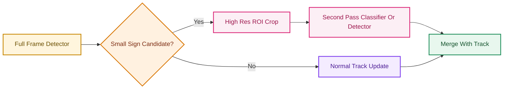

#### 12.5 Gap Repo Hiện Tại

> **Nguồn tại mục:** [Baseline TSR Analysis](01.hybrid_pipeline_architecture.md) `[SRC]` — Lấy: runtime hiện tại resize theo `max_width`, dùng một `imgsz`, NMS sort theo diện tích và chưa có bin KPI. Dùng ở: bảng gap repo hiện tại.

| Repo Detail | Production Gap |
|---|---|
| `preprocess()` chỉ resize theo `--max-width` | Không có small-object preserving policy theo tốc độ, FOV hoặc expected sign distance. |
| `detect_with_yolo()` dùng một `imgsz` | Không có multi-scale inference hoặc ROI pass. |
| `non_max_suppression_simple()` sort theo diện tích | Có thể giữ box lớn sai và bỏ box nhỏ đúng khi overlap. |
| Không có bin KPI theo bbox size | Không biết recall của biển 0-16 px, 16-32 px, 32-64 px. |

#### 12.6 Nguồn Tham Khảo

| Chủ Đề | Nguồn | Lấy thông tin gì | Dùng ở đâu trong TSR |
|---|---|---|---|
| YOLO real-time detection | https://arxiv.org/abs/1506.02640 | One-stage real-time detector framing. | Baseline YOLO-family và small-object detector trade-off. |
| FPN | https://arxiv.org/abs/1612.03144 | Feature pyramid, top-down/lateral multi-scale fusion. | Small-object preservation và neck multi-scale reasoning. |
| EfficientDet/BiFPN | https://arxiv.org/abs/1911.09070 | Weighted bidirectional feature fusion và compound scaling. | BiFPN trade-off latency/accuracy trên embedded TSR. |
| TT100K large-scale traffic sign benchmark | https://cg.cs.tsinghua.edu.cn/traffic-sign/ | Traffic-sign benchmark scale/domain và small-object context. | Dataset comparison và KPI theo bbox size/long-tail. |

---

### 13. Dataset Comparison Cho TSR

> **Nguồn tại mục:** [GTSRB](http://benchmark.ini.rub.de/gtsrb_dataset.html), [GTSDB](https://benchmark.ini.rub.de/gtsdb_dataset.html), [TT100K](https://cg.cs.tsinghua.edu.cn/traffic-sign/), [Mapillary TSD](https://arxiv.org/abs/1909.04422), [Traffic-sign-detection-VietNam](https://huggingface.co/datasets/star092304/Traffic-sign-detection-VietNam) — Lấy: nhiệm vụ, scale, taxonomy/domain của các dataset chính. Dùng ở: so sánh dataset và chiến lược benchmark.
>
> **Nguồn tại mục:** [2.06. Sources and Provenance](../2.knowledge_base/01.automotive_standards.md) `[SRC]` — Lấy: source-of-truth nội bộ cho dataset/model baseline. Dùng ở: phân biệt dataset công khai với evidence repo.

#### 13.1 Lý Thuyết

Dataset quyết định model nhìn thấy thế giới nào. TSR production cần phân biệt:

| Loại Dataset | Mục Đích |
|---|---|
| Classification crop | Học class sign sau khi đã crop. |
| Detection full image | Học phát hiện sign trong scene lớn. |
| Country-specific | Học taxonomy và hình dạng biển của quốc gia. |
| Global dataset | Học diversity về quốc gia, thời tiết, camera và sign style. |
| Edge-case dataset | Học glare, night, blur, occlusion, construction. |

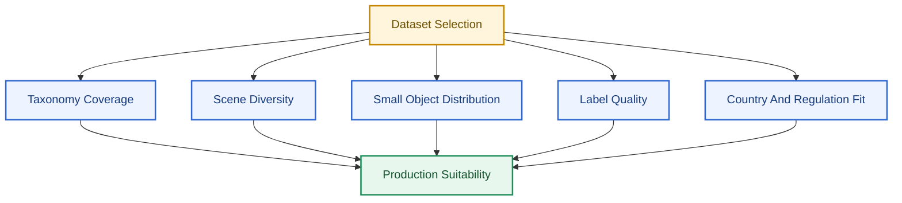

#### 13.2 Dataset So Sánh

> **Nguồn tại mục:** [GTSRB](http://benchmark.ini.rub.de/gtsrb_dataset.html) — Lấy: classification crop benchmark. Dùng ở: dòng GTSRB.
>
> **Nguồn tại mục:** [GTSDB](https://benchmark.ini.rub.de/gtsdb_dataset.html) — Lấy: detection full-image benchmark và split. Dùng ở: dòng GTSDB.
>
> **Nguồn tại mục:** [TT100K](https://cg.cs.tsinghua.edu.cn/traffic-sign/) — Lấy: large-scale traffic sign dataset. Dùng ở: dòng TT100K.
>
> **Nguồn tại mục:** [Mapillary TSD](https://arxiv.org/abs/1909.04422) — Lấy: street-level/global TSD dataset framing. Dùng ở: dòng Mapillary.
>
> **Nguồn tại mục:** [Traffic-sign-detection-VietNam](https://huggingface.co/datasets/star092304/Traffic-sign-detection-VietNam) — Lấy: dataset Việt Nam 82 class và instance count. Dùng ở: dòng VN HF/baseline.

> **Provenance:** Số liệu dưới đây lấy từ trang benchmark chính thức hoặc paper gốc. Trước release, phải kiểm lại package/split thực tế — đặc biệt Mapillary và CCTSDB có nhiều phiên bản.

| Dataset | Nhiệm Vụ | Quy Mô (nguồn chính thức) | Taxonomy / Ghi chú | Điểm mạnh TSR | Hạn chế production | Phù hợp repo |
|---|---|---|---|---|---|---|
| **GTSRB** | Classification crop | >40 class, >50,000 ảnh crop ([benchmark.ini.rub.de](http://benchmark.ini.rub.de/gtsrb_dataset.html)) | 43 class thường dùng trong paper; ảnh 15–250 px | Benchmark cổ điển, label ổn định | **Không phải** full-scene detection; Đức-only; không có lane context | Pretrain classifier head, sanity check |
| **GTSDB** | Detection full image | **900 ảnh** (600 train + 300 eval); 0–6 sign/ảnh; sign 16–128 px ([GTSDB page](https://benchmark.ini.rub.de/gtsdb_dataset.html)) | 3 category: prohibitive, danger, mandatory | Nhỏ, dễ reproduce baseline detector | Quá nhỏ cho modern deep learning; diversity hạn chế | So sánh kiến trúc nhanh, không claim production |
| **TT100K** | Detection + classification | **100,000 ảnh**, **30,000** sign instances ([Tsinghua page](https://cg.cs.tsinghua.edu.cn/traffic-sign/)) | Taxonomy Trung Quốc; bản 2021 mở rộng classification | Large-scale, small sign trong wild, weather variation | Country-specific; long-tail; license CC-BY-NC | Pretrain/finetune, small-object aug ideas |
| **Mapillary TSD** | Detection + classification global | Hàng trăm nghìn ảnh, ~300+ class, đa quốc gia ([arXiv:1909.04422](https://arxiv.org/abs/1909.04422)) | Global taxonomy phức tạp | Diversity camera/country cao nhất trong public set | License, class mapping nặng; không thay fleet data | Domain adaptation, taxonomy study |
| **CCTSDB** | Detection Trung Quốc | ~1,600+ ảnh trong bản gốc; CCTSDB-AUG mở rộng synthetic ([arXiv:2309.06902](https://arxiv.org/abs/2309.06902)) | Biển Trung Quốc | Augmentation pipeline cho rare sign | Package/split cần verify; không map trực tiếp VN | Research augmentation, không dùng làm KPI chính |
| **Traffic-sign-detection-VietNam** | Detection VN | **10,157 ảnh**, **82 class**, ~19,748 instance ([HF dataset](https://huggingface.co/datasets/star092304/Traffic-sign-detection-VietNam)) | Taxonomy VN; long-tail 16/82 class <100 instance | **Baseline repo** — fit biển VN | Chưa đủ ODD production (glare/night/construction) | **Primary** cho `best.pt` |

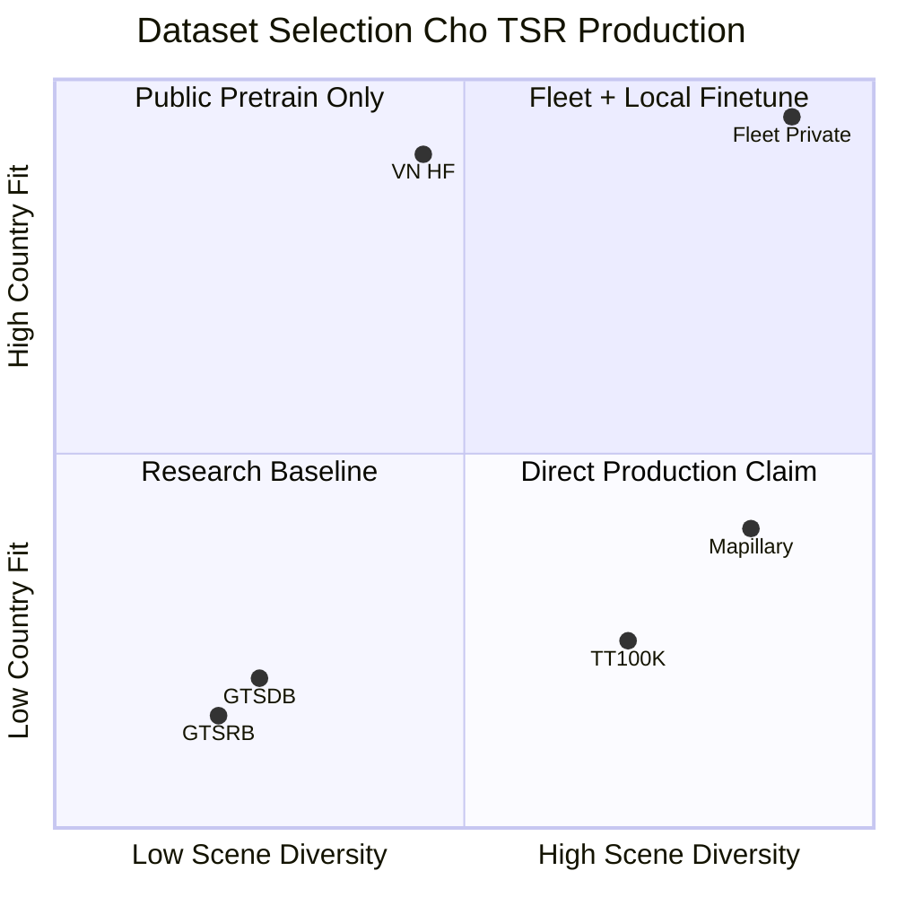

**Chiến lược dataset production khuyến nghị cho repo:**

| Phase | Dataset mix | Mục tiêu |
|---|---|---|
| Research/baseline | VN HF 100% | Fit 82 class, benchmark `tsr_demo.py` |
| Pretrain (optional) | Mapillary hoặc TT100K → finetune VN | Tăng small-object và diversity |
| Production validation | **Fleet/route catalog riêng** | KPI event-level, không dùng public set làm gate duy nhất |
| Edge-case mining | GLARE + hard negative từ field | SOTIF trigger coverage |

#### 13.3 Vì Sao Quan Trọng Trong Automotive

> **Nguồn tại mục:** [ISO 21448:2022](https://www.iso.org/standard/77490.html) — Lấy: production validation cần operating condition/ODD và residual risk. Dùng ở: claim public dataset không đủ để release production.
>
> **Nguồn tại mục:** [Mapillary TSD](https://arxiv.org/abs/1909.04422) — Lấy: diversity public set hữu ích cho pretraining/domain study nhưng không thay fleet validation. Dùng ở: phân biệt public benchmark và fleet route catalog.

Không dataset công khai nào tự nó đủ để release TSR production. OEM/Tier-1 thường cần private fleet data theo ODD, country, camera, lens, mount, ISP, weather, road type và customer usage. Dataset công khai dùng tốt cho pretraining, sanity benchmark và architecture comparison, nhưng production validation phải chạy trên scenario catalog và route coverage.

#### 13.4 Ví Dụ TSR Thực Tế

> **Nguồn tại mục:** [GTSRB](http://benchmark.ini.rub.de/gtsrb_dataset.html) và [GTSDB](https://benchmark.ini.rub.de/gtsdb_dataset.html) — Lấy: khác biệt crop classification vs full-scene detection. Dùng ở: ví dụ train crop nhưng detector miss scene.
>
> **Nguồn tại mục:** [Traffic-sign-detection-VietNam](https://huggingface.co/datasets/star092304/Traffic-sign-detection-VietNam) — Lấy: country-specific taxonomy. Dùng ở: ví dụ dataset Đức không claim trực tiếp Việt Nam.

| Sai Lầm Dataset | Hậu Quả |
|---|---|
| Train nhiều crop classification nhưng ít full scene | Model classify tốt khi crop đúng, nhưng detector miss biển xa. |
| Dùng dataset Đức để claim Việt Nam | Taxonomy, sign style, text và road environment khác. |
| Không kiểm long-tail | Class hiếm như construction, surveillance, lane-specific sign fail. |
| Không có negative mining | Biển quảng cáo đỏ/tròn tạo false positive. |

#### 13.5 Production Implementation Pattern

> **Nguồn tại mục:** [ISO 21448:2022](https://www.iso.org/standard/77490.html) — Lấy: scenario/trigger coverage cần trace vào validation. Dùng ở: scenario tagging và hard negative loop.
>
> **Nguồn tại mục:** [3.08. Experiment and Benchmark Guide](03.edge_deployment_and_benchmarks.md) `[SRC]` — Lấy: benchmark protocol, split hygiene và repeatability. Dùng ở: route-level split, scenario tags và benchmark report.

| Pattern | Implementation |
|---|---|
| Dataset card | Ghi source, license, country, camera, split, class taxonomy, label policy. |
| Class mapping | Map public dataset class vào internal ontology, giữ unmapped class. |
| Scenario tagging | Gắn tag: day/night/rain/glare/urban/highway/tunnel/construction. |
| Size bins | Report KPI theo bbox pixel area hoặc sign distance proxy. |
| Hard negative loop | Thu thập false positive sign-like và đưa vào retraining/eval. |
| Split hygiene | Route-level split, không để frame gần nhau rơi vào train/test khác nhau. |

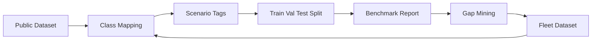

#### 13.6 Trade-Offs

| Quyết Định | Ưu Điểm | Rủi Ro |
|---|---|---|
| Pretrain global, finetune country | Diversity tốt, adapt local | Class mapping và label inconsistency. |
| Country-only training | Fit taxonomy địa phương | Generalization kém trong rare ODD. |
| Synthetic augmentation | Tăng edge case nhanh | Domain gap nếu render không thực. |
| Large taxonomy | Bao phủ nhiều sign | Long-tail và confusion tăng. |

#### 13.7 Gap Repo Hiện Tại

> **Nguồn tại mục:** [Baseline TSR Analysis](01.hybrid_pipeline_architecture.md) `[SRC]` — Lấy: baseline dataset/model hiện tại, long-tail và missing dataset artifacts. Dùng ở: gap dataset card, scenario matrix, split protocol và per-class/size KPI.

Repo dùng checkpoint `Ultralytics YOLO11s best.pt` fine-tune trên dataset Việt Nam upstream `82` class. Tài liệu baseline đã nêu long-tail và scale dataset. Còn thiếu dataset card nội bộ, scenario coverage matrix, route-level split protocol, hard negative catalog, per-class confusion và KPI theo size/weather/night.

#### 13.8 Nguồn Tham Khảo

| Dataset | Nguồn | Lấy thông tin gì | Dùng ở đâu trong TSR |
|---|---|---|---|
| GTSRB | http://benchmark.ini.rub.de/?section=gtsrb&subsection=dataset | Classification crop benchmark cho traffic sign. | Cảnh báo không dùng GTSRB như full-scene detection benchmark. |
| GTSDB | https://benchmark.ini.rub.de/?section=gtsdb&subsection=dataset | Full-image traffic sign detection benchmark. | Phân biệt detection benchmark với recognition crop. |
| TT100K | https://cg.cs.tsinghua.edu.cn/traffic-sign/ | Large-scale traffic sign benchmark và taxonomy/domain. | So sánh scale, small object và long-tail benchmark. |
| Mapillary Traffic Sign Dataset | https://arxiv.org/abs/1909.04422 | Global traffic-sign dataset đa quốc gia/domain. | Domain shift, country/taxonomy coverage và benchmark caveat. |
| CCTSDB-AUG related paper | https://arxiv.org/abs/2309.06902 | Augmentation/robustness hướng traffic sign detection. | Bối cảnh data augmentation và robustness discussion. |
| Vietnam HF model/dataset | https://huggingface.co/star092304/traffic-sign-detection-vietnam-yolo | Model card/provenance cho YOLO11s traffic-sign VN. | Liên hệ `models/best.pt`, taxonomy 82 lớp và baseline repo. |

---

### 14. Edge Deployment: ONNX, TensorRT, OpenVINO, INT8

> **Nguồn tại mục:** [Ultralytics export](https://docs.ultralytics.com/modes/export/) — Lấy: export workflow từ YOLO/Ultralytics sang deployment formats. Dùng ở: graph export và export matrix.
>
> **Nguồn tại mục:** [ONNX Runtime](https://onnxruntime.ai/docs/), [TensorRT](https://docs.nvidia.com/deeplearning/tensorrt/), [OpenVINO](https://docs.openvino.ai/) — Lấy: target runtimes cho inference optimization. Dùng ở: runtime branches và deployment validation.
>
> **Nguồn tại mục:** [Baseline TSR Analysis](01.hybrid_pipeline_architecture.md) `[SRC]` — Lấy: repo hiện chưa có export/parity protocol. Dùng ở: gap/deployment steps.

#### 14.1 Lý Thuyết

Edge deployment chuyển model research sang runtime chạy ổn định trên ECU/SoC với latency, memory, thermal và determinism đạt target. Các bước thường gồm export graph, optimize kernel, quantize, calibrate, validate numerical parity và benchmark trên target.

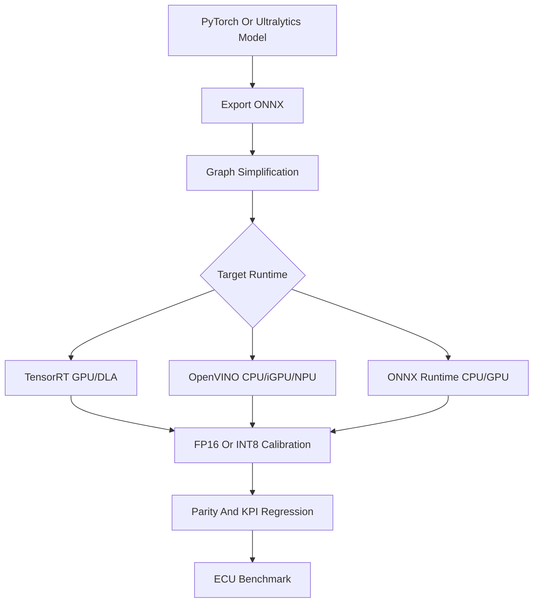

#### 14.2 Vì Sao Quan Trọng Trong Automotive

> **Nguồn tại mục:** [ISO 26262-1:2018](https://www.iso.org/standard/68383.html) — Lấy: deterministic behavior và verification evidence trong automotive lifecycle. Dùng ở: p95/p99 latency, memory và release confidence.
>
> **Nguồn tại mục:** [On Calibration of Modern Neural Networks](https://arxiv.org/abs/1706.04599) — Lấy: calibration ảnh hưởng confidence reliability. Dùng ở: INT8/calibration warning cho rare class/small object.

Model card FPS trên GPU desktop không đại diện ECU. Production phải đạt p95/p99 latency, RAM peak, thermal stability và deterministic behavior trên hardware thực. INT8 có thể giảm latency, nhưng calibration sai có thể làm class hiếm hoặc small object giảm recall.

#### 14.3 Ví Dụ TSR Thực Tế

> **Nguồn tại mục:** [Ultralytics export](https://docs.ultralytics.com/modes/export/), [ONNX Runtime](https://onnxruntime.ai/docs/), [TensorRT](https://docs.nvidia.com/deeplearning/tensorrt/), [OpenVINO](https://docs.openvino.ai/) — Lấy: export/runtime differences có thể tạo parity issue. Dùng ở: bảng deployment risk và validation cần có.

| Case | Deployment Risk | Validation Cần Có |
|---|---|---|
| Export YOLO sang ONNX | Operator mismatch hoặc NMS khác | Parity bbox/class/confidence trên replay set. |
| TensorRT FP16 | Numeric drift nhỏ | mAP/event KPI so với PyTorch. |
| INT8 quantization | Small sign confidence giảm | Calibration set có small/night/glare/long-tail. |
| OpenVINO CPU | Latency tốt hơn PyTorch | p95/p99 latency và memory trên CPU target. |

#### 14.4 Production Implementation Pattern

> **Nguồn tại mục:** [UNECE R156](https://unece.org/transport/documents/2021/03/standards/un-regulation-no-156-software-update-and-software-update) — Lấy: update governance cần versioning, compatibility và rollback. Dùng ở: versioning và release gate.
>
> **Nguồn tại mục:** [ISO 24089:2023](https://www.iso.org/standard/77796.html) — Lấy: software update engineering for road vehicles. Dùng ở: export matrix, calibration ID và post-update validation mindset.
>
> **Nguồn tại mục:** [Baseline TSR Analysis](01.hybrid_pipeline_architecture.md) `[SRC]` — Lấy: runtime gap hiện tại. Dùng ở: parity checker và benchmark protocol.

| Pattern | Implementation |
|---|---|
| Export matrix | PyTorch baseline, ONNX FP32, ONNX FP16, TensorRT FP16/INT8, OpenVINO FP16/INT8. |
| Calibration dataset | Representative theo class, size, lighting, camera ISP và ODD. |
| Parity tolerance | Define tolerance cho bbox IoU, class match, confidence delta. |
| Runtime wrapper | Stable input/output contract, timestamp, error handling. |
| Watchdog | Inference timeout, memory failure, runtime exception, fallback state. |
| Versioning | Model hash, engine hash, runtime version, calibration set ID. |

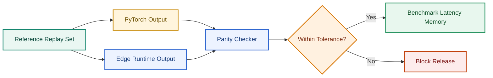

#### 14.5 Trade-Offs

> **Nguồn tại mục:** [TensorRT](https://docs.nvidia.com/deeplearning/tensorrt/), [OpenVINO](https://docs.openvino.ai/), [ONNX Runtime](https://onnxruntime.ai/docs/) — Lấy: runtime-specific optimization/precision behavior. Dùng ở: trade-off FP32/FP16/INT8/runtime NMS/dynamic shape.
>
> **Nguồn tại mục:** [On Calibration of Modern Neural Networks](https://arxiv.org/abs/1706.04599) — Lấy: calibration affects confidence reliability. Dùng ở: rủi ro INT8 với small object/class hiếm.

| Quyết Định | Ưu Điểm | Rủi Ro |
|---|---|---|
| FP32 | Accuracy ổn định | Latency/RAM cao. |
| FP16 | Tốc độ tốt trên GPU/NPU | Cần kiểm numeric drift. |
| INT8 | Tốc độ và memory tốt | Calibration khó, small object/class hiếm dễ drop. |
| Runtime-specific NMS | Nhanh | Behavior khác PyTorch nếu threshold/order khác. |
| Dynamic shape | Linh hoạt | Khó optimize và test determinism. |

#### 14.6 Gap Repo Hiện Tại

> **Nguồn tại mục:** [Baseline TSR Analysis](01.hybrid_pipeline_architecture.md) `[SRC]` — Lấy: repo hiện chỉ hướng dẫn PyTorch/Ultralytics inference, chưa có export/parity/calibration/runtime wrapper. Dùng ở: gap edge deployment.
>
> **Nguồn tại mục:** [Ultralytics export](https://docs.ultralytics.com/modes/export/) — Lấy: export command/path gần nhất có thể triển khai. Dùng ở: bước production gần nhất.

Repo chưa có export script, engine artifact, parity checker, calibration set, runtime wrapper hoặc benchmark protocol. `requirements.txt` và README hướng dẫn PyTorch/Ultralytics inference, phù hợp baseline. Bước production gần nhất là thêm benchmark command dùng `ultralytics export` và so sánh ONNX/OpenVINO trên cùng video protocol.

#### 14.7 Nguồn Tham Khảo

| Chủ Đề | Nguồn | Lấy thông tin gì | Dùng ở đâu trong TSR |
|---|---|---|---|
| Ultralytics export | https://docs.ultralytics.com/modes/export/ | Export model sang backend deployment. | ONNX/OpenVINO/TensorRT export path cho `best.pt`. |
| Ultralytics benchmark | https://docs.ultralytics.com/modes/benchmark/ | Benchmark model format/backend. | Latency/FPS comparison và edge parity protocol. |
| ONNX Runtime | https://onnxruntime.ai/docs/ | Portable ONNX inference runtime. | CPU/edge deployment path sau export. |
| TensorRT | https://docs.nvidia.com/deeplearning/tensorrt/ | NVIDIA optimized inference runtime. | GPU/NPU acceleration và INT8/FP16 deployment discussion. |
| OpenVINO | https://docs.openvino.ai/ | Intel optimized inference toolkit. | CPU/iGPU edge optimization option cho demo/ECU-like target. |

---

### 15. Production OCR Pipeline Cho TSR

> **Nguồn tại mục:** [Traffic-sign-detection-VietNam](https://huggingface.co/datasets/star092304/Traffic-sign-detection-VietNam) — Lấy: taxonomy 82 class của baseline Việt Nam. Dùng ở: lý do one-stage detector có thể cover nhiều class nhưng gặp long-tail/digit confusion.
>
> **Nguồn tại mục:** [Delegated Regulation (EU) 2021/1958](https://eur-lex.europa.eu/eli/reg_del/2021/1958/oj) — Lấy: ISA cần speed-limit information có giá trị áp dụng. Dùng ở: canonical output `SPEED_LIMIT`, value, unit và warning/assist consumer.
>
> **Nguồn tại mục:** [3.10. Detector Architecture Deep Reference](01.hybrid_pipeline_architecture.md) `[SRC]` — Lấy: synthesis về digit head/OCR/canonicalization từ detector trade-off và TSR feature needs. Dùng ở: production OCR pipeline pattern.

#### 15.1 Lý Thuyết

TSR production thường tách **detection** (tìm vùng biển) khỏi **interpretation** (đọc nội dung biển). Với taxonomy lớn (82 class VN), one-stage detector có thể đủ; nhưng **speed family** (`50` vs `60`), biển có chữ dài, biển điều kiện và biển đa panel thường cần **classifier head**, **digit head** hoặc **OCR branch** riêng.

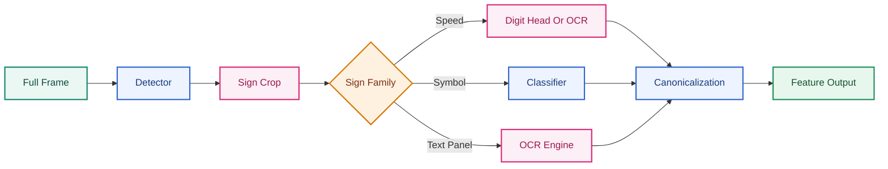

| Thành phần | Vai trò | Output |
|---|---|---|
| **Detector** | Tìm bbox sign trong scene | `bbox`, `sign_family`, `det_conf` |
| **Classifier** | Phân loại biển symbol (cấm, cảnh báo, mandatory) | `class_id`, `class_conf` |
| **Digit/OCR head** | Đọc giá trị số hoặc chữ trên biển | `raw_text`, `digit_conf` |
| **Canonicalization** | Chuẩn hóa sang vehicle feature model | `value`, `unit`, `conditional_flags` |

#### 15.2 Vì Sao Quan Trọng Trong Automotive

> **Nguồn tại mục:** [Delegated Regulation (EU) 2021/1958](https://eur-lex.europa.eu/eli/reg_del/2021/1958/oj) — Lấy: ISA/SLIF cần speed limit value có nghĩa để warning/assist. Dùng ở: claim label string không đủ cho ISA/planning.
>
> **Nguồn tại mục:** [Small Object Detection Theory Cho TSR](#12-small-object-detection-theory-cho-tsr) `[SRC]` — Lấy: digit resolution là bottleneck khi biển nhỏ. Dùng ở: lý do OCR branch trên crop high-res giúp giảm confusion.

Class label string (`Speed limit 50`) **không đủ** cho ISA hoặc planning. Feature cần object có cấu trúc:

```json
{
  "sign_type": "SPEED_LIMIT",
  "value": 50,
  "unit": "km/h",
  "conditional_flags": [],
  "source": "VISION",
  "confidence": 0.91
}
```

Nhầm `50` → `60` ở tốc độ cao là false advisory nghiêm trọng. Decoupled head (§5) giúp tách spatial và semantic, nhưng **digit resolution** vẫn là bottleneck khi biển nhỏ (§12). OCR branch chạy trên crop high-res sau detector giảm lỗi class confusion trong long-tail taxonomy.

#### 15.3 Ví Dụ TSR Thực Tế

> **Nguồn tại mục:** [Traffic-sign-detection-VietNam](https://huggingface.co/datasets/star092304/Traffic-sign-detection-VietNam) — Lấy: taxonomy Việt Nam nhiều class/long-tail. Dùng ở: ví dụ one-stage-only dễ gặp speed-value/conditional-panel confusion.
>
> **Nguồn tại mục:** [Baseline TSR Analysis](01.hybrid_pipeline_architecture.md) `[SRC]` — Lấy: nhánh traditional heuristic không đọc giá trị speed và runtime hiện không có OCR. Dùng ở: dòng `--traditional` heuristic.

| Tình huống | One-stage only | Detector + OCR/canonicalization |
|---|---|---|
| Biển `50` vs `60`, bbox 24 px | Class head dễ nhầm digit | Digit head trên crop 128×128 đọc rõ hơn |
| Biển `30` phụ cho xe tải | Label class riêng, long-tail | OCR đọc panel + context filter vehicle class |
| Biển tạm công trường `40` | Có thể không có class train | OCR + temporal confirm + map override |
| Nhánh `--traditional` heuristic | Chỉ `SpeedLimit (heuristic)` | Không phân biệt giá trị — không dùng cho HMI |

#### 15.4 Production Implementation Pattern

> **Nguồn tại mục:** [Delegated Regulation (EU) 2021/1958](https://eur-lex.europa.eu/eli/reg_del/2021/1958/oj) — Lấy: speed-limit information cần canonical value/condition. Dùng ở: canonicalization table và plausibility check trước publish.
>
> **Nguồn tại mục:** [On Calibration of Modern Neural Networks](https://arxiv.org/abs/1706.04599) — Lấy: confidence calibration concept. Dùng ở: `publish_conf = min(det_conf, read_conf)` và threshold confidence.

| Pattern | Implementation | Trade-off |
|---|---|---|
| Two-stage detect-then-read | YOLO detect → crop expand 10% → digit CNN hoặc lightweight OCR | +Latency ~2–8 ms/crop; cần cap số crop |
| Shared backbone multi-head | Detector backbone + auxiliary digit head trên RoI align | Train phức tạp; export phải giữ cả hai head |
| Template matching fallback | Speed family: match digit glyph khi OCR conf thấp | Chỉ work với font chuẩn; fragile với glare |
| Canonicalization table | Map `(family, raw_value, country)` → internal enum | Cần maintain ontology theo regulation |
| Confidence fusion | `publish_conf = min(det_conf, read_conf)` hoặc learned fusion | Conservative — giảm false advisory |

**Canonicalization speed sign — ví dụ logic:**

| Raw detector/OCR | Canonical output |
|---|---|
| Class `speed_limit_50` | `{type: SPEED_LIMIT, value: 50, unit: km/h}` |
| OCR `5O` (O thay 0) | Reject hoặc hold pending — plausibility check |
| Biển `80` + panel `when wet` | `{value: 80, conditional: [WET_ROAD]}` |

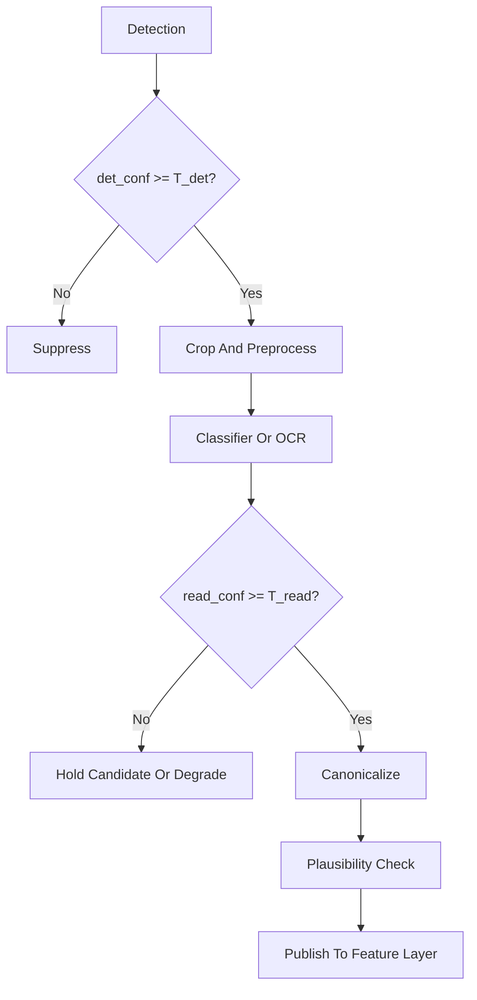

#### 15.5 Trade-Offs

> **Nguồn tại mục:** [Traffic-sign-detection-VietNam](https://huggingface.co/datasets/star092304/Traffic-sign-detection-VietNam) — Lấy: large taxonomy/long-tail context. Dùng ở: trade-off một model 82 class vs digit head/OCR.
>
> **Nguồn tại mục:** [Delegated Regulation (EU) 2021/1958](https://eur-lex.europa.eu/eli/reg_del/2021/1958/oj) — Lấy: deterministic speed-limit object cần cho ISA. Dùng ở: trade-off canonicalization cứng.

| Quyết Định | Ưu Điểm | Rủi Ro |
|---|---|---|
| Một model 82 class | Đơn giản, latency thấp | Long-tail và digit confusion |
| Thêm digit head | Giảm nhầm speed value | Thêm train data digit-aligned |
| Full OCR (CRNN/Transformer) | Đọc panel text, biển tạm | Latency, glare sensitivity |
| Canonicalization cứng | Deterministic cho ISA | Không cover biển lạ — cần fallback |

#### 15.6 Gap Repo Hiện Tại

> **Nguồn tại mục:** [Baseline TSR Analysis](01.hybrid_pipeline_architecture.md) `[SRC]` — Lấy: runtime hiện không có OCR/digit branch/canonicalization/plausibility check. Dùng ở: bảng gap repo.

| Thiếu | Hậu quả |
|---|---|
| Không OCR/digit branch | Phụ thuộc 82 class one-shot; `50`/`60` confusion không tách được |
| Heuristic traditional không đọc digit | Chỉ sign-like, không giá trị |
| Không canonicalization layer | Label string không feed được ISA speed object |
| Không plausibility check | Không chặn `5O`, `999`, bbox/class mismatch |

---

### 16. Perception Uncertainty Và Confidence Engineering

> **Nguồn tại mục:** [On Calibration of Modern Neural Networks](https://arxiv.org/abs/1706.04599) — Lấy: confidence calibration, ECE và reliability diagram mindset. Dùng ở: lý thuyết confidence/uncertainty và calibration workflow.
>
> **Nguồn tại mục:** [ISO 21448:2022](https://www.iso.org/standard/77490.html) — Lấy: perception insufficiency và residual risk. Dùng ở: liên hệ uncertainty với degraded behavior/SOTIF.
>
> **Nguồn tại mục:** [3.11. Colab Production-Lite Demo Full](03.edge_deployment_and_benchmarks.md) `[SRC]` — Lấy: confidence/quality gate, warning_level và replay KPI ở notebook. Dùng ở: engineering confidence cho production-lite pipeline.

#### 16.1 Lý Thuyết

> **Nguồn tại mục:** [On Calibration of Modern Neural Networks](https://arxiv.org/abs/1706.04599) — Lấy: raw confidence không đồng nghĩa xác suất đúng, ECE và temperature scaling. Dùng ở: lý thuyết confidence, công thức ECE và calibration.
>
> **Nguồn tại mục:** [ISO 21448:2022](https://www.iso.org/standard/77490.html) — Lấy: uncertainty/perception insufficiency có thể tạo residual risk. Dùng ở: phân loại aleatoric/epistemic theo trigger TSR.

Confidence từ detector **không đồng nghĩa** xác suất đúng. Production TSR cần phân biệt hai nguồn uncertainty và engineering confidence qua nhiều lớp:

| Loại | Định nghĩa | Nguồn TSR điển hình |
|---|---|---|
| **Aleatoric** | Không chắc do **noise dữ liệu** — không giảm hết bằng thêm data | Motion blur, glare bloom, compression, rain, low SNR |
| **Epistemic** | Không chắc do **model thiếu kiến thức** — có thể giảm bằng data/train | OOD sign, taxonomy mới, rare class, country transfer |

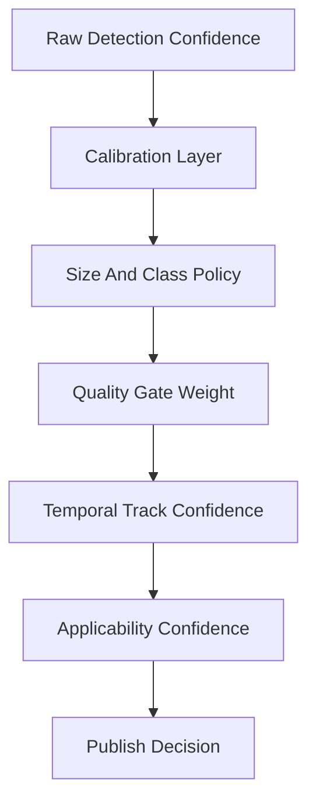

**Expected Calibration Error (ECE)** — metric chuẩn cho reliability:

Chia predictions theo bin confidence $B_m$, với $n_m$ samples trong bin:

$$
\text{ECE} = \sum_{m=1}^{M} \frac{n_m}{N} \left| \text{acc}(B_m) - \text{conf}(B_m) \right|
$$

ECE thấp → confidence gần đúng xác suất; ECE cao → không nên dùng raw `conf` làm gate HMI/ISA.

**Temperature scaling** (post-hoc calibration):

$$
P_\text{cal}(y|x) = \text{softmax}(z/T)
$$

Fit $T$ trên validation set để minimize NLL — đơn giản, hiệu quả cho per-class threshold sau calibration.

#### 16.2 Reliability Diagram Và Calibration Workflow

> **Nguồn tại mục:** [On Calibration of Modern Neural Networks](https://arxiv.org/abs/1706.04599) — Lấy: reliability diagram, ECE, Brier/per-class calibration và temperature scaling workflow. Dùng ở: mermaid calibration workflow và bảng đọc reliability diagram.

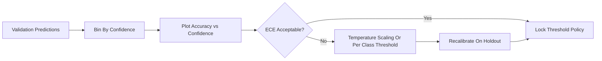

| Bước | Hành động |
|---|---|
| 1 | Thu thập `(conf, correct, class, bbox_size, quality)` trên validation đại diện ODD |
| 2 | Vẽ reliability diagram: trục x = mean confidence bin, trục y = accuracy bin |
| 3 | Tính ECE, Brier score, per-class calibration |
| 4 | Fit temperature / per-class threshold để đạt target precision (ưu tiên false advisory thấp) |
| 5 | Lock policy + regression test mỗi model version |

**Reliability diagram — đọc nhanh:**

| Hình dạng | Ý nghĩa | Hành động TSR |
|---|---|---|
| Đường chéo (ideal) | Confidence = accuracy | Có thể dùng conf trực tiếp với hysteresis |
| Over-confident (dưới đường chéo) | Model quá tin | Tăng threshold hoặc temperature $T>1$ |
| Under-confident (trên đường chéo) | Model thận trọng | Có thể hạ threshold class hiếm nếu recall thấp |

#### 16.3 Confidence Engineering Cho TSR Production

> **Nguồn tại mục:** [2.08. State Manager and Sign Lifecycle](../2.knowledge_base/03.safety_analysis_hazop_fta.md) `[SRC]` — Lấy: hit/miss và temporal confirmation trước publish. Dùng ở: EMA/temporal confidence và `hits >= N`.
>
> **Nguồn tại mục:** [2.09. ODD for TSR](../2.knowledge_base/01.automotive_standards.md) `[SRC]` — Lấy: quality/ODD gate và degraded behavior. Dùng ở: `quality_score`, size-aware threshold và multi-dimensional publish rule.
>
> **Nguồn tại mục:** [Delegated Regulation (EU) 2021/1958](https://eur-lex.europa.eu/eli/reg_del/2021/1958/oj) — Lấy: ISA consumer cần conservative speed-limit output. Dùng ở: conservative publish rule cho ISA.

| Chiều confidence | Công thức / pattern | Mục đích |
|---|---|---|
| Detection | `det_conf` calibrated | Gate bbox publish |
| Read/OCR | `read_conf` từ digit head | Gate speed value |
| Quality | `quality_score` từ blur/glare/exposure | Down-weight hoặc degrade |
| Size-aware | $T_\text{class,size}$ lookup table | Biển nhỏ cần threshold khác (§12) |
| Temporal | EMA over track: $\bar{c}_t = \alpha c_t + (1-\alpha)\bar{c}_{t-1}$ | Giảm jitter frame-level |
| Applicability | `app_conf` từ lane/context/map | Tách "nhìn thấy" khỏi "áp dụng" |

**Multi-dimensional publish rule (ví dụ conservative ISA):**

$$
\text{publish} \Leftrightarrow \bar{c}_\text{det} \geq T_d \land \bar{c}_\text{read} \geq T_r \land q \geq T_q \land \text{hits} \geq N
$$

#### 16.4 Ví Dụ TSR Thực Tế

> **Nguồn tại mục:** [ISO 21448:2022](https://www.iso.org/standard/77490.html) — Lấy: trigger condition như blur/glare cần suppress/degrade/corroborate. Dùng ở: các case blur/glare/need_corroboration.
>
> **Nguồn tại mục:** [On Calibration of Modern Neural Networks](https://arxiv.org/abs/1706.04599) — Lấy: over-confident/under-confident reliability behavior. Dùng ở: case confidence bin accuracy thấp.

| Case | Raw conf | Sau calibration + policy | Hành vi |
|---|---|---|---|
| Biển `50` nhỏ, conf=0.82 nhưng accuracy bin=0.55 | 0.82 (over-confident) | Suppress hoặc candidate only | Tránh false advisory |
| Biển `80` blur, conf=0.18 | 0.18 | Quality gate → degraded | Không publish mới |
| Class hiếm construction, conf=0.45 calibrated=0.45 | Khớp accuracy | Confirm với 5 frame | Publish sau temporal |
| Glare trigger (SOTIF) | Det conf cao, read conf thấp | `need_corroboration` | Chờ map hoặc thêm frame |

#### 16.5 Gap Repo Hiện Tại

> **Nguồn tại mục:** [Baseline TSR Analysis](01.hybrid_pipeline_architecture.md) `[SRC]` — Lấy: baseline dùng global confidence threshold, chưa có ECE/reliability/calibration artifact. Dùng ở: bảng gap repo.
>
> **Nguồn tại mục:** [3.11. Colab Production-Lite Demo Full](03.edge_deployment_and_benchmarks.md) `[SRC]` — Lấy: notebook có quality/confidence gate lite nhưng chưa thành calibration bundle. Dùng ở: phân biệt production-lite confidence logic với production calibration.

| Repo | Gap |
|---|---|
| `conf=0.15` global default | Không calibrated; không per-class/size |
| Không ECE/reliability eval | Không biết over-confidence mức nào |
| Một chiều confidence | Không tách det/read/applicability/quality |
| Không temperature scaling artifact | Mỗi `best.pt` version không có calibration bundle |

#### 16.6 Nguồn Tham Khảo

| Chủ đề | Nguồn | Lấy thông tin gì | Dùng ở đâu trong TSR |
|---|---|---|---|
| On calibration of modern neural networks | https://arxiv.org/abs/1706.04599 | Reliability diagram, ECE và over-confidence calibration problem. | Confidence calibration, threshold policy và KPI reliability. |
| Temperature scaling | https://arxiv.org/abs/1706.04599 | Post-hoc calibration method. | Calibration artifact cho mỗi model version trước release. |
| ISO 21448 uncertainty / corroboration | https://www.iso.org/standard/77490.html | Functional insufficiency và need for uncertainty/corroboration. | Quality/applicability confidence và SOTIF mitigation before publish. |

---

### Industry Benchmark Gaps (Ghi Chú Ngắn)

> **Nguồn tại mục:** [GTSDB](https://benchmark.ini.rub.de/gtsdb_dataset.html), [TT100K](https://cg.cs.tsinghua.edu.cn/traffic-sign/), [Mapillary TSD](https://arxiv.org/abs/1909.04422) — Lấy: public datasets chủ yếu phục vụ detection/classification benchmark. Dùng ở: claim public benchmark chưa đo full TSR feature stack.
>
> **Nguồn tại mục:** [Baseline TSR Analysis](01.hybrid_pipeline_architecture.md) `[SRC]` — Lấy: repo hiện chưa có feature-layer event KPI/export parity/ODD validation. Dùng ở: gap benchmark và yêu cầu lock protocol.
>
> **Nguồn tại mục:** [ISO 21448:2022](https://www.iso.org/standard/77490.html) — Lấy: production gate cần ODD/scenario/residual-risk validation. Dùng ở: claim VN HF/public data không thay route/scenario catalog.

Public benchmark **không đại diện** production TSR stack đầy đủ:

| Gap | Ý nghĩa |
|---|---|
| Không có benchmark chuẩn cho detector + tracker + ISA event KPI | mAP/GTSDB/TT100K chỉ đo frame-level detection |
| Dataset công khai thiếu lane applicability, map conflict, HMI flicker | KPI feature-layer phải tự xây trên fleet catalog |
| Số liệu dataset đa phiên bản (Mapillary, CCTSDB) | Phải verify package trước khi báo cáo OEM |
| Paper FPS ≠ ECU p99 | Architecture comparison phải kèm export parity (§14) |
| VN HF 82 class fit research, không thay ODD validation | Production gate cần route/scenario catalog riêng |

Khi so sánh kiến trúc (YOLO vs RT-DETR) hoặc dataset, **lock protocol**: cùng preprocess, NMS/export path, size bins, và calibration policy — nếu không, kết luận chỉ có giá trị academic.

---

### 17. Tài liệu tham khảo

| # | Nguồn | Lấy thông tin gì | Dùng ở đâu trong TSR |
|---:|---|---|---|
| 1 | Lin et al., *Feature Pyramid Networks for Object Detection*. https://arxiv.org/abs/1612.03144 | Multi-scale feature pyramid. | Neck/FPN và small-object detection. |
| 2 | Liu et al., *Path Aggregation Network for Instance Segmentation*. https://arxiv.org/abs/1803.00894 | Bottom-up path aggregation. | PANet neck và localization signal. |
| 3 | Tan et al., *EfficientDet*. https://arxiv.org/abs/1911.09070 | BiFPN and efficient compound scaling. | Accuracy/latency trade-off for embedded TSR. |
| 4 | Redmon et al., *YOLO*. https://arxiv.org/abs/1506.02640 | One-stage real-time detection. | YOLO-family baseline framing. |
| 5 | Tian et al., *FCOS*. https://arxiv.org/abs/1904.01355 | Anchor-free detection via center/location prediction. | Anchor-based vs anchor-free trade-off. |
| 6 | Carion et al., *DETR*. https://arxiv.org/abs/2005.12872 | Set prediction and NMS-free detection. | NMS-free detector comparison. |
| 7 | Zhao et al., *RT-DETR*. https://arxiv.org/abs/2304.08069 | Real-time DETR architecture. | Candidate detector benchmark vs YOLO. |
| 8 | Ultralytics YOLO11 docs. https://docs.ultralytics.com/models/yolo11/ | YOLO11 model family/runtime context. | Baseline `best.pt` framing and deployment discussion. |
| 9 | Mapillary Traffic Sign Dataset. https://arxiv.org/abs/1909.04422 | Global traffic-sign benchmark diversity. | Dataset/domain shift and benchmark guide. |
| 10 | GLARE glare dataset. https://arxiv.org/abs/2209.08716 | Sun-glare traffic sign scenario. | SOTIF/glare validation slice. |
| 11 | TT100K traffic sign benchmark. https://cg.cs.tsinghua.edu.cn/traffic-sign/ | Large-scale traffic sign dataset context. | Dataset scale, long-tail and small-object benchmark. |
| 12 | GTSRB/GTSDB. https://benchmark.ini.rub.de/ | German classification/detection benchmark pages. | Differentiating recognition vs detection benchmark roles. |
| 13 | Guo et al., *On Calibration of Modern Neural Networks*. https://arxiv.org/abs/1706.04599 | Confidence calibration and ECE. | Confidence threshold, reliability and calibration artifacts. |
| 14 | Ultralytics export/benchmark. https://docs.ultralytics.com/modes/export/ | Export workflow and backend comparison entrypoint. | ONNX/OpenVINO/TensorRT export path. |
| 15 | ONNX Runtime. https://onnxruntime.ai/docs/ | ONNX inference runtime. | Portable edge/runtime deployment option. |
| 16 | TensorRT. https://docs.nvidia.com/deeplearning/tensorrt/ | NVIDIA optimized inference runtime. | GPU optimized deployment and INT8/FP16 discussion. |
| 17 | OpenVINO. https://docs.openvino.ai/ | Intel optimized inference toolkit. | CPU/iGPU edge deployment option. |


---

## (2) Phân Tích Baseline TSR — Gắn Trực Tiếp `tsr_demo.py` và Model `best.pt`

> **Folder index:** [3.00. Implementation Index](01.hybrid_pipeline_architecture.md) — Lấy: cấu trúc implementation layer và thứ tự đọc. Dùng ở: điều hướng người đọc từ full baseline analysis sang overview/notebook/benchmark.
>
> **Mục này trả lời:** baseline repo hiện tại làm được gì, thiếu gì, và gap đó biểu hiện ra sao trên runtime thực tế.
>
> **Ngoài phạm vi:** giải thích đầy đủ production framework, V-model, safety/SOTIF hay kiến trúc tổng thể; phần đó nằm ở [TSR Production Reference](../2.knowledge_base/01.automotive_standards.md) — Lấy: kiến trúc production và roadmap hệ thống. Dùng ở: điều hướng khi gap baseline cần giải thích ở level feature/system.

### 1. Metadata

| Thuộc tính | Giá trị |
|---|---|
| Code tham chiếu | [code/tsr_demo.py](../../code/tsr_demo.py) |
| Weights | `models/best.pt` |
| Model family | `Ultralytics YOLO11s` |
| Model upstream | [star092304/traffic-sign-detection-vietnam-yolo](https://huggingface.co/star092304/traffic-sign-detection-vietnam-yolo) |
| Dataset upstream | [Traffic-sign-detection-VietNam](https://huggingface.co/datasets/star092304/Traffic-sign-detection-VietNam) |
| Liên kết kiến trúc detector | [3.10. Detector Architecture Deep Reference](01.hybrid_pipeline_architecture.md) |
| Liên kết hệ thống | [TSR Production Reference](../2.knowledge_base/01.automotive_standards.md) |
| Liên kết notebook production-lite | [3.11. Colab Production-Lite Demo Full](03.edge_deployment_and_benchmarks.md) |
| Ngày cập nhật | 2026-06-29 |

### 2. Tóm tắt

Tài liệu này là **annex gắn implementation hiện tại**, không phải một báo cáo production thứ hai. Nó trả lời câu hỏi cụ thể cho tech lead và người maintain repo:

- Baseline hiện tại (`tsr_demo.py` + `best.pt`) **bao phủ được gì** và **không bao phủ gì**?
- Model được train trên **bao nhiêu ảnh, bao nhiêu instance, phân bổ class ra sao**?
- **Thiếu kỹ thuật/pipeline nào** trong code hiện tại → **điểm yếu cụ thể nào** trên video/ODD thật?

Mọi nhận định dưới đây map trực tiếp tới hàm, tham số CLI, hoặc artifact trong repo.

- Khi cần lý do hệ thống-level "vì sao detector chưa phải feature", quay lại [TSR Production Reference](../2.knowledge_base/01.automotive_standards.md) — deep dive production về feature TSR đầy đủ.
- Khi cần theory detector, quay lại [3.10. Detector Architecture Deep Reference](01.hybrid_pipeline_architecture.md) — phân tích kiến trúc detector, NMS, multi-scale và edge deployment.

**Lưu ý quan trọng để tránh đọc sai repo hiện tại:**

- mọi nhận định kiểu `chưa có tracking`, `chưa có quality gate`, `chưa có JSONL` trong file này áp dụng cho **runtime chính** `code/tsr_demo.py`;
- repo hiện đã có thêm notebook sidecar [3.NB01. Colab Production-Lite Notebook](notebooks/01.tsr_colab_production_lite_demo.ipynb) mô phỏng `quality gate`, `ODD gate`, `IoU tracking`, `track lifecycle`, `warning level`, `events.jsonl`, KPI proxy và optional GT eval;
- vì vậy phải luôn tách bạch `baseline runtime gap` với `production-lite notebook capability`.

#### 2.1 Legend màu Mermaid

> Legend này áp dụng cho các sơ đồ Mermaid đã được tô màu trong tài liệu. Một số sơ đồ chỉ dùng một phần của palette dưới đây.

| Màu | Vai trò | Ý nghĩa |
|---|---|---|
| <span style="display:inline-block;width:14px;height:14px;border:1px solid #C78600;background:#FFF5DD;"></span> | `baseline` | Baseline hiện tại, artifact repo đang có, hoặc điểm tham chiếu ban đầu |
| <span style="display:inline-block;width:14px;height:14px;border:1px solid #2F66D0;background:#EDF3FF;"></span> | `feature` | Khối xử lý chính, metric cốt lõi, hoặc bước phân tích chính |
| <span style="display:inline-block;width:14px;height:14px;border:1px solid #7C3AED;background:#F4ECFF;"></span> | `temporal` | Tracking, lifecycle, logic thời gian, hoặc KPI theo track/state |
| <span style="display:inline-block;width:14px;height:14px;border:1px solid #14866D;background:#EAF7F2;"></span> | `source` | Input log, evidence source, replay input, hoặc dữ liệu đầu vào |
| <span style="display:inline-block;width:14px;height:14px;border:1px solid #1E8E5A;background:#E8F7EE;"></span> | `integration` | Output, release outcome, regression result, hoặc đầu ra tích hợp |
| <span style="display:inline-block;width:14px;height:14px;border:1px solid #C2410C;background:#FDECEC;"></span> | `risk` | Gap, failure, blocker, unavailable path, hoặc điểm rủi ro cần xử lý |
| <span style="display:inline-block;width:14px;height:14px;border:1px solid #D97706;background:#FFF1E0;"></span> | `decision` | Gate, pass/fail node, hoặc nhánh quyết định release |
| <span style="display:inline-block;width:14px;height:14px;border:1px solid #DB2777;background:#FCEFF5;"></span> | `support` | Utility, logger, benchmark support, RCA support, hoặc khối phụ trợ |

---

### 3. Data flow thực tế trong `tsr_demo.py`

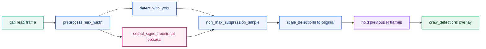

| Hàm | File line (xấp xỉ) | Vai trò |
|---|---|---|
| `preprocess()` | L63–68 | Resize theo `max_width`, không chuẩn hóa quang học |
| `detect_with_yolo()` | L195–209 | Ultralytics YOLO, `conf`, `imgsz`, `max_det=20` |
| `detect_signs_traditional()` | L136–169 | HSV mask + contour + shape heuristic |
| `non_max_suppression_simple()` | L172–192 | NMS IoU 0.45, sort theo diện tích |
| `scale_detections()` | L236–254 | Map bbox từ `proc_frame` → frame gốc |
| `main()` hold logic | L371–373 | Giữ `last_detections` tối đa `--hold` frame |

**Ví dụ luồng một frame:** Video 4K → `preprocess(max_width=1280)` thu nhỏ → YOLO `imgsz=512` → 2 bbox → miss frame sau → `hold=3` vẫn vẽ bbox cũ trên frame mới (không phải tracking).

---

### 4. Model `best.pt` — độ bao phủ và dữ liệu huấn luyện

#### 4.1 Nguồn gốc checkpoint và bằng chứng cục bộ

Mô tả ngắn nhưng phải chính xác:

- `tsr_demo.py` và notebook production-lite đều nạp weights bằng `from ultralytics import YOLO` rồi `YOLO(str(WEIGHTS_PATH))`;
- notebook sidecar ưu tiên `models/best.pt`, nếu không có thì tải từ Hugging Face repo `star092304/traffic-sign-detection-vietnam-yolo`;
- `README.md` của repo cũng mô tả đây là baseline inference dùng `Ultralytics YOLO`;
- checkpoint local `best.pt` chứa các dấu vết như `yolo11s.yaml`, `yolo11s.pt`, `traffic_sign_yolo11s`, `/kaggle/working/data.yaml`.

Diễn giải implementation:

- `best.pt` là một checkpoint detector `Ultralytics YOLO11s` đã fine-tune, không phải classifier crop-only;
- trong baseline runtime hiện tại, chính detector này xuất ra `bbox + class + confidence`;
- nghĩa là `recognition` trong repo hiện tại chủ yếu đi cùng head phân loại của detector, chưa có classifier runtime riêng tách biệt.

#### 4.2 Thông số kiến trúc (từ model card)

| Thuộc tính | Giá trị | Ý nghĩa triển khai |
|---|---|---|
| Kiến trúc | **YOLO11s** | Detector one-stage trong họ Ultralytics YOLO |
| Framework | **Ultralytics** | API nạp model trong repo và notebook đều dùng `YOLO(...)` |
| Số class | **82** | Toàn bộ tập biển VN trong dataset HF |
| Input train/infer mặc định | **640×640** | `tsr_demo.py` mặc định `--imgsz 640` |
| Base pretrained | COCO `yolo11s.pt` | Transfer từ generic object → biển VN |
| Epochs | **50** (early stop patience 20) | |
| Optimizer | AdamW (auto) | |
| Runtime role trong repo | `bbox + class + confidence` | Baseline không có classifier riêng phía sau detector |

#### 4.3 Dataset huấn luyện — quy mô và phân bổ

Nguồn: [Traffic-sign-detection-VietNam](https://huggingface.co/datasets/star092304/Traffic-sign-detection-VietNam)

| Split | Số ảnh | Ghi chú |
|---|---:|---|
| Train | **8,125** | 8,124 có label + 36 ảnh nền (negative) |
| Validation | **1,016** | 1,014 có label + 2 negative |
| Test | **1,016** | 1,014 có label + 2 negative |
| **Tổng** | **10,157** | ~905 MB dataset |

| Thống kê instance | Giá trị |
|---|---:|
| Tổng bbox instance (gộp 82 class) | **~19,748** |
| Instance / ảnh labeled (trung bình) | **~2.0** |
| Class ít nhất | **32** instance (`Uneven road`) |
| Class nhiều nhất | **1,446** instance (`No Stopping & No Parking`) |
| Class có &lt; 100 instance | **16 / 82** (~19.5%) |
| Class có &lt; 50 instance | **3 / 82** (`Road with Surveillance Camera` 35, `No Moto Turn Left` 46, `Uneven road` 32) |

**Diễn giải độ bao phủ:**

- Model **được thiết kế để nhận 82 loại biển VN** trong dataset — không phải subset tùy repo.
- **ODD dữ liệu huấn luyện** thiên về ảnh tĩnh/crop-friendly trong dataset; không đại diện đầy đủ glare nặng, mưa lớn, biển tạm, domain ngoài VN.
- **Long-tail mạnh:** 16 class dưới 100 mẫu → recall thực tế trên các class hiếm (biển camera, biển đường trơn, công trường) **dễ suy giảm** dù mAP tổng cao.

#### 4.4 Metric test (model card — GPU, không phải CPU repo)

| Metric | Giá trị |
|---|---:|
| Precision | 96.42% |
| Recall | 96.15% |
| mAP50 | 98.06% |
| mAP50-95 | 83.57% |
| FPS (GPU) | 61.5 |
| Mean latency (GPU) | 16.25 ms |

**Cảnh báo:** Các số trên **không** mô tả runtime `tsr_demo.py` trên CPU WSL. Benchmark local (xem §6) ~7–8 FPS, ~120–140 ms/frame.

#### 4.5 Bảng “model bao phủ gì / không bao phủ gì”

| Phạm vi | Bao phủ | Không bao phủ |
|---|---|---|
| Class | 82 biển tĩnh trong dataset VN | Biển tạm, biển điện tử động, biển ngoài 82 class |
| Task | Detection + classification một lần | Lane association, map fusion, OCR chữ dài |
| Ngữ cảnh | Ảnh/video có biển trong FOV camera trước | Biển làn rẽ không áp dụng ego (chưa có logic) |
| Điều kiện | Gần với phân bổ dataset | Glare kéo dài, sương, đêm tối cực đoan (chưa validate repo) |
| Output | Bbox + class + conf trong overlay | ICD, DTC, feature state, HMI policy |

---

### 5. Ma trận: thiếu kỹ thuật → điểm yếu cụ thể

Bảng dưới map **gap trong code/model hiện tại** sang **triệu chứng quan sát được** khi chạy demo.

| # | Thiếu trong baseline | Kỹ thuật / block production | Điểm yếu cụ thể khi chạy |
|---|---|---|---|
| 1 | Chỉ `resize` trong `preprocess()` | CLAHE, gamma, exposure gate, quality score | Ban ngày qua tốt; **bóng cây / ngược sáng** → heuristic HSV miss; YOLO conf giảm, **false negative** biển đỏ/vàng |
| 2 | Không multi-scale inference | TTA hoặc pyramid / giữ resolution cao cho small object | `max_width=1280` + `imgsz=512` trên 4K → biển xa **&lt; 20px** sau resize → **miss biển nhỏ** (xem benchmark 4K) |
| 3 | `max_det=20` cố định | Dynamic cap theo scene density | Cảnh nhiều biển gần nhau → **cắt detection** (silent drop) |
| 4 | `conf=0.15` mặc định, không calibrate | Confidence calibration, per-class threshold | Class hiếm: **false positive** biển tương tự màu; class khó: vẫn **miss** dù hạ conf |
| 5 | NMS IoU 0.45 đơn giản | Class-aware NMS, soft-NMS | Hai biển chồng nhẹ → **mất một detection**; biển phản quang đôi → duplicate hoặc merge sai |
| 6 | `hold` thay tracking | SORT/Deep SORT + temporal confirmation | Video rung: bbox **nhảy vị trí** nhưng label giữ → trông ổn nhưng **không có track_id**; miss 1 frame vẫn hiện sign **chưa confirmed** |
| 7 | Không image quality gate | Blur/glare metric trước infer | Frame blur do rung mặt đường/kính chắn gió: vẫn infer → **class jitter** 30↔50 trên vài frame |
| 8 | Heuristic label thô (`SpeedLimit (heuristic)`) | OCR / digit head / fine class map | Nhánh `--traditional` không phân biệt **50 vs 60** — chỉ “speed-like” |
| 9 | Không export runtime tối ưu | ONNX/OpenVINO/TensorRT INT8 | CPU PyTorch ~**140 ms** → không đủ 15–30 FPS ECU advisory |
| 10 | Không augment train trong repo | Mosaic, small-object aug, glare synth | Model phụ thuộc **19k instance gốc** — glare/occlusion ngoài phân bổ train → **SOTIF gap** |
| 11 | Không negative mining có hệ thống | Hard negative (biển quảng cáo đỏ tròn) | **False positive** vật thể sign-like dưới glare (điểm SOTIF trong unified doc) |
| 12 | Không lane / map context | Map fusion stub trở lên | Detect đúng biển **làn rẽ** → vẫn overlay → **false advisory** nếu coi là feature |
| 13 | Overlay = output | `jsonl` feature output lite | Không replay phân tích lỗi theo `feature_state` / `reason_codes` |
| 14 | Không per-class eval trong repo | Confusion matrix theo 82 class | Không biết **16 class long-tail** nào đang fail trên video cụ thể |

#### 5.1 Ví dụ cụ thể theo tình huống

**Tình huống A — biển 50 xa trên video 4K, `--max-width 1280 --imgsz 512`**

- Thiếu #2 (multi-scale / resolution) + #4 (small object sensitivity YOLO11s).
- Triệu chứng: không bbox đến khi xe gần; hoặc conf &lt; 0.15 → không hiển thị.
- Cách kiểm chứng: chạy cùng clip với `--imgsz 640 --max-width 1920`, so sánh frame có/không detection.

**Tình huống B — detector đổi `80` → `50` → không sign trong 3 frame với `--hold 3`**

- Thiếu #6 (tracking thật).
- Triệu chứng: overlay vẫn hiện `80` trong lúc detector đã thấy `50` một frame (hold kéo state cũ).
- Đây là lý do **hold ≠ temporal confirmation**.

**Tình huống C — `--traditional` bật, nhiều vòng đỏ quảng cáo**

- Thiếu #8 (OCR/class fine) + #11 (hard negative).
- Triệu chứng: `SpeedLimit (heuristic)` xuất hiện trên vật không phải biển giao thông; merge NMS có thể ưu tiên box lớn sai.

---

### 6. Runtime local đã đo (gắn tham số `tsr_demo.py`)

| Video | CLI tương đương | Avg latency | FPS | Peak RSS |
|---|---|---:|---:|---:|
| `traffic_sign_test.mp4` | `imgsz=640, max_width=1280, skip=0` | 139.68 ms | 7.16 | 696.04 MB |
| `14212806_3840_2160_60fps.mp4` | `imgsz=512, max_width=1280, skip=1` | 123.17 ms | 8.12 | 1076.44 MB |

> **Ghi chú nguồn:** bảng này là số đo benchmark local lịch sử của baseline `tsr_demo.py`, không phải cấu hình mặc định hiện tại của notebook `3.NB01`. Notebook production-lite hiện dùng profile `high/medium` với `skip=0`, `low` với `skip=1`; video replay hiện có trong repo là `videos/14212806_3840_2160_60fps.mp4` (`3840x2160`, `1187` frame, `59.94 fps`). Xem thêm [3.05. Colab Production-Lite Demo](03.edge_deployment_and_benchmarks.md) và [3.06. Notebook Analyze](02.state_manager_and_hmi.md) để tránh nhầm giữa video FPS, scheduled inference rate và measured processing FPS.

**Điểm yếu hệ thống từ số đo:**

- **Latency ~8×** so với GPU model card (16 ms vs ~140 ms) → thiếu #9 (edge runtime) là blocker cho realtime 30 fps trên CPU.
- **RSS &gt; 1 GB** trên clip 4K → thiếu memory budget cho ECU nhỏ nếu không quantize/export.
- `skip=1` giảm load nhưng **bỏ lỡ frame** → cộng hưởng với thiếu tracking (#6).

---

### 7. Nhánh xử lý ảnh truyền thống trong repo

#### 7.1 Cấu hình HSV hiện tại (`HSV_RANGES`)

```python
# tsr_demo.py L55-60 — tóm tắt
red1: H 0-10, red2: H 170-179, blue: H 100-130, yellow: H 20-35
S >= 70-80, V >= 50
```

| Thiếu | Điểm yếu cụ thể |
|---|---|
| Không adaptive threshold theo exposure | Đêm / tăng gain → **miss mask đỏ** (Hue unstable) |
| Không CLAHE trước `inRange` | Bóng cây trên biển vàng → **miss tam giác cảnh báo** |
| `classify_shape` cố định circularity &gt; 0.72 | Biển xiên / ellipse → label `unknown`, bỏ qua |
| Không `frame_quality_score` gate | Vẫn chạy heuristic trên frame blur → **false candidate** |

#### 7.2 Vai trò đúng của nhánh traditional trong repo

| Nên dùng | Không nên dùng |
|---|---|
| Debug: YOLO miss nhưng contour đỏ tròn đẹp | Thay YOLO làm nhánh quyết định chính |
| Log candidate cho mở rộng dataset | Phát HMI từ `SpeedLimit (heuristic)` |
| So sánh A/B khi thử preprocess mới | Claim accuracy từ heuristic label thô |

---

### 8. Khuyến nghị ưu tiên và ma trận gap → work item

> Các action trong section này là action cho **main runtime path** của repo. Nhiều ý tưởng đã được notebook production-lite chứng minh ở mức demo, nhưng chưa được hợp nhất lại vào `tsr_demo.py`.

#### 8.1 Ưu tiên theo impact lên `tsr_demo.py`

| Ưu tiên | Hành động | Giảm điểm yếu # |
|---|---|---|
| P0 | Thống nhất schema `events.jsonl` với notebook production-lite và đưa machine-readable output vào runtime chính | #6, #13 |
| P0 | Benchmark `best.onnx` / OpenVINO cùng protocol video | #9 |
| P1 | Port `frame_quality_score` / `quality reasons` từ notebook vào runtime chính | #1, #7 |
| P1 | Per-class eval script trên video + confusion theo 82 class | #4, #14 |
| P2 | CLAHE optional trong `preprocess()` | #1 |
| P2 | Port track lifecycle lite và map stub log `map_conflict` từ notebook về repo runtime | #6, #12 |
| P3 | OCR/digit cho speed family (nếu mở rộng class) | #8 |

#### 8.2 Ma trận gap repo → work item

| Gap repo | Work item đề xuất | Liên quan §5 |
|---|---|---|
| Output chỉ là video overlay | `--jsonl-output`, event schema | #13 |
| `hold_left` thay tracking | Tracker/lifecycle lite | #6 |
| Không có quality gate | Blur/glare/exposure score | #1, #7 |
| Không có lane association | Ego lane corridor stub | #12 |
| Không có map fusion | Map speed input stub và arbiter | #12 |
| Không có ISA model | Speed limit canonicalization và ISA state | #4 |
| Không có benchmark architecture | YOLO vs RT-DETR protocol | #2, #5 |
| Không có dataset card | Dataset card và scenario tags | #10, #14 |
| Không có KPI script | Frame/event/track KPI | #14 |
| Không có RCA evidence bundle | Failure taxonomy và replay log | #13 |
| Không có SOTIF catalog | Trigger catalog và residual risk matrix | #10, #11 |
| Không có edge export protocol | ONNX/OpenVINO/TensorRT benchmark | #9 |

#### 8.3 Next actions theo maturity

| Ưu tiên | Action |
|---|---|
| P0 | Dùng notebook production-lite làm schema tham chiếu cho JSONL output của runtime chính. |
| P0 | Port tracker/lifecycle lite thay `hold_left`. |
| P1 | Port quality score, reason code và `feature_state` từ notebook vào runtime chính. |
| P1 | Tạo KPI script cho precision/recall theo class/size và latency p95. |
| P1 | Tạo export benchmark ONNX/OpenVINO. |
| P2 | Tạo schema cho lane/context/map stub. |
| P2 | Tạo ISA speed-limit canonicalization cho speed sign family. |
| P3 | A/B RT-DETR hoặc transformer teacher cho data mining. |

---

### 10. Khung production cần được đọc từ góc nhìn baseline repo

Chi tiết về KPI system-level, release gate, scenario catalog, diagnostics và readiness đã được giữ ở [TSR Production Reference](../2.knowledge_base/01.automotive_standards.md) §II.10–§II.18. Trong file này, các framework đó chỉ còn vai trò **mapping**: repo hiện có thiếu artifact nào và nên bổ sung gì trước.

| Framework production | Canonical detail | Repo hiện có | Artifact nên bổ sung trước |
|---|---|---|---|
| KPI và release gate | `1...` §II.10, §II.18 | Có runtime benchmark thủ công (§6), chưa có JSONL/KPI script | `--jsonl-output`, protocol benchmark khóa cứng |
| Failure/RCA | `1...` §II.11, §II.15 | Có video overlay; chưa có raw evidence bundle | Frame event log, track log, reason code |
| Scenario validation | `1...` §II.12 | Có vài clip local; chưa có tagging hay split protocol | Scenario tags, route notes, size-bin report |
| Maturity/readiness | `1...` §II.17–§II.18 | Đang ở baseline replay | L1 machine-readable replay, L2 temporal confirmation lite |

Nói ngắn gọn: file này không định nghĩa lại production framework, mà chỉ trả lời câu hỏi "baseline repo đang đứng ở đâu nếu soi bằng framework đó?".

---

### 11. KPI tối thiểu khả thi từ baseline repo

Trước khi có `JSONL` và lifecycle, baseline repo chỉ đo được một phần rất hẹp của bài toán. Vì vậy cần tách rõ:

- **Đo được ngay hôm nay:** coverage dataset (§4), triệu chứng kỹ thuật (§5), runtime local (§6).
- **Chưa đo được:** event-level KPI, HMI behavior, availability state, lane/map applicability.

| Lớp KPI | Đo được từ repo hiện tại? | Evidence đang có | Thiếu gì để thành KPI dùng được |
|---|---|---|---|
| Frame-level detector | **Có một phần** | `conf`, `imgsz`, output overlay, dataset stats | Per-class eval script, GT video format |
| Small object sensitivity | **Có proxy** | Case 4K trong §5 và §6 | Size-bin recall, time-to-first-detection |
| Runtime | **Có** | Avg latency, FPS, peak RSS trong §6 | p95/p99, protocol khóa cứng, target HW parity |
| Temporal stability | **Chưa trong runtime chính** | `hold` chỉ là workaround hiển thị; notebook đã có track lifecycle lite | `track_id`, hit/miss, confirm latency trong code path chính |
| Feature/HMI | **Chưa trong runtime chính** | Notebook có `events.jsonl`, `warning_level`, primary-track publish | Schema output chung và replay pipeline chung |
| Availability/quality | **Chưa trong runtime chính** | Notebook có blur/glare/dark gate và `AVAILABLE/DEGRADED/UNAVAILABLE` | Port quality score vào runtime chính |
| Scenario breakdown | **Chưa** | Chỉ có clip thủ công | Scenario tags, route metadata |

KPI repo-facing hợp lý nhất ở giai đoạn này là:

1. khóa protocol replay trên 2–3 clip đại diện;
2. xuất `JSONL` cho mỗi frame;
3. thêm temporal confirmation lite để đo confirm latency và flicker proxy;
4. chỉ sau đó mới bàn tới gate kiểu event-level/HMI.

---

### 12. Release gate tối thiểu cho repo

Các gate dưới đây là **gate kỹ thuật nội bộ cho repo**, không phải gate SOP/OEM. Mục tiêu là tránh việc `adas-tsr` tự biến thành một demo không so sánh được giữa các lần sửa.

| Gate | Evidence tối thiểu | Trạng thái repo hiện tại |
|---|---|---|
| `L0 Replay Sanity` | Model load được, chạy headless, sinh output video ổn định | **Đạt** |
| `L1 Machine-readable Replay` | Có `JSONL` frame/timing/detection để replay và diff giữa versions | **Chưa có** |
| `L2 Temporal Confirmation Lite` | Có `track_id`, hit/miss, confirm latency, stale expiry cơ bản | **Chưa có** |
| `L3 Edge Parity` | Có benchmark `best.onnx` / OpenVINO với cùng protocol clip | **Chưa có** |
| `L4 Scenario Regression` | Có scenario tags và fail gate khi KPI critical tụt | **Chưa có** |

Nếu chỉ giữ `L0`, mọi so sánh sau update model hoặc thay đổi code đều rất yếu, vì người review chỉ còn video overlay để quan sát bằng mắt.

---

### 13. Failure mode catalog ưu tiên cho baseline repo

Danh mục dưới đây giữ trọng tâm ở các failure mode mà baseline hiện tại có thể bộc lộ trực tiếp trên `tsr_demo.py`.

| Failure mode | Triệu chứng dễ thấy trong demo | Gap repo liên quan | Evidence nên thêm đầu tiên |
|---|---|---|---|
| Missed sign | Không thấy biển xa hoặc biển nhỏ cho tới rất muộn | #2, #4, #10 | Raw detections + size bin |
| Wrong class | `50`/`60`/`80` đổi qua lại theo frame | #4, #8 | Crop history + confidence series |
| Flicker | Nhãn chớp tắt dù biển vẫn còn trong FOV | #6, #7 | Track log + confirm latency |
| False advisory proxy | Vật thể sign-like bị vẽ như biển thật | #8, #11 | Hard-negative case log |
| Stale overlay | Sign cũ còn bị giữ bởi `hold` | #6 | Lifecycle state + expiry reason |
| Runtime dropout | Skip frame hoặc latency tăng trên clip nặng | #9 | Per-frame timing + memory log |

`research/1...` giữ taxonomy production rộng hơn; file này chỉ giữ các mode có thể nối trực tiếp về code path trong §3–§7.

---

### 14. RCA evidence bundle tối thiểu

RCA trong repo nên bắt đầu từ một bundle gọn nhưng có cấu trúc, thay vì chỉ lưu video output.

| Artifact | Mục đích | Field gợi ý |
|---|---|---|
| Frame event log (`JSONL`) | Tái lập quyết định từng frame | `frame_idx`, `ts_ms`, detections, preprocess size, infer time |
| Track log | Phân biệt `hold` với tracking thật | `track_id`, `hit_count`, `miss_count`, `state`, `age` |
| Runtime log | Tìm nguyên nhân performance/runtime drop | `latency_ms`, `rss_mb`, `skip_used`, `imgsz`, `max_width` |
| Scenario tag | Biết clip thuộc loại stress nào | `day/night`, `glare`, `urban/highway`, `4k`, `motion_blur` |
| Failure registry | Biến lỗi đã thấy thành regression case | `case_id`, symptom, suspected root cause, clip path |

Quy tắc biên tập repo ở đây là: giữ **metadata nhẹ** trong Git, không đẩy video nặng hay dump tạm nếu không thực sự cần versioning.

---

### 15. Scenario-based validation catalog tối thiểu cho repo

Baseline repo chưa cần catalog ở mức OEM, nhưng vẫn cần một bộ scenario nhỏ để việc benchmark có ý nghĩa hơn là "một clip đẹp chạy được".

| Scenario tag | Vì sao baseline dễ yếu ở đây | Quan sát tối thiểu cần có |
|---|---|---|
| `highway_small_object` | Resize + `imgsz` thấp làm mất biển xa | Time-to-first-detection, size proxy |
| `urban_dense_signs` | `max_det=20`, NMS đơn giản, sign-like clutter | Duplicate/miss, FP proxy |
| `night_or_glare` | Không quality gate, conf dao động | Wrong-class rate, miss rate |
| `motion_blur` | Vẫn infer trên frame xấu | Class jitter, runtime variance |
| `occlusion_reentry` | `hold` không có lifecycle | Stale duration, re-detect behavior |
| `long_tail_class` | 16/82 class dưới 100 instance | Per-class hit/miss note |
| `construction_or_temporary` | Không có map/context arbiter | Chỉ dùng để minh họa gap, chưa gate release |

Một catalog nhỏ nhưng lặp lại được tốt hơn nhiều so với việc mỗi lần benchmark lại đổi video và đổi tham số ngẫu nhiên.

---

### 16. Câu hỏi OEM/Tier-1 mà baseline chưa trả lời được

| Câu hỏi review | Vì sao baseline chưa trả lời được | Artifact cần có tiếp theo |
|---|---|---|
| Khi nào sign được coi là `ACTIVE`? | Chưa có lifecycle thật | Temporal confirmation + state machine lite |
| Người lái sẽ thấy gì khi detector dao động? | Chưa có HMI policy hay flicker KPI | Publish event log + warning policy |
| Feature làm gì khi quality xấu? | Không có quality/ODD gate | Blur/glare score + degraded reason |
| Xe log gì khi fail? | Chỉ có overlay video | JSONL, diagnostics-lite fields |
| Runtime trên target ECU ra sao? | Chỉ có PyTorch CPU local | ONNX/OpenVINO/TensorRT benchmark khóa protocol |

Các câu hỏi này thuộc narrative production của `research/1...`; ở đây chúng được giữ lại như một checklist để biết repo còn thiếu bằng chứng gì.

---

### 17. Repository Maturity Assessment (L0–L5)

Mô hình trưởng thành đầy đủ đã có trong [TSR Production Reference](../2.knowledge_base/01.automotive_standards.md). Từ góc nhìn repo, có thể rút gọn thành bảng sau:

| Level | Repo nên có gì | Trạng thái hiện tại | Bước kế tiếp |
|---|---|---|---|
| `L0 Offline Demo` | Video overlay, benchmark cơ bản | **Đang ở đây** | Khóa protocol replay |
| `L1 Advisory Prototype` | JSONL, per-class eval, machine-readable replay | **Chưa** | `--jsonl-output`, KPI script |
| `L2 Confirmed HMI Lite` | Tracker/lifecycle lite, flicker proxy | **Chưa** | Track ID, confirm/stale logic |
| `L3 ISA-ready Research` | Context/map stub, speed canonicalization | **Chưa** | Map conflict stub, sign family logic |
| `L4+ Production Program` | ICD, diagnostics, target HW, scenario gate | **Chưa** | Nằm ngoài phạm vi repo demo hiện tại |

`adas-tsr` nên được quản lý như một repo đi từ `L0` lên `L2/L3-lite`, không nên tự nhận vai trò production stack hoàn chỉnh.

---

### 18. Production Readiness Assessment

**Kết luận ngắn:** baseline hiện tại đủ tốt cho `research/demo baseline`, nhưng chưa đủ bằng chứng để gọi là `advisory feature`, càng chưa đủ cho `ISA-ready`.

| Khía cạnh | Đánh giá | Lý do chính |
|---|---|---|
| Demo replay | **Đạt** | Script chạy ổn, model bao phủ 82 class, có benchmark local |
| Machine-readable analysis | **Chưa đạt** | Chưa có JSONL hay KPI script |
| Temporal behavior | **Chưa đạt** | `hold` không phải tracking/lifecycle |
| Context/applicability | **Chưa đạt** | Không lane, không map, không reason code |
| Edge/runtime parity | **Chưa đạt** | Chưa benchmark ONNX/OpenVINO với protocol khóa cứng |
| Production evidence | **Chưa đạt** | Chưa có release gate, scenario catalog, diagnostics |

Nguyên tắc giữ nguyên sau khi dọn tài liệu: **đừng để video overlay và mAP model card đóng giả production evidence**. Trong repo này, thứ cần làm tiếp không phải viết thêm prose hệ thống, mà là thêm artifact để chứng minh behavior.

---

### Key Takeaways

| Điểm chính | Ý nghĩa |
|---|---|
| File này là annex gắn repo, không phải unified report thứ hai | Narrative production đầy đủ nằm ở `research/1...` |
| `best.pt` bao phủ 82 class nhưng long-tail mạnh | Per-class và size-bin eval vẫn là khoảng trống lớn |
| Runtime local đã có, nhưng mới ở mức benchmark thô | Cần JSONL, p95/p99 và edge parity |
| `hold` là điểm yếu lớn nhất về storytelling kỹ thuật | Nó làm overlay trông ổn hơn nhưng không tạo feature state |
| P0 hợp lý nhất vẫn là `JSONL + temporal confirmation lite + export benchmark` | Đây là nền cho KPI, RCA và scenario regression |

### Common Engineering Mistakes

| Lỗi | Hậu quả |
|---|---|
| Dùng file này để giải thích lại toàn bộ production architecture | Tăng overlap với `research/1...` mà không thêm evidence repo |
| Coi overlay video là đầu ra đủ cho review | Không RCA, không diff được giữa versions |
| Đọc benchmark avg FPS như bằng chứng realtime | Bỏ qua latency tail và target HW parity |
| Tin `hold` như một dạng tracking | Hiểu sai maturity thực của baseline |
| Đổi clip và tham số mỗi lần benchmark | Mất khả năng so sánh regression |


---

## Detector Architecture Overview

> **[SRC] Narrative entrypoint:** [1.01. Prototype to Production Narrative](../1.narrative/01.prototype_to_production.md) — Lấy: vai trò detector là input cho feature logic, không phải toàn bộ TSR. Dùng ở: mở bài và phần “detector architecture matters nhưng chưa đủ production”.
>
> **[SRC] Bài đọc sâu hơn:** [3.10. Detector Architecture Deep Reference](01.hybrid_pipeline_architecture.md) — Lấy: chi tiết anchor/head/NMS/multi-scale fusion/edge deployment. Dùng ở: các mục trade-off detector và hướng đọc sâu.
>
> **Nguồn chính:**
>
> - [Ultralytics YOLO11](https://docs.ultralytics.com/models/yolo11/) — Lấy: model/runtime family, inference/export framing. Dùng ở: mô tả baseline detector và benchmark/export path.
> - [YOLO](https://arxiv.org/abs/1506.02640) — Lấy: one-stage single-pass detection mindset. Dùng ở: giải thích vì sao baseline nhanh nhưng cần postprocess/NMS/temporal logic.
> - [RT-DETR](https://arxiv.org/abs/2304.08069) — Lấy: NMS-free transformer detector real-time. Dùng ở: phương án so sánh khi NMS gây lỗi với biển gần nhau.
> - [FPN](https://arxiv.org/abs/1612.03144) — Lấy: feature pyramid multi-scale. Dùng ở: luận điểm small traffic sign cần neck xử lý nhiều scale.
> - [PANet](https://arxiv.org/abs/1803.00894) — Lấy: bottom-up path augmentation. Dùng ở: so sánh cách neck truyền thông tin localization/semantic.
> - [EfficientDet/BiFPN](https://arxiv.org/abs/1911.09070) — Lấy: weighted bidirectional fusion. Dùng ở: trade-off accuracy/compute cho edge detector.
> - [2.06. Sources and Provenance](../2.knowledge_base/01.automotive_standards.md) `[SRC]` — Lấy: quy ước `[SRC]` và danh mục evidence nội bộ. Dùng ở: tách claim kiến trúc detector khỏi evidence baseline repo.

---

### Purpose

> **Nguồn tại mục:** [3.10. Detector Architecture Deep Reference](01.hybrid_pipeline_architecture.md) `[SRC]` — Lấy: danh sách trade-off detector cần soi cho TSR. Dùng ở: các chủ đề YOLO, RT-DETR, anchor, head, NMS, neck và small-object.
>
> **Nguồn tại mục:** [Ultralytics YOLO11](https://docs.ultralytics.com/models/yolo11/) — Lấy: baseline detector family được dùng để mô tả YOLO-family runtime. Dùng ở: đặt YOLO trong danh sách quyết định kiến trúc.

Bài này là điểm vào ngắn cho các quyết định kiến trúc detector trong TSR: YOLO, RT-DETR, anchor, head, NMS, neck và small-object implications.

### Why It Matters for TSR

> **Nguồn tại mục:** [FPN](https://arxiv.org/abs/1612.03144) — Lấy: object multi-scale cần feature pyramid. Dùng ở: claim biển nhỏ/xa dễ mất sau resize và cần multi-scale handling.
>
> **Nguồn tại mục:** [Traffic-sign-detection-VietNam](https://huggingface.co/datasets/star092304/Traffic-sign-detection-VietNam) — Lấy: taxonomy/long-tail của dataset Việt Nam dùng cho baseline. Dùng ở: claim long-tail class imbalance liên quan prototype.
>
> **Nguồn tại mục:** [Ultralytics YOLO11](https://docs.ultralytics.com/models/yolo11/) — Lấy: deployment/inference framing của YOLO-family. Dùng ở: feasibility embedded deployment.

Biển báo thường:

- nhỏ,
- xuất hiện xa,
- dễ bị mất sau resize,
- và có long-tail class imbalance.

Vì vậy quyết định detector ảnh hưởng trực tiếp tới quality của prototype và feasibility của embedded deployment.

### Core Concepts

> **Nguồn tại mục:** [YOLO](https://arxiv.org/abs/1506.02640) và [RT-DETR](https://arxiv.org/abs/2304.08069) — Lấy: one-stage/NMS-based vs NMS-free detector framing. Dùng ở: dòng anchor/NMS trong bảng concept.
>
> **Nguồn tại mục:** [FPN](https://arxiv.org/abs/1612.03144), [PANet](https://arxiv.org/abs/1803.00894), [EfficientDet/BiFPN](https://arxiv.org/abs/1911.09070) — Lấy: các hướng neck multi-scale. Dùng ở: dòng `Neck multi-scale`.

| Chủ đề | Ý nghĩa với TSR |
|---|---|
| Anchor-based vs anchor-free | Ảnh hưởng cách detector xử lý object nhỏ và training dynamics |
| Coupled vs decoupled head | Ảnh hưởng cls/reg trade-off |
| NMS-based vs NMS-free | Ảnh hưởng duplicate handling và scene đông biển |
| Neck multi-scale | Ảnh hưởng strong/weak scale fusion |
| Edge deployment | Ảnh hưởng khả năng chạy trên target compute |

### Relation to Current Prototype

> **Nguồn tại mục:** [3.09. Baseline Repo Analysis](01.hybrid_pipeline_architecture.md) `[SRC]` — Lấy: checkpoint `best.pt`, YOLO11s, CPU runtime và detector output hiện tại. Dùng ở: mô tả prototype repo.
>
> **Nguồn tại mục:** [Traffic-sign-detection-VietNam](https://huggingface.co/datasets/star092304/Traffic-sign-detection-VietNam) — Lấy: dataset/taxonomy Việt Nam gắn với model baseline. Dùng ở: claim 82 lớp biển báo Việt Nam.
>
> **Nguồn tại mục:** [3.10. Detector Architecture Deep Reference](01.hybrid_pipeline_architecture.md) `[SRC]` — Lấy: small-object, benchmark, architecture-change questions. Dùng ở: ba câu hỏi kiến trúc cuối mục.

Prototype repo hiện dùng checkpoint `Ultralytics YOLO11s` trong `models/best.pt`, được fine-tune cho `82` lớp biển báo Việt Nam và chạy local CPU. Trong baseline runtime hiện tại, detector này đồng thời cung cấp `bbox + class + confidence`, chưa có classifier riêng phía sau.

Vì vậy các câu hỏi kiến trúc quan trọng nhất hiện tại là:

- detector có đủ nhạy với small object không,
- benchmark hiện tại có đại diện cho target deployment không,
- có cần đổi architecture hay cần khóa benchmark/logging trước.

### Recommended Reading Path

1. Bài đọc sâu hơn: [3.10. Detector Architecture Deep Reference](01.hybrid_pipeline_architecture.md) `[SRC]`
2. [3.14. Dataset and Benchmark Guide](03.edge_deployment_and_benchmarks.md) `[SRC]`
3. [3.09. Baseline Repo Analysis](01.hybrid_pipeline_architecture.md) `[SRC]`
