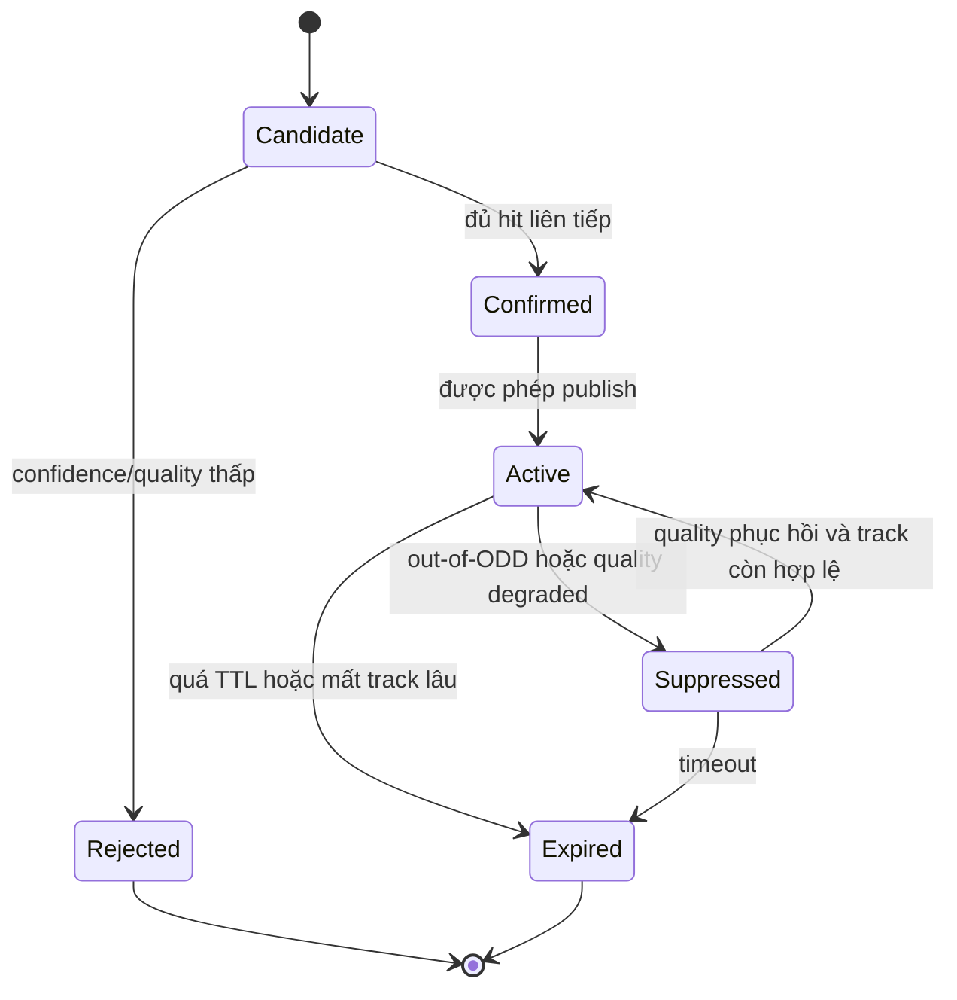

# State Manager and HMI

> **Vai trò file này:** mô tả lớp ổn định biển báo, trạng thái feature và policy HMI cho TSR production-lite.
>
> **Nguồn yêu cầu:** [2.03. Safety Analysis HAZOP and FTA](../2.knowledge_base/03.safety_analysis_hazop_fta.md) và [2.02. Camera Sensor and IEEE 2020](../2.knowledge_base/02.camera_sensor_ieee2020.md).

## 1. Vấn Đề Cần Giải Quyết

Detector chạy theo frame độc lập nên output có thể dao động: frame này thấy biển, frame sau mất vì nước mưa, glare hoặc motion blur. Nếu đưa thẳng detection lên HMI, người lái sẽ thấy icon chớp tắt hoặc cảnh báo không ổn định.

State Manager nằm giữa perception và HMI. Nó không làm detector chính xác hơn, nhưng làm hành vi publish có kiểm soát hơn.

## 2. Từ Hold Đến State Manager

`tsr_demo.py` hiện có cơ chế hold-based temporal lite: khi frame hiện tại không có detection, runtime giữ detection cũ trong một số frame ngắn. Cơ chế này hữu ích cho demo overlay, nhất là khi gạt mưa đi qua hoặc detector miss tạm thời.

Giới hạn:

- không có `track_id`;
- không phân biệt `candidate` và `confirmed`;
- không có TTL theo loại biển;
- không có reason code vì sao sign bị suppress;
- không biết quality frame hiện tại có đủ an toàn hay không.

State Manager production-lite cần mở rộng thành lifecycle rõ ràng.

Ở baseline hiện tại, `--hold 3` có thể được hiểu như hàng đợi giữ output ngắn hạn: nếu biển giới hạn tốc độ vừa được nhận diện nhưng frame tiếp theo bị hạt nước hoặc cần gạt che khuất, State Manager tiếp tục giữ biển cũ trong `3` frame để HMI không biến mất đột ngột. Đây là biện pháp chống chớp tắt mức demo, không thay thế tracking đầy đủ.

### 2.1 Mã Nguồn Thuật Toán Hold-Based State Manager

Đoạn dưới là thuật toán production-lite đã được phản ánh trong `code/tsr_demo.py`. Mục tiêu là tách detection raw khỏi output được phép hiển thị. Input `quality` đến từ `code/cta_monitor.py`, cụ thể là lớp `IEEE2020CTAMonitorV2` tính CTA, CSNR, CDP và sharpness trước khi publish HMI:

```python
class StateManager:
    def __init__(self, hold_frames=3):
        self.hold_frames = max(0, hold_frames)
        self.last_detections = []
        self.hold_left = 0
        self.reason = "empty"

    def update(self, detections, quality, accept_new=True):
        if quality.state == "UNAVAILABLE":
            self.last_detections = []
            self.hold_left = 0
            self.reason = f"cleared:{quality.reason}"
            return []

        if detections and accept_new:
            self.last_detections = list(detections)
            self.hold_left = self.hold_frames
            self.reason = "new_detection"
            return list(detections)

        if self.last_detections and self.hold_left > 0:
            self.hold_left -= 1
            self.reason = "held_detection"
            return list(self.last_detections)

        self.last_detections = []
        self.reason = "empty"
        return []
```

Logic quan trọng:

- detection mới chỉ được nhận nếu `accept_new=True`, tức image quality gate cho phép publish;
- `--hold 3` chỉ giữ dữ liệu trong 3 frame, không biến sign cũ thành ground truth;
- khi image quality là `UNAVAILABLE`, output bị clear ngay để tránh HMI hiển thị cảnh báo sai lệch;
- `reason` được đưa lên overlay/log để debug vì sao HMI giữ, clear hoặc suppress sign.

## 3. Lifecycle Đề Xuất



| State | Ý nghĩa | HMI behavior |
|---|---|---|
| `Candidate` | Có detection nhưng chưa đủ bằng chứng. | Không cảnh báo mạnh; có thể chỉ log/debug. |
| `Confirmed` | Detection ổn định qua nhiều frame. | Sẵn sàng xét publish. |
| `Active` | Biển đang áp dụng và được phép hiển thị. | Hiển thị icon/cảnh báo theo priority. |
| `Suppressed` | Biển có track nhưng bị chặn do quality/ODD/context. | HMI có thể báo degraded thay vì sign mới. |
| `Expired` | Biển đã mất hoặc hết TTL. | Xóa khỏi HMI sau hysteresis. |

## 4. Image Quality Và Degraded Mode

IEEE 2020 proxy từ camera monitor nên đi vào State Manager như input:

| Quality reason | Nguồn | State behavior |
|---|---|---|
| `low_contrast` | CTA/CSNR proxy thấp do mưa/sương. | Không confirm sign mới nếu evidence yếu. |
| `blur_high` | SFR/blur proxy thấp. | Giữ sign active ngắn hạn nhưng báo degraded nếu kéo dài. |
| `over_exposure` | Saturation/glare cao. | Suppress sign mới từ vùng bị bão hòa. |
| `latency_high` | Runtime vượt budget. | Chuyển degraded và giảm publish rate. |

HMI cần phân biệt:

- `AVAILABLE`: TSR hoạt động bình thường;
- `DEGRADED`: TSR còn chạy nhưng độ tin cậy giảm;
- `UNAVAILABLE`: không publish advisory mới vì sensor/runtime không đạt điều kiện tối thiểu.

## 5. CAN Bus Và HMI Message Concept

Ở mức production-lite, bản tin TSR nên tách dữ liệu biển báo khỏi trạng thái feature:

| Signal | Ý nghĩa |
|---|---|
| `tsr_availability` | `available`, `degraded`, `unavailable`. |
| `primary_sign_type` | Loại biển đang publish. |
| `primary_speed_limit` | Giá trị tốc độ nếu là biển tốc độ. |
| `confidence_level` | Mức tin cậy đã qua state manager, không chỉ raw detector confidence. |
| `quality_reason` | Lý do degraded/suppressed. |
| `stale_counter_ms` | Tuổi dữ liệu để HMI tránh hiển thị stale sign. |

CAN Bus cần timeout và stale-data policy. Nếu message quá cũ hoặc health signal mất, HMI phải clear hoặc chuyển trạng thái unavailable.

### 5.1 CAN Message Layout Đề Xuất

Ví dụ bản tin `TSR_STATUS` cho cụm đồng hồ xe máy:

| Trường | Giá trị đề xuất |
|---|---|
| CAN ID | `0x321` |
| DLC | `8` byte |
| Cycle time | `100 ms` khi available, `500 ms` khi unavailable nhưng vẫn health alive |
| Timeout | `300 ms` cho dữ liệu sign, `1000 ms` cho health |

| Byte | Signal | Encoding |
|---:|---|---|
| `0` | `availability` | `0=unavailable`, `1=degraded`, `2=available` |
| `1` | `sign_type` | Enum nội bộ: speed, stop, warning, prohibitory, mandatory |
| `2` | `speed_limit_kph` | `0` nếu không phải speed sign, còn lại `km/h` |
| `3` | `confidence_pct` | `0..100`, confidence sau state manager |
| `4` | `quality_reason` | Bitmask: blur, low contrast, glare, dark, latency |
| `5` | `age_100ms` | Tuổi dữ liệu sign theo bước `100 ms` |
| `6` | `counter` | Rolling counter chống stale/replay |
| `7` | `checksum` | Checksum đơn giản hoặc CRC tùy platform |

HMI không được chỉ dựa vào `speed_limit_kph`. Nó phải kiểm tra `availability`, `age_100ms`, `counter` và `checksum` trước khi hiển thị.

Bitmask đề xuất cho `quality_reason`:

| Bit | Reason | Nguồn |
|---:|---|---|
| `0` | `blur` | SFR/blur proxy thấp |
| `1` | `low_contrast` | CTA/CSNR proxy thấp do mưa/sương |
| `2` | `glare` | Saturation ratio cao, flare hoặc over-exposure |
| `3` | `dark` | Low-light/noise cao |
| `4` | `latency` | Runtime latency hoặc frame freshness vượt budget |
| `5` | `thermal` | Edge ECU vào thermal degraded mode |
| `6` | `camera_link` | Camera/cáp mất tín hiệu hoặc frame timeout |
| `7` | `reserved` | Dự phòng platform |

## 6. HMI Policy

| Tình huống | HMI nên làm |
|---|---|
| Sign mới chỉ là candidate | Không cảnh báo mạnh; chờ confirm. |
| Sign confirmed và quality tốt | Hiển thị ổn định, tránh chớp tắt theo từng frame. |
| Camera mưa mờ tạm thời | Có thể giữ sign active ngắn hạn, đồng thời báo degraded nếu kéo dài. |
| Quality dưới ngưỡng an toàn | Không publish sign mới; báo TSR degraded/unavailable. |
| CAN stale hoặc ECU fault | Clear sign hoặc báo feature unavailable. |

Degraded mode theo v3 có thể đồng thời:

- tắt nhánh Traditional CV nếu CPU quá tải;
- chuyển YOLO sang profile nhẹ hơn bằng cấu hình `--imgsz 512 --skip 2`;
- tăng skip lên `2` khi latency/nhiệt vượt ngưỡng nếu đang ở profile nhẹ hơn;
- giữ HMI ở trạng thái degraded để người lái biết camera không còn tối ưu.

Policy hiển thị đề xuất:

| Availability | Text/icon HMI | Có cảnh báo nguy hiểm? | Điều kiện vào |
|---|---|---|---|
| `AVAILABLE` | Hiển thị speed/sign confirmed bình thường. | Có, nếu sign critical đã confirmed. | CTA/CSNR đạt, latency đạt, thermal bình thường. |
| `DEGRADED` | Hiển thị biểu tượng TSR suy giảm hoặc màu cảnh báo phụ. | Không phát cảnh báo mạnh từ sign mới; chỉ giữ sign cũ trong hold ngắn nếu còn hợp lệ. | Mưa mờ nhẹ, glare nhẹ, thermal vượt ngưỡng nhưng pipeline còn chạy. |
| `UNAVAILABLE` | Xóa sign hoặc hiển thị TSR unavailable. | Không. | Camera bị phủ nước, ảnh quá tối/lóa, mất link hoặc dữ liệu stale. |

Trong demo overlay, trạng thái này được thể hiện bằng dòng `HMI`, `CTA`, `CSNR`, `Blur`, `Edge` để người kiểm thử thấy rõ vì sao warning được giữ hoặc ngắt. Khi chuyển sang cụm đồng hồ thật, cùng logic phải đi qua bản tin CAN thay vì chỉ vẽ chữ lên video.

Mapping từ monitor sang HMI:

| Monitor status | SOTIF action | HMI state |
|---|---|---|
| `SAFE` | `DISPLAY_CONFIRMED` | `AVAILABLE` |
| `DEGRADED_BLUR` | `HOLD_PREVIOUS_DECISION` | `DEGRADED` |
| `UNSAFE_RAIN_OR_GLARE` | `DEGRADED_VERIFICATION_REQUIRED` | `UNAVAILABLE` cho sign mới, có thể giữ sign cũ trong hold ngắn nếu policy cho phép |
| `INVALID_ROI` | `IGNORE` | Không publish candidate |

## 7. Roadmap Implementation

1. Chuẩn hóa detection event schema.
2. Thêm track id hoặc association đơn giản theo IoU.
3. Thêm hit/miss counter và TTL.
4. Thêm quality state từ image monitor.
5. Tách overlay demo khỏi HMI state output.
6. Thêm JSONL replay để kiểm tra flicker, stale và latency.

## 8. Acceptance Criteria

- Không publish sign mới từ frame bị quality gate loại bỏ.
- HMI không chớp tắt khi detector miss ngắn hạn.
- `DEGRADED` và `UNAVAILABLE` có reason rõ.
- Stale CAN/HMI data bị phát hiện bằng timeout.
- Overlay video chỉ là visualization, không phải HMI contract.
