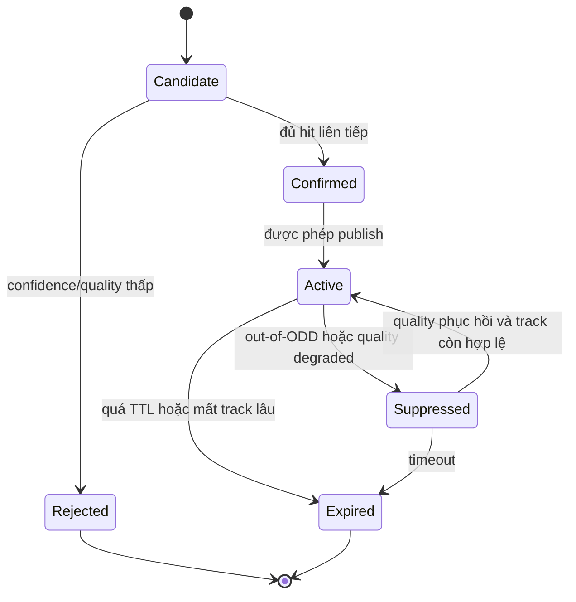

# State Manager and HMI

> **Vai trò file này:** mô tả lớp ổn định biển báo, trạng thái feature và policy HMI cho TSR production-lite.
>
> **Nguồn yêu cầu:** [2.03. Safety Analysis HAZOP and FTA](../2.knowledge_base/03.safety_analysis_hazop_fta.md) và [2.02. Camera Sensor and IEEE 2020](../2.knowledge_base/02.camera_sensor_ieee2020.md).

## 1. Vấn Đề Cần Giải Quyết

Detector chạy theo frame độc lập nên output có thể dao động: frame này thấy biển, frame sau mất vì nước mưa, glare hoặc motion blur. Nếu đưa thẳng detection lên HMI, người lái sẽ thấy icon chớp tắt hoặc cảnh báo không ổn định.

State Manager nằm giữa perception và HMI. Nó không làm detector chính xác hơn, nhưng làm hành vi publish có kiểm soát hơn.

## 2. Từ Hold Đến State Manager

`tsr_demo.py` hiện có cơ chế hold-based temporal lite: khi frame hiện tại không có detection, runtime giữ detection cũ trong một số frame ngắn. Cơ chế này hữu ích cho demo overlay, nhất là khi gạt mưa đi qua hoặc detector miss tạm thời.

Giới hạn:

- không có `track_id`;
- không phân biệt `candidate` và `confirmed`;
- không có TTL theo loại biển;
- không có reason code vì sao sign bị suppress;
- không biết quality frame hiện tại có đủ an toàn hay không.

State Manager production-lite cần mở rộng thành lifecycle rõ ràng.

## 3. Lifecycle Đề Xuất

| State | Ý nghĩa | HMI behavior |
|---|---|---|
| `Candidate` | Có detection nhưng chưa đủ bằng chứng. | Không cảnh báo mạnh; có thể chỉ log/debug. |
| `Confirmed` | Detection ổn định qua nhiều frame. | Sẵn sàng xét publish. |
| `Active` | Biển đang áp dụng và được phép hiển thị. | Hiển thị icon/cảnh báo theo priority. |
| `Suppressed` | Biển có track nhưng bị chặn do quality/ODD/context. | HMI có thể báo degraded thay vì sign mới. |
| `Expired` | Biển đã mất hoặc hết TTL. | Xóa khỏi HMI sau hysteresis. |

## 4. Image Quality Và Degraded Mode

IEEE 2020 proxy từ camera monitor nên đi vào State Manager như input:

| Quality reason | Nguồn | State behavior |
|---|---|---|
| `low_contrast` | CTA/CSNR proxy thấp do mưa/sương. | Không confirm sign mới nếu evidence yếu. |
| `blur_high` | SFR/blur proxy thấp. | Giữ sign active ngắn hạn nhưng báo degraded nếu kéo dài. |
| `over_exposure` | Saturation/glare cao. | Suppress sign mới từ vùng bị bão hòa. |
| `latency_high` | Runtime vượt budget. | Chuyển degraded và giảm publish rate. |

HMI cần phân biệt:

- `AVAILABLE`: TSR hoạt động bình thường;
- `DEGRADED`: TSR còn chạy nhưng độ tin cậy giảm;
- `UNAVAILABLE`: không publish advisory mới vì sensor/runtime không đạt điều kiện tối thiểu.

## 5. CAN Bus Và HMI Message Concept

Ở mức production-lite, bản tin TSR nên tách dữ liệu biển báo khỏi trạng thái feature:

| Signal | Ý nghĩa |
|---|---|
| `tsr_availability` | `available`, `degraded`, `unavailable`. |
| `primary_sign_type` | Loại biển đang publish. |
| `primary_speed_limit` | Giá trị tốc độ nếu là biển tốc độ. |
| `confidence_level` | Mức tin cậy đã qua state manager, không chỉ raw detector confidence. |
| `quality_reason` | Lý do degraded/suppressed. |
| `stale_counter_ms` | Tuổi dữ liệu để HMI tránh hiển thị stale sign. |

CAN Bus cần timeout và stale-data policy. Nếu message quá cũ hoặc health signal mất, HMI phải clear hoặc chuyển trạng thái unavailable.

## 6. HMI Policy

| Tình huống | HMI nên làm |
|---|---|
| Sign mới chỉ là candidate | Không cảnh báo mạnh; chờ confirm. |
| Sign confirmed và quality tốt | Hiển thị ổn định, tránh chớp tắt theo từng frame. |
| Camera mưa mờ tạm thời | Có thể giữ sign active ngắn hạn, đồng thời báo degraded nếu kéo dài. |
| Quality dưới ngưỡng an toàn | Không publish sign mới; báo TSR degraded/unavailable. |
| CAN stale hoặc ECU fault | Clear sign hoặc báo feature unavailable. |

## 7. Roadmap Implementation

1. Chuẩn hóa detection event schema.
2. Thêm track id hoặc association đơn giản theo IoU.
3. Thêm hit/miss counter và TTL.
4. Thêm quality state từ image monitor.
5. Tách overlay demo khỏi HMI state output.
6. Thêm JSONL replay để kiểm tra flicker, stale và latency.

## 8. Acceptance Criteria

- Không publish sign mới từ frame bị quality gate loại bỏ.
- HMI không chớp tắt khi detector miss ngắn hạn.
- `DEGRADED` và `UNAVAILABLE` có reason rõ.
- Stale CAN/HMI data bị phát hiện bằng timeout.
- Overlay video chỉ là visualization, không phải HMI contract.
