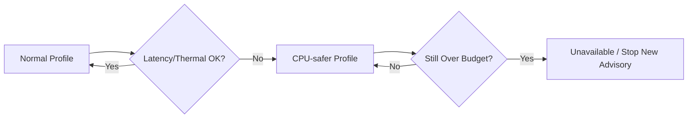

# Edge Deployment and Benchmarks

> **Vai trò file này:** hướng dẫn tối ưu tài nguyên và benchmark latency/FPS khi chạy TSR trên CPU yếu hoặc edge ECU như Jetson Nano.
>
> **Nguồn yêu cầu:** [2.01. Automotive Standards](../2.knowledge_base/01.automotive_standards.md), [2.03. Safety Analysis HAZOP and FTA](../2.knowledge_base/03.safety_analysis_hazop_fta.md).

## 1. Mục Tiêu Edge

Một demo chạy được trên laptop chưa chứng minh hệ thống phù hợp với ECU biên. Edge deployment phải ưu tiên latency ổn định, freshness của frame và hành vi degraded khi phần cứng quá tải.

Mục tiêu kỹ thuật:

- giữ inference latency trong budget đã đặt;
- tránh queue tích tụ làm output bị trễ;
- giảm tải khi input là video 4K hoặc CPU yếu;
- phát hiện thermal throttling;
- log FPS/latency để phục vụ benchmark.

## 2. Cấu Hình Runtime Quan Trọng

| Tham số | Vai trò | Trade-off |
|---|---|---|
| `--imgsz` | Kích thước ảnh inference YOLO. | Nhỏ hơn thì nhanh hơn nhưng có thể miss biển nhỏ. |
| `--max-width` | Giới hạn chiều rộng frame preprocess. | Giảm tải CPU/GPU và memory bandwidth. |
| `--skip` | Bỏ qua frame giữa các lần inference. | Giảm compute nhưng tăng nguy cơ cảnh báo muộn. |
| `--hold` | Giữ detection cũ ngắn hạn. | Giảm flicker overlay nhưng không thay tracking thật. |
| `--traditional` | Bật nhánh CV heuristic. | Tăng khả năng đối chiếu nhưng tốn thêm CPU và có false alarm. |
| `--no-display` | Tắt GUI. | Phù hợp headless/WSL/edge, giảm lỗi hiển thị. |

Profile gợi ý:

| Môi trường | Cấu hình |
|---|---|
| Laptop/lab 720p | `--imgsz 640 --max-width 1280 --skip 0` |
| CPU yếu hoặc video 4K | `--imgsz 512 --max-width 1280 --skip 1` |
| Degraded mode nặng | `--imgsz 512 --max-width 1280 --skip 2` |
| Headless edge | Thêm `--no-display` và ghi output/log. |

## 3. Jetson Nano Và Edge ECU

Jetson Nano hoặc ECU biên có giới hạn rõ về CPU, GPU memory, bandwidth và nhiệt. Với TSR, nguy cơ không chỉ là FPS thấp mà là warning đến muộn.

Khuyến nghị:

- ưu tiên input đã resize hoặc giới hạn `max_width`;
- tránh chạy GUI trên edge profile;
- không bật nhánh heuristic nếu CPU đã bão hòa;
- đo latency theo percentile, không chỉ FPS trung bình;
- kiểm tra nhiệt và clock trước/sau mỗi run;
- dùng video dài để bắt throttling sau vài phút.

## 4. CPU-safer Degraded Mode

Khi runtime phát hiện latency hoặc nhiệt vượt ngưỡng, hệ thống nên chuyển profile:



Ví dụ logic:

| Điều kiện | Hành vi |
|---|---|
| FPS giảm nhưng freshness còn đạt | Giảm `imgsz` hoặc tăng `skip` nhẹ. |
| Latency vượt budget liên tục | Vào degraded, không publish sign mới nếu dữ liệu stale. |
| Nhiệt vượt ngưỡng | Giảm tải hoặc tạm unavailable để bảo vệ phần cứng. |
| OOM/crash lặp lại | Restart có kiểm soát và ghi fault reason. |

## 4.1 Thermal Monitor Bằng sysfs

Trên Linux/Jetson, thermal state có thể đọc định kỳ từ sysfs, ví dụ `/sys/devices/virtual/thermal/thermal_zone*/temp`. Giá trị thường ở đơn vị milli-degree Celsius.

Pseudo-flow:

```text
read thermal_zone temp
if max_temp_c >= 80:
    enter CPU-safer mode
    increase skip up to 2
    reduce imgsz to 512
    disable optional Traditional CV
if max_temp_c remains high:
    mark TSR unavailable and stop new advisory
```

Ngưỡng `80°C` là target bảo vệ thiết kế cho benchmark; khi đưa lên phần cứng thật phải hiệu chỉnh theo datasheet ECU/NPU và policy thermal của platform.

## 4.2 Memory Và PyTorch Cache

Rủi ro OOM không chỉ đến từ model lớn. Nó có thể đến từ queue không giới hạn, video writer bị nghẽn hoặc tensor/cache không được giải phóng sau nhiều run.

Khuyến nghị implementation:

- giới hạn kích thước frame queue và detection queue;
- drop frame cũ khi writer/inference chậm;
- tránh giữ tensor GPU qua nhiều frame nếu không cần;
- nếu dùng CUDA, gọi `torch.cuda.empty_cache()` theo chu kỳ benchmark hoặc sau khi đổi profile;
- ghi memory peak và số lần drop frame vào log.

## 5. Benchmark Protocol

Benchmark tối thiểu nên ghi:

- video source, resolution, FPS, số frame;
- model weights và runtime backend;
- CPU/GPU/NPU, RAM, nhiệt độ;
- `imgsz`, `max_width`, `skip`, `traditional`, `no_display`;
- FPS trung bình, p50/p95/p99 latency;
- số detection, số frame miss, số cảnh báo;
- memory peak và crash/OOM nếu có;
- output video và JSONL nếu đã có logger.

## 6. KPI Cho Edge

| KPI | Mục đích |
|---|---|
| `latency_p95_ms` | Xác định cảnh báo có đến kịp không. |
| `frame_freshness_ms` | Tránh publish dữ liệu cũ. |
| `fps_effective` | Đo throughput sau skip/drop. |
| `thermal_state` | Phát hiện throttling. |
| `memory_peak_mb` | Bắt OOM/leak. |
| `miss_after_degraded` | Biết degraded profile ảnh hưởng recall thế nào. |

## 7. Acceptance Criteria

- Có ít nhất một profile chạy được trên CPU yếu hoặc edge headless.
- Benchmark báo percentile latency, không chỉ FPS trung bình.
- Degraded mode giảm tải thay vì để queue tích tụ.
- Nếu dữ liệu quá cũ, hệ thống không publish advisory mới.
- Kết quả benchmark liên kết được với cấu hình CLI và input video.
