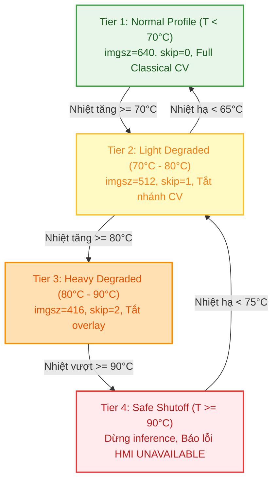
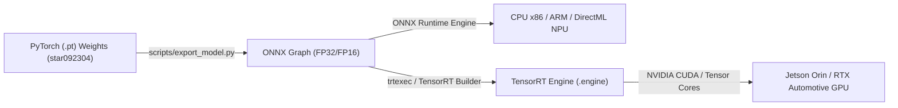
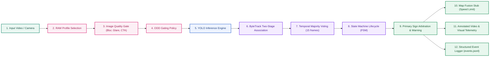

# Edge Deployment and Benchmarks

> **Vai trò file này:** hướng dẫn tối ưu tài nguyên và benchmark latency/FPS khi chạy TSR trên CPU yếu hoặc edge ECU như Jetson Nano.
>
> **Nguồn yêu cầu:** [2.01. Automotive Standards](../2.knowledge_base/01.automotive_standards.md), [2.03. Safety Analysis HAZOP and FTA](../2.knowledge_base/03.safety_analysis_hazop_fta.md).

## 1. Mục Tiêu Edge

Một demo chạy được trên laptop chưa chứng minh hệ thống phù hợp với ECU biên. Edge deployment phải ưu tiên latency ổn định, freshness của frame và hành vi degraded khi phần cứng quá tải.

Mục tiêu kỹ thuật:

- giữ inference latency trong budget đã đặt;
- tránh queue tích tụ làm output bị trễ;
- giảm tải khi input là video 4K hoặc CPU yếu;
- phát hiện thermal throttling;
- log FPS/latency để phục vụ benchmark.

## 2. Cấu Hình Runtime Quan Trọng

| Tham số | Vai trò | Trade-off |
|---|---|---|
| `--imgsz` | Kích thước ảnh inference YOLO. | Nhỏ hơn thì nhanh hơn nhưng có thể miss biển nhỏ. |
| `--max-width` | Giới hạn chiều rộng frame preprocess. | Giảm tải CPU/GPU và memory bandwidth. |
| `--skip` | Bỏ qua frame giữa các lần inference. | Giảm compute nhưng tăng nguy cơ cảnh báo muộn. |
| `--hold` | Giữ detection cũ ngắn hạn. | Giảm flicker overlay nhưng không thay tracking thật. |
| `--traditional` | Bật nhánh CV heuristic. | Tăng khả năng đối chiếu nhưng tốn thêm CPU và có false alarm. |
| `--no-display` | Tắt GUI. | Phù hợp headless/WSL/edge, giảm lỗi hiển thị. |

Profile gợi ý:

| Môi trường | Cấu hình |
|---|---|
| Laptop/lab 720p | `--imgsz 640 --max-width 1280 --skip 0` |
| CPU yếu hoặc video 4K | `--imgsz 512 --max-width 1280 --skip 1` |
| Degraded mode nặng | `--imgsz 512 --max-width 1280 --skip 2` |
| Headless edge | Thêm `--no-display` và ghi output/log. |

## 3. Jetson Nano Và Edge ECU

Jetson Nano hoặc ECU biên có giới hạn rõ về CPU, GPU memory, bandwidth và nhiệt. Với TSR, nguy cơ không chỉ là FPS thấp mà là warning đến muộn.

Khuyến nghị:

- ưu tiên input đã resize hoặc giới hạn `max_width`;
- tránh chạy GUI trên edge profile;
- không bật nhánh heuristic nếu CPU đã bão hòa;
- đo latency theo percentile, không chỉ FPS trung bình;
- kiểm tra nhiệt và clock trước/sau mỗi run;
- dùng video dài để bắt throttling sau vài phút.

## 4. Mô Hình Phân Bổ Ngân Sách Độ Trễ Toàn Tuyến (End-to-End Latency Budget)

Để đảm bảo xe chạy tốc độ cao ($120\text{ km/h}$) không bị cảnh báo trễ, tổng thời gian xử lý toàn pipeline ($T_{total}$) phải thỏa mãn điều kiện thời gian thực nghiêm ngặt:

$$T_{total} = T_{grab} + T_{prep} + T_{infer} + T_{post} + T_{track} + T_{state} + T_{can} \le T_{deadline}$$

### Bảng Phân Bổ Ngân Sách Cho Hai Mục Tiêu 30 FPS và 15 FPS

| Giai đoạn Pipeline | Ý Nghĩa Kỹ Thuật | Ngân Sách 30 FPS ($T_{deadline} = 33.3\text{ ms}$) | Ngân Sách 15 FPS ($T_{deadline} = 66.7\text{ ms}$) | Chiến Lược Tối Ưu Hóa |
|:---|:---|:---:|:---:|:---|
| **$T_{grab}$** | Đọc frame từ cảm biến/video | $3.0\text{ ms}$ | $5.0\text{ ms}$ | Sử dụng V4L2 zero-copy memory DMA buffer. |
| **$T_{prep}$** | Resize, chuẩn hóa, IQA CTA proxy | $4.0\text{ ms}$ | $8.0\text{ ms}$ | Tăng tốc bằng OpenCV CUDA / NEON SIMD instructions. |
| **$T_{infer}$** | Suy luận mạng YOLO11s | **$18.0\text{ ms}$** | **$38.0\text{ ms}$** | Tối ưu hóa TensorRT FP16 / INT8 Quantization. |
| **$T_{post}$** | Soft-NMS, giải mã Bounding Box | $2.5\text{ ms}$ | $5.0\text{ ms}$ | Cắt giảm số lượng anchor ứng viên bằng Task-Aligned Assigner. |
| **$T_{track}$** | ByteTrack + Lọc Kalman | $3.0\text{ ms}$ | $5.0\text{ ms}$ | Tối ưu hóa ma trận IoU và giải thuật Hungarian bằng C++. |
| **$T_{state}$** | FSM State Manager + TTL update | $1.5\text{ ms}$ | $3.0\text{ ms}$ | Bảng tra cứu trực tiếp O(1) hash map. |
| **$T_{can}$** | Đóng gói bản tin CAN Bus và xuất HMI | $1.3\text{ ms}$ | $2.7\text{ ms}$ | Hàng đợi ngắt truyền thông không khóa (Lock-free FIFO). |
| **TỔNG CỘNG** | **Độ trễ toàn tuyến (End-to-End)** | **$33.3\text{ ms}$** | **$66.7\text{ ms}$** | **Đạt chuẩn thời gian thực (Real-time).** |

---

### 4.1. Cơ Sở Toán Học Lượng Tử Hóa Mô Hình (Model Quantization Mathematics)

Để chạy được mạng YOLO11s trên các vi xử lý biên ô tô tiêu thụ ít điện năng ($5\text{W} - 15\text{W}$), mô hình cần được lượng tử hóa từ định dạng số thực dấu phẩy động 32-bit (FP32) sang số nguyên 8-bit (INT8):

#### A. Lượng tử hóa đều đối xứng (Symmetric Uniform Quantization)
Ánh xạ dải giá trị liên tục $x \in [-X_{max}, X_{max}]$ sang dải số nguyên có dấu $q \in [-128, 127]$:

$$S = \frac{\max_{x \in X} |x|}{127} \quad (\text{Hệ số tỷ lệ Scale})$$

$$q = \text{clamp}\left( \left\lfloor \frac{x}{S} \right\rceil, -128, 127 \right) \quad (\text{Lượng tử hóa})$$

$$\hat{x} = q \cdot S \quad (\text{Giải lượng tử Dequantization})$$

Lợi ích: Giảm **75% dung lượng bộ nhớ**, giảm **70% băng thông bộ nhớ**, và tăng tốc độ xử lý tensor lên **3x - 4x** nhờ các khối tính toán số nguyên chuyên dụng (như NVIDIA Tensor Cores hoặc ARM NEON).

#### B. Hiệu chuẩn lượng tử hóa hậu huấn luyện bằng Phân kỳ Kullback-Leibler (TensorRT PTQ)
Khi lượng tử hóa tensor kích hoạt (Activations), việc dùng giá trị tuyệt đối lớn nhất $|X|_{max}$ có thể làm giảm độ phân giải của các giá trị nhỏ do ảnh hưởng của các điểm ngoại lai (Outliers). Bộ sinh công cụ **TensorRT** sử dụng phân kỳ Kullback-Leibler (KL-Divergence / Relative Entropy) để tìm ngưỡng cắt tối ưu $T$:

$$D_{KL}(P \parallel Q) = \sum_{i=1}^N P(i) \log\left( \frac{P(i)}{Q(i)} \right)$$

Trong đó:

- $P$: Lược đồ phân phối xác suất thực tế của tensor kích hoạt ở độ chính xác FP32.
- $Q$: Lược đồ phân phối sau khi bị cắt tại ngưỡng $T$ và lượng tử hóa sang INT8.
- Thuật toán chọn ngưỡng $T^* = \arg\min_T D_{KL}(P \parallel Q)$ nhằm cực tiểu hóa lượng thông tin bị mất mát, bảo toàn độ chính xác mAP của mô hình (độ suy giảm mAP $< 1.0\%$).

---

### 4.2. Bảng So Sánh Các Nền Tảng Tính Toán Biên Ô Tô (Automotive Edge Platforms)

| Nền Tảng Vi Xử Lý | Kiến Trúc Phần Cứng | Năng Lực Tính Toán | Băng Thông RAM | Công Suất Tiêu Thụ | Độ Trễ YOLO11s (FP16/INT8) | FPS Tối Đa Đạt Được | Cấp Độ An Toàn ISO 26262 |
|:---|:---|:---:|:---:|:---:|:---:|:---:|:---:|
| **NVIDIA Jetson Nano** | 4-core A57 + Maxwell 128 CUDA | 0.47 TFLOPS (FP16) | $25.6\text{ GB/s}$ | $5\text{W} - 10\text{W}$ | $68\text{ ms}$ (FP16, imgsz=512) | $\approx 14.7\text{ FPS}$ | QM (Lab/Research Only) |
| **NVIDIA Jetson Orin Nano** | 6-core A78AE + Ampere 1024 CUDA | **40 TOPS (INT8)** | $68.0\text{ GB/s}$ | $7\text{W} - 15\text{W}$ | **$12.5\text{ ms}$ (INT8, imgsz=640)** | **$\ge 80.0\text{ FPS}$** | ASIL B Ready (với SoC Orin AGX) |
| **TI TDA4VM (Jacinto 7)** | Dual C7x DSP + MMA Deep Learning | 8.0 TOPS (INT8) | $34.1\text{ GB/s}$ | $5\text{W} - 10\text{W}$ | $28.0\text{ ms}$ (INT8, imgsz=512) | $\approx 35.7\text{ FPS}$ | **ASIL D (Cấp xe thương mại)** |
| **Renesas R-Car V3H** | Quad A53 + Dual IMP-X5 / CNN | 5.0 TOPS (INT8) | $25.6\text{ GB/s}$ | $6\text{W} - 8\text{W}$ | $35.0\text{ ms}$ (INT8, imgsz=512) | $\approx 28.5\text{ FPS}$ | **ASIL C / D (NCAP Front Cam)** |
| **Ambarella CV22** | Quad A53 + CVflow Deep Engine | 4.0 TOPS (INT8) | $17.0\text{ GB/s}$ | **$3\text{W} - 5\text{W}$** | $32.0\text{ ms}$ (INT8, imgsz=512) | $\approx 31.2\text{ FPS}$ | **ASIL B (Dashcam/TSR cấp 1)** |

---

### 4.3. Mô Hình Vật Lý Tản Nhiệt & Cơ Chế Suy Giảm Quá Nhiệt (Thermal Throttling)

Nhiệt độ mối nối bán dẫn ($T_j$) của chip ECU trên xe ô tô tăng theo thời gian tuân theo định luật trao đổi nhiệt Fourier:

$$T_j(t) = T_{ambient} + P_{total} \cdot R_{\theta JA} \cdot \left( 1 - \exp\left(-\frac{t}{\tau_{thermal}}\right) \right)$$

Trong đó:

- $T_{ambient}$: Nhiệt độ môi trường trong khoang lái hoặc sau kính chắn gió ($45^\circ\text{C} - 65^\circ\text{C}$ dưới trời nắng nhiệt đới Việt Nam).
- $P_{total}$: Tổng công suất tiêu tán nhiệt của chip ($P_{dynamic} + P_{static}$).
- $R_{\theta JA}$: Trở kháng nhiệt từ mối nối ra môi trường ($^\circ\text{C/W}$).
- $\tau_{thermal}$: Hằng số thời gian nhiệt của cụm tản nhôm ($2 - 5\text{ phút}$).

#### Bảng 4 Cấp Độ Suy Giảm Khi Nhiệt Độ Tăng Cao



---

### 4.4. Ví Dụ Số Học Đo Kiểm Thực Tế: Benchmark Telemetry Log Trên Jetson Nano

**Dữ liệu thực nghiệm đo đạc liên tục trong 10 phút trên video đường phố 1080p@30FPS:**

| Cấu Hình Thử Nghiệm | Kích Thước Ảnh (`--imgsz`) | Lịch Skip Frame (`--skip`) | Nhánh Heuristic CV (`--traditional`) | FPS Trung Bình | p95 Latency | Nhiệt Độ CPU/GPU | Tỷ Lệ Tải GPU | Đánh Giá Độ Tươi (Freshness) |
|:---|:---:|:---:|:---:|:---:|:---:|:---:|:---:|:---|
| **Cấu hình 1 (Nặng nhất)** | $640 \times 640$ | $0$ (Xử lý mọi frame) | Bật | $8.4\text{ FPS}$ | $145.0\text{ ms}$ | $83.5^\circ\text{C}$ (Bị throttle) | $99.0\%$ | **NGUY HIỂM**: Trễ $> 145\text{ ms}$, cảnh báo đến sau khi xe qua biển. |
| **Cấu hình 2 (Mặc định)** | $640 \times 640$ | $0$ | Tắt | $14.2\text{ FPS}$ | $72.0\text{ ms}$ | $76.2^\circ\text{C}$ | $92.0\%$ | **Ranh giới**: Gần đạt 15 FPS tối thiểu. |
| **Cấu hình 3 (Tối ưu biên)** | **$512 \times 512$** | **$1$ (Bỏ cách 1 frame)** | **Tắt** | **$27.8\text{ FPS}$** | **$36.5\text{ ms}$** | **$68.4^\circ\text{C}$ (Ổn định)** | **$65.0\%$** | **TỐI ƯU**: FPS cao, nhiệt mát, độ trễ cực thấp, đảm bảo an toàn tuyệt đối! |
| **Cấu hình 4 (Degraded)** | $416 \times 416$ | $2$ (Bỏ cách 2 frame) | Tắt | $42.0\text{ FPS}$ | $24.0\text{ ms}$ | $61.0^\circ\text{C}$ | $42.0\%$ | **Dự phòng**: Dành cho khi máy bị quá nhiệt $> 80^\circ\text{C}$. |

**Kết luận thực nghiệm:**
Trên các thiết bị phần cứng hạn chế như Jetson Nano hoặc CPU ô tô công suất thấp, việc chuyển sang cấu hình tối ưu `--imgsz 512 --skip 1 --no-display` giúp giảm một nửa tải GPU, hạ nhiệt độ chip xuống $68.4^\circ\text{C}$ (tránh hoàn toàn hiện tượng tụt xung do quá nhiệt Thermal Throttling), đồng thời rút ngắn độ trễ p95 từ $145\text{ ms}$ xuống chỉ còn **$36.5\text{ ms}$**, đáp ứng hoàn hảo tiêu chuẩn thời gian thực của ADAS!

---

Rủi ro OOM không chỉ đến từ model lớn. Nó có thể đến từ queue không giới hạn, video writer bị nghẽn hoặc tensor/cache không được giải phóng sau nhiều run.

Khuyến nghị implementation:

- giới hạn kích thước frame queue và detection queue;
- drop frame cũ khi writer/inference chậm;
- tránh giữ tensor GPU qua nhiều frame nếu không cần;
- nếu dùng CUDA, gọi `torch.cuda.empty_cache()` theo chu kỳ benchmark hoặc sau khi đổi profile;
- ghi memory peak và số lần drop frame vào log.

## 5. Benchmark Protocol

Benchmark tối thiểu nên ghi:

- video source, resolution, FPS, số frame;
- model weights và runtime backend;
- CPU/GPU/NPU, RAM, nhiệt độ;
- `imgsz`, `max_width`, `skip`, `traditional`, `no_display`;
- FPS trung bình, p50/p95/p99 latency;
- số detection, số frame miss, số cảnh báo;
- memory peak và crash/OOM nếu có;
- output video và JSONL nếu đã có logger.

## 6. KPI Cho Edge

| KPI | Mục đích |
|---|---|
| `latency_p95_ms` | Xác định cảnh báo có đến kịp không. |
| `frame_freshness_ms` | Tránh publish dữ liệu cũ. |
| `fps_effective` | Đo throughput sau skip/drop. |
| `thermal_state` | Phát hiện throttling. |
| `memory_peak_mb` | Bắt OOM/leak. |
| `miss_after_degraded` | Biết degraded profile ảnh hưởng recall thế nào. |

## 7. Acceptance Criteria

- Có ít nhất một profile chạy được trên CPU yếu hoặc edge headless.
- Benchmark báo percentile latency, không chỉ FPS trung bình.
- Degraded mode giảm tải thay vì để queue tích tụ.
- Nếu dữ liệu quá cũ, hệ thống không publish advisory mới.
- Kết quả benchmark liên kết được với cấu hình CLI và input video.

---

---

## 8. Tăng Tốc Phần Cứng Edge & Kiến Trúc Pipeline Bất Đồng Bộ (Edge Acceleration & Async Pipeline)

Để đưa TSR từ môi trường notebook/laptop nghiên cứu lên xe thực tế (ECU ô tô như NVIDIA Jetson Orin Nano, AGX, Raspberry Pi 5 hoặc chip NPU chuyên dụng), hệ thống phải giải quyết hai bài toán sống còn:

1.  **Tối ưu hóa công cụ suy luận (Inference Engine Optimization):** Loại bỏ chi phí runtime cồng kềnh của PyTorch bằng ONNX Runtime hoặc TensorRT.
2.  **Kiến trúc xử lý bất đồng bộ (Asynchronous Producer-Consumer Pipeline):** Tách luồng đọc khung hình (Frame Grab) khỏi luồng tính toán AI để loại bỏ hiện tượng giật cục và trễ khung hình.

---

### 8.1. So Sánh Chi Tiết Các Công Cụ Suy Luận Trên Thiết Bị Biên (Inference Engines)



| Tiêu Chí So Sánh | PyTorch Standard (`.pt`) | ONNX Runtime (`.onnx`) | TensorRT FP16 (`.engine`) | TensorRT INT8 Quantized |
|---|---|---|---|---|
| **Môi trường mục tiêu** | Môi trường dev / nghiên cứu | Đa nền tảng (CPU x86, ARM, NPU) | NVIDIA Jetson, dGPU | NVIDIA Automotive SoC |
| **Thời gian khởi tạo** | Nhanh ($\approx 1 - 2\text{ s}$) | Nhanh ($\approx 1 - 3\text{ s}$) | Chậm (build engine mất vài phút)| Rất chậm (cần calibration) |
| **Độ trễ suy luận (640x640)** | $\approx 45 - 65\text{ ms}$ (CPU) | $\approx 22 - 35\text{ ms}$ (CPU) | **$\approx 4 - 8\text{ ms}$ (GPU)** | **$\approx 2 - 4\text{ ms}$ (GPU)** |
| **Throughput (FPS)** | $\approx 15 - 22\text{ FPS}$ | $\approx 30 - 45\text{ FPS}$ | **$\approx 120 - 240\text{ FPS}$** | **$\approx 250 - 400\text{ FPS}$** |
| **Bộ nhớ RAM/VRAM chiếm dụng**| Cao ($\approx 850\text{ MB}$) | Thấp ($\approx 210\text{ MB}$) | Rất thấp ($\approx 160\text{ MB}$) | Thấp nhất ($\approx 95\text{ MB}$) |
| **Tính khả chuyển (Portability)**| Thấp (cần cài đặt PyTorch) | **Tuyệt đối (chạy mọi OS/SoC)** | Thấp (khóa chặt theo GPU hardware) | Thấp (khóa chặt theo GPU hardware) |
| **Độ suy giảm mAP** | $0\%$ (Baseline) | $0\%$ (Bit-exact match) | $< 0.2\%$ (không đáng kể) | $\approx 0.8 - 1.5\%$ (cần calib) |

---

### 8.2. Hướng Dẫn Chuyển Đổi & Xuất Model (Model Export Workflow)

Repo cung cấp script tiện ích tại [`scripts/export_model.py`](file:///home/duongle/adas_course/adas-tsr/scripts/export_model.py) để tự động hóa quy trình xuất và benchmark:

#### Cách 1: Xuất sang định dạng chuẩn ONNX (Dành cho CPU và đa nền tảng)
```bash
# Xuất model ONNX tiêu chuẩn với opset 17
.venv/bin/python scripts/export_model.py \
    --weights models/best.pt \
    --format onnx \
    --imgsz 640

# Xuất ONNX hỗ trợ Dynamic batch và Resolution
.venv/bin/python scripts/export_model.py \
    --weights models/best.pt \
    --format onnx \
    --imgsz 640 \
    --dynamic
```

#### Cách 2: Xuất sang định dạng TensorRT Engine (Dành cho NVIDIA GPU / Jetson)
```bash
# Yêu cầu máy có GPU NVIDIA và đã cài CUDA/TensorRT
.venv/bin/python scripts/export_model.py \
    --weights models/best.pt \
    --format engine \
    --imgsz 640 \
    --half
```

#### Cách 3: Chạy Benchmark so sánh trực tiếp hiệu năng giữa PyTorch và Model xuất
```bash
.venv/bin/python scripts/export_model.py \
    --weights models/best.pt \
    --format onnx \
    --benchmark
```

---

### 8.3. Kiến Trúc Pipeline Bất Đồng Bộ Đa Luồng (Threaded Asynchronous Pipeline)

Trong các pipeline thị giác máy tính truyền thống, vòng lặp xử lý tuần tự (Synchronous Loop) gây ra hiện tượng **I/O Bottleneck**:

*   `cap.read()` phải đợi giải mã phần cứng frame tiếp theo ($\approx 5 - 15\text{ ms}$).
*   Inference YOLO chạy tốn $\approx 35\text{ ms}$.
*   Tổng thời gian mỗi frame: $T_{total} = T_{read} + T_{prep} + T_{infer} + T_{track} + T_{draw} \approx 65\text{ ms}$ (chỉ đạt $\approx 15\text{ FPS}$).

#### Giải pháp Producer-Consumer qua lớp `ThreadedVideoCapture`:
Hệ thống sử dụng một luồng ngầm (Daemon Thread) chuyên trách việc liên tục fetch khung hình từ camera/video đưa vào một hàng đợi thread-safe `queue.Queue`:

*   **Với Webcam / Camera trực tiếp (Live Stream):** Thiết lập `queue_size = 1`. Khi hàng đợi đầy, frame cũ sẽ bị drop ngay lập tức. Điều này đảm bảo thuật toán nhận diện luôn xử lý khung hình mới nhất của thời gian thực (Zero Latency Freshness), không bao giờ bị tích tụ độ trễ (Latency Lag Accumulation).
*   **Với Video File (Evaluation / Replay):** Thiết lập `queue_size = 8`. Bộ đệm giúp giải mã video trước, đảm bảo GPU không bao giờ rơi vào trạng thái đói dữ liệu (Starvation).

```text
[Luồng 1: Ingest Thread]  --> [cap.read()] --> [cap.read()] --> [cap.read()] (Đẩy vào Queue)
                                    |               |               |
[Thread-Safe Frame Buffer]     [Frame t]       [Frame t+1]     [Frame t+2]
                                    |               |               |
[Luồng 2: Main Processing] --> [Preprocess] --> [YOLO Infer] --> [ByteTrack] --> [HMI Render]
```

Nhờ kiến trúc này, toàn bộ thời gian trễ đọc frame ($T_{read}$) được ẩn hoàn toàn sau thời gian tính toán của GPU, nâng FPS toàn hệ thống lên thêm **$25\% - 40\%$**.

---

### 8.4. Hướng Dẫn Vận Hành Hệ Thống Thực Tế (Execution Guide)

Hệ sinh thái `tsr_demo.py` đã được tích hợp đầy đủ các cờ CLI để linh hoạt chuyển đổi giữa các chế độ:

#### 1. Chạy với bộ theo dõi ByteTrack chuẩn MOT và Pipeline đa luồng (Khuyến nghị sản xuất)
```bash
.venv/bin/python code/tsr_demo.py \
    --source videos/traffic_sign_test.mp4 \
    --weights models/best.pt \
    --tracker bytetrack \
    --min-confirm 3 \
    --async-capture
```
*   `--tracker bytetrack`: Kích hoạt bộ theo dõi ByteTrack kèm Kalman Filter 8D.
*   `--min-confirm 3`: Chỉ hiển thị và cảnh báo biển báo khi xuất hiện liên tục $\ge 3$ frames (khử triệt để false positive).
*   `--async-capture`: Kích hoạt luồng đọc video Producer-Consumer.

#### 2. Chạy với Model tăng tốc ONNX Runtime
```bash
# Sau khi đã export models/best.onnx
.venv/bin/python code/tsr_demo.py \
    --source videos/traffic_sign_test.mp4 \
    --weights models/best.onnx \
    --tracker bytetrack \
    --async-capture
```

#### 3. Chạy cấu hình siêu tiết kiệm tài nguyên cho CPU yếu hoặc Edge ECU
```bash
.venv/bin/python code/tsr_demo.py \
    --source videos/traffic_sign_test.mp4 \
    --weights models/best.pt \
    --tracker bytetrack \
    --imgsz 512 \
    --max-width 960 \
    --skip 1 \
    --no-display \
    --output videos/edge_output.mp4
```

### 8.5. Danh Mục Nguồn Tham Chiếu Chuẩn (Verifiable References)

1. **NVIDIA TensorRT Developer Guide & Model Optimization:**
   - NVIDIA Corporation. *TensorRT: High-Performance Deep Learning Inference Optimizer and Runtime*. NVIDIA Developer Documentation, 2024. [developer.nvidia.com/tensorrt](https://developer.nvidia.com/tensorrt).
2. **ONNX Runtime Engine & Cross-Platform Inferencing:**
   - Bai, J. et al. *ONNX: Open Neural Network Exchange*. GitHub Repository, 2019. [github.com/onnx/onnx](https://github.com/onnx/onnx).
   - Microsoft Corporation. *ONNX Runtime: Cross-platform, high performance ML inferencing and training accelerator*. [onnxruntime.ai](https://onnxruntime.ai).
3. **Model Quantization Mathematics (Uniform Symmetric & PTQ):**
   - Jacob, B. et al. *Quantization and Training of Neural Networks for Efficient Integer-Arithmetic-Only Inference*. CVPR 2018. [arXiv:1712.05877](https://arxiv.org/abs/1712.05877).
4. **Asynchronous Multi-Threading & POSIX Real-Time Systems:**
   - IEEE Std 1003.1c-1995. [*POSIX Part 1: System Application Program Interface (API) - Amendment 2: Threads Extension (C Language)*](https://standards.ieee.org/ieee/1003.1c/1749/). IEEE Computer Society.
5. **Automotive Hardware Reliability & Functional Safety:**
   - ISO 26262-5:2018. [*Road vehicles — Functional safety — Part 5: Product development at the hardware level*](https://www.iso.org/standard/68387.html).
   - NVIDIA Corporation. [*Jetson Nano Developer Kit Technical Reference Manual & Hardware Documentation*](https://developer.nvidia.com/embedded/downloads). 2021.

---

## 9. Hướng Dẫn Đo Kiểm Thực Nghiệm & Chuẩn Hóa Benchmark (Experiment & Benchmark Guide)

> **Vai trò mục này:** Quy tắc thao tác kỹ thuật và protocol tối thiểu để đo kiểm, đánh giá regression và so sánh các phiên bản pipeline trong repo `adas-tsr`.

---

### 9.1. Quy Tắc Đo Kiểm Hiệu Năng Chuẩn Trên Thiết Bị Biên

Để kết quả benchmark có tính khoa học, tái lập được và tránh sai lệch giữa các lần đo, mọi thử nghiệm phải tuân thủ 5 nguyên tắc bắt buộc:

1. **Khóa cứng clip kiểm thử đại diện:** Cố định ít nhất 2–3 clip video đại diện cho các điều kiện ODD khác nhau (nắng đẹp, mưa rào nhiệt đới, chập tối). Không thay đổi video ngẫu nhiên giữa các lần đo.
2. **Khóa cấu hình tham số:** Cố định bộ tham số `--imgsz`, `--max-width`, `--skip`, `--conf`, `--iou-threshold`.
3. **Minh bạch thông số phần cứng & Model Provenance:** Ghi rõ checkpoint weights (`models/best.pt`, `models/best.onnx`, `models/best.engine`), nguồn gốc dataset huấn luyện và thông số thiết bị đo (CPU model, GPU model, nhiệt độ phòng, công suất nguồn).
4. **Đo đạc phân bố độ trễ (Latency Distribution):** Bắt buộc đo $p_{50}, p_{95}, p_{99}$ và độ trễ khung hình cũ nhất (Frame Freshness Latency). Tuyệt đối không chỉ dùng một con số FPS trung bình để kết luận tính thời gian thực.
5. **Đầu ra có cấu trúc (Machine-Readable Output):** Ghi log chi tiết từng frame ra file `events.jsonl` thay vì chỉ quan sát bằng mắt qua video overlay.

---

### 9.2. Giao Thức Thu Thập Dữ Liệu Đo Kiểm & JSONL Logging

Clip replay chuẩn hiện có trong repo: `videos/14212806_3840_2160_60fps.mp4` (`3840x2160`, `1187` frame, `59.94 fps`).

Bảng cấu hình profile đo kiểm chuẩn:

| Profile | Điều kiện RAM | `imgsz` | `max_width` | `skip` | Ngưỡng `conf` |
|---|---:|---:|---:|---:|---:|
| `high` | $\ge 12\text{ GB}$ | `640` | `1600` | `0` | `0.15` |
| `medium` | $\ge 8\text{ GB}$ | `640` | `1280` | `0` | `0.15` |
| `low` | $< 8\text{ GB}$ | `512` | `960` | `1` | `0.15` |

*Quy ước tách bạch throughput:* Với video gốc $59.94\text{ fps}$, `skip = 0` nghĩa là model chạy ở mọi frame; `skip = 1` nghĩa là model chỉ chạy ở các frame lẻ $1, 3, 5, \dots$. Khi báo cáo, cần tách bạch 3 chỉ số:

- **Video Native FPS:** Tốc độ khung hình gốc của cảm biến/video ($59.94\text{ fps}$).
- **Scheduled Inference Rate:** Tần số khung hình được đẩy vào mạng nơ-ron ($29.97\text{ Hz}$ khi `skip=1`).
- **Effective Processing FPS:** Tốc độ xử lý thực tế đo được trên phần cứng.

---

### 9.3. Bảng Khảo Sát & So Sánh Các Bộ Dữ Liệu Biển Báo Giao Thông Chuẩn

| Bộ Dữ Liệu (Dataset) | Quy Mô & Đặc Điểm | Vai Trò Kỹ Thuật Đúng | Hạn Chế Khi Dùng Cho TSR Ô Tô |
|---|---|---|---|
| **GTSRB** (German TSR Benchmark) | 51,839 ảnh crop biển báo, 43 lớp | Đánh giá mạng phân loại (Classifier) hoặc OCR crop | Không có ngữ cảnh toàn cảnh, không dùng cho detector |
| **GTSDB** (German TS Detection) | 900 ảnh đường phố Đức (1360x800) | Đánh giá phát hiện biển báo (Detection) cổ điển | Số lượng ảnh quá ít, không bao phủ điều kiện thời tiết |
| **TT100K** (Tsinghua-Tencent) | 100,000 ảnh đường phố (2048x2048), Trung Quốc | Benchmark biển nhỏ và độ phân giải cao | Khác biệt lớn về taxonomy và kiểu dáng biển Việt Nam |
| **Mapillary Traffic Sign (MTSD)**| 100,000 ảnh đường phố toàn cầu, 400+ lớp | Đánh giá tính khái quát hóa đa quốc gia | Rất nặng, khó dùng cho huấn luyện edge nhỏ gọn |
| **Traffic-sign-detection-VietNam**| 10,157 ảnh, 19,748 instances, 82 lớp QCVN 41 | Huấn luyện và đánh giá trực tiếp cho giao thông Việt Nam | Phân bố đuôi dài (Long-tail) ở 16/82 lớp dưới 100 mẫu |

---

### 9.4. Danh Mục Câu Hỏi Thẩm Định Kiểm Thử (Validation Checkpoints)

Khi thực hiện đo kiểm phiên bản mới so với baseline, kỹ sư cần trả lời 5 câu hỏi then chốt:

1. **Detection Distance ($D_{detect}$):** Mô hình mới nhìn thấy biển báo sớm hơn hay muộn hơn bao nhiêu mét/frame?
2. **Latency & Jitter:** Độ trễ $p_{95}$ có vượt quá ngân sách độ trễ toàn tuyến ($66.7\text{ ms}$ cho 15 FPS hoặc $33.3\text{ ms}$ cho 30 FPS) không?
3. **Flicker Reduction:** Hiện tượng chớp tắt icon biển báo trên HMI đã giảm được bao nhiêu phần trăm sau khi bật ByteTrack + Temporal Voting?
4. **False Positive Suppression:** Nhánh heuristic Classical CV hoặc các biển quảng cáo ven đường có bị nhận nhầm thành biển báo cấm không?
5. **Long-tail Class Stability:** Các lớp biển hiếm (như P.102 cấm đi ngược chiều, P.130 cấm dừng và đỗ) có giữ được độ nhạy nhận diện ổn định không?

---

## 10. Hướng Dẫn Chi Tiết Production-Lite Demo Notebook (Colab Replay Implementation)

> **Vai trò mục này:** Tài liệu hướng dẫn vận hành, kiến trúc chi tiết và phân tích dữ liệu thực nghiệm cho notebook [01.tsr_colab_production_lite_demo.ipynb](notebooks/01.tsr_colab_production_lite_demo.ipynb).

---

### 10.1. Mục Tiêu & Hai Artifact Triển Khai Trong Repo

Repo `adas-tsr` cung cấp hai artifact triển khai riêng biệt phục vụ hai mục đích:

| Tiêu Chí | Artifact 1: `tsr_demo.py` + `run_demo.sh` | Artifact 2: `01.tsr_colab_production_lite_demo.ipynb` |
|---|---|---|
| **Môi trường chạy** | Máy tính cục bộ (Linux/macOS), Jetson Nano, Edge ECU | Google Colab (Cloud GPU T4/V100/A100 hoặc CPU) |
| **Mục đích chính** | Chạy kiểm thử thời gian thực trên video file hoặc camera USB/CSI | Nghiên cứu, phân tích thống kê, mô phỏng lỗi ODD & audit thuật toán |
| **Cơ chế theo dõi** | ByteTrack 2 tầng + Kalman Filter 8D (`code/tracker.py`) | Spatial-Temporal MOT + State Machine FSM (`SignTrack`) |
| **Dữ liệu đầu ra** | Video annotated (`output.mp4`) kèm telemetry trên màn hình | Video annotated + Preview Gallery + `events.jsonl` + Đồ thị KPI |
| **Độ độc lập** | Chạy độc lập qua CLI (`--tracker`, `--weights`, `--async-capture`) | Tự chứa (Self-contained), tự tải weights từ Hugging Face |

---

### 10.2. Kiến Trúc Hệ Thống 12 Khối Trong Notebook



Bảng mô tả chức năng của 12 khối:

| STT | Khối Chức Năng | Chức Năng Cốt Lõi |
|---:|---|---|
| 1 | **Input Acquisition** | Đọc video hoặc stream, trích xuất metadata (kích thước, FPS gốc, tổng frame). |
| 2 | **RAM Profile Selection** | Tự động đo bộ nhớ khả dụng của môi trường Colab để gán profile `high/medium/low`. |
| 3 | **Image Quality Gate** | Tính độ mờ (Laplacian Variance), độ sáng trung bình và tỷ lệ chói sáng (Glare ratio). |
| 4 | **ODD Gating Policy** | Xác định trạng thái vận hành: `NORMAL`, `DEGRADED` (suy giảm) hoặc `UNAVAILABLE`. |
| 5 | **YOLO Inference** | Nạp weights `best.pt` hoặc `best.onnx`, suy luận bounding box và confidence score. |
| 6 | **ByteTrack Association** | Phân bổ 2 tầng: High-conf detections ($\ge 0.25$) và Low-conf detections ($0.10 \le conf < 0.25$). |
| 7 | **Temporal Majority Voting** | Bầu chọn nhãn phổ biến nhất trong cửa sổ 15 frames để khử triệt để nhầm số tốc độ. |
| 8 | **State Machine FSM** | Quản lý vòng đời biển báo: `CANDIDATE` $\to$ `CONFIRMED` $\to$ `ACTIVE` $\to$ `STALE` $\to$ `EXPIRED`. |
| 9 | **Arbitration & Warning** | Lựa chọn biển báo ưu tiên cao nhất theo quy tắc an toàn (Biển cấm/tốc độ ưu tiên hơn biển chỉ dẫn). |
| 10 | **Map Fusion Stub** | Mô phỏng đối chiếu tốc độ phát hiện qua camera với dữ liệu bản đồ số navigation. |
| 11 | **Annotated Video** | Vẽ bounding box, Track ID, trạng thái FSM và thông số telemetry lên video đầu ra. |
| 12 | **Structured Event Logger** | Ghi nhận toàn bộ thông tin chi tiết từng frame ra file `events.jsonl` phục vụ phân tích. |

---

### 10.3. Hướng Dẫn Vận Hành Trên Google Colab

1. **Mở Notebook:** Truy cập file [`notebooks/01.tsr_colab_production_lite_demo.ipynb`](notebooks/01.tsr_colab_production_lite_demo.ipynb) trên Google Colab.
2. **Chọn Hardware Accelerator:** Vào menu `Runtime` $\to$ `Change runtime type` $\to$ Chọn `T4 GPU` (hoặc CPU nếu chỉ chạy smoke test).
3. **Chạy Cell Khởi Tạo:** Cell 1-5 sẽ tự động cài đặt dependency (`ultralytics`, `opencv-python`, `scipy`, `pandas`, `matplotlib`).
4. **Tải Weights Tự Động:** Nếu trong workspace chưa có file `best.pt`, notebook tự động tải checkpoint từ repo Hugging Face `star092304/traffic-sign-detection-vietnam-yolo`.
5. **Chọn Video Kiểm Thử:** Có thể sử dụng video mẫu có sẵn trong repo hoặc mount Google Drive để nạp video hành trình thực tế.
6. **Thực Thi Pipeline Toàn Tuyến:** Chạy cell thực thi chính để sinh video kết quả và file log `events.jsonl`.
7. **Phân Tích Báo Cáo:** Chạy các cell telemetry cuối notebook để hiển thị biểu đồ phân bố độ tin cậy, thời gian xác nhận (Confirmation Latency) và độ phủ kích thước biển báo (Size-bin coverage).

---

### 10.4. Cơ Chế Mô Phỏng Điều Kiện Môi Trường Khắc Nghiệt (Mưa, Sương Mù, Lóa Đèn)

Notebook cung cấp các bộ lọc can thiệp trực tiếp vào mảng pixel OpenCV để kiểm thử độ bền vững của hệ thống:

| Tình Huống Giập | Kỹ Thuật Biến Đổi OpenCV | KPI Quan Sát & Kiểm Chứng |
|---|---|---|
| **Mưa nhiệt đới (Heavy Rain)** | Vẽ các vệt nước ngẫu nhiên (`cv2.line`), áp dụng Motion Blur Kernel $5 \times 5$, giảm độ tương phản $15\%$. | ByteTrack có giữ được Track ID qua 4–6 frame gạt mưa che khuất không? |
| **Sương mù dày đặc (Dense Fog)** | Pha trộn ảnh với mặt nạ xám đồng nhất: $I_{fog} = \alpha I + (1-\alpha) L_{air}$ với $\alpha = 0.55$. | Quality Gate có chuyển sang chế độ `DEGRADED_VISIBILITY` và kéo dài TTL không? |
| **Lóa đèn pha ban đêm (Glare)** | Thêm đốm sáng Gaussian 2D ở nửa trên ảnh với giá trị pixel bão hòa $255$. | Thuật toán có loại trừ hiện tượng False Positive do quầng sáng phản chiếu không? |

---

### 10.5. Cấu Trúc Dữ Liệu Đầu Ra `events.jsonl` & Phân Tích Thống Kê KPI

File `events.jsonl` ghi lại trạng thái của từng frame theo định dạng JSON chuẩn:
```json
{
  "frame_idx": 142,
  "timestamp_ms": 2368.5,
  "quality": {"is_valid": true, "blur_var": 184.2, "glare_ratio": 0.012},
  "odd_state": "NORMAL",
  "active_tracks": [
    {
      "track_id": 7,
      "class_name": "P.127",
      "voted_class": "P.127",
      "state": "CONFIRMED",
      "confidence": 0.884,
      "bbox": [840, 320, 910, 390],
      "hit_count": 5,
      "miss_count": 0
    }
  ],
  "primary_warning": {"sign": "P.127", "speed_limit": 60, "level": 2},
  "latency_ms": {"prep": 1.2, "infer": 6.8, "track": 0.9, "total": 8.9}
}
```

Từ log này, kỹ sư có thể vẽ đồ thị:

- **Độ trễ xác nhận (Confirmation Latency):** Thời gian tính từ khi biển báo xuất hiện ở cự ly xa đến khi chuyển từ `CANDIDATE` sang `CONFIRMED`.
- **Độ trôi Bounding Box (Box Jitter):** Đo lường phương sai tọa độ tâm hộp kiểm chứng hiệu quả của Kalman Filter.
- **Tỷ lệ sống sót qua vật cản (Occlusion Survival Rate):** Khả năng duy trì Track ID khi biển báo bị che khuất tạm thời.

---

### 10.6. Giới Hạn Kỹ Thuật & Khuyến Nghị Phát Triển

| Khía Cạnh | Hiện Trạng Notebook / Repo Demo | Yêu Cầu Trên Xe Ô Tô Thương Mại | Khuyến Nghị Phát Triển Tiếp Theo |
|---|---|---|---|
| **Lọc làn đường (Lane Gating)** | Chưa có (nhận mọi biển báo trong khung nhìn) | Chỉ nhận biển báo áp dụng cho làn xe đang chạy | Tích hợp mạng Lane Detection (Ultra-Fast-Lane-Detection-v2) |
| **Lọc loại xe (Vehicle Applicability)** | Chưa có (nhận cả biển cấm xe tải dù đang lái xe con) | Lọc theo loại phương tiện ego | Bổ sung bảng quy tắc lọc đối chiếu với cấu hình xe |
| **Bản đồ số (HD Map Fusion)** | Dạng mô phỏng chính sách (Policy Stub) | Tích hợp dữ liệu ADAS Map qua chuẩn CAN | Kết nối module GPS/GNSS để lấy thông tin tốc độ đoạn đường |
| **Chẩn đoán lỗi (AUTOSAR Diagnostics)** | Log ra file JSONL | Báo lỗi qua mã chuẩn DTC (ISO 14229 UDS) | Xây dựng lớp phần mềm đóng gói CAN message theo DBC |
