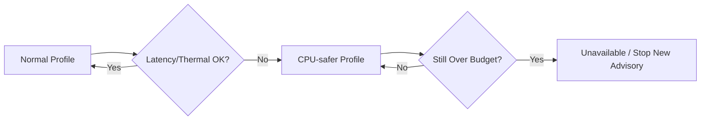

# Edge Deployment and Benchmarks

> **Vai trò file này:** hướng dẫn tối ưu tài nguyên và benchmark latency/FPS khi chạy TSR trên CPU yếu hoặc edge ECU như Jetson Nano.
>
> **Nguồn yêu cầu:** [2.01. Automotive Standards](../2.knowledge_base/01.automotive_standards.md), [2.03. Safety Analysis HAZOP and FTA](../2.knowledge_base/03.safety_analysis_hazop_fta.md).

## 1. Mục Tiêu Edge

Một demo chạy được trên laptop chưa chứng minh hệ thống phù hợp với ECU biên. Edge deployment phải ưu tiên latency ổn định, freshness của frame và hành vi degraded khi phần cứng quá tải.

Mục tiêu kỹ thuật:

- giữ inference latency trong budget đã đặt;
- tránh queue tích tụ làm output bị trễ;
- giảm tải khi input là video 4K hoặc CPU yếu;
- phát hiện thermal throttling;
- log FPS/latency để phục vụ benchmark.

## 2. Cấu Hình Runtime Quan Trọng

| Tham số | Vai trò | Trade-off |
|---|---|---|
| `--imgsz` | Kích thước ảnh inference YOLO. | Nhỏ hơn thì nhanh hơn nhưng có thể miss biển nhỏ. |
| `--max-width` | Giới hạn chiều rộng frame preprocess. | Giảm tải CPU/GPU và memory bandwidth. |
| `--skip` | Bỏ qua frame giữa các lần inference. | Giảm compute nhưng tăng nguy cơ cảnh báo muộn. |
| `--hold` | Giữ detection cũ ngắn hạn. | Giảm flicker overlay nhưng không thay tracking thật. |
| `--traditional` | Bật nhánh CV heuristic. | Tăng khả năng đối chiếu nhưng tốn thêm CPU và có false alarm. |
| `--no-display` | Tắt GUI. | Phù hợp headless/WSL/edge, giảm lỗi hiển thị. |

Profile gợi ý:

| Môi trường | Cấu hình |
|---|---|
| Laptop/lab 720p | `--imgsz 640 --max-width 1280 --skip 0` |
| CPU yếu hoặc video 4K | `--imgsz 512 --max-width 1280 --skip 1` |
| Degraded mode nặng | `--imgsz 512 --max-width 1280 --skip 2` |
| Headless edge | Thêm `--no-display` và ghi output/log. |

## 3. Jetson Nano Và Edge ECU

Jetson Nano hoặc ECU biên có giới hạn rõ về CPU, GPU memory, bandwidth và nhiệt. Với TSR, nguy cơ không chỉ là FPS thấp mà là warning đến muộn.

Khuyến nghị:

- ưu tiên input đã resize hoặc giới hạn `max_width`;
- tránh chạy GUI trên edge profile;
- không bật nhánh heuristic nếu CPU đã bão hòa;
- đo latency theo percentile, không chỉ FPS trung bình;
- kiểm tra nhiệt và clock trước/sau mỗi run;
- dùng video dài để bắt throttling sau vài phút.

## 4. CPU-safer Degraded Mode

Khi runtime phát hiện latency hoặc nhiệt vượt ngưỡng, hệ thống nên chuyển profile:



Ví dụ logic:

| Điều kiện | Hành vi |
|---|---|
| FPS giảm nhưng freshness còn đạt | Giảm `imgsz` hoặc tăng `skip` nhẹ. |
| Latency vượt budget liên tục | Vào degraded, không publish sign mới nếu dữ liệu stale. |
| Nhiệt vượt ngưỡng | Giảm tải hoặc tạm unavailable để bảo vệ phần cứng. |
| OOM/crash lặp lại | Restart có kiểm soát và ghi fault reason. |

## 4.1 Thermal Monitor Bằng sysfs

Trên Linux/Jetson, thermal state có thể đọc định kỳ từ sysfs, ví dụ `/sys/devices/virtual/thermal/thermal_zone*/temp`. Giá trị thường ở đơn vị milli-degree Celsius.

Pseudo-flow:

```text
read thermal_zone temp
if max_temp_c >= 80:
    enter CPU-safer mode
    increase skip up to 2
    reduce imgsz to 512
    disable optional Traditional CV
if max_temp_c remains high:
    mark TSR unavailable and stop new advisory
```

Ngưỡng `80°C` là target bảo vệ thiết kế cho benchmark; khi đưa lên phần cứng thật phải hiệu chỉnh theo datasheet ECU/NPU và policy thermal của platform.

## 4.2 Memory Và PyTorch Cache

Rủi ro OOM không chỉ đến từ model lớn. Nó có thể đến từ queue không giới hạn, video writer bị nghẽn hoặc tensor/cache không được giải phóng sau nhiều run.

Khuyến nghị implementation:

- giới hạn kích thước frame queue và detection queue;
- drop frame cũ khi writer/inference chậm;
- tránh giữ tensor GPU qua nhiều frame nếu không cần;
- nếu dùng CUDA, gọi `torch.cuda.empty_cache()` theo chu kỳ benchmark hoặc sau khi đổi profile;
- ghi memory peak và số lần drop frame vào log.

## 5. Benchmark Protocol

Benchmark tối thiểu nên ghi:

- video source, resolution, FPS, số frame;
- model weights và runtime backend;
- CPU/GPU/NPU, RAM, nhiệt độ;
- `imgsz`, `max_width`, `skip`, `traditional`, `no_display`;
- FPS trung bình, p50/p95/p99 latency;
- số detection, số frame miss, số cảnh báo;
- memory peak và crash/OOM nếu có;
- output video và JSONL nếu đã có logger.

## 6. KPI Cho Edge

| KPI | Mục đích |
|---|---|
| `latency_p95_ms` | Xác định cảnh báo có đến kịp không. |
| `frame_freshness_ms` | Tránh publish dữ liệu cũ. |
| `fps_effective` | Đo throughput sau skip/drop. |
| `thermal_state` | Phát hiện throttling. |
| `memory_peak_mb` | Bắt OOM/leak. |
| `miss_after_degraded` | Biết degraded profile ảnh hưởng recall thế nào. |

## 7. Acceptance Criteria

- Có ít nhất một profile chạy được trên CPU yếu hoặc edge headless.
- Benchmark báo percentile latency, không chỉ FPS trung bình.
- Degraded mode giảm tải thay vì để queue tích tụ.
- Nếu dữ liệu quá cũ, hệ thống không publish advisory mới.
- Kết quả benchmark liên kết được với cấu hình CLI và input video.

---

<!-- consolidated-from: research/3.implementation/04.production_lite_demo_notebook.md -->

## Phụ Lục Hợp Nhất Từ `research/3.implementation/04.production_lite_demo_notebook.md`

> Phần này được gộp từ `research/3.implementation/04.production_lite_demo_notebook.md` để giữ lại nội dung và traceability sau khi rút gọn cấu trúc Markdown.

## Production-Lite Demo Notebook

> **Vai trò file này:** hướng dẫn chạy demo nhanh bằng `run_demo.sh` và liên hệ với notebook production-lite trong `research/3.implementation/notebooks/`.
>
> **Nguồn yêu cầu:** tuyến implementation từ pipeline, state manager và edge benchmark.

### 1. Mục Tiêu

Production-lite demo có hai vai trò:

- chứng minh pipeline inference chạy được trên video thực tế;
- mô phỏng các lớp nâng cấp như quality gate, temporal confirmation, warning level, KPI replay và đánh giá mAP/FPS trong notebook.

Trong repo hiện tại, cần phân biệt hai artifact:

| Artifact | Vai trò |
|---|---|
| `run_demo.sh` + `code/tsr_demo.py` | Chạy nhanh baseline overlay trên video/webcam local. |
| `notebooks/01.tsr_colab_production_lite_demo.ipynb` | Mô phỏng production-lite với state/log/KPI phong phú hơn. |

### 2. Chạy Baseline Demo

Từ repo root:

```bash
chmod +x run_demo.sh
./run_demo.sh videos/input.mp4 videos/output.mp4
```

Script sẽ:

1. tạo `.venv` nếu chưa có;
2. cài PyTorch CPU và dependency;
3. tải `models/best.pt` nếu thiếu;
4. chạy `tsr_demo.py` ở headless mode;
5. ghi video output vào `videos/`.

### 3. Chạy Trực Tiếp `tsr_demo.py`

Headless:

```bash
.venv/bin/python code/tsr_demo.py \
  --no-display \
  --source videos/input.mp4 \
  --output videos/output.mp4
```

Hybrid mode:

```bash
.venv/bin/python code/tsr_demo.py \
  --no-display \
  --source videos/input.mp4 \
  --output videos/output_hybrid.mp4 \
  --traditional
```

CPU-safer:

```bash
.venv/bin/python code/tsr_demo.py \
  --no-display \
  --source videos/input_4k.mp4 \
  --output videos/output_4k.mp4 \
  --imgsz 512 \
  --max-width 1280 \
  --skip 1
```

### 4. Colab Production-Lite Notebook

Notebook chính:

- [3.NB01. tsr_colab_production_lite_demo.ipynb](notebooks/01.tsr_colab_production_lite_demo.ipynb)

Trong Colab, video road-test có thể đặt trên Google Drive rồi mount vào notebook để giữ repo nhẹ. Notebook nên ghi rõ `drive_path`, `video_id` hoặc đường dẫn file Drive đã dùng cho từng run để kết quả mAP/FPS có thể tái lập.

Notebook này dùng để mô phỏng các phần mà runtime baseline chưa có đầy đủ:

- quality gate cho frame xấu;
- ODD gate;
- IoU tracking và hit/miss confirmation;
- primary track và warning level;
- JSONL event log;
- KPI replay;
- optional ground-truth evaluation.

### 5. Mô Phỏng Thời Tiết

Các thử nghiệm nên cover:

| Điều kiện | Mục tiêu quan sát |
|---|---|
| Mưa/mờ | Detector miss hay confidence giảm thế nào. |
| Sương/low contrast | Quality gate có phát hiện được không. |
| Glare/over-exposure | Sign có bị suppress đúng không. |
| Video 4K | Latency và degraded profile có ổn định không. |
| Biển nhỏ/xa | Recall theo size bin và frame distance. |

### 5.1 Bộ Lọc Mô Phỏng Bằng OpenCV

Notebook production-lite nên có các hàm augmentation nhẹ để kiểm tra sensitivity của detector và State Manager:

| Hiệu ứng | Cách mô phỏng | KPI cần quan sát |
|---|---|---|
| Rain overlay | Vẽ streak line ngẫu nhiên, blur nhẹ và giảm contrast. | Miss rate, quality reason `rain_blur`, confirmation latency. |
| Fog overlay | Trộn frame với lớp trắng/xám alpha, giảm local contrast. | CTA/CNR proxy, degraded ratio, recall speed sign. |
| Gaussian glare | Thêm blob sáng hoặc gradient radial ở vùng upper frame. | Saturation ratio, false negative do over-exposure. |
| Night noise | Giảm brightness, thêm Gaussian noise. | Noise proxy, confidence stability. |

Các filter này chỉ là mô phỏng để stress test. Kết luận release vẫn cần video road test thật và nếu có thể là dữ liệu lab theo IEEE 2020.

### 6. Đánh Giá mAP Và FPS

Nếu có ground truth, notebook nên tính:

- precision/recall;
- mAP theo class hoặc nhóm biển;
- recall cho biển tốc độ;
- false positive theo cảnh nền;
- FPS và latency theo profile.

Nếu chưa có ground truth, cần ghi rõ đó là qualitative demo hoặc KPI proxy, không gọi là benchmark accuracy chính thức.

### 7. Artifact Cần Lưu

| Artifact | Mục đích |
|---|---|
| Output video | Bằng chứng trực quan cho demo. |
| JSONL events | Replay và root-cause analysis. |
| Config run | Tái lập kết quả. |
| KPI summary | So sánh giữa các profile. |
| Failure clips | Tập trung cải thiện mưa, glare, miss và false positive. |

### 8. Acceptance Criteria

- Demo baseline chạy được bằng `run_demo.sh`.
- Notebook mô phỏng được ít nhất quality gate, temporal confirmation và KPI replay.
- Kết quả mAP/FPS được gắn với input video, model và config.
- Các kết quả chưa có ground truth phải được ghi nhãn là qualitative/proxy.
- Artifact lưu đủ để người khác tái hiện hoặc debug.


---

<!-- consolidated-from: research/3.implementation/05.colab_production_lite_demo.md -->

## Phụ Lục Hợp Nhất Từ `research/3.implementation/05.colab_production_lite_demo.md`

> Phần này được gộp từ `research/3.implementation/05.colab_production_lite_demo.md` để giữ lại nội dung và traceability sau khi rút gọn cấu trúc Markdown.

## Colab Production-Lite Demo

> **Folder index:** [3.00. Implementation Index](01.hybrid_pipeline_architecture.md) — Lấy: cấu trúc implementation layer và thứ tự đọc. Dùng ở: điều hướng từ notebook overview sang full reference, audit và benchmark guide.
>
> **Vai trò file này:** entrypoint implementation cho notebook production-lite.
>
> **Detailed reference:** [3.11. Colab Production-Lite Demo Full Reference](03.edge_deployment_and_benchmarks.md) — Lấy: giải thích đầy đủ các block production-lite trong notebook. Dùng ở: mô tả ODD/quality gate, tracking, state lifecycle, HMI warning và replay log.
>
> **Notebook:** [3.NB01. Colab Production-Lite Notebook](notebooks/01.tsr_colab_production_lite_demo.ipynb) — Lấy: artifact chạy được cho video replay, state lifecycle, ODD/quality gate và event log. Dùng ở: evidence implementation cho pipeline production-lite.

---

### Mục tiêu

Notebook `3.NB01` là artifact chạy chính hiện tại của implementation layer. Nó tồn tại để lấp khoảng trống giữa:

- baseline overlay demo trong `tsr_demo.py`,
- và narrative production nói về tracking, lifecycle, quality gate, logging.

Notebook này không dùng một model khác. Nó tái sử dụng cùng checkpoint `models/best.pt`, tức weights `Ultralytics YOLO11s` fine-tuned trên dataset Việt Nam `82` lớp, hoặc tải cùng artifact đó từ Hugging Face nếu local repo không có file.

Lưu ý phạm vi:

- notebook `3.NB01` không import `code/tsr_demo.py`;
- `tsr_demo.py` vẫn là baseline/legacy runtime để đối chiếu;
- các chi tiết công thức nằm ở [3.06. Notebook Analyze](02.state_manager_and_hmi.md), không lặp lại trong file này.

### Notebook mô phỏng được gì

- profile `high / medium / low` theo RAM để chạy full video có kiểm soát,
- image quality gate mức demo,
- ODD gate mức proxy,
- tracking/temporal confirmation lite,
- sign lifecycle với `track_id`, `hit_count`, `miss_count`,
- warning level và HMI policy đơn giản,
- `events.jsonl`.

Notebook hiện cũng có:

- preview frames + annotated video để review ngay trong notebook,
- KPI proxy đọc từ `events.jsonl`,
- optional ground-truth evaluation ở `IoU=0.5` nếu người dùng cung cấp file annotation JSON.

### Video/FPS/skip hiện tại

> **Nguồn tại mục:** [3.NB01. Colab Production-Lite Notebook](notebooks/01.tsr_colab_production_lite_demo.ipynb) — Lấy: danh sách video candidate, profile `high / medium / low`, tham số `skip` và công thức `run_inference`. Dùng ở: xác định notebook production-lite đang lên lịch inference như thế nào.
>
> **Nguồn tại mục:** [3.NB02. Research Workflow Notebook](notebooks/02.tsr_research_workflow.ipynb) — Lấy: metadata replay đã in ra cho video `14212806_3840_2160_60fps.mp4`. Dùng ở: kiểm chứng FPS/resolution/frame count trong research workflow.
>
> **Nguồn tại mục:** [code/tsr_demo.py](../../code/tsr_demo.py) — Lấy: default `--skip 0`, đọc `CAP_PROP_FPS` và lịch `frame_idx % (skip + 1) == 1`. Dùng ở: đối chiếu baseline/legacy runtime với notebook.

Video replay hiện có trong repo là `videos/14212806_3840_2160_60fps.mp4`: OpenCV đọc được `3840x2160`, `1187` frame, `59.94 fps`.

Trong notebook `3.NB01`, profile `high` và `medium` đều dùng `skip = 0`, còn profile `low` dùng `skip = 1`. Vì vậy ở profile thường dùng được khi RAM đủ (`>= 8 GB`), notebook lên lịch inference cho mọi frame nếu quality gate không chặn; chỉ profile `low` mới chạy cách frame. Trong notebook `3.NB02`, biến demo `SKIP = 0`, tức cũng không bỏ frame.

### Notebook chưa thay thế được gì

- target ECU timing,
- diagnostics stack thật,
- lane association thật,
- vehicle applicability filter theo ego vehicle; hiện `No Cars`, `No Trucks`, `No Bus` chưa được lọc riêng,
- map fusion thật, dù đã có `map_speed_limit_kph` stub/policy,
- compliance evidence.

### Vai trò trong IA mới

Đây là `implementation artifact`, không phải narrative chính và cũng không phải production source-of-truth. Giá trị của nó là làm cầu nối giữa:

- baseline runtime trong `tsr_demo.py`, vốn vẫn là overlay demo,
- và các khối production-lite như quality gate, track lifecycle, warning policy, event log và KPI replay.

Khi cần biết notebook thật sự đã code gì và chưa code gì, đọc [3.07. Notebook Technique Audit](02.state_manager_and_hmi.md). Khi cần mô tả chi tiết để đưa vào báo cáo, đọc [3.11. Colab Production-Lite Demo Full](03.edge_deployment_and_benchmarks.md).


---

<!-- consolidated-from: research/3.implementation/08.experiment_benchmark_guide.md -->

## Phụ Lục Hợp Nhất Từ `research/3.implementation/08.experiment_benchmark_guide.md`

> Phần này được gộp từ `research/3.implementation/08.experiment_benchmark_guide.md` để giữ lại nội dung và traceability sau khi rút gọn cấu trúc Markdown.

## Experiment and Benchmark Guide

> **Folder index:** [3.00. Implementation Index](01.hybrid_pipeline_architecture.md) — Lấy: cấu trúc implementation layer và thứ tự đọc. Dùng ở: đặt benchmark guide cạnh baseline analysis và notebook evidence.
>
> **Vai trò file này:** quy tắc thao tác kỹ thuật tối thiểu để benchmark và so sánh các thay đổi trong repo `adas-tsr`.

---

### Vì sao cần guide riêng

Nếu mỗi lần chạy demo lại dùng:

- video khác,
- tham số khác,
- không có log machine-readable,

thì gần như không thể làm regression hay kết luận một thay đổi là tốt hơn hay tệ hơn.

### Quy tắc benchmark tối thiểu

1. Khóa 2–3 clip replay đại diện.
2. Khóa cấu hình `imgsz`, `max_width`, `skip`, `conf`.
3. Ghi rõ model weights đang dùng, model family, và provenance upstream.
4. Lưu runtime summary theo cùng format.
5. Ưu tiên machine-readable output thay vì chỉ lưu video overlay.

### Protocol hiện tại trong repo

> **Nguồn tại mục:** [3.NB01. Colab Production-Lite Notebook](notebooks/01.tsr_colab_production_lite_demo.ipynb) — Lấy: video candidate, profile `high / medium / low`, `skip`, `conf`, `imgsz`, `max_width` và `events.jsonl`. Dùng ở: định nghĩa protocol notebook gần nhất với production-lite replay.
>
> **Nguồn tại mục:** [3.NB02. Research Workflow Notebook](notebooks/02.tsr_research_workflow.ipynb) — Lấy: metadata video `14212806_3840_2160_60fps.mp4` đã in ra trong research workflow. Dùng ở: kiểm chứng FPS/frame count khi so sánh kết quả.

Clip replay hiện có trong repo là `videos/14212806_3840_2160_60fps.mp4`: `3840x2160`, `1187` frame, `59.94 fps`.

Cấu hình notebook `3.NB01` cần ghi rõ khi benchmark:

| Profile | Điều kiện RAM | `imgsz` | `max_width` | `skip` | `conf` |
|---|---:|---:|---:|---:|---:|
| `high` | `>= 12 GB` | `640` | `1600` | `0` | `0.15` |
| `medium` | `>= 8 GB` | `640` | `1280` | `0` | `0.15` |
| `low` | `< 8 GB` | `512` | `960` | `1` | `0.15` |

Với video `59.94 fps`, `skip = 0` nghĩa là model được lên lịch chạy ở mọi frame video; `skip = 1` nghĩa là chỉ chạy ở các frame `1, 3, 5, ...`. Khi báo cáo benchmark, cần tách `video FPS`, `scheduled inference rate` và `measured processing FPS`.

### Artifact nên có theo thứ tự ưu tiên

| Ưu tiên | Artifact | Giá trị |
|---|---|---|
| P0 | `JSONL` frame/detection log | replay, RCA, diff giữa versions |
| P0 | temporal confirmation lite | đo confirm latency, stale behavior |
| P1 | quality score + reason code | explainability cho degraded behavior |
| P1 | KPI script | precision proxy, latency p95, flicker proxy |
| P2 | ONNX/OpenVINO benchmark | edge parity |
| P2 | scenario tags | regression có ngữ cảnh |

Ghi chú hiện trạng:

- notebook production-lite đã có bản demo cho `events.jsonl`, temporal confirmation lite, quality score và KPI proxy;
- nhưng benchmark guide này vẫn cần thiết vì các artifact đó chưa được khóa thành protocol chuẩn giữa notebook `3.NB01`, baseline legacy `tsr_demo.py` và các phiên bản sau.
- notebook `3.NB01` hiện là nơi gần nhất với schema replay; trước khi claim regression hoặc improvement, cần cố định schema `events.jsonl`, tập clip và tham số chạy.

### Benchmark questions nên luôn giữ

- Model có nhìn thấy sign sớm hơn hay muộn hơn?
- Runtime có đổi theo hướng tốt hơn ở cùng protocol không?
- Flicker/stale behavior có tốt hơn không?
- Có thêm false positive hoặc mất sign nhỏ không?


---

<!-- consolidated-from: research/3.implementation/11.colab_production_lite_demo_full.md -->

## Phụ Lục Hợp Nhất Từ `research/3.implementation/11.colab_production_lite_demo_full.md`

> Phần này được gộp từ `research/3.implementation/11.colab_production_lite_demo_full.md` để giữ lại nội dung và traceability sau khi rút gọn cấu trúc Markdown.

## (4) Notebook Demo Google Colab cho TSR — Production-Lite Replay

> **Folder index:** [3.00. Implementation Index](01.hybrid_pipeline_architecture.md) — Lấy: cấu trúc implementation layer và thứ tự đọc. Dùng ở: đặt notebook full reference trong luồng baseline → production-lite → benchmark/audit.
>
> **File này trả lời:** notebook Colab đã mô phỏng được những block nào của production-lite TSR và chưa mô phỏng được gì.
>
> **Ngoài phạm vi:** kể lại đầy đủ production architecture hoặc detector theory; các phần đó nằm ở Knowledge Base và narrative chính.
>
> **Notebook đi kèm:** [3.NB01. Colab Production-Lite Notebook](notebooks/01.tsr_colab_production_lite_demo.ipynb) — Lấy: artifact chạy được cho pipeline production-lite và replay event log. Dùng ở: kiểm chứng các claim về quality gate, ODD gate, tracking, state lifecycle và warning policy.
>
> **Phạm vi repo:** `adas-tsr`

---

### 1. Mục tiêu của notebook này

Notebook này được tạo để giải quyết một khoảng trống giữa:

- baseline inference demo trong [code/tsr_demo.py](../../code/tsr_demo.py), vốn chủ yếu cho overlay video;
- và phần nghiên cứu production trong [2.04. Unified Production Reference](../2.knowledge_base/01.automotive_standards.md), vốn mô tả nhiều block kiến trúc nhưng chưa có một artefact Colab-ready để demo hành vi.

Mục tiêu của notebook không phải thay thế production stack, mà là tạo ra một **production-lite demo** có thể chạy trên Google Colab với setup đủ rõ ràng để:

- nạp cùng checkpoint `best.pt` của baseline repo, tức weights `Ultralytics YOLO11s` fine-tuned trên dataset Việt Nam `82` lớp;
- chạy detector trên toàn bộ video đầu vào;
- mô phỏng `Image Quality Gate`, `ODD gate`, `tracking + temporal confirmation`, `sign lifecycle`, `warning level`, `HMI policy`, và `JSONL event log`;
- xuất video annotated + preview frames đủ để review stateful behavior thay vì chỉ xem bbox theo frame;
- và tính KPI proxy / optional GT evaluation ngay trong notebook sau khi replay xong.

---

### 2. Notebook này kế thừa gì từ các tài liệu khác?

Notebook này là **artefact demo**, không phải tài liệu gốc cho các khái niệm hệ thống. Nó chỉ lấy những phần tối thiểu từ các file khác để biến thành replay stateful trên Colab.

| Nguồn | Notebook kế thừa gì |
|---|---|
| [2.04. Unified Production Reference](../2.knowledge_base/01.automotive_standards.md) | `ODD phase-1`, `DEGRADED/UNAVAILABLE`, detector != feature, sign lifecycle, HMI policy, context suppression |
| [3.12. Baseline Repo Analysis Full](01.hybrid_pipeline_architecture.md) | Gap repo hiện tại: overlay-only, `hold` ≠ tracking, thiếu quality gate, thiếu output machine-readable |
| [3.10. Detector Architecture Deep Reference](01.hybrid_pipeline_architecture.md) | Chấp nhận giới hạn của baseline `Ultralytics YOLO11s` về small-object, latency và long-tail; notebook không cố thay detector |

Nếu muốn hiểu *vì sao* các block đó tồn tại, quay lại file nguồn tương ứng. File này chỉ trả lời *notebook đã mô phỏng được gì*.

#### 2.1 Legend màu Mermaid

> Legend này áp dụng cho các sơ đồ Mermaid đã được tô màu trong tài liệu notebook production-lite.

| Màu | Vai trò | Ý nghĩa |
|---|---|---|
| <span style="display:inline-block;width:14px;height:14px;border:1px solid #C78600;background:#FFF5DD;"></span> | `baseline` | Baseline tham chiếu hoặc nhánh gốc khi có dùng |
| <span style="display:inline-block;width:14px;height:14px;border:1px solid #2F66D0;background:#EDF3FF;"></span> | `feature` | Detector hoặc khối xử lý chính của pipeline |
| <span style="display:inline-block;width:14px;height:14px;border:1px solid #7C3AED;background:#F4ECFF;"></span> | `temporal` | Tracking, lifecycle, temporal confirmation, hoặc state flow |
| <span style="display:inline-block;width:14px;height:14px;border:1px solid #14866D;background:#EAF7F2;"></span> | `source` | Video input hoặc input source ban đầu |
| <span style="display:inline-block;width:14px;height:14px;border:1px solid #1E8E5A;background:#E8F7EE;"></span> | `integration` | Output video, event log, hoặc đầu ra driver-facing / machine-readable |
| <span style="display:inline-block;width:14px;height:14px;border:1px solid #D97706;background:#FFF1E0;"></span> | `decision` | Gate hoặc decision point khi có dùng |
| <span style="display:inline-block;width:14px;height:14px;border:1px solid #DB2777;background:#FCEFF5;"></span> | `support` | RAM profile, quality gate, ODD gate, hoặc utility/support block |

---

### 3. System architecture production-lite trong notebook

```mermaid
flowchart LR
    A[Input Video] --> B[RAM Profile Selection]
    B --> C[Image Quality Gate]
    C --> D[ODD Gate]
    D --> E[YOLO Detector]
    E --> F[Tracking and Temporal Confirmation]
    F --> G[Sign Lifecycle]
    G --> H[Warning Level and HMI Policy]
    H --> I[Annotated Output Video]

    H --> J[events.jsonl]

    classDef source fill:#EAF7F2,stroke:#14866D,color:#0F4C3F,stroke-width:2px;
    classDef support fill:#FCEFF5,stroke:#DB2777,color:#9D174D,stroke-width:2px;
    classDef feature fill:#EDF3FF,stroke:#2F66D0,color:#173B7A,stroke-width:2px;
    classDef temporal fill:#F4ECFF,stroke:#7C3AED,color:#4C1D95,stroke-width:2px;
    classDef integration fill:#E8F7EE,stroke:#1E8E5A,color:#14532D,stroke-width:2px;
    class A source;
    class B,C,D support;
    class E feature;
    class F,G temporal;
    class H,I,J integration;
```



Ý nghĩa của từng block:

| Block | Notebook làm gì |
|---|---|
| RAM Profile Selection | Chọn `imgsz`, `max_width`, `skip` và policy giới hạn frame theo RAM khả dụng |
| Image Quality Gate | Dùng blur, brightness và glare heuristic để gắn `quality reasons` |
| ODD Gate | Kiểm tra ODD phase-1 ở mức demo dựa trên quality và tốc độ ego cấu hình tay |
| YOLO Detector | Dùng cùng checkpoint `best.pt` local hoặc tải đúng artifact đó từ Hugging Face |
| Tracking and Temporal Confirmation | Ghép detection theo IoU cùng sign family, tăng `hit_count`, `miss_count` |
| Sign Lifecycle | Quản lý `CANDIDATE`, `CONFIRMED`, `ACTIVE`, `STALE`, `REJECTED`, `EXPIRED` |
| Warning Level and HMI Policy | Gán `Level 0..3`, chọn sign ưu tiên và tránh update quá sớm |
| `events.jsonl` | Log quyết định từng frame để replay và RCA |

Lưu ý quan trọng:

- code path hiện tại **không** có state track riêng tên `SUPPRESSED`;
- việc suppress trong notebook hiện được biểu diễn gián tiếp qua `feature_state`, `warning_level = 0`, `odd_ok / quality reasons` và policy chọn `primary_track`;
- vì vậy khi trình bày notebook, nên mô tả đúng đây là `stateful replay với publish policy`, không nên overclaim là đã có full state machine production.

---

### 4. Những phần production nào đã mô phỏng được?

#### 4.1 Có thể demo được trên Colab

| Nhóm | Có trong notebook | Ghi chú |
|---|---|---|
| Setup runtime | Có | Tự cài package còn thiếu |
| Memory-aware profile | Có | Có check RAM trước khi chạy |
| Detector runtime | Có | Dùng checkpoint `Ultralytics YOLO11s` 82 class |
| Quality gate | Có | Heuristic, không phải model learned |
| ODD gate | Có | Mức demo phase-1, chưa có road type thật |
| Temporal confirmation | Có | Dựa trên `min_confirm_hits` |
| Sign lifecycle | Có | `CANDIDATE/CONFIRMED/ACTIVE/STALE/REJECTED/EXPIRED` |
| Warning level | Có | Bám HMI policy ở mức demo |
| Output video | Có | MP4 annotated |
| Preview frame gallery | Có | Chụp tối đa 4 frame publish để review nhanh |
| Event log | Có | `events.jsonl` theo frame |
| KPI proxy từ replay | Có | Đọc `events.jsonl` để tính ODD proxy, confidence, size bin, threshold sweep, confirmation latency |
| Ground-truth eval optional | Có | Nếu cung cấp JSON annotation thì tính được precision/recall `IoU=0.5` |
| Map fusion stub | Có | `map_speed_limit_kph`, `camera_override`, `map_override` ở mức policy demo |

#### 4.2 Chưa thể coi là production implementation

| Nhóm | Chưa có | Vì sao |
|---|---|---|
| Lane association thật | Chưa có | Không có lane model, calibration, route intent |
| Vehicle applicability filter | Chưa có | Các label như `No Cars`, `No Trucks`, `No Bus` chưa được lọc theo ego vehicle; hiện có thể rơi về `default` và vẫn đi qua tracking/publish-lite |
| Map fusion thật | Chưa có | Chỉ có stub policy, không có HD map hay localization confidence |
| Diagnostics ECU | Chưa có | Không có DTC, DID, watchdog, service interface |
| Timing contract chuẩn ECU | Chưa có | Colab không đại diện cho embedded target |
| Safety/SOTIF evidence | Chưa có | Notebook chỉ là artefact demo, không phải compliance evidence |

---

### 5. Cách chạy trên Google Colab

#### 5.1 Cách dùng tối thiểu

1. Mở notebook [3.NB01. Colab Production-Lite Notebook](notebooks/01.tsr_colab_production_lite_demo.ipynb) trên Colab.
2. Chạy cell setup để cài package.
3. Kiểm tra cell RAM profile để xem notebook đang chọn cấu hình `high`, `medium` hay `low`.
4. Cung cấp input video:
   - ưu tiên một video có biển báo thật;
   - hoặc mount Drive / upload file;
   - nếu không có, notebook sẽ tải một `smoke-test clip` để xác minh pipeline.
5. Chạy cell detector + pipeline.
6. Xem:
   - video output;
   - preview frames;
   - `events.jsonl`.

#### 5.2 Về RAM demo

> **Nguồn tại mục:** [3.NB01. Colab Production-Lite Notebook](notebooks/01.tsr_colab_production_lite_demo.ipynb) — Lấy: `PROFILES`, điều kiện chọn `PROFILE_NAME`, `INPUT_VIDEO`, `CAP_PROP_FPS` và `run_inference`. Dùng ở: mô tả đúng profile/FPS/skip của notebook production-lite.
>
> **Nguồn tại mục:** [3.NB02. Research Workflow Notebook](notebooks/02.tsr_research_workflow.ipynb) — Lấy: log replay `3840x2160 @ 59.94 fps`, `1187 frames` cho video `14212806_3840_2160_60fps.mp4`. Dùng ở: làm evidence nội bộ cho video hiện có trong repo.

Notebook chủ động chọn profile theo RAM:

| Profile | Điều kiện | Cấu hình |
|---|---|---|
| `high` | RAM >= 12 GB | `imgsz=640`, `max_width=1600`, `skip=0`, chạy full video |
| `medium` | RAM >= 8 GB | `imgsz=640`, `max_width=1280`, `skip=0`, chạy full video |
| `low` | RAM < 8 GB | `imgsz=512`, `max_width=960`, `skip=1`, chạy full video |

Video replay hiện có trong repo là `videos/14212806_3840_2160_60fps.mp4`. Metadata đọc bằng OpenCV: `3840x2160`, `1187` frame, `59.94 fps`.

Với video này:

- `skip = 0` nghĩa là notebook có lịch chạy YOLO ở mọi frame, tương đương khoảng `59.94` cơ hội inference trên mỗi giây video nếu quality gate không chặn;
- `skip = 1` nghĩa là chạy ở các frame `1, 3, 5, ...`, tương đương khoảng `29.97` cơ hội inference trên mỗi giây video;
- đây là tần suất **theo timeline video**, không phải FPS xử lý thực tế của máy. FPS xử lý thực tế còn phụ thuộc CPU/GPU, `imgsz`, `max_width`, số detection và quality gate.

Ý nghĩa của cơ chế này:

- giúp notebook ít bị văng RAM khi người dùng chọn runtime nhỏ;
- phù hợp với tinh thần `degraded operation` ở mức demo;
- cho thấy ngay cả notebook cũng nên có resource-aware behavior, không phải chỉ cố chạy bằng mọi giá.

Nếu cần debug nhanh, người dùng mới chủ động đặt `FRAME_LIMIT_OVERRIDE`. Mặc định của notebook là không tự cắt clip.

#### 5.3 Vì sao video dài hơn lại nặng hơn?

Trong bản notebook hiện tại, chi phí tăng chủ yếu theo **số frame cần xử lý**, không phải vì feature state tích lũy vô hạn theo thời gian.

Các thành phần tăng gần tuyến tính theo độ dài video là:

- `preprocess` cho từng frame;
- `YOLO inference` cho từng frame được chọn theo `skip`;
- `tracking + state update`;
- `overlay` và `VideoWriter`;
- ghi `events.jsonl` theo từng frame.

Những phần **không** nên tăng vô hạn trong RAM:

- `events.jsonl` được stream ra file, không giữ toàn bộ log trong bộ nhớ;
- danh sách `tracks` chỉ giữ các sign còn sống và loại bỏ track `REJECTED` hoặc `EXPIRED`;
- state của mỗi sign chỉ giữ phần tối thiểu cần cho lifecycle hiện tại.

Nói cách khác, video càng dài thì runtime càng lâu là bình thường; nhưng nếu implementation tốt thì RAM không nên phình lên tương ứng với toàn bộ thời lượng clip.

---

### 6. Output của notebook và cách đọc

#### 6.1 Video output

Video annotated cho biết:

- bbox hiện tại;
- `track_id`;
- `state`;
- `warning_level`;
- quality status;
- feature state (`AVAILABLE`, `DEGRADED`, `UNAVAILABLE`).

Ngoài MP4 annotated, notebook còn:

- lưu tối đa 4 `preview frames` khi có sign được publish;
- in ra một `summary` cuối run gồm `frames_processed`, `profile`, `published_counter`, `state_counter`, `quality_reason_counter` và `family_counter`.

#### 6.2 `events.jsonl`

Mỗi dòng log một frame event, gồm:

- danh sách detections;
- danh sách track đang sống;
- quality reasons;
- trạng thái ODD;
- primary track được chọn để publish;
- runtime metadata.

Các field đáng chú ý để review nhanh:

- `feature_state`;
- `odd_ok` và `odd_reasons`;
- `tracks[].track_id`, `state`, `hit_count`, `miss_count`, `warning_level`, `source`;
- `primary_track_id`, `primary_warning_level`, `primary_label`;
- `runtime.run_inference` và `runtime.fps_smooth`.

Đây là artifact quan trọng nhất của notebook nếu muốn:

- replay một ca lỗi;
- giải thích vì sao sign bị suppress;
- đối chiếu giữa detector output và feature output.

#### 6.3 Warning level

Notebook dùng bốn mức đơn giản:

| Level | Ý nghĩa |
|---|---|
| `0` | Chưa đủ điều kiện publish hoặc quality/ODD không tốt |
| `1` | Sign thường đã đủ điều kiện hiển thị |
| `2` | `Speed Limit` đã confirm |
| `3` | `Stop` hoặc `No Entry` ở mức ưu tiên cao |

Mục đích của mapping này là làm rõ sự khác nhau giữa:

- raw detector output;
- confirmed sign;
- driver-facing output.

#### 6.4 Cell đánh giá model và ODD proxy

Notebook hiện có thêm một cụm cell đánh giá sau khi pipeline chạy xong. Cụm này chia làm hai lớp:

- **Proxy metric không cần ground truth**:
  - `AVAILABLE/DEGRADED/UNAVAILABLE ratio`;
  - `quality reason ratio`;
  - `confidence distribution` theo `family`;
  - phân bố detection theo `size bin`;
  - `threshold sweep` trên output hiện có;
  - `track confirmation latency`.
- **Metric thật khi có ground truth**:
  - `TP/FP/FN`;
  - `precision`, `recall`, `F1` tại `IoU=0.5`;
  - `recall` theo `size bin`;
  - bảng theo `family` hoặc `label`.

Điều này quan trọng vì:

- nếu chưa có annotation thì không nên claim `mAP`, `precision`, `recall` thật;
- nhưng vẫn có thể trả lời những câu hỏi rất thực dụng như:
  - feature publish được trong phần nào của clip;
  - confidence của detector tập trung ở sign family nào;
  - sign nhỏ cỡ nào mới bắt đầu xuất hiện đủ nhiều trong replay;
  - threshold tăng lên sẽ làm coverage giảm bao nhiêu.

---

### 7. Giới hạn kỹ thuật cần nói rõ khi thuyết trình

Không nên nói notebook này là production TSR. Cách diễn đạt đúng nên là:

> Đây là một production-lite notebook dùng để minh họa cách biến detector frame-level thành feature có state, quality gate, warning policy và event log trên Google Colab.

Các giới hạn chính:

- `quality gate` là heuristic, không phải learned quality model;
- `tracking` là IoU-based association đơn giản, chưa phải SORT/Deep SORT đầy đủ;
- `ODD gate` mới kiểm tra một phần điều kiện phase-1;
- chưa có applicability filter theo loại xe, nên không được claim đã biết `No Cars` áp dụng còn `No Trucks`/`No Bus` không áp dụng;
- `map fusion` mới là stub;
- không có lane-level reasoning thật;
- không có HMI, diagnostics hay ECU contract thật.

---

### 8. Khuyến nghị bước tiếp theo

Nếu tiếp tục phát triển notebook này, thứ tự hợp lý là:

1. thêm cell benchmark `imgsz/max_width/skip` theo nhiều profile và nhiều clip;
2. mở rộng KPI hiện có sang false advisory proxy, publish latency p95/p99 và track survival statistics;
3. thêm `ONNX/OpenVINO export` path nếu muốn minh họa edge deployment;
4. làm rõ hơn `map_speed_limit_kph` scenario cell để demo `camera_override` và `map_override`;
5. thêm bộ clip có gắn scenario tags theo ODD để notebook có giá trị đánh giá tốt hơn, không chỉ demo.


---

<!-- consolidated-from: research/3.implementation/14.dataset_and_benchmark_guide.md -->

## Phụ Lục Hợp Nhất Từ `research/3.implementation/14.dataset_and_benchmark_guide.md`

> Phần này được gộp từ `research/3.implementation/14.dataset_and_benchmark_guide.md` để giữ lại nội dung và traceability sau khi rút gọn cấu trúc Markdown.

## Dataset and Benchmark Guide for TSR

> **[SRC] Narrative entrypoint:** [1.01. Prototype to Production Narrative](../1.narrative/01.prototype_to_production.md) — Lấy: bối cảnh dataset/benchmark không chỉ phục vụ mAP mà còn release confidence. Dùng ở: mở bài và phần source-of-truth benchmark.
>
> **[SRC] Bài đọc sâu hơn:**
>
> - [3.10. Detector Architecture Deep Reference](01.hybrid_pipeline_architecture.md) — Lấy: metric/trade-off detector ảnh hưởng benchmark. Dùng ở: phần chọn dataset theo small object, NMS và edge latency.
> - [2.06. Sources and Provenance](../2.knowledge_base/01.automotive_standards.md) — Lấy: danh mục nguồn dataset/model và quy ước evidence. Dùng ở: source-of-truth khi mô tả baseline dataset.
>
> **Nguồn chính:**
>
> - [GTSRB](http://benchmark.ini.rub.de/gtsrb_dataset.html) — Lấy: benchmark classification sign crop. Dùng ở: phân biệt detection dataset với classifier/OCR fallback.
> - [GTSDB](https://benchmark.ini.rub.de/gtsdb_dataset.html) — Lấy: detection benchmark có bounding box. Dùng ở: phần dataset cần cho detector localization.
> - [TT100K](https://cg.cs.tsinghua.edu.cn/traffic-sign/) — Lấy: dataset traffic sign nhiều class/scene. Dùng ở: ví dụ benchmark đa dạng hơn GTSRB/GTSDB.
> - [Mapillary Traffic Sign Dataset](https://arxiv.org/abs/1909.04422) — Lấy: street-level detection dataset đa dạng. Dùng ở: luận điểm cần benchmark theo environment/ODD slice.
> - [Traffic-sign-detection-VietNam](https://huggingface.co/datasets/star092304/Traffic-sign-detection-VietNam) — Lấy: dataset Việt Nam của baseline. Dùng ở: source-of-truth cho claim model hiện tại phù hợp biển Việt Nam.
> - [Ultralytics YOLO11](https://docs.ultralytics.com/models/yolo11/) — Lấy: training/inference/benchmark workflow YOLO. Dùng ở: đề xuất benchmark protocol cho detector baseline.

---

### Purpose

> **Nguồn tại mục:** [3.10. Detector Architecture Deep Reference](01.hybrid_pipeline_architecture.md) `[SRC]` — Lấy: vai trò dataset/benchmark trong detector choice, small object và deployment. Dùng ở: phạm vi “dataset và benchmark framing”.

Bài này tóm tắt các dataset và benchmark framing quan trọng cho TSR research.

### Why It Matters for TSR

> **Nguồn tại mục:** [GTSRB](http://benchmark.ini.rub.de/gtsrb_dataset.html) và [GTSDB](https://benchmark.ini.rub.de/gtsdb_dataset.html) — Lấy: GTSRB là classification crop, GTSDB là detection full image. Dùng ở: cảnh báo không dùng GTSRB như full-scene detection dataset.
>
> **Nguồn tại mục:** [Mapillary Traffic Sign Dataset](https://arxiv.org/abs/1909.04422) — Lấy: benchmark traffic sign có domain/country/class diversity. Dùng ở: cảnh báo so sánh benchmark khác protocol/domain.
>
> **Nguồn tại mục:** [Traffic-sign-detection-VietNam](https://huggingface.co/datasets/star092304/Traffic-sign-detection-VietNam) — Lấy: dataset baseline có long-tail class distribution. Dùng ở: cảnh báo đánh giá sai long-tail risk.

Nếu không tách rõ dataset phục vụ mục đích gì, người đọc dễ:

- dùng GTSRB như thể đó là full-scene detection dataset,
- so sánh benchmark giữa các paper/prototype không cùng protocol,
- đánh giá sai long-tail risk.

### Common Datasets

> **Nguồn tại mục:** [GTSRB](http://benchmark.ini.rub.de/gtsrb_dataset.html), [GTSDB](https://benchmark.ini.rub.de/gtsdb_dataset.html), [TT100K](https://cg.cs.tsinghua.edu.cn/traffic-sign/), [Mapillary Traffic Sign Dataset](https://arxiv.org/abs/1909.04422), [Traffic-sign-detection-VietNam](https://huggingface.co/datasets/star092304/Traffic-sign-detection-VietNam) — Lấy: loại bài toán, scale và domain của từng dataset. Dùng ở: bảng vai trò đúng của dataset.

| Dataset | Vai trò đúng |
|---|---|
| `GTSRB` | Classification benchmark trên crop biển báo |
| `GTSDB` | Detection benchmark cổ điển |
| `TT100K` | Detection/classification benchmark lớn, nhiều biển nhỏ |
| `Mapillary Traffic Sign` | Diversity tốt ở nhiều quốc gia/điều kiện |
| `Traffic-sign-detection-VietNam` | Gần nhất với baseline repo hiện tại |

### Relation to Current Prototype

> **Nguồn tại mục:** [3.09. Baseline Repo Analysis](01.hybrid_pipeline_architecture.md) `[SRC]` — Lấy: baseline dùng `models/best.pt`, YOLO11s và runtime hiện tại. Dùng ở: mô tả dependency của prototype.
>
> **Nguồn tại mục:** [Traffic-sign-detection-VietNam](https://huggingface.co/datasets/star092304/Traffic-sign-detection-VietNam) — Lấy: số ảnh, instance, taxonomy 82 lớp và long-tail. Dùng ở: source-of-truth dataset upstream.
>
> **Nguồn tại mục:** [Ultralytics YOLO11](https://docs.ultralytics.com/models/yolo11/) — Lấy: YOLO11 model/training/inference framing. Dùng ở: claim `best.pt` là detector one-stage, không phải classifier crop-only.

Prototype repo hiện phụ thuộc nhiều vào:

- checkpoint `models/best.pt` thuộc họ `Ultralytics YOLO11s`,
- upstream model `star092304/traffic-sign-detection-vietnam-yolo`,
- upstream dataset `Traffic-sign-detection-VietNam`,
- dataset Vietnam upstream,
- một số video local để replay.

Source-of-truth tối thiểu cần giữ thống nhất khi mô tả baseline hiện tại:

- `best.pt` là detector one-stage `YOLO11s`, không phải classifier crop-only.
- Base pretrained upstream là `yolo11s.pt`.
- Input train/infer mặc định của upstream model card là `640x640`.
- Taxonomy train hiện tại là `82` lớp biển báo Việt Nam.
- Dataset upstream có `10,157` ảnh và khoảng `19,748` instance, với long-tail đáng kể ở `16/82` lớp dưới `100` instance.

Điều này tạo ra ba câu hỏi chính:

- class nào đang long-tail,
- benchmark local có đại diện cho ODD mong muốn không,
- metric nào cần thêm để không chỉ nhìn model card.

### First Practical Benchmark Rules

> **Nguồn tại mục:** [3.08. Experiment and Benchmark Guide](03.edge_deployment_and_benchmarks.md) `[SRC]` — Lấy: protocol benchmark cần khóa clip, tham số và logging. Dùng ở: các rule thực dụng đầu tiên.
>
> **Nguồn tại mục:** [3.10. Detector Architecture Deep Reference](01.hybrid_pipeline_architecture.md) `[SRC]` — Lấy: cần tách frame-level metric, feature-level behavior, size-bin và scenario tags. Dùng ở: rule metric/logging.

- khóa 2–3 clip replay đại diện,
- không thay tham số tùy hứng giữa các lần chạy,
- tách frame-level metric khỏi feature-level behavior,
- log size-bin và scenario tags nếu có thể.

### Recommended Reading Path

- Bài đọc sâu hơn: [3.10. Detector Architecture Deep Reference](01.hybrid_pipeline_architecture.md) `[SRC]`
- [3.09. Baseline Repo Analysis](01.hybrid_pipeline_architecture.md) `[SRC]`
- [3.08. Experiment and Benchmark Guide](03.edge_deployment_and_benchmarks.md) `[SRC]`
