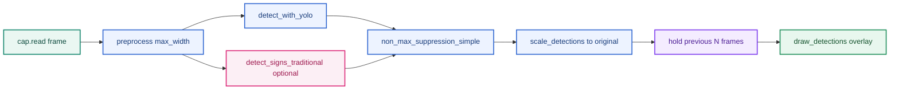

# (2) Phân Tích Baseline TSR — Gắn Trực Tiếp `tsr_demo.py` và Model `best.pt`

> **Thứ tự đọc:** đọc sau narrative chính và trước benchmark deep dive nếu cần.  
> **File này trả lời:** baseline repo hiện tại làm được gì, thiếu gì, và gap đó biểu hiện ra sao trên runtime thực tế.  
> **Ngoài phạm vi:** giải thích đầy đủ production framework, V-model, safety/SOTIF hay kiến trúc tổng thể; phần đó nằm ở [Unified Production Reference](../2.knowledge_base/12.unified_production_reference.md).

## 1. Metadata

| Thuộc tính | Giá trị |
|---|---|
| Code tham chiếu | [`code/tsr_demo.py`](../../code/tsr_demo.py) |
| Weights | `models/best.pt` |
| Model upstream | [star092304/traffic-sign-detection-vietnam-yolo](https://huggingface.co/star092304/traffic-sign-detection-vietnam-yolo) |
| Dataset upstream | [Traffic-sign-detection-VietNam](https://huggingface.co/datasets/star092304/Traffic-sign-detection-VietNam) |
| Liên kết kiến trúc detector | [Detector Architecture Deep Reference](../2.knowledge_base/13.detector_architecture_deep_reference.md) |
| Liên kết hệ thống | [Unified Production Reference](../2.knowledge_base/12.unified_production_reference.md) |
| Liên kết notebook production-lite | [Colab Production-Lite Demo Full](05.colab_production_lite_demo_full.md) |
| Ngày cập nhật | 2026-06-29 |

## 2. Tóm tắt

Tài liệu này là **annex gắn implementation hiện tại**, không phải một báo cáo production thứ hai. Nó trả lời câu hỏi cụ thể cho tech lead và người maintain repo:

- Baseline hiện tại (`tsr_demo.py` + `best.pt`) **bao phủ được gì** và **không bao phủ gì**?
- Model được train trên **bao nhiêu ảnh, bao nhiêu instance, phân bổ class ra sao**?
- **Thiếu kỹ thuật/pipeline nào** trong code hiện tại → **điểm yếu cụ thể nào** trên video/ODD thật?

Mọi nhận định dưới đây map trực tiếp tới hàm, tham số CLI, hoặc artifact trong repo. Khi cần lý do hệ thống-level "vì sao detector chưa phải feature", quay lại [Unified Production Reference](../2.knowledge_base/12.unified_production_reference.md); khi cần theory detector, quay lại [Detector Architecture Deep Reference](../2.knowledge_base/13.detector_architecture_deep_reference.md).

### 2.1 Legend màu Mermaid

> Legend này áp dụng cho các sơ đồ Mermaid đã được tô màu trong tài liệu. Một số sơ đồ chỉ dùng một phần của palette dưới đây.

| Màu | Vai trò | Ý nghĩa |
|---|---|---|
| <span style="display:inline-block;width:14px;height:14px;border:1px solid #C78600;background:#FFF5DD;"></span> | `baseline` | Baseline hiện tại, artifact repo đang có, hoặc điểm tham chiếu ban đầu |
| <span style="display:inline-block;width:14px;height:14px;border:1px solid #2F66D0;background:#EDF3FF;"></span> | `feature` | Khối xử lý chính, metric cốt lõi, hoặc bước phân tích chính |
| <span style="display:inline-block;width:14px;height:14px;border:1px solid #7C3AED;background:#F4ECFF;"></span> | `temporal` | Tracking, lifecycle, logic thời gian, hoặc KPI theo track/state |
| <span style="display:inline-block;width:14px;height:14px;border:1px solid #14866D;background:#EAF7F2;"></span> | `source` | Input log, evidence source, replay input, hoặc dữ liệu đầu vào |
| <span style="display:inline-block;width:14px;height:14px;border:1px solid #1E8E5A;background:#E8F7EE;"></span> | `integration` | Output, release outcome, regression result, hoặc đầu ra tích hợp |
| <span style="display:inline-block;width:14px;height:14px;border:1px solid #C2410C;background:#FDECEC;"></span> | `risk` | Gap, failure, blocker, unavailable path, hoặc điểm rủi ro cần xử lý |
| <span style="display:inline-block;width:14px;height:14px;border:1px solid #D97706;background:#FFF1E0;"></span> | `decision` | Gate, pass/fail node, hoặc nhánh quyết định release |
| <span style="display:inline-block;width:14px;height:14px;border:1px solid #DB2777;background:#FCEFF5;"></span> | `support` | Utility, logger, benchmark support, RCA support, hoặc khối phụ trợ |

---

## 3. Data flow thực tế trong `tsr_demo.py`



| Hàm | File line (xấp xỉ) | Vai trò |
|---|---|---|
| `preprocess()` | L63–68 | Resize theo `max_width`, không chuẩn hóa quang học |
| `detect_with_yolo()` | L195–209 | Ultralytics YOLO, `conf`, `imgsz`, `max_det=20` |
| `detect_signs_traditional()` | L136–169 | HSV mask + contour + shape heuristic |
| `non_max_suppression_simple()` | L172–192 | NMS IoU 0.45, sort theo diện tích |
| `scale_detections()` | L236–254 | Map bbox từ `proc_frame` → frame gốc |
| `main()` hold logic | L371–373 | Giữ `last_detections` tối đa `--hold` frame |

**Ví dụ luồng một frame:** Video 4K → `preprocess(max_width=1280)` thu nhỏ → YOLO `imgsz=512` → 2 bbox → miss frame sau → `hold=3` vẫn vẽ bbox cũ trên frame mới (không phải tracking).

---

## 4. Model `best.pt` — độ bao phủ và dữ liệu huấn luyện

### 4.1 Thông số kiến trúc (từ model card)

| Thuộc tính | Giá trị | Ý nghĩa triển khai |
|---|---|---|
| Kiến trúc | **YOLO11s** | One-stage, anchor-based family (xem chuyên đề kiến trúc) |
| Số class | **82** | Toàn bộ tập biển VN trong dataset HF |
| Input train/infer mặc định | **640×640** | `tsr_demo.py` mặc định `--imgsz 640` |
| Base pretrained | COCO `yolo11s.pt` | Transfer từ generic object → biển VN |
| Epochs | **50** (early stop patience 20) | |
| Optimizer | AdamW (auto) | |

### 4.2 Dataset huấn luyện — quy mô và phân bổ

Nguồn: [Traffic-sign-detection-VietNam](https://huggingface.co/datasets/star092304/Traffic-sign-detection-VietNam)

| Split | Số ảnh | Ghi chú |
|---|---:|---|
| Train | **8,125** | 8,124 có label + 36 ảnh nền (negative) |
| Validation | **1,016** | 1,014 có label + 2 negative |
| Test | **1,016** | 1,014 có label + 2 negative |
| **Tổng** | **10,157** | ~905 MB dataset |

| Thống kê instance | Giá trị |
|---|---:|
| Tổng bbox instance (gộp 82 class) | **~19,748** |
| Instance / ảnh labeled (trung bình) | **~2.0** |
| Class ít nhất | **32** instance (`Uneven road`) |
| Class nhiều nhất | **1,446** instance (`No Stopping & No Parking`) |
| Class có &lt; 100 instance | **16 / 82** (~19.5%) |
| Class có &lt; 50 instance | **3 / 82** (`Road with Surveillance Camera` 35, `No Moto Turn Left` 46, `Uneven road` 32) |

**Diễn giải độ bao phủ:**

- Model **được thiết kế để nhận 82 loại biển VN** trong dataset — không phải subset tùy repo.
- **ODD dữ liệu huấn luyện** thiên về ảnh tĩnh/crop-friendly trong dataset; không đại diện đầy đủ glare nặng, mưa lớn, biển tạm, domain ngoài VN.
- **Long-tail mạnh:** 16 class dưới 100 mẫu → recall thực tế trên các class hiếm (biển camera, biển đường trơn, công trường) **dễ suy giảm** dù mAP tổng cao.

### 4.3 Metric test (model card — GPU, không phải CPU repo)

| Metric | Giá trị |
|---|---:|
| Precision | 96.42% |
| Recall | 96.15% |
| mAP50 | 98.06% |
| mAP50-95 | 83.57% |
| FPS (GPU) | 61.5 |
| Mean latency (GPU) | 16.25 ms |

**Cảnh báo:** Các số trên **không** mô tả runtime `tsr_demo.py` trên CPU WSL. Benchmark local (xem §6) ~7–8 FPS, ~120–140 ms/frame.

### 4.4 Bảng “model bao phủ gì / không bao phủ gì”

| Phạm vi | Bao phủ | Không bao phủ |
|---|---|---|
| Class | 82 biển tĩnh trong dataset VN | Biển tạm, biển điện tử động, biển ngoài 82 class |
| Task | Detection + classification một lần | Lane association, map fusion, OCR chữ dài |
| Ngữ cảnh | Ảnh/video có biển trong FOV camera trước | Biển làn rẽ không áp dụng ego (chưa có logic) |
| Điều kiện | Gần với phân bổ dataset | Glare kéo dài, sương, đêm tối cực đoan (chưa validate repo) |
| Output | Bbox + class + conf trong overlay | ICD, DTC, feature state, HMI policy |

---

## 5. Ma trận: thiếu kỹ thuật → điểm yếu cụ thể

Bảng dưới map **gap trong code/model hiện tại** sang **triệu chứng quan sát được** khi chạy demo.

| # | Thiếu trong baseline | Kỹ thuật / block production | Điểm yếu cụ thể khi chạy |
|---|---|---|---|
| 1 | Chỉ `resize` trong `preprocess()` | CLAHE, gamma, exposure gate, quality score | Ban ngày qua tốt; **bóng cây / ngược sáng** → heuristic HSV miss; YOLO conf giảm, **false negative** biển đỏ/vàng |
| 2 | Không multi-scale inference | TTA hoặc pyramid / giữ resolution cao cho small object | `max_width=1280` + `imgsz=512` trên 4K → biển xa **&lt; 20px** sau resize → **miss biển nhỏ** (xem benchmark 4K) |
| 3 | `max_det=20` cố định | Dynamic cap theo scene density | Cảnh nhiều biển gần nhau → **cắt detection** (silent drop) |
| 4 | `conf=0.15` mặc định, không calibrate | Confidence calibration, per-class threshold | Class hiếm: **false positive** biển tương tự màu; class khó: vẫn **miss** dù hạ conf |
| 5 | NMS IoU 0.45 đơn giản | Class-aware NMS, soft-NMS | Hai biển chồng nhẹ → **mất một detection**; biển phản quang đôi → duplicate hoặc merge sai |
| 6 | `hold` thay tracking | SORT/Deep SORT + temporal confirmation | Video rung: bbox **nhảy vị trí** nhưng label giữ → trông ổn nhưng **không có track_id**; miss 1 frame vẫn hiện sign **chưa confirmed** |
| 7 | Không image quality gate | Blur/glare metric trước infer | Frame blur (mô tô rung): vẫn infer → **class jitter** 30↔50 trên vài frame |
| 8 | Heuristic label thô (`SpeedLimit (heuristic)`) | OCR / digit head / fine class map | Nhánh `--traditional` không phân biệt **50 vs 60** — chỉ “speed-like” |
| 9 | Không export runtime tối ưu | ONNX/OpenVINO/TensorRT INT8 | CPU PyTorch ~**140 ms** → không đủ 15–30 FPS ECU advisory |
| 10 | Không augment train trong repo | Mosaic, small-object aug, glare synth | Model phụ thuộc **19k instance gốc** — glare/occlusion ngoài phân bổ train → **SOTIF gap** |
| 11 | Không negative mining có hệ thống | Hard negative (biển quảng cáo đỏ tròn) | **False positive** vật thể sign-like dưới glare (điểm SOTIF trong unified doc) |
| 12 | Không lane / map context | Map fusion stub trở lên | Detect đúng biển **làn rẽ** → vẫn overlay → **false advisory** nếu coi là feature |
| 13 | Overlay = output | `jsonl` feature output lite | Không replay phân tích lỗi theo `feature_state` / `reason_codes` |
| 14 | Không per-class eval trong repo | Confusion matrix theo 82 class | Không biết **16 class long-tail** nào đang fail trên video cụ thể |

### 5.1 Ví dụ cụ thể theo tình huống

**Tình huống A — biển 50 xa trên video 4K, `--max-width 1280 --imgsz 512`**

- Thiếu #2 (multi-scale / resolution) + #4 (small object sensitivity YOLO11s).
- Triệu chứng: không bbox đến khi xe gần; hoặc conf &lt; 0.15 → không hiển thị.
- Cách kiểm chứng: chạy cùng clip với `--imgsz 640 --max-width 1920`, so sánh frame có/không detection.

**Tình huống B — detector đổi `80` → `50` → không sign trong 3 frame với `--hold 3`**

- Thiếu #6 (tracking thật).
- Triệu chứng: overlay vẫn hiện `80` trong lúc detector đã thấy `50` một frame (hold kéo state cũ).
- Đây là lý do **hold ≠ temporal confirmation**.

**Tình huống C — `--traditional` bật, nhiều vòng đỏ quảng cáo**

- Thiếu #8 (OCR/class fine) + #11 (hard negative).
- Triệu chứng: `SpeedLimit (heuristic)` xuất hiện trên vật không phải biển giao thông; merge NMS có thể ưu tiên box lớn sai.

---

## 6. Runtime local đã đo (gắn tham số `tsr_demo.py`)

| Video | CLI tương đương | Avg latency | FPS | Peak RSS |
|---|---|---:|---:|---:|
| `traffic_sign_test.mp4` | `imgsz=640, max_width=1280, skip=0` | 139.68 ms | 7.16 | 696.04 MB |
| `14212806_3840_2160_60fps.mp4` | `imgsz=512, max_width=1280, skip=1` | 123.17 ms | 8.12 | 1076.44 MB |

**Điểm yếu hệ thống từ số đo:**

- **Latency ~8×** so với GPU model card (16 ms vs ~140 ms) → thiếu #9 (edge runtime) là blocker cho realtime 30 fps trên CPU.
- **RSS &gt; 1 GB** trên clip 4K → thiếu memory budget cho ECU nhỏ nếu không quantize/export.
- `skip=1` giảm load nhưng **bỏ lỡ frame** → cộng hưởng với thiếu tracking (#6).

---

## 7. Nhánh xử lý ảnh truyền thống trong repo

### 7.1 Cấu hình HSV hiện tại (`HSV_RANGES`)

```python
# tsr_demo.py L55-60 — tóm tắt
red1: H 0-10, red2: H 170-179, blue: H 100-130, yellow: H 20-35
S >= 70-80, V >= 50
```

| Thiếu | Điểm yếu cụ thể |
|---|---|
| Không adaptive threshold theo exposure | Đêm / tăng gain → **miss mask đỏ** (Hue unstable) |
| Không CLAHE trước `inRange` | Bóng cây trên biển vàng → **miss tam giác cảnh báo** |
| `classify_shape` cố định circularity &gt; 0.72 | Biển xiên / ellipse → label `unknown`, bỏ qua |
| Không `frame_quality_score` gate | Vẫn chạy heuristic trên frame blur → **false candidate** |

### 7.2 Vai trò đúng của nhánh traditional trong repo

| Nên dùng | Không nên dùng |
|---|---|
| Debug: YOLO miss nhưng contour đỏ tròn đẹp | Thay YOLO làm nhánh quyết định chính |
| Log candidate cho mở rộng dataset | Phát HMI từ `SpeedLimit (heuristic)` |
| So sánh A/B khi thử preprocess mới | Claim accuracy từ heuristic label thô |

---

## 8. Khuyến nghị ưu tiên và ma trận gap → work item

### 8.1 Ưu tiên theo impact lên `tsr_demo.py`

| Ưu tiên | Hành động | Giảm điểm yếu # |
|---|---|---|
| P0 | Thêm `jsonl` feature output + temporal confirmation lite (hit/miss) | #6, #13 |
| P0 | Benchmark `best.onnx` / OpenVINO cùng protocol video | #9 |
| P1 | `frame_quality_score` + skip infer khi POOR | #1, #7 |
| P1 | Per-class eval script trên video + confusion theo 82 class | #4, #14 |
| P2 | CLAHE optional trong `preprocess()` | #1 |
| P2 | Map stub log `map_conflict` | #12 |
| P3 | OCR/digit cho speed family (nếu mở rộng class) | #8 |

### 8.2 Ma trận gap repo → work item

| Gap repo | Work item đề xuất | Liên quan §5 |
|---|---|---|
| Output chỉ là video overlay | `--jsonl-output`, event schema | #13 |
| `hold_left` thay tracking | Tracker/lifecycle lite | #6 |
| Không có quality gate | Blur/glare/exposure score | #1, #7 |
| Không có lane association | Ego lane corridor stub | #12 |
| Không có map fusion | Map speed input stub và arbiter | #12 |
| Không có ISA model | Speed limit canonicalization và ISA state | #4 |
| Không có benchmark architecture | YOLO vs RT-DETR protocol | #2, #5 |
| Không có dataset card | Dataset card và scenario tags | #10, #14 |
| Không có KPI script | Frame/event/track KPI | #14 |
| Không có RCA evidence bundle | Failure taxonomy và replay log | #13 |
| Không có SOTIF catalog | Trigger catalog và residual risk matrix | #10, #11 |
| Không có edge export protocol | ONNX/OpenVINO/TensorRT benchmark | #9 |

### 8.3 Next actions theo maturity

| Ưu tiên | Action |
|---|---|
| P0 | Thêm JSONL output cho frame/detection/timing để có dữ liệu review. |
| P0 | Thêm tracker/lifecycle lite thay `hold_left`. |
| P1 | Thêm quality score và reason code. |
| P1 | Tạo KPI script cho precision/recall theo class/size và latency p95. |
| P1 | Tạo export benchmark ONNX/OpenVINO. |
| P2 | Tạo schema cho lane/context/map stub. |
| P2 | Tạo ISA speed-limit canonicalization cho speed sign family. |
| P3 | A/B RT-DETR hoặc transformer teacher cho data mining. |

---

## 9. Liên kết

- Kiến trúc detector (anchor, FPN, NMS…): [Detector Architecture Deep Reference](../2.knowledge_base/13.detector_architecture_deep_reference.md)
- Hệ thống production: [Unified Production Reference](../2.knowledge_base/12.unified_production_reference.md)
- Nguồn: [Sources and Provenance](../2.knowledge_base/11.sources_and_provenance.md)

---

## 10. Khung production cần được đọc từ góc nhìn baseline repo

Chi tiết về KPI system-level, release gate, scenario catalog, diagnostics và readiness đã được giữ ở [Unified Production Reference](../2.knowledge_base/12.unified_production_reference.md) §II.10–§II.18. Trong file này, các framework đó chỉ còn vai trò **mapping**: repo hiện có thiếu artifact nào và nên bổ sung gì trước.

| Framework production | Canonical detail | Repo hiện có | Artifact nên bổ sung trước |
|---|---|---|---|
| KPI và release gate | `1...` §II.10, §II.18 | Có runtime benchmark thủ công (§6), chưa có JSONL/KPI script | `--jsonl-output`, protocol benchmark khóa cứng |
| Failure/RCA | `1...` §II.11, §II.15 | Có video overlay; chưa có raw evidence bundle | Frame event log, track log, reason code |
| Scenario validation | `1...` §II.12 | Có vài clip local; chưa có tagging hay split protocol | Scenario tags, route notes, size-bin report |
| Maturity/readiness | `1...` §II.17–§II.18 | Đang ở baseline replay | L1 machine-readable replay, L2 temporal confirmation lite |

Nói ngắn gọn: file này không định nghĩa lại production framework, mà chỉ trả lời câu hỏi "baseline repo đang đứng ở đâu nếu soi bằng framework đó?".

---

## 11. KPI tối thiểu khả thi từ baseline repo

Trước khi có `JSONL` và lifecycle, baseline repo chỉ đo được một phần rất hẹp của bài toán. Vì vậy cần tách rõ:

- **Đo được ngay hôm nay:** coverage dataset (§4), triệu chứng kỹ thuật (§5), runtime local (§6).
- **Chưa đo được:** event-level KPI, HMI behavior, availability state, lane/map applicability.

| Lớp KPI | Đo được từ repo hiện tại? | Evidence đang có | Thiếu gì để thành KPI dùng được |
|---|---|---|---|
| Frame-level detector | **Có một phần** | `conf`, `imgsz`, output overlay, dataset stats | Per-class eval script, GT video format |
| Small object sensitivity | **Có proxy** | Case 4K trong §5 và §6 | Size-bin recall, time-to-first-detection |
| Runtime | **Có** | Avg latency, FPS, peak RSS trong §6 | p95/p99, protocol khóa cứng, target HW parity |
| Temporal stability | **Chưa** | `hold` chỉ là workaround hiển thị | `track_id`, hit/miss, confirm latency |
| Feature/HMI | **Chưa** | Không có machine-readable output | Publish event, warning level, stale/flicker KPI |
| Availability/quality | **Chưa** | Không có blur/glare/exposure gate | Quality score, `AVAILABLE/DEGRADED/UNAVAILABLE` |
| Scenario breakdown | **Chưa** | Chỉ có clip thủ công | Scenario tags, route metadata |

KPI repo-facing hợp lý nhất ở giai đoạn này là:

1. khóa protocol replay trên 2–3 clip đại diện;
2. xuất `JSONL` cho mỗi frame;
3. thêm temporal confirmation lite để đo confirm latency và flicker proxy;
4. chỉ sau đó mới bàn tới gate kiểu event-level/HMI.

---

## 12. Release gate tối thiểu cho repo

Các gate dưới đây là **gate kỹ thuật nội bộ cho repo**, không phải gate SOP/OEM. Mục tiêu là tránh việc `adas-tsr` tự biến thành một demo không so sánh được giữa các lần sửa.

| Gate | Evidence tối thiểu | Trạng thái repo hiện tại |
|---|---|---|
| `L0 Replay Sanity` | Model load được, chạy headless, sinh output video ổn định | **Đạt** |
| `L1 Machine-readable Replay` | Có `JSONL` frame/timing/detection để replay và diff giữa versions | **Chưa có** |
| `L2 Temporal Confirmation Lite` | Có `track_id`, hit/miss, confirm latency, stale expiry cơ bản | **Chưa có** |
| `L3 Edge Parity` | Có benchmark `best.onnx` / OpenVINO với cùng protocol clip | **Chưa có** |
| `L4 Scenario Regression` | Có scenario tags và fail gate khi KPI critical tụt | **Chưa có** |

Nếu chỉ giữ `L0`, mọi so sánh sau update model hoặc thay đổi code đều rất yếu, vì người review chỉ còn video overlay để quan sát bằng mắt.

---

## 13. Failure mode catalog ưu tiên cho baseline repo

Danh mục dưới đây giữ trọng tâm ở các failure mode mà baseline hiện tại có thể bộc lộ trực tiếp trên `tsr_demo.py`.

| Failure mode | Triệu chứng dễ thấy trong demo | Gap repo liên quan | Evidence nên thêm đầu tiên |
|---|---|---|---|
| Missed sign | Không thấy biển xa hoặc biển nhỏ cho tới rất muộn | #2, #4, #10 | Raw detections + size bin |
| Wrong class | `50`/`60`/`80` đổi qua lại theo frame | #4, #8 | Crop history + confidence series |
| Flicker | Nhãn chớp tắt dù biển vẫn còn trong FOV | #6, #7 | Track log + confirm latency |
| False advisory proxy | Vật thể sign-like bị vẽ như biển thật | #8, #11 | Hard-negative case log |
| Stale overlay | Sign cũ còn bị giữ bởi `hold` | #6 | Lifecycle state + expiry reason |
| Runtime dropout | Skip frame hoặc latency tăng trên clip nặng | #9 | Per-frame timing + memory log |

`research/1...` giữ taxonomy production rộng hơn; file này chỉ giữ các mode có thể nối trực tiếp về code path trong §3–§7.

---

## 14. RCA evidence bundle tối thiểu

RCA trong repo nên bắt đầu từ một bundle gọn nhưng có cấu trúc, thay vì chỉ lưu video output.

| Artifact | Mục đích | Field gợi ý |
|---|---|---|
| Frame event log (`JSONL`) | Tái lập quyết định từng frame | `frame_idx`, `ts_ms`, detections, preprocess size, infer time |
| Track log | Phân biệt `hold` với tracking thật | `track_id`, `hit_count`, `miss_count`, `state`, `age` |
| Runtime log | Tìm nguyên nhân performance/runtime drop | `latency_ms`, `rss_mb`, `skip_used`, `imgsz`, `max_width` |
| Scenario tag | Biết clip thuộc loại stress nào | `day/night`, `glare`, `urban/highway`, `4k`, `motion_blur` |
| Failure registry | Biến lỗi đã thấy thành regression case | `case_id`, symptom, suspected root cause, clip path |

Quy tắc biên tập repo ở đây là: giữ **metadata nhẹ** trong Git, không đẩy video nặng hay dump tạm nếu không thực sự cần versioning.

---

## 15. Scenario-based validation catalog tối thiểu cho repo

Baseline repo chưa cần catalog ở mức OEM, nhưng vẫn cần một bộ scenario nhỏ để việc benchmark có ý nghĩa hơn là "một clip đẹp chạy được".

| Scenario tag | Vì sao baseline dễ yếu ở đây | Quan sát tối thiểu cần có |
|---|---|---|
| `highway_small_object` | Resize + `imgsz` thấp làm mất biển xa | Time-to-first-detection, size proxy |
| `urban_dense_signs` | `max_det=20`, NMS đơn giản, sign-like clutter | Duplicate/miss, FP proxy |
| `night_or_glare` | Không quality gate, conf dao động | Wrong-class rate, miss rate |
| `motion_blur` | Vẫn infer trên frame xấu | Class jitter, runtime variance |
| `occlusion_reentry` | `hold` không có lifecycle | Stale duration, re-detect behavior |
| `long_tail_class` | 16/82 class dưới 100 instance | Per-class hit/miss note |
| `construction_or_temporary` | Không có map/context arbiter | Chỉ dùng để minh họa gap, chưa gate release |

Một catalog nhỏ nhưng lặp lại được tốt hơn nhiều so với việc mỗi lần benchmark lại đổi video và đổi tham số ngẫu nhiên.

---

## 16. Câu hỏi OEM/Tier-1 mà baseline chưa trả lời được

| Câu hỏi review | Vì sao baseline chưa trả lời được | Artifact cần có tiếp theo |
|---|---|---|
| Khi nào sign được coi là `ACTIVE`? | Chưa có lifecycle thật | Temporal confirmation + state machine lite |
| Người lái sẽ thấy gì khi detector dao động? | Chưa có HMI policy hay flicker KPI | Publish event log + warning policy |
| Feature làm gì khi quality xấu? | Không có quality/ODD gate | Blur/glare score + degraded reason |
| Xe log gì khi fail? | Chỉ có overlay video | JSONL, diagnostics-lite fields |
| Runtime trên target ECU ra sao? | Chỉ có PyTorch CPU local | ONNX/OpenVINO/TensorRT benchmark khóa protocol |

Các câu hỏi này thuộc narrative production của `research/1...`; ở đây chúng được giữ lại như một checklist để biết repo còn thiếu bằng chứng gì.

---

## 17. Repository Maturity Assessment (L0–L5)

Mô hình trưởng thành đầy đủ đã có trong [Unified Production Reference](../2.knowledge_base/12.unified_production_reference.md). Từ góc nhìn repo, có thể rút gọn thành bảng sau:

| Level | Repo nên có gì | Trạng thái hiện tại | Bước kế tiếp |
|---|---|---|---|
| `L0 Offline Demo` | Video overlay, benchmark cơ bản | **Đang ở đây** | Khóa protocol replay |
| `L1 Advisory Prototype` | JSONL, per-class eval, machine-readable replay | **Chưa** | `--jsonl-output`, KPI script |
| `L2 Confirmed HMI Lite` | Tracker/lifecycle lite, flicker proxy | **Chưa** | Track ID, confirm/stale logic |
| `L3 ISA-ready Research` | Context/map stub, speed canonicalization | **Chưa** | Map conflict stub, sign family logic |
| `L4+ Production Program` | ICD, diagnostics, target HW, scenario gate | **Chưa** | Nằm ngoài phạm vi repo demo hiện tại |

`adas-tsr` nên được quản lý như một repo đi từ `L0` lên `L2/L3-lite`, không nên tự nhận vai trò production stack hoàn chỉnh.

---

## 18. Production Readiness Assessment

**Kết luận ngắn:** baseline hiện tại đủ tốt cho `research/demo baseline`, nhưng chưa đủ bằng chứng để gọi là `advisory feature`, càng chưa đủ cho `ISA-ready`.

| Khía cạnh | Đánh giá | Lý do chính |
|---|---|---|
| Demo replay | **Đạt** | Script chạy ổn, model bao phủ 82 class, có benchmark local |
| Machine-readable analysis | **Chưa đạt** | Chưa có JSONL hay KPI script |
| Temporal behavior | **Chưa đạt** | `hold` không phải tracking/lifecycle |
| Context/applicability | **Chưa đạt** | Không lane, không map, không reason code |
| Edge/runtime parity | **Chưa đạt** | Chưa benchmark ONNX/OpenVINO với protocol khóa cứng |
| Production evidence | **Chưa đạt** | Chưa có release gate, scenario catalog, diagnostics |

Nguyên tắc giữ nguyên sau khi dọn tài liệu: **đừng để video overlay và mAP model card đóng giả production evidence**. Trong repo này, thứ cần làm tiếp không phải viết thêm prose hệ thống, mà là thêm artifact để chứng minh behavior.

---

## Key Takeaways

| Điểm chính | Ý nghĩa |
|---|---|
| File này là annex gắn repo, không phải unified report thứ hai | Narrative production đầy đủ nằm ở `research/1...` |
| `best.pt` bao phủ 82 class nhưng long-tail mạnh | Per-class và size-bin eval vẫn là khoảng trống lớn |
| Runtime local đã có, nhưng mới ở mức benchmark thô | Cần JSONL, p95/p99 và edge parity |
| `hold` là điểm yếu lớn nhất về storytelling kỹ thuật | Nó làm overlay trông ổn hơn nhưng không tạo feature state |
| P0 hợp lý nhất vẫn là `JSONL + temporal confirmation lite + export benchmark` | Đây là nền cho KPI, RCA và scenario regression |

## Common Engineering Mistakes

| Lỗi | Hậu quả |
|---|---|
| Dùng file này để giải thích lại toàn bộ production architecture | Tăng overlap với `research/1...` mà không thêm evidence repo |
| Coi overlay video là đầu ra đủ cho review | Không RCA, không diff được giữa versions |
| Đọc benchmark avg FPS như bằng chứng realtime | Bỏ qua latency tail và target HW parity |
| Tin `hold` như một dạng tracking | Hiểu sai maturity thực của baseline |
| Đổi clip và tham số mỗi lần benchmark | Mất khả năng so sánh regression |
