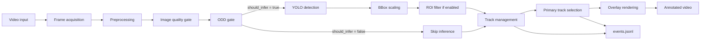
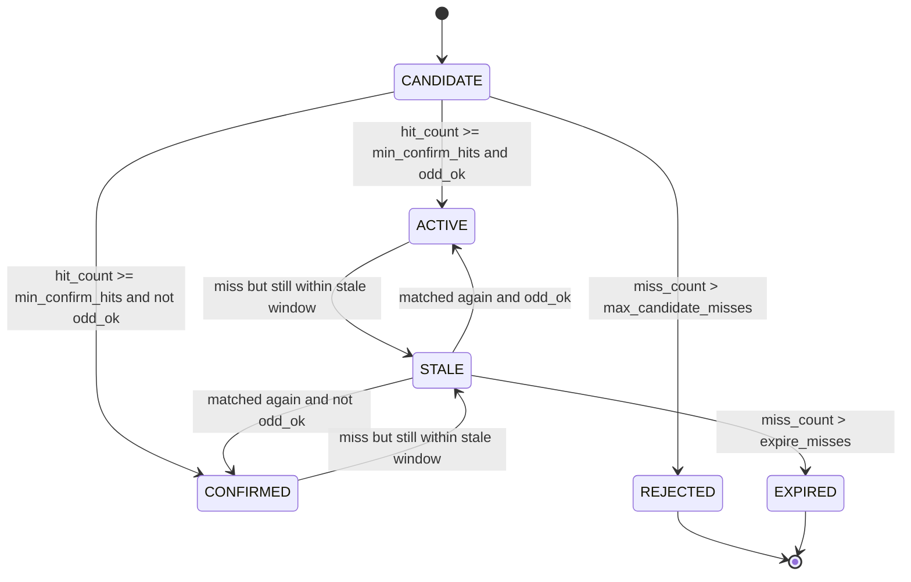

# Phân tích công thức và ý tưởng tính toán của pipeline TSR production-lite

> **Folder index:** [3.00. Implementation Index](00.index.md) — Lấy: cấu trúc implementation layer và thứ tự đọc. Dùng ở: đặt phân tích công thức notebook cạnh full reference/audit.
>
> Tài liệu này được viết dựa trên notebook [3.NB01. Colab Production-Lite Notebook](notebooks/01.tsr_colab_production_lite_demo.ipynb) — Lấy: công thức, tham số và ý tưởng tính toán của pipeline production-lite. Dùng ở: giải thích quality score, ODD gate, IoU tracking, temporal confirmation, warning level và replay KPI — và bản notebook ở tham chiếu Git `origin/vinhnpq/pha-hoai`. Tài liệu này cũng thay thế tài liệu release flow cũ: phần flow tổng quan được gộp vào mục 2, còn phần công thức và ví dụ tính toán nằm ở các mục 4-16. Mục tiêu là giải thích các kỹ thuật trong pipeline bằng văn viết, kèm công thức tính toán để người đọc hiểu vì sao từng khối tồn tại và tác động đến Traffic Sign Recognition (TSR) như thế nào.

## 1. Phạm vi phân tích

Notebook production-lite không phải là một bản triển khai production hoàn chỉnh. Đây là bản demo có mục đích rõ ràng: dùng detector YOLO ở mức frame-level rồi bổ sung các lớp xử lý cần thiết để mô phỏng hành vi của một tính năng ADAS có trạng thái. Khi đối chiếu trực tiếp notebook, cần tách rõ hai phiên bản:

- **Notebook hiện tại trên `duong_split_research`**: có video input, resize, quality gate, ODD gate, YOLO detection, bbox scaling, tracking theo IoU, temporal confirmation, warning level, primary track, overlay, JSONL event log và KPI replay. Ở bản này, `preprocess()` chỉ resize; chưa có `apply_clahe()` và chưa có `filter_by_roi()`.
- **Notebook ở `origin/vinhnpq/pha-hoai`**: bổ sung `apply_clahe()`, thêm tham số `clahe` vào `preprocess()`, khai báo `USE_CLAHE = True`, bổ sung `filter_by_roi()`, khai báo `USE_ROI_FILTER = True`, gọi ROI filter sau bbox scaling, và đổi phép đo Laplacian blur từ `cv2.CV_64F` sang `cv2.CV_16S`.

Vì vậy, phần CLAHE và ROI filter bên dưới được viết theo đúng mã nguồn ở `origin/vinhnpq/pha-hoai`. Các phần còn lại bám theo notebook hiện tại và cũng khớp với nhánh `origin/vinhnpq/pha-hoai`, trừ khác biệt nhỏ về kiểu dữ liệu Laplacian đã nêu ở trên.

Nếu cần giải thích các bước trước khi frame tới notebook, đọc [2.13. ISP Image Pipeline for TSR](../2.knowledge_base/13.isp_image_pipeline_for_tsr.md) `[SRC]`. Notebook không implement CMOS/RAW Bayer/ISP thật; notebook chỉ nhận frame video đã qua ISP/codec rồi xử lý software-side.

Tài liệu này cũng sửa lại cách viết công thức: tất cả công thức dạng block dùng cú pháp `$$ ... $$` để phù hợp với `pymdownx.arithmatex` trong MkDocs. Tránh dùng dạng display math bằng ngoặc vuông của LaTeX vì đây là nguồn gây lỗi render trong file cũ.

## 2. Luồng xử lý tổng thể

Pipeline bắt đầu từ video đầu vào, đọc từng frame bằng OpenCV, tiền xử lý ảnh, đánh giá chất lượng, kiểm tra ODD, chạy YOLO khi frame đủ điều kiện, sau đó biến các detection rời rạc thành track có vòng đời. Kết quả cuối cùng không chỉ là video có overlay, mà còn là `events.jsonl` để replay và giải thích quyết định.



Ý tưởng quan trọng là detector chỉ trả lời câu hỏi "khung hình này có nhìn thấy biển nào không". Một tính năng ADAS cần trả lời câu hỏi khó hơn: "biển này có đáng tin không, có liên quan không, có nên publish cho người lái không, và tại sao". Các khối quality, ODD, tracking và logging được thêm vào để trả lời những câu hỏi đó.

### 2.1 Hợp đồng dữ liệu của từng block

Bảng dưới đây là phần gộp từ release flow cũ. Nó giữ vai trò như bản đồ đọc nhanh: mỗi block nhận gì, làm gì và trả ra gì. Các công thức chi tiết được giải thích ở các mục sau để tránh lặp nội dung.

| Block | Input chính | Logic chính | Output | Trạng thái trong source hiện tại |
|---|---|---|---|---|
| `1. Frame acquisition` | `INPUT_VIDEO` | Dùng `cv2.VideoCapture` để đọc tuần tự frame, lấy FPS, resolution, total frame và chuẩn bị `VideoWriter` cho video đầu ra. | Current frame, FPS, resolution, video writer. | Có trong notebook `3.NB01`. |
| `2. Image preprocessing` | Frame gốc | Resize theo `PROFILE["max_width"]` nhưng giữ nguyên tỷ lệ ảnh. CLAHE chỉ là nhánh optional để tăng tương phản cục bộ. | Frame đã chuẩn hóa cho detector. | Resize có trong notebook `3.NB01`; CLAHE chỉ có ở tham chiếu `origin/vinhnpq/pha-hoai`, chưa có trong notebook hiện tại. |
| `3. Image quality assessment` | Frame sau preprocessing | Tính blur, brightness, dark ratio và glare ratio trên ảnh xám để tạo `quality.reasons` và cờ `should_infer`. | `quality.metrics`, `quality.reasons`, `quality.should_infer`. | Có trong notebook `3.NB01`. |
| `4. ODD validation` | Quality result, ego speed, cấu hình speed range | Kiểm tra frame có đủ chất lượng và tốc độ xe có nằm trong miền vận hành đã cấu hình hay không. | `odd_ok`, `odd_reasons`, `feature_state`; quyết định run hoặc skip inference. | Có trong notebook `3.NB01`. |
| `5. YOLO detection` | Frame vượt quality gate và ODD gate | Gọi `detect_with_yolo()` để phát hiện biển báo, đọc bbox, label, confidence, family và speed limit nếu label chứa giới hạn tốc độ. | Danh sách detection trên frame resize. | Có trong notebook `3.NB01`. |
| `6. Bounding box scaling` | Detection trên ảnh resize | Gọi `scale_bbox()` để quy đổi tọa độ bbox từ không gian ảnh resize về frame gốc. | Detection có bbox trên frame gốc. | Có trong notebook `3.NB01`. |
| `7. ROI filtering` | Detection sau khi scale bbox | Nếu bật `USE_ROI_FILTER`, gọi `filter_by_roi()` sau YOLO để giữ detection có tâm bbox nằm trong vùng quan tâm. | Detection sau lọc ROI. | Optional/downstream; chưa có trong notebook `3.NB01` hiện tại, có ở tham chiếu `origin/vinhnpq/pha-hoai`. |
| `8. Track management` | Detection, track list, quality, ODD result | Gọi `update_tracks()` để match detection với track hiện có, cập nhật ID, hit count, miss count, confidence, state và warning level. | Track list đã cập nhật. | Có trong notebook `3.NB01`. |
| `9. Primary track selection` | Track list | Gọi `choose_primary_track()` để chọn một biển báo ưu tiên dựa trên warning level, confidence và độ ổn định track. | Primary track hoặc `None`. | Có trong notebook `3.NB01`. |
| `10. Overlay rendering` | Frame gốc, track list, quality, feature state | Gọi `draw_overlay()` để vẽ bbox, label, warning level, feature state và FPS lên frame. | Annotated frame cho video đầu ra. | Có trong notebook `3.NB01`. |
| `11. JSON event logging` | Kết quả từng frame | Tạo event JSON theo từng frame và ghi tuần tự vào `.jsonl`, gồm frame index, quality, ODD, detection, track, primary track và runtime. | `events.jsonl`. | Có trong notebook `3.NB01`. |
| `12. Output artifacts` | Annotated frame và event stream | Ghi video đã annotate, log JSONL và một số preview frame để xem nhanh. | Annotated video, JSON event log, preview frames. | Có trong notebook `3.NB01`. |

### 2.2 Traceability Chuẩn/Nguồn Theo Component

Mục này trả lời vấn đề: **"Dựa trên tiêu chuẩn hoặc tài liệu nào để thiết kế component này?"** Cột `Cụm nội dung gốc` giữ nguyên tiếng Anh và gắn cụm với đúng nguồn để có thể search lại trong tài liệu. Cột `Mapping notebook` là phần trả lời thực tế: trong notebook component đó được hiện thực thành state, field hoặc decision nào.

Lưu ý quan trọng: các tiêu chuẩn như ISO 21448 hoặc ISO 26262 **không quy định** ngưỡng demo cụ thể như `blur_var < 45` hay `bright_ratio > 0.18`. Chúng chỉ justify vì sao phải có quality/ODD/diagnostic/evidence gates. Các ngưỡng trong notebook là heuristic production-lite và phải được calibrate bằng dataset/replay route nếu chuyển sang release thật.

| Component trong notebook | Nguồn/tiêu chuẩn có thể viện dẫn | Cụm nội dung gốc | Vì sao component cần thiết | Mapping notebook/state thực tế |
|---|---|---|---|---|
| Frame acquisition + timing | [ISO 26262-1:2018](https://www.iso.org/standard/68383.html), [ISO 21448:2022](https://www.iso.org/standard/77490.html) | ISO 26262-1: "safety-related systems"; "malfunctioning behaviour". ISO 21448: "operation phase". | TSR là E/E feature theo thời gian; nếu không có frame index/FPS/timing thì không chứng minh được latency, stale output hoặc confirmation delay. | `frame_idx`, FPS, `runtime.fps_smooth`, `run_inference`; production target có thêm timestamp, timeout và `UNAVAILABLE` khi mất frame. |
| Preprocessing / resize / CLAHE / ISP boundary | [ISO 21448:2022](https://www.iso.org/standard/77490.html), [Ultralytics Predict Mode](https://docs.ultralytics.com/modes/predict/), [OpenCV CLAHE tutorial](https://docs.opencv.org/master/d2/d74/tutorial_js_histogram_equalization.html), [GLARE](https://arxiv.org/abs/2209.08716), [2.13. ISP Image Pipeline for TSR](../2.knowledge_base/13.isp_image_pipeline_for_tsr.md) `[SRC]` | ISO 21448: "performance insufficiencies". Ultralytics: "`imgsz`"; "preprocess". OpenCV: "bilinear interpolation is applied". GLARE: "sun glare". | Input conditioning ảnh hưởng performance của perception. Resize giảm compute nhưng có risk mất biển nhỏ; CLAHE là mitigation thử nghiệm cho contrast/glare. ISP là tầng trước notebook, cần tách khỏi software preprocessing. | `preprocess()`, `PROFILE["max_width"]`, optional `USE_CLAHE`; không tạo state riêng nhưng ảnh hưởng detection và quality reason sau đó. |
| Image quality assessment | [ISO 21448:2022](https://www.iso.org/standard/77490.html), [IEEE 2020/P2020](https://standards.ieee.org/ieee/2020/11960/), [GLARE](https://arxiv.org/abs/2209.08716), [Requirements Engineering for Automotive Perception Systems](https://arxiv.org/abs/2302.12155) | ISO 21448: "proper situational awareness". IEEE 2020/P2020: "Automotive System Image Quality". GLARE: "under strong sun glare". Requirements paper: "quantifying quality requirements". | Camera-based TSR chỉ đáng tin khi ảnh đủ chất lượng. Blur/dark/glare là trigger làm perception insufficiency, nên phải detect và gắn reason trước khi publish. | `assess_frame_quality()`, `LOW_SHARPNESS`, `TOO_DARK`, `GLARE`, `quality_ok`, `should_infer`; dẫn tới `DEGRADED` hoặc `UNAVAILABLE`. |
| ODD gate | [ISO 21448:2022](https://www.iso.org/standard/77490.html), [Setting AI in context](https://arxiv.org/abs/2201.11451), [Requirements Engineering for Automotive Perception Systems](https://arxiv.org/abs/2302.12155) | Setting AI in context: "operational context"; "operational design domain". Requirements paper: "ODD detection"; "ODD exit detection". | Không thể claim TSR hoạt động mọi điều kiện. ODD gate khóa điều kiện vận hành tối thiểu trước khi detector output được xem là feature output. | `odd_gate()`, `odd_ok`, `odd_reasons`, `ODD_SPEED_OUT`, `ODD_QUALITY_OUT`; `feature_state = AVAILABLE / DEGRADED / UNAVAILABLE`. |
| YOLO detection + confidence + NMS | [ISO 21448:2022](https://www.iso.org/standard/77490.html), [Ultralytics Predict Mode](https://docs.ultralytics.com/modes/predict/), [YOLO](https://arxiv.org/abs/1506.02640) | ISO 21448: "complex sensors and processing algorithms". Ultralytics: "minimum confidence threshold"; "Non-Maximum Suppression". YOLO: "bounding boxes and associated class probabilities". | Detector là perception hypothesis generator, nhưng chưa phải feature. Confidence/NMS chỉ tạo candidate đầu vào cho state manager, không quyết định HMI trực tiếp. | `detect_with_yolo()`, `label`, `family`, `conf`, `bbox`, `speed_limit`, `conf >= T_conf`, NMS; output là detection list, chưa phải `ACTIVE`. |
| BBox scaling | [Ultralytics Predict Mode](https://docs.ultralytics.com/modes/predict/), [ISO 26262-1:2018](https://www.iso.org/standard/68383.html) | Ultralytics: "Results objects"; "`orig_shape`"; "`xyxy` pixel boxes". ISO 26262-1: "verification". | Detector chạy trên ảnh resize, còn overlay/log/replay dùng frame gốc. Nếu không scale đúng, evidence sai không gian ảnh và tracking sai IoU. | `scale_bbox()`, `s_x`, `s_y`; detection bbox được đưa về frame gốc trước ROI/tracking/JSONL. |
| ROI filter | [Requirements Engineering for Automotive Perception Systems](https://arxiv.org/abs/2302.12155), [ISO 21448:2022](https://www.iso.org/standard/77490.html) | Requirements paper: "realistic scenarios"; "edge case specification". ISO 21448: "triggering conditions". | ROI là context filter mức demo để giảm false positive ở vùng ít liên quan. Không phải chuẩn bắt buộc, nhưng là mitigation cho known trigger/scene noise. | Optional `filter_by_roi()`, `cx`, `cy`, `USE_ROI_FILTER`; output là detection list đã suppress trước tracking. |
| Tracking / association | [SORT](https://arxiv.org/abs/1602.00763), [Deep SORT](https://arxiv.org/abs/1703.07402), [ISO 21448:2022](https://www.iso.org/standard/77490.html) | SORT: "associate objects efficiently"; "Kalman Filter and Hungarian algorithm". Deep SORT: "measurement-to-track associations". | Detection theo frame dễ flicker. Tracking biến bbox rời rạc thành cùng một sign object có history để validation theo event. | `update_tracks()`, IoU association, `track_id`, `hit_count`, `miss_count`, confidence EMA, `max_candidate_misses`, `max_stale_misses`. |
| State machine / lifecycle | [Navigating Dimensionality through State Machines](https://arxiv.org/abs/2408.10569), [ISO 21448:2022](https://www.iso.org/standard/77490.html) | State-machine paper: "state charts"; "testability and coverage analysis"; "scenario-based testing". ISO 21448: "verification and validation measures". | Feature behavior cần test được theo transition, không xử lý ad-hoc từng frame. State machine giúp giải thích publish/suppress/expire. | `CANDIDATE`, `CONFIRMED`, `ACTIVE`, `STALE`, `REJECTED`, `EXPIRED`; transition theo `hit_count`, `miss_count`, `odd_ok`, quality. |
| Warning level + HMI policy | [Delegated Regulation (EU) 2021/1958](https://eur-lex.europa.eu/eli/reg_del/2021/1958/oj), [NHTSA Driver Distraction Guidelines](https://www.nhtsa.gov/document/visual-manual-nhtsa-driver-distraction-guidelines-vehicle-electronic-devices) | EU 2021/1958: "speed limit warning function"; "visual warning". NHTSA: "eye glance behavior"; "driver attention". | HMI không nên đọc raw detector. Warning phải phụ thuộc sign family, confirmation và quality để tránh gây nhiễu/hiểu sai. | `warning_level_for_family()`: `0` chưa publish hoặc quality fail, `1` info/warning nhẹ, `2` speed, `3` severe như stop/no-entry. |
| Map fusion mô phỏng | [Delegated Regulation (EU) 2021/1958](https://eur-lex.europa.eu/eli/reg_del/2021/1958/oj), [MapFusion](https://arxiv.org/abs/2103.05929) | EU 2021/1958: "electronic map data, or both"; "speed limit determination system". MapFusion: "map data". | ISA/SLIF có thể lấy speed limit từ sign observation, infrastructure/map, hoặc cả hai. Fusion cần provenance khi camera-map conflict. | `apply_map_fusion()`, `camera_only`, `agreed`, `camera_override`, `map_override`, `source`, `speed_limit`. |
| Primary track selection | [Delegated Regulation (EU) 2021/1958](https://eur-lex.europa.eu/eli/reg_del/2021/1958/oj), [NHTSA Driver Distraction Guidelines](https://www.nhtsa.gov/document/visual-manual-nhtsa-driver-distraction-guidelines-vehicle-electronic-devices) | EU 2021/1958: "communicates the perceived speed limit". NHTSA: "driver attention". | HMI thường cần một output ưu tiên, không hiển thị mọi bbox. Selection tránh quá tải driver và ưu tiên sign có severity/evidence cao. | `choose_primary_track()`, candidates `{ACTIVE, STALE, CONFIRMED}`, sort key `(warning_level, confidence, hit_count)`. |
| Overlay rendering | [NHTSA Driver Distraction Guidelines](https://www.nhtsa.gov/document/visual-manual-nhtsa-driver-distraction-guidelines-vehicle-electronic-devices), [Delegated Regulation (EU) 2021/1958](https://eur-lex.europa.eu/eli/reg_del/2021/1958/oj) | EU 2021/1958: "noticeable and easily recognisable". NHTSA: "driver attention". | Overlay trong notebook là debug visualization, không phải production HMI. Nó phải hiển thị state/reason để người review thấy quyết định feature. | `draw_overlay()`, hiển thị `track_id`, `state`, `warning_level`, `feature_state`, `QualityOK`, `Reasons`; không ảnh hưởng ngược decision. |
| JSONL event logging | [ISO 21448:2022](https://www.iso.org/standard/77490.html), [ISO 26262-1:2018](https://www.iso.org/standard/68383.html), [COVESA DLT](https://covesa.github.io/dlt-daemon/), [JSON Lines](https://jsonlines.org/) | ISO 21448: "verification and validation measures". ISO 26262-1: "functional safety activities". COVESA DLT: "Diagnostic Log and Trace". JSON Lines: "one record at a time". | Không có event log thì không replay được why/when của feature decision. JSONL là evidence nhẹ cho RCA, KPI và regression; production có thể dùng DLT/logging stack tương đương. | `events.jsonl` gồm `feature_state`, `quality`, `odd_reasons`, `detections`, `tracks`, `primary_track`, `runtime`. |
| KPI replay / evaluation | [ISO 21448:2022](https://www.iso.org/standard/77490.html), [ML product development under ISO 26262/SOTIF](https://arxiv.org/abs/1910.05112), [Requirements Engineering for Automotive Perception Systems](https://arxiv.org/abs/2302.12155) | ML product paper: "performance evaluation metrics". ISO 21448: "verification and validation measures". Requirements paper: "traceability"; "Data quality methods". | KPI replay biến demo thành evidence: có thể đo availability, degraded ratio, confirmation latency, size-bin coverage và threshold sensitivity. | `AVAILABLE/DEGRADED/UNAVAILABLE ratio`, quality reason ratio, confidence by family, size-bin coverage, threshold sweep, confirmation latency. |

### 2.3 Câu Trả Lời Ngắn Khi Vấn Đáp

Bảng này là phiên bản ngắn để trả lời vấn đáp. Cột `Thiết kế của em` đã được căn lại với source hiện tại của notebook `3.NB01`: `LOW_SHARPNESS` tạo `DEGRADED` nhưng vẫn có thể infer/update track; `GLARE` hoặc `TOO_DARK` mới làm `should_infer = false` và thường dẫn tới `UNAVAILABLE`.

| Câu hỏi                                      | Requirement / Reference                                                                                                                                                                                                                                                                             | Thiết kế của em                                                                                                                                                                                                                                                     | Mapping trong notebook                                                                                            |
| -------------------------------------------- | --------------------------------------------------------------------------------------------------------------------------------------------------------------------------------------------------------------------------------------------------------------------------------------------------- | ------------------------------------------------------------------------------------------------------------------------------------------------------------------------------------------------------------------------------------------------------------------- | ----------------------------------------------------------------------------------------------------------------- |
| **Vì sao có Quality Gate?**                  | **ISO 21448 (SOTIF)** yêu cầu xem xét các *performance limitations* và *trigger conditions* của perception để duy trì **proper situational awareness**. **[IEEE 2020/P2020](https://standards.ieee.org/ieee/2020/11960/)** nhấn mạnh việc đánh giá chất lượng ảnh (sharpness, noise, dynamic range, contrast...) cho camera ADAS.                       | Em bổ sung **Quality Gate** để đánh giá chất lượng frame trước khi dùng perception output. Với `LOW_SHARPNESS`, notebook vẫn có thể chạy detector nhưng đánh dấu `DEGRADED` và không phát warning mạnh; với `TOO_DARK` hoặc `GLARE`, notebook skip inference để tránh cập nhật trạng thái bằng ảnh quá xấu. | `LOW_SHARPNESS`, `TOO_DARK`, `GLARE`, `quality_ok`, `should_infer`, `DEGRADED`, `UNAVAILABLE`                     |
| **Vì sao có ODD Gate?**                      | **ISO 21448** yêu cầu xác định **Operational Design Domain (ODD)** và đánh giá hành vi của hệ thống trong phạm vi ODD đã định nghĩa.                                                                                                                                                                | Trước khi tin tưởng kết quả của TSR, hệ thống kiểm tra xem điều kiện vận hành hiện tại có còn nằm trong ODD hay không. Nếu vượt ngoài ODD thì kết quả được đánh dấu là không đủ điều kiện để sử dụng.                                                               | `ego_speed_kph`, `odd_speed_range_kph`, `odd_ok`, `ODD_SPEED_OUT`, `ODD_QUALITY_OUT`                              |
| **Vì sao detector không publish thẳng HMI?** | Trong kiến trúc ADAS, detector chỉ tạo ra **candidate detections**. **ISO 21448** yêu cầu xem xét độ tin cậy của perception trước khi ảnh hưởng đến hành vi an toàn; **EU 2021/1958 (ISA)** yêu cầu truyền đạt giới hạn tốc độ mà hệ thống **đã nhận biết**, chứ không phải mọi detection tức thời. | Detection đơn lẻ chưa đủ ổn định để hiển thị. Hệ thống phải đi qua **tracking**, **lifecycle**, **quality/ODD validation** và **primary track selection** trước khi tạo output cho HMI hoặc ISA.                                                                    | Pipeline: `Detection → Tracking → Lifecycle → Quality/ODD → Primary Output`                                       |
| **Vì sao cần Tracking và `miss_count`?**     | **SORT / Deep SORT** cung cấp cơ chế **data association** giữa các frame. Các kiến trúc perception production và nhiều nghiên cứu state machine sử dụng **temporal consistency** để tăng độ tin cậy của object trước khi publish.                                                                   | Tracking giúp duy trì danh tính của biển báo theo thời gian, còn `hit_count` và `miss_count` giúp tránh nhấp nháy HMI do mất detection ngắn hoặc false positive ở một frame đơn lẻ.                                                                                 | `hit_count`, `miss_count`, `CANDIDATE`, `ACTIVE`, `STALE`, `EXPIRED`                                              |
| **Vì sao có Warning Level / Primary Track?** | **EU 2021/1958** yêu cầu ISA truyền đạt giới hạn tốc độ được hệ thống nhận biết; **NHTSA Driver Distraction Guidelines** khuyến nghị giảm tải nhận thức của người lái và tránh hiển thị thông tin không cần thiết.                                                                                  | Khi có nhiều biển báo cùng lúc, hệ thống **không hiển thị toàn bộ detection** mà chọn **primary track** theo chính sách ưu tiên (priority policy) để cung cấp một output ổn định và có ý nghĩa nhất cho HMI.                                                        | `warning_level`, `choose_primary_track()`, sắp xếp theo `warning_level`, `confidence`, `hit_count`             |
| **Vì sao phải log JSONL?**                   | **ISO 21448** nhấn mạnh các hoạt động **verification & validation** trong suốt vòng đời phát triển; **[COVESA Diagnostic Log and Trace (DLT)](https://covesa.github.io/dlt-daemon/)** là tham chiếu production cho **runtime log/trace** phục vụ debugging, diagnostics và post-analysis.                                                    | JSON Lines là **implementation choice** của prototype để lưu lại toàn bộ trạng thái runtime theo từng frame, phục vụ replay, root cause analysis, KPI và regression testing. Trong hệ thống production, vai trò tương tự thường được thực hiện bằng DLT/logging stack tương đương.    | Mỗi frame là một JSON record chứa `quality`, `odd`, `detections`, `tracks`, `primary output`, `runtime`, `events` |

#### 2.3.1 Nội dung nghiên cứu bổ sung cho từng câu hỏi

Phần này mở rộng bảng 2.3 để khi vấn đáp có thể trả lời sâu hơn một tầng. Cách dùng ref ở đây là: tiêu chuẩn/tài liệu gốc cho **lý do cần component**, còn notebook hiện tại là **bản hiện thực production-lite**. Các tiêu chuẩn không đưa ra ngưỡng cụ thể như `blur_var`, `dark_ratio`, `min_confirm_hits` hay `warning_level`; các giá trị đó là policy demo và cần calibrate bằng dữ liệu nếu chuyển sang release thật.

| Câu hỏi trong 2.3 | Ref đang dùng để chứng minh | Cụm nội dung gốc nên nhớ/search | Nội dung nghiên cứu rút ra | Mapping cụ thể trong notebook |
|---|---|---|---|---|
| Vì sao có Quality Gate? | [ISO 21448:2022](https://www.iso.org/standard/77490.html), [IEEE P2020](https://standards.ieee.org/ieee/2020/11960/), [GLARE](https://arxiv.org/abs/2209.08716) | ISO 21448: "performance insufficiencies", "proper situational awareness", "complex sensors and processing algorithms". IEEE P2020: "flare, dynamic range, contrast, noise, flicker, geometry, resolution, color". | Camera perception không chỉ phụ thuộc model mà còn phụ thuộc chất lượng ảnh đầu vào. Blur, quá tối và chói sáng là trigger làm giảm độ tin cậy perception, nên cần quality gate để chuyển output sang `DEGRADED` hoặc `UNAVAILABLE` thay vì vẫn publish như ảnh tốt. | `assess_frame_quality()`: tính `blur_var`, `mean_luma`, `dark_ratio`, `bright_ratio`. `LOW_SHARPNESS` làm `quality_ok = false` nhưng vẫn có thể infer; `TOO_DARK`/`GLARE` làm `should_infer = false`. |
| Vì sao có ODD Gate? | [ISO 21448:2022](https://www.iso.org/standard/77490.html), [Setting AI in context](https://arxiv.org/abs/2201.11451), [Requirements Engineering for Automotive Perception Systems](https://link.springer.com/article/10.1007/s00766-023-00410-1) | Setting AI in context: "operational context needs to be known"; "state guarantees on performance and safety"; "ODD is an abstraction". Requirements paper: "ODD detection", "ODD exit detection". | Không thể nói TSR hoạt động an toàn trong mọi môi trường. Cần mô tả và kiểm tra điều kiện mà feature được phép tin vào output. Với prototype, ODD được rút gọn thành quality gate và khoảng tốc độ ego; với production, ODD sẽ rộng hơn: loại đường, thời tiết, camera health, quốc gia/sign catalogue, lane applicability. | `odd_gate()`: kiểm tra `quality["should_infer"]` và `odd_speed_range_kph`. Output là `odd_ok`, `odd_reasons`; `feature_state_from_quality()` chuyển sang `AVAILABLE`, `DEGRADED`, `UNAVAILABLE`. |
| Vì sao detector không publish thẳng HMI? | [ISO 21448:2022](https://www.iso.org/standard/77490.html), [Ultralytics Predict Mode](https://docs.ultralytics.com/modes/predict/), [YOLO](https://arxiv.org/abs/1506.02640), [EU 2021/1958](https://eur-lex.europa.eu/eli/reg_del/2021/1958/oj) | Ultralytics: "minimum confidence threshold", "Non-Maximum Suppression". YOLO: "bounding boxes and associated class probabilities". EU 2021/1958: "speed limit information function"; "communicates the perceived speed limit". | Detector output chỉ là hypothesis theo frame: bbox, class, confidence. Nó chưa biết biển có ổn định qua thời gian không, có nằm trong ODD không, có phù hợp HMI không, và có phải biển ưu tiên không. Vì vậy detector phải đi qua feature logic trước khi trở thành output cho người lái. | `detect_with_yolo()` tạo detection list với `label`, `family`, `conf`, `bbox`, `speed_limit`. Sau đó mới qua `update_tracks()`, `warning_level_for_family()`, `choose_primary_track()` và log `primary_track`. |
| Vì sao cần Tracking và `miss_count`? | [SORT](https://arxiv.org/abs/1602.00763), [Deep SORT](https://arxiv.org/abs/1703.07402), [ISO 21448:2022](https://www.iso.org/standard/77490.html) | SORT: "Simple Online and Realtime Tracking"; "Kalman Filter and Hungarian algorithm". Deep SORT: "appearance information"; "deep association metric". | Detection theo từng frame có thể nhấp nháy, mất tạm do blur/occlusion hoặc đổi nhãn trong vài frame. Tracking-by-detection nối các detection rời rạc thành một object có identity/history. `miss_count` là biến tối thiểu để biết track đang không được quan sát bao lâu trước khi chuyển `STALE` hoặc `EXPIRED`. | Notebook dùng IoU association theo cùng `family`, không dùng Kalman/Hungarian đầy đủ. `hit_count` tích lũy bằng chứng để confirm; `miss_count` tăng khi không match detection; state đi qua `CANDIDATE`, `ACTIVE`, `STALE`, `EXPIRED`. |
| Vì sao có Warning Level / Primary Track? | [EU 2021/1958](https://eur-lex.europa.eu/eli/reg_del/2021/1958/oj), [NHTSA Driver Distraction Guidelines](https://www.nhtsa.gov/document/visual-manual-nhtsa-driver-distraction-guidelines-vehicle-electronic-devices) | EU 2021/1958: "speed limit warning function"; "alerts the driver"; "perceived speed limit". NHTSA: "attention from driving"; "visual distraction", "cognitive distraction". | HMI không nên hiển thị mọi bbox raw vì sẽ gây nhiễu và tăng tải chú ý. Cần policy chọn một output ưu tiên và chỉ nâng mức cảnh báo khi biển đã đủ ổn định/đủ chất lượng. EU ISA là cơ sở mạnh nhất cho speed-limit output; NHTSA là cơ sở human-factor để tránh quá tải HMI. | `warning_level_for_family()` chỉ trả warning cao khi `confirmed` và `quality_ok`. `choose_primary_track()` lọc state `{ACTIVE, STALE, CONFIRMED}` rồi sort theo `warning_level`, `confidence`, `hit_count`. |
| Vì sao phải log JSONL? | [ISO 21448:2022](https://www.iso.org/standard/77490.html), [COVESA DLT](https://covesa.github.io/dlt-daemon/), [JSON Lines](https://jsonlines.org/) | ISO 21448: "verification and validation measures". COVESA DLT: "standardized logging and tracing interface". JSON Lines: "one record at a time"; "great format for log files". | Nếu chỉ có video overlay thì không replay được quyết định của feature. Log theo từng frame giúp trả lời: frame nào bị quality gate chặn, detection nào vào track nào, tại sao primary output đổi, warning vì sao bằng 0/1/2/3. JSONL là lựa chọn nhẹ cho prototype; production có thể thay bằng DLT/logging stack chuẩn hơn. | `events.jsonl` ghi từng record bằng `f_jsonl.write(json.dumps(event) + "\n")`; event chứa `frame_idx`, `quality`, `odd_ok`, `detections`, `tracks`, `primary_track`, `runtime`. |

#### 2.3.2 Cách trả lời dài hơn khi bị hỏi phản biện

Nếu hội đồng hỏi "Em dựa trên tiêu chuẩn nào để có Quality Gate?", câu trả lời chặt chẽ là: **ISO 21448 không bảo em dùng Laplacian hay ngưỡng 45**, nhưng ISO 21448 đặt vấn đề SOTIF cho hệ có complex sensors/processing algorithms và các performance insufficiencies. Vì camera TSR phụ thuộc mạnh vào blur, glare và darkness, em thêm quality gate để không đối xử mọi frame như nhau. IEEE P2020 củng cố phần này vì nó liệt kê các thuộc tính image quality cho automotive như flare, dynamic range, contrast, noise và resolution. Mapping trong notebook là `LOW_SHARPNESS`, `TOO_DARK`, `GLARE`, `quality_ok`, `should_infer`, `DEGRADED`, `UNAVAILABLE`.

Nếu bị hỏi "ODD Gate có phải tiêu chuẩn bắt buộc không?", câu trả lời nên tách rõ: **ODD là khái niệm cần có khi nói về giới hạn hoạt động của hệ thống**, còn notebook chỉ implement ODD proxy. ISO 21448 yêu cầu xem xét intended functionality trong operation phase; nghiên cứu về operational context nhấn mạnh muốn cam kết performance/safety thì phải biết bối cảnh vận hành. Vì vậy notebook có `odd_gate()` để không claim TSR hợp lệ ngoài điều kiện đã cấu hình. Bản demo dùng quality và speed range; bản production phải có ODD đầy đủ hơn.

Nếu bị hỏi "YOLO đã có confidence rồi, sao không hiển thị luôn?", câu trả lời là: confidence chỉ là độ tin cậy của **candidate detection** theo frame. Ultralytics/YOLO cung cấp bbox, class, confidence và NMS, nhưng không quyết định HMI. EU 2021/1958 nói về perceived speed limit được speed limit information function truyền đạt cho driver, tức output đã qua hệ xác định giới hạn tốc độ, không phải mọi bbox raw. Vì vậy notebook tách detector output khỏi feature output bằng tracking, lifecycle, quality/ODD và primary selection.

Nếu bị hỏi "miss_count lấy từ tiêu chuẩn nào?", câu trả lời là: `miss_count` không phải tên biến được SORT hay ISO quy định. Nó là cách implement tối giản của ý tưởng tracking-by-detection: khi một track không match detection mới, hệ thống vẫn giữ track trong một thời gian ngắn thay vì xóa ngay. SORT/Deep SORT justify nhu cầu association qua nhiều frame; notebook hiện thực giản lược bằng IoU cùng `family`, `hit_count` để confirm và `miss_count` để stale/expire.

Nếu bị hỏi "Warning Level / Primary Track có phải ISA requirement không?", câu trả lời là: EU 2021/1958 là cơ sở trực tiếp cho speed limit information/warning, nhưng notebook mở rộng thành HMI-lite cho nhiều family biển báo. NHTSA được dùng làm human-factor rationale: không nên đưa quá nhiều thông tin gây visual/cognitive distraction. Vì vậy `choose_primary_track()` chỉ chọn một sign ưu tiên thay vì đưa toàn bộ detection list lên HMI.

Nếu bị hỏi "Vì sao JSONL mà không chỉ lưu video?", câu trả lời là: video overlay chỉ cho nhìn kết quả, không giải thích được quyết định. ISO 21448 yêu cầu verification/validation measures; DLT là ví dụ production logging/tracing trong automotive; JSON Lines phù hợp prototype vì mỗi frame là một record độc lập, đọc lại được bằng script và không cần giữ toàn bộ log trong RAM. Mapping là `events.jsonl` và các field `quality`, `odd`, `detections`, `tracks`, `primary_track`, `runtime`.

#### 2.3.3 Các giới hạn không nên overclaim

| Claim cần tránh | Cách nói đúng hơn |
|---|---|
| "ISO 21448 yêu cầu phải dùng ngưỡng blur này." | ISO 21448 justify quality/ODD/V&V thinking; ngưỡng cụ thể trong notebook là heuristic demo. |
| "IEEE P2020 bảo phải dùng Laplacian blur." | IEEE P2020 nói về automotive image quality attributes; Laplacian variance là lựa chọn implement để đo sharpness proxy. |
| "SORT quy định phải có `miss_count`." | SORT/Deep SORT justify tracking-by-detection và association; `miss_count` là biến lifecycle tối giản trong notebook. |
| "EU 2021/1958 áp dụng cho mọi biển báo trong notebook." | EU 2021/1958 liên quan mạnh nhất tới ISA/speed-limit information; notebook mở rộng warning policy cho demo TSR tổng quát. |
| "JSONL là logging chuẩn production." | JSONL là prototype evidence format; production có thể dùng DLT/AUTOSAR logging hoặc stack nội bộ. |
| "Notebook đã là production feature." | Notebook là production-lite replay để minh họa quality/ODD/tracking/logging, chưa có lane association, diagnostics ECU, vehicle applicability và release evidence đầy đủ. |


## 3. Ký hiệu chung

Trong các công thức bên dưới:

- `I` là frame ảnh màu đầu vào.
- `Y` là ảnh xám hoặc kênh độ sáng sau khi chuyển đổi từ `I`.
- `H`, `W` là chiều cao và chiều rộng ảnh.
- `N = H x W` là tổng số pixel trên ảnh xám.
- `B = (x1, y1, x2, y2)` là bounding box ở dạng tọa độ góc trên bên trái và góc dưới bên phải.
- `conf` là điểm tin cậy của detection do YOLO trả về.
- `k` là chỉ số frame trong video.

Nếu cần đổi ảnh màu sang độ sáng, có thể hiểu gần đúng theo công thức luma:

$$
Y(x,y) = 0.299R(x,y) + 0.587G(x,y) + 0.114B(x,y)
$$

Vì OpenCV đọc ảnh theo thứ tự BGR, cùng công thức này thường được viết theo thứ tự kênh của OpenCV là:

$$
Y(x,y) = 0.114B(x,y) + 0.587G(x,y) + 0.299R(x,y)
$$

Đây là phép biến ảnh màu thành một kênh độ sáng để tính blur, dark ratio và glare ratio.

### 3.1 Cách đọc hệ tọa độ ảnh

Trong OpenCV, gốc tọa độ ảnh nằm ở góc trên bên trái. Trục `x` tăng từ trái sang phải, trục `y` tăng từ trên xuống dưới. Vì vậy, `y` càng lớn thì điểm đó càng nằm gần đáy ảnh, không phải càng cao như hệ trục toán học thông thường.

Với một bbox:

$$
B = (x_1, y_1, x_2, y_2)
$$

tâm bbox là:

$$
c_x = \frac{x_1 + x_2}{2},\quad
c_y = \frac{y_1 + y_2}{2}
$$

Ví dụ frame `1280 x 720` có `W = 1280`, `H = 720`. Một điểm có `c_y = 650` nằm rất thấp vì:

$$
\frac{650}{720} \approx 0.90
$$

tức là gần 90% chiều cao tính từ mép trên xuống. Đây là lý do các điều kiện ROI như `cy > 0.85H` được hiểu là "tâm bbox nằm ở 15% thấp nhất của ảnh".

Điểm quan trọng: ROI filter trong notebook không xét toàn bộ diện tích bbox và cũng không crop ảnh trước khi chạy YOLO. Nó chạy sau detection và quyết định giữ/loại detection dựa trên **tâm bbox** `(cx, cy)`.

## 4. Block 1 - Video input và frame acquisition

> **Nguồn tại mục:** [3.NB01. Colab Production-Lite Notebook](notebooks/01.tsr_colab_production_lite_demo.ipynb) — Lấy: video candidate `videos/14212806_3840_2160_60fps.mp4`, cách đọc `cv2.CAP_PROP_FPS`, fallback FPS và khởi tạo `VideoWriter`. Dùng ở: mô tả frame acquisition trong notebook production-lite.
>
> **Nguồn tại mục:** [3.NB02. Research Workflow Notebook](notebooks/02.tsr_research_workflow.ipynb) — Lấy: output nội bộ `3840x2160 @ 59.94 fps` và `1187 frames`. Dùng ở: kiểm chứng metadata video đang có trong repo.
>
> **Nguồn tại mục:** [code/tsr_demo.py](../../code/tsr_demo.py) — Lấy: baseline đọc `CAP_PROP_FPS`, fallback `30.0` và default source legacy. Dùng ở: đối chiếu runtime CLI với notebook.

Khối này đọc video bằng `cv2.VideoCapture`, lấy metadata như FPS, kích thước frame và tổng số frame, sau đó khởi tạo `cv2.VideoWriter` để ghi video đầu ra. Về mặt tính toán, đây là lớp đồng bộ dữ liệu theo thời gian, chưa làm computer vision.

Nếu video có FPS là `f`, frame thứ `k` tương ứng với thời điểm:

$$
t_k = \frac{k}{f}
$$

Trong pipeline minh họa, timestamp này chưa được dùng như một tín hiệu riêng, nhưng nó là nền tảng để tính latency, confirmation delay và replay KPI trong hệ thống production thực tế.

Trong repo hiện tại, video replay có sẵn là:

| Video | Resolution | FPS đọc bằng OpenCV | Tổng frame | Thời lượng xấp xỉ |
|---|---:|---:|---:|---:|
| `videos/14212806_3840_2160_60fps.mp4` | `3840x2160` | `59.94` | `1187` | `19.80 s` |

Với `f = 59.94`, khoảng thời gian giữa hai frame liên tiếp là:

$$
\Delta t = \frac{1}{59.94} \approx 0.0167\ \text{s} = 16.7\ \text{ms}
$$

Điểm cần tách rõ: FPS của video là tốc độ timeline/input; FPS xử lý thực tế của model là tốc độ máy chạy inference. Một video `59.94 fps` không có nghĩa pipeline chắc chắn chạy realtime `59.94 fps` trên CPU/GPU hiện có.

## 5. Block 2 - Preprocessing

Preprocessing có hai mục tiêu. Thứ nhất là giảm kích thước ảnh để inference nhanh hơn. Thứ hai là chuẩn hóa hoặc cải thiện chất lượng ảnh trước khi đưa vào detector. Trong notebook hiện tại trên `duong_split_research`, `preprocess()` chỉ resize theo `max_width`. Trong tham chiếu `origin/vinhnpq/pha-hoai`, `preprocess(frame, max_width, clahe=False)` có thêm bước CLAHE khi `USE_CLAHE = True`.

Điểm cần tách rõ với [2.13. ISP Image Pipeline for TSR](../2.knowledge_base/13.isp_image_pipeline_for_tsr.md) `[SRC]`: AE, AWB, demosaicing, denoising, HDR merge, tone mapping, lens distortion correction và sharpening là camera/ISP pipeline trước khi frame tới notebook. Notebook không xử lý RAW Bayer; nó chỉ xử lý frame video đã decode.

### 5.1 Resize giữ nguyên tỷ lệ ảnh

Nếu frame gốc có kích thước `W x H` và cấu hình chỉ cho phép chiều rộng tối đa `W_max`, hệ số scale được tính là:

$$
s =
\begin{cases}
\frac{W_\text{max}}{W}, & W > W_\text{max} \\
1, & W \leq W_\text{max}
\end{cases}
$$

Kích thước mới là:

$$
W' = \lfloor sW \rfloor
$$

$$
H' = \lfloor sH \rfloor
$$

Giữ cùng một hệ số `s` cho cả chiều rộng và chiều cao giúp biển báo không bị méo. Điều này quan trọng với TSR vì hình tròn, tam giác, bát giác và chữ số trên biển đều là tín hiệu thị giác quan trọng.

Chi phí xử lý ảnh và inference thường tăng theo số pixel:

$$
C \propto W \times H
$$

Ví dụ, khi resize từ `1920 x 1080` xuống `640 x 360`, số pixel giảm từ:

$$
1920 \times 1080 = 2{,}073{,}600
$$

còn:

$$
640 \times 360 = 230{,}400
$$

Tức là giảm xấp xỉ:

$$
\frac{2{,}073{,}600}{230{,}400} \approx 9
$$

lần số pixel cần xử lý. Đổi lại, biển báo nhỏ ở xa có thể bị mất chi tiết, đặc biệt là chữ số tốc độ.

### 5.2 Scale bounding box ngược về frame gốc

YOLO chạy trên frame đã resize, nhưng overlay và event log cần tọa độ trên frame gốc. Nếu ảnh resize có kích thước `W_p x H_p`, frame gốc có kích thước `W_o x H_o`, hệ số đổi tọa độ là:

$$
s_x = \frac{W_o}{W_p}
$$

$$
s_y = \frac{H_o}{H_p}
$$

Với bbox trên ảnh resize là `(x1, y1, x2, y2)`, bbox trên frame gốc là:

$$
x'_1 = s_x x_1,\quad x'_2 = s_x x_2
$$

$$
y'_1 = s_y y_1,\quad y'_2 = s_y y_2
$$

Đây là phép biến đổi tọa độ từ không gian detector về không gian hiển thị.

Ví dụ frame gốc `1920 x 1080` được resize xuống `640 x 360`. Khi đó:

$$
s_x = \frac{1920}{640} = 3,\quad
s_y = \frac{1080}{360} = 3
$$

Nếu YOLO trả bbox trên ảnh resize:

$$
B_p = (180, 90, 230, 140)
$$

thì bbox tương ứng trên frame gốc là:

$$
B_o = (540, 270, 690, 420)
$$

Tâm bbox trên ảnh resize là `(205, 115)`, còn tâm bbox trên frame gốc là `(615, 345)`. Nếu dùng nhầm bbox resize để vẽ lên frame gốc, ô vẽ sẽ nhỏ hơn và lệch về góc trên bên trái. Đây là lỗi rất dễ gặp khi detector chạy trên ảnh đã thu nhỏ nhưng overlay lại vẽ lên ảnh gốc.

### 5.3 CLAHE - Contrast Limited Adaptive Histogram Equalization

> **Nguồn tại mục:** [OpenCV Histogram Equalization tutorial](https://docs.opencv.org/master/d2/d74/tutorial_js_histogram_equalization.html) — Lấy: CLAHE chia ảnh thành `tiles`, clip và redistribute histogram, sau equalization dùng bilinear interpolation để giảm artifact ở biên tile. Dùng ở: Step 3-8 của phần CLAHE.

CLAHE là biến thể của histogram equalization. Điểm khác biệt nằm ở ba điểm cần đọc rõ:

- **Adaptive**: không dùng một histogram duy nhất cho toàn ảnh, mà chia ảnh thành nhiều tile nhỏ và học một ánh xạ độ sáng riêng cho từng tile.
- **Contrast limited**: trước khi tính CDF, histogram của từng tile bị cắt ở một ngưỡng nhất định để tránh khuếch đại nhiễu hoặc texture nhỏ quá mạnh.
- **Bilinear interpolation**: khi áp LUT cho từng pixel, CLAHE không lấy cứng một LUT của một tile duy nhất mà nội suy song tuyến tính giữa các LUT lân cận để tránh đường biên dạng ô vuông.

Trong tham chiếu `origin/vinhnpq/pha-hoai`, `preprocess()` resize frame trước, sau đó mới gọi CLAHE nếu `USE_CLAHE = True`:

```python
def preprocess(frame: np.ndarray, max_width: int = 960, clahe: bool = False) -> np.ndarray:
    h, w = frame.shape[:2]
    if w > max_width:
        scale = max_width / float(w)
        frame = cv2.resize(frame, (int(w * scale), int(h * scale)), interpolation=cv2.INTER_LINEAR)
    if clahe:
        frame = apply_clahe(frame)
    return frame
```

Hàm CLAHE trong notebook tham chiếu là:

```python
def apply_clahe(frame: np.ndarray) -> np.ndarray:
    lab = cv2.cvtColor(frame, cv2.COLOR_BGR2LAB)
    l, a, b = cv2.split(lab)
    clahe = cv2.createCLAHE(clipLimit=2.0, tileGridSize=(8, 8))
    cl = clahe.apply(l)
    limg = cv2.merge((cl, a, b))
    return cv2.cvtColor(limg, cv2.COLOR_LAB2BGR)
```

Về API, OpenCV cho phép gọi thẳng `cv2.COLOR_BGR2LAB`. Về mặt màu học, phép đổi này có thể hiểu theo chuỗi:

```text
BGR -> RGB -> XYZ -> LAB -> tách L -> CLAHE trên L -> ghép LAB' -> BGR'
```

Không nên equalize trực tiếp từng kênh `B`, `G`, `R` vì màu biển báo là tín hiệu phân loại quan trọng. Nếu ba kênh màu bị kéo giãn độc lập, màu đỏ của biển cấm, xanh của biển chỉ dẫn hoặc vàng của biển cảnh báo có thể bị lệch. Chuyển sang LAB giúp tách tương đối rõ độ sáng `L` khỏi hai trục màu `a`, `b`; notebook chỉ thay đổi `L` và giữ nguyên `a`, `b`.

#### Step 1 - BGR sang XYZ

Frame OpenCV được lưu theo thứ tự `BGR`, nhưng công thức màu chuẩn thường viết theo `RGB`. Với mỗi pixel, trước hết đổi thứ tự kênh:

$$
(B, G, R)_\mathrm{OpenCV} \rightarrow (R, G, B)
$$

Sau đó chuẩn hóa sRGB về khoảng `[0, 1]`:

$$
c_s = \frac{C}{255},\quad C \in \{R,G,B\}
$$

Vì ảnh 8-bit thường là sRGB có gamma, cần tuyến tính hóa trước khi nhân ma trận XYZ:

$$
c =
\begin{cases}
\frac{c_s}{12.92}, & c_s \leq 0.04045 \\
\left(\frac{c_s + 0.055}{1.055}\right)^{2.4}, & c_s > 0.04045
\end{cases}
$$

Với `r`, `g`, `b` là RGB tuyến tính, chuyển sang CIE XYZ với white point D65:

$$
\begin{bmatrix}
X \\
Y \\
Z
\end{bmatrix}
=
\begin{bmatrix}
0.4124 & 0.3576 & 0.1805 \\
0.2126 & 0.7152 & 0.0722 \\
0.0193 & 0.1192 & 0.9505
\end{bmatrix}
\begin{bmatrix}
r \\
g \\
b
\end{bmatrix}
$$

Ở đây `Y` là luminance theo XYZ, không phải kênh `Y` của YUV và cũng không phải kênh `L` của LAB. Ví dụ pixel đỏ thuần trong OpenCV là `BGR = (0, 0, 255)`. Sau khi đổi sang RGB tuyến tính:

$$
(r,g,b) = (1,0,0)
$$

thì:

$$
(X,Y,Z) \approx (0.4124, 0.2126, 0.0193)
$$

Nếu viết theo thang `0..255` để dễ hình dung:

$$
(X,Y,Z) \times 255 \approx (105, 54, 5)
$$

#### Step 2 - XYZ sang LAB

LAB chuẩn hóa XYZ theo white point D65:

$$
X_n = 0.95047,\quad Y_n = 1.00000,\quad Z_n = 1.08883
$$

Định nghĩa:

$$
f(t) =
\begin{cases}
t^{1/3}, & t > \left(\frac{6}{29}\right)^3 \\
\frac{1}{3}\left(\frac{29}{6}\right)^2t + \frac{4}{29}, & t \leq \left(\frac{6}{29}\right)^3
\end{cases}
$$

Khi đó:

$$
L^* = 116 f\left(\frac{Y}{Y_n}\right) - 16
$$

$$
a^* = 500\left[
f\left(\frac{X}{X_n}\right)
- f\left(\frac{Y}{Y_n}\right)
\right]
$$

$$
b^* = 200\left[
f\left(\frac{Y}{Y_n}\right)
- f\left(\frac{Z}{Z_n}\right)
\right]
$$

Ý nghĩa:

- `L*` là độ sáng cảm nhận, về lý thuyết nằm trong khoảng `0..100`.
- `a*` là trục xanh lá sang đỏ.
- `b*` là trục xanh dương sang vàng.

Với ảnh 8-bit, OpenCV lưu LAB theo dạng tiện cho xử lý ảnh:

$$
L_\mathrm{cv} = \mathrm{round}\left(\frac{255}{100}L^*\right)
$$

$$
a_\mathrm{cv} = \mathrm{round}(a^* + 128)
$$

$$
b_\mathrm{cv} = \mathrm{round}(b^* + 128)
$$

Vì vậy `l, a, b = cv2.split(lab)` trong notebook trả về ba kênh 8-bit. CLAHE được áp dụng lên `l`, tức kênh sáng đã được scale về `0..255`.

#### Step 3 - Adaptive tile

Với:

```python
cv2.createCLAHE(clipLimit=2.0, tileGridSize=(8, 8))
```

ảnh $L$ được chia theo lưới $8 \times 8$, tức tối đa 64 vùng cục bộ. Gọi một tile là $T$, số pixel trong tile là $n_T$, và số mức sáng là:

$$
N_g = 256
$$

Từ "adaptive" nằm ở đây: mỗi tile có histogram, CDF và bảng ánh xạ riêng. Một vùng tối dưới bóng cây và một vùng sáng gần trời không bị ép dùng cùng một phép biến đổi toàn cục.

#### Step 4 - Histogram của từng tile

Histogram đếm số pixel của từng mức sáng trong tile:

$$
h_T(i) = \sum_{p \in T}\mathbf{1}\left(L(p)=i\right),
\quad i = 0,1,\ldots,N_g-1
$$

Tổng histogram bằng số pixel trong tile:

$$
\sum_{i=0}^{N_g-1}h_T(i)=n_T
$$

Ví dụ minh họa dùng thang sáng nhỏ `0..7` thay vì `0..255` để dễ tính tay. Một tile `4 x 4` có:

```text
2 2 2 2
3 3 3 3
3 3 4 4
4 5 5 6
```

Khi đó $n_T = 16$, $N_g = 8$, histogram là:

| Bin sáng $i$ | 0 | 1 | 2 | 3 | 4 | 5 | 6 | 7 |
|---|---:|---:|---:|---:|---:|---:|---:|---:|
| $h_T(i)$ | 0 | 0 | 4 | 6 | 3 | 2 | 1 | 0 |

Histogram tập trung ở vùng $2 \ldots 6$, nên độ tương phản cục bộ đang hẹp.

#### Step 5 - Clip histogram

AHE thông thường equalize từng tile mà không giới hạn histogram. Nếu một bin có quá nhiều pixel, CDF sẽ nhảy mạnh tại bin đó và nhiễu nhỏ trong tile có thể bị khuếch đại. CLAHE xử lý bằng cách cắt histogram tại ngưỡng $C$.

Trong OpenCV, `clipLimit=2.0` là ngưỡng chuẩn hóa, không phải cứ mỗi bin tối đa đúng 2 pixel. Ngưỡng hiệu dụng phụ thuộc diện tích tile:

$$
C_\mathrm{eff} =
\max\left(1,\left\lfloor
\frac{\mathrm{clipLimit}\cdot n_T}{N_g}
\right\rfloor\right)
$$

Về mặt ý tưởng, với một ngưỡng clip $C$, histogram sau clip là:

$$
h_T^\mathrm{clip}(i)=\min(h_T(i),C)
$$

Phần bị cắt ra là:

$$
E = \sum_{i=0}^{N_g-1}\max(h_T(i)-C,0)
$$

Trong ví dụ đồ chơi, giả sử $C = 4$:

| Bin sáng $i$ | 0 | 1 | 2 | 3 | 4 | 5 | 6 | 7 |
|---|---:|---:|---:|---:|---:|---:|---:|---:|
| $h_T(i)$ | 0 | 0 | 4 | 6 | 3 | 2 | 1 | 0 |
| $h_T^\mathrm{clip}(i)$ | 0 | 0 | 4 | 4 | 3 | 2 | 1 | 0 |

Bin $3$ bị cắt từ $6$ xuống $4$, nên:

$$
E = 2
$$

#### Step 6 - Phân phối lại phần bị clip

Các pixel bị clip không bị xóa khỏi histogram. Chúng được phân phối lại để tổng số pixel vẫn được bảo toàn. Đặt:

$$
q = \left\lfloor\frac{E}{N_g}\right\rfloor
$$

$$
r = E \bmod N_g
$$

Mỗi bin nhận thêm phần đều $q$. Phần dư $r$ không chia đều được thì nhận thêm $1$ ở $r$ bin được chọn:

$$
h_T^\mathrm{redist}(i)
= h_T^\mathrm{clip}(i) + q + \delta_i
$$

với:

$$
\delta_i \in \{0,1\},\quad \sum_{i=0}^{N_g-1}\delta_i = r
$$

Trong mô tả học tay, phần dư thường được cộng vào các bin đầu tiên để dễ kiểm tra. OpenCV rải phần dư theo bước cách đều, bắt đầu từ bin thấp, để phân bố đều hơn. Hai cách viết khác nhau ở chi tiết làm tròn, nhưng cùng bảo toàn tổng:

$$
\sum_{i=0}^{N_g-1}h_T^\mathrm{redist}(i)=n_T
$$

Với ví dụ $E = 2$, $N_g = 8$:

$$
q = 0,\quad r = 2
$$

Nếu minh họa bằng cách cộng phần dư vào hai bin đầu:

| Bin sáng $i$ | 0 | 1 | 2 | 3 | 4 | 5 | 6 | 7 |
|---|---:|---:|---:|---:|---:|---:|---:|---:|
| $h_T^\mathrm{clip}(i)$ | 0 | 0 | 4 | 4 | 3 | 2 | 1 | 0 |
| $h_T^\mathrm{redist}(i)$ | 1 | 1 | 4 | 4 | 3 | 2 | 1 | 0 |

Tổng vẫn là $16$.

#### Step 7 - Cộng gộp xác suất bằng CDF

Từ histogram đã phân phối lại, tính xác suất xuất hiện của từng mức sáng:

$$
p_T(i)=\frac{h_T^\mathrm{redist}(i)}{n_T}
$$

Sau đó cộng gộp xác suất từ tối đến sáng để tạo CDF:

$$
F_T(k)=\sum_{i=0}^{k}p_T(i)
$$

Đây là bước "cộng gộp xác suất". Trong triển khai LUT, công thức tương đương là cộng dồn số đếm histogram trước, rồi nhân với hệ số scale:

$$
M_T(k)=
\mathrm{round}\left(
\frac{N_g-1}{n_T}
\sum_{i=0}^{k}h_T^\mathrm{redist}(i)
\right)
$$

hay:

$$
M_T(k)=\mathrm{round}\left((N_g-1)F_T(k)\right)
$$

Trong ví dụ:

| Bin $k$ | $h_T^\mathrm{redist}(k)$ | $p_T(k)$ | $F_T(k)$ | $M_T(k)$ |
|---|---:|---:|---:|---:|
| 0 | 1 | 1/16 | 0.0625 | 0 |
| 1 | 1 | 1/16 | 0.1250 | 1 |
| 2 | 4 | 4/16 | 0.3750 | 3 |
| 3 | 4 | 4/16 | 0.6250 | 4 |
| 4 | 3 | 3/16 | 0.8125 | 6 |
| 5 | 2 | 2/16 | 0.9375 | 7 |
| 6 | 1 | 1/16 | 1.0000 | 7 |
| 7 | 0 | 0/16 | 1.0000 | 7 |

Các giá trị sáng ban đầu trong tile được ánh xạ lại theo $M_T$:

```text
2 -> 3
3 -> 4
4 -> 6
5 -> 7
6 -> 7
```

Như vậy dải sáng ban đầu $2 \ldots 6$ được kéo thành $3 \ldots 7$. Với ảnh thật $N_g = 256$, nguyên lý giống hệt, chỉ có nhiều bin hơn.

#### Step 8 - Tính lại kênh sáng mới bằng bilinear interpolation

Nếu chỉ xét một tile độc lập, pixel $p$ có độ sáng cũ $L(p)=k$ được đổi thành:

$$
L'_T(p)=M_T(k)
$$

Tuy nhiên, nếu lấy cứng LUT của từng tile, ảnh sẽ dễ xuất hiện đường biên dạng ô vuông giữa các tile. CLAHE tránh điều này bằng nội suy song tuyến tính giữa bốn LUT lân cận.

Gọi bốn ánh xạ lân cận là:

| LUT | Vị trí tương đối |
|---|---|
| $M_{00}$ | tile trên-trái |
| $M_{10}$ | tile trên-phải |
| $M_{01}$ | tile dưới-trái |
| $M_{11}$ | tile dưới-phải |

Với pixel nằm giữa các tâm tile, đặt:

$$
\alpha = \frac{x - x_0}{x_1 - x_0},\quad
\beta = \frac{y - y_0}{y_1 - y_0}
$$

trong đó $(x_0,y_0)$ là tâm tile trên-trái và $(x_1,y_1)$ là tâm tile dưới-phải theo hai trục tương ứng. Khi đó:

$$
0 \leq \alpha \leq 1,\quad 0 \leq \beta \leq 1
$$

Bốn trọng số bilinear là:

$$
w_{00}=(1-\alpha)(1-\beta)
$$

$$
w_{10}=\alpha(1-\beta)
$$

$$
w_{01}=(1-\alpha)\beta
$$

$$
w_{11}=\alpha\beta
$$

và luôn có:

$$
w_{00}+w_{10}+w_{01}+w_{11}=1
$$

Với pixel có giá trị sáng cũ $L=L(x,y)$:

$$
L'(x,y)=
(1-\alpha)(1-\beta)M_{00}(L)
+ \alpha(1-\beta)M_{10}(L)
+ (1-\alpha)\beta M_{01}(L)
+ \alpha\beta M_{11}(L)
$$

hay viết gọn:

$$
L'(x,y)=
w_{00}M_{00}(L)+w_{10}M_{10}(L)+w_{01}M_{01}(L)+w_{11}M_{11}(L)
$$

Ví dụ một pixel có $L=90$. Bốn LUT lân cận trả ra:

$$
M_{00}(90)=70,\quad M_{10}(90)=90,\quad M_{01}(90)=80,\quad M_{11}(90)=120
$$

Nếu pixel nằm lệch $25\%$ sang phải và $60\%$ xuống dưới so với ô nội suy:

$$
\alpha=0.25,\quad \beta=0.60
$$

thì:

$$
w_{00}=0.30,\quad w_{10}=0.10,\quad w_{01}=0.45,\quad w_{11}=0.15
$$

Giá trị sáng mới là:

$$
L'=0.30\cdot70+0.10\cdot90+0.45\cdot80+0.15\cdot120=84
$$

Nếu không có bilinear, pixel này có thể bị map thẳng thành `70`, `90`, `80` hoặc `120` tùy tile được chọn, tạo bước nhảy độ sáng ở biên tile. Bilinear làm output chuyển dần từ LUT này sang LUT khác, nên giữ được tăng tương phản cục bộ mà giảm artefact ô vuông.

Ở vùng mép ảnh, không phải lúc nào cũng có đủ bốn tile bao quanh theo nghĩa hình học. Cách hiểu triển khai là trọng số sẽ suy biến về các LUT biên có sẵn hoặc các LUT biên được kéo dài. Điều quan trọng với tài liệu này: bilinear nằm ở bước **áp LUT sau khi đã clip histogram và tính CDF**, không phải là bước resize ảnh trước detector.

#### Step 9 - Ghép LAB mới và chuyển về BGR

Sau khi có $L'$, notebook ghép lại với hai kênh màu giữ nguyên:

$$
LAB' = (L', a, b)
$$

rồi chuyển về BGR:

```python
limg = cv2.merge((cl, a, b))
out = cv2.cvtColor(limg, cv2.COLOR_LAB2BGR)
```

Luồng đầy đủ là:

```text
BGR frame
  -> RGB/XYZ/LAB conversion
  -> split L, a, b
  -> divide L into adaptive tiles
  -> histogram per tile
  -> clip histogram
  -> redistribute clipped mass, including integer remainder
  -> cumulative probability / CDF
  -> new L value through tile LUT and bilinear interpolation
  -> merge L' with original a, b
  -> BGR' frame
```

Đối với TSR, lợi ích chính là làm nổi bật biên và chữ số của biển trong vùng tối hoặc tương phản thấp, trong khi màu biển được giữ ổn định hơn so với equalize trực tiếp trên `BGR`. Giới hạn quan trọng: CLAHE không khôi phục thông tin đã mất. Ảnh bị motion blur nặng, cháy sáng hoàn toàn hoặc biển quá nhỏ sau resize vẫn không thể được "sửa" chỉ bằng tăng tương phản.

## 6. Block 3 - Image quality assessment

Quality assessment là lớp heuristic dùng để quyết định frame hiện tại có đủ đáng tin để chạy detector và publish kết quả hay không. Cả notebook hiện tại và bản ở `origin/vinhnpq/pha-hoai` đều dùng hàm `assess_frame_quality()` với bốn chỉ số: `blur_var`, `mean_luma`, `dark_ratio`, `bright_ratio`.

### 6.1 Blur measurement bằng Variance of Laplacian

Ảnh mờ thường mất biên cạnh. Laplacian là đạo hàm bậc hai, nhạy với biên và chi tiết nhỏ. Một kernel Laplacian phổ biến là:

$$
K =
\begin{bmatrix}
0 & 1 & 0 \\
1 & -4 & 1 \\
0 & 1 & 0
\end{bmatrix}
$$

Ảnh Laplacian được tính bằng tích chập:

$$
L(x,y) = (K * Y)(x,y)
$$

Sau đó lấy phương sai của ảnh Laplacian:

$$
\mu_L = \frac{1}{N}\sum_{x,y} L(x,y)
$$

$$
\mathrm{blur\_var} =
\frac{1}{N}\sum_{x,y}\left(L(x,y)-\mu_L\right)^2
$$

Ảnh sắc nét có nhiều cạnh mạnh, nên `blur_var` cao. Ảnh mờ có cạnh bị làm mềm, nên `blur_var` thấp. Notebook hiện tại tính Laplacian bằng `cv2.CV_64F`, còn bản ở `origin/vinhnpq/pha-hoai` dùng `cv2.CV_16S`. Công thức và ý tưởng tính toán giống nhau; khác biệt nằm ở kiểu dữ liệu trung gian trước khi lấy phương sai. Cả hai bản đều gắn reason `LOW_SHARPNESS` khi:

$$
\mathrm{blur\_var} < 45
$$

Trong mã nguồn hiện tại, `LOW_SHARPNESS` làm `quality_ok = false`, nhưng không nhất thiết chặn inference. Điều này phù hợp với bản demo: frame hơi mờ vẫn có thể chạy YOLO, nhưng kết quả cần được đánh dấu là degraded.

### 6.2 Mean brightness

Độ sáng trung bình của frame là:

$$
\mathrm{mean\_luma} =
\frac{1}{N}\sum_{x,y} Y(x,y)
$$

Trong đó `Y(x,y)` là giá trị luma, tức độ sáng của pixel tại tọa độ `(x,y)` sau khi frame màu được chuyển thành một kênh grayscale. Với frame OpenCV ở thứ tự `BGR`, công thức luma thường dùng là:

$$
Y(x,y) = 0.114B(x,y) + 0.587G(x,y) + 0.299R(x,y)
$$

Ba hệ số này phản ánh việc mắt người nhạy với kênh xanh lá nhiều hơn kênh đỏ và xanh dương. Ví dụ một pixel `BGR = (20, 40, 200)` có luma xấp xỉ:

$$
Y = 0.114 \times 20 + 0.587 \times 40 + 0.299 \times 200 \approx 85.6
$$

Trong code NumPy/OpenCV, tọa độ mảng thường được truy cập theo thứ tự `gray[y, x]`, còn công thức toán viết là `Y(x,y)`.

Giá trị thấp cho thấy ảnh tối, detector có thể mất màu và biến dạng biển báo. Notebook gắn reason `TOO_DARK` nếu:

$$
\mathrm{mean\_luma} < 45
$$

hoặc nếu tỷ lệ pixel tối vượt ngưỡng được nêu ở mục tiếp theo.

### 6.3 Dark ratio

Dark ratio đo tỷ lệ pixel quá tối:

$$
\mathrm{dark\_ratio} =
\frac{1}{N}\sum_{x,y}\mathbf{1}\left(Y(x,y) < 35\right)
$$

Notebook gắn reason `TOO_DARK` nếu:

$$
\mathrm{dark\_ratio} > 0.55
$$

Chỉ số này bổ sung cho `mean_luma`. Một frame có độ sáng trung bình vừa phải nhưng hơn nửa ảnh bị tối vẫn có thể là trường hợp xấu với TSR, vì biển báo có thể nằm trong vùng tối.

### 6.4 Bright ratio và glare

Bright ratio đo tỷ lệ pixel gần bão hòa sáng:

$$
\mathrm{bright\_ratio} =
\frac{1}{N}\sum_{x,y}\mathbf{1}\left(Y(x,y) > 245\right)
$$

Notebook gắn reason `GLARE` nếu:

$$
\mathrm{bright\_ratio} > 0.18
$$

Ảnh bị glare hoặc cháy sáng có thể làm detector thấy sai biển, mất viền đỏ/vàng, hoặc nhầm vùng sáng với biển báo.

### 6.5 Quality decision

Tập reason của frame được tính theo các điều kiện trên:

$$
\mathrm{reasons} =
\{\mathrm{LOW\_SHARPNESS}, \mathrm{TOO\_DARK}, \mathrm{GLARE}\}
\cap \mathrm{triggered\_conditions}
$$

Frame được xem là tốt khi không có reason nào:

$$
\mathrm{quality\_ok} \Leftrightarrow |\mathrm{reasons}| = 0
$$

Notebook chỉ bỏ qua detector trong hai trường hợp nặng là `GLARE` và `TOO_DARK`:

$$
\mathrm{should\_infer}
\Leftrightarrow
\mathrm{GLARE} \notin \mathrm{reasons}
\land
\mathrm{TOO\_DARK} \notin \mathrm{reasons}
$$

Đây là một quy tắc thực dụng. Ảnh blur nhẹ có thể vẫn còn thông tin hữu ích để tracking tiếp tục, nhưng ảnh quá tối hoặc cháy sáng thường gây rủi ro cao hơn, nên pipeline chặn inference.

Ví dụ cách đọc quality gate:

| Frame | `blur_var` | `mean_luma` | `dark_ratio` | `bright_ratio` | Reasons | `quality_ok` | `should_infer` |
|---|---:|---:|---:|---:|---|---|---|
| A - ảnh rõ, sáng vừa | `120` | `88` | `0.04` | `0.01` | `[]` | `true` | `true` |
| B - hơi mờ | `30` | `95` | `0.03` | `0.01` | `[LOW_SHARPNESS]` | `false` | `true` |
| C - quá tối | `80` | `40` | `0.60` | `0.00` | `[TOO_DARK]` | `false` | `false` |
| D - cháy sáng | `100` | `170` | `0.01` | `0.25` | `[GLARE]` | `false` | `false` |

Nếu tốc độ ego vẫn nằm trong ODD, frame B thường dẫn đến `feature_state = DEGRADED`: detector vẫn có thể chạy, nhưng kết quả publish phải được nhìn như kết quả suy giảm chất lượng. Frame C và D thường dẫn đến `ODD_QUALITY_OUT`, `feature_state = UNAVAILABLE` và bỏ qua inference.

## 7. Block 4 - ODD gate và feature state

ODD gate mô phỏng miền thiết kế hoạt động của tính năng. Trong notebook, ODD chưa có thông tin thời tiết, làn đường, bản đồ hoặc sức khỏe camera thực tế. Nó chỉ kết hợp tốc độ xe giả lập và một số reason chất lượng ảnh mạnh.

Với tốc độ ego `v` và khoảng tốc độ cho phép `[v_min, v_max]`, điều kiện tốc độ là:

$$
\mathrm{speed\_ok} \Leftrightarrow v_\text{min} \leq v \leq v_\text{max}
$$

Notebook thêm reason `ODD_SPEED_OUT` nếu điều kiện này sai. Ngoài ra, nếu quality có `GLARE` hoặc `TOO_DARK`, notebook thêm `ODD_QUALITY_OUT`:

$$
\mathrm{quality\_odd\_ok}
\Leftrightarrow
\mathrm{GLARE} \notin \mathrm{reasons}
\land
\mathrm{TOO\_DARK} \notin \mathrm{reasons}
$$

ODD đạt khi cả hai điều kiện đều đúng:

$$
\mathrm{odd\_ok} \Leftrightarrow \mathrm{speed\_ok} \land \mathrm{quality\_odd\_ok}
$$

Từ `odd_ok` và `quality_ok`, notebook suy ra feature state:

$$
\mathrm{feature\_state} =
\begin{cases}
\mathrm{UNAVAILABLE}, & \neg \mathrm{odd\_ok} \\
\mathrm{AVAILABLE}, & \mathrm{odd\_ok} \land \mathrm{quality\_ok} \\
\mathrm{DEGRADED}, & \mathrm{odd\_ok} \land \neg \mathrm{quality\_ok}
\end{cases}
$$

Ý tưởng của khối này là tách rõ "model có thể chạy" và "feature có đang trong điều kiện đáng tin để publish hay không". Đây là một bước quan trọng khi đi từ demo detector sang tính năng ADAS.

## 8. Block 5 - YOLO detection

YOLO là detector một lần chạy: ảnh đi qua backbone, neck và detection head, sau đó trả về các bbox, class và confidence. Trong notebook, hàm `detect_with_yolo()` gọi model với `imgsz`, `conf_thres` và `max_det=20`, rồi chuyển output thành danh sách detection.

### 8.1 Ảnh vào mạng

Frame sau preprocess được resize/letterbox về kích thước suy luận `S x S` hoặc một biến thể phù hợp với model. Về mặt ý tưởng:

$$
X = \mathrm{letterbox}(I, S)
$$

Backbone trích xuất feature:

$$
F = f_\theta(X)
$$

Detection head dự đoán bbox, objectness và class score trên các feature map nhiều tỉ lệ.

### 8.2 Bounding box regression

Một bbox có thể được biểu diễn bằng tâm và kích thước:

$$
B = (c_x, c_y, w, h)
$$

Đổi sang tọa độ góc:

$$
x_1 = c_x - \frac{w}{2},\quad
y_1 = c_y - \frac{h}{2}
$$

$$
x_2 = c_x + \frac{w}{2},\quad
y_2 = c_y + \frac{h}{2}
$$

Ultralytics trả về `xyxy`, nên notebook lưu bbox ở dạng `(x1, y1, x2, y2)` để dễ scale, tính IoU và vẽ overlay.

### 8.3 Confidence score

Về mặt khái niệm, confidence của detector có thể hiểu là mức tin cậy cho cặp "có object" và "object thuộc class này":

$$
\mathrm{conf} \approx P(\mathrm{object}) \cdot P(\mathrm{class}\mid \mathrm{object})
$$

Trong notebook, detection được giữ nếu:

$$
\mathrm{conf} \geq T_\mathrm{conf}
$$

với `T_conf` lấy từ profile, mặc định là `0.15`. Ngưỡng này khá thấp để demo không bỏ lỡ biển, sau đó tracking và temporal confirmation sẽ lọc bớt detection yếu.

### 8.4 Non-Maximum Suppression

Detector có thể dự đoán nhiều bbox trùng nhau cho cùng một biển báo. NMS giữ bbox có confidence cao và loại các bbox trùng lặp quá nhiều.

Diện tích bbox `A` là:

$$
\mathrm{area}(A) = \max(0, x_2^A - x_1^A)\max(0, y_2^A - y_1^A)
$$

Giao giữa hai bbox có tọa độ:

$$
x_1^I = \max(x_1^A, x_1^B),\quad
y_1^I = \max(y_1^A, y_1^B)
$$

$$
x_2^I = \min(x_2^A, x_2^B),\quad
y_2^I = \min(y_2^A, y_2^B)
$$

Từ đó:

$$
\mathrm{IoU}(A,B) =
\frac{\mathrm{area}(A \cap B)}
{\mathrm{area}(A) + \mathrm{area}(B) - \mathrm{area}(A \cap B)}
$$

NMS sắp xếp bbox theo confidence giảm dần, chọn bbox tốt nhất, rồi loại các bbox còn lại nếu IoU với bbox đã chọn lớn hơn ngưỡng. Trong Ultralytics, bước này nằm trong pipeline inference của model.

## 9. Block 6 - ROI filter theo `origin/vinhnpq/pha-hoai`

ROI filter là heuristic không gian dùng để loại các detection nằm ở vùng ít có khả năng chứa biển báo hợp lệ. Khối này chưa có trong notebook hiện tại trên `duong_split_research`, nhưng có trong `origin/vinhnpq/pha-hoai` và được bật bằng `USE_ROI_FILTER = True`. Trong runtime của nhánh đó, ROI filter chạy sau YOLO và sau khi bbox đã được scale về frame gốc.

Sơ đồ ROI filter bằng SVG trong thư mục asset tĩnh cũ đã được loại khỏi repo; phần mô tả dưới đây giữ lại logic theo tâm bbox để không phụ thuộc vào asset tĩnh.

Nói chính xác hơn, ROI filter không "cắt ảnh" theo nghĩa crop vùng ảnh rồi mới đưa vào model. YOLO vẫn nhìn frame đã preprocess. Sau khi có danh sách bbox, `filter_by_roi()` lấy tâm từng bbox và loại các bbox có tâm rơi vào vùng bị cấm. Vì vậy ROI filter ở đây không giúp giảm thời gian inference; nó giúp giảm false positive trước khi detection đi vào tracking.

Với frame có kích thước `W x H`, tâm bbox là:

$$
c_x = \frac{x_1 + x_2}{2}
$$

$$
c_y = \frac{y_1 + y_2}{2}
$$

Một bộ quy tắc đơn giản có thể loại detection quá thấp:

$$
c_y > 0.85H
$$

vì detection này thường nằm trên mui xe, mặt đường hoặc overlay không liên quan.

Quy tắc thứ hai loại detection quá cao:

$$
c_y < 0.05H
$$

Vùng này thường ít chứa biển liên quan đến làn đường phía trước trong camera dashcam thông thường.

Quy tắc thứ ba loại vùng trung tâm phía dưới:

$$
0.30W < c_x < 0.70W
\land
c_y > 0.70H
$$

Đây là vùng dễ sinh false positive từ vật thể trên mặt đường hoặc texture của xe phía trước. ROI filter giúp giảm nhiễu trước tracking, nhưng có rủi ro loại nhầm biển hợp lệ nếu vị trí lắp camera khác, đường dốc, cua gấp hoặc biển nằm thấp. Phiên bản production nên thay quy tắc cố định bằng ROI phụ thuộc calibration, lane geometry, map hoặc camera pose.

Ví dụ với frame `1280 x 720`, các ngưỡng trở thành:

$$
0.05H = 36,\quad
0.70H = 504,\quad
0.85H = 612
$$

$$
0.30W = 384,\quad
0.70W = 896
$$

Nghĩa là:

- Tâm bbox có `cy < 36` bị loại vì quá sát mép trên.
- Tâm bbox có `cy > 612` bị loại vì quá sát đáy ảnh.
- Tâm bbox có `384 < cx < 896` và `cy > 504` bị loại vì nằm trong vùng trung tâm phía dưới.
- Các vùng còn lại được giữ lại.

Một vài detection giả lập:

| Detection | Bbox `(x1,y1,x2,y2)` | Tâm `(cx,cy)` | Kết quả | Lý do |
|---|---:|---:|---|---|
| A | `(960,210,1040,290)` | `(1000,250)` | Giữ | Nằm bên phải, không quá cao/thấp |
| B | `(190,5,270,40)` | `(230,22.5)` | Loại | `cy < 36` |
| C | `(590,520,690,590)` | `(640,555)` | Loại | `384 < cx < 896` và `cy > 504` |
| D | `(1070,500,1170,580)` | `(1120,540)` | Giữ | Thấp nhưng ở vùng bên phải, `cx` ngoài dải trung tâm |
| E | `(240,650,330,700)` | `(285,675)` | Loại | `cy > 612` |

Vì code dùng điều kiện `<` và `>` chứ không dùng `<=` hoặc `>=`, các điểm nằm đúng trên biên như `cy = 36` không bị loại bởi rule "quá cao". Tương tự, `cx = 384` hoặc `cx = 896` không bị loại bởi rule "trung tâm phía dưới" nếu không vi phạm rule khác.

## 10. Block 7 - Tracking và state management

Detector làm việc theo từng frame, nên kết quả có thể nhấp nháy. Tracking biến detection thành object có lịch sử. Notebook dùng một tracker tối giản dựa trên IoU và `family` của biển.

Các ký hiệu dùng trong block này:

| Ký hiệu | Ý nghĩa |
|---|---|
| $k$ | Chỉ số frame hiện tại |
| $k-1$ | Frame trước đó |
| $d$ | Detection mới ở frame $k$ |
| $\tau$ | Một track đang được tracker lưu lại |
| $B_d^k$ | Bounding box của detection $d$ ở frame $k$ |
| $B_\tau^{k-1}$ | Bounding box cuối cùng của track $\tau$ trước khi xử lý frame $k$ |
| $f_d$ | family của detection, ví dụ speed, stop, warning |
| $f_\tau$ | family đang gắn với track |
| $s(\tau,d)$ | Điểm ghép giữa track $\tau$ và detection $d$ |
| $T_\mathrm{assoc}$ | Ngưỡng IoU tối thiểu để gán detection vào track |
| $c_d$ | Confidence của detection mới |
| $c_{\tau,k-1}$ | Confidence của track trước khi cập nhật bằng frame $k$ |
| $c_{\tau,k}$ | Confidence của track sau khi cập nhật bằng frame $k$ |
| $h_{\tau,k}$ | hit_count của track sau frame $k$ |
| $m_{\tau,k}$ | miss_count của track sau frame $k$ |

Ở đây `IoU(A,B)` là tỷ lệ diện tích giao trên diện tích hợp của hai bbox `A` và `B`, đã được định nghĩa ở mục NMS. Trong tracking, IoU càng cao thì detection mới càng có khả năng là cùng một biển với track cũ.

### 10.1 Detection-to-track association

Với track $\tau$ và detection $d$, notebook chỉ xét ghép nếu chúng cùng family:

$$
f_\tau = f_d
$$

Nếu khác family, detection không được ghép vào track đó dù bbox có chồng lên nhau. Nếu cùng family, điểm ghép là:

$$
s(\tau,d) = \mathrm{IoU}\left(B_\tau^{k-1}, B_d^k\right)
$$

Detection được gán cho track nếu:

$$
s(\tau,d) > T_\mathrm{assoc}
$$

Trong notebook:

$$
T_\mathrm{assoc} = 0.20
$$

Nếu nhiều detection có thể khớp với một track, notebook chọn detection có IoU lớn nhất. Đây là chiến lược ghép tham lam, đơn giản và dễ giải thích, nhưng không tối ưu trong cảnh có nhiều biển gần nhau.

### 10.2 Cập nhật confidence của track

Khi track khớp với detection mới, notebook cập nhật confidence theo dạng EMA và giữ lại điểm detection mới nếu điểm đó cao hơn:

$$
c_{\tau,k}^\mathrm{ema} =
0.7c_{\tau,k-1} + 0.3c_d
$$

$$
c_{\tau,k} =
\max\left(c_{\tau,k}^\mathrm{ema}, c_d\right)
$$

Ý tưởng là làm mượt confidence theo thời gian, nhưng không để một detection rất tốt bị kéo xuống quá mạnh bởi lịch sử cũ.

### 10.3 Hit count và miss count

Khi ghép thành công:

$$
h_{\tau,k} = h_{\tau,k-1} + 1
$$

$$
m_{\tau,k} = 0
$$

Khi không ghép được:

$$
m_{\tau,k} = m_{\tau,k-1} + 1
$$

Trong code, $h_{\tau,k}$ tương ứng với hit_count, còn $m_{\tau,k}$ tương ứng với miss_count. hit_count là bằng chứng theo thời gian rằng biển này tồn tại thật. miss_count giúp track không biến mất ngay khi detector miss một vài frame.

### 10.4 Temporal confirmation

Notebook yêu cầu track được nhìn thấy ít nhất `3` lần trước khi xem là đã được xác nhận:

$$
\mathrm{confirmed}(\tau,k)
\Leftrightarrow
h_{\tau,k} \geq 3
$$

Đây là điểm khác biệt quan trọng so với detector frame-level. Một false positive chỉ xuất hiện trong một frame sẽ ở trạng thái `CANDIDATE` và không được publish như một biển đáng tin.

### 10.5 State machine

Vòng đời track trong notebook gồm các state chính:

Trong sơ đồ dưới đây:

- matched nghĩa là track $\tau$ ghép được với một detection mới ở frame hiện tại.
- `miss` nghĩa là track không ghép được với detection nào ở frame hiện tại.
- `odd_ok` là kết quả của ODD gate ở frame hiện tại; nếu `odd_ok = false`, track có thể đã đủ bằng chứng nhưng không được đưa vào trạng thái publish mạnh như `ACTIVE`.
- `stale window` là khoảng miss ngắn mà tracker vẫn giữ track để tránh overlay/HMI nhấp nháy.



Với cấu hình hiện tại:

| Tham số | Giá trị | Ý nghĩa |
|---|---:|---|
| `assoc_iou` | `0.20` | Ngưỡng IoU để gán detection vào track |
| `min_confirm_hits` | `3` | Số lần quan sát tối thiểu để confirm |
| `max_candidate_misses` | `2` | Candidate mất quá ngưỡng này sẽ bị reject |
| `max_stale_misses` | `4` | Track đã confirmed/active được giữ tạm khi mất detection ngắn |
| `expire_misses` | `6` | Quá ngưỡng này track bị xóa |

Ý tưởng của state machine là tránh hai lỗi phổ biến: publish quá sớm khi chỉ có một detection, và tắt ngay cảnh báo khi detector miss trong thời gian ngắn.

### 10.6 Ví dụ track qua nhiều frame

Giả sử một biển tốc độ `50` được detector nhìn thấy ở frame 1, 2, 3, rồi bị mất ngắn ở frame 4 do motion blur, sau đó xuất hiện lại ở frame 5. Với `min_confirm_hits = 3`, track có thể diễn tiến như sau:

| Frame | Detection mới | IoU với track cũ | `hit_count` | `miss_count` | State | Warning |
|---|---|---:|---:|---:|---|---:|
| 1 | Có | N/A | `1` | `0` | `CANDIDATE` | `0` |
| 2 | Có | `0.62` | `2` | `0` | `CANDIDATE` | `0` |
| 3 | Có | `0.58` | `3` | `0` | `ACTIVE` | `2` |
| 4 | Không | N/A | `3` | `1` | `STALE` | Có thể vẫn là `2` nếu quality/ODD tốt |
| 5 | Có | `0.44` | `4` | `0` | `ACTIVE` | `2` |

Trong bảng này, `N/A` nghĩa là không có IoU để tính: frame 1 chưa có track cũ để so sánh, còn frame 4 không có detection mới. `Warning = 0` nghĩa là chưa publish cảnh báo, còn `Warning = 2` là mức cảnh báo cho biển tốc độ đã đủ điều kiện; phần warning policy được giải thích chi tiết ở block tiếp theo.

Nếu một false positive chỉ xuất hiện ở frame 1 rồi biến mất, nó sẽ không đủ `3` hit để vào `ACTIVE`. Sau hơn `max_candidate_misses = 2` lần miss, candidate đó bị `REJECTED` và bị loại khỏi danh sách track. Đây là cách temporal confirmation giảm cảnh báo sai từ detection một-frame.

State `STALE` không có nghĩa là detector vừa nhìn thấy biển ở frame hiện tại. Nó có nghĩa là track đã từng đủ mạnh, vừa bị mất detection ngắn hạn, và pipeline giữ lại tạm thời để HMI/overlay không nhấp nháy theo từng frame.

Ví dụ confidence EMA cho cùng track:

$$
c_{\tau,k-1} = 0.60,\quad c_d = 0.80
$$

EMA thô là:

$$
0.7 \times 0.60 + 0.3 \times 0.80 = 0.66
$$

Nhưng notebook lấy:

$$
c_{\tau,k} = \max(0.66, 0.80) = 0.80
$$

Vì vậy một detection mới rất tự tin có thể nâng confidence track ngay, thay vì bị làm mượt quá mạnh bởi lịch sử trước đó.

## 11. Block 8 - Warning level và HMI policy

Warning level biến track thành mức cảnh báo có ý nghĩa với người lái. Notebook dùng quy tắc đơn giản dựa trên `family`, trạng thái confirmed và chất lượng ảnh.

Trước hết, track chỉ có warning nếu đã được confirmed và quality hiện tại tốt:

$$
\mathrm{can\_warn}(t) \Leftrightarrow
\mathrm{confirmed}(t) \land \mathrm{quality\_ok}
$$

Warning level được tính:

$$
\mathrm{warning\_level}(t) =
\begin{cases}
0, & \neg \mathrm{can\_warn}(t) \\
3, & \mathrm{family}(t) \in \{\mathrm{stop}, \mathrm{no\_entry}\} \\
2, & \mathrm{family}(t) = \mathrm{speed} \\
1, & \mathrm{otherwise}
\end{cases}
$$

Cách gán này có tính demo, nhưng đúng về mặt kiến trúc: detector không nên trực tiếp quyết định HMI. HMI nên đọc output đã qua tracking, quality và policy.

## 12. Block 9 - Map fusion mô phỏng

Notebook có hàm `apply_map_fusion()` để mô phỏng việc so sánh speed limit từ camera với speed limit từ map. Nếu không có map hoặc track không đọc được speed limit, nguồn được ghi là `camera_only`:

$$
\mathrm{source} = \mathrm{camera\_only}
$$

Nếu camera và map đồng ý:

$$
v_\text{camera} = v_\text{map}
\Rightarrow
\mathrm{source} = \mathrm{agreed}
$$

Nếu có xung đột, notebook cho camera override map khi confidence đủ cao và track đã được confirm:

$$
c_t \geq 0.75
\land
\mathrm{hit\_count}_t \geq 3
\Rightarrow
\mathrm{source} = \mathrm{camera\_override}
$$

Ngược lại, map được ưu tiên:

$$
\mathrm{source} = \mathrm{map\_override}
$$

Trong demo, `map_speed_limit_kph` mặc định là `None`, nên khối này chủ yếu cho thấy giao diện tích hợp production trong tương lai, chưa phải fusion thật.

## 13. Block 10 - Primary track selection

Tại một thời điểm có thể có nhiều track song song, nhưng HMI thường cần một output ưu tiên. Notebook chọn primary track trong các state `ACTIVE`, `STALE`, `CONFIRMED`, sau đó sắp xếp theo bộ khóa:

$$
r(t) =
(\mathrm{warning\_level}(t),\ \mathrm{confidence}(t),\ \mathrm{hit\_count}(t))
$$

Primary track là track có thứ hạng lớn nhất theo thứ tự từ điển:

$$
t^* = \operatorname*{argmax}_{t \in \mathcal{T}_\mathrm{candidate}} r(t)
$$

Điều này có nghĩa là warning level quan trọng hơn confidence, và confidence quan trọng hơn số hit. Cách chọn này hợp lý cho demo vì nó ưu tiên biển nghiêm trọng và đã ổn định, nhưng production có thể cần thêm khoảng cách, lane relevance, applicability và map consistency.

Ví dụ tại một frame có ba track:

| Track | Family | State | Warning | Confidence | Hits | Rank |
|---|---|---|---:|---:|---:|---|
| `T3` | `stop` | `ACTIVE` | `3` | `0.62` | `3` | `(3, 0.62, 3)` |
| `T7` | `speed` | `ACTIVE` | `2` | `0.91` | `5` | `(2, 0.91, 5)` |
| `T9` | `warning` | `ACTIVE` | `1` | `0.98` | `8` | `(1, 0.98, 8)` |

Primary track là `T3`, dù confidence thấp hơn `T7` và `T9`, vì warning level `3` được ưu tiên trước. Nếu hai track có cùng warning level, track có confidence cao hơn đứng trước; nếu confidence cũng bằng nhau, track có nhiều hit hơn đứng trước.

## 14. Block 11 - Overlay rendering

Overlay là đầu ra để con người rà soát hành vi của pipeline. Điểm đáng chú ý là notebook vẽ theo track/state, không chỉ vẽ detection thuần túy. Mỗi bbox được vẽ kèm:

- `track_id`
- `label`
- `state`
- `warning_level`
- `confidence`
- `feature_state`
- `quality_ok`
- `quality reasons`
- `blur_var`
- `mean_luma`
- `fps_smooth`

Về mặt tính toán, overlay không thay đổi quyết định của pipeline. Nó là lớp quan sát để gỡ lỗi. Điều cần tránh trong production là để logic overlay ảnh hưởng ngược lại detection hoặc tracking.

## 15. Block 12 - JSONL event logging

`events.jsonl` là tạo tác quan trọng nhất để replay. Mỗi dòng là một JSON độc lập cho một frame:

```json
{
  "frame_idx": 1,
  "feature_state": "AVAILABLE",
  "odd_ok": true,
  "odd_reasons": [],
  "quality": {
    "blur_var": 120.5,
    "mean_luma": 88.2,
    "dark_ratio": 0.04,
    "bright_ratio": 0.01,
    "reasons": [],
    "quality_ok": true,
    "should_infer": true
  },
  "detections": [],
  "tracks": [],
  "primary_track_id": null,
  "primary_warning_level": 0,
  "primary_label": null,
  "runtime": {
    "fps_smooth": 14.2,
    "run_inference": true
  }
}
```

JSON Lines phù hợp với video dài vì pipeline có thể ghi từng frame mà không cần giữ toàn bộ events trong RAM. Sau khi chạy xong, replay chỉ cần đọc lại từng dòng.

### 15.1 Cách notebook ghi JSONL

Trong notebook, `events_jsonl` được đặt trong `OUTPUT_DIR`:

```python
events_jsonl = OUTPUT_DIR / 'events.jsonl'
```

Notebook không tạo một list lớn chứa toàn bộ event rồi mới ghi ra cuối cùng. Thay vào đó, file được mở một lần ở chế độ ghi và mỗi frame được stream thành một dòng JSON:

```python
with open(events_jsonl, 'w', encoding='utf-8') as f_jsonl:
    while frame_idx < frame_limit:
        ...
        event = {
            'frame_idx': frame_idx,
            'feature_state': feature_state,
            'odd_ok': odd_ok,
            'odd_reasons': odd_reasons,
            'quality': quality,
            'detections': [...],
            'tracks': [...],
            'primary_track_id': primary_track.track_id if primary_track else None,
            'primary_warning_level': primary_track.warning_level if primary_track else 0,
            'primary_label': primary_track.label if primary_track else None,
            'runtime': {
                'fps_smooth': round(float(fps_smooth), 3),
                'run_inference': run_inference,
            },
        }
        f_jsonl.write(json.dumps(event, ensure_ascii=False) + '\n')
```

Ý nghĩa của từng chi tiết:

- `with open(..., 'w', encoding='utf-8')`: tạo mới hoặc ghi đè `events.jsonl` cho lần chạy hiện tại, đồng thời đảm bảo file được đóng đúng cách khi vòng lặp kết thúc hoặc khi có lỗi.
- `event = {...}`: gom toàn bộ quyết định của một frame thành một dict Python.
- `json.dumps(event, ensure_ascii=False)`: chuyển dict thành chuỗi JSON. `ensure_ascii=False` giữ nguyên ký tự Unicode nếu label, reason hoặc text metadata có tiếng Việt hoặc ký tự ngoài ASCII.
- Phần cộng thêm newline ở cuối chuỗi JSON: tách mỗi frame thành một JSON object độc lập trên một dòng.

Nếu gọi `json.dump(events, f)` ở cuối pipeline, notebook phải giữ toàn bộ event của video trong RAM. Cách ghi JSONL theo từng frame giúp bộ nhớ ổn định hơn:

$$
\mathrm{memory}_\mathrm{events} \approx O(1)
$$

thay vì tăng theo số frame:

$$
\mathrm{memory}_\mathrm{events} \approx O(N_\mathrm{frames})
$$

Các trường trong `event` được chia theo vai trò:

| Nhóm trường | Nội dung | Dùng để làm gì |
|---|---|---|
| Frame identity | `frame_idx` | Ghép event với vị trí thời gian trong video |
| Feature/ODD | `feature_state`, `odd_ok`, `odd_reasons` | Biết feature đang available, degraded hay unavailable |
| Quality | `quality` | Replay blur, brightness, glare và quyết định `should_infer` |
| Detector output | `detections` | Lưu detection đã scale về frame gốc |
| Tracker output | `tracks` | Lưu state, warning, confidence, hit/miss của từng track còn sống |
| Publish decision | `primary_track_id`, `primary_warning_level`, `primary_label` | Biết frame này HMI ưu tiên biển nào |
| Runtime | `fps_smooth`, `run_inference` | Debug hiệu năng và lịch inference |

Trong `detections`, notebook ép bbox về list số nguyên:

```python
'bbox': list(map(int, det['bbox']))
```

Điều này làm JSON gọn và ổn định hơn, vì JSON không hiểu trực tiếp các kiểu như NumPy array hoặc NumPy scalar. Với track, confidence được làm tròn:

```python
'conf': round(float(track.confidence), 4)
```

Mục tiêu là log đủ chính xác để replay/debug nhưng không phình file vì quá nhiều chữ số thập phân.

Ở bước replay KPI, notebook đọc lại file theo đúng định dạng JSONL:

```python
def load_events_jsonl(path: Path) -> list[dict[str, Any]]:
    events = []
    with open(path, 'r', encoding='utf-8') as f:
        for line in f:
            line = line.strip()
            if line:
                events.append(json.loads(line))
    return events
```

Mỗi dòng được `json.loads(line)` trở lại thành dict Python. Nhờ vậy các metric như tỷ lệ `AVAILABLE`, phân bố confidence, size-bin coverage hoặc confirmation latency có thể tính lại mà không cần chạy YOLO thêm lần nữa.

### 15.2 Inference scheduling theo skip

> **Nguồn tại mục:** [3.NB01. Colab Production-Lite Notebook](notebooks/01.tsr_colab_production_lite_demo.ipynb) — Lấy: `PROFILES` với `skip`, điều kiện chọn RAM profile và biểu thức `run_inference = PROFILE['skip'] <= 0 or (frame_idx % (PROFILE['skip'] + 1) == 1)`. Dùng ở: mô tả lịch chạy YOLO của production-lite notebook.
>
> **Nguồn tại mục:** [3.NB02. Research Workflow Notebook](notebooks/02.tsr_research_workflow.ipynb) — Lấy: biến `SKIP = 0` và biểu thức `run_inf = (SKIP <= 0) or (frame_idx % (SKIP + 1) == 1)`. Dùng ở: đối chiếu research workflow cũ.
>
> **Nguồn tại mục:** [code/tsr_demo.py](../../code/tsr_demo.py) — Lấy: CLI `--skip` default `0` và lịch skip tương tự. Dùng ở: đối chiếu baseline/legacy runtime.

Inference là bước tốn thời gian nhất trong pipeline vì phải chạy model YOLO trên ảnh. Với video dài hoặc máy yếu, chạy detector ở mọi frame có thể làm notebook chậm, tốn RAM/GPU hơn và làm overlay không theo kịp video. Vì vậy profile có tham số `skip` để giảm tần suất inference.

Cần phân biệt hai quyết định:

| Quyết định | Trường log liên quan | Ý nghĩa |
|---|---|---|
| Quality gate | `quality.should_infer` | Ảnh hiện tại có đủ điều kiện để chạy detector không |
| Runtime schedule | `runtime.run_inference` | Frame này có nằm trong lịch chạy detector theo `skip` không |

Nếu ảnh quá tối hoặc cháy sáng, `quality.should_infer = false`; khi đó detector nên bị chặn vì rủi ro false detection cao. Nếu ảnh đủ điều kiện, `skip` mới quyết định frame này có thực sự chạy YOLO hay chỉ dùng trạng thái/track hiện có.

Riêng phần lịch theo `skip`, frame thứ `k` được chọn chạy inference nếu:

$$
\mathrm{scheduled\_by\_skip}(k) =
\begin{cases}
\mathrm{true}, & \mathrm{skip} \leq 0 \\
k \bmod (\mathrm{skip}+1) = 1, & \mathrm{skip} > 0
\end{cases}
$$

Nếu không bị quality gate chặn, notebook chạy detector khi $\mathrm{scheduled\_by\_skip}(k)=\mathrm{true}$. Với `skip = 1`, notebook chạy inference ở các frame `1, 3, 5, ...`. Các frame còn lại vẫn cập nhật pipeline, nhưng không có detection mới từ YOLO.

Trạng thái hiện tại trong repo:

| Entry point | Cấu hình skip hiện tại | Ý nghĩa |
|---|---:|---|
| Notebook `3.NB01` profile `high` | `0` | Chạy YOLO ở mọi frame nếu quality gate không chặn |
| Notebook `3.NB01` profile `medium` | `0` | Chạy YOLO ở mọi frame nếu quality gate không chặn |
| Notebook `3.NB01` profile `low` | `1` | Chạy cách frame để giảm tải runtime nhỏ |
| Notebook `3.NB02` research workflow | `0` | Không bỏ frame trong cell demo video |
| CLI baseline `code/tsr_demo.py` | default `--skip 0` | Không bỏ frame nếu người dùng không truyền `--skip` |

Với video hiện tại `59.94 fps`, tần suất inference được **lên lịch theo timeline video** là:

| `skip` | Cơ hội inference mỗi giây video |
|---:|---:|
| `0` | `59.94` |
| `1` | `29.97` |
| `2` | `19.98` |

Các số này không phải measured runtime FPS. Nếu `quality.should_infer = false` do `GLARE` hoặc `TOO_DARK`, frame đó vẫn có thể bị chặn inference dù lịch `skip` cho phép chạy.

Bảng ví dụ với frame index bắt đầu từ `1`:

| `skip` | Cách hiểu | Frame chạy YOLO |
|---:|---|---|
| `0` | Không bỏ frame nào | `1, 2, 3, 4, 5, 6, ...` |
| `1` | Chạy 1 frame, bỏ 1 frame | `1, 3, 5, 7, 9, ...` |
| `2` | Chạy 1 frame, bỏ 2 frame | `1, 4, 7, 10, 13, ...` |
| `3` | Chạy 1 frame, bỏ 3 frame | `1, 5, 9, 13, 17, ...` |

Ví dụ chi tiết với `skip = 2`:

| Frame | Theo công thức | Chạy YOLO? | Ý nghĩa |
|---:|---|---|---|
| `1` | `1 mod 3 = 1` | Có | Có detection mới |
| `2` | `2 mod 3 = 2` | Không | Không có detection mới |
| `3` | `3 mod 3 = 0` | Không | Không có detection mới |
| `4` | `4 mod 3 = 1` | Có | Có detection mới |
| `5` | `5 mod 3 = 2` | Không | Không có detection mới |
| `6` | `6 mod 3 = 0` | Không | Không có detection mới |
| `7` | `7 mod 3 = 1` | Có | Có detection mới |

Frame không chạy YOLO không có nghĩa là toàn bộ pipeline dừng. Notebook vẫn có thể:

- đọc frame mới từ video;
- tính quality/ODD;
- giữ hoặc làm stale track cũ;
- ghi một dòng event vào `events.jsonl`;
- vẽ overlay từ track/detection đang được giữ tạm.

Điểm đánh đổi là:

| `skip` thấp | `skip` cao |
|---|---|
| Detection cập nhật dày hơn | Runtime nhẹ hơn |
| Ít bỏ lỡ thay đổi nhanh | Dễ bỏ lỡ biển xuất hiện rất ngắn |
| Latency nhận diện thấp hơn | Confirmation có thể chậm hơn |
| Tốn CPU/GPU hơn | FPS video/overlay có thể ổn định hơn |

Với TSR, `skip` quá cao có thể làm mất biển nhỏ ở xa hoặc biển chỉ xuất hiện vài frame. Vì vậy `skip` là tham số runtime để demo chạy được trên máy hiện có, không phải bằng chứng rằng pipeline đã đạt realtime production.

### 15.3 FPS smoothing

Sau mỗi lần inference, FPS tức thời là:

$$
\mathrm{fps}_\mathrm{inst} = \frac{1}{\Delta t_\mathrm{infer}}
$$

Notebook làm mượt FPS bằng EMA:

$$
\mathrm{fps}_t =
0.85\mathrm{fps}_{t-1}
+ 0.15\mathrm{fps}_\mathrm{inst}
$$

Trong đó $\Delta t_\mathrm{infer}$ là thời gian riêng của lần chạy detector hiện tại. Nếu inference mất `0.10 s`, FPS tức thời là:

$$
\mathrm{fps}_\mathrm{inst} = \frac{1}{0.10} = 10
$$

Nếu inference mất `0.05 s`, FPS tức thời là `20`. Nếu inference mất `0.20 s`, FPS tức thời là `5`. Các giá trị này thường dao động mạnh theo kích thước ảnh, số object, tải CPU/GPU và trạng thái cache.

Nếu là lần inference đầu tiên, `fps_smooth` được gán bằng `fps_inst`. Từ lần sau, giá trị mới chỉ đóng góp `15%`, còn lịch sử chiếm `85%`.

Ví dụ:

| Lần inference | `fps_inst` | Cách tính | `fps_smooth` |
|---:|---:|---|---:|
| `1` | `10.0` | lần đầu, gán trực tiếp | `10.00` |
| `2` | `20.0` | `0.85*10 + 0.15*20` | `11.50` |
| `3` | `5.0` | `0.85*11.5 + 0.15*5` | `10.53` |
| `4` | `15.0` | `0.85*10.53 + 0.15*15` | `11.20` |

EMA giúp overlay không nhảy mạnh do dao động thời gian inference từng frame. Tuy nhiên, `fps_smooth` không phải FPS video thật của toàn pipeline. Nó chủ yếu là chỉ báo runtime của detector đã được làm mượt để debug.

## 16. KPI replay và optional evaluation

Sau khi có `events.jsonl`, notebook có thể tính các metric proxy mà không cần chạy lại detector. Đây là ý tưởng replay: lần chạy đầu tiên sinh log, các lần phân tích sau chỉ đọc lại log.

Replay hữu ích vì:

- không tốn thêm thời gian YOLO inference;
- kết quả phân tích tái lập được từ cùng một file log;
- có thể thử nhiều cách tổng hợp KPI khác nhau;
- có thể debug frame nào bị degrade, skip, miss detection hoặc publish muộn.

Các metric này không thay thế benchmark có ground truth, nhưng hữu ích để hiểu hành vi của pipeline trên clip demo. Có thể đọc chúng theo ba mức:

| Mức đọc | Trả lời câu hỏi | Có kết luận accuracy thật không? |
|---|---|---|
| Runtime/availability | Pipeline có chạy ổn, có bị skip/degrade nhiều không | Không |
| Detection proxy | Confidence, size, coverage phân bố thế nào | Không chắc |
| Ground-truth evaluation | Prediction đúng/sai so với nhãn thật thế nào | Có |

### 16.1 Tỷ lệ frame theo reason hoặc state

Với một reason `r`, tỷ lệ xuất hiện theo frame là:

$$
\mathrm{ratio}(r) =
\frac{\#\{k: r \in \mathrm{reasons}_k\}}{N_\mathrm{frames}}
$$

Tương tự, tỷ lệ `AVAILABLE`, `DEGRADED`, `UNAVAILABLE` được tính bằng số frame có feature state tương ứng chia cho tổng số frame.

Ví dụ video có `10` frame và state như sau:

| Frame | `feature_state` | `quality.reasons` |
|---:|---|---|
| `1` | `AVAILABLE` | `[]` |
| `2` | `AVAILABLE` | `[]` |
| `3` | `DEGRADED` | `[LOW_SHARPNESS]` |
| `4` | `DEGRADED` | `[LOW_SHARPNESS]` |
| `5` | `AVAILABLE` | `[]` |
| `6` | `UNAVAILABLE` | `[TOO_DARK]` |
| `7` | `AVAILABLE` | `[]` |
| `8` | `DEGRADED` | `[GLARE]` |
| `9` | `AVAILABLE` | `[]` |
| `10` | `AVAILABLE` | `[]` |

State ratio:

| State | Số frame | Tỷ lệ |
|---|---:|---:|
| `AVAILABLE` | `6` | `60%` |
| `DEGRADED` | `3` | `30%` |
| `UNAVAILABLE` | `1` | `10%` |

Reason ratio:

| Reason | Số frame xuất hiện | Tỷ lệ |
|---|---:|---:|
| `LOW_SHARPNESS` | `2` | `20%` |
| `TOO_DARK` | `1` | `10%` |
| `GLARE` | `1` | `10%` |

Một frame có thể có nhiều reason cùng lúc, ví dụ `[LOW_SHARPNESS, GLARE]`. Vì vậy tổng tỷ lệ theo reason có thể lớn hơn `100%`. State thì thường chỉ có một giá trị chính trên mỗi frame, nên tổng tỷ lệ state bằng `100%`.

Cách đọc:

- `UNAVAILABLE` cao: demo đang có nhiều frame ngoài điều kiện vận hành, không nên dùng kết quả detection để kết luận model kém.
- `DEGRADED` cao: pipeline vẫn có thể chạy, nhưng output cần được nhìn là output trong điều kiện chất lượng thấp.
- `LOW_SHARPNESS` cao: có thể do motion blur, focus kém hoặc resize quá mạnh.
- `GLARE`/`TOO_DARK` cao: cần đánh giá lại dữ liệu đêm, ngược sáng hoặc camera exposure.

### 16.2 Confidence theo family

Với một sign family `f`, confidence trung bình là:

$$
\overline{c}_f =
\frac{1}{|\mathcal{D}_f|}
\sum_{d \in \mathcal{D}_f} c_d
$$

Ở đây $\mathcal{D}_f$ là tập detection thuộc cùng một family, ví dụ `speed`, `stop`, `warning`, `prohibition`.

Ví dụ log có các detection:

| Detection | Label | Family | Confidence |
|---:|---|---|---:|
| `d1` | `speed_50` | `speed` | `0.72` |
| `d2` | `speed_60` | `speed` | `0.81` |
| `d3` | `speed_80` | `speed` | `0.90` |
| `d4` | `stop` | `stop` | `0.95` |
| `d5` | `stop` | `stop` | `0.40` |

Confidence trung bình:

$$
\overline{c}_\mathrm{speed}
= \frac{0.72 + 0.81 + 0.90}{3}
= 0.81
$$

$$
\overline{c}_\mathrm{stop}
= \frac{0.95 + 0.40}{2}
= 0.675
$$

Notebook cũng tính percentile như `p50` và `p90` để đọc phân bố confidence. Percentile tốt hơn trung bình khi số mẫu ít hoặc có outlier.

Ví dụ family `speed` có confidence:

$$
[0.30,\ 0.55,\ 0.72,\ 0.81,\ 0.90,\ 0.95]
$$

`p50` cho biết mức giữa của phân bố, còn `p90` cho biết vùng confidence cao. Nếu mean cao nhưng `p50` thấp, có thể chỉ một vài detection rất tự tin đang kéo trung bình lên. Nếu `p90` cao nhưng coverage thấp, model chỉ tự tin trong một số tình huống dễ.

Cách đọc:

| Quan sát | Diễn giải có thể |
|---|---|
| Confidence `speed` thấp hơn `stop` | Biển tốc độ có chữ số nhỏ, dễ nhầm hơn |
| Confidence cao nhưng nhiều bbox rất lớn | Demo có thể đang thiên về biển gần |
| Confidence thấp ở nhiều family | Có thể do model, domain shift, blur, ánh sáng hoặc threshold quá thấp |
| Nhiều detection confidence thấp | Hạ threshold có thể tăng recall proxy nhưng cũng tăng rủi ro false advisory |

### 16.3 Size-bin coverage

Kích thước bbox được tóm tắt bằng cạnh ngắn:

$$
s_\mathrm{box} = \min(x_2-x_1,\ y_2-y_1)
$$

Notebook chia detection vào các bin:

- `0-15 px`
- `16-31 px`
- `32-63 px`
- `64+ px`

Ví dụ bbox:

$$
[x_1,y_1,x_2,y_2] = [100,80,130,112]
$$

Chiều rộng và chiều cao:

$$
w = 130 - 100 = 30
$$

$$
h = 112 - 80 = 32
$$

Do đó:

$$
s_\mathrm{box} = \min(30, 32) = 30
$$

Detection này thuộc bin `16-31 px`.

Ví dụ tổng hợp:

| Bbox | Width | Height | `s_box` | Bin |
|---|---:|---:|---:|---|
| `[10, 20, 22, 34]` | `12` | `14` | `12` | `0-15 px` |
| `[100, 80, 130, 112]` | `30` | `32` | `30` | `16-31 px` |
| `[200, 120, 250, 170]` | `50` | `50` | `50` | `32-63 px` |
| `[300, 160, 390, 255]` | `90` | `95` | `90` | `64+ px` |

Nếu detection chủ yếu nằm ở bin lớn, demo chưa chứng minh được khả năng nhận diện biển nhỏ ở xa. Đây là nhận định quan trọng với TSR vì biển báo nhỏ thường quyết định thời gian cảnh báo sớm.

Cách đọc size-bin coverage:

| Phân bố size-bin | Nhận định |
|---|---|
| Nhiều `64+ px` | Pipeline đang thấy biển gần/rõ; demo dễ hơn |
| Nhiều `0-15 px` nhưng confidence thấp | Model gặp khó với small object |
| Gần như không có `0-15 px` và `16-31 px` | Clip chưa kiểm tra tốt tình huống biển xa |
| Small bin có coverage tốt | Có tín hiệu tích cực về khả năng cảnh báo sớm |

Trong production, size-bin thường được đọc cùng khoảng cách, tốc độ xe và thời gian đến biển. Một biển `12 px` ở frame hiện tại có thể là tín hiệu rất quan trọng nếu xe đang chạy nhanh và cần cảnh báo sớm.

### 16.4 Threshold sweep

Với một ngưỡng confidence `T`, số detection được giữ là:

$$
\mathrm{kept}(T) =
\#\{d: c_d \geq T\}
$$

Frame coverage tại ngưỡng `T` là:

$$
\mathrm{coverage}(T) =
\frac{\#\{k: \exists d_k,\ c_{d_k} \geq T\}}
{N_\mathrm{frames}}
$$

Threshold sweep cho thấy pipeline nhạy với `conf_thres` như thế nào. Cách làm là lấy cùng một tập detection đã log, rồi giả lập nhiều ngưỡng confidence khác nhau.

Ví dụ `events.jsonl` sau replay có detection confidence theo frame:

| Frame | Confidence detection trong frame |
|---:|---|
| `1` | `[0.22, 0.67]` |
| `2` | `[]` |
| `3` | `[0.58]` |
| `4` | `[0.91]` |
| `5` | `[0.34]` |

Với `N_frames = 5`:

| Threshold `T` | Detection được giữ | Frame còn ít nhất một detection | Coverage |
|---:|---:|---:|---:|
| `0.30` | `4` | `4` | `4/5 = 80%` |
| `0.60` | `2` | `2` | `2/5 = 40%` |
| `0.90` | `1` | `1` | `1/5 = 20%` |

Cách đọc:

- Khi tăng `T`, số detection giữ lại luôn giảm hoặc giữ nguyên.
- Coverage giảm nhanh nghĩa là nhiều detection nằm sát ngưỡng thấp.
- Coverage vẫn cao ở ngưỡng lớn nghĩa là model khá tự tin trên clip đó.
- Nếu không có ground truth, không thể biết detection bị loại là false positive hay true positive yếu.

Ví dụ diễn giải sai cần tránh: nếu `T = 0.30` cho coverage `80%`, không được kết luận recall là `80%`. Coverage chỉ nói rằng `80%` frame có ít nhất một detection vượt ngưỡng, không nói detection đó có đúng biển, đúng class hay đúng bbox không.

### 16.5 Confirmation latency

Với track `t`, gọi `k_seen` là frame đầu tiên track xuất hiện và `k_active` là frame đầu tiên track vào `ACTIVE`. Confirmation latency tính theo frame:

$$
\Delta k_t = k_\mathrm{active}(t) - k_\mathrm{seen}(t)
$$

Nếu cần đổi sang giây:

$$
\Delta t_t = \frac{\Delta k_t}{f_\mathrm{video}}
$$

Temporal confirmation làm giảm false positive, nhưng đổi lại tăng độ trễ publish. Đây là trade-off quan trọng của ADAS HMI.

Ví dụ với `min_confirm_hits = 3`:

| Frame | Detection ghép vào track? | `hit_count` | State |
|---:|---|---:|---|
| `10` | Có | `1` | `CANDIDATE` |
| `11` | Có | `2` | `CANDIDATE` |
| `12` | Có | `3` | `ACTIVE` |

Khi đó:

$$
k_\mathrm{seen} = 10
$$

$$
k_\mathrm{active} = 12
$$

$$
\Delta k = 12 - 10 = 2\ \mathrm{frames}
$$

Nếu video là `30 FPS`:

$$
\Delta t = \frac{2}{30} \approx 0.067\ \mathrm{s}
$$

Ví dụ có miss giữa chừng:

| Frame | Detection ghép vào track? | `hit_count` | `miss_count` | State |
|---:|---|---:|---:|---|
| `20` | Có | `1` | `0` | `CANDIDATE` |
| `21` | Không | `1` | `1` | `CANDIDATE` |
| `22` | Có | `2` | `0` | `CANDIDATE` |
| `23` | Có | `3` | `0` | `ACTIVE` |

Khi đó:

$$
\Delta k = 23 - 20 = 3\ \mathrm{frames}
$$

Miss làm latency tăng vì track cần thêm thời gian để tích lũy đủ hit. Nếu `skip` cao, cơ hội có detection mới ít hơn, nên confirmation latency cũng có thể tăng.

Cách đọc KPI này:

| Latency quan sát | Ý nghĩa |
|---|---|
| Rất thấp | Publish nhanh, nhưng cần kiểm tra false positive |
| Vừa phải | Cân bằng giữa ổn định và phản hồi |
| Cao | HMI có thể cảnh báo muộn, nhất là khi xe chạy nhanh |
| Không bao giờ vào `ACTIVE` | Detection rời rạc, confidence thấp, association kém hoặc quality/ODD chặn publish |

### 16.6 Optional ground-truth evaluation

Nếu có ground truth, notebook ghép prediction với label bằng IoU threshold, mặc định `0.5`. Ground truth thường chứa bbox thật và class thật của biển trong từng frame.

Một prediction được xem là `TP` khi:

- class prediction đúng với class ground truth;
- IoU giữa bbox prediction và bbox ground truth đủ cao;
- ground truth đó chưa được ghép với prediction khác.

IoU được tính bằng:

$$
\mathrm{IoU} =
\frac{\mathrm{area}(B_\mathrm{pred} \cap B_\mathrm{gt})}
{\mathrm{area}(B_\mathrm{pred} \cup B_\mathrm{gt})}
$$

Ví dụ:

| Trường hợp | Prediction | Ground truth | IoU | Kết quả |
|---|---|---|---:|---|
| A | `speed_50` | `speed_50` | `0.72` | `TP` |
| B | `speed_60` | `speed_50` | `0.80` | `FP` cho `speed_60`, `FN` cho `speed_50` |
| C | `stop` | `stop` | `0.30` | `FP` nếu ngưỡng IoU là `0.5` |
| D | không có prediction | `warning` | N/A | `FN` |
| E | `no_entry` | không có ground truth | N/A | `FP` |

Từ đó tính:

$$
\mathrm{Precision} =
\frac{TP}{TP + FP}
$$

$$
\mathrm{Recall} =
\frac{TP}{TP + FN}
$$

$$
F_1 =
\frac{2 \cdot \mathrm{Precision} \cdot \mathrm{Recall}}
{\mathrm{Precision} + \mathrm{Recall}}
$$

Ví dụ có:

$$
TP = 8,\quad FP = 2,\quad FN = 4
$$

Khi đó:

$$
\mathrm{Precision} = \frac{8}{8+2} = 0.80
$$

$$
\mathrm{Recall} = \frac{8}{8+4} \approx 0.667
$$

$$
F_1 =
\frac{2 \times 0.80 \times 0.667}{0.80 + 0.667}
\approx 0.727
$$

Cách đọc:

| Metric | Nói lên điều gì | Lỗi chính nếu thấp |
|---|---|---|
| Precision | Trong các biển model báo, bao nhiêu là đúng | False advisory cao |
| Recall | Trong các biển thật, model tìm được bao nhiêu | Miss biển thật |
| F1 | Cân bằng giữa precision và recall | Chỉ là tóm tắt, không thay thế phân tích từng class |

Ground truth mới cho phép kết luận về độ đúng/sai của detector. Không có ground truth, các bảng replay chỉ nên được đọc là proxy metric. Với ADAS, cần đọc thêm theo class và theo size-bin, vì một model có thể tốt với biển lớn ban ngày nhưng kém với biển nhỏ, ngược sáng hoặc biển tốc độ có chữ số dễ nhầm.

## 17. Tóm tắt ý tưởng tính toán theo từng kỹ thuật

| Kỹ thuật | Công thức cốt lõi | Ý tưởng tính toán | Vai trò trong TSR |
|---|---|---|---|
| Resize | `s = W_max / W` khi `W > W_max` | Giảm số pixel cần xử lý | Giảm latency và RAM |
| BBox scaling | `x' = s_x x`, `y' = s_y y` | Đưa tọa độ detector về frame gốc | Overlay và tracking dùng đúng không gian ảnh gốc |
| CLAHE | Clip histogram từng tile, CDF, rồi bilinear giữa các LUT tile | Tăng tương phản cục bộ, hạn chế khuếch đại nhiễu và làm mượt biên tile | Hỗ trợ biển trong ảnh thiếu sáng/ngược sáng nhẹ |
| Blur score | `Var(Laplacian(Y))` | Đo mức năng lượng cạnh | Phát hiện frame mờ, giảm tin cậy publish |
| Mean luma | Trung bình `Y` | Đo sáng tổng quát | Phát hiện frame quá tối |
| Dark ratio | Tỷ lệ `Y < 35` | Đo diện tích vùng tối | Bắt trường hợp tối cục bộ hoặc tối toàn frame |
| Bright ratio | Tỷ lệ `Y > 245` | Đo diện tích vùng cháy sáng | Bắt glare và over-exposure |
| ODD gate | `speed_ok and quality_odd_ok` | Kiểm tra điều kiện vận hành tối thiểu | Tách detection khỏi publish policy |
| YOLO bbox | `(cx, cy, w, h)` sang `(x1, y1, x2, y2)` | Dự đoán vị trí biển | Nguồn detection ban đầu |
| Confidence gate | `conf >= T_conf` | Lọc detection yếu | Giảm nhiễu đầu vào tracking |
| NMS | `IoU(A,B)` | Loại bbox trùng lặp | Giữ một bbox đại diện cho mỗi biển |
| ROI filter | Điều kiện trên `cx`, `cy` | Loại vùng ảnh ít liên quan | Giảm false positive trước tracking |
| Association | `max IoU(track, det)` | Gán detection mới vào track cũ | Tạo lịch sử theo thời gian |
| Confidence EMA | `0.7c_old + 0.3c_det` | Làm mượt confidence | Giảm jitter frame-level |
| Temporal confirmation | `hit_count >= 3` | Đợi nhiều bằng chứng trước khi publish | Giảm false advisory |
| Warning level | Quy tắc theo family, confirmed, quality | Dịch detection thành mức cảnh báo | Phục vụ HMI policy |
| Primary track | Argmax `(warning, conf, hits)` | Chọn biển ưu tiên nhất | Tránh HMI quá tải khi có nhiều biển |
| JSONL log | Một JSON mỗi frame | Lưu toàn bộ quyết định | Replay, debug, explainability |

## 18. Kết luận

Pipeline production-lite trong notebook không chỉ là "YOLO vẽ bbox lên video". Giá trị chính nằm ở các lớp bao quanh detector: quality gate để biết frame có đáng tin không, ODD gate để biết feature có nên hoạt động không, tracking để biến detection thành sign có lịch sử, warning policy để chuyển kết quả thành HMI output, và JSONL để replay lại quyết định.

Về mặt công thức, các khối này đều khá đơn giản: resize là scale tọa độ, quality gate là thống kê pixel, CLAHE là CDF cục bộ có clipping, tracking là IoU và bộ đếm, warning là policy dựa trên quy tắc. Chính sự kết hợp của các phép tính đơn giản này mới tạo ra hành vi gần với production: ổn định hơn, giải thích được hơn, và dễ benchmark hơn so với detector frame-level thuần túy.
