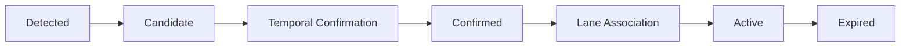
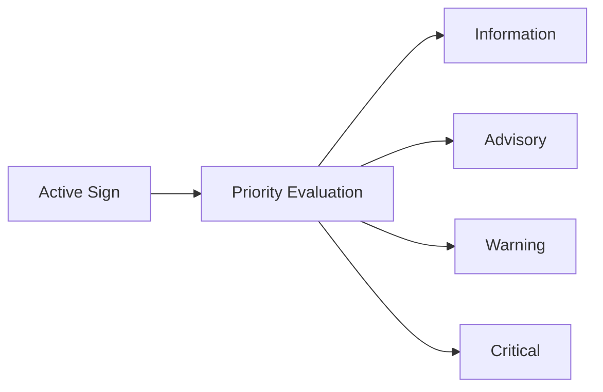

# Notebook Technique Audit — `notebooks/07.tsr_colab_production_lite_demo.ipynb`

> **Folder index:** [00.index.md](00.index.md) — Lấy: cấu trúc implementation layer và thứ tự đọc. Dùng ở: đặt audit cạnh notebook full reference và benchmark guide.
>
> **Mục tiêu file này:** trả lời trực tiếp ba câu hỏi cho notebook [notebooks/07.tsr_colab_production_lite_demo.ipynb](notebooks/07.tsr_colab_production_lite_demo.ipynb) — Lấy: artifact được audit để tách kỹ thuật tự viết khỏi năng lực có sẵn của model/runtime. Dùng ở: chứng minh phần nào của pipeline production-lite là downstream logic của nhóm:
>
> `1)` bạn đã code thêm kỹ thuật gì, `2)` phần nào là năng lực sẵn có của model/runtime, `3)` có tích hợp thêm branch đặc biệt nào không.
>
> **Phạm vi:** notebook hiện tại trên branch `duong_split_research`, có đối chiếu với notebook tương ứng ở ref `origin/vinhnpq/pha-hoai` để tách phần bổ sung downstream; không đánh đồng mọi khác biệt đó là nội dung của notebook hiện tại.

---

## Kết luận ngắn

- Notebook này **không đổi model**. Nó vẫn dùng `Ultralytics YOLO` nạp checkpoint `models/best.pt`, hoặc tải đúng artifact đó từ Hugging Face nếu local không có file.
- Phần bạn tự thêm vào nằm ở **lớp orchestration và feature logic quanh detector**: setup runtime, profile theo RAM, chọn input source, quality gate, ODD gate, tracking theo IoU, lifecycle, warning/HMI policy, `events.jsonl`, KPI proxy và optional GT eval.
- Notebook hiện tại **không tích hợp git branch bên ngoài trong runtime**. Không có `git clone`, `git checkout`, submodule, hay import theo branch name.
- Có một **downstream ref** là `origin/vinhnpq/pha-hoai` tiếp tục lịch sử notebook này. Khi so sánh trực tiếp notebook giữa hai ref, nhánh đó bổ sung `CLAHE`, `ROI filter`, một tinh chỉnh nhỏ ở blur metric, một hard-code local input path và một fix message GT; trong đó chỉ `CLAHE` và `ROI filter` là bổ sung kỹ thuật đáng kể, còn các phần đó **chưa có** trong notebook hiện tại của `duong_split_research`.
- Lifecycle state trong markdown đầu notebook hiện đã khớp với code: `CANDIDATE`, `CONFIRMED`, `ACTIVE`, `STALE`, `REJECTED`, `EXPIRED`. Notebook **không có** state riêng tên `SUPPRESSED`.
- Notebook hiện tại **chưa có vehicle applicability filter**. Các label như `No Cars`, `No Trucks`, `No Bus` chưa được lọc theo ego vehicle; nếu YOLO trả về các label này thì chúng đi qua `classify_family()` như label thường, phần lớn rơi về `default`.
- Video replay hiện có trong repo là `videos/14212806_3840_2160_60fps.mp4` (`3840x2160`, `1187` frame, `59.94 fps`). Notebook `07` dùng `skip = 0` ở profile `high/medium`, `skip = 1` ở profile `low`; đây là lịch inference theo frame video, không phải FPS xử lý đo được.

## 1. Kỹ thuật bạn đã code thêm trong notebook

| Nhóm | Kỹ thuật nằm trong notebook | Bằng chứng chính |
|---|---|---|
| Runtime bootstrap | Tự kiểm tra và cài dependency còn thiếu ngay trong notebook | Cell `16`: `ensure_packages()` với `ultralytics`, `opencv-python-headless`, `huggingface_hub`, `psutil`, `requests`, `gdown` |
| Resource-aware execution | Chọn profile `high / medium / low` theo RAM, tự degrade `imgsz`, `max_width`, `skip` | Cell `17`: `PROFILES`, `TOTAL_RAM_GB`, `PROFILE_NAME`, `PROFILE` |
| Input fallback orchestration | Ưu tiên video local, rồi Colab path, upload tay, Google Drive demo, cuối cùng smoke-test clip | Cell `20`: `FORCE_VIDEO_PATH`, `maybe_upload_video()`, `maybe_download_drive_demo()`, `FALLBACK_SMOKE_TEST_URL` |
| Preprocess hỗ trợ runtime | Resize frame lớn trước infer và scale bbox về lại frame gốc | Cell `25`: `preprocess()`, `scale_bbox()` |
| Domain mapping cho TSR | Gom class detector thành `family`, gán màu, severity, parse speed-limit từ label | Cell `25`: `classify_family()`, `color_for_family()`, `warning_level_for_family()`, `extract_speed_limit()` |
| Image quality gate | Heuristic blur / luma / dark ratio / glare và cờ `should_infer` | Cell `25`: `assess_frame_quality()` |
| ODD proxy gate | ODD phase-1 demo dựa trên `ego_speed_kph`, `odd_speed_range_kph` và quality trigger mạnh | Cell `28`: `odd_gate()` |
| Feature availability model | Tách `AVAILABLE / DEGRADED / UNAVAILABLE` từ ODD + quality | Cell `28`: `feature_state_from_quality()` |
| Temporal association | Ghép detection qua thời gian bằng IoU theo cùng `family` | Cell `28`: `update_tracks()` với `assoc_iou` |
| Sign lifecycle | State machine `CANDIDATE`, `CONFIRMED`, `ACTIVE`, `STALE`, `REJECTED`, `EXPIRED` cùng `hit_count` và `miss_count` | Cell `28`: `SignTrack`, `TRACK_CONFIG`, `update_tracks()` |
| Publish policy / HMI-lite | Chọn sign ưu tiên để publish theo `warning_level`, `confidence`, `hit_count` | Cell `28`: `choose_primary_track()` |
| Map fusion stub | Policy `camera_only`, `agreed`, `camera_override`, `map_override` ở mức demo | Cell `28`: `apply_map_fusion()` |
| Overlay stateful | Vẽ output theo `track_id`, `state`, `warning_level`, `feature_state` thay vì bbox thuần detector | Cell `25`: `draw_overlay()` |
| Machine-readable replay | Ghi `events.jsonl` theo từng frame, stream ra file thay vì giữ cả video history trong RAM | Cell `34`: `events_jsonl`, `event = {...}`, `f_jsonl.write(...)` |
| Demo review artifact | Xuất MP4 annotated, preview frames, summary counter cho quality/state/family/publish | Cell `34`: `output_video`, `preview_dir`, `summary` |
| KPI proxy sau replay | Thống kê feature-state ratio, quality/ODD reasons, confidence theo family, size-bin coverage, threshold sweep, confirmation latency | Cell `40`: `load_events_jsonl()`, `size_bin_for_bbox()`, `CONF_THRESH_SWEEP`, `track_first_active` |
| Optional GT evaluation | Nếu có JSON ground truth thì tính `TP/FP/FN`, `precision`, `recall`, `F1`, recall theo `size_bin`, bảng theo `family` hoặc `label` | Cell `40`: `load_optional_gt()`, `evaluate_against_gt()` |

## 2. Kỹ thuật nào model/runtime đã có sẵn

| Phần có sẵn | Notebook đang tận dụng thế nào | Không phải phần notebook tự phát minh |
|---|---|---|
| Detector `Ultralytics YOLO` | Cell `31`: `model = YOLO(str(WEIGHTS_PATH))` | Notebook không viết detector mới |
| Checkpoint `best.pt` | Dùng lại đúng artifact trong repo hoặc tải đúng file đó từ Hugging Face | Notebook không train lại model trong file này |
| Output per-box chuẩn YOLO | Cell `25`: lấy `results.boxes`, `box.cls`, `box.conf`, `box.xyxy` | `bbox + class + confidence` là output sẵn của model/runtime |
| Taxonomy class đã fine-tune trong checkpoint | Cell `31`: đọc `model.names`, `len(model.names)` | Notebook chỉ đọc class-name có sẵn, không định nghĩa lại head phân loại |
| Confidence threshold và `max_det` runtime | Cell `25`: gọi `model(..., conf=conf_thres, max_det=20)` | Đây là tham số inference của Ultralytics |
| NMS/inference pipeline của Ultralytics | Notebook chỉ gọi model end-to-end | Không có custom NMS riêng trong notebook |

Nhìn ngắn gọn: notebook chỉ dùng model như một **frame-level detector**, còn toàn bộ logic biến detector thành một **feature có trạng thái** là phần bạn code thêm bên ngoài model.

## 3. Các khối không phải năng lực sẵn có của model

Các phần sau **không phải** năng lực sẵn có của `best.pt` hay YOLO runtime:

- quality gate;
- ODD gate;
- track lifecycle;
- warning level/HMI policy;
- `events.jsonl`;
- KPI proxy;
- optional GT evaluator;
- map fusion stub;
- publish suppression policy.

Nếu bỏ các khối này đi, notebook sẽ quay về gần với baseline detector demo hơn là một production-lite replay.

Ngược lại, các khối sau **chưa có** trong notebook hiện tại:

- applicability filter theo loại xe ego;
- rule riêng cho `No Cars`, `No Trucks`, `No Bus`;
- lane association thật;
- ROI filter và CLAHE trong bản `duong_split_research`.

### 3.1 Stage Management nhìn từ notebook

Phần dưới đây là `conceptual model` để giải thích notebook đang cố mô phỏng điều gì ở lớp lifecycle. Nó không có nghĩa code hiện tại đã implement đầy đủ production path như lane association thật hay sign applicability thật.

#### Mục đích

Sau khi biển báo được phát hiện bởi mô hình nhận diện, hệ thống không đưa ra quyết định ngay lập tức. Thay vào đó, mỗi biển báo được quản lý theo một vòng đời để:

- giảm false positive từ detection;
- đảm bảo biển báo xuất hiện ổn định trong nhiều frame;
- tiến gần hơn tới việc xác định biển báo có thực sự áp dụng cho xe hiện tại;
- quản lý thời điểm kích hoạt và hủy bỏ hiệu lực của biển báo.

#### Pipeline

#### Stage Definition

| Stage | Mô tả | Điều kiện chuyển trạng thái |
|---|---|---|
| `Detected` | YOLO phát hiện biển báo trên một frame | Detection confidence vượt ngưỡng |
| `Candidate` | Biển báo xuất hiện nhưng chưa đủ bằng chứng | Tracking hoặc association thành công qua các frame đầu |
| `Confirmed` | Xác nhận là biển báo hợp lệ | Confidence đủ ổn định, tracking không bị mất, đạt ngưỡng hit |
| `Active` | Biển báo có hiệu lực đối với xe | Lane association và context filtering cùng policy publish đều pass |
| `Expired` | Biển báo không còn hiệu lực | Xe đi qua biển, timeout, hoặc sign bị thay thế |

#### State Transition

`Detected -> Candidate`

- detection confidence đạt ngưỡng;
- bounding box đủ ổn định;
- `track_id` được tạo hoặc detection được ghép vào track đang sống.

`Candidate -> Confirmed`

- xuất hiện liên tục `3-5` frame hoặc đạt `min_confirm_hits`;
- confidence không dao động lớn;
- tracking không bị mất.

Mục đích:

- loại bỏ false positive;
- tăng độ ổn định trước khi sign được phép đi vào logic feature.

`Confirmed -> Active`

- biển báo thuộc làn xe hiện tại;
- không bị context filtering loại bỏ;
- chưa hết hiệu lực.

Ví dụ:

- `Speed Limit 60`;
- `Stop`;
- `No Entry`.

`Active -> Expired`

- xe đã vượt qua biển báo;
- khoảng cách vượt ngưỡng;
- timeout;
- phát hiện biển `End Limit` hoặc biển thay thế.

Ý nghĩa:

- tăng độ tin cậy;
- giảm cảnh báo sai;
- duy trì trạng thái biển báo theo thời gian;
- làm đầu nối tốt hơn sang ISA, ACC và HMI.

Lưu ý audit:

- notebook hiện tại thực tế dùng lifecycle `CANDIDATE / CONFIRMED / ACTIVE / STALE / REJECTED / EXPIRED`;
- chưa có lane association thật, nên bước `Confirmed -> Active` mới chỉ là `active-lite` theo policy demo;
- suppress hiện được biểu diễn gián tiếp qua `warning_level = 0`, `feature_state` và việc không chọn `primary_track`.

### 3.2 Warning Level nhìn từ notebook

Phần dưới đây là `conceptual priority ladder` cho HMI/feature response. Trong code hiện tại, notebook implement bản proxy bằng số `warning_level 0..3`, không phải full production severity ladder hoàn chỉnh.

#### Mục đích

Không phải mọi biển báo đều cần phản ứng giống nhau. Sau khi lifecycle xác nhận sign ở trạng thái có thể publish, feature logic đánh giá mức độ ưu tiên để quyết định phản hồi phù hợp.

#### Pipeline

#### Warning Level Definition

| Level | Ý nghĩa | Hành động |
|---|---|---|
| `Information` | Chỉ cung cấp thông tin | Hiển thị biểu tượng trên Cluster/HUD |
| `Advisory` | Khuyến nghị | Hiển thị và nhắc tài xế ở mức nhẹ |
| `Warning` | Cảnh báo | Âm thanh, HUD hoặc cảnh báo trực quan |
| `Critical` | Can thiệp hỗ trợ nếu authority cho phép | ISA giảm tốc hoặc phối hợp với ADAS khác khi đủ điều kiện |

> Lưu ý: TSR không tự kích hoạt `AEB` chỉ dựa trên việc nhận diện biển báo. Mức `Critical` chỉ có ý nghĩa khi TSR được kết hợp với logic hệ thống rộng hơn.

#### Ví dụ

| Biển báo | Warning Level |
|---|---|
| `Parking` | `Information` |
| `Speed Limit` | `Advisory` |
| `Speed Limit` + xe vượt tốc độ | `Warning` |
| `No Entry` | `Warning` |
| `Stop` | `Warning` |
| `Speed Limit` kết hợp ISA | `Critical` |

#### Priority Evaluation

Hệ thống đánh giá dựa trên nhiều yếu tố:

- loại biển báo;
- mức độ tin cậy của detection hoặc track;
- lane association;
- trạng thái hiện tại của xe;
- vận tốc xe;
- khoảng cách tới biển báo;
- context filtering;
- trạng thái lifecycle của sign.

Ý nghĩa:

- chuẩn hóa phản hồi của hệ thống;
- tránh gây phiền nhiễu cho người lái;
- chỉ cảnh báo khi thực sự cần thiết;
- hỗ trợ ISA, ACC và HMI đưa ra phản hồi phù hợp với từng tình huống.

Lưu ý audit:

- notebook hiện tại dùng `Level 0..3` thay vì các nhãn `Information / Advisory / Warning / Critical`;
- theo tài liệu implementation hiện tại: `0` = chưa publish, `1` = sign thường, `2` = `Speed Limit` đã confirm, `3` = `Stop` hoặc `No Entry` ưu tiên cao;
- `Critical` ở đây nên hiểu là hướng thiết kế production, chưa phải behavior thực thi đầy đủ trong notebook.

## 4. Có tích hợp thêm branch đặc biệt nào không?

### 4.1 Trong notebook hiện tại: không

Không thấy dấu vết của việc notebook hiện tại:

- `git clone` repo khác;
- `git checkout` sang branch khác;
- import module theo đường dẫn branch-specific;
- kéo thêm tracker/model branch riêng như `ByteTrack`, `Deep SORT`, OCR branch, lane branch.

Branch hiện có trong repo:

- file notebook này có mặt trên `duong_split_research` và `origin/duong_split_research`;
- file này **không có** trên `master`, `duong_branch`, `duong_refactor`, `origin/master`, `origin/duong_branch`, `origin/duong_refactor`.

Kết luận phù hợp nhất: notebook hiện tại là artifact riêng của nhánh nghiên cứu `duong_split_research`, nhưng **không tích hợp branch bên ngoài trong chính nội dung notebook**.

### 4.2 Có một downstream ref khác, nhưng chưa được nhập vào notebook hiện tại

Path history của notebook hiện ra các mốc:

- `c91ca30` — `Rearrange research details`
- `5a58d83` — `sync up with the jupyter`
- `abef027` — `Update`

Ngoài ra, repo có ref `origin/vinhnpq/pha-hoai` tiếp tục lịch sử này. Khi đọc notebook ở ref đó, có thêm dấu vết:

- `preprocess(..., clahe=False)`;
- `USE_CLAHE`;
- `USE_ROI_FILTER`;
- `filter_by_roi(...)`.

Đối chiếu cell-by-cell cho thấy ref `origin/vinhnpq/pha-hoai` khác `duong_split_research` ở đúng `5` cell: `20`, `25`, `28`, `34`, `40`.

| Cell | Update ở `origin/vinhnpq/pha-hoai` | Đánh giá audit |
|---|---|---|
| `20` | `FORCE_VIDEO_PATH` bị hard-code thành `/home/vinhnpq1/Workspace/adas-tsr/videos/test.mp4`; đồng thời `DRIVE_VIDEO_URL` bị xóa về chuỗi rỗng | Đây là cấu hình máy cá nhân, không phải bổ sung kỹ thuật pipeline. Nếu nhập lại nguyên xi sẽ làm notebook kém portable |
| `25` + `34` | `preprocess()` nhận thêm cờ `clahe`; bổ sung `apply_clahe()` và notebook gọi thật trong inference loop qua `USE_CLAHE` | Đây là bổ sung kỹ thuật có tác động thực tế: tăng local contrast trước detector trong điều kiện ánh sáng khó |
| `25` + `28` + `34` | Thêm `filter_by_roi()`, khai báo cờ `USE_ROI_FILTER`, rồi lọc detection sau khi scale bbox về frame gốc và trước `update_tracks()` | Đây là bổ sung kỹ thuật có tác động thực tế: heuristic loại các box ở vùng ảnh ít khả năng là biển báo hợp lệ |
| `25` | Đổi blur metric từ `cv2.Laplacian(..., cv2.CV_64F)` sang `cv2.CV_16S`; thêm `DEFAULT_HSV_RANGES` | `CV_16S` là tinh chỉnh heuristic nhỏ. `DEFAULT_HSV_RANGES` hiện không được dùng ở cell nào khác, nên là code dự phòng hoặc dở dang hơn là feature hoàn chỉnh |
| `40` | Sửa câu `print(...)` ở phần optional GT evaluation để không còn lỗi xuống dòng trong string | Cleanup nhỏ, không đổi thuật toán |

Nếu chỉ tính các bổ sung có ý nghĩa kỹ thuật, `origin/vinhnpq/pha-hoai` thêm `4` ý chính so với `duong_split_research`:

- tiền xử lý `CLAHE` có thể bật/tắt;
- post-filter theo `ROI` trước tracking;
- wiring thực thi qua `USE_CLAHE` và `USE_ROI_FILTER`;
- tinh chỉnh nhỏ heuristic đo blur.

Các bổ sung này **không xuất hiện** trong notebook hiện tại ở `duong_split_research`. Nghĩa là:

- có tồn tại một nhánh notebook mở rộng hơn ở ref khác;
- nhưng notebook bạn yêu cầu nghiên cứu **chưa tích hợp** các khối xử lý đó.

Nếu bạn đang hỏi theo nghĩa “có thêm experimental branch nào đã nhập vào notebook hiện tại chưa”, câu trả lời là **chưa**.

## 5. Phát hiện quan trọng khi đọc notebook

### 5.1 Lifecycle state đã khớp giữa markdown và code

Notebook hiện mô tả đúng lifecycle đang có trong code ở cell `28`:

- `CANDIDATE`
- `CONFIRMED`
- `ACTIVE`
- `STALE`
- `REJECTED`
- `EXPIRED`

Không có state riêng tên `SUPPRESSED`. Hành vi suppress hiện được biểu diễn gián tiếp qua:

- `warning_level = 0`;
- `feature_state`;
- `odd_ok = False`;
- `quality['should_infer'] = False`;
- việc `choose_primary_track()` không chọn track phù hợp để publish.

Điểm này quan trọng vì nếu trình bày notebook như có full suppress state machine thì sẽ overclaim.

### 5.2 `map_fusion` mới là policy stub

Notebook có `camera_override` và `map_override`, nhưng đây chỉ là policy demo dựa trên:

- `map_speed_limit_kph`;
- `track.confidence`;
- `hit_count`.

Nó chưa phải map fusion production vì chưa có:

- HD map;
- localization confidence;
- lane association;
- route intent.

### 5.3 Chưa có vehicle applicability filter

Notebook hiện tại chưa phân biệt ego vehicle là xe con, xe tải hay xe bus. Vì vậy:

- `No Cars` chưa được đánh dấu là applicable riêng cho ego car;
- `No Trucks` và `No Bus` chưa bị ignore hoặc suppress khi ego vehicle là xe con;
- các label này không nằm trong `SEVERE_FAMILIES` hoặc `SPEED_FAMILIES`, nên thường rơi về family `default` và có thể nhận `warning_level = 1` sau khi đủ confirm và quality OK.

Nếu muốn biến notebook thành demo gần feature hơn, nên thêm một `vehicle_applicability_filter()` sau detection/family mapping và trước `update_tracks()`.
