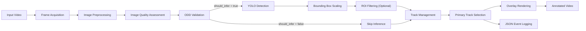
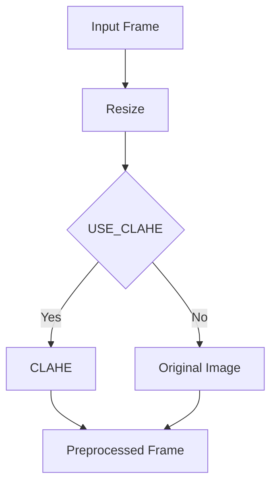
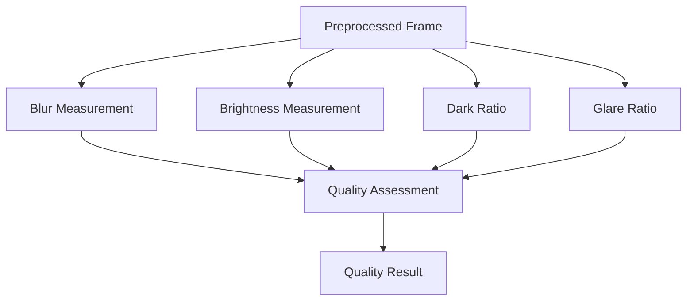
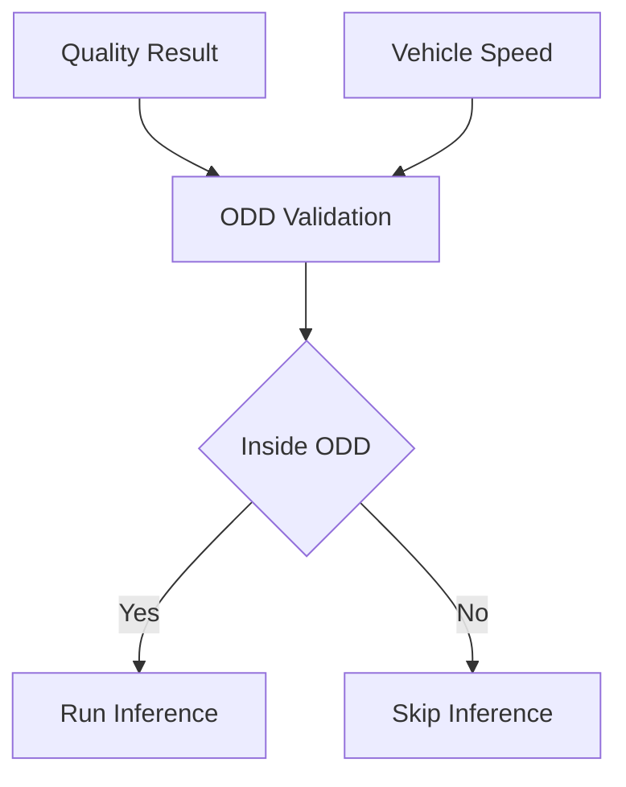
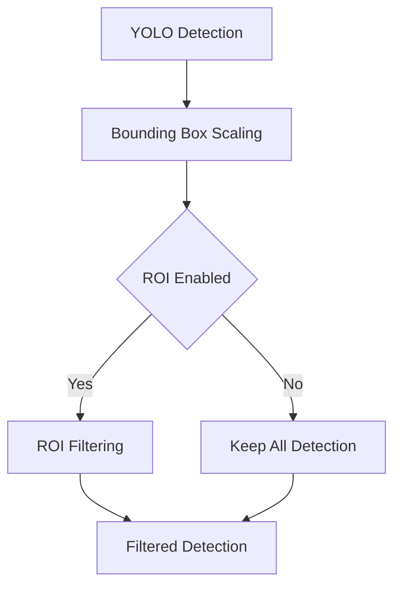
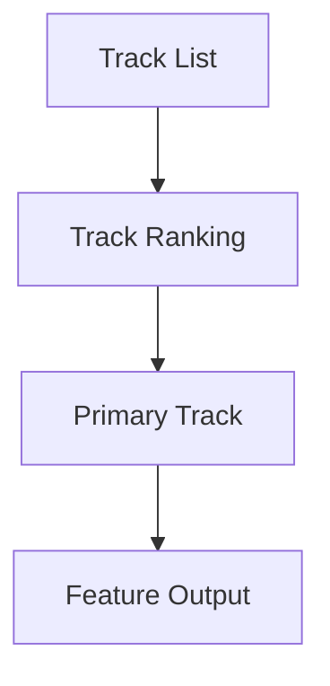
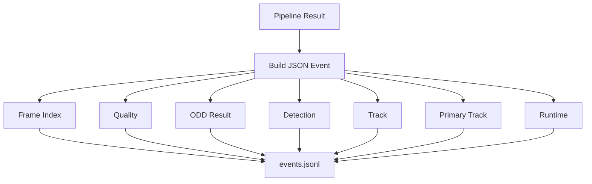

# Production-Lite Traffic Sign Recognition Pipeline

## Tổng quan

Pipeline được xây dựng theo hướng **production-lite**, mô phỏng luồng xử lý của một hệ thống Traffic Sign Recognition (TSR) trong ADAS. Khác với một demo YOLO thông thường chỉ thực hiện phát hiện trên từng khung hình độc lập, pipeline này bổ sung các thành phần tiền xử lý, đánh giá chất lượng ảnh, kiểm tra điều kiện vận hành (Operational Design Domain - ODD), quản lý đối tượng qua nhiều khung hình, lựa chọn biển báo ưu tiên và ghi log sự kiện nhằm tăng tính ổn định, khả năng phân tích và mở rộng.

Luồng xử lý tổng quát:



---

# 1. Frame Acquisition

## Mục tiêu

Đọc tuần tự từng khung hình từ video đầu vào và khởi tạo toàn bộ môi trường thực thi cho pipeline.

## Input

- Video đầu vào (`INPUT_VIDEO`)

## Kỹ thuật

Pipeline sử dụng `cv2.VideoCapture` để:

- Đọc từng frame.
- Đọc FPS của video.
- Lấy kích thước khung hình.
- Xác định tổng số frame.
- Khởi tạo `VideoWriter` cho video đầu ra.

Đây là bước chuẩn bị dữ liệu và chưa thực hiện xử lý thị giác máy tính.

## Output

- Current Frame
- FPS
- Resolution
- Video Writer

---

# 2. Image Preprocessing

## Mục tiêu

Chuẩn hóa ảnh đầu vào nhằm giảm chi phí tính toán và cải thiện chất lượng trước khi thực hiện suy luận.

## Input

Frame gốc.

## Kỹ thuật

### Resize

Nếu chiều rộng ảnh vượt quá ngưỡng cấu hình (`PROFILE["max_width"]`), ảnh sẽ được resize nhưng vẫn giữ nguyên tỷ lệ.

Mục đích:

- Giảm thời gian suy luận.
- Giảm lượng bộ nhớ sử dụng.
- Duy trì tốc độ xử lý ổn định.

### CLAHE (Optional)

Nếu `USE_CLAHE=True`, pipeline áp dụng **Contrast Limited Adaptive Histogram Equalization (CLAHE)**.

Mục tiêu:

- Tăng tương phản cục bộ.
- Hỗ trợ cải thiện chất lượng ảnh trong điều kiện ánh sáng yếu.
- Hạn chế khuếch đại nhiễu so với Histogram Equalization truyền thống.

CLAHE là bước tiền xử lý ảnh và không thay đổi logic phát hiện của mô hình.

## Output

Frame đã được chuẩn hóa.



---

# 3. Image Quality Assessment

## Mục tiêu

Đánh giá chất lượng ảnh trước khi đưa vào mô hình nhằm hạn chế việc suy luận trên các khung hình có chất lượng quá thấp.

## Input

Frame sau tiền xử lý.

## Kỹ thuật

Pipeline tính toán các chỉ số thống kê trên ảnh xám:

- Blur (Sharpness)
- Brightness
- Dark Ratio
- Glare Ratio

Các chỉ số này được sử dụng để tạo ra tập các nguyên nhân (`quality reasons`) và cờ `should_infer`.

Đây là một **heuristic quality gate**, không sử dụng mô hình học máy.

## Output

Đối tượng `quality` bao gồm:

- Quality Metrics
- Quality Reasons
- should_infer



---

# 4. ODD Validation

## Mục tiêu

Kiểm tra điều kiện vận hành hiện tại có nằm trong miền thiết kế hoạt động (Operational Design Domain) đã cấu hình hay không.

## Input

- Quality Result
- Ego Speed
- Speed Range

## Kỹ thuật

Pipeline kết hợp:

- Chất lượng ảnh.
- Tốc độ xe.

để sinh ra:

- odd_ok
- odd_reasons

Nếu điều kiện không đạt, pipeline có thể bỏ qua bước suy luận nhằm giảm cảnh báo sai.

## Output

- odd_ok
- odd_reasons



---

# 5. YOLO Detection

## Mục tiêu

Phát hiện các biển báo giao thông trong khung hình.

## Input

Frame vượt qua Quality Gate.

## Kỹ thuật

Pipeline gọi:

```
detect_with_yolo()
```

Mô hình trả về:

- Bounding Box
- Label
- Confidence
- Family
- Speed Limit (nếu có)

Đồng thời pipeline đo thời gian suy luận để cập nhật FPS trung bình.

## Output

Danh sách Detection.

---

# 6. Bounding Box Scaling

## Mục tiêu

Quy đổi Bounding Box từ ảnh resize về kích thước ảnh gốc.

## Input

Bounding Box trên ảnh resize.

## Kỹ thuật

Pipeline sử dụng:

```
scale_bbox()
```

để chuyển toàn bộ tọa độ sang hệ tọa độ của frame ban đầu.

## Output

Bounding Box trên frame gốc.

---

# 7. ROI Filtering (Optional)

## Mục tiêu

Loại bỏ các Detection nằm ngoài vùng quan tâm (Region of Interest).

## Input

Detection sau khi scale.

## Kỹ thuật

Nếu `USE_ROI_FILTER=True`, pipeline gọi:

```
filter_by_roi()
```

ROI Filtering được thực hiện **sau YOLO Detection**.

Mục tiêu:

- Giảm False Positive.
- Chỉ giữ các Detection có khả năng liên quan đến làn đường phía trước.

## Output

Detection sau khi lọc.



---

# 8. Track Management

## Mục tiêu

Duy trì vòng đời của biển báo qua nhiều khung hình nhằm tăng tính ổn định.

## Input

- Detection
- Track List
- Quality
- ODD Result

## Kỹ thuật

Pipeline gọi:

```
update_tracks()
```

Trong bước này hệ thống:

- Ghép Detection với Track hiện có.
- Cập nhật Track ID.
- Cập nhật Hit Count.
- Cập nhật Miss Count.
- Cập nhật Confidence.
- Cập nhật State.
- Cập nhật Warning Level.

Track Management giúp giảm hiện tượng nhấp nháy của Detection giữa các frame.

## Output

Track List.

---

# 9. Primary Track Selection

## Mục tiêu

Lựa chọn một biển báo ưu tiên để hiển thị.

## Input

Track List.

## Kỹ thuật

Pipeline gọi:

```
choose_primary_track()
```

Việc lựa chọn dựa trên các thông tin đã được cập nhật của Track như:

- Warning Level.
- Confidence.
- Hit Count.

Pipeline chỉ publish một Primary Track tại mỗi thời điểm.

## Output

Primary Track.



---

# 10. Overlay Rendering

## Mục tiêu

Hiển thị kết quả xử lý lên video đầu ra.

## Input

- Frame
- Track List
- Quality
- Feature State

## Kỹ thuật

Pipeline gọi:

```
draw_overlay()
```

Overlay bao gồm:

- Bounding Box
- Label
- Warning Level
- Feature State
- FPS

## Output

Annotated Frame.

---

# 11. JSON Event Logging

## Mục tiêu

Lưu toàn bộ thông tin xử lý của từng khung hình để phục vụ phân tích, kiểm thử và replay.

## Input

Kết quả toàn bộ pipeline.

## Kỹ thuật

Sau mỗi frame, pipeline tạo một đối tượng JSON và ghi tuần tự vào tệp `.jsonl`.

Thông tin được lưu gồm:

- Frame Index
- Feature State
- ODD Result
- Image Quality
- Detection
- Track
- Primary Track
- Runtime Information

Định dạng JSON Lines giúp xử lý video dài mà không cần giữ toàn bộ dữ liệu trong bộ nhớ.

## Output

```
events.jsonl
```



---

# 12. Output

Pipeline sinh ra ba loại kết quả:

- **Annotated Video:** Video đầu ra chứa Bounding Box, Label, Warning Level và Feature State.
- **JSON Event Log:** Tệp `events.jsonl` lưu toàn bộ thông tin xử lý theo từng frame.
- **Preview Frames:** Một số khung hình tiêu biểu phục vụ minh họa và đánh giá nhanh kết quả.

Ba đầu ra này hỗ trợ ba mục tiêu khác nhau:

| Output | Mục đích |
|---------|----------|
| Annotated Video | Trực quan hóa kết quả phát hiện và theo dõi biển báo |
| JSON Event Log | Phân tích, replay và đánh giá hành vi của pipeline |
| Preview Frames | Minh họa nhanh các trường hợp phát hiện tiêu biểu |