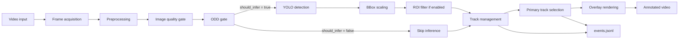
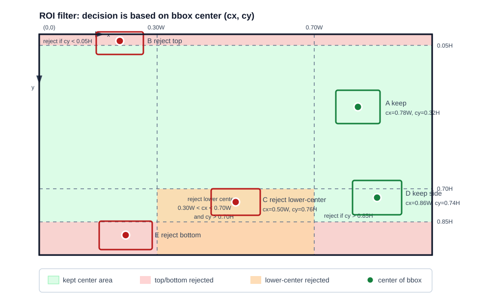
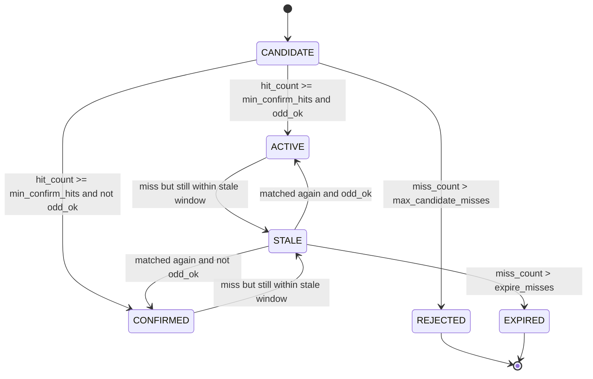

# Phân tích công thức và ý tưởng tính toán của pipeline TSR production-lite

> Tài liệu này được viết dựa trên notebook [07.tsr_colab_production_lite_demo.ipynb](07.tsr_colab_production_lite_demo.ipynb), luồng tổng quan trong [09.release_flow.md](09.release_flow.md), và bản notebook ở tham chiếu Git `origin/vinhnpq/pha-hoai`. Mục tiêu là giải thích các kỹ thuật trong pipeline bằng văn viết, kèm công thức tính toán để người đọc hiểu vì sao từng khối tồn tại và tác động đến Traffic Sign Recognition (TSR) như thế nào.

## 1. Phạm vi phân tích

Notebook production-lite không phải là một bản triển khai production hoàn chỉnh. Đây là bản demo có mục đích rõ ràng: dùng detector YOLO ở mức frame-level rồi bổ sung các lớp xử lý cần thiết để mô phỏng hành vi của một tính năng ADAS có trạng thái. Khi đối chiếu trực tiếp notebook, cần tách rõ hai phiên bản:

- **Notebook hiện tại trên `duong_split_research`**: có video input, resize, quality gate, ODD gate, YOLO detection, bbox scaling, tracking theo IoU, temporal confirmation, warning level, primary track, overlay, JSONL event log và KPI replay. Ở bản này, `preprocess()` chỉ resize; chưa có `apply_clahe()` và chưa có `filter_by_roi()`.
- **Notebook ở `origin/vinhnpq/pha-hoai`**: bổ sung `apply_clahe()`, thêm tham số `clahe` vào `preprocess()`, khai báo `USE_CLAHE = True`, bổ sung `filter_by_roi()`, khai báo `USE_ROI_FILTER = True`, gọi ROI filter sau bbox scaling, và đổi phép đo Laplacian blur từ `cv2.CV_64F` sang `cv2.CV_16S`.

Vì vậy, phần CLAHE và ROI filter bên dưới được viết theo đúng mã nguồn ở `origin/vinhnpq/pha-hoai`. Các phần còn lại bám theo notebook hiện tại và cũng khớp với nhánh `origin/vinhnpq/pha-hoai`, trừ khác biệt nhỏ về kiểu dữ liệu Laplacian đã nêu ở trên.

Tài liệu này cũng sửa lại cách viết công thức: tất cả công thức dạng block dùng cú pháp `$$ ... $$` để phù hợp với `pymdownx.arithmatex` trong MkDocs. Tránh dùng dạng display math bằng ngoặc vuông của LaTeX vì đây là nguồn gây lỗi render trong file cũ.

## 2. Luồng xử lý tổng thể

Pipeline bắt đầu từ video đầu vào, đọc từng frame bằng OpenCV, tiền xử lý ảnh, đánh giá chất lượng, kiểm tra ODD, chạy YOLO khi frame đủ điều kiện, sau đó biến các detection rời rạc thành track có vòng đời. Kết quả cuối cùng không chỉ là video có overlay, mà còn là `events.jsonl` để replay và giải thích quyết định.



Ý tưởng quan trọng là detector chỉ trả lời câu hỏi "khung hình này có nhìn thấy biển nào không". Một tính năng ADAS cần trả lời câu hỏi khó hơn: "biển này có đáng tin không, có liên quan không, có nên publish cho người lái không, và tại sao". Các khối quality, ODD, tracking và logging được thêm vào để trả lời những câu hỏi đó.

## 3. Ký hiệu chung

Trong các công thức bên dưới:

- `I` là frame ảnh màu đầu vào.
- `Y` là ảnh xám hoặc kênh độ sáng sau khi chuyển đổi từ `I`.
- `H`, `W` là chiều cao và chiều rộng ảnh.
- `N = H x W` là tổng số pixel trên ảnh xám.
- `B = (x1, y1, x2, y2)` là bounding box ở dạng tọa độ góc trên bên trái và góc dưới bên phải.
- `conf` là điểm tin cậy của detection do YOLO trả về.
- `k` là chỉ số frame trong video.

Nếu cần đổi ảnh màu sang độ sáng, có thể hiểu gần đúng theo công thức luma:

$$
Y(x,y) = 0.299R(x,y) + 0.587G(x,y) + 0.114B(x,y)
$$

OpenCV đọc ảnh theo thứ tự BGR, nhưng về mặt ý tưởng, công thức trên vẫn diễn tả đúng việc biến ảnh màu thành một kênh độ sáng để tính blur, dark ratio và glare ratio.

### 3.1 Cách đọc hệ tọa độ ảnh

Trong OpenCV, gốc tọa độ ảnh nằm ở góc trên bên trái. Trục `x` tăng từ trái sang phải, trục `y` tăng từ trên xuống dưới. Vì vậy, `y` càng lớn thì điểm đó càng nằm gần đáy ảnh, không phải càng cao như hệ trục toán học thông thường.

Với một bbox:

$$
B = (x_1, y_1, x_2, y_2)
$$

tâm bbox là:

$$
c_x = \frac{x_1 + x_2}{2},\quad
c_y = \frac{y_1 + y_2}{2}
$$

Ví dụ frame `1280 x 720` có `W = 1280`, `H = 720`. Một điểm có `c_y = 650` nằm rất thấp vì:

$$
\frac{650}{720} \approx 0.90
$$

tức là gần 90% chiều cao tính từ mép trên xuống. Đây là lý do các điều kiện ROI như `cy > 0.85H` được hiểu là "tâm bbox nằm ở 15% thấp nhất của ảnh".

Điểm quan trọng: ROI filter trong notebook không xét toàn bộ diện tích bbox và cũng không crop ảnh trước khi chạy YOLO. Nó chạy sau detection và quyết định giữ/loại detection dựa trên **tâm bbox** `(cx, cy)`.

## 4. Block 1 - Video input và frame acquisition

Khối này đọc video bằng `cv2.VideoCapture`, lấy metadata như FPS, kích thước frame và tổng số frame, sau đó khởi tạo `cv2.VideoWriter` để ghi video đầu ra. Về mặt tính toán, đây là lớp đồng bộ dữ liệu theo thời gian, chưa làm computer vision.

Nếu video có FPS là `f`, frame thứ `k` tương ứng với thời điểm:

$$
t_k = \frac{k}{f}
$$

Trong pipeline minh họa, timestamp này chưa được dùng như một tín hiệu riêng, nhưng nó là nền tảng để tính latency, confirmation delay và replay KPI trong hệ thống production thực tế.

## 5. Block 2 - Preprocessing

Preprocessing có hai mục tiêu. Thứ nhất là giảm kích thước ảnh để inference nhanh hơn. Thứ hai là chuẩn hóa hoặc cải thiện chất lượng ảnh trước khi đưa vào detector. Trong notebook hiện tại trên `duong_split_research`, `preprocess()` chỉ resize theo `max_width`. Trong tham chiếu `origin/vinhnpq/pha-hoai`, `preprocess(frame, max_width, clahe=False)` có thêm bước CLAHE khi `USE_CLAHE = True`.

### 5.1 Resize giữ nguyên tỷ lệ ảnh

Nếu frame gốc có kích thước `W x H` và cấu hình chỉ cho phép chiều rộng tối đa `W_max`, hệ số scale được tính là:

$$
s =
\begin{cases}
\frac{W_\text{max}}{W}, & W > W_\text{max} \\
1, & W \leq W_\text{max}
\end{cases}
$$

Kích thước mới là:

$$
W' = \lfloor sW \rfloor
$$

$$
H' = \lfloor sH \rfloor
$$

Giữ cùng một hệ số `s` cho cả chiều rộng và chiều cao giúp biển báo không bị méo. Điều này quan trọng với TSR vì hình tròn, tam giác, bát giác và chữ số trên biển đều là tín hiệu thị giác quan trọng.

Chi phí xử lý ảnh và inference thường tăng theo số pixel:

$$
C \propto W \times H
$$

Ví dụ, khi resize từ `1920 x 1080` xuống `640 x 360`, số pixel giảm từ:

$$
1920 \times 1080 = 2{,}073{,}600
$$

còn:

$$
640 \times 360 = 230{,}400
$$

Tức là giảm xấp xỉ:

$$
\frac{2{,}073{,}600}{230{,}400} \approx 9
$$

lần số pixel cần xử lý. Đổi lại, biển báo nhỏ ở xa có thể bị mất chi tiết, đặc biệt là chữ số tốc độ.

### 5.2 Scale bounding box ngược về frame gốc

YOLO chạy trên frame đã resize, nhưng overlay và event log cần tọa độ trên frame gốc. Nếu ảnh resize có kích thước `W_p x H_p`, frame gốc có kích thước `W_o x H_o`, hệ số đổi tọa độ là:

$$
s_x = \frac{W_o}{W_p}
$$

$$
s_y = \frac{H_o}{H_p}
$$

Với bbox trên ảnh resize là `(x1, y1, x2, y2)`, bbox trên frame gốc là:

$$
x'_1 = s_x x_1,\quad x'_2 = s_x x_2
$$

$$
y'_1 = s_y y_1,\quad y'_2 = s_y y_2
$$

Đây là phép biến đổi tọa độ từ không gian detector về không gian hiển thị.

Ví dụ frame gốc `1920 x 1080` được resize xuống `640 x 360`. Khi đó:

$$
s_x = \frac{1920}{640} = 3,\quad
s_y = \frac{1080}{360} = 3
$$

Nếu YOLO trả bbox trên ảnh resize:

$$
B_p = (180, 90, 230, 140)
$$

thì bbox tương ứng trên frame gốc là:

$$
B_o = (540, 270, 690, 420)
$$

Tâm bbox trên ảnh resize là `(205, 115)`, còn tâm bbox trên frame gốc là `(615, 345)`. Nếu dùng nhầm bbox resize để vẽ lên frame gốc, ô vẽ sẽ nhỏ hơn và lệch về góc trên bên trái. Đây là lỗi rất dễ gặp khi detector chạy trên ảnh đã thu nhỏ nhưng overlay lại vẽ lên ảnh gốc.

### 5.3 CLAHE - Contrast Limited Adaptive Histogram Equalization

CLAHE là biến thể của histogram equalization. Điểm khác biệt nằm ở chữ "adaptive" và "contrast limited": thay vì cân bằng histogram trên toàn ảnh, CLAHE chia ảnh thành các tile nhỏ, cân bằng từng tile, giới hạn mức khuếch đại histogram, rồi nội suy giữa các tile để tránh biên gãy.

Trong tham chiếu `origin/vinhnpq/pha-hoai`, CLAHE không áp dụng trực tiếp lên ba kênh BGR. Mã nguồn chuyển frame sang không gian màu LAB, tách kênh sáng `L`, áp dụng `cv2.createCLAHE(clipLimit=2.0, tileGridSize=(8, 8))` lên kênh `L`, rồi ghép lại với hai kênh màu `a`, `b` và chuyển về BGR. Cách này chủ yếu thay đổi độ sáng và tương phản, đồng thời hạn chế làm lệch màu của biển báo.

#### Histogram của một tile

Giả sử tile `T` có `n_T` pixel và kênh sáng có `L_g` mức xám, thường là `L_g = 256`. Histogram của tile tại mức xám `i` là:

$$
h_T(i) = \sum_{p \in T} \mathbf{1}\left(Y(p) = i\right)
$$

Trong đó `1(...)` là hàm chỉ thị: bằng `1` nếu điều kiện đúng, bằng `0` nếu sai.

#### Giới hạn histogram bằng clip limit

AHE thông thường có thể khuếch đại nhiễu quá mạnh. CLAHE cắt các bin vượt ngưỡng `C`:

$$
h_T^\text{clip}(i) = \min(h_T(i), C)
$$

Phần histogram bị cắt ra là:

$$
E = \sum_{i=0}^{L_g-1} \max(h_T(i) - C, 0)
$$

Phần dư này được phân bố lại cho các bin còn lại. Một cách mô tả đơn giản là:

$$
h_T^\text{redist}(i) = h_T^\text{clip}(i) + \frac{E}{L_g}
$$

Trong OpenCV, việc phân bố lại có thêm chi tiết làm tròn, nhưng ý tưởng chính là không để một mức xám chiếm ưu thế quá lớn.

#### Tạo CDF và ánh xạ mức xám

Từ histogram đã clip và phân bố lại, ta tính xác suất của từng mức xám:

$$
p_T(i) = \frac{h_T^\text{redist}(i)}{n_T}
$$

Hàm phân phối tích lũy là:

$$
F_T(k) = \sum_{i=0}^{k} p_T(i)
$$

Mức xám đầu ra của pixel có giá trị `k` trong tile `T` được ánh xạ thành:

$$
Y'_T(p) = (L_g - 1)F_T(Y(p))
$$

Công thức này làm các mức xám trong tile được trải rộng hơn, nên tương phản cục bộ tăng lên.

#### Nội suy giữa các tile

Nếu pixel nằm gần biên giữa bốn tile lân cận, CLAHE không lấy kết quả của một tile duy nhất. Thay vào đó, nó nội suy song tuyến tính. Gọi bốn ánh xạ histogram lân cận là `M00`, `M10`, `M01`, `M11`, và `a`, `b` là vị trí tương đối của pixel theo trục ngang và dọc:

$$
Y'(x,y) =
(1-a)(1-b)M_{00}(Y)
+ a(1-b)M_{10}(Y)
+ (1-a)bM_{01}(Y)
+ abM_{11}(Y)
$$

Nội suy này giúp kết quả không xuất hiện ranh giới rõ giữa các tile.

#### Ý nghĩa đối với TSR

Biển báo thường nhỏ, có màu sắc và viền hình học rõ, nhưng rất dễ bị nền đường, bóng cây hoặc ngược sáng làm giảm tương phản. CLAHE giúp tăng tương phản cục bộ của biển so với nền mà không khuếch đại nhiễu quá mức như histogram equalization toàn cục. Tuy nhiên, CLAHE không phục hồi được thông tin đã mất: ảnh bị motion blur nặng, cháy sáng hoàn toàn hoặc biển quá nhỏ sau resize vẫn không thể được "sửa" bằng CLAHE.

## 6. Block 3 - Image quality assessment

Quality assessment là lớp heuristic dùng để quyết định frame hiện tại có đủ đáng tin để chạy detector và publish kết quả hay không. Cả notebook hiện tại và bản ở `origin/vinhnpq/pha-hoai` đều dùng hàm `assess_frame_quality()` với bốn chỉ số: `blur_var`, `mean_luma`, `dark_ratio`, `bright_ratio`.

### 6.1 Blur measurement bằng Variance of Laplacian

Ảnh mờ thường mất biên cạnh. Laplacian là đạo hàm bậc hai, nhạy với biên và chi tiết nhỏ. Một kernel Laplacian phổ biến là:

$$
K =
\begin{bmatrix}
0 & 1 & 0 \\
1 & -4 & 1 \\
0 & 1 & 0
\end{bmatrix}
$$

Ảnh Laplacian được tính bằng tích chập:

$$
L(x,y) = (K * Y)(x,y)
$$

Sau đó lấy phương sai của ảnh Laplacian:

$$
\mu_L = \frac{1}{N}\sum_{x,y} L(x,y)
$$

$$
\mathrm{blur\_var} =
\frac{1}{N}\sum_{x,y}\left(L(x,y)-\mu_L\right)^2
$$

Ảnh sắc nét có nhiều cạnh mạnh, nên `blur_var` cao. Ảnh mờ có cạnh bị làm mềm, nên `blur_var` thấp. Notebook hiện tại tính Laplacian bằng `cv2.CV_64F`, còn bản ở `origin/vinhnpq/pha-hoai` dùng `cv2.CV_16S`. Công thức và ý tưởng tính toán giống nhau; khác biệt nằm ở kiểu dữ liệu trung gian trước khi lấy phương sai. Cả hai bản đều gắn reason `LOW_SHARPNESS` khi:

$$
\mathrm{blur\_var} < 45
$$

Trong mã nguồn hiện tại, `LOW_SHARPNESS` làm `quality_ok = false`, nhưng không nhất thiết chặn inference. Điều này phù hợp với bản demo: frame hơi mờ vẫn có thể chạy YOLO, nhưng kết quả cần được đánh dấu là degraded.

### 6.2 Mean brightness

Độ sáng trung bình của frame là:

$$
\mathrm{mean\_luma} =
\frac{1}{N}\sum_{x,y} Y(x,y)
$$

Giá trị thấp cho thấy ảnh tối, detector có thể mất màu và biến dạng biển báo. Notebook gắn reason `TOO_DARK` nếu:

$$
\mathrm{mean\_luma} < 45
$$

hoặc nếu tỷ lệ pixel tối vượt ngưỡng được nêu ở mục tiếp theo.

### 6.3 Dark ratio

Dark ratio đo tỷ lệ pixel quá tối:

$$
\mathrm{dark\_ratio} =
\frac{1}{N}\sum_{x,y}\mathbf{1}\left(Y(x,y) < 35\right)
$$

Notebook gắn reason `TOO_DARK` nếu:

$$
\mathrm{dark\_ratio} > 0.55
$$

Chỉ số này bổ sung cho `mean_luma`. Một frame có độ sáng trung bình vừa phải nhưng hơn nửa ảnh bị tối vẫn có thể là trường hợp xấu với TSR, vì biển báo có thể nằm trong vùng tối.

### 6.4 Bright ratio và glare

Bright ratio đo tỷ lệ pixel gần bão hòa sáng:

$$
\mathrm{bright\_ratio} =
\frac{1}{N}\sum_{x,y}\mathbf{1}\left(Y(x,y) > 245\right)
$$

Notebook gắn reason `GLARE` nếu:

$$
\mathrm{bright\_ratio} > 0.18
$$

Ảnh bị glare hoặc cháy sáng có thể làm detector thấy sai biển, mất viền đỏ/vàng, hoặc nhầm vùng sáng với biển báo.

### 6.5 Quality decision

Tập reason của frame được tính theo các điều kiện trên:

$$
\mathrm{reasons} =
\{\mathrm{LOW\_SHARPNESS}, \mathrm{TOO\_DARK}, \mathrm{GLARE}\}
\cap \mathrm{triggered\_conditions}
$$

Frame được xem là tốt khi không có reason nào:

$$
\mathrm{quality\_ok} \Leftrightarrow |\mathrm{reasons}| = 0
$$

Notebook chỉ bỏ qua detector trong hai trường hợp nặng là `GLARE` và `TOO_DARK`:

$$
\mathrm{should\_infer}
\Leftrightarrow
\mathrm{GLARE} \notin \mathrm{reasons}
\land
\mathrm{TOO\_DARK} \notin \mathrm{reasons}
$$

Đây là một quy tắc thực dụng. Ảnh blur nhẹ có thể vẫn còn thông tin hữu ích để tracking tiếp tục, nhưng ảnh quá tối hoặc cháy sáng thường gây rủi ro cao hơn, nên pipeline chặn inference.

Ví dụ cách đọc quality gate:

| Frame | `blur_var` | `mean_luma` | `dark_ratio` | `bright_ratio` | Reasons | `quality_ok` | `should_infer` |
|---|---:|---:|---:|---:|---|---|---|
| A - ảnh rõ, sáng vừa | `120` | `88` | `0.04` | `0.01` | `[]` | `true` | `true` |
| B - hơi mờ | `30` | `95` | `0.03` | `0.01` | `[LOW_SHARPNESS]` | `false` | `true` |
| C - quá tối | `80` | `40` | `0.60` | `0.00` | `[TOO_DARK]` | `false` | `false` |
| D - cháy sáng | `100` | `170` | `0.01` | `0.25` | `[GLARE]` | `false` | `false` |

Nếu tốc độ ego vẫn nằm trong ODD, frame B thường dẫn đến `feature_state = DEGRADED`: detector vẫn có thể chạy, nhưng kết quả publish phải được nhìn như kết quả suy giảm chất lượng. Frame C và D thường dẫn đến `ODD_QUALITY_OUT`, `feature_state = UNAVAILABLE` và bỏ qua inference.

## 7. Block 4 - ODD gate và feature state

ODD gate mô phỏng miền thiết kế hoạt động của tính năng. Trong notebook, ODD chưa có thông tin thời tiết, làn đường, bản đồ hoặc sức khỏe camera thực tế. Nó chỉ kết hợp tốc độ xe giả lập và một số reason chất lượng ảnh mạnh.

Với tốc độ ego `v` và khoảng tốc độ cho phép `[v_min, v_max]`, điều kiện tốc độ là:

$$
\mathrm{speed\_ok} \Leftrightarrow v_\text{min} \leq v \leq v_\text{max}
$$

Notebook thêm reason `ODD_SPEED_OUT` nếu điều kiện này sai. Ngoài ra, nếu quality có `GLARE` hoặc `TOO_DARK`, notebook thêm `ODD_QUALITY_OUT`:

$$
\mathrm{quality\_odd\_ok}
\Leftrightarrow
\mathrm{GLARE} \notin \mathrm{reasons}
\land
\mathrm{TOO\_DARK} \notin \mathrm{reasons}
$$

ODD đạt khi cả hai điều kiện đều đúng:

$$
\mathrm{odd\_ok} \Leftrightarrow \mathrm{speed\_ok} \land \mathrm{quality\_odd\_ok}
$$

Từ `odd_ok` và `quality_ok`, notebook suy ra feature state:

$$
\mathrm{feature\_state} =
\begin{cases}
\mathrm{UNAVAILABLE}, & \neg \mathrm{odd\_ok} \\
\mathrm{AVAILABLE}, & \mathrm{odd\_ok} \land \mathrm{quality\_ok} \\
\mathrm{DEGRADED}, & \mathrm{odd\_ok} \land \neg \mathrm{quality\_ok}
\end{cases}
$$

Ý tưởng của khối này là tách rõ "model có thể chạy" và "feature có đang trong điều kiện đáng tin để publish hay không". Đây là một bước quan trọng khi đi từ demo detector sang tính năng ADAS.

## 8. Block 5 - YOLO detection

YOLO là detector một lần chạy: ảnh đi qua backbone, neck và detection head, sau đó trả về các bbox, class và confidence. Trong notebook, hàm `detect_with_yolo()` gọi model với `imgsz`, `conf_thres` và `max_det=20`, rồi chuyển output thành danh sách detection.

### 8.1 Ảnh vào mạng

Frame sau preprocess được resize/letterbox về kích thước suy luận `S x S` hoặc một biến thể phù hợp với model. Về mặt ý tưởng:

$$
X = \mathrm{letterbox}(I, S)
$$

Backbone trích xuất feature:

$$
F = f_\theta(X)
$$

Detection head dự đoán bbox, objectness và class score trên các feature map nhiều tỉ lệ.

### 8.2 Bounding box regression

Một bbox có thể được biểu diễn bằng tâm và kích thước:

$$
B = (c_x, c_y, w, h)
$$

Đổi sang tọa độ góc:

$$
x_1 = c_x - \frac{w}{2},\quad
y_1 = c_y - \frac{h}{2}
$$

$$
x_2 = c_x + \frac{w}{2},\quad
y_2 = c_y + \frac{h}{2}
$$

Ultralytics trả về `xyxy`, nên notebook lưu bbox ở dạng `(x1, y1, x2, y2)` để dễ scale, tính IoU và vẽ overlay.

### 8.3 Confidence score

Về mặt khái niệm, confidence của detector có thể hiểu là mức tin cậy cho cặp "có object" và "object thuộc class này":

$$
\mathrm{conf} \approx P(\mathrm{object}) \cdot P(\mathrm{class}\mid \mathrm{object})
$$

Trong notebook, detection được giữ nếu:

$$
\mathrm{conf} \geq T_\mathrm{conf}
$$

với `T_conf` lấy từ profile, mặc định là `0.15`. Ngưỡng này khá thấp để demo không bỏ lỡ biển, sau đó tracking và temporal confirmation sẽ lọc bớt detection yếu.

### 8.4 Non-Maximum Suppression

Detector có thể dự đoán nhiều bbox trùng nhau cho cùng một biển báo. NMS giữ bbox có confidence cao và loại các bbox trùng lặp quá nhiều.

Diện tích bbox `A` là:

$$
\mathrm{area}(A) = \max(0, x_2^A - x_1^A)\max(0, y_2^A - y_1^A)
$$

Giao giữa hai bbox có tọa độ:

$$
x_1^I = \max(x_1^A, x_1^B),\quad
y_1^I = \max(y_1^A, y_1^B)
$$

$$
x_2^I = \min(x_2^A, x_2^B),\quad
y_2^I = \min(y_2^A, y_2^B)
$$

Từ đó:

$$
\mathrm{IoU}(A,B) =
\frac{\mathrm{area}(A \cap B)}
{\mathrm{area}(A) + \mathrm{area}(B) - \mathrm{area}(A \cap B)}
$$

NMS sắp xếp bbox theo confidence giảm dần, chọn bbox tốt nhất, rồi loại các bbox còn lại nếu IoU với bbox đã chọn lớn hơn ngưỡng. Trong Ultralytics, bước này nằm trong pipeline inference của model.

## 9. Block 6 - ROI filter theo `origin/vinhnpq/pha-hoai`

ROI filter là heuristic không gian dùng để loại các detection nằm ở vùng ít có khả năng chứa biển báo hợp lệ. Khối này chưa có trong notebook hiện tại trên `duong_split_research`, nhưng có trong `origin/vinhnpq/pha-hoai` và được bật bằng `USE_ROI_FILTER = True`. Trong runtime của nhánh đó, ROI filter chạy sau YOLO và sau khi bbox đã được scale về frame gốc.



Nói chính xác hơn, ROI filter không "cắt ảnh" theo nghĩa crop vùng ảnh rồi mới đưa vào model. YOLO vẫn nhìn frame đã preprocess. Sau khi có danh sách bbox, `filter_by_roi()` lấy tâm từng bbox và loại các bbox có tâm rơi vào vùng bị cấm. Vì vậy ROI filter ở đây không giúp giảm thời gian inference; nó giúp giảm false positive trước khi detection đi vào tracking.

Với frame có kích thước `W x H`, tâm bbox là:

$$
c_x = \frac{x_1 + x_2}{2}
$$

$$
c_y = \frac{y_1 + y_2}{2}
$$

Một bộ quy tắc đơn giản có thể loại detection quá thấp:

$$
c_y > 0.85H
$$

vì detection này thường nằm trên mui xe, mặt đường hoặc overlay không liên quan.

Quy tắc thứ hai loại detection quá cao:

$$
c_y < 0.05H
$$

Vùng này thường ít chứa biển liên quan đến làn đường phía trước trong camera dashcam thông thường.

Quy tắc thứ ba loại vùng trung tâm phía dưới:

$$
0.30W < c_x < 0.70W
\land
c_y > 0.70H
$$

Đây là vùng dễ sinh false positive từ vật thể trên mặt đường hoặc texture của xe phía trước. ROI filter giúp giảm nhiễu trước tracking, nhưng có rủi ro loại nhầm biển hợp lệ nếu vị trí lắp camera khác, đường dốc, cua gấp hoặc biển nằm thấp. Phiên bản production nên thay quy tắc cố định bằng ROI phụ thuộc calibration, lane geometry, map hoặc camera pose.

Ví dụ với frame `1280 x 720`, các ngưỡng trở thành:

$$
0.05H = 36,\quad
0.70H = 504,\quad
0.85H = 612
$$

$$
0.30W = 384,\quad
0.70W = 896
$$

Nghĩa là:

- Tâm bbox có `cy < 36` bị loại vì quá sát mép trên.
- Tâm bbox có `cy > 612` bị loại vì quá sát đáy ảnh.
- Tâm bbox có `384 < cx < 896` và `cy > 504` bị loại vì nằm trong vùng trung tâm phía dưới.
- Các vùng còn lại được giữ lại.

Một vài detection giả lập:

| Detection | Bbox `(x1,y1,x2,y2)` | Tâm `(cx,cy)` | Kết quả | Lý do |
|---|---:|---:|---|---|
| A | `(960,210,1040,290)` | `(1000,250)` | Giữ | Nằm bên phải, không quá cao/thấp |
| B | `(190,5,270,40)` | `(230,22.5)` | Loại | `cy < 36` |
| C | `(590,520,690,590)` | `(640,555)` | Loại | `384 < cx < 896` và `cy > 504` |
| D | `(1070,500,1170,580)` | `(1120,540)` | Giữ | Thấp nhưng ở vùng bên phải, `cx` ngoài dải trung tâm |
| E | `(240,650,330,700)` | `(285,675)` | Loại | `cy > 612` |

Vì code dùng điều kiện `<` và `>` chứ không dùng `<=` hoặc `>=`, các điểm nằm đúng trên biên như `cy = 36` không bị loại bởi rule "quá cao". Tương tự, `cx = 384` hoặc `cx = 896` không bị loại bởi rule "trung tâm phía dưới" nếu không vi phạm rule khác.

## 10. Block 7 - Tracking và state management

Detector làm việc theo từng frame, nên kết quả có thể nhấp nháy. Tracking biến detection thành object có lịch sử. Notebook dùng một tracker tối giản dựa trên IoU và `family` của biển.

### 10.1 Detection-to-track association

Với track `t` và detection `d`, notebook chỉ xét ghép nếu chúng cùng `family`. Điểm ghép là:

$$
\mathrm{score}(t,d) = \mathrm{IoU}(B_t, B_d)
$$

Detection được gán cho track nếu:

$$
\mathrm{score}(t,d) > T_\mathrm{assoc}
$$

Trong notebook:

$$
T_\mathrm{assoc} = 0.20
$$

Nếu nhiều detection có thể khớp với một track, notebook chọn detection có IoU lớn nhất. Đây là chiến lược ghép tham lam, đơn giản và dễ giải thích, nhưng không tối ưu trong cảnh có nhiều biển gần nhau.

### 10.2 Cập nhật confidence của track

Khi track khớp với detection mới, notebook cập nhật confidence theo dạng EMA và giữ lại điểm detection mới nếu điểm đó cao hơn:

$$
c_t^\text{ema} = 0.7c_{t-1} + 0.3c_d
$$

$$
c_t = \max(c_t^\text{ema}, c_d)
$$

Ý tưởng là làm mượt confidence theo thời gian, nhưng không để một detection rất tốt bị kéo xuống quá mạnh bởi lịch sử cũ.

### 10.3 Hit count và miss count

Khi ghép thành công:

$$
\mathrm{hit\_count}_t = \mathrm{hit\_count}_{t-1} + 1
$$

$$
\mathrm{miss\_count}_t = 0
$$

Khi không ghép được:

$$
\mathrm{miss\_count}_t = \mathrm{miss\_count}_{t-1} + 1
$$

`hit_count` là bằng chứng theo thời gian rằng biển này tồn tại thật. `miss_count` giúp track không biến mất ngay khi detector miss một vài frame.

### 10.4 Temporal confirmation

Notebook yêu cầu track được nhìn thấy ít nhất `3` lần trước khi xem là đã được xác nhận:

$$
\mathrm{confirmed}(t) \Leftrightarrow \mathrm{hit\_count}_t \geq 3
$$

Đây là điểm khác biệt quan trọng so với detector frame-level. Một false positive chỉ xuất hiện trong một frame sẽ ở trạng thái `CANDIDATE` và không được publish như một biển đáng tin.

### 10.5 State machine

Vòng đời track trong notebook gồm các state chính:



Với cấu hình hiện tại:

| Tham số | Giá trị | Ý nghĩa |
|---|---:|---|
| `assoc_iou` | `0.20` | Ngưỡng IoU để gán detection vào track |
| `min_confirm_hits` | `3` | Số lần quan sát tối thiểu để confirm |
| `max_candidate_misses` | `2` | Candidate mất quá ngưỡng này sẽ bị reject |
| `max_stale_misses` | `4` | Track đã confirmed/active được giữ tạm khi mất detection ngắn |
| `expire_misses` | `6` | Quá ngưỡng này track bị xóa |

Ý tưởng của state machine là tránh hai lỗi phổ biến: publish quá sớm khi chỉ có một detection, và tắt ngay cảnh báo khi detector miss trong thời gian ngắn.

### 10.6 Ví dụ track qua nhiều frame

Giả sử một biển tốc độ `50` được detector nhìn thấy ở frame 1, 2, 3, rồi bị mất ngắn ở frame 4 do motion blur, sau đó xuất hiện lại ở frame 5. Với `min_confirm_hits = 3`, track có thể diễn tiến như sau:

| Frame | Detection mới | IoU với track cũ | `hit_count` | `miss_count` | State | Warning |
|---|---|---:|---:|---:|---|---:|
| 1 | Có | N/A | `1` | `0` | `CANDIDATE` | `0` |
| 2 | Có | `0.62` | `2` | `0` | `CANDIDATE` | `0` |
| 3 | Có | `0.58` | `3` | `0` | `ACTIVE` | `2` |
| 4 | Không | N/A | `3` | `1` | `STALE` | Có thể vẫn là `2` nếu quality/ODD tốt |
| 5 | Có | `0.44` | `4` | `0` | `ACTIVE` | `2` |

Nếu một false positive chỉ xuất hiện ở frame 1 rồi biến mất, nó sẽ không đủ `3` hit để vào `ACTIVE`. Sau hơn `max_candidate_misses = 2` lần miss, candidate đó bị `REJECTED` và bị loại khỏi danh sách track. Đây là cách temporal confirmation giảm cảnh báo sai từ detection một-frame.

State `STALE` không có nghĩa là detector vừa nhìn thấy biển ở frame hiện tại. Nó có nghĩa là track đã từng đủ mạnh, vừa bị mất detection ngắn hạn, và pipeline giữ lại tạm thời để HMI/overlay không nhấp nháy theo từng frame.

Ví dụ confidence EMA cho cùng track:

$$
c_{t-1} = 0.60,\quad c_d = 0.80
$$

EMA thô là:

$$
0.7 \times 0.60 + 0.3 \times 0.80 = 0.66
$$

Nhưng notebook lấy:

$$
c_t = \max(0.66, 0.80) = 0.80
$$

Vì vậy một detection mới rất tự tin có thể nâng confidence track ngay, thay vì bị làm mượt quá mạnh bởi lịch sử trước đó.

## 11. Block 8 - Warning level và HMI policy

Warning level biến track thành mức cảnh báo có ý nghĩa với người lái. Notebook dùng quy tắc đơn giản dựa trên `family`, trạng thái confirmed và chất lượng ảnh.

Trước hết, track chỉ có warning nếu đã được confirmed và quality hiện tại tốt:

$$
\mathrm{can\_warn}(t) \Leftrightarrow
\mathrm{confirmed}(t) \land \mathrm{quality\_ok}
$$

Warning level được tính:

$$
\mathrm{warning\_level}(t) =
\begin{cases}
0, & \neg \mathrm{can\_warn}(t) \\
3, & \mathrm{family}(t) \in \{\mathrm{stop}, \mathrm{no\_entry}\} \\
2, & \mathrm{family}(t) = \mathrm{speed} \\
1, & \mathrm{otherwise}
\end{cases}
$$

Cách gán này có tính demo, nhưng đúng về mặt kiến trúc: detector không nên trực tiếp quyết định HMI. HMI nên đọc output đã qua tracking, quality và policy.

## 12. Block 9 - Map fusion mô phỏng

Notebook có hàm `apply_map_fusion()` để mô phỏng việc so sánh speed limit từ camera với speed limit từ map. Nếu không có map hoặc track không đọc được speed limit, nguồn được ghi là `camera_only`:

$$
\mathrm{source} = \mathrm{camera\_only}
$$

Nếu camera và map đồng ý:

$$
v_\text{camera} = v_\text{map}
\Rightarrow
\mathrm{source} = \mathrm{agreed}
$$

Nếu có xung đột, notebook cho camera override map khi confidence đủ cao và track đã được confirm:

$$
c_t \geq 0.75
\land
\mathrm{hit\_count}_t \geq 3
\Rightarrow
\mathrm{source} = \mathrm{camera\_override}
$$

Ngược lại, map được ưu tiên:

$$
\mathrm{source} = \mathrm{map\_override}
$$

Trong demo, `map_speed_limit_kph` mặc định là `None`, nên khối này chủ yếu cho thấy giao diện tích hợp production trong tương lai, chưa phải fusion thật.

## 13. Block 10 - Primary track selection

Tại một thời điểm có thể có nhiều track song song, nhưng HMI thường cần một output ưu tiên. Notebook chọn primary track trong các state `ACTIVE`, `STALE`, `CONFIRMED`, sau đó sắp xếp theo bộ khóa:

$$
r(t) =
(\mathrm{warning\_level}(t),\ \mathrm{confidence}(t),\ \mathrm{hit\_count}(t))
$$

Primary track là track có thứ hạng lớn nhất theo thứ tự từ điển:

$$
t^* = \operatorname*{argmax}_{t \in \mathcal{T}_\mathrm{candidate}} r(t)
$$

Điều này có nghĩa là warning level quan trọng hơn confidence, và confidence quan trọng hơn số hit. Cách chọn này hợp lý cho demo vì nó ưu tiên biển nghiêm trọng và đã ổn định, nhưng production có thể cần thêm khoảng cách, lane relevance, applicability và map consistency.

Ví dụ tại một frame có ba track:

| Track | Family | State | Warning | Confidence | Hits | Rank |
|---|---|---|---:|---:|---:|---|
| `T3` | `stop` | `ACTIVE` | `3` | `0.62` | `3` | `(3, 0.62, 3)` |
| `T7` | `speed` | `ACTIVE` | `2` | `0.91` | `5` | `(2, 0.91, 5)` |
| `T9` | `warning` | `ACTIVE` | `1` | `0.98` | `8` | `(1, 0.98, 8)` |

Primary track là `T3`, dù confidence thấp hơn `T7` và `T9`, vì warning level `3` được ưu tiên trước. Nếu hai track có cùng warning level, track có confidence cao hơn đứng trước; nếu confidence cũng bằng nhau, track có nhiều hit hơn đứng trước.

## 14. Block 11 - Overlay rendering

Overlay là đầu ra để con người rà soát hành vi của pipeline. Điểm đáng chú ý là notebook vẽ theo track/state, không chỉ vẽ detection thuần túy. Mỗi bbox được vẽ kèm:

- `track_id`
- `label`
- `state`
- `warning_level`
- `confidence`
- `feature_state`
- `quality_ok`
- `quality reasons`
- `blur_var`
- `mean_luma`
- `fps_smooth`

Về mặt tính toán, overlay không thay đổi quyết định của pipeline. Nó là lớp quan sát để gỡ lỗi. Điều cần tránh trong production là để logic overlay ảnh hưởng ngược lại detection hoặc tracking.

## 15. Block 12 - JSONL event logging

`events.jsonl` là tạo tác quan trọng nhất để replay. Mỗi dòng là một JSON độc lập cho một frame:

```json
{
  "frame_idx": 1,
  "feature_state": "AVAILABLE",
  "odd_ok": true,
  "odd_reasons": [],
  "quality": {
    "blur_var": 120.5,
    "mean_luma": 88.2,
    "dark_ratio": 0.04,
    "bright_ratio": 0.01,
    "reasons": [],
    "quality_ok": true,
    "should_infer": true
  },
  "detections": [],
  "tracks": [],
  "primary_track_id": null,
  "primary_warning_level": 0,
  "primary_label": null,
  "runtime": {
    "fps_smooth": 14.2,
    "run_inference": true
  }
}
```

JSON Lines phù hợp với video dài vì pipeline có thể ghi từng frame mà không cần giữ toàn bộ events trong RAM. Sau khi chạy xong, replay chỉ cần đọc lại từng dòng.

### 15.1 Inference scheduling theo skip

Profile có tham số `skip`. Frame thứ `k` được chạy inference nếu:

$$
\mathrm{run\_inference}(k) =
\begin{cases}
\mathrm{true}, & \mathrm{skip} \leq 0 \\
k \bmod (\mathrm{skip}+1) = 1, & \mathrm{skip} > 0
\end{cases}
$$

Với `skip = 1`, notebook chạy inference ở các frame `1, 3, 5, ...`. Các frame còn lại vẫn cập nhật pipeline, nhưng không có detection mới.

### 15.2 FPS smoothing

Sau mỗi lần inference, FPS tức thời là:

$$
\mathrm{fps}_\mathrm{inst} = \frac{1}{\Delta t_\mathrm{infer}}
$$

Notebook làm mượt FPS bằng EMA:

$$
\mathrm{fps}_t =
0.85\mathrm{fps}_{t-1}
+ 0.15\mathrm{fps}_\mathrm{inst}
$$

Nếu là lần inference đầu tiên, `fps_smooth` được gán bằng `fps_inst`. EMA giúp overlay không nhảy mạnh do dao động thời gian inference từng frame.

## 16. KPI replay và optional evaluation

Sau khi có `events.jsonl`, notebook có thể tính các metric proxy mà không cần chạy lại detector. Các metric này không thay thế benchmark có ground truth, nhưng hữu ích để hiểu hành vi của pipeline trên clip demo.

### 16.1 Tỷ lệ frame theo reason hoặc state

Với một reason `r`, tỷ lệ xuất hiện theo frame là:

$$
\mathrm{ratio}(r) =
\frac{\#\{k: r \in \mathrm{reasons}_k\}}{N_\mathrm{frames}}
$$

Tương tự, tỷ lệ `AVAILABLE`, `DEGRADED`, `UNAVAILABLE` được tính bằng số frame có feature state tương ứng chia cho tổng số frame.

### 16.2 Confidence theo family

Với một sign family `f`, confidence trung bình là:

$$
\overline{c}_f =
\frac{1}{|\mathcal{D}_f|}
\sum_{d \in \mathcal{D}_f} c_d
$$

Notebook cũng tính percentile như `p50` và `p90` để đọc phân bố confidence. Percentile tốt hơn trung bình khi số mẫu ít hoặc có outlier.

### 16.3 Size-bin coverage

Kích thước bbox được tóm tắt bằng cạnh ngắn:

$$
s_\mathrm{box} = \min(x_2-x_1,\ y_2-y_1)
$$

Notebook chia detection vào các bin:

- `0-15 px`
- `16-31 px`
- `32-63 px`
- `64+ px`

Nếu detection chủ yếu nằm ở bin lớn, demo chưa chứng minh được khả năng nhận diện biển nhỏ ở xa. Đây là nhận định quan trọng với TSR vì biển báo nhỏ thường quyết định thời gian cảnh báo sớm.

### 16.4 Threshold sweep

Với một ngưỡng confidence `T`, số detection được giữ là:

$$
\mathrm{kept}(T) =
\#\{d: c_d \geq T\}
$$

Frame coverage tại ngưỡng `T` là:

$$
\mathrm{coverage}(T) =
\frac{\#\{k: \exists d_k,\ c_{d_k} \geq T\}}
{N_\mathrm{frames}}
$$

Threshold sweep cho thấy pipeline nhạy với `conf_thres` như thế nào. Tuy nhiên, nếu không có ground truth, nó không kết luận được precision hay recall thật.

### 16.5 Confirmation latency

Với track `t`, gọi `k_seen` là frame đầu tiên track xuất hiện và `k_active` là frame đầu tiên track vào `ACTIVE`. Confirmation latency tính theo frame:

$$
\Delta k_t = k_\mathrm{active}(t) - k_\mathrm{seen}(t)
$$

Nếu cần đổi sang giây:

$$
\Delta t_t = \frac{\Delta k_t}{f_\mathrm{video}}
$$

Temporal confirmation làm giảm false positive, nhưng đổi lại tăng độ trễ publish. Đây là trade-off quan trọng của ADAS HMI.

### 16.6 Optional ground-truth evaluation

Nếu có ground truth, notebook ghép prediction với label bằng IoU threshold, mặc định `0.5`. Từ đó tính:

$$
\mathrm{Precision} =
\frac{TP}{TP + FP}
$$

$$
\mathrm{Recall} =
\frac{TP}{TP + FN}
$$

$$
F_1 =
\frac{2 \cdot \mathrm{Precision} \cdot \mathrm{Recall}}
{\mathrm{Precision} + \mathrm{Recall}}
$$

Ground truth mới cho phép kết luận về độ đúng/sai của detector. Không có ground truth, các bảng replay chỉ nên được đọc là proxy metric.

## 17. Tóm tắt ý tưởng tính toán theo từng kỹ thuật

| Kỹ thuật | Công thức cốt lõi | Ý tưởng tính toán | Vai trò trong TSR |
|---|---|---|---|
| Resize | `s = W_max / W` khi `W > W_max` | Giảm số pixel cần xử lý | Giảm latency và RAM |
| BBox scaling | `x' = s_x x`, `y' = s_y y` | Đưa tọa độ detector về frame gốc | Overlay và tracking dùng đúng không gian ảnh gốc |
| CLAHE | CDF trên histogram từng tile sau clipping | Tăng tương phản cục bộ, hạn chế khuếch đại nhiễu | Hỗ trợ biển trong ảnh thiếu sáng/ngược sáng nhẹ |
| Blur score | `Var(Laplacian(Y))` | Đo mức năng lượng cạnh | Phát hiện frame mờ, giảm tin cậy publish |
| Mean luma | Trung bình `Y` | Đo sáng tổng quát | Phát hiện frame quá tối |
| Dark ratio | Tỷ lệ `Y < 35` | Đo diện tích vùng tối | Bắt trường hợp tối cục bộ hoặc tối toàn frame |
| Bright ratio | Tỷ lệ `Y > 245` | Đo diện tích vùng cháy sáng | Bắt glare và over-exposure |
| ODD gate | `speed_ok and quality_odd_ok` | Kiểm tra điều kiện vận hành tối thiểu | Tách detection khỏi publish policy |
| YOLO bbox | `(cx, cy, w, h)` sang `(x1, y1, x2, y2)` | Dự đoán vị trí biển | Nguồn detection ban đầu |
| Confidence gate | `conf >= T_conf` | Lọc detection yếu | Giảm nhiễu đầu vào tracking |
| NMS | `IoU(A,B)` | Loại bbox trùng lặp | Giữ một bbox đại diện cho mỗi biển |
| ROI filter | Điều kiện trên `cx`, `cy` | Loại vùng ảnh ít liên quan | Giảm false positive trước tracking |
| Association | `max IoU(track, det)` | Gán detection mới vào track cũ | Tạo lịch sử theo thời gian |
| Confidence EMA | `0.7c_old + 0.3c_det` | Làm mượt confidence | Giảm jitter frame-level |
| Temporal confirmation | `hit_count >= 3` | Đợi nhiều bằng chứng trước khi publish | Giảm false advisory |
| Warning level | Quy tắc theo family, confirmed, quality | Dịch detection thành mức cảnh báo | Phục vụ HMI policy |
| Primary track | Argmax `(warning, conf, hits)` | Chọn biển ưu tiên nhất | Tránh HMI quá tải khi có nhiều biển |
| JSONL log | Một JSON mỗi frame | Lưu toàn bộ quyết định | Replay, debug, explainability |

## 18. Kết luận

Pipeline production-lite trong notebook không chỉ là "YOLO vẽ bbox lên video". Giá trị chính nằm ở các lớp bao quanh detector: quality gate để biết frame có đáng tin không, ODD gate để biết feature có nên hoạt động không, tracking để biến detection thành sign có lịch sử, warning policy để chuyển kết quả thành HMI output, và JSONL để replay lại quyết định.

Về mặt công thức, các khối này đều khá đơn giản: resize là scale tọa độ, quality gate là thống kê pixel, tracking là IoU và bộ đếm, warning là policy dựa trên quy tắc. Chính sự kết hợp của các phép tính đơn giản này mới tạo ra hành vi gần với production: ổn định hơn, giải thích được hơn, và dễ benchmark hơn so với detector frame-level thuần túy.
