# Phát triển hệ thống Traffic Sign Recognition (TSR) cơ bản
## Phần 1 — Tổng quan, vai trò trong ADAS, bài toán và phạm vi

> **Thứ tự đọc:** 6 — slide deck dẫn xuất, dùng sau khi narrative chính đã ổn trong `research/1...`.  
> **File này trả lời:** nên trình bày câu chuyện TSR cho buổi thuyết trình như thế nào.  
> **Ngoài phạm vi:** làm source-of-truth cho production architecture hoặc baseline analysis. Hãy sửa `research/1...`, `research/2...`, `research/3...`, `research/4...` trước rồi mới đồng bộ deck này.

## Bản đồ nguồn cho deck

| Chủ đề trong slide | File nguồn chính |
|---|---|
| Story hệ thống, production mindset, roadmap | [Unified Production Reference](../2.knowledge_base/12.unified_production_reference.md) |
| Evidence repo, runtime, gap implementation | [Baseline Repo Analysis Full](../3.implementation/04.baseline_repo_analysis_full.md) |
| Detector trade-off, small object, edge deploy | [Detector Architecture Deep Reference](../2.knowledge_base/13.detector_architecture_deep_reference.md) |
| Production-lite Colab replay | [Colab Production-Lite Demo Full](../3.implementation/05.colab_production_lite_demo_full.md) |

---

# Slide 1
# Phát triển hệ thống Traffic Sign Recognition (TSR) cơ bản

### Phụ đề

Từ prototype Computer Vision đến một tính năng ADAS trên xe

### Hiển thị

- Chương trình đào tạo nội bộ
- Tên nhóm
- Ngày trình bày
- <mark>Chèn ảnh biển báo giao thông đại diện</mark>
- <mark>Chèn ảnh camera trước hoặc frame dashcam</mark>

### Speaker Notes

Xin chào mọi người.

Trong phần trình bày này, nhóm sẽ giới thiệu quá trình xây dựng một hệ thống Traffic Sign Recognition, gọi tắt là TSR, từ video thực tế do nhóm tự thu.

Mục tiêu không chỉ là làm ra một prototype chạy được, mà còn hiểu vì sao một bài toán nhìn có vẻ đơn giản lại trở thành một tính năng khá phức tạp khi đưa vào hệ thống ADAS trên xe.

---

# Slide 2
# Thứ tự trình bày theo section

### Hiển thị

| Section | Slide | Nội dung |
|---|---|---|
| Mở đầu | 1-3 | Title, agenda, executive summary |
| 1 | 4-15 | TSR trong ADAS, bài toán, phạm vi, tiêu chí |
| 2 | 16-28 | TSR production: ODD, tracking, fusion, state, diagnostics |
| 3 | 29-47 | Prototype pipeline: preprocessing, detection, recognition, output |
| 4 | 48-51 | Dữ liệu và môi trường thử nghiệm |
| 5 | 52-56 | Kết quả, lỗi điển hình, đánh giá prototype |
| 6 | 57-58 | Roadmap và kết luận |

### Speaker Notes

Bài trình bày này được tổ chức thành 6 section chính, sau 3 slide mở đầu.

Slide 1 đến Slide 3 là phần mở đầu để đặt tên đề tài, agenda và executive summary.

Section 1 gồm Slide 4 đến Slide 15: đặt TSR vào bối cảnh ADAS, giải thích vì sao bài toán quan trọng, rồi chốt bài toán, phạm vi và tiêu chí đánh giá.

Section 2 gồm Slide 16 đến Slide 28: chuyển ngay sang góc nhìn production TSR, bao gồm ODD, tracking, temporal fusion, context filtering, map fusion, state flow, software architecture và diagnostics.

Section 3 gồm Slide 29 đến Slide 47: quay lại prototype hiện tại, từ quy trình phát triển, kiến trúc tổng thể, preprocessing, detection, recognition cho tới visualization và warning.

Section 4 gồm Slide 48 đến Slide 51: mô tả dữ liệu video thực tế và môi trường phát triển, chạy thử.

Section 5 gồm Slide 52 đến Slide 56: trình bày các ca làm tốt, ca còn yếu, nguyên nhân gốc và đánh giá prototype.

Section 6 gồm Slide 57 đến Slide 58: chốt roadmap và kết luận.

---

# Slide 3
# Executive Summary

### Hiển thị

Mục tiêu của đề tài

```text
Đọc video
Phát hiện biển báo
Nhận dạng loại biển
Hiển thị kết quả
Sinh cảnh báo
Lưu video đầu ra
```

Kết quả hiện tại

```text
Hoàn thành pipeline cơ bản
Chạy được trên video thực tế
Có bounding box và nhãn biển báo
Có logic cảnh báo cho biển quan trọng
```

Hướng mở rộng

```text
Tracking
Temporal confirmation
Map Fusion
State Manager
ISA integration
```

### Speaker Notes

Nếu tóm tắt ngắn gọn, prototype hiện tại đã đáp ứng đúng những yêu cầu cốt lõi của đề bài.

Tuy nhiên, đây mới chỉ là lớp perception cơ bản. Để đi từ một demo học thuật sang một tính năng dùng được trên xe, hệ thống còn cần thêm nhiều lớp logic và cơ chế xác thực theo thời gian.

---

# Slide 4
# TSR là gì?

### Hiển thị

Định nghĩa

Traffic Sign Recognition là tính năng perception dùng camera để:

- Phát hiện biển báo trên đường
- Nhận dạng loại biển báo
- Cung cấp thông tin cho người lái hoặc hệ ADAS khác

Ví dụ biển báo

- Stop
- Speed Limit
- No Entry
- Warning Sign

### Speaker Notes

TSR là một tính năng perception dựa trên camera trước của xe.

Nó trả lời hai câu hỏi cơ bản: có biển báo nào xuất hiện trong ảnh hay không, và nếu có thì đó là biển báo gì.

Thông tin này sau đó có thể được đưa lên màn hình cho người lái hoặc cung cấp cho các tính năng cao hơn như Intelligent Speed Assistance.

---

# Slide 5
# Vì sao biển báo quan trọng?

### Hiển thị

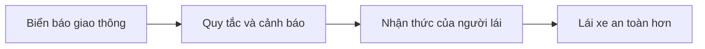

### Speaker Notes

Biển báo là cách hạ tầng giao thông truyền đạt quy tắc cho người lái.

Nếu xe có thể đọc và hiểu các biển báo này một cách ổn định, xe có thể hỗ trợ người lái tốt hơn, đặc biệt trong các tình huống người lái bỏ sót hoặc phản ứng chậm.

---

# Slide 6
# TSR nằm ở đâu trong ADAS?

### Hiển thị

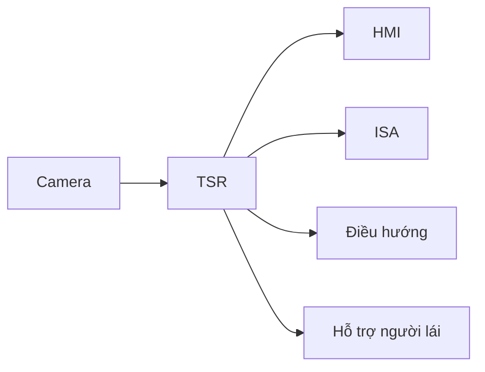

### Speaker Notes

TSR không hoạt động độc lập.

Nó là một khối perception trong hệ sinh thái ADAS, nhận dữ liệu từ camera và xuất thông tin cho nhiều khối khác như HMI, ISA hoặc hệ điều hướng.

Nói cách khác, TSR là nơi biến hình ảnh giao thông thành thông tin có thể sử dụng được ở cấp hệ thống.

---

# Slide 7
# Các tình huống sử dụng điển hình

### Hiển thị

| Tình huống | Ví dụ |
|-----------|--------|
| Nhận diện giới hạn tốc độ | 50 km/h, 60 km/h, 80 km/h |
| Nhận diện biển dừng | Stop |
| Nhận diện biển cấm vào | No Entry |
| Nhận diện biển cảnh báo | Giao nhau, người đi bộ, cua gấp |

### Speaker Notes

Trong thực tế, TSR có thể bao phủ rất nhiều loại biển báo.

Tuy nhiên, với bài toán cơ bản, nhóm tập trung vào những nhóm biển thường gặp và có giá trị hỗ trợ rõ ràng cho người lái, như biển tốc độ, biển dừng và một số biển cảnh báo điển hình.

---

# Slide 8
# Nhóm biển báo cần quan tâm

### Hiển thị

| Nhóm biển | Ví dụ |
|----------|--------|
| Regulatory | Speed Limit, Stop |
| Prohibitory | No Entry |
| Warning | Cua gấp, người đi bộ |
| Informational | Chỉ dẫn hướng đi |

### Speaker Notes

Việc chia biển báo thành từng nhóm giúp thiết kế pipeline nhận dạng rõ ràng hơn.

Trong prototype, nhóm ưu tiên các nhóm biển có đặc trưng màu sắc và hình dạng dễ phân biệt hơn để phù hợp với cách tiếp cận classical Computer Vision.

---

# Slide 9
# Vì sao bài toán TSR khó?

### Hiển thị

- Biển báo thường rất nhỏ trong khung hình
- Góc nhìn thay đổi liên tục
- Có motion blur khi xe di chuyển
- Ánh sáng thay đổi mạnh
- Có thể bị che khuất một phần

### Speaker Notes

Thoạt nhìn, biển báo là đối tượng có hình dạng và màu sắc khá rõ. Nhưng trong video thực tế, việc nhận diện lại khó hơn nhiều.

Biển báo thường xuất hiện ở xa, nhỏ, và chỉ hiện rõ trong một khoảng thời gian ngắn. Thêm vào đó là các yếu tố như rung lắc, chói sáng, bóng đổ, mưa hoặc vật cản.

---

# Slide 10
# Các thách thức trong điều kiện thực tế

### Hiển thị

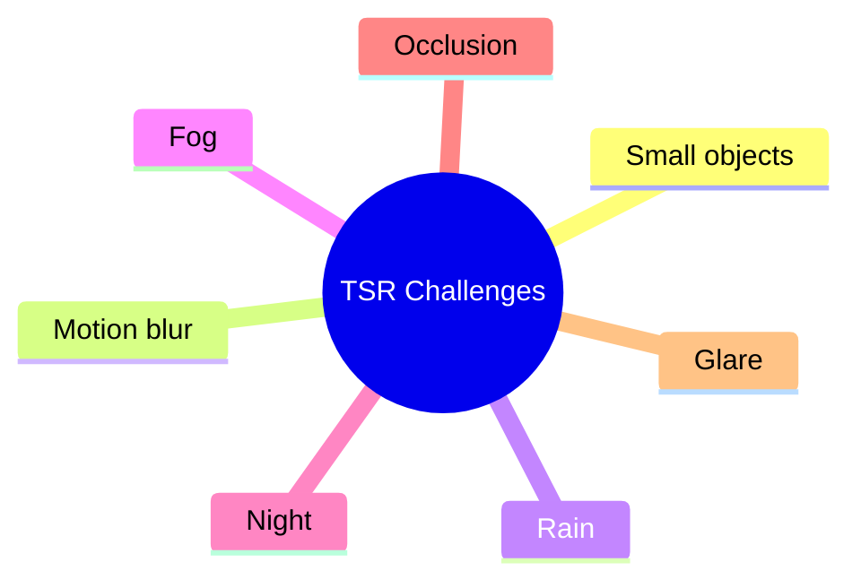

### Speaker Notes

Những yếu tố trên tác động trực tiếp đến cả Detection lẫn Recognition.

Đây cũng là lý do vì sao một hệ thống production không thể chỉ dựa vào kết quả của một frame đơn lẻ, mà cần thêm Tracking, Temporal Fusion và nhiều lớp logic phía sau.

---

# Slide 11
# Phát biểu bài toán

### Hiển thị

Yêu cầu chức năng của đề tài

- Đọc video đầu vào do nhóm tự thu
- Phát hiện biển báo giao thông trong từng frame
- Nhận diện loại biển báo
- Vẽ bounding box và hiển thị nhãn
- Sinh cảnh báo cho biển quan trọng
- Lưu video đầu ra có lớp phủ kết quả

### Speaker Notes

Đề tài của nhóm không yêu cầu xây dựng một hệ TSR hoàn chỉnh theo chuẩn automotive.

Yêu cầu đặt ra là xây dựng được một pipeline xử lý video có thể phát hiện, nhận diện, hiển thị kết quả và tạo cảnh báo cơ bản trên dữ liệu thực tế của chính nhóm.

Vì vậy, cách tiếp cận của nhóm ưu tiên tính rõ ràng, dễ triển khai và bám sát mục tiêu môn học.

---

# Slide 12
# Phạm vi dự án

### Hiển thị

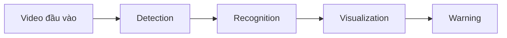

Ngoài phạm vi hiện tại

- Tracking nhiều frame
- Map Fusion
- Lane Association
- State Manager

### Speaker Notes

Phạm vi của prototype được giới hạn vào lớp perception cơ bản và phần hiển thị kết quả.

Những khối nâng cao hơn, ví dụ Tracking, Map Fusion hay State Manager, được nhóm nghiên cứu ở mức kiến trúc để so sánh với hệ TSR production, nhưng chưa triển khai trong mã nguồn hiện tại.

---

# Slide 13
# Sản phẩm bàn giao

### Hiển thị

| Hạng mục | Nội dung |
|---------|----------|
| Mã nguồn Python | Prototype TSR |
| Video đầu ra | Kết quả detection và recognition |
| Slide báo cáo | Phân tích kỹ thuật |
| Tài liệu nghiên cứu | Vai trò của TSR trong ADAS |

### Speaker Notes

Đầu ra của dự án không chỉ là code chạy được.

Nhóm còn phải chứng minh cách thiết kế pipeline, cách lựa chọn kỹ thuật và đánh giá được điểm mạnh, điểm yếu của hệ thống trên video thực tế.

---

# Slide 14
# Tiêu chí đánh giá thành công

### Hiển thị

Hệ thống cần:

- Phát hiện được biển báo trong các tình huống cơ bản
- Nhận diện đúng loại biển trong phạm vi lớp hỗ trợ
- Hiển thị đúng vị trí và nhãn
- Sinh cảnh báo cho biển ưu tiên
- Xử lý được trọn vẹn video đầu vào

### Speaker Notes

Nhóm chọn tiêu chí thành công dựa trực tiếp trên yêu cầu đề bài.

Nói cách khác, một prototype được xem là đạt nếu nó hoàn thành trọn pipeline từ video đầu vào đến video đầu ra, với kết quả đủ ổn định trong các tình huống quan sát thuận lợi.

---

# Slide 15
# Từ prototype đến production

### Hiển thị

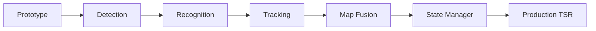

### Speaker Notes

Đây là điểm chuyển quan trọng của bài trình bày.

Sau khi xây dựng được một prototype đáp ứng yêu cầu môn học, câu hỏi tiếp theo là: nếu muốn đưa tính năng này lên xe thật, hệ thống sẽ cần thêm những gì?

Các phần sau sẽ trả lời câu hỏi đó theo thứ tự từ dữ liệu, pipeline, kết quả, rồi đến kiến trúc production.

# Phần 2 — Dữ liệu, môi trường thử nghiệm và kiến trúc prototype
## Slides 16–30

---

# Slide 16
# Prototype và TSR production khác nhau ở đâu?

### Hiển thị

| Năng lực | Prototype | Production TSR |
|---------|-----------|----------------|
| Detection | ✓ | ✓ |
| Recognition | ✓ | ✓ |
| Tracking | ✗ | ✓ |
| Temporal Fusion | ✗ | ✓ |
| Context Filtering | ✗ | ✓ |
| Lane Association | ✗ | ✓ |
| Map Fusion | ✗ | ✓ |
| State Manager | ✗ | ✓ |
| ISA integration | ✗ | ✓ |
| Diagnostics | ✗ | ✓ |
| Health Monitoring | ✗ | ✓ |

### Speaker Notes

Prototype hiện tại mới giải quyết tốt hai tầng đầu là Detection và Recognition.

Trong khi đó, trên xe thương mại, phần việc thực sự khó lại nằm ở các lớp phía sau: xác nhận biển báo theo thời gian, xác định biển có liên quan với xe hay không, rồi mới quyết định có hiển thị hoặc dùng cho các chức năng khác hay không.

---

# Slide 17
# ODD phase-1 cho TSR advisory

### Hiển thị

| Thành phần | ODD phase-1 đề xuất |
|-----------|---------------------|
| Loại đường | Đô thị, liên huyện, quốc lộ nhẹ |
| Tốc độ ego | 0–90 km/h |
| Điều kiện sáng | Ban ngày, chạng vạng, đêm đủ sáng |
| Thời tiết | Khô ráo hoặc mưa nhẹ |
| Camera | Đã calibrate, không mờ, không bẩn nặng |
| Loại biển | Biển tĩnh, không che khuất nặng, nằm trong tập class hỗ trợ |

Ngoài phạm vi ODD phase-1

- Mưa lớn hoặc sương dày
- Glare kéo dài
- Camera rung mạnh hoặc bẩn nặng
- Biển tạm công trường và lane-level reasoning phức tạp

### Speaker Notes

TSR production không được phát biểu mơ hồ là "chạy trong mọi điều kiện".

Feature phải được gắn với một ODD rõ ràng. Trong phase-1, nhóm chỉ nên tuyên bố khả năng hoạt động trong điều kiện ánh sáng và thời tiết còn tương đối thuận lợi, với camera sạch và biển tĩnh nằm phía trước xe.

---

# Slide 18
# System architecture của TSR production

### Hiển thị

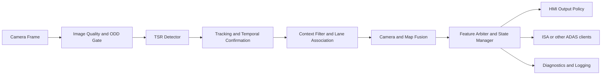

### Speaker Notes

Đây là kiến trúc bám sát tài liệu nghiên cứu thống nhất.

Điểm quan trọng là detector chỉ là một block trong cả feature. Phía trước detector còn có quality và ODD gate, còn phía sau là tracking, context, fusion, state management, HMI policy và diagnostics.

---

# Slide 19
# Tracking

### Hiển thị

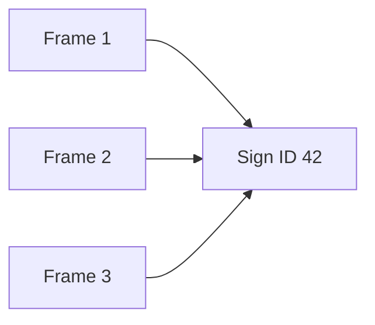

Lợi ích

- Giảm nhấp nháy kết quả
- Ổn định nhãn qua nhiều frame
- Tăng độ tin cậy trước khi xác nhận

### Speaker Notes

Tracking giúp liên kết cùng một biển báo qua nhiều frame liên tiếp.

Nhờ đó, hệ thống không bị thay đổi nhãn liên tục chỉ vì một frame ngẫu nhiên nhiễu, và người lái cũng không thấy thông tin trên HMI bị chớp tắt khó chịu.

---

# Slide 20
# Temporal Fusion

### Hiển thị

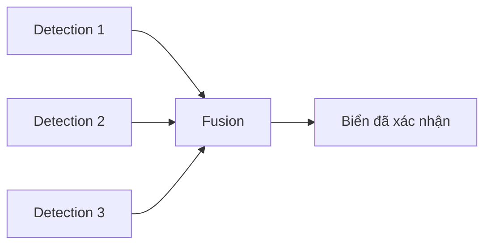

### Speaker Notes

Temporal Fusion là cơ chế tổng hợp bằng chứng từ nhiều frame thay vì tin hoàn toàn vào một lần quan sát.

Đây là cách rất hiệu quả để giảm false positive và tăng độ ổn định của hệ thống trong các tình huống quan sát không hoàn hảo.

---

# Slide 21
# Context Filtering

### Hiển thị

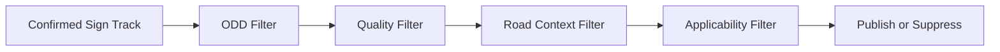

Ví dụ bị suppress

- Biển trong bãi đỗ xe
- Biển dành cho xe tải
- Biển ở khu vực công trình nhưng không áp dụng cho ego lane

### Speaker Notes

Không phải mọi biển mà camera nhìn thấy đều cần hiển thị cho người lái.

Context Filtering là bước loại bỏ các biển không liên quan tới hành trình hiện tại của xe, nhằm tránh cảnh báo sai hoặc gây nhiễu thông tin trên HMI.

---

# Slide 22
# Lane Association

### Hiển thị

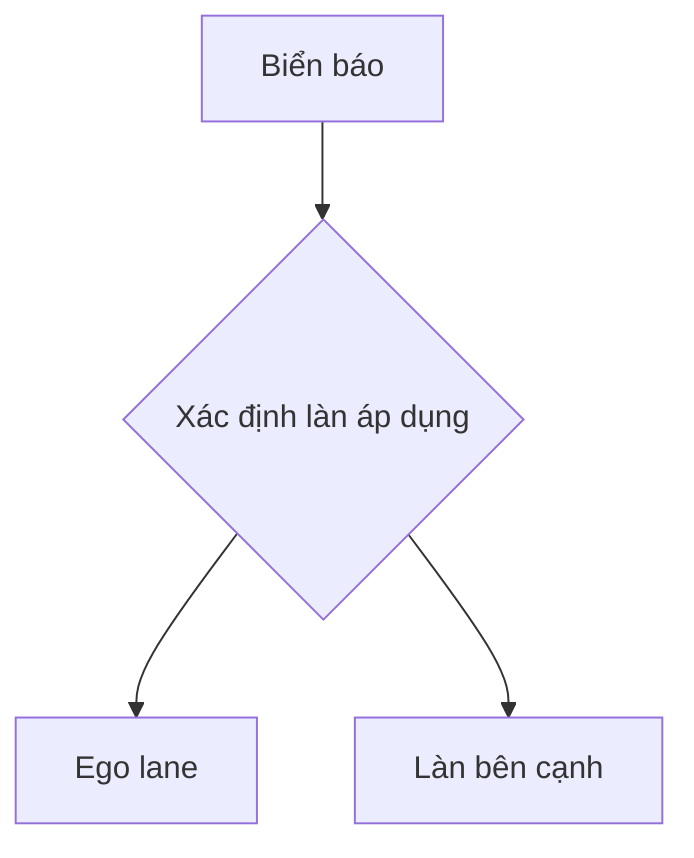

### Speaker Notes

Một biển giới hạn tốc độ hoặc cấm rẽ có thể chỉ áp dụng cho một làn cụ thể.

Lane Association giúp hệ thống quyết định biển đó có thực sự liên quan đến quỹ đạo hiện tại của xe hay không, thay vì chỉ dựa trên việc biển xuất hiện trong ảnh.

---

# Slide 23
# Camera + Map Fusion

### Hiển thị

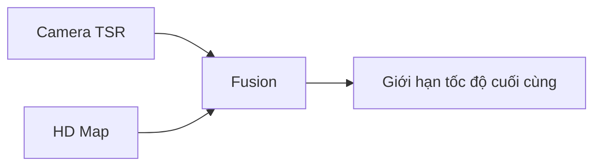

### Speaker Notes

Camera có ưu điểm là nhìn được thông tin thực tế ngay tại thời điểm hiện tại, nhưng có thể bị che khuất hoặc nhận nhầm.

Ngược lại, bản đồ có tính ổn định nhưng có thể lỗi thời. Map Fusion kết hợp hai nguồn này để tạo ra kết quả đáng tin cậy hơn cho các chức năng như ISA.

---

# Slide 24
# State flow của sign lifecycle

### Hiển thị

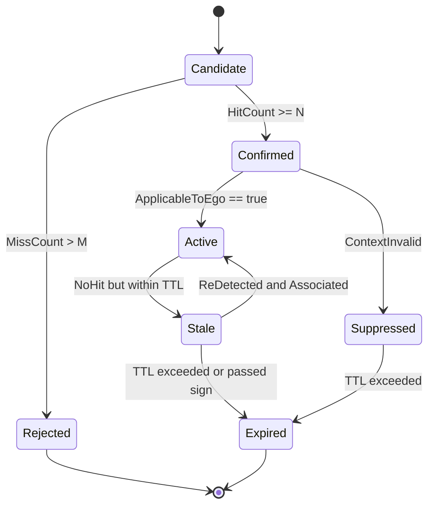

### Speaker Notes

Đây là `state flow` quan trọng để biến detection theo frame thành feature có hành vi ổn định.

Một sign mới nhìn thấy chưa được phát ngay lên HMI. Nó cần đi qua `Candidate`, `Confirmed`, rồi mới thành `Active`. Khi bị mất tạm thời thì chuyển `Stale`, và chỉ `Expired` khi thật sự hết hiệu lực.

---

# Slide 25
# HMI policy và warning level trong production

### Hiển thị

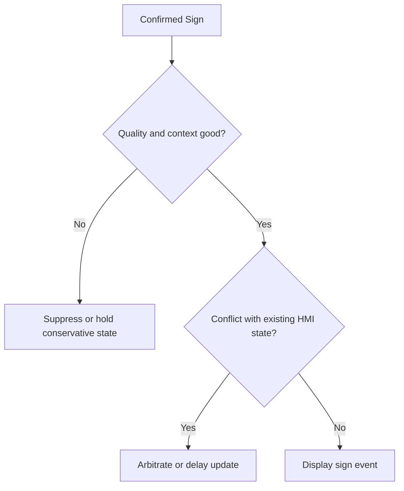

| Trạng thái | HMI policy |
|-----------|------------|
| Sign mới confirm | Hiển thị icon hoặc giá trị mới; chime tối đa một lần nếu policy cho phép |
| Same sign tiếp diễn | Giữ icon ổn định; không lặp chime |
| Conflict chưa resolve | Giữ trạng thái bảo thủ hoặc trì hoãn cập nhật |
| `DEGRADED` | Giảm mức chủ động của HMI, tránh phát sự kiện mạnh |
| `UNAVAILABLE` | Ngừng advisory mới, chỉ hiển thị trạng thái feature nếu cần |

### Speaker Notes

Tài liệu research nhấn mạnh rằng HMI không được lấy raw output từ detector.

Hệ thống phải có policy rõ ràng cho trường hợp sign mới, sign lặp lại, conflict, `DEGRADED` và `UNAVAILABLE`. Đây cũng chính là nền tảng để thiết kế warning level hợp lý, tránh nhấp nháy hoặc cảnh báo sai.

---

# Slide 26
# Góc nhìn software architecture

### Hiển thị

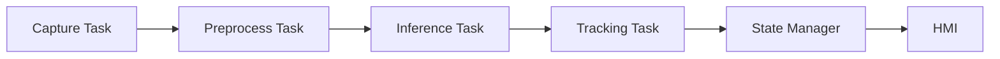

### Speaker Notes

Trong production ECU, TSR không chạy như một script Python tuần tự.

Thay vào đó, hệ thống thường được chia thành nhiều task hoặc component độc lập để quản lý timing, lỗi, tài nguyên tính toán và giao tiếp với các ECU khác một cách có kiểm soát hơn.

---

# Slide 27
# Health Monitoring và Diagnostics

### Hiển thị

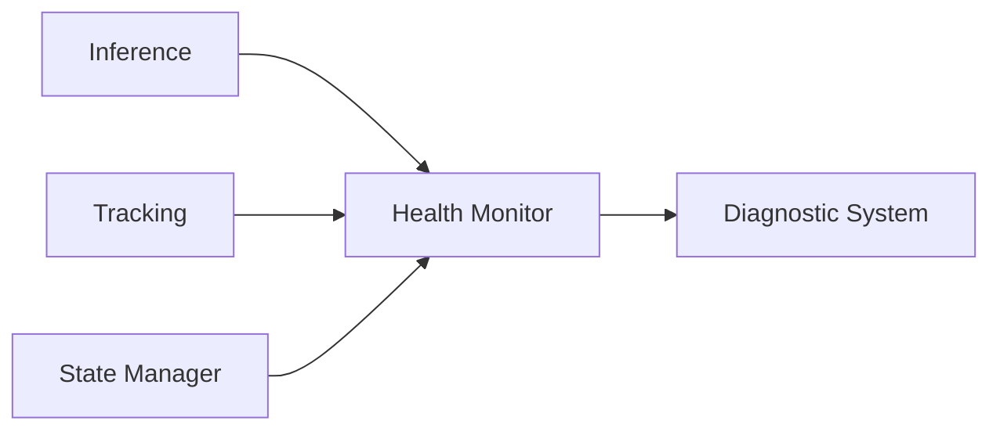

### Speaker Notes

Một hệ thống production không chỉ cần chức năng đúng mà còn phải biết khi nào chính nó đang hoạt động không ổn.

Health Monitoring giúp giám sát chất lượng chạy của từng khối, ví dụ lỗi module, mất dữ liệu đầu vào hoặc vi phạm timing budget, để hệ thống có thể ghi nhận diagnostic event và phản ứng phù hợp.

---

# Slide 28
# Degraded Operation

### Hiển thị

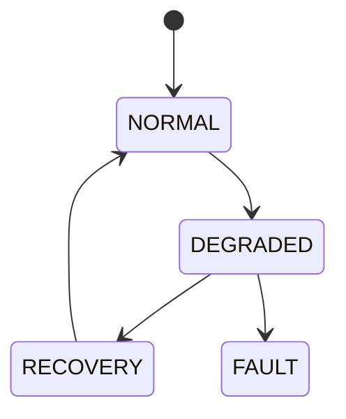

### Speaker Notes

Trên xe thật, khi chất lượng đầu vào giảm mạnh hoặc một khối chức năng gặp sự cố, hệ thống không thể giả vờ rằng mọi thứ vẫn bình thường.

Lúc đó, cơ chế degraded operation cho phép hệ thống giảm chức năng một cách có kiểm soát, thay vì tiếp tục phát ra kết quả thiếu tin cậy.

---

# Slide 29
# Quy trình phát triển

### Hiển thị

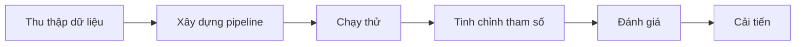

### Speaker Notes

Quá trình phát triển được thực hiện theo vòng lặp lặp lại nhiều lần.

Sau mỗi lần chạy thử, nhóm quan sát các ca đúng và ca sai, rồi quay lại điều chỉnh ngưỡng màu, bước tiền xử lý hoặc logic nhận dạng để cải thiện độ ổn định.

---

# Slide 30
# Kiến trúc tổng thể của prototype

### Hiển thị

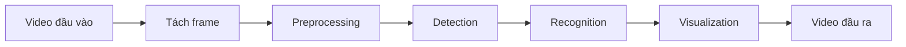

### Speaker Notes

Đây là pipeline tổng thể mà nhóm triển khai.

Mỗi frame của video sẽ đi qua cùng một chuỗi xử lý: tiền xử lý ảnh, phát hiện vùng ứng viên, nhận dạng loại biển, sau đó hiển thị kết quả và ghi lại vào video đầu ra.

---

# Slide 31
# Luồng xử lý end-to-end

### Hiển thị

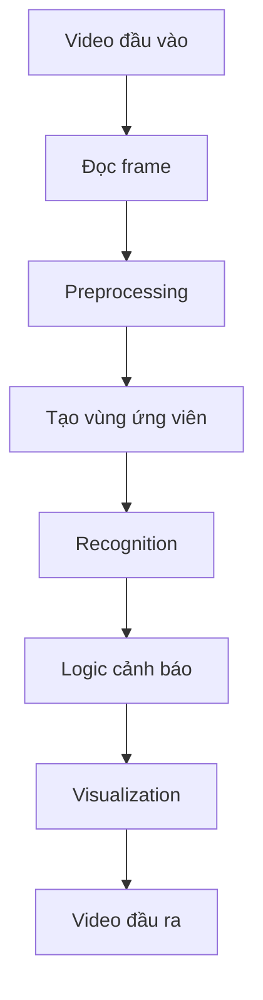

### Speaker Notes

Slide này mô tả luồng dữ liệu một cách chi tiết hơn.

Điểm cần lưu ý là pipeline của nhóm không chạy trực tiếp từ ảnh sang nhãn bằng một model end-to-end, mà đi theo hướng classical pipeline: tìm ứng viên trước, rồi mới nhận dạng.

---

# Slide 32
# Kiến trúc chi tiết theo từng bước

### Hiển thị

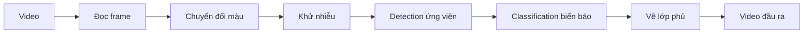

### Speaker Notes

Đây là phiên bản chi tiết hơn của pipeline prototype.

Cách thiết kế này bám sát gợi ý trong yêu cầu môn học: tận dụng xử lý ảnh truyền thống như chuyển không gian màu, lọc nhiễu, contour và phân tích hình dạng trước khi đi đến bước nhận dạng.

---

# Slide 33
# Vì sao cần Preprocessing?

### Hiển thị

Vấn đề cần xử lý

- Nhiễu ảnh
- Bóng đổ
- Tương phản thấp
- Màu sắc thay đổi theo ánh sáng

Kỹ thuật áp dụng

- Gaussian Blur
- Histogram Equalization
- HSV Conversion

### Speaker Notes

Nếu đưa trực tiếp frame thô vào bước Detection, kết quả thường rất nhiễu và thiếu ổn định.

Preprocessing giúp làm sạch ảnh, tăng tương phản và tách thông tin màu sắc tốt hơn. Đây là bước có ảnh hưởng lớn đến chất lượng của toàn bộ pipeline phía sau.

---

# Slide 34
# Pipeline Preprocessing

### Hiển thị

```mermaid
flowchart LR
input_frame["Frame đầu vào"] --> hist_eq["Histogram Equalization"]
hist_eq --> gaussian["Gaussian Filter"]
gaussian --> hsv["HSV Conversion"]
hsv --> processed["Frame đã xử lý"]
```

### Speaker Notes

Nhóm sắp xếp bước Preprocessing theo đúng mục tiêu của từng thao tác.

Đầu tiên là cải thiện tương phản, tiếp theo là làm mượt để giảm nhiễu, sau đó mới chuyển sang HSV để hỗ trợ tốt hơn cho bước phân tách màu ở giai đoạn Detection.

---

# Slide 35
# Vì sao chọn HSV?

### Hiển thị

So sánh RGB và HSV

| RGB | HSV |
|-----|-----|
| Nhạy với thay đổi ánh sáng | Ổn định hơn với threshold màu |
| Khó tách màu bằng ngưỡng | Dễ tách theo hue |
| Trộn lẫn màu và độ sáng | Tách màu khỏi độ sáng tốt hơn |

### Speaker Notes

Biển báo giao thông thường có các màu đặc trưng như đỏ, xanh hoặc vàng.

HSV giúp nhóm tách các màu này dễ hơn so với RGB, vì thông tin màu được biểu diễn rõ hơn và ít phụ thuộc trực tiếp vào cường độ sáng tuyệt đối.

---

# Slide 36
# Chiến lược Detection biển báo

### Hiển thị

```mermaid
flowchart LR
hsv_mask["Mask màu HSV"] --> morphology["Morphology"]
morphology --> contour["Contour Detection"]
contour --> candidates["Vùng ứng viên"]
```

### Speaker Notes

Trong prototype, Detection không dùng deep detector như YOLO.

Thay vào đó, nhóm đi theo hướng phù hợp với đề bài: tạo mask màu trong không gian HSV, làm sạch mask bằng Morphology, rồi tìm contour để xác định những vùng có khả năng là biển báo.

---

# Slide 37
# Vai trò của Morphological Operations

### Hiển thị

Các phép toán sử dụng

- Erosion
- Dilation
- Opening
- Closing

Mục tiêu

- Loại bỏ nhiễu nhỏ
- Lấp khoảng trống trong vùng màu
- Làm mask ổn định hơn trước khi tìm contour

### Speaker Notes

Sau bước threshold màu, ảnh nhị phân thường còn nhiều đốm nhiễu hoặc biên không kín.

Morphology giúp làm sạch những lỗi này để contour thu được ổn định hơn, từ đó giảm số lượng vùng ứng viên giả.

---

# Slide 38
# Contour Detection và chọn vùng ứng viên

### Hiển thị

```mermaid
flowchart LR
binary_mask["Mask nhị phân"] --> contours["FindContours"]
contours --> shape_analysis["Phân tích hình dạng"]
shape_analysis --> candidate_selection["Chọn vùng ứng viên"]
```

Tiêu chí lọc

- Diện tích
- Tỷ lệ khung bao
- Hình dạng gần tròn hoặc tam giác

### Speaker Notes

Không phải contour nào cũng là biển báo.

Vì vậy sau khi tìm contour, nhóm tiếp tục lọc theo kích thước và hình dạng để loại bớt các vùng nền không liên quan. Đây là bước giúp giảm tải cho Recognition ở phía sau.

---

# Slide 39
# Chuyển từ Detection sang Recognition

### Hiển thị

```mermaid
flowchart LR
candidates["Vùng ứng viên"] --> roi_norm["Chuẩn hóa ROI"]
roi_norm --> recognition["Recognition"]
recognition --> final_label["Nhãn cuối cùng"]
```

Câu hỏi cần trả lời

- Đây có thật sự là biển báo không?
- Nếu đúng, đó là biển báo gì?

### Speaker Notes

Detection mới chỉ cho nhóm biết vị trí nghi ngờ có biển báo.

Bước tiếp theo là cắt ROI, chuẩn hóa kích thước và thực hiện Recognition để xác định loại biển cụ thể. Đây là lúc hệ thống chuyển từ việc thấy một đối tượng sang hiểu ý nghĩa của đối tượng đó.

# Phần 3 — Recognition, kết quả thực nghiệm và đánh giá
## Slides 31–43

---

# Slide 40
# Giai đoạn Recognition biển báo

### Hiển thị

```mermaid
flowchart LR
candidate_roi["ROI ứng viên"] --> feature_extract["Trích đặc trưng"]
feature_extract --> classification["Classification"]
classification --> sign_label["Nhãn biển báo"]
```

Đầu vào

- ROI từ bước Detection
- Thông tin màu sắc
- Đặc trưng hình dạng

Đầu ra

- Lớp biển báo
- Độ tin cậy hoặc độ tương đồng

### Speaker Notes

Ở bước này, hệ thống không còn xử lý toàn bộ frame nữa mà chỉ tập trung vào từng ROI đã được cắt ra.

Nhiệm vụ của Recognition là xác định ROI đó thuộc lớp biển báo nào trong tập lớp mà prototype hỗ trợ.

---

# Slide 41
# Phương pháp Recognition được chọn

### Hiển thị

Các cách tiếp cận phổ biến

| Phương pháp | Ưu điểm | Hạn chế |
|------------|---------|---------|
| Template Matching | Đơn giản, dễ triển khai | Nhạy với scale và góc nhìn |
| Shape Analysis | Nhanh | Khả năng phân biệt hạn chế |
| Feature Matching | Bền vững hơn | Phức tạp hơn |
| Deep Learning | Độ chính xác cao | Cần dữ liệu và huấn luyện |

Phương án nhóm chọn

✓ Template Matching

### Speaker Notes

Nhóm chọn Template Matching vì nó phù hợp với phạm vi môn học và đủ rõ ràng để giải thích pipeline.

Lựa chọn này cũng nhất quán với định hướng của prototype: ưu tiên một lời giải dễ triển khai, dễ quan sát từng bước, thay vì đi thẳng sang một mô hình deep learning phức tạp hơn.

---

# Slide 42
# Workflow của Template Matching

### Hiển thị

```mermaid
flowchart LR
cropped_roi["ROI đã cắt"] --> resize["Resize"]
resize --> template_match["So khớp với template"]
template_match --> similarity["Tính độ tương đồng"]
similarity --> best_result["Chọn kết quả tốt nhất"]
```

### Speaker Notes

Mỗi ROI ứng viên trước hết được đưa về kích thước chuẩn.

Sau đó hệ thống so sánh ROI này với tập template đã chuẩn bị sẵn. Kết quả có độ tương đồng cao nhất sẽ được chọn làm nhãn dự đoán cho biển báo.

---

# Slide 43
# Các lớp biển báo mà prototype hỗ trợ

### Hiển thị

| Class ID | Loại biển |
|---------|-----------|
| 0 | Stop |
| 1 | Speed Limit |
| 2 | No Entry |
| 3 | Warning Sign |
| 4 | Pedestrian Crossing |

<mark>Chèn ảnh mẫu đại diện cho từng lớp</mark>

### Speaker Notes

Danh sách lớp hỗ trợ phụ thuộc vào dữ liệu mà nhóm có thể thu thập và số lượng template có thể chuẩn bị.

Ở giai đoạn này, nhóm ưu tiên các lớp biển có giá trị minh họa tốt cho bài toán TSR và có đặc trưng tương đối rõ ràng để Recognition hoạt động ổn định hơn.

---

# Slide 44
# Pipeline hiển thị kết quả

### Hiển thị

```mermaid
flowchart LR
detection["Detection"] --> recognition["Recognition"]
recognition --> bbox["Bounding box"]
bbox --> sign_label["Nhãn biển báo"]
sign_label --> output_frame["Frame đầu ra"]
```

Ví dụ hiển thị

- Bounding box quanh biển báo
- Nhãn như `STOP` hoặc `Speed Limit 60`

### Speaker Notes

Sau khi có kết quả Recognition, hệ thống sẽ vẽ bounding box và nhãn trực tiếp lên frame.

Đây là bước rất quan trọng cho việc demo, vì người xem có thể ngay lập tức kiểm tra được cả vị trí lẫn loại biển mà hệ thống dự đoán.

---

# Slide 45
# Logic sinh cảnh báo và warning level

### Hiển thị

```mermaid
flowchart TD
recognized["Biển đã nhận dạng"] --> priority{"Kiểm tra mức ưu tiên"}
priority --> stop["Cảnh báo Stop"]
priority --> speed["Cảnh báo tốc độ"]
priority --> normal["Chỉ hiển thị thông thường"]
```

Warning level đề xuất cho demo

| Mức | Điều kiện | Phản hồi HMI |
|-----|-----------|--------------|
| Level 0 | Biển chưa confirm hoặc quality kém | Không phát cảnh báo mới |
| Level 1 | Biển thường đã nhận dạng | Chỉ hiển thị bounding box và nhãn |
| Level 2 | Speed Limit đã confirm | Hiển thị rõ giá trị tốc độ, không lặp chime |
| Level 3 | Stop hoặc biển cấm quan trọng | Hiển thị nổi bật, có thể phát chime một lần |

### Speaker Notes

Không phải biển nào cũng cần cùng một kiểu phản hồi.

Theo tinh thần của tài liệu nghiên cứu, output cho người lái không nên lấy trực tiếp từ detector. Nó cần đi qua bước xác nhận và policy cảnh báo.

Với demo hiện tại, nhóm có thể chia thành các warning level đơn giản như trên: biển thường chỉ hiển thị, biển tốc độ thì nhấn mạnh giá trị, còn các biển có tính pháp lý mạnh như Stop hoặc No Entry thì mới dùng phản hồi nổi bật hơn.

---

# Slide 46
# Ví dụ kết quả Detection và Recognition

### Hiển thị

<mark>Chèn ảnh chụp kết quả cho các ca</mark>

- Stop
- Speed Limit
- No Entry

Mỗi ảnh nên thể hiện:

- Bounding box
- Nhãn biển báo
- Cảnh báo nếu có

### Speaker Notes

Đây là slide minh chứng trực tiếp cho khả năng hoạt động của prototype.

Nhóm nên chọn các ảnh đại diện rõ nhất, trong đó biển báo dễ nhìn, kết quả nhận dạng đúng và lớp phủ hiển thị đủ rõ để người nghe thấy được toàn bộ pipeline đang hoạt động.

---

# Slide 47
# Một ví dụ end-to-end

### Hiển thị

```mermaid
flowchart LR
input_frame["Frame đầu vào"] --> detection["Detection"]
detection --> recognition["Recognition"]
recognition --> warning["Warning"]
warning --> visualization["Visualization"]
```

Ví dụ minh họa

```text
Speed Limit 60
↓
Hệ thống nhận dạng đúng
↓
Sinh cảnh báo
↓
Hiển thị trên frame đầu ra
```

### Speaker Notes

Thay vì chỉ nhìn các thành phần rời rạc, slide này kể lại toàn bộ đường đi của một ví dụ cụ thể.

Khi thuyết trình, đây là lúc nhóm có thể mô tả theo đúng trải nghiệm người dùng: biển báo xuất hiện, hệ thống phát hiện, nhận dạng, rồi phản hồi lại trên màn hình.

---

# Slide 48
# Chiến lược thu thập dữ liệu

### Hiển thị

Nguồn dữ liệu

- Video do nhóm tự thu
- Đường đô thị
- Khuôn viên trường hoặc khu dân cư
- Các điều kiện ánh sáng khác nhau

Tiêu chí chọn video

- Có xuất hiện biển báo rõ ràng
- Có nhiều khoảng cách quan sát
- Có nhiều bối cảnh nền khác nhau

### Speaker Notes

Theo yêu cầu đề bài, nhóm sử dụng video tự thu thay vì phụ thuộc hoàn toàn vào dataset công khai.

Cách làm này có hai lợi ích. Thứ nhất, dữ liệu gần với bối cảnh mà nhóm muốn kiểm thử. Thứ hai, nó giúp bộc lộ rõ hơn các khó khăn thực tế như rung, chói sáng và thay đổi góc nhìn.

---

# Slide 49
# Tổng quan bộ video thử nghiệm

### Hiển thị

| Video | Thời lượng | Độ phân giải | Điều kiện |
|------|------------|--------------|-----------|
| Video 1 | [điền số liệu] | 1920×1080 | Nắng |
| Video 2 | [điền số liệu] | 1920×1080 | Nhiều mây |
| Video 3 | [điền số liệu] | 1920×1080 | Ánh sáng hỗn hợp |

<mark>Chèn thumbnail đại diện cho từng video</mark>

### Speaker Notes

Slide này tóm tắt các video dùng để phát triển và đánh giá hệ thống.

Khi hoàn thiện báo cáo, nhóm chỉ cần thay phần giữ chỗ bằng số liệu thực tế của từng video và chèn thêm thumbnail minh họa để người nghe dễ hình dung.

---

# Slide 50
# Một số khung hình đầu vào tiêu biểu

### Hiển thị

<mark>Chèn lưới hình ảnh gồm 4 frame tiêu biểu</mark>

- Frame có biển ở xa
- Frame có biển ở gần
- Frame có nền phức tạp
- Frame có thay đổi ánh sáng

<mark>Đánh dấu vị trí biển báo trên từng ảnh</mark>

### Speaker Notes

Việc cho người xem nhìn trực tiếp các frame đầu vào là rất quan trọng.

Nó giúp chứng minh rằng bài toán mà nhóm xử lý không phải là ảnh mẫu đã cắt sẵn, mà là video thực tế nơi biển báo có kích thước nhỏ và bối cảnh nền khá phức tạp.

---

# Slide 51
# Môi trường phát triển và chạy thử

### Hiển thị

| Thành phần | Cấu hình |
|-----------|----------|
| Hệ điều hành | Windows hoặc Linux |
| IDE | VS Code |
| Ngôn ngữ | Python |
| Thư viện chính | OpenCV, NumPy |
| Phương thức chạy | Xử lý offline trên video |

### Speaker Notes

Nhóm chọn Python và OpenCV vì đây là bộ công cụ phù hợp để xây dựng nhanh một pipeline Computer Vision cơ bản.

Mục tiêu ở giai đoạn này không phải tối ưu cho ECU hay real-time embedded deployment, mà là làm rõ các bước xử lý và kiểm chứng được ý tưởng trên dữ liệu thật.

---

# Slide 52
# Những trường hợp hệ thống làm tốt

### Hiển thị

| Tình huống | Kết quả |
|-----------|---------|
| Biển lớn, rõ | Tốt |
| Ánh sáng ổn định | Tốt |
| Biển hướng trực diện | Tốt |
| Nền ít nhiễu | Tốt |

<mark>Chèn ảnh minh họa các ca thành công thực tế</mark>

### Speaker Notes

Prototype cho kết quả tốt nhất khi biển báo đủ lớn, ánh sáng ổn định và góc nhìn tương đối thuận lợi.

Điều này phù hợp với bản chất của pipeline classical CV, vốn dựa khá nhiều vào màu sắc, hình dạng và độ rõ của ROI.

---

# Slide 53
# Những trường hợp hệ thống còn yếu

### Hiển thị

| Tình huống | Vấn đề |
|-----------|--------|
| Biển quá nhỏ | Bỏ sót Detection |
| Motion blur | Recognition sai |
| Che khuất một phần | Không nhận ra |
| Chói sáng hoặc ngược sáng | Giảm độ chính xác |

<mark>Chèn ảnh minh họa các ca thất bại thực tế</mark>

### Speaker Notes

Các ca lỗi này thể hiện rõ giới hạn hiện tại của prototype.

Điểm đáng chú ý là nhiều lỗi xuất phát từ chất lượng quan sát đầu vào, chứ không chỉ từ thuật toán Recognition. Vì vậy, muốn cải thiện mạnh, chỉ chỉnh tham số thường là chưa đủ.

---

# Slide 54
# Phân tích nguyên nhân gốc

### Hiển thị

```mermaid
fishbone

Nguyên nhân lỗi
    Ánh sáng
        Ban đêm
        Chói sáng
        Bóng đổ

    Môi trường
        Mưa
        Sương
        Nền phức tạp

    Biển báo
        Quá nhỏ
        Bị che khuất

    Camera
        Blur
        Rung
        Chuyển động
```

### Speaker Notes

Phân tích nguyên nhân gốc giúp nhóm tránh kết luận quá đơn giản rằng chỉ cần đổi thuật toán là sẽ giải quyết được mọi vấn đề.

Trên thực tế, hiệu quả TSR phụ thuộc đồng thời vào dữ liệu, chất lượng camera, điều kiện môi trường và cả cách tổ chức pipeline phía sau.

---

# Slide 55
# Đánh giá định lượng

### Hiển thị

| Chỉ số | Giá trị |
|-------|---------|
| Tổng số frame | [điền số liệu] |
| Số biển được phát hiện | [điền số liệu] |
| Số biển nhận dạng đúng | [điền số liệu] |
| Detection rate | [điền số liệu] |
| Recognition rate | [điền số liệu] |

### Speaker Notes

Slide này nên được cập nhật bằng số liệu thực tế sau khi nhóm chốt bộ video đánh giá.

Nếu chưa có ground truth đầy đủ cho mọi frame, nhóm vẫn có thể báo cáo theo cách minh bạch, ví dụ trên tập mẫu đã gán nhãn thủ công hoặc trên các đoạn video tiêu biểu.

---

# Slide 56
# Tóm tắt đánh giá prototype

### Hiển thị

Điểm mạnh

✓ Pipeline rõ ràng, dễ giải thích  
✓ Dễ triển khai bằng Python và OpenCV  
✓ Hoạt động tốt trong điều kiện quan sát thuận lợi  
✓ Đáp ứng đúng yêu cầu cơ bản của đề tài

Hạn chế

✗ Nhạy với ánh sáng và motion blur  
✗ Khó xử lý biển báo nhỏ  
✗ Chưa có Tracking và Temporal Fusion  
✗ Chưa hiểu ngữ cảnh giao thông

### Speaker Notes

Nhìn tổng thể, prototype đã hoàn thành tốt vai trò của một bài tập nền tảng về TSR.

Nó cho thấy cách một hệ thống có thể đi từ video đầu vào đến kết quả nhận dạng trên từng frame. Nhưng đồng thời, nó cũng làm lộ rõ những khoảng trống cần lấp nếu muốn tiến tới một hệ TSR production ổn định hơn.

# Phần 4 — Gap analysis, kiến trúc production và lộ trình phát triển
## Slides 44–58

---

# Slide 57
# Lộ trình từ prototype đến production

### Hiển thị

```mermaid
flowchart LR
prototype["Prototype"] --> tracking["Tracking"]
tracking --> temporal["Temporal Fusion"]
temporal --> context["Context Filtering"]
context --> lane["Lane Association"]
lane --> map_fusion["Map Fusion"]
map_fusion --> isa["ISA integration"]
isa --> production["Production TSR"]
```

### Speaker Notes

Nếu tiếp tục phát triển từ nền tảng hiện tại, đây là lộ trình hợp lý nhất.

Thứ tự này đi từ những phần gần với prototype nhất, như Tracking và Temporal Fusion, rồi mới tới các lớp logic phụ thuộc nhiều hơn vào ngữ cảnh giao thông, dữ liệu bản đồ và tích hợp hệ thống.

---

# Slide 58
# Kết luận

### Hiển thị

Kết quả đạt được

✓ Xây dựng được prototype TSR cơ bản  
✓ Đọc video, Detection, Recognition, Visualization và Warning  
✓ Chạy được trên video thực tế của nhóm

Kiến thức rút ra

✓ Hiểu vai trò của TSR trong ADAS  
✓ Hiểu khoảng cách giữa prototype và production  
✓ Hiểu thêm về Tracking, Map Fusion, State Manager, ISA

Hướng phát triển tiếp

✓ Bổ sung Tracking và Temporal Fusion  
✓ Mở rộng tập lớp biển báo  
✓ Tăng độ ổn định trong điều kiện thực tế  
✓ Nghiên cứu hướng embedded deployment

### Speaker Notes

Nhóm đã hoàn thành mục tiêu chính của đề tài là xây dựng một hệ TSR cơ bản chạy được trên video thực tế và thể hiện đầy đủ các chức năng cốt lõi.

Quan trọng hơn, thông qua phần nghiên cứu mở rộng, nhóm cũng nhìn rõ được rằng một tính năng TSR production không chỉ là bài toán nhận dạng ảnh, mà là một bài toán hệ thống gồm perception, logic ngữ cảnh và tích hợp với toàn bộ kiến trúc ADAS.

Xin cảm ơn mọi người đã lắng nghe.
