# (4) Notebook Demo Google Colab cho TSR — Production-Lite Replay

> **Thứ tự đọc:** 4 — sau `research/1...`, `research/2...`, và `research/3...` nếu cần demo stateful replay.  
> **File này trả lời:** notebook Colab đã mô phỏng được những block nào của production-lite TSR và chưa mô phỏng được gì.  
> **Ngoài phạm vi:** kể lại đầy đủ production architecture hoặc detector theory; các phần đó nằm ở `research/1...` và `research/3...`.  
> **Trạng thái:** file nghiên cứu mới, tách riêng để review trước khi gộp vào luồng tài liệu chính.  
> **Notebook đi kèm:** [notebooks/tsr_colab_production_lite_demo.ipynb](notebooks/tsr_colab_production_lite_demo.ipynb)  
> **Phạm vi repo:** `adas-tsr`

---

## 1. Mục tiêu của notebook này

Notebook này được tạo để giải quyết một khoảng trống giữa:

- baseline inference demo trong [`code/tsr_demo.py`](../code/tsr_demo.py), vốn chủ yếu cho overlay video;
- và phần nghiên cứu production trong [1.research_tsr_three_part_unified.md](1.research_tsr_three_part_unified.md), vốn mô tả nhiều block kiến trúc nhưng chưa có một artefact Colab-ready để demo hành vi.

Mục tiêu của notebook không phải thay thế production stack, mà là tạo ra một **production-lite demo** có thể chạy trên Google Colab với setup đủ rõ ràng để:

- nạp model `best.pt`;
- chạy detector trên toàn bộ video đầu vào;
- mô phỏng `Image Quality Gate`, `ODD gate`, `tracking + temporal confirmation`, `sign lifecycle`, `warning level`, `HMI policy`, và `JSONL event log`;
- xuất video annotated đủ để review stateful behavior thay vì chỉ xem bbox theo frame.

---

## 2. Notebook này kế thừa gì từ các tài liệu khác?

Notebook này là **artefact demo**, không phải tài liệu gốc cho các khái niệm hệ thống. Nó chỉ lấy những phần tối thiểu từ các file khác để biến thành replay stateful trên Colab.

| Nguồn | Notebook kế thừa gì |
|---|---|
| [1.research_tsr_three_part_unified.md](1.research_tsr_three_part_unified.md) | `ODD phase-1`, `DEGRADED/UNAVAILABLE`, detector != feature, sign lifecycle, HMI policy, context suppression |
| [2.research_tsr_baseline_analysis.md](2.research_tsr_baseline_analysis.md) | Gap repo hiện tại: overlay-only, `hold` ≠ tracking, thiếu quality gate, thiếu output machine-readable |
| [3.research_tsr_detection_architecture_research.md](3.research_tsr_detection_architecture_research.md) | Chấp nhận giới hạn của YOLO baseline về small-object, latency và long-tail; notebook không cố thay detector |

Nếu muốn hiểu *vì sao* các block đó tồn tại, quay lại file nguồn tương ứng. File này chỉ trả lời *notebook đã mô phỏng được gì*.

### 2.1 Legend màu Mermaid

> Legend này áp dụng cho các sơ đồ Mermaid đã được tô màu trong tài liệu notebook production-lite.

| Màu | Vai trò | Ý nghĩa |
|---|---|---|
|  | `baseline` | Baseline tham chiếu hoặc nhánh gốc khi có dùng |
|  | `feature` | Detector hoặc khối xử lý chính của pipeline |
|  | `temporal` | Tracking, lifecycle, temporal confirmation, hoặc state flow |
|  | `source` | Video input hoặc input source ban đầu |
|  | `integration` | Output video, event log, hoặc đầu ra driver-facing / machine-readable |
|  | `decision` | Gate hoặc decision point khi có dùng |
|  | `support` | RAM profile, quality gate, ODD gate, hoặc utility/support block |

---

## 3. System architecture production-lite trong notebook

```mermaid
flowchart LR
    A[Input Video] --> B[RAM Profile Selection]
    B --> C[Image Quality Gate]
    C --> D[ODD Gate]
    D --> E[YOLO Detector]
    E --> F[Tracking and Temporal Confirmation]
    F --> G[Sign Lifecycle]
    G --> H[Warning Level and HMI Policy]
    H --> I[Annotated Output Video]

    H --> J[events.jsonl]

    classDef source fill:#EAF7F2,stroke:#14866D,color:#0F4C3F,stroke-width:2px;
    classDef support fill:#FCEFF5,stroke:#DB2777,color:#9D174D,stroke-width:2px;
    classDef feature fill:#EDF3FF,stroke:#2F66D0,color:#173B7A,stroke-width:2px;
    classDef temporal fill:#F4ECFF,stroke:#7C3AED,color:#4C1D95,stroke-width:2px;
    classDef integration fill:#E8F7EE,stroke:#1E8E5A,color:#14532D,stroke-width:2px;
    class A source;
    class B,C,D support;
    class E feature;
    class F,G temporal;
    class H,I,J integration;
```

Ý nghĩa của từng block:

| Block | Notebook làm gì |
|---|---|
| RAM Profile Selection | Chọn `imgsz`, `max_width`, `skip` và policy giới hạn frame theo RAM khả dụng |
| Image Quality Gate | Dùng blur, brightness và glare heuristic để gắn `quality reasons` |
| ODD Gate | Kiểm tra ODD phase-1 ở mức demo dựa trên quality và tốc độ ego cấu hình tay |
| YOLO Detector | Dùng `best.pt` local hoặc tải từ Hugging Face |
| Tracking and Temporal Confirmation | Ghép detection theo IoU cùng sign family, tăng `hit_count`, `miss_count` |
| Sign Lifecycle | Quản lý `CANDIDATE`, `CONFIRMED`, `ACTIVE`, `STALE`, `SUPPRESSED`, `EXPIRED` |
| Warning Level and HMI Policy | Gán `Level 0..3`, chọn sign ưu tiên và tránh update quá sớm |
| `events.jsonl` | Log quyết định từng frame để replay và RCA |

---

## 4. Những phần production nào đã mô phỏng được?

### 4.1 Có thể demo được trên Colab

| Nhóm | Có trong notebook | Ghi chú |
|---|---|---|
| Setup runtime | Có | Tự cài package còn thiếu |
| Memory-aware profile | Có | Có check RAM trước khi chạy |
| Detector runtime | Có | Dùng YOLO baseline |
| Quality gate | Có | Heuristic, không phải model learned |
| ODD gate | Có | Mức demo phase-1, chưa có road type thật |
| Temporal confirmation | Có | Dựa trên `min_confirm_hits` |
| Sign lifecycle | Có | Có state machine gọn |
| Warning level | Có | Bám HMI policy ở mức demo |
| Output video | Có | MP4 annotated |
| Event log | Có | `events.jsonl` theo frame |
| KPI proxy từ replay | Có | Đọc `events.jsonl` để tính ODD proxy, confidence, size bin, threshold sweep, confirmation latency |
| Ground-truth eval optional | Có | Nếu cung cấp JSON annotation thì tính được precision/recall `IoU=0.5` |

### 4.2 Chưa thể coi là production implementation

| Nhóm | Chưa có | Vì sao |
|---|---|---|
| Lane association thật | Chưa có | Không có lane model, calibration, route intent |
| Map fusion thật | Chưa có | Chỉ có stub policy, không có HD map hay localization confidence |
| Diagnostics ECU | Chưa có | Không có DTC, DID, watchdog, service interface |
| Timing contract chuẩn ECU | Chưa có | Colab không đại diện cho embedded target |
| Safety/SOTIF evidence | Chưa có | Notebook chỉ là artefact demo, không phải compliance evidence |

---

## 5. Cách chạy trên Google Colab

### 5.1 Cách dùng tối thiểu

1. Mở notebook [notebooks/tsr_colab_production_lite_demo.ipynb](notebooks/tsr_colab_production_lite_demo.ipynb) trên Colab.
2. Chạy cell setup để cài package.
3. Kiểm tra cell RAM profile để xem notebook đang chọn cấu hình `high`, `medium` hay `low`.
4. Cung cấp input video:
   - ưu tiên một video có biển báo thật;
   - hoặc mount Drive / upload file;
   - nếu không có, notebook sẽ tải một `smoke-test clip` để xác minh pipeline.
5. Chạy cell detector + pipeline.
6. Xem:
   - video output;
   - preview frames;
   - `events.jsonl`.

### 5.2 Về RAM demo

Notebook chủ động chọn profile theo RAM:

| Profile | Điều kiện | Cấu hình |
|---|---|---|
| `high` | RAM >= 20 GB | `imgsz=640`, `max_width=1600`, `skip=0`, chạy full video |
| `medium` | RAM >= 10 GB | `imgsz=640`, `max_width=1280`, `skip=0`, chạy full video |
| `low` | RAM < 10 GB | `imgsz=512`, `max_width=960`, `skip=1`, chạy full video |

Ý nghĩa của cơ chế này:

- giúp notebook ít bị văng RAM khi người dùng chọn runtime nhỏ;
- phù hợp với tinh thần `degraded operation` ở mức demo;
- cho thấy ngay cả notebook cũng nên có resource-aware behavior, không phải chỉ cố chạy bằng mọi giá.

Nếu cần debug nhanh, người dùng mới chủ động đặt `FRAME_LIMIT_OVERRIDE`. Mặc định của notebook là không tự cắt clip.

### 5.3 Vì sao video dài hơn lại nặng hơn?

Trong bản notebook hiện tại, chi phí tăng chủ yếu theo **số frame cần xử lý**, không phải vì feature state tích lũy vô hạn theo thời gian.

Các thành phần tăng gần tuyến tính theo độ dài video là:

- `preprocess` cho từng frame;
- `YOLO inference` cho từng frame được chọn theo `skip`;
- `tracking + state update`;
- `overlay` và `VideoWriter`;
- ghi `events.jsonl` theo từng frame.

Những phần **không** nên tăng vô hạn trong RAM:

- `events.jsonl` được stream ra file, không giữ toàn bộ log trong bộ nhớ;
- danh sách `tracks` chỉ giữ các sign còn sống và loại bỏ track `REJECTED` hoặc `EXPIRED`;
- state của mỗi sign chỉ giữ phần tối thiểu cần cho lifecycle hiện tại.

Nói cách khác, video càng dài thì runtime càng lâu là bình thường; nhưng nếu implementation tốt thì RAM không nên phình lên tương ứng với toàn bộ thời lượng clip.

---

## 6. Output của notebook và cách đọc

### 6.1 Video output

Video annotated cho biết:

- bbox hiện tại;
- `track_id`;
- `state`;
- `warning_level`;
- quality status;
- feature state (`AVAILABLE`, `DEGRADED`, `UNAVAILABLE`).

### 6.2 `events.jsonl`

Mỗi dòng log một frame event, gồm:

- danh sách detections;
- danh sách track đang sống;
- quality reasons;
- trạng thái ODD;
- primary track được chọn để publish;
- runtime metadata.

Đây là artifact quan trọng nhất của notebook nếu muốn:

- replay một ca lỗi;
- giải thích vì sao sign bị suppress;
- đối chiếu giữa detector output và feature output.

### 6.3 Warning level

Notebook dùng bốn mức đơn giản:

| Level | Ý nghĩa |
|---|---|
| `0` | Chưa đủ điều kiện publish hoặc quality/ODD không tốt |
| `1` | Sign thường đã đủ điều kiện hiển thị |
| `2` | `Speed Limit` đã confirm |
| `3` | `Stop` hoặc `No Entry` ở mức ưu tiên cao |

Mục đích của mapping này là làm rõ sự khác nhau giữa:

- raw detector output;
- confirmed sign;
- driver-facing output.

### 6.4 Cell đánh giá model và ODD proxy

Notebook hiện có thêm một cụm cell đánh giá sau khi pipeline chạy xong. Cụm này chia làm hai lớp:

- **Proxy metric không cần ground truth**:
  - `AVAILABLE/DEGRADED/UNAVAILABLE ratio`;
  - `quality reason ratio`;
  - `confidence distribution` theo `family`;
  - phân bố detection theo `size bin`;
  - `threshold sweep` trên output hiện có;
  - `track confirmation latency`.
- **Metric thật khi có ground truth**:
  - `TP/FP/FN`;
  - `precision`, `recall`, `F1` tại `IoU=0.5`;
  - `recall` theo `size bin`;
  - bảng theo `family` hoặc `label`.

Điều này quan trọng vì:

- nếu chưa có annotation thì không nên claim `mAP`, `precision`, `recall` thật;
- nhưng vẫn có thể trả lời những câu hỏi rất thực dụng như:
  - feature publish được trong phần nào của clip;
  - confidence của detector tập trung ở sign family nào;
  - sign nhỏ cỡ nào mới bắt đầu xuất hiện đủ nhiều trong replay;
  - threshold tăng lên sẽ làm coverage giảm bao nhiêu.

---

## 7. Giới hạn kỹ thuật cần nói rõ khi thuyết trình

Không nên nói notebook này là production TSR. Cách diễn đạt đúng nên là:

> Đây là một production-lite notebook dùng để minh họa cách biến detector frame-level thành feature có state, quality gate, warning policy và event log trên Google Colab.

Các giới hạn chính:

- `quality gate` là heuristic, không phải learned quality model;
- `tracking` là IoU-based association đơn giản, chưa phải SORT/Deep SORT đầy đủ;
- `ODD gate` mới kiểm tra một phần điều kiện phase-1;
- `map fusion` mới là stub;
- không có lane-level reasoning thật;
- không có HMI, diagnostics hay ECU contract thật.

---

## 8. Khi nào nên gộp notebook này vào tài liệu chính?

Chỉ nên gộp sau khi review xong các điểm sau:

1. Cell setup có phù hợp với runtime Colab mà nhóm dự kiến dùng hay không.
2. Mapping `warning level` có phù hợp với câu chuyện thuyết trình hay cần đơn giản hơn.
3. `events.jsonl` hiện tại đã đủ cho RCA nội bộ hay cần thêm field.
4. Có cần thêm một cell export KPI tóm tắt từ `events.jsonl` hay không.
5. Có muốn notebook ưu tiên repo local hay ưu tiên upload video từ Colab trước.

---

## 9. Khuyến nghị bước tiếp theo

Nếu tiếp tục phát triển notebook này, thứ tự hợp lý là:

1. thêm KPI cell đọc `events.jsonl` và tính tỷ lệ `ACTIVE`, `STALE`, `DEGRADED`;
2. thêm cell benchmark `imgsz/max_width/skip` theo nhiều profile;
3. thêm `ONNX/OpenVINO export` path nếu muốn minh họa edge deployment;
4. thêm `map_speed_limit_kph` scenario cell để demo `camera_override` và `map_override`;
5. thêm bộ clip có gắn scenario tags theo ODD để notebook có giá trị đánh giá tốt hơn, không chỉ demo.

---

## 10. Liên kết

- Tài liệu chính: [1.research_tsr_three_part_unified.md](1.research_tsr_three_part_unified.md)
- Phân tích baseline: [2.research_tsr_baseline_analysis.md](2.research_tsr_baseline_analysis.md)
- Nghiên cứu detector: [3.research_tsr_detection_architecture_research.md](3.research_tsr_detection_architecture_research.md)
- Notebook mới: [notebooks/tsr_colab_production_lite_demo.ipynb](notebooks/tsr_colab_production_lite_demo.ipynb)
