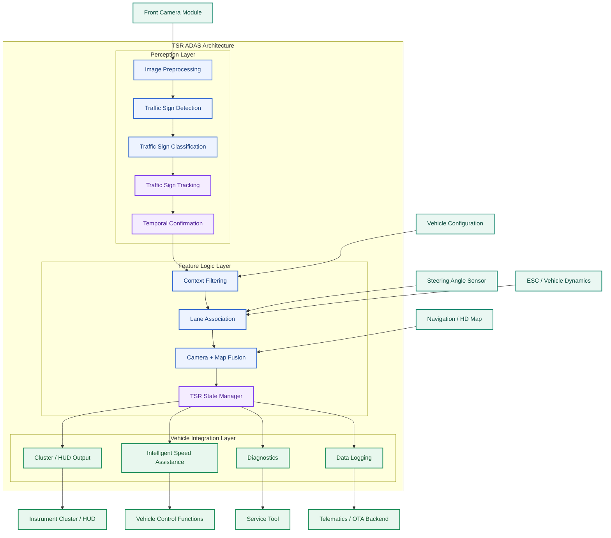
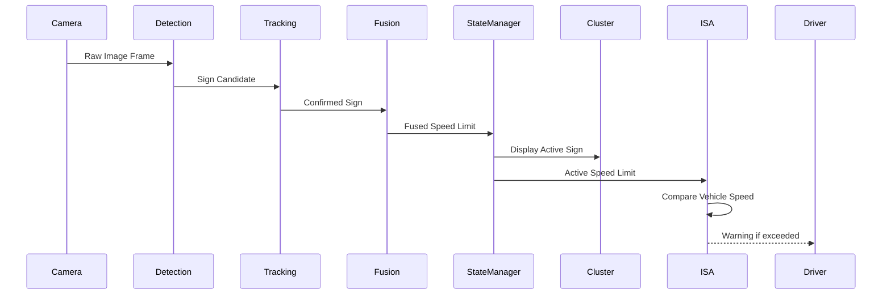

# TSR System Architecture

## Tổng quan kiến trúc

Kiến trúc TSR (Traffic Sign Recognition) trong hệ thống ADAS production thường được chia thành 3 lớp chính:

1. **Perception Layer**
   - Chịu trách nhiệm nhận biết biển báo từ dữ liệu cảm biến.
   - Bao gồm detection, classification, tracking và temporal confirmation.

2. **Feature Logic Layer**
   - Quyết định biển báo nào thực sự áp dụng cho xe.
   - Bao gồm context filtering, lane association, map fusion và state management.

3. **Vehicle Integration Layer**
   - Tích hợp với các ECU khác trên xe.
   - Cung cấp thông tin cho HMI, ISA, Diagnostics và Data Logging.

## Legend màu Mermaid

> Legend này áp dụng cho sơ đồ Mermaid trong file này.

| Màu | Vai trò | Ý nghĩa |
|---|---|---|
|  | `feature` | Perception, context, fusion, hoặc processing core của TSR |
|  | `temporal` | Tracking, temporal confirmation, hoặc state-oriented block |
|  | `source` | Sensor hoặc input source đi vào kiến trúc |
|  | `integration` | Output HMI, ISA, diagnostics, logging, hoặc đầu ra hệ thống |

---

## TSR Architecture Diagram

---

# Component Description

| Component | Chức năng | Input | Output | Ví dụ |
|------------|------------|------------|------------|------------|
| Front Camera Module | Thu nhận hình ảnh phía trước xe | Road scene | Raw image frames | 1920×1080 RGB image |
| Navigation / HD Map | Cung cấp dữ liệu bản đồ và giới hạn tốc độ | GPS position | Map speed limit | 60 km/h |
| Steering Angle Sensor | Cung cấp góc đánh lái | Steering wheel movement | Steering angle | +12° |
| ESC / Vehicle Dynamics | Cung cấp trạng thái chuyển động xe | Wheel sensors | Vehicle speed, yaw rate | 58 km/h, 0.02 rad/s |
| Vehicle Configuration | Cấu hình thị trường và tính năng | Calibration data | Feature configuration | VN market profile |

---

# Perception Layer

## 1. Image Preprocessing

| Thuộc tính | Nội dung |
|------------|------------|
| Mục tiêu | Chuẩn hóa ảnh trước khi inference |
| Input | Raw camera image |
| Output | Processed image |
| Chức năng | Resize, normalize, color conversion, contrast enhancement |
| Ví dụ | RGB → BGR, CLAHE, resize 1280×720 |

### Giải thích

Đây là bước đầu tiên của pipeline TSR.

Mục tiêu là giảm ảnh hưởng của:
- Ánh sáng yếu
- Nhiễu cảm biến
- Chênh lệch độ tương phản

---

## 2. Traffic Sign Detection

| Thuộc tính | Nội dung |
|------------|------------|
| Mục tiêu | Tìm vị trí biển báo trong ảnh |
| Input | Processed image |
| Output | Bounding boxes |
| Chức năng | Object detection |
| Ví dụ | Speed Limit Sign tại (x=420,y=160,w=58,h=58) |

### Giải thích

Detection chỉ trả lời:

> Có biển báo ở đâu?

Chưa trả lời:

> Đó là biển báo gì?

---

## 3. Traffic Sign Classification

| Thuộc tính | Nội dung |
|------------|------------|
| Mục tiêu | Xác định loại biển báo |
| Input | ROI từ detector |
| Output | Sign class + confidence |
| Chức năng | Classification |
| Ví dụ | Speed Limit 60, confidence 0.94 |

### Giải thích

Classifier xác định:

- Stop
- Speed Limit 60
- Speed Limit 80
- No Entry
- Yield

---

## 4. Traffic Sign Tracking

| Thuộc tính | Nội dung |
|------------|------------|
| Mục tiêu | Theo dõi biển báo qua nhiều frame |
| Input | Detection results |
| Output | Track ID |
| Chức năng | Multi-frame association |
| Ví dụ | Track #25 tồn tại qua 15 frame |

### Giải thích

Tracking giúp:

- Giảm flicker
- Tăng stability
- Duy trì identity của biển báo

---

## 5. Temporal Confirmation

| Thuộc tính | Nội dung |
|------------|------------|
| Mục tiêu | Xác nhận biển báo theo thời gian |
| Input | Tracking history |
| Output | Confirmed sign |
| Chức năng | Temporal voting |
| Ví dụ | 8/10 frame đều nhận dạng Speed Limit 60 |

### Giải thích

Một detection duy nhất chưa đủ đáng tin.

Production TSR thường yêu cầu biển báo được quan sát trong nhiều frame liên tiếp trước khi kích hoạt.

---

# Feature Logic Layer

## 6. Context Filtering

| Thuộc tính | Nội dung |
|------------|------------|
| Mục tiêu | Loại bỏ biển báo không áp dụng |
| Input | Confirmed sign |
| Output | Relevant sign |
| Chức năng | Context reasoning |
| Ví dụ | Biển dành cho xe tải bị loại bỏ |

### Giải thích

Không phải mọi biển báo nhìn thấy đều áp dụng cho xe hiện tại.

Ví dụ:

- Truck Only
- Bus Lane
- Exit Ramp Speed Limit

---

## 7. Lane Association

| Thuộc tính | Nội dung |
|------------|------------|
| Mục tiêu | Xác định biển báo thuộc làn nào |
| Input | Sign position + lane geometry |
| Output | Lane-valid sign |
| Chức năng | Lane relevance evaluation |
| Ví dụ | Speed Limit chỉ áp dụng làn bên trái |

### Giải thích

Một biển báo có thể áp dụng cho:

- Làn hiện tại
- Làn kế bên
- Đường nhánh

TSR phải xác định chính xác phạm vi áp dụng.

---

## 8. Camera + Map Fusion

| Thuộc tính | Nội dung |
|------------|------------|
| Mục tiêu | Hợp nhất perception và map |
| Input | Camera sign + Map sign |
| Output | Fused sign |
| Chức năng | Sensor fusion |
| Ví dụ | Camera=60, Map=60 |

### Giải thích

Camera:

- Chính xác với thay đổi tạm thời

Map:

- Ổn định
- Có phạm vi phủ lớn

Fusion tận dụng ưu điểm của cả hai.

---

## 9. TSR State Manager

| Thuộc tính | Nội dung |
|------------|------------|
| Mục tiêu | Quản lý vòng đời biển báo |
| Input | Fused sign |
| Output | Active sign |
| Chức năng | State machine |
| Ví dụ | Speed Limit 60 vẫn còn hiệu lực |

### Giải thích

State Manager tránh hiện tượng:

- Sign xuất hiện rồi biến mất ngay
- Thay đổi liên tục giữa các giá trị tốc độ

---

# Vehicle Integration Layer

## 10. Cluster / HUD Output

| Thuộc tính | Nội dung |
|------------|------------|
| Mục tiêu | Hiển thị thông tin cho người lái |
| Input | Active sign |
| Output | HMI signal |
| Ví dụ | Hiển thị biển 60 km/h |

---

## 11. Intelligent Speed Assistance (ISA)

| Thuộc tính | Nội dung |
|------------|------------|
| Mục tiêu | Hỗ trợ tuân thủ giới hạn tốc độ |
| Input | Active speed limit |
| Output | Warning / control request |
| Ví dụ | Xe chạy 72 km/h trong vùng 60 km/h |

### Giải thích

ISA có thể:

- Cảnh báo
- Rung vô lăng
- Giới hạn ga
- Hỗ trợ giảm tốc

Tùy OEM và regulation.

---

## 12. Diagnostics

| Thuộc tính | Nội dung |
|------------|------------|
| Mục tiêu | Giám sát sức khỏe hệ thống |
| Input | Internal status |
| Output | DTC |
| Ví dụ | Camera timeout |

---

## 13. Data Logging

| Thuộc tính | Nội dung |
|------------|------------|
| Mục tiêu | Thu thập dữ liệu debug |
| Input | Runtime data |
| Output | Log package |
| Ví dụ | Video clip + metadata |

---

# End-to-End Signal Flow

---

# Ví dụ thực tế

| Bước | Giá trị |
|--------|--------|
| Camera phát hiện biển | Speed Limit 60 |
| Tracking xác nhận | 12 frame liên tiếp |
| Context Filtering | Hợp lệ với xe con |
| Lane Association | Thuộc làn hiện tại |
| Map Fusion | Map cũng báo 60 |
| State Manager | Active Speed Limit = 60 |
| Cluster | Hiển thị 60 km/h |
| ISA | Cảnh báo nếu vượt tốc độ |

Kết quả cuối cùng:

Người lái nhìn thấy biển giới hạn tốc độ 60 km/h trên HUD hoặc Instrument Cluster, đồng thời ISA có thể phát cảnh báo khi tốc độ xe vượt quá ngưỡng cho phép.
