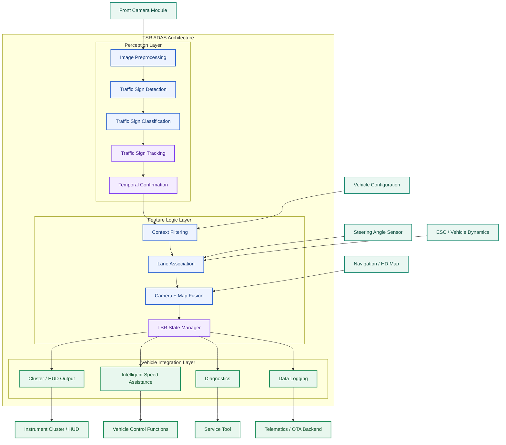
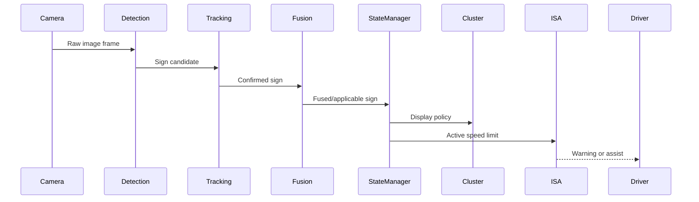

# TSR System Architecture

> **Thứ tự đọc:** 5 — visual appendix sau `research/1...`.  
> **File này trả lời:** các block kiến trúc TSR nối với nhau như thế nào ở mức nhìn nhanh.  
> **Ngoài phạm vi:** giải thích dài về production mindset, gap baseline hay roadmap; các phần đó nằm ở `1.research_tsr_three_part_unified.md`.

## Tổng quan kiến trúc

Kiến trúc TSR (Traffic Sign Recognition) trong hệ thống ADAS production thường được chia thành 3 lớp chính:

1. **Perception Layer**
   - Chịu trách nhiệm nhận biết biển báo từ dữ liệu cảm biến.
   - Bao gồm detection, classification, tracking và temporal confirmation.

2. **Feature Logic Layer**
   - Quyết định biển báo nào thực sự áp dụng cho xe.
   - Bao gồm context filtering, lane association, map fusion và state management.

3. **Vehicle Integration Layer**
   - Tích hợp với các ECU khác trên xe.
   - Cung cấp thông tin cho HMI, ISA, Diagnostics và Data Logging.

Phần narrative đầy đủ của 3 lớp này đã nằm trong `research/1...`; file này chỉ giữ sơ đồ và glossary ngắn để tra nhanh.

## Legend màu Mermaid

> Legend này áp dụng cho sơ đồ Mermaid trong file này.

| Màu | Vai trò | Ý nghĩa |
|---|---|---|
|  | `feature` | Perception, context, fusion, hoặc processing core của TSR |
|  | `temporal` | Tracking, temporal confirmation, hoặc state-oriented block |
|  | `source` | Sensor hoặc input source đi vào kiến trúc |
|  | `integration` | Output HMI, ISA, diagnostics, logging, hoặc đầu ra hệ thống |

---

## TSR Architecture Diagram

---

## Glossary nhanh theo block

### Input sources

| Block | Vai trò ngắn | Xem chi tiết ở đâu |
|---|---|---|
| `Front Camera Module` | Nguồn ảnh chính cho perception | `research/1...` Phần I–II |
| `Navigation / HD Map` | Nguồn speed limit/map context bổ sung | `research/1...` Phần II |
| `Steering Angle Sensor` + `ESC / Vehicle Dynamics` | Hỗ trợ lane/context/applicability | `research/1...` Phần II |
| `Vehicle Configuration` | Profile thị trường, policy, cấu hình feature | `research/1...` Phần I |

### Perception Layer

| Block | Vai trò ngắn | Repo hiện tại |
|---|---|---|
| `Image Preprocessing` | Chuẩn hóa ảnh đầu vào trước inference | Có bản tối giản trong `tsr_demo.py` |
| `Traffic Sign Detection` | Tìm bbox biển báo | Có YOLO baseline `best.pt` |
| `Traffic Sign Classification` | Gán class và confidence | Đi kèm detector baseline |
| `Traffic Sign Tracking` | Nối cùng một biển qua nhiều frame | **Chưa có thật**; repo mới có `hold` |
| `Temporal Confirmation` | Chỉ confirm khi bằng chứng theo thời gian đủ mạnh | **Chưa có thật** trong runtime chính |

### Feature Logic Layer

| Block | Vai trò ngắn | Repo hiện tại |
|---|---|---|
| `Context Filtering` | Loại sign không phù hợp bối cảnh ego | Chưa có |
| `Lane Association` | Quyết định sign áp cho làn nào | Chưa có |
| `Camera + Map Fusion` | Hòa giải camera với map/route context | Chưa có |
| `TSR State Manager` | Quản lý lifecycle `CANDIDATE -> ACTIVE -> STALE -> EXPIRED` | Chưa có |

### Vehicle Integration Layer

| Block | Vai trò ngắn | Repo hiện tại |
|---|---|---|
| `Cluster / HUD Output` | Chính sách hiển thị cho người lái | Repo chỉ có video overlay |
| `Intelligent Speed Assistance (ISA)` | Client dùng speed limit đã canonicalize | Chưa có |
| `Diagnostics` | DTC, health monitoring, fault handling | Chưa có |
| `Data Logging` | Event log để replay, RCA, regression | Chưa có machine-readable output |

## Luồng tín hiệu tối giản

## Ví dụ 1 dòng signal flow

| Bước | Ví dụ |
|---|---|
| Camera | Nhìn thấy biển `Speed Limit 60` |
| Tracking + confirmation | Xác nhận cùng sign qua nhiều frame |
| Context + lane | Kết luận biển áp cho ego lane |
| Map fusion | Đối chiếu với map speed limit |
| State manager | Giữ `Active speed limit = 60` |
| HMI / ISA | Hiển thị `60` và cảnh báo nếu ego vượt ngưỡng |

## Khi nào nên mở file khác?

| Nếu bạn cần... | Hãy mở |
|---|---|
| Câu chuyện hệ thống đầy đủ và roadmap production | [1.research_tsr_three_part_unified.md](1.research_tsr_three_part_unified.md) |
| Gap implementation của repo hiện tại | [2.research_tsr_baseline_analysis.md](2.research_tsr_baseline_analysis.md) |
| Trade-off detector, small-object, edge deploy | [3.research_tsr_detection_architecture_research.md](3.research_tsr_detection_architecture_research.md) |
| Demo stateful replay trên Colab | [4.research_tsr_colab_production_lite_demo.md](4.research_tsr_colab_production_lite_demo.md) |
