# Development of a Basic Traffic Sign Recognition (TSR) System
## Part 1 — Executive Summary, ADAS Fundamentals, Problem Statement

---

# Slide 1
# Development of a Basic Traffic Sign Recognition (TSR) System

### Subtitle

From Computer Vision Prototype to Automotive ADAS Feature

### Display

- Company Training Program
- Team Members
- Date
- Traffic Sign Images
- ADAS Camera Image

### Speaker Notes

Xin chào mọi người.

Trong bài trình bày này, nhóm sẽ giới thiệu quá trình xây dựng một hệ thống Traffic Sign Recognition (TSR) cơ bản từ video thực tế.

Bên cạnh việc triển khai prototype, nhóm cũng nghiên cứu cách TSR được triển khai trong các hệ thống ADAS production hiện đại nhằm hiểu rõ khoảng cách giữa bài toán học thuật và bài toán thực tế trong automotive.

---

# Slide 2
# Agenda

### Display

1. TSR in ADAS
2. Problem Statement
3. Dataset & Setup
4. Prototype Architecture
5. Detection & Recognition
6. Experimental Results
7. Gap Analysis
8. Production TSR
9. Roadmap

### Speaker Notes

Bài trình bày được chia thành 9 phần.

Đầu tiên chúng ta sẽ tìm hiểu vai trò của TSR trong ADAS, sau đó đi qua kiến trúc prototype, kết quả thực nghiệm và cuối cùng là góc nhìn production automotive.

---

# Slide 3
# Executive Summary

### Display

Project Goal

```text
Detect
Recognize
Visualize
Warn
```

Current Achievement

```text
Traffic Sign Detection
Traffic Sign Recognition
Video Annotation
Warning Notification
```

Future Direction

```text
Tracking
Map Fusion
State Management
ISA
```

### Speaker Notes

Prototype hiện tại đã hoàn thành đầy đủ yêu cầu bài tập.

Tuy nhiên đây mới chỉ là bước đầu của một hệ thống TSR hoàn chỉnh.

Nhóm cũng nghiên cứu các thành phần còn thiếu để tiến tới kiến trúc production.

---

# Slide 4
# What is Traffic Sign Recognition?

### Display

Definition:

Traffic Sign Recognition (TSR) is a perception feature that detects and interprets road signs from camera images.

Images:

- Stop Sign
- Speed Limit
- No Entry
- Warning Sign

### Speaker Notes

TSR là một chức năng perception sử dụng camera để phát hiện và hiểu các biển báo giao thông xuất hiện trên đường.

Thông tin này được sử dụng để hỗ trợ người lái hoặc các chức năng ADAS khác.

---

# Slide 5
# Why Traffic Signs Matter

### Display

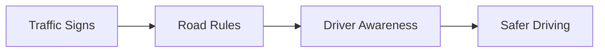

### Speaker Notes

Biển báo giao thông truyền tải các quy tắc và cảnh báo quan trọng cho người tham gia giao thông.

Nếu xe có thể hiểu các biển báo này, xe có thể hỗ trợ người lái đưa ra quyết định chính xác hơn.

---

# Slide 6
# TSR Position in ADAS

### Display

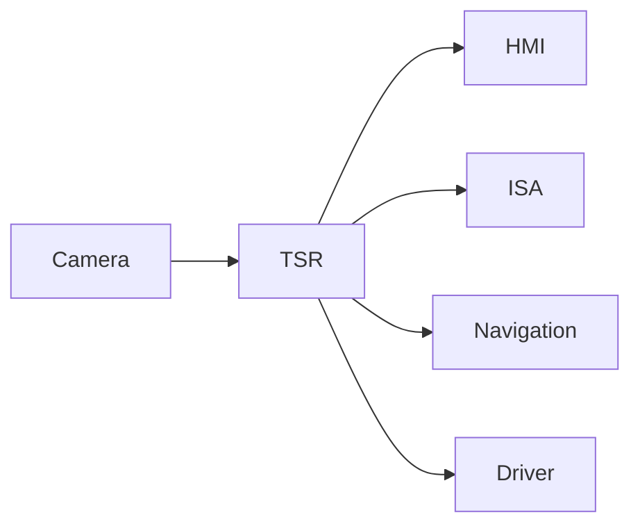

### Speaker Notes

TSR không phải là một hệ thống độc lập.

Nó là một perception feature nằm trong hệ sinh thái ADAS và cung cấp thông tin cho nhiều hệ thống khác.

---

# Slide 7
# Typical TSR Use Cases

### Display

| Use Case | Example |
|-----------|----------|
| Speed Limit Recognition | 80 km/h |
| Stop Sign Recognition | Stop |
| No Entry Recognition | No Entry |
| Warning Sign Recognition | Curve Ahead |

### Speaker Notes

Một hệ thống TSR cơ bản cần có khả năng nhận diện các loại biển báo phổ biến nhất.

Trong phạm vi đề tài, nhóm tập trung vào các biển báo thường gặp trong giao thông thực tế.

---

# Slide 8
# Traffic Sign Categories

### Display

| Category | Examples |
|-----------|----------|
| Regulatory | Speed Limit, Stop |
| Prohibitory | No Entry |
| Warning | Curve, Pedestrian Crossing |
| Informational | Direction Signs |

### Speaker Notes

Biển báo giao thông có thể được chia thành nhiều nhóm khác nhau.

Việc phân nhóm giúp đơn giản hóa quá trình nhận dạng.

---

# Slide 9
# Challenges in TSR

### Display

Images:

- Small Sign
- Motion Blur
- Rain
- Night
- Glare

### Speaker Notes

TSR là bài toán khó vì biển báo thường xuất hiện rất nhỏ trong ảnh.

Ngoài ra còn có các yếu tố như chuyển động, thời tiết, ánh sáng và vật cản.

---

# Slide 10
# Real-World Challenges

### Display

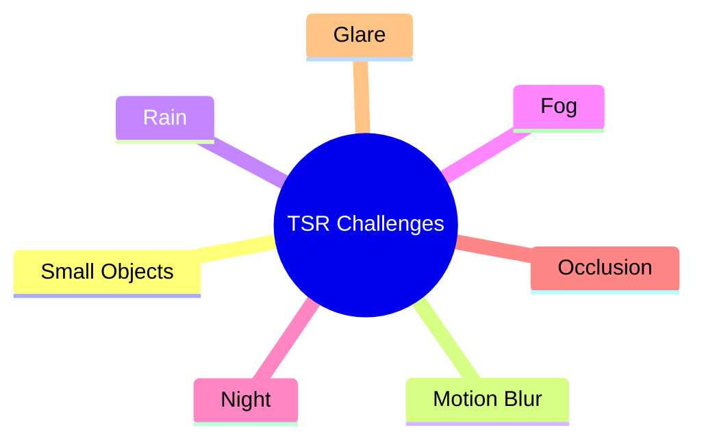

### Speaker Notes

Những yếu tố này làm giảm chất lượng hình ảnh và ảnh hưởng trực tiếp tới hiệu quả nhận dạng.

Đây là những vấn đề mà các hệ thống production phải giải quyết.

---

# Slide 11
# Problem Statement

### Display

Project Requirements

✓ Read Input Video

✓ Detect Traffic Signs

✓ Recognize Sign Type

✓ Display Bounding Box

✓ Generate Warning

✓ Save Output Video

### Speaker Notes

Đây là các yêu cầu chức năng chính được giao cho nhóm.

Toàn bộ pipeline được thiết kế để đáp ứng các yêu cầu này.

---

# Slide 12
# Project Scope

### Display

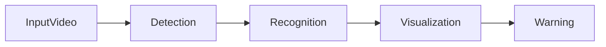

### Speaker Notes

Trong phạm vi dự án, nhóm tập trung vào phần perception cơ bản.

Các thành phần nâng cao như tracking hay map fusion chưa được triển khai.

---

# Slide 13
# Deliverables

### Display

| Deliverable | Description |
|-------------|-------------|
| Python Code | TSR Prototype |
| Output Video | Detection Results |
| PowerPoint | Technical Presentation |
| Documentation | Design & Analysis |

### Speaker Notes

Các sản phẩm đầu ra bao gồm mã nguồn, video kết quả và tài liệu báo cáo kỹ thuật.

---

# Slide 14
# Success Criteria

### Display

System should:

- Detect signs correctly
- Recognize sign type
- Display labels
- Generate warnings
- Process video successfully

### Speaker Notes

Nhóm xác định các tiêu chí đánh giá thành công của hệ thống dựa trên yêu cầu đề bài.

---

# Slide 15
# From Prototype to Production

### Display

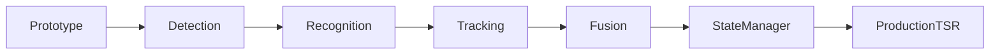

### Speaker Notes

Sau khi hoàn thành prototype, câu hỏi tiếp theo là:

Làm thế nào để phát triển thành một hệ thống TSR production thực sự?

Đây sẽ là nội dung của các phần tiếp theo trong bài trình bày.

# Part 2 — Dataset, Experimental Setup, System Architecture
## Slides 16–30

---

# Slide 16
# Dataset Collection Strategy

### Display

Dataset Sources

- Self-recorded videos
- Urban roads
- Campus roads
- Residential areas

Requirements

- Multiple traffic signs
- Different lighting conditions
- Different distances

### Speaker Notes

Theo yêu cầu đề bài, nhóm sử dụng các video tự thu thập thay vì các dataset công khai.

Điều này giúp đánh giá hệ thống trên các tình huống gần với điều kiện vận hành thực tế hơn.

Nhóm cố gắng thu thập dữ liệu trong nhiều điều kiện môi trường khác nhau.

---

# Slide 17
# Dataset Overview

### Display

| Video | Duration | Resolution | Conditions |
|---------|---------|---------|---------|
| Video 1 | xx s | 1920×1080 | Sunny |
| Video 2 | xx s | 1920×1080 | Cloudy |
| Video 3 | xx s | 1920×1080 | Mixed |

Insert representative thumbnails.

### Speaker Notes

Bảng này tóm tắt các video được sử dụng trong quá trình thử nghiệm.

Mỗi video đại diện cho một nhóm điều kiện môi trường khác nhau.

---

# Slide 18
# Example Input Frames

### Display

Grid of images:

- Frame 1
- Frame 2
- Frame 3
- Frame 4

Highlight traffic signs.

### Speaker Notes

Đây là một số khung hình mẫu được trích xuất từ video đầu vào.

Có thể thấy biển báo xuất hiện với kích thước và điều kiện ánh sáng khác nhau.

---

# Slide 19
# Experimental Environment

### Display

| Component | Specification |
|------------|------------|
| OS | Windows/Linux |
| IDE | VS Code |
| Language | Python |
| OpenCV | Version |
| NumPy | Version |

### Speaker Notes

Nhóm sử dụng Python và OpenCV để triển khai toàn bộ pipeline.

Các thư viện được lựa chọn nhằm đơn giản hóa việc phát triển và thử nghiệm.

---

# Slide 20
# Development Workflow

### Display

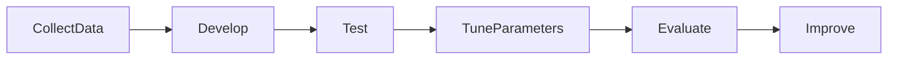

### Speaker Notes

Quá trình phát triển được thực hiện theo vòng lặp liên tục.

Sau mỗi lần đánh giá, nhóm điều chỉnh tham số và cải thiện hệ thống.

---

# Slide 21
# System Overview

### Display

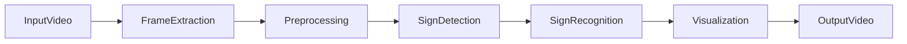

### Speaker Notes

Đây là kiến trúc tổng thể của hệ thống TSR được triển khai trong dự án.

Mỗi khung hình sẽ đi qua chuỗi xử lý từ tiền xử lý đến nhận dạng và hiển thị kết quả.

---

# Slide 22
# End-to-End Processing Pipeline

### Display

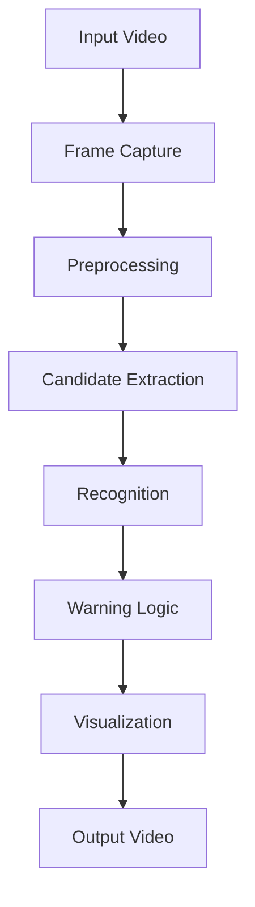

### Speaker Notes

Pipeline này thể hiện toàn bộ luồng xử lý từ video đầu vào đến video kết quả.

Mỗi khối đảm nhận một nhiệm vụ riêng biệt.

---

# Slide 23
# Detailed Architecture

### Display

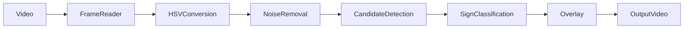

### Speaker Notes

Đây là phiên bản chi tiết hơn của pipeline.

Các bước được triển khai tuần tự trên từng frame.

---

# Slide 24
# Why Preprocessing?

### Display

Problems

- Noise
- Shadows
- Low Contrast
- Color Variations

Solutions

- Gaussian Blur
- Histogram Equalization
- HSV Conversion

### Speaker Notes

Tiền xử lý giúp cải thiện chất lượng ảnh trước khi thực hiện phát hiện biển báo.

Nếu bỏ qua bước này, độ chính xác của hệ thống sẽ giảm đáng kể.

---

# Slide 25
# Preprocessing Pipeline

### Display

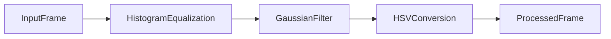

### Speaker Notes

Frame đầu vào được xử lý qua nhiều bước nhằm tăng độ ổn định của hệ thống.

HSV được sử dụng vì phù hợp cho các bài toán phân đoạn màu.

---

# Slide 26
# Why HSV Color Space?

### Display

RGB vs HSV

| RGB | HSV |
|------|------|
| Sensitive to lighting | More robust |
| Harder thresholding | Easier thresholding |
| Mixed color information | Separate hue information |

### Speaker Notes

HSV giúp tách thông tin màu sắc khỏi độ sáng.

Điều này rất hữu ích khi phát hiện các biển báo có màu đặc trưng như đỏ hoặc xanh.

---

# Slide 27
# Traffic Sign Detection Strategy

### Display

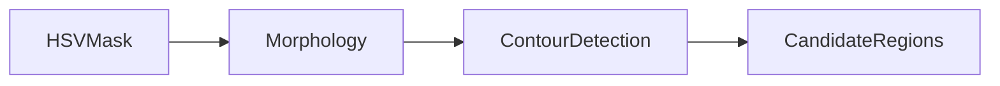

### Speaker Notes

Sau khi tạo mask màu, hệ thống sử dụng các phép morphology để làm sạch ảnh.

Các contour được trích xuất để xác định các vùng ứng viên chứa biển báo.

---

# Slide 28
# Morphological Operations

### Display

Operations

- Erosion
- Dilation
- Opening
- Closing

Illustration

Noise

↓

Clean Mask

### Speaker Notes

Các phép toán hình thái học giúp loại bỏ nhiễu và cải thiện hình dạng của vùng đối tượng.

Đây là bước rất quan trọng trước khi tìm contour.

---

# Slide 29
# Contour Detection

### Display

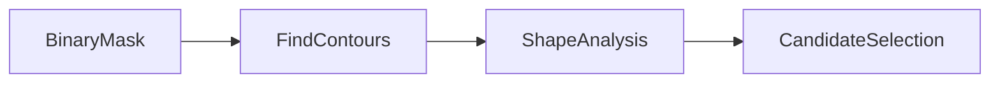

### Speaker Notes

Contour detection giúp xác định biên của các vùng đối tượng.

Sau đó các đặc trưng hình học được sử dụng để đánh giá khả năng đây là biển báo.

---

# Slide 30
# Transition to Recognition

### Display

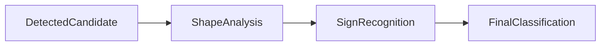

Questions:

- What sign is it?
- Speed Limit?
- Stop?
- No Entry?

### Speaker Notes

Sau khi tìm được các vùng ứng viên, nhiệm vụ tiếp theo là xác định chính xác loại biển báo.

Phần tiếp theo sẽ trình bày chi tiết các phương pháp nhận dạng và phân loại biển báo.

# Part 3 — Detection, Recognition, Results & Evaluation
## Slides 31–43

---

# Slide 31
# Traffic Sign Recognition Stage

### Display

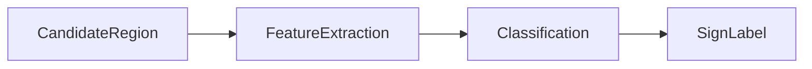

Recognition Input:

- Candidate ROI
- Shape Information
- Color Information

Recognition Output:

- Traffic Sign Class
- Confidence

### Speaker Notes

Sau khi phát hiện được vùng ứng viên chứa biển báo, hệ thống cần xác định biển báo đó thuộc loại nào.

Đây là bước chuyển đổi từ "có biển báo" sang "biển báo gì".

---

# Slide 32
# Recognition Method

### Display

Recognition Approaches

| Method | Advantages | Limitations |
|----------|----------|----------|
| Template Matching | Simple | Sensitive to scale |
| Shape Analysis | Fast | Limited accuracy |
| Feature Matching | More robust | Higher complexity |
| Deep Learning | Highest accuracy | Requires training |

Highlighted:

✓ Template Matching

### Speaker Notes

Trong phạm vi đề tài, nhóm lựa chọn Template Matching do tính đơn giản và phù hợp với yêu cầu môn học.

Các phương pháp Deep Learning sẽ được thảo luận ở phần mở rộng.

---

# Slide 33
# Template Matching Workflow

### Display

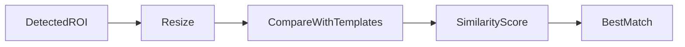

### Speaker Notes

Mỗi vùng ứng viên được chuẩn hóa kích thước.

Sau đó hệ thống so sánh với các mẫu biển báo đã được chuẩn bị trước.

Biển báo có độ tương đồng cao nhất sẽ được chọn.

---

# Slide 34
# Supported Traffic Sign Classes

### Display

| Class ID | Traffic Sign |
|-----------|-----------|
| 0 | Stop |
| 1 | Speed Limit |
| 2 | No Entry |
| 3 | Warning Sign |
| 4 | Pedestrian Crossing |

Insert example images.

### Speaker Notes

Danh sách các lớp biển báo phụ thuộc vào dữ liệu thu thập và template được xây dựng.

Đây là các loại biển báo được hỗ trợ trong prototype hiện tại.

---

# Slide 35
# Visualization Pipeline

### Display

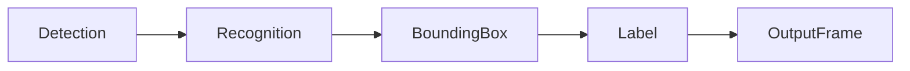

Example:

[Bounding Box]

STOP

### Speaker Notes

Sau khi nhận dạng thành công, hệ thống sẽ hiển thị kết quả trực tiếp lên frame.

Điều này giúp người dùng dễ dàng quan sát và đánh giá chất lượng nhận dạng.

---

# Slide 36
# Warning Generation Logic

### Display

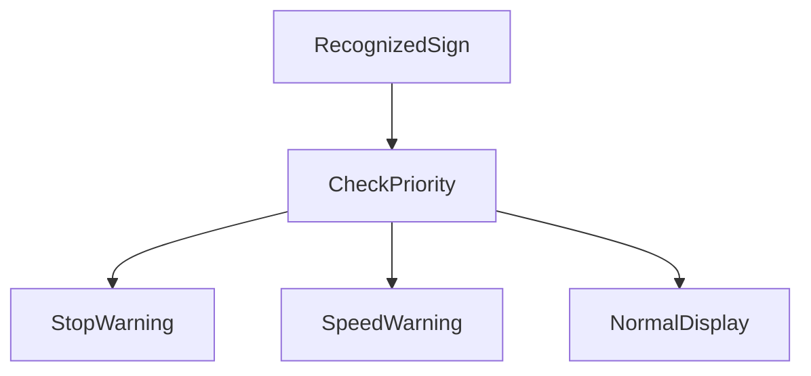

### Speaker Notes

Một số biển báo có mức độ ưu tiên cao hơn.

Ví dụ biển Stop hoặc biển giới hạn tốc độ sẽ kích hoạt cơ chế cảnh báo.

---

# Slide 37
# Example Detection Results

### Display

Insert screenshots:

- Stop Sign
- Speed Limit
- No Entry

Include:

- Bounding Box
- Label

### Speaker Notes

Đây là các ví dụ nhận dạng thành công trong tập dữ liệu thử nghiệm.

Có thể thấy hệ thống xác định đúng vị trí và loại biển báo.

---

# Slide 38
# End-to-End Example

### Display

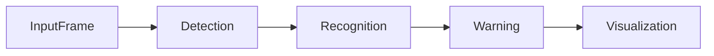

Example:

Speed Limit 60

↓

Warning Generated

↓

Displayed on Screen

### Speaker Notes

Slide này minh họa toàn bộ quá trình xử lý của một biển báo từ lúc xuất hiện trong frame đến khi được hiển thị cho người dùng.

---

# Slide 39
# Success Cases

### Display

| Scenario | Result |
|-----------|-----------|
| Large Sign | Success |
| Good Lighting | Success |
| Front Facing Sign | Success |
| Clear Background | Success |

Insert sample images.

### Speaker Notes

Hệ thống hoạt động tốt trong các tình huống có điều kiện quan sát thuận lợi.

---

# Slide 40
# Failure Cases

### Display

| Scenario | Issue |
|-----------|-----------|
| Small Sign | Miss Detection |
| Motion Blur | Wrong Classification |
| Partial Occlusion | Detection Failure |
| Backlight | Reduced Accuracy |

Insert failure screenshots.

### Speaker Notes

Các tình huống này thể hiện giới hạn hiện tại của hệ thống.

Đây cũng là những thách thức phổ biến trong TSR thực tế.

---

# Slide 41
# Root Cause Analysis

### Display

```mermaid
fishbone

RootCause
    Lighting
        Night
        Glare
        Shadow

    Environment
        Rain
        Fog
        Dirt

    Sign
        Small
        Occluded

    Camera
        Blur
        Motion
```

### Speaker Notes

Phân tích nguyên nhân thất bại giúp xác định các hướng cải tiến tiếp theo.

Nhiều lỗi không xuất phát từ thuật toán mà đến từ điều kiện môi trường.

---

# Slide 42
# Quantitative Evaluation

### Display

| Metric | Value |
|----------|----------|
| Total Frames | XXX |
| Signs Detected | XXX |
| Correct Recognition | XXX |
| Detection Rate | XX% |
| Recognition Rate | XX% |

### Speaker Notes

Các chỉ số này cung cấp góc nhìn định lượng về hiệu suất hệ thống.

Nhóm có thể thay thế bằng số liệu thực tế sau khi hoàn thành thử nghiệm.

---

# Slide 43
# Evaluation Summary

### Display

Strengths

✓ Easy to implement

✓ Fast processing

✓ Good performance in simple scenarios

Limitations

✗ Lighting sensitivity

✗ Small object difficulty

✗ No temporal tracking

✗ No context understanding

### Speaker Notes

Prototype đã hoàn thành mục tiêu của bài tập và chứng minh được tính khả thi của hệ thống TSR cơ bản.

Tuy nhiên, vẫn còn khoảng cách lớn giữa prototype hiện tại và một hệ thống TSR production trong automotive.

Trong phần tiếp theo, chúng ta sẽ phân tích các khoảng cách này và nghiên cứu kiến trúc TSR thực tế trên xe.

# Part 4 — Gap Analysis, Production TSR, Embedded Architecture & Roadmap
## Slides 44–58

---

# Slide 44
# Prototype vs Production TSR

### Display

| Capability | Prototype | Production TSR |
|------------|------------|------------|
| Detection | ✓ | ✓ |
| Recognition | ✓ | ✓ |
| Tracking | ✗ | ✓ |
| Temporal Fusion | ✗ | ✓ |
| Context Filtering | ✗ | ✓ |
| Lane Association | ✗ | ✓ |
| Map Fusion | ✗ | ✓ |
| State Manager | ✗ | ✓ |
| ISA Integration | ✗ | ✓ |
| Diagnostics | ✗ | ✓ |
| Health Monitoring | ✗ | ✓ |

### Speaker Notes

Prototype hiện tại mới giải quyết hai bài toán đầu tiên:

- Detection
- Recognition

Trong khi hệ thống TSR trên xe thương mại bao gồm nhiều lớp xử lý bổ sung nhằm đảm bảo tính ổn định và độ tin cậy.

---

# Slide 45
# Why Production TSR Is Hard

### Display

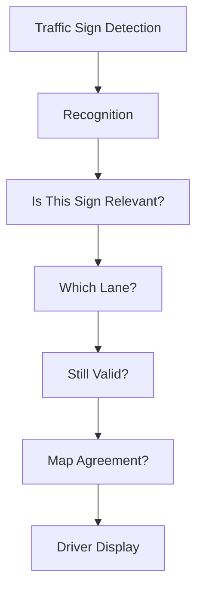

### Speaker Notes

Trong môi trường thực tế, phát hiện đúng biển báo chưa đủ.

Hệ thống còn phải trả lời:

- Biển báo này có áp dụng cho xe không?
- Có thuộc làn hiện tại không?
- Có còn hiệu lực không?
- Có phù hợp với bản đồ không?

---

# Slide 46
# Production TSR Signal Flow

### Display

```mermaid
flowchart LR

RoadScene

--> Camera

--> Detection

--> Tracking

--> TemporalFusion

--> ContextFiltering

--> LaneAssociation

--> MapFusion

--> StateManager

--> HMI

StateManager

--> ISA
```

### Speaker Notes

Đây là luồng tín hiệu điển hình của TSR production.

Phần lớn độ phức tạp nằm sau bước Detection.

---

# Slide 47
# Tracking

### Display

```mermaid
flowchart LR

Frame1

--> SignID42

Frame2

--> SignID42

Frame3

--> SignID42
```

Benefits:

- Stable recognition
- Reduced flicker
- Better confidence

### Speaker Notes

Tracking giúp liên kết cùng một biển báo qua nhiều frame.

Nhờ đó hệ thống tránh hiện tượng nhấp nháy khi biển báo chỉ xuất hiện trong thời gian ngắn.

---

# Slide 48
# Temporal Fusion

### Display

```mermaid
flowchart LR

Detection1

--> Fusion

Detection2

--> Fusion

Detection3

--> Fusion

Fusion

--> ConfirmedSign
```

### Speaker Notes

Thay vì tin vào một frame duy nhất, production TSR tổng hợp thông tin từ nhiều frame liên tiếp.

Điều này giúp giảm false positive.

---

# Slide 49
# Context Filtering

### Display

Example:

```text
Parking Sign
Truck Sign
Construction Sign
```

↓

Not Relevant To Ego Vehicle

### Speaker Notes

Không phải mọi biển báo nhìn thấy đều áp dụng cho xe hiện tại.

Context Filtering loại bỏ các biển báo không liên quan nhằm tránh hiển thị sai cho người lái.

---

# Slide 50
# Lane Association

### Display

```mermaid
flowchart TD

TrafficSign

--> DetermineLane

DetermineLane

--> EgoLane

DetermineLane

--> AdjacentLane
```

### Speaker Notes

Một biển giới hạn tốc độ có thể chỉ áp dụng cho một làn cụ thể.

Lane Association giúp xác định biển báo có liên quan tới làn xe hiện tại hay không.

---

# Slide 51
# Camera + Map Fusion

### Display

```mermaid
flowchart LR

CameraTSR

--> Fusion

HDMap

--> Fusion

Fusion

--> FinalSpeedLimit
```

### Speaker Notes

Camera và bản đồ đều có điểm mạnh và điểm yếu.

Fusion cho phép kết hợp hai nguồn dữ liệu để tăng độ tin cậy.

---

# Slide 52
# State Manager

### Display

```mermaid
stateDiagram-v2

[*] --> NoSign

NoSign --> Candidate

Candidate --> Confirmed

Confirmed --> Active

Active --> Expired

Expired --> NoSign
```

### Speaker Notes

State Manager quản lý vòng đời của biển báo.

Điều này đảm bảo biển báo không biến mất hoặc thay đổi đột ngột trên HMI.

---

# Slide 53
# Intelligent Speed Assistance (ISA)

### Display

```mermaid
flowchart LR

TSR

--> ActiveSpeedLimit

--> ISA

ISA

--> DriverWarning

ISA

--> SpeedControl
```

### Speaker Notes

ISA là một trong những khách hàng lớn nhất của TSR.

Thông tin giới hạn tốc độ từ TSR có thể được sử dụng để cảnh báo hoặc hỗ trợ kiểm soát tốc độ.

---

# Slide 54
# Software Architecture

### Display

```mermaid
flowchart LR

CaptureTask

--> PreprocessTask

--> InferenceTask

--> TrackingTask

--> StateManager

--> HMI
```

### Speaker Notes

Trong production ECU, TSR không chạy dưới dạng một script duy nhất.

Hệ thống được chia thành nhiều task độc lập để dễ giám sát và bảo trì.

---

# Slide 55
# Health Monitoring

### Display

```mermaid
flowchart LR

Inference

--> HealthMonitor

Tracking

--> HealthMonitor

StateManager

--> HealthMonitor

HealthMonitor

--> DiagnosticSystem
```

### Speaker Notes

Mỗi module đều được giám sát.

Nếu phát hiện lỗi hoặc vi phạm timing budget, hệ thống sẽ tạo diagnostic event.

---

# Slide 56
# Degraded Operation

### Display

```mermaid
stateDiagram-v2

[*] --> NORMAL

NORMAL --> DEGRADED

DEGRADED --> RECOVERY

RECOVERY --> NORMAL

DEGRADED --> FAULT
```

### Speaker Notes

Một hệ thống production phải biết khi nào nó không còn đáng tin cậy.

Trong trường hợp này hệ thống chuyển sang trạng thái degraded thay vì tiếp tục hoạt động như bình thường.

---

# Slide 57
# Roadmap From Prototype to Production

### Display

```mermaid
flowchart LR

Prototype

--> Tracking

--> TemporalFusion

--> ContextFiltering

--> LaneAssociation

--> MapFusion

--> ISA

--> ProductionTSR
```

### Speaker Notes

Đây là lộ trình phát triển hợp lý nếu tiếp tục mở rộng prototype hiện tại.

Mỗi bước bổ sung thêm một lớp chức năng thường gặp trong TSR production.

---

# Slide 58
# Conclusion

### Display

Achievements

✓ Traffic Sign Detection

✓ Traffic Sign Recognition

✓ Visualization

✓ Warning Generation

Knowledge Gained

✓ ADAS Architecture

✓ Production TSR Pipeline

✓ Embedded Deployment Concepts

Future Work

✓ Tracking

✓ Fusion

✓ State Management

✓ Real-Time Deployment

### Speaker Notes

Nhóm đã xây dựng thành công một prototype TSR đáp ứng các yêu cầu cơ bản của bài tập.

Thông qua quá trình nghiên cứu, nhóm cũng hiểu rõ hơn kiến trúc TSR production trong automotive, các thách thức thực tế và lộ trình phát triển từ prototype sang hệ thống thương mại.

Xin cảm ơn mọi người đã lắng nghe.